# 建立、修改和發佈課程

若要瞭解如何在Learning Manager中建立課程、認證和學習計畫，請閱讀本文。

作者可建立學習物件，例如課程、認證和學習計畫。 學習者可以使用這些學習物件，而管理員則可以追蹤學習者的進度。

## Learning Manager中的課程 {#coursesincaptivateprime}

Adobe Learning Manager可讓作者使用一或多個與虛擬訓練、自控進度訓練、課堂訓練及活動相關的模組來建立課程。 管理員可以進一步使用這些課程建立課程例項、註冊學習者、指派徽章以及啟用這些課程的意見回饋。 他們也可以使用這些課程建立學習計畫、學習計畫和認證。

作者可以使用任何電子學習工具所建立的電子學習內容。 其他支援的課程格式包括視訊檔案、PDF、doc、docx、PPT和PPTX。

## 建立課程 — 基本工作流程 {#createacoursebasicworkflow}

若要建立課程，請遵循下列步驟：

1. 以作者身分登入Adobe Learning Manager，因為只有作者才有權建立課程。 現在，在[快速入門]頁面上按一下&#x200B;**[!UICONTROL Create Courses]**。
1. 在&#x200B;**課程總覽**&#x200B;頁面上，輸入課程名稱。 現在，輸入此課程的簡短說明，此說明會顯示在課程卡上。 此說明不能超過140個字元。 然後輸入課程的詳細概述，此詳細概述會顯示在「課程詳細資訊」頁面上。 說明不可超過1500個字元。

   身為作者，將模組新增至課程時，您可以看到模組的說明。

1. 若要讓您的課程提供其他語言版本，請按一下頁面左上角的「新增語言」。 選取您要讓課程可用的語言。 按一下&#x200B;**[!UICONTROL Save]**。 如需詳細資訊，請參閱[新增不同語言的內容](/help/migrated/authors/feature-summary/content-library.md)。
1. **修改課程設定**-

   1. 在「課程設定」頁面上，選擇課程的技能。 從「技能」下拉式清單中選擇所需的技能。 然後，從「層次」下拉式清單中選擇所需的層次。
   1. 選擇課程技能、等級，並設定該技能的學分。 如有需要，新增更多技能。
   1. 從&#x200B;**註冊型別**&#x200B;下拉式清單中，選擇註冊型別。

   註冊型別如下：

   * **指派的經理：**&#x200B;只有經理才能指派這些課程。 學習者無法註冊這些型別的課程。
   * **經理已核准：**&#x200B;經理已核准這些課程。 學習者可以註冊這些課程，但若未經經理核准，他們不會直接註冊這些型別的課程。 學習者註冊這些型別的課程時，會向經理傳送通知請求。 經理核准後，這些課程就會列為學習者的已註冊課程。
   * **自助註冊：**&#x200B;學習者可直接註冊這些型別的課程。

1. 若要儲存變更，請按一下&#x200B;**[!UICONTROL Save]**。 若要發佈課程，請按一下&#x200B;**[!UICONTROL Publish]**。

## 建立課程 — 進階工作流程 {#createacourseadvancedworkflow}

1. 以作者身分登入Adobe Learning Manager，因為只有作者才有權建立課程。 現在，在[快速入門]頁面上按一下&#x200B;**[!UICONTROL Create Courses]**。
1. 在&#x200B;**課程總覽**&#x200B;頁面上，輸入課程名稱。 現在，輸入此課程的簡短說明，此說明會顯示在課程卡上。 此說明不能超過140個字元。 然後輸入課程的詳細概述，此詳細概述會顯示在「課程詳細資訊」頁面上。 說明不可超過1500個字元。
1. 若要讓您的課程提供其他語言版本，請按一下頁面左上角的「新增語言」。 選取您要讓課程可用的語言。 按一下&#x200B;**[!UICONTROL Save]**。 如需詳細資訊，請參閱[新增不同語言的內容](/help/migrated/authors/feature-summary/content-library.md)。
1. **修改課程設定**-

   1. 在「課程設定」頁面上，選擇課程的技能。 從「技能」下拉式清單中選擇所需的技能。 然後，從「層次」下拉式清單中選擇所需的層次。
   1. 選擇課程技能、等級，並設定該技能的學分。 如有需要，新增更多技能。
   1. 如有需要，在課程中新增自訂合規性標籤。 請參閱[將規範標籤新增至課程/學習路徑/認證](/help/migrated/authors/feature-summary/courses.md#add-compliance-labels-to-courselearning-pathcertification)。
   1. 從&#x200B;**註冊型別**&#x200B;下拉式清單中，選擇註冊型別。

   註冊型別如下：

   * **指派的經理：**&#x200B;只有經理才能指派這些課程。 學習者無法註冊這些型別的課程。
   * **經理已核准：**&#x200B;經理已核准這些課程。 學習者可以註冊這些課程，但若未經經理核准，他們不會直接註冊這些型別的課程。 學習者註冊這些型別的課程時，會向經理傳送通知請求。 經理核准後，這些課程就會列為學習者的已註冊課程。
   * **自助註冊：**&#x200B;學習者可直接註冊這些型別的課程。

1. 選擇您要設定課程價格，還是免費提供。 如果您想要付費課程，請選擇選項&#x200B;**[!UICONTROL Paid]**，並指定價格。 然後，價格會顯示在學習者的「課程卡」和「課程總覽」頁面上。

   注意：只有在已設定Adobe Commerce聯結器時，才會啟用此功能。

1. 如果您想要讓學習者能夠自行取消註冊您的課程，請啟用核取方塊&#x200B;**學習者可以自行取消註冊**。

1. **執行個體組態**

   如果您啟用此選項，處於進行中狀態的學習者可以造訪其他例項並在那裡註冊。 學習者接著可以保留上一個執行個體的進度。

   發佈課程後，若返回「設定」頁面，即無法再編輯選項。

   您可以為下列課程型別啟用選項：

   * 自學
   * 教室
   * 活動
   * 混合

   備註：複製課程時，如果您已在來源課程中啟用「例項組態」選項，則目標課程中的選項仍會停用。

   **不支援**&#x200B;執行個體切換：

   * 付費課程
   * 經理指派的註冊型別課程。

   如果透過目錄共用，執行個體交換器組態將不會傳播到對等帳戶，目標課程中的選項仍會停用。

1. **多個註冊**

   使用此功能，您便可以在一個或不同的期間將學習者註冊到多個課程例項中。

   啟用切換&#x200B;**多重註冊**&#x200B;以切換學習者的各種課程註冊。 如果您已啟用執行個體切換，則無法使用多重註冊。

1. 選取參加課程前必須完成的必要課程。 按一下「課程」欄位，然後從課程清單中選擇。
1. 如果您希望我先決課程是必修課程，請啟用&#x200B;**啟用** **必要條件**&#x200B;核取方塊。
1. 新增關鍵字作為課程的相關標籤。 這些標籤可協助學習者在搜尋期間輕鬆找到您的課程。 所有這些標籤會根據我們新增的模組自動新增。 如果您有其他要新增至本課程的標籤，可以繼續並輸入。
1. 新增關鍵字作為課程的相關標籤。 這些標籤可協助學習者在搜尋期間輕鬆找到您的課程。 所有這些標籤會根據我們新增的模組自動新增。 如果您有其他要新增至本課程的標籤，可以繼續並輸入。
1. 在「自動處分」欄位中，選取課程處分的日期。 管理員必須先啟用「自動淘汰」選項。
1. 若要儲存變更，請按一下&#x200B;**[!UICONTROL Save]**。 若要發佈課程，請按一下&#x200B;**[!UICONTROL Publish]**。

### 將合規性標籤新增至課程/學習路徑/認證 {#add-custom-compliance-label}

若要將法規遵循標籤新增至課程，請遵循下列步驟：

1. 在作者應用程式中，移至&#x200B;**[!UICONTROL Courses]**/**[!UICONTROL Learning Paths]**/**[!UICONTROL Certifications]**&#x200B;並選取&#x200B;**[!UICONTROL Add]**。
1. 輸入名稱和其他詳細資訊，例如說明、技能。
1. 在&#x200B;**[!UICONTROL Custom compliance]**&#x200B;文字方塊中，輸入並選取規範標籤。

   
   _新增自訂合規性_

   >[!IMPORTANT]
   >
   >新增自訂合規性時，請務必設定課程的截止日期。

   >[!NOTE]
   >
   >對於自訂合規性型別標籤，最多50個課程、學習路徑或認證可以有相同的值。

1. 儲存並發佈課程/學習路徑/認證。
現在，課程/學習路徑/認證被視為合規性型別。 管理員可以將此課程新增至合規性控制面板，並與管理員共用以追蹤進度

>[!NOTE]
>
>作者也可以編輯合規性標籤，將其新增至現有的課程/學習路徑/認證。

## gamification點

您可以在課程和課程例項層級分配gamification點。 透過此專案，您可以將分數授予不同的課程或例項。 學習者被激勵參加特定課程或偏好特定課程例項，而不是其他人。

1. 在課程執行個體層級，選取&#x200B;**[!UICONTROL Gamification Points]**。

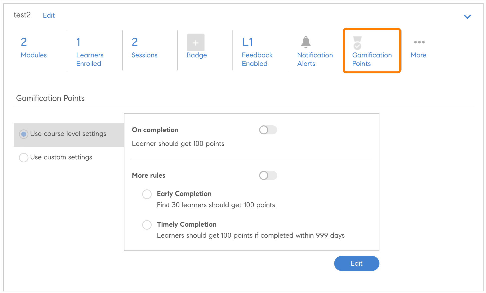

*為gamification設定點*

1. 選取&#x200B;**[!UICONTROL Edit]**。
1. 如果您選取「使用課程層級設定」 ，下列選項就會顯示：

   * **[!UICONTROL On completion]**：如果您希望學習者完成課程時能獲得100分，請選取此切換按鈕。
   * **更多規則**

      * **[!UICONTROL Early completion]**：如果您選取此專案，前30名學習者完成課程後會獲得100分。
      * **[!UICONTROL Timely completion]**：如果您選取此專案，在999天內完成課程的學習者會獲得100分。

1. 若您選取&#x200B;**[!UICONTROL Use custom settings]**，會顯示下列選項：

   * **[!UICONTROL On completion]**：如果您希望學習者完成課程時能獲得100分，請選取此切換按鈕。
   * **更多規則**

      * **[!UICONTROL Early completion]**：如果選取此專案，您可以決定會獲得指定分數的學習者數目。
      * **[!UICONTROL Timely completion]**：若您選取此項，您可以決定學員在指定時間內完成課程後可獲得的點數。

   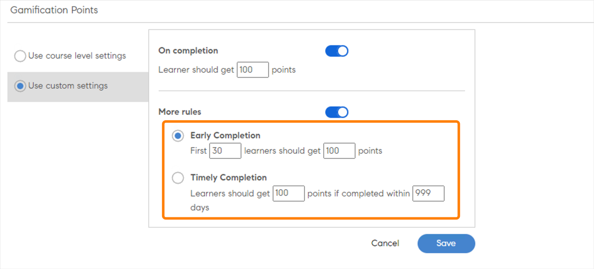

   *設定提早及時完成*

1. 選取&#x200B;**[!UICONTROL Save]**。

## 彙總學習資源

作者可以決定是要在學習計畫層級彙總學習資源，還是將其保留在個別課程層級。

身為作者，請選取「**[!UICONTROL Learning Path]** > **[!UICONTROL Settings]**」。 按一下&#x200B;**[!UICONTROL Edit]**。

在&#x200B;**[!UICONTROL Resources]**&#x200B;區段中，核取方塊「顯示於學習路徑層級彙總的組成課程資源」啟用時，會顯示課程層級的資源是否顯示於學習路徑層級。

>[!NOTE]
>
>在學習路徑的「設定」頁面上，管理員也可以啟用此選項，以顯示課程層級中顯示的資源，這些資源會顯示在學習路徑層級。

## 排程小幫手

管理預約講師和教室中的衝突。 若您想在指派任何講師參加課程前，先瞭解講師可用的時間和日期，請使用「排程小幫手」。

建立課程時，針對VC或CR課程，按一下「排程小幫手」。

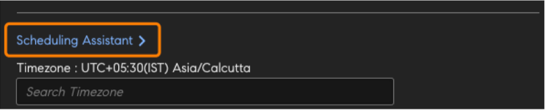

*啟動排程小幫手*

「排程小幫手」視窗會啟動。

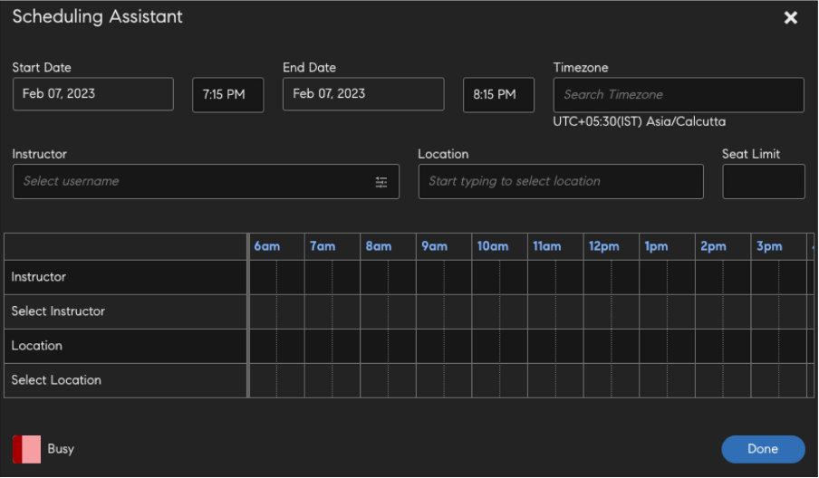

*排程助理對話方塊*

您可以在「排程小幫手」上執行下列作業：

* 依名稱搜尋講師。
* 依技能搜尋講師。

### 依名稱搜尋講師

在「講師」欄位中，輸入講師的姓名或搜尋部分講師名稱。 教師清單隨即出現，您可以從中選擇講師。

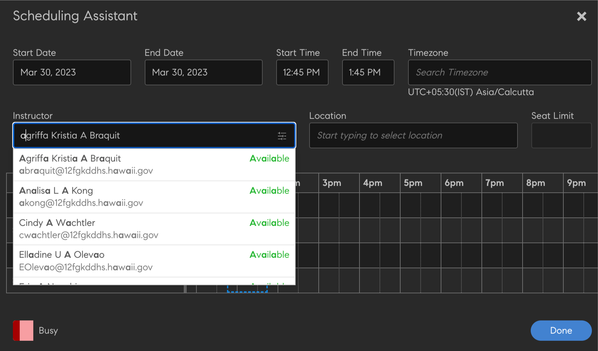

*搜尋講師*

可以選取多個講師，但一次只能指派一個講師。 選取的時間將在時間衝突視窗中反白顯示。 在講師附近，會出現一個十字圖示，按一下該圖示可移除講師。

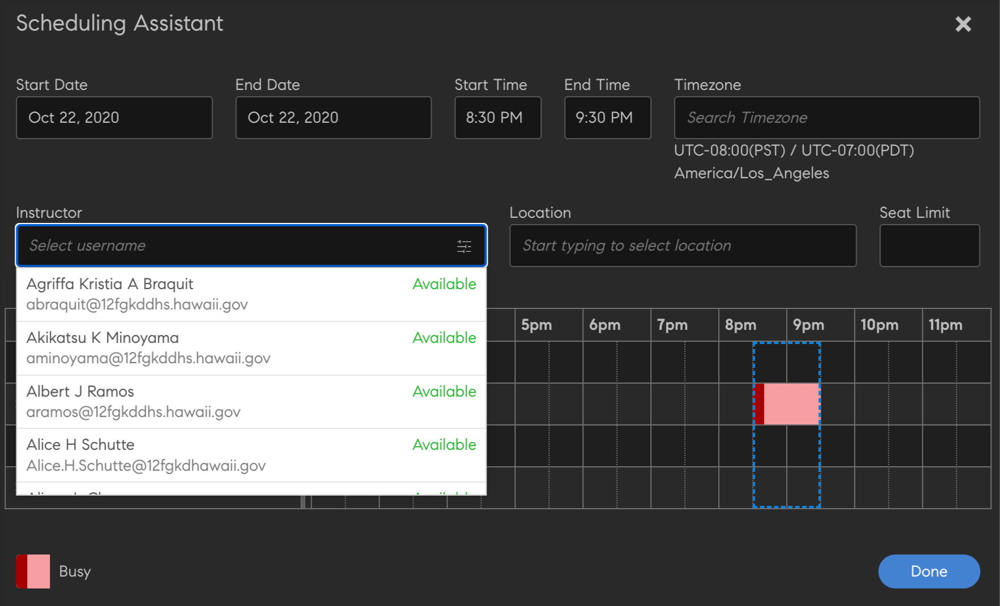

*搜尋多位講師*

### 依技能搜尋講師

搜尋具有單一或多個技能的講師。 搜尋會使用AND運運算元。

技能僅能按部分或完整技能名稱搜尋，不能按技能級別搜尋。

在「助理」上，輸入講師名稱、地點和名額限制。

您也可以搜尋技能，按一下「講師」搜尋方塊右側的篩選圖示後就會顯示。 底下熒幕擷圖顯示按鈕。

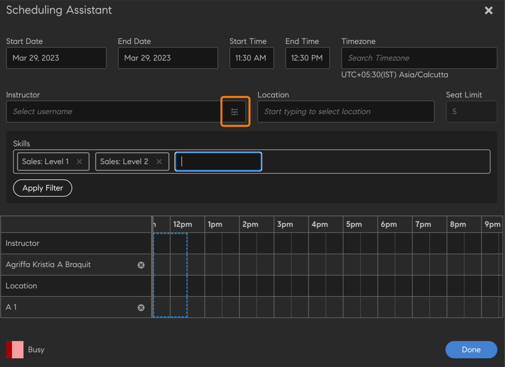

*依技能搜尋講師*

### 使用者群組篩選器

在「講師」欄位中選取篩選器。 有&#x200B;**[!UICONTROL User Group]**&#x200B;個篩選器，作者或自訂作者可使用使用者群組中的值找到合適的講師。

如果同時套用這兩個篩選器，則會顯示屬於使用者群組且具備所選技能的講師清單。

這會套用至「課程」或「例項」頁面上的「排程小幫手」。

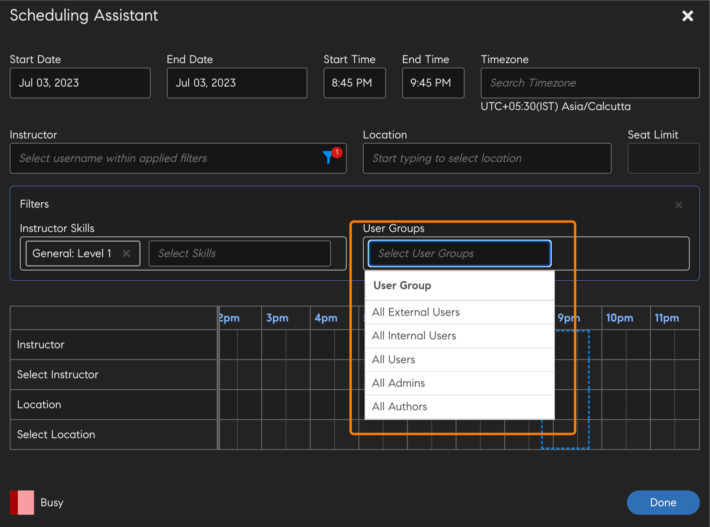

*依使用者群組篩選*

### 執行處理頁面

您也可以從「執行處理」頁面存取「排程小幫手」，如下所示。

「排程小幫手」也可在「執行個體」頁面上供管理員和自訂管理員/作者使用。

從執行個體頁面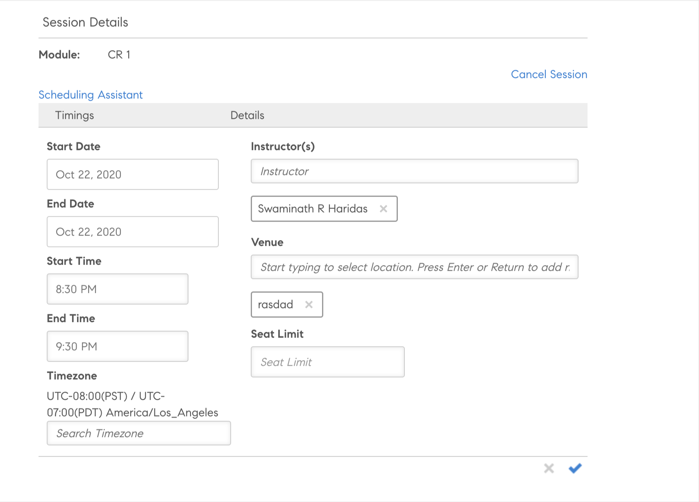

*從執行個體頁面排程講師*

### 搜尋位置

您可以在模組與「排程小幫手」頁面上同時指定教室名稱與地點區域名稱，以搜尋地點。

## RTF格式

建立課程、學習計畫、認證或工作輔助時，作者可輸入不同型別的內容（如文字、影像），或套用各種文字格式選項。

建立課程時，您可以在課程概述欄位中看到RTF編輯器。 您可以格式化內容、新增影像、新增超連結等。

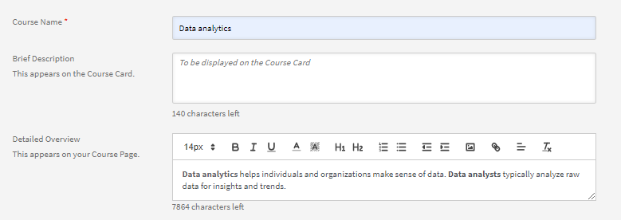

*啟動RTF編輯器*

同樣地，您可以在建立下列專案時使用RTF編輯器修改說明：

**學習計畫**

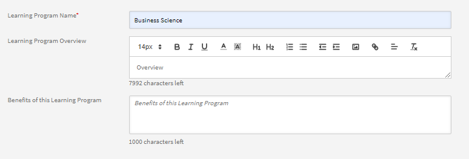

*將RTF編輯器用於學習計畫*

**認證**

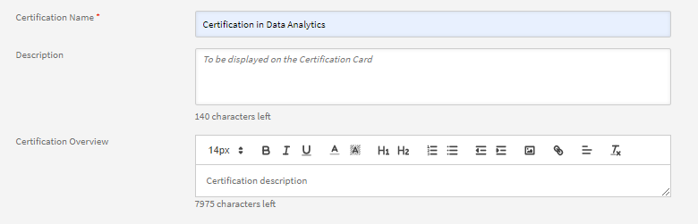

*使用RTF編輯器進行認證*

**工作輔助**

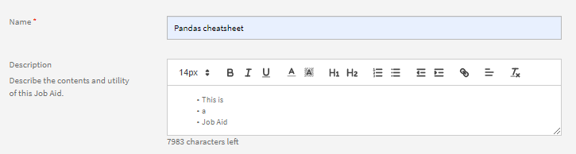

*對工作輔助使用RTF編輯器*

此外，您也可以將RTF編輯器用於其他語言。

## Headless使用者介面的RTF說明支援

### 為何需要CSS？

RTF文字是由HTML標籤所組成。 以原樣呈現標籤會導致瀏覽器套用預設樣式。 這通常與公司的風格指引不符。 需要CSS才能符合准則。

### 預設樣式

附加的CSS樣式表包含Learning Manager套用的樣式。 考量到大多數使用案例，樣式已有所調整。 下載附加的CSS檔案，並根據您的慣例和建置系統將其匯入您的Webapp。 所定義的CSS類別會在ql-editor類別下名稱空間，且不會干擾您現有的樣式。

### 自訂樣式

預設樣式可能不符合每個人的需求。 自訂可藉由覆寫提供的CSS來完成。 所有樣式都會包裝在ql編輯器下，作為子系選取器。 使用下列類別：

* 縮排： **li.ql-indent-$number**。 $number從1到9不等
* 大小： **ql-size-small**，**ql-size-large**，**ql-size-great**

* 對齊方式： **ql-align-center**，**ql-align-justify**，**ql-align-right**

* 色彩： **ql-color-$color**。 $color =白色，紅色，橙色，黃色，綠色，藍色，紫色
* 背景： **ql-bg-$color**。 $color =黑色，紅色，橙色，黃色，綠色，藍色，紫色
* html標籤： p， ol， ul， pre， blockquote， h1， h2， h3， h4， h5， h6

[用於自訂的CSS檔案。](assets/ql-headless.css)

### API變更以啟用轉譯RTF概觀

當客戶建置Headless介面時，他們需要在正在開發的自訂使用者介面中顯示學習物件。 若要這麼做，通常會使用公開的[GET /learningObjects](https://learningmanagereu.adobe.com/docs/primeapi/v2/#!/learning_object/get_learningObjects) API。 現在Learning Manager支援在概觀欄位中擷取「RTF文字」，API回應中學習物件的資料模型也會公開相同內容。 請參閱下列API回應中的模型片段中名為「rtfOverview」的欄位。 另請注意，先前公開的欄位（「概觀」）在回溯相容性方面維持不變。

```
{ 
 "data": [ 
 { 
 "id": "string", 
 "type": "string", 
 "attributes": { 
 … 
 "localizedMetadata": [ 
 { 
 "description": "string", 
 "locale": "string", 
 "name": "string", 
 "overview": "string", 
 "richTextOverview": "string" 
 } 
 ], 
 … 
 }, 
 "relationships": { 
 … 
 } 
 } 
 } 
 ] 
} 
```

已使用概述欄位的客戶在其Headless介面中仍不受影響，只會看到如前所述的純文字。 如果客戶想要利用RTF概覽，則必須在作者UI中為其學習物件建立格式豐富的概覽，之後Learning Manager除了在API回應模型中傳回純文字之外，也將開始傳回RTF概覽（與之前一樣）。

但是，若要在其UI中呈現此RTF文字，客戶將需要包含CSS。 這會在以下各節中詳細說明。

## 允許多次嘗試 {#allowmultipleattempts}

管理員啟用多次嘗試後，身為作者，您可以在課程或模組層級為互動式電子學習模組設定多次嘗試。


*設定互動式電子教學模組的多次嘗試*

<table>
 <tbody>
  <tr>
   <td>
    <p><b>選項</b></p></td>
   <td>
    <p><b>說明</b></p></td>
  </tr>
  <tr>
   <td>
    <p>將嘗試次數設為</p></td>
   <td>
    <p>您可以將模組的嘗試次數設定為無限或提供明確的限制。<span style="font-size: 0.8125rem;">嘗試資訊啟用後，就會顯示給學習者。 學習者可以按一下[重新嘗試]按鈕，選擇重新嘗試此模組。</span></p></td>
  </tr>
  <tr>
   <td>
    <p>完成或通過模組後停止新的嘗試</p></td>
   <td>
    <p>若要設定何時停止學習者選取新的嘗試選項，請啟用「完成或通過模組後停止新的嘗試」核取方塊。 「重新嘗試」選項將在學習者成功完成模組後從學習者檢視中移除。</p></td>
  </tr>
  <tr>
   <td>
    <p>嘗試0:0:1之間的鎖定模組格式：天/小時/分鐘</p></td>
   <td>
    <p>您可以透過啟用核取方塊「<b>在嘗試之間鎖定模組0:0:1格式：天/小時/分鐘</b>」，將模組鎖定在嘗試之間的特定時間。 模組鎖定時，學習者必須等到提供的鎖定時間過後，才能造訪模組。 </p>
    <p>您可以透過選取'<b>播放器關閉</b>'或'<b>完成</b>'核取方塊來定義嘗試的結束條件。</p></td>
  </tr>
  <tr>
   <td>
    <p>播放器關閉</p></td>
   <td>
    <p>如果條件選取為'<b>播放器關閉</b>'，則每個模組啟動都會被視為新嘗試。 系統會以模組鎖定詳細資料提示學習者，並嘗試以詳細資料關閉播放器。</p></td>
  </tr>
  <tr>
   <td>
    <p>完成</p></td>
   <td>
    <p>如果嘗試的結束是以<b>完成</b>為基礎，則會根據內容成功標準進行計算。 在內容傳送完成資訊之前，不允許學習者重新嘗試模組。 嘗試結束後，模組鎖定和嘗試詳細資訊會傳達給學習者。</p></td>
  </tr>
  <tr>
   <td>
    <p>設定完成模組的時間限制</p></td>
   <td>
    <p>作者可以透過啟用核取方塊來設定完成模組的時間限制，「<b>設定完成模組的時間限制</b>」。</p>
    <p>每個播放器啟動都會視為新嘗試，而啟動期間會以時間詳細資訊提示學習者。</p>
    <p><b>注意：</b><span style="font-size: 0.8125rem;">嘗試將在此時間之後自動結束。 關閉播放器也會結束目前的嘗試。</span></p></td>
  </tr>
  <tr>
   <td>
    <p>模組層級的多次嘗試</p></td>
   <td>
    <p>從「將嘗試設為」下拉式清單中選取「模組層級」的嘗試，可讓您在個別模組層級設定選項。</p></td>
  </tr>
 </tbody>
</table>

## 課程模組 {#coursemodules}

### 新增模組 {#addmodules}

您現在可以新增「內容」、「前期工作」和「測試」模組。 **內容**&#x200B;模組是組成課程的主要模組。 **前期工作**&#x200B;模組包含一些基本資訊，可幫助學習者做好課程準備。 學習者不必一定要完成這些模組。 **Testout**&#x200B;模組可協助學習者略過內容並參加測試（如果他們已經知道內容且想要參加測試以符合合規性要求）。

若要新增內容模組，請執行下列步驟：

1. 按一下&#x200B;**[!UICONTROL Add Modules]**。 您可以看到四個新增模組的選項。 第一個選項是新增自學課程模組。 這些是您在Adobe Learning Manager中建立並新增至模組程式庫的模組。 第二個選項是設定虛擬教室。 第三個是設定教室模組，第四個是活動模組。

   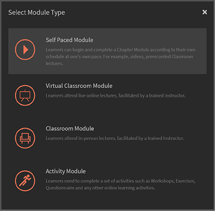

   *新增課程的模組*

   **自訂進度模組：**&#x200B;在此模式中，您可以依照自己的進度開始並完成課程模組。 您可以設定自己的排程。

   按一下選項後，您會看到已新增至模組程式庫中的自控進度模組清單。 您可以在此捲動清單並選取想要新增的模組，或是在搜尋欄位或模組標籤中輸入模組名稱來搜尋模組。

   選取模組後，按一下&#x200B;**[!UICONTROL Add]**。 這些模組現在會顯示在內容區段下方。

   您也可以重新排列模組。 拖曳任何模組，並將其上下移動，然後以適當順序排列模組。

   **虛擬教室模組：**&#x200B;在此模式中，學習者可在訓練有素的講師協助下參加即時線上講座。 輸入標題、說明，並設定工作階段的持續時間。 您也可以指定會議URL以及進行工作階段的講師。 若要儲存變更，請按一下&#x200B;**[!UICONTROL Done]**。

   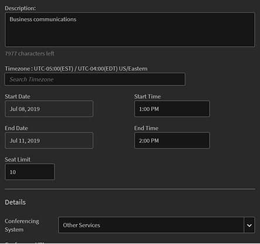

   *新增VC模組*

   使用虛擬教室設定對話方塊建立課程時，請將&#x200B;**會議系統**&#x200B;設定為您建立的Teams連線。 選取您是否想要會議召集人來主持此事件。

   如果您為會議召集人選取&#x200B;**是**，則必須輸入召集人的名稱。 輸入名稱並選取召集人。

   **略過大廳**

   * 如果您選取&#x200B;**是**，則任何學習者都可以加入會議。
   * 如果您選取&#x200B;**否**，系統會傳送請求給召集人，以允許或阻止學習者加入會議。

   **注意：**&#x200B;學習者必須在Microsoft Teams上可用。 不過，學習者可以來賓身分加入Learning Manager。

   **教室模組：**&#x200B;在此模式中，學習者在經過訓練的講師的協助下會參加面對面授課。 輸入標題、說明，並設定工作階段的持續時間。 您也可以指定類別的位置以及進行作業階段的講師。 若要儲存變更，請按一下&#x200B;**[!UICONTROL Done]**。

   

   *新增教室模組*

   建立課程時，請在「虛擬教室設定」對話方塊中，將會議系統設定為您建立的Microsoft Teams連線。 選取您是否想要會議召集人來主持此事件。

   如果您為會議召集人選取「是」，則必須輸入召集人的名稱。 輸入組織者的名稱，然後選取組織者。

   **略過大廳**

   * 如果您選取「是」，則任何學習者皆可加入會議。
   * 如果您選取「否」，則會傳送請求給召集人，以允許或阻止學習者加入會議。

   **注意：**&#x200B;如果學習者想以嘉賓身分加入Microsoft Teams，他/她必須輸入電子郵件。 電子郵件必須存在於Learning Manager中。

   **活動模組：**&#x200B;在此模式中，學習者必須完成一組活動，例如，研討會、練習、問卷調查和其他學習活動。 輸入標題、說明和外部URL以供參考。 若要儲存變更，請按一下&#x200B;**[!UICONTROL Done]**。

   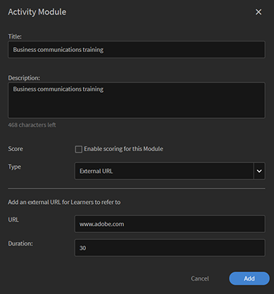

   *新增活動模組*

   您可以在課程中為活動型別「檔案提交」和xAPI型模組新增活動模組時指定持續時間。

1. 同樣地，為「預先工作」和「測試」模式新增模組。
1. 根據您的偏好設定，將模組的排序型別選擇為「已訂購」或「未訂購」。

   如果您選擇&#x200B;**已訂購**，模組會以您建立它們的相同順序顯示。 如果您選擇&#x200B;**未排序**，模組將不會排序。 學習者可依任何順序完成單元。

1. 從「強制模組」下拉式清單中，選擇學習者完成課程必須採取的模組數量。
1. 新增課程的封面影像和橫幅影像。 目錄是由管理員建立的。 如需詳細資訊，請參閱[目錄](/help/migrated/administrators/feature-summary/catalogs.md)。

   **注意：**&#x200B;建議的維度為：

   * **封面影像：** 300畫素x 300畫素
   * **橫幅影像：** 1600畫素x 140畫素

1. 在頁面的右上角，按一下&#x200B;**[!UICONTROL Save]**。

#### 在活動模組中新增HTML連結

作者可以在活動模組中新增HTML連結，並設定完成條件。 若要新增HTML連結及設定完成條件，請依照下列步驟進行：

1. 在作者應用程式中，選取首頁上的&#x200B;**[!UICONTROL Create Courses]**。
1. 從&#x200B;**[!UICONTROL Add]**&#x200B;畫面選取&#x200B;**[!UICONTROL Course Catalog]**
1. 輸入課程的名稱和說明。
1. 在&#x200B;**[!UICONTROL Module]**&#x200B;選項中，選取&#x200B;**[!UICONTROL Add Module]** > **[!UICONTROL Activity Module]**。
1. 在&#x200B;**[!UICONTROL Activity Module]**&#x200B;提示字元中，輸入名稱和描述。
1. 選取&#x200B;**[!UICONTROL Type]**&#x200B;做為&#x200B;**[!UICONTROL External URL]**。
1. 從&#x200B;**[!UICONTROL Completion Criteria]**&#x200B;選項中選取下列任一選項。
   * **[!UICONTROL Learner marks complete]**：學習者可選擇在流體播放器中將課程標示為完成。
   * **[!UICONTROL On Launching content]**：當學習者啟動課程時，該課程會自動標示為完成。

   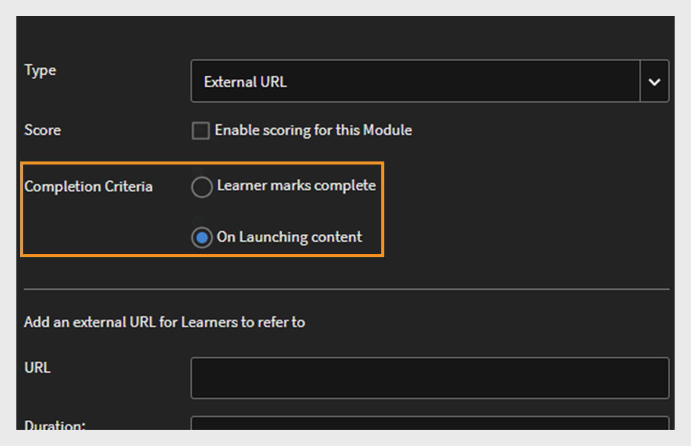
   _完成條件_

1. 選取&#x200B;**[!UICONTROL Add]**&#x200B;並發佈課程。

### 取代已發佈課程中的模組

Adobe Learning Manager為作者提供建立、編輯及管理由多個內容模組組成的課程的工具。 當課程內容需要更新或改進時，作者可以取代現有模組而不會中斷學習者進度。

若要取代模組：

1. 以作者身分登入Adobe Learning Manager。
2. 在左側導覽窗格中選取&#x200B;**[!UICONTROL Courses]**。
3. 選取任一課程，然後選取&#x200B;**[!UICONTROL Edit]**。
4. 選取您要變更的模組。
5. 變更標題和說明。
6. 使用&#x200B;**Content**&#x200B;選項選取模組。
   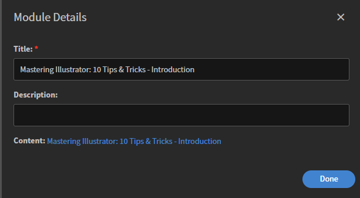
7. 選取&#x200B;**[!UICONTROL Done]**。
8. 選取&#x200B;**[!UICONTROL Republish]**。

學習者將在其他模組中保持進度，但需要完成新模組才能完成課程。

## 檢查清單 {#create-checklist}

評估是任何LMS的重要方面。 線上評估是評估學習者對主題理解的主要方法之一。 但通常情況下，必須透過觀察某人執行必要任務來評估其執行工作時的理解。

考慮評估店舖員工或倉庫員工，以評估他們應每天執行的作業。 這可以是修復咖啡機的步驟，或包裝材料的步驟。 講師可依據檢查清單評估員工此類工作，並在評估活動中將其評估為「通過」或「失敗」。

### 建立檢查清單 {#createachecklist}

只有作者才能建立檢查清單。 檢查清單是一種活動模組。 設定活動模組時，身為作者的您可以選取活動作為&#x200B;**檢查清單**，如下所示：

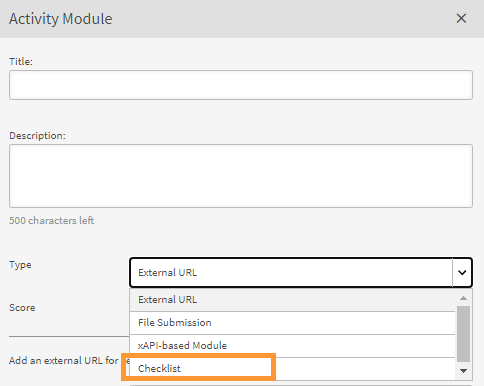

*建立檢查清單*

選擇選項&#x200B;**檢查清單**&#x200B;後，您會看到一些其他選項。

**檢查清單型別：**&#x200B;選擇任何選項，**是/否**&#x200B;或&#x200B;**1-5**。 如果您選擇「是/否」，檢查清單將包含只能以「是」或「否」回答的問題。 如果選擇1-5，您會看到Likert檢查清單，您可以在其中以5分制對問題評分。

**通過條件：**

<table>
 <tbody>
  <tr>
   <td>
    <p>如果您已選擇<b>是/否</b>，則……</p></td>
   <td>
    <p>如果您已選擇<b>1-5</b>，則……</p></td>
  </tr>
  <tr>
   <td>
    <p>將通過條件設為回應數「是」。 例如，如果您輸入3，則學習者若在教師評估時收到至少三個<b>是</b>回應，即通過課程。</p></td>
   <td>
    <p>將通過條件設定為1-5之間任何數字的臨界值。 例如，如果您輸入2和4，則學習者若取得至少<b>兩個</b>評估，且分數大於或等於<b>4</b>，即通過課程。</p></td>
  </tr>
 </tbody>
</table>

選擇要評估學習者的講師或教師。

此外，如果您有任何要註解或備註的內容，可以在&#x200B;**教師備註**&#x200B;文字欄位中新增該備註內容。

現在，新增檢查清單問題。 按一下&#x200B;**[!UICONTROL Add]**。 您最多只能新增150個問題。

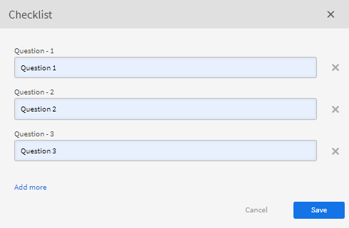

*新增檢查清單問題*

若要新增更多問題，請按一下&#x200B;**[!UICONTROL Add more]**。

儲存變更、新增模組並發佈課程。

### 新增技能 {#addskills}

在此頁面上，輸入下列詳細資訊：

1. 選擇課程技能、等級，並設定該技能的學分。 如有需要，新增更多技能。

   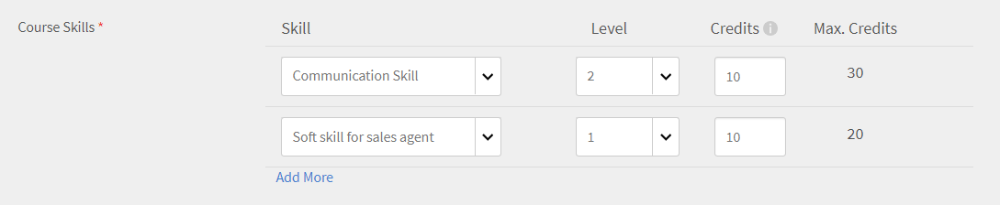

   *新增課程的技能*

1. 選擇註冊型別。 選項如下：

   * **指派的經理：**&#x200B;只有經理才能指派這些課程。 學習者無法註冊這些型別的課程。
   * **經理已核准：**&#x200B;經理已核准這些課程。 學習者可以註冊這些課程，但若未經經理核准，他們不會直接註冊這些型別的課程。 學習者註冊這些型別的課程時，會向經理傳送通知請求。 經理核准後，這些課程就會列為學習者的已註冊課程。
   * **自助註冊：**&#x200B;學習者可直接註冊這些型別的課程。

1. 如果您想要讓學習者能夠自行取消註冊您的課程，請啟用核取方塊&#x200B;**學習者可以自行取消註冊**。
1. 選取參加課程前必須完成的必要課程。 按一下「課程」欄位，然後從課程清單中選擇。

   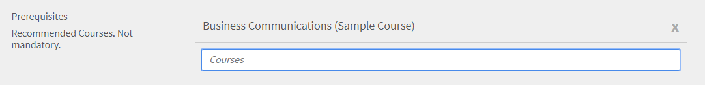

   *新增必要課程*

1. 如果您想要將必修課程設為必修課程，請啟用&#x200B;**必要條件**&#x200B;核取方塊。
1. 新增關鍵字作為課程的相關標籤。 這些標籤可協助學習者在搜尋期間輕鬆找到您的課程。 所有這些標籤會根據我們新增的模組自動新增。 如果您有其他要新增至本課程的標籤，可以繼續並輸入。
1. 按一下文字區域並從建議中選擇設定檔，以新增本課程的目標對象設定檔。
1. 將課程的資源檔案新增為額外資料。 拖曳您的素材，例如文字、視訊或音訊檔案。
1. 現在，此課程將可供擁有這些設定檔的學習者作為建議課程使用。 您也可以在本節中為學習者附加其他資源。 學習者將可以下載這些檔案以供日後參考。 完成這些變更後，請前往右上角按一下&#x200B;**[!UICONTROL Save]**。 這會將您的課程儲存為草稿。 您的課程預設會儲存為草稿。

## 指派模組的講師 {#assigninstructorsformodules}

1. 建立課程模組後，您可以將講師指派給模組。 在作者儀表板中，按一下&#x200B;**[!UICONTROL Course Catalog]**。
1. 按一下您要指派講師至哪個模組的課程。
1. 在&#x200B;**新增模組**&#x200B;區段中，按一下您要指派講師的模組。
1. 在&#x200B;**講師**&#x200B;欄位中，指定要指派講師角色的使用者名稱。

   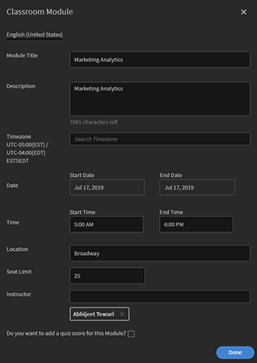

   *指派講師角色給使用者*

1. 若要重新發佈包含更新的課程，請按一下&#x200B;**[!UICONTROL Republish]**。

### 允許講師標籤課程通過

Adobe Learning Manager可讓講師在教室或虛擬教室模組中標籤學習者的成功狀態。 作者可在建立教室或虛擬教室模組時，授予講師許可權以標籤學習者的成功狀態。 講師可將學習者標示為「通過」或「失敗」，確保進度依此更新，以標籤成功。

若要允許講師標籤學習者是否成功：

1. 以作者身分登入Adobe Learning Manager。
2. 在首頁上選取&#x200B;**[!UICONTROL Create Courses]**。
3. 選取&#x200B;**[!UICONTROL Add]**。
4. 輸入必要的詳細資料，然後選取&#x200B;**[!UICONTROL Add Modules]**。
5. 選取&#x200B;**[!UICONTROL Virtual Classroom Module]**&#x200B;或&#x200B;**[!UICONTROL Classroom Module]**。
6. 輸入必要的詳細資訊並選取日期。
7. 選取&#x200B;**[!UICONTROL Allow Instructor to mark success]**&#x200B;選項。

   的學習者成功狀態
   _工作階段詳細資訊畫面，允許講師標籤教室或虛擬教室模組強調的成功選項_

8. 選取&#x200B;**[!UICONTROL Done]**。


## 觀察檢查清單

除了講師以外，經理現在也能檢閱檢查清單模組。 人員管理員以及非階層式管理員（例如商店管理員或位置管理員）可以檢閱並完成檢查清單。

課程作者可在設定「檢查清單」模組時，於「稽核者」區段中選取這些角色選項，將人員管理員與非階層管理員（如果適用）新增為稽核者。 這可在課程例項層級完成。

管理員的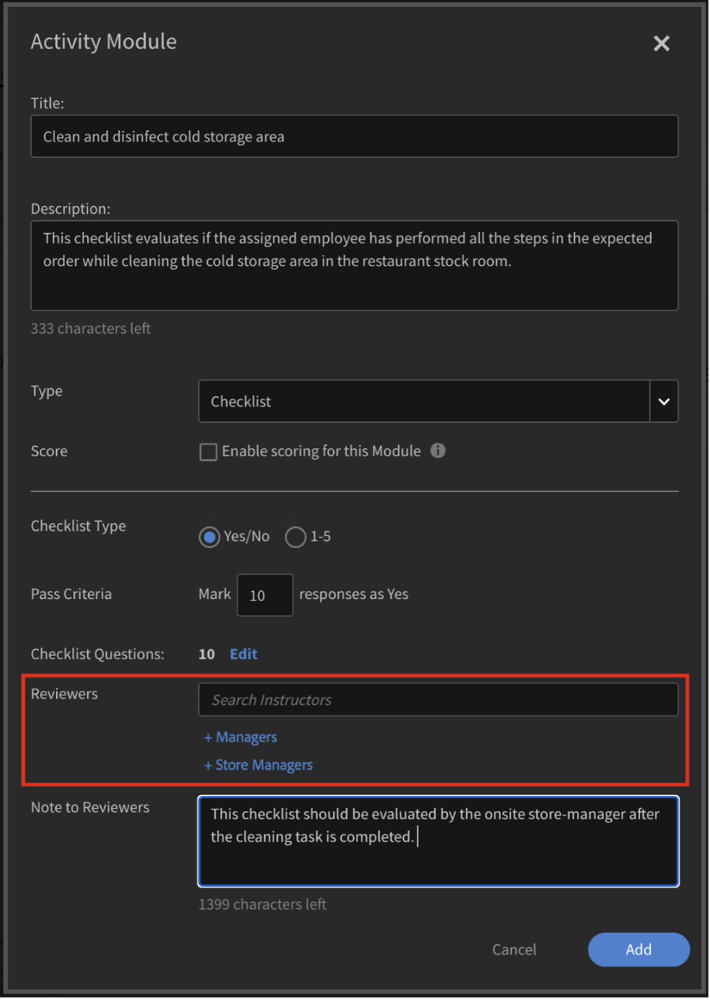

*在活動模組中新增稽核者*

選取&quot;**[!UICONTROL +Managers]**&quot;選項會自動讓組織階層中的學習者經理檢閱檢查清單。 您不需要分別搜尋和新增管理員名稱。

如果您的帳戶管理員已使用「作用中欄位」選項設定非階層式管理員角色（例如位置管理員或場地管理員），則您可使用這些管理員角色來選取並讓他們檢閱檢查清單。

您不需要分別搜尋和新增管理員名稱。 當學習者註冊檢查清單課程時，會自動傳送通知給他們的經理/店舖經理，以與任何所選的講師一起審查。 此工作流程可讓作者輕鬆地忽略個別經理的姓名。

在上面提供的範例熒幕擷圖中，選取&quot;**[!UICONTROL +Store Managers]**&quot;選項會自動啟用與學習者對齊的非階層式管理員以檢閱檢查清單。 請注意，此處的「商店」將由管理員定義的作用中欄位取代。

檢查清單模組的更新也包含當學習者註冊了包含檢查清單模組的課程時，給教師和管理人員的通知。 稽核者會在Learning Manager通知中心以及教師/經理控制面板中收到檢查清單動作到期的通知。

<!--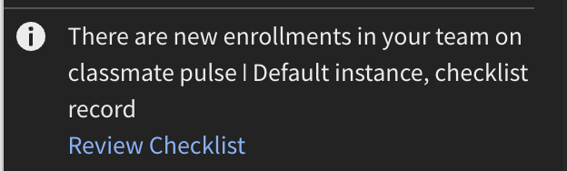-->

檢閱者以講師/經理身份登入時，可以從「檢查清單」功能表及「通知」功能表，檢視所有擱置檢查清單檢閱專案的相關資訊。

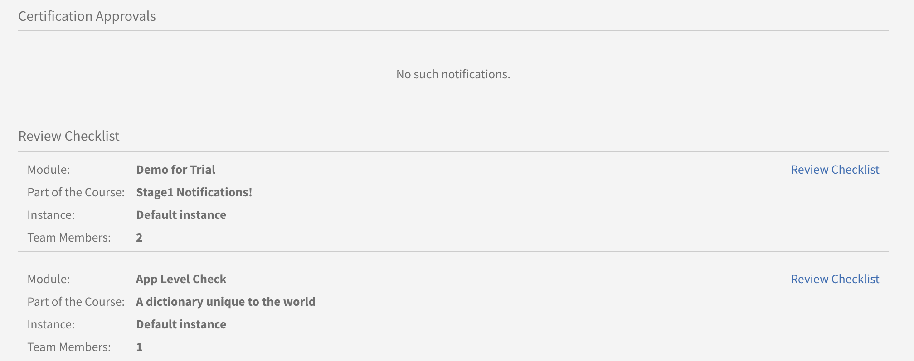

*認證的核准*

按一下「稽核檢查清單」後，稽核者即可完成評估。

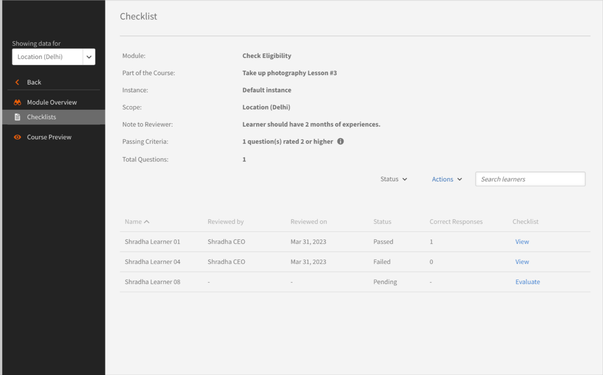

*檢閱擱置的核對清單檢閱專案*

報表可從檢查清單下載，包括學習者評估、稽核者姓名、角色和電子郵件的詳細資訊。

檢查清單報告csv包含新的和更新的欄位：

* 檢閱者名稱而非講師名稱
* 檢閱者電子郵件而非講師電子郵件
* 檢閱者角色 — 可能的值包括Manager、Store/Location Manager、Instructor

## 預覽課程 {#previewacourse}

建立課程並儲存為草稿後，您就可以作為學習者預覽課程，然後發佈它以在課程目錄中可用。

若要預覽課程，請按一下&#x200B;**[!UICONTROL Preview as learner]**。

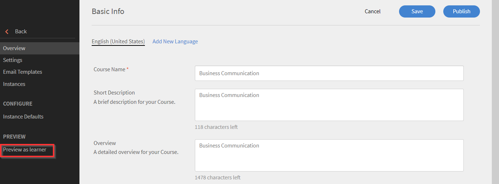

*以學習者身分預覽課程*

這會開啟您的課程&#x200B;**總覽**&#x200B;頁面，您可以在此頁面檢視模組、其順序以及與課程相關的其他詳細資訊。

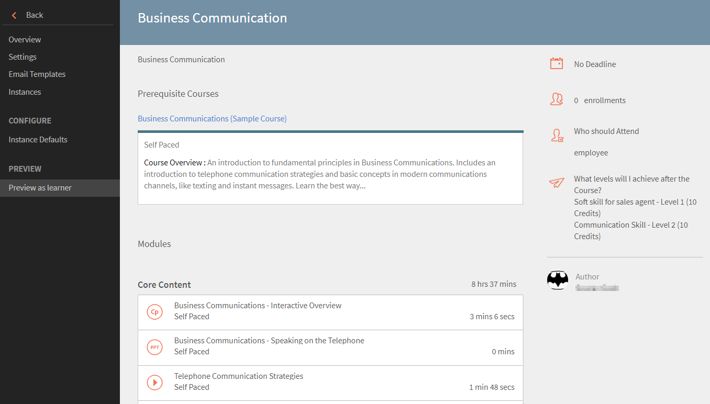

*檢視模組及其他相關詳細資料*

若要瞭解學習者如何體驗此課程，請按一下其中的每個模組，開始播放。 這會開始在Fluidic Player中播放課程。

## 發佈課程 {#publishacourse}

以學習者身分預覽課程後，您可以發佈課程，讓學習者可使用此課程。 請注意，課程仍處於草稿模式。

典型的課程生命週期如下所示：

* **草稿** — 作者完成建立課程並儲存時。 在此狀態下，課程尚無法供學習者使用。
* **已發佈** — 作者完成發佈課程時。 在此狀態，此課程可供學習者註冊。 您也可以編輯處於此狀態的課程。
* **已淘汰** — 發佈課程後，如果作者不希望課程出現在學習者的課程目錄中，作者可以將其移至淘汰狀態。
* **已刪除** — 處於已刪除狀態的課程是從Adobe Learning Manager應用程式中完全移除的課程。 只有作者可在課程處於「草稿」或「已淘汰」狀態時刪除課程。

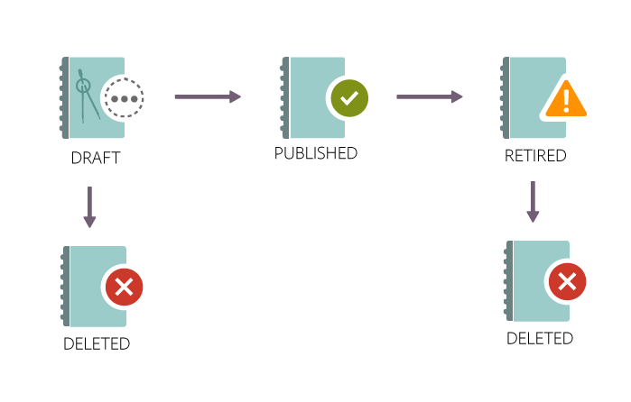

*課程生命週期的工作流程*

若要發佈您已建立的課程，請按一下頁面右上角的&#x200B;**[!UICONTROL Publish]**。


*發佈課程*

在出現的確認快顯訊息上，按一下&#x200B;**[!UICONTROL OK]**。

課程目錄現在提供課程。

## 檢視課程 {#viewacourse}

您可以作者身分檢視所有可用課程的清單。 若要檢視Learning Manager帳戶中的所有課程，請按一下課程目錄。 若要在Learning Manager中檢視您編寫的所有課程，請按一下&#x200B;**[!UICONTROL My Courses]**。

在課程卡上，暫留在選項上，然後按一下&#x200B;**[!UICONTROL View Course]**。

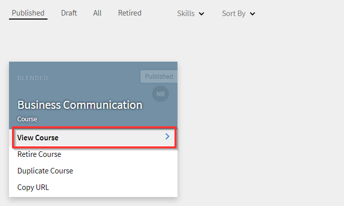

*檢視課程*

課程資訊視窗隨即顯示。 課程處於唯讀模式。 若要修改課程，請按一下&#x200B;**[!UICONTROL Edit]**。

## 淘汰課程 {#retireacourse}

管理員可以為Adobe Learning Manager帳戶啟用淘汰選項。 此功能可讓管理員淘汰課程，讓新註冊人員無法存取該課程，同時讓目前已註冊的學習者保留存取權。

棄用課程會使學習者隱藏該課程，即使他們已註冊或已完成該課程亦然。 如果您淘汰課程，便無法將新學習者註冊至課程。 已註冊的學習者可以參加課程。

若要為Adobe Learning Manager帳戶啟用「淘汰」選項：

1. 以管理員身分登入Adobe Learning Manager。
2. 選取&#x200B;**[!UICONTROL Settings]**，然後選取&#x200B;**[!UICONTROL General]**。
3. 從下列選項中選取任一淘汰選項：
   * 淘汰後，已註冊的學習者將能夠檢視並執行動作，但尚未註冊的學習者將失去存取權。
   * 淘汰後，已註冊和未註冊的學習者都將失去存取權。

管理員可以從&#x200B;**[!UICONTROL Courses]**&#x200B;頁面淘汰課程。

若要淘汰課程，請在課程卡上暫留在選項上，然後按一下「淘汰課程」 。

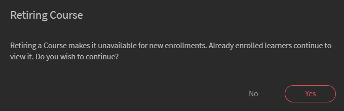

*淘汰課程*

在出現的確認快顯視窗中，按一下&#x200B;**[!UICONTROL Yes]**。

## 複製課程 {#duplicateacourse}

您可以建立課程副本，然後修改課程。 如果您想備份您的課程，可以複製課程。

## 搜尋課程 {#searchforcourses}

Adobe Learning Manager讓您更容易快速找到您選擇的課程。 您可以透過下列方式搜尋您的課程：

**搜尋欄位：**&#x200B;按一下&#x200B;**課程目錄**&#x200B;頁面右上角的搜尋列。 輸入課程名稱或與課程相關聯的任何關鍵字。 您也可以使用課程建立期間新增的標籤進行搜尋。 標籤可在「搜尋課程」欄位中搜尋，這表示當您輸入時，標籤會顯示在搜尋欄位中。

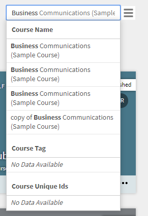

*搜尋課程*

**篩選課程清單：**&#x200B;您可以依狀態篩選課程，例如「全部」、「已發佈」、「草稿」和「已淘汰」。 根據您的選擇，您可以檢視經過篩選的課程清單，並選取所需課程。

身為作者，您也可以排序課程以更妥善地找到所需課程。 按一下&#x200B;**[!UICONTROL Sort by]**，然後選擇依字母遞增順序、依字母遞減順序、課程建立日期、課程更新日期和課程的成效。


*篩選課程清單*

## 為學習者註冊課程 {#enrolllearnersinacourse}

若要將學習者註冊到課程，或允許經理指派課程學習者，您必須切換到管理員模式，因為只有管理員有權將學習者註冊到課程。

若要切換至管理模式，

1. 按一下您的設定檔圖片，然後選取[管理員]。
1. 在管理模式中，按一下左窗格上的&#x200B;**[!UICONTROL Courses]**。 在此頁面上，您可以在您的Learning Manager帳戶中檢視所有作者建立的所有課程。
1. 若要註冊學習者，請將游標移至課程卡上，您就會看到&#x200B;**註冊學習者**&#x200B;選項。 按一下此選項。

   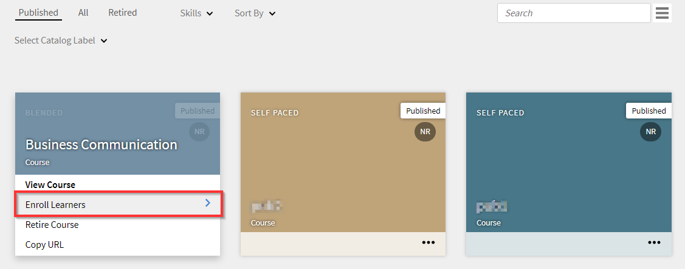

   *為學習者註冊課程*

1. 在註冊學習者對話方塊的右上角，您會看到已選取&#x200B;**預設執行個體**&#x200B;選項。 作者建立課程後，就會建立課程的預設例項。

   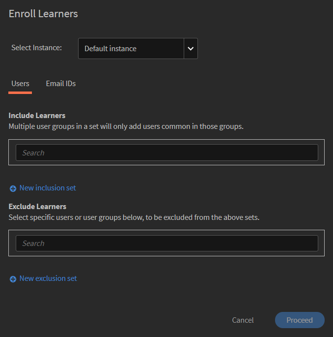

   *檢視課程的預設執行個體*

1. 在「包含學習者」欄位中開始輸入學習者的名稱，然後選擇學習者。 您也可以在此處新增使用者群組。 如果您想要在Learning Manager帳戶中註冊所有學習者，請開始輸入全部。 您也可以將學習者註冊至團隊。

   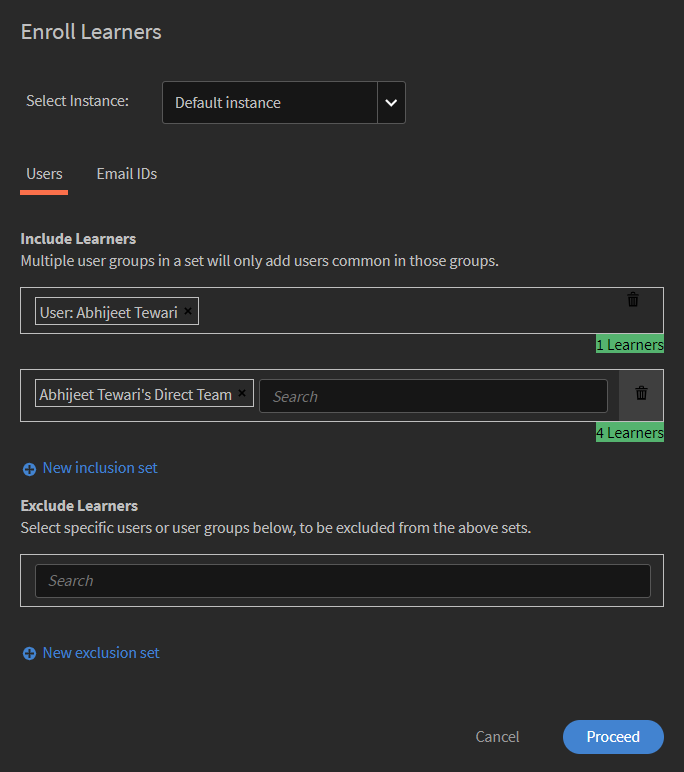

   *新增學習者至課程*

1. 如果您想從課程中排除任何學習者，請在&#x200B;**排除學習者**&#x200B;欄位中輸入學習者的名稱。
1. 註冊學習者後，請按一下&#x200B;**[!UICONTROL Proceed]**。 在註冊學習者對話方塊中，您可以檢視註冊摘要。

   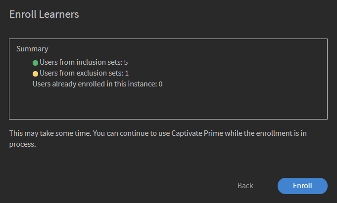

   *檢視課程註冊摘要*

1. 若要註冊課程中的所有學習者，請按一下&#x200B;**[!UICONTROL Enroll]**。 這些學習者現已成功註冊此課程。 學習者會收到通知，告知他們繼續進行課程學習。 若要註冊更多學習者，請重複註冊程式。

## 連線VC模組的「課程執行處理」頁面變更 {#connect-vc}

擷取Connect課程時，您可以建立兩種型別的會議室：

* 動態
* 永久

永久URL一律會固定。 但若使用者沒有Connect及其自己的會議室，則必須在執行階段使用動態會議室。 然後，人們可以加入他們的會議。

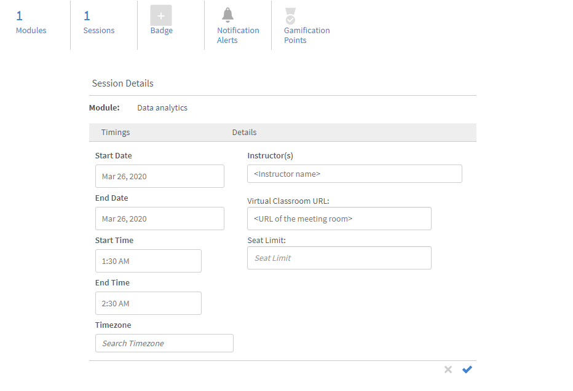

*動態會議室選項*

您現在可以在&#x200B;**課程執行個體**&#x200B;頁面上變更永久聊天室的URL。

<!--| 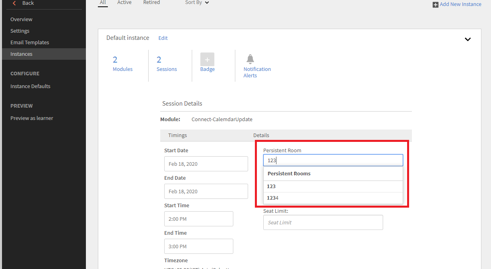 | 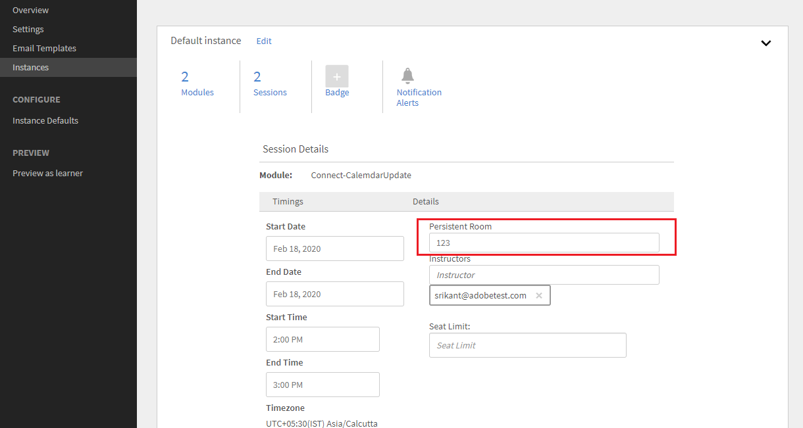 |
|---|---|-->

## 取消課程學習者的註冊 {#unenrolllearnersfromacourse}

建立課程時，作者可啟用&#x200B;**學習者可自行取消註冊**&#x200B;選項，以便參加課程的學習者可從課程取消註冊。

管理員也可以將學習者取消註冊該課程。

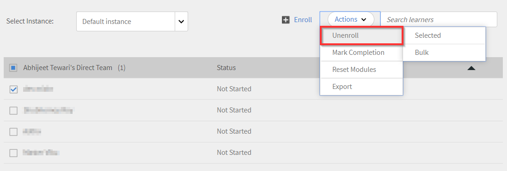

*取消課程學習者的註冊*

如需詳細資訊，請參閱[取消註冊學習者](/help/migrated/administrators/feature-summary/courses.md)。

## 新增Captivate和Presenter的課程模組 {#addcoursemodulesforcaptivateandpresenter}

您也可以使用「發佈」功能表，從Adobe Captivate和Adobe Presenter軟體將課程模組發佈至Learning Manager。

1. 在Captivate中，按一下&#x200B;**[!UICONTROL Publish]** > **[!UICONTROL Publish to Learning Manager]**。
1. 提供子網域名稱或電子郵件識別碼，然後按一下&#x200B;**[!UICONTROL Submit]**。 如果您有多個帳戶，系統會提示您選擇帳戶。
1. 使用Adobe憑證登入。 如果您沒有Adobe ID，請按一下&#x200B;**[!UICONTROL Create Account]**。 獲得授權後，您會被導向模組發佈頁面。
1. 提供模組的所有基本資訊，然後按一下發佈。

您可以在Learning Manager模組頁面上看到已發佈的模組。 如需詳細資訊，請參閱[將專案發佈到Adobe Learning Manager](https://helpx.adobe.com/tw/captivate/classic/publish-project-to-captivate-prime.html)。

## 課程效果 {#courseeffectiveness}

課程有效率分數可協助作者評估課程成效不如學習者需要的情況，並作出相應修改。 課程效果評估旨在瞭解課程對學習者的有用性。 此為學習者對課程內容意見回饋結果的組合。 課程測驗結果適用於學習者，而經理會根據課程學習情況評估學習者。

在&#x200B;**我的課程**&#x200B;中，作者可以在課程縮圖上檢視課程成效評等，如下列快照所示。 您可以看到此課程的評等為100。

<!--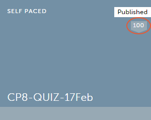-->

課程效果評等值是根據L1、L2和L3的意見值得出的。 若要檢視每個意見回饋的分解，請按一下課程效果值。 即現式選單出現，如下所示。

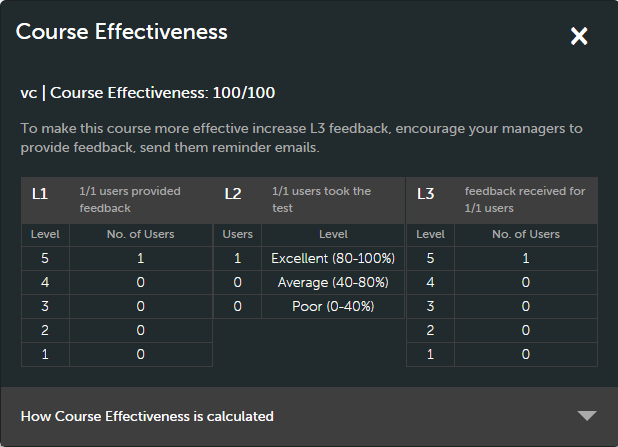

*課程效果計算*

在此範例快照中，1比1的使用者收到所有這三種型別的回饋，因此分數是100/100。 從這個表格中，您可以瞭解缺少的意見回饋，以改善整體效益。 若要檢視課程效果的計算方式，請按一下躍現式選單右下角的向下箭頭。

<!--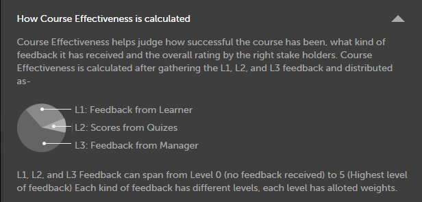-->

如上圖所示，經理為L3意見反應賦予了更大的權重。

## 認證和學習計畫 {#certificationsandlearningprograms}

作者和管理員均可透過作者應用程式，為學習者建立認證和學習計畫。 從首頁，按一下「認證」或「學習計畫」以建立各自的學習物件。

若要瞭解如何建立及管理認證和學習計畫，請參閱[認證](/help/migrated/administrators/feature-summary/certifications.md)及[學習計畫](/help/migrated/administrators/feature-summary/learning-programs.md)。

## 外部認證的必修課程 {#mandatorycoursesforexternalcertification}

在舊版Learning Manager中，外部認證的學習者完成課程並非必須完成認證。

您現在可以啟用[課程表]索引標籤中的&#x200B;**將所需課程設定為[完成認證的必要課程]**&#x200B;選項，讓課程成為必修課程。

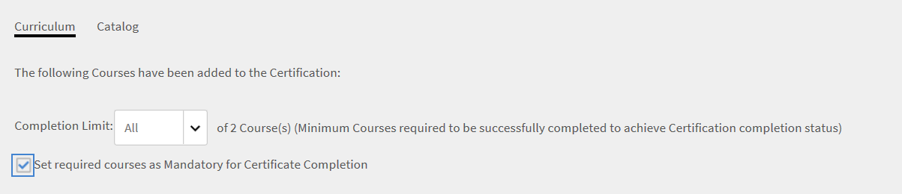

*設定必修課程以完成憑證*

課程設為強制時：

* 管理員的提交頁面只會在學習者完成課程後列出學習者。
* 學習者僅可在完成課程後上傳檔案。

## 常見問題 {#frequentlyaskedquestions}

+++如何移除課程的「搜尋經理指派」？

執行下列步驟：

1. 以作者身分登入Learning Manager。
1. 開啟課程。
1. 在左窗格中，按一下&#x200B;**[!UICONTROL Settings]** > **[!UICONTROL Edit]**。
1. 在&#x200B;**註冊型別**&#x200B;下拉式清單上，將註冊型別從&#x200B;**指定的經理**&#x200B;變更為&#x200B;**核准的經理**&#x200B;或&#x200B;**自行註冊**。

1. 變更註冊型別後，請重新發佈課程。

+++

+++如何合併課程？

您可以透過學習計畫合併課程。

1. 以管理員身分登入Learning Manager。
1. 在左窗格中，按一下&#x200B;**[!UICONTROL Learning Programs]**。
1. 若要新增學習計畫，請按一下&#x200B;**[!UICONTROL Add]**。
1. 輸入學習計畫的詳細資料，若要儲存學習計畫，請按一下&#x200B;**[!UICONTROL Save]**。
1. 建立學習計畫後，按一下「**[!UICONTROL Catalog]**」。
1. 按一下課程卡上的&#x200B;**[!UICONTROL Add]**，如下所示。 對您想要新增至學習計畫的課程重複此程式。

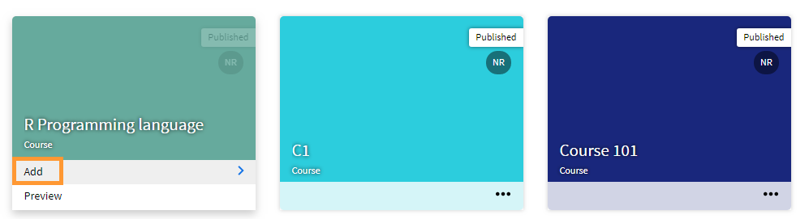

新增學習計畫所需的所有課程後，請按一下&#x200B;**[!UICONTROL Publish]**。

在學習計畫中，您只能新增自助註冊的課程，而不能新增經理指派或經理核准的課程。 這是Learning Manager中的預設行為。

+++

+++如何確定所有學習者都看不到所有課程？

您可以透過目錄達成此目的。 預設目錄包含預設新增至Learning Manager的所有課程。

您必須停用預設目錄並建立自訂目錄。

1. 以管理員身分登入Learning Manager。
1. 在左窗格中，按一下&#x200B;**[!UICONTROL Catalogs]**。
1. 按一下&#x200B;**[!UICONTROL Create]**&#x200B;建立目錄。 輸入詳細資料，然後按一下&#x200B;**[!UICONTROL Save]**。

1. 在新建立的「目錄」選項中，您可以選取可新增的不同學習型別，例如學習計畫、認證或課程。
1. 在學習計畫區段中，按一下&#x200B;**[!UICONTROL Add Content]**。
1. 在左窗格中，根據您要鎖定的對象按一下&#x200B;**[!UICONTROL Share Internally]**&#x200B;或&#x200B;**[!UICONTROL Share Externally]**。

1. 若要新增使用者群組，請按一下&#x200B;**[!UICONTROL Add User Groups]**。
1. 在[目錄]頁面上，停用&#x200B;**D[!UICONTROL efault Catalog]**，並啟用您已建立的目錄。

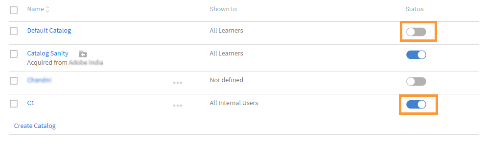

+++

+++如何重新註冊已完成的課程？

課程完成無法還原。 學習者&#x200B;**無法將**&#x200B;重新註冊至已完成的課程。

+++

+++學習者如何在完成課程後仍可檢視課程？

學習者可在課程完成後按一下課程中的「重新造訪」按鈕來檢視課程。

執行以下步驟：

1. 以學習者身分登入。
1. 開啟您已完成的課程。
1. 按一下&#x200B;**[!UICONTROL Revisit]**。

+++

+++如何在課程中新增資源檔案？

建立課程時，您可以在課程中新增與課程相關的影片、音訊、PDF或文字檔案，讓學習者可存取其他培訓資料。

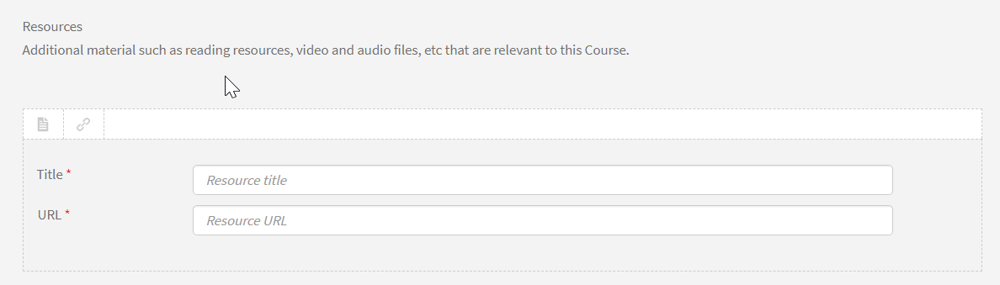

+++

+++如何在模組上設定多次嘗試？

**先決條件：**&#x200B;系統管理員必須在管理應用程式的&#x200B;**設定>一般**&#x200B;中啟用選項&#x200B;**多次嘗試**。

作為作者，在課程總覽頁面上，啟用選項&#x200B;**允許多次嘗試**。

如需詳細資訊，請參閱多次嘗試的[區段](courses.md#Allowmultipleattempts)。

+++

+++您可以下載已在Adobe Learning Manager上傳的內容以修改內容嗎？

否，在Learning Manager上上傳的內容是已發佈的zip檔案，而非來源檔案。 因此，即使下載了內容，也無法在編寫工具中編輯內容。 您需要來源檔案才能編輯內容。

+++
