# 創建、修改及發佈課程

想了解如何在學習管理員中建立課程、認證和學習計畫，請閱讀這篇文章。

作者可以建立學習物件，如課程、證照和學習計畫。 學習者可以使用這些學習物件，而管理員則能追蹤學習者的進度。

## 學習管理課程 {#coursesincaptivateprime}

Adobe Learning Manager 讓作者能利用一個或多個與虛擬訓練、自學訓練、課堂訓練及活動相關的模組來建立課程。 管理員還能利用這些課程建立課程實例、註冊學習者、分配徽章，並啟用課程回饋。 他們也能利用這些課程制定學習計畫、學習計畫及認證。

作者可以使用任何電子學習工具所創作的電子學習內容。 其他支援的課程格式包括影片檔案、PDF、文件、docx、PPT 及 PPTX。

## 建立課程 - 基本工作流程 {#createacoursebasicworkflow}

要建立課程，請遵循以下步驟：

1. 以作者身份登入 Adobe Learning Manager，因為只有作者擁有創建課程的權利。 現在，在「開始」頁面，點擊 **[!UICONTROL Create Courses]**。
1. 在 **課程概覽** 頁面輸入課程名稱。 現在，請輸入這門課程的簡短說明，並顯示在課程卡片上。 此描述不得超過140字元。 接著輸入課程的詳細概述，該頁面會顯示在課程詳情頁面。 描述不得超過1500字元。

   作為作者，你可以在將模組加入課程時看到模組的描述。

1. 若要讓您的課程能支援其他語言，請從頁面左上角點擊新增語言。 選擇你想開設課程的語言。 點擊 **[!UICONTROL Save]**。 欲了解更多資訊，請參閱 [「新增不同語言](/help/migrated/authors/feature-summary/content-library.md)內容」。
1. **修改賽道設定**-

   1. 在課程設定頁面，選擇課程的技能。 從技能下拉選單中選擇所需技能。 然後，從等級下拉選單中選擇所需的等級。
   1. 選擇課程技能、升級，並設定技能的學分。 如果需要，可以增加更多技能。
   1. 從 **「註冊類型** 」下拉選單中，選擇註冊類型。

   以下是報名的類型：

   * **經理提名：** 只有經理人可提名這些課程。 學習者無法報名這類課程。
   * **經理核准：** 經理核准這些課程。 學習者可以報名這些課程，但未經經理批准，不會直接註冊此類課程。 當學習者報名這類課程時，會向經理發送通知請求。 經經理核准後，這些課程會被列為已註冊學習者。
   * **自選：** 學習者可直接報名這類課程。

1. 要儲存變更，請點擊 **[!UICONTROL Save]**。 要發佈課程，請點擊 **[!UICONTROL Publish]**。

## 建立課程 - 進階工作流程 {#createacourseadvancedworkflow}

1. 以作者身份登入 Adobe Learning Manager，因為只有作者擁有創建課程的權利。 現在，在「開始」頁面，點擊 **[!UICONTROL Create Courses]**。
1. 在 **課程概覽** 頁面輸入課程名稱。 現在，請輸入這門課程的簡短說明，並顯示在課程卡片上。 此描述不得超過140字元。 接著輸入課程的詳細概述，該頁面會顯示在課程詳情頁面。 描述不得超過1500字元。
1. 若要讓您的課程能支援其他語言，請從頁面左上角點擊新增語言。 選擇你想開設課程的語言。 點擊 **[!UICONTROL Save]**。 欲了解更多資訊，請參閱 [「新增不同語言](/help/migrated/authors/feature-summary/content-library.md)內容」。
1. **修改賽道設定**-

   1. 在課程設定頁面，選擇課程的技能。 從技能下拉選單中選擇所需技能。 然後，從等級下拉選單中選擇所需的等級。
   1. 選擇課程技能、升級，並設定技能的學分。 如果需要，可以增加更多技能。
   1. 如有需要，將自訂合規標籤加入課程。 請參見 [「在課程/學習路徑/認證](/help/migrated/authors/feature-summary/courses.md#add-compliance-labels-to-courselearning-pathcertification)中加入合規標籤」。
   1. 從 **「註冊類型** 」下拉選單中，選擇註冊類型。

   以下是報名的類型：

   * **經理提名：** 只有經理人可提名這些課程。 學習者無法報名這類課程。
   * **經理核准：** 經理核准這些課程。 學習者可以報名這些課程，但未經經理批准，不會直接註冊此類課程。 當學習者報名這類課程時，會向經理發送通知請求。 經經理核准後，這些課程會被列為已註冊學習者。
   * **自選：** 學習者可直接報名這類課程。

1. 你可以選擇要為課程定價，或是免費。 如果你想讓課程有償，請選擇選項 **[!UICONTROL Paid]**，並指定價格。 學員的費用會顯示在課程卡及課程總覽頁面上。

   注意：此功能僅在設定 Adobe Commerce 連接器時啟用。

1. 如果您想讓學習者能夠自行退選課程，請啟用「學習者可以自行&#x200B;**退選」的勾選框**。

1. **實例配置**

   啟用此選項後，處於州內「進行中」的學習者可造訪其他實例並註冊。 學習者則可保留前一個實例的進度。

   課程發布後，如果你回到設定頁面，該選項就無法再編輯了。

   您可以啟用以下課程類型的選項：

   * 自學進度
   * 教室
   * 活動
   * 混合

   注意：在複製課程時，若你在來源課程中啟用了實例設定選項，該選項在目標課程中仍是關閉狀態。

   **實例交換器不支援以下用途**：

   * 付費課程
   * 經理提名的招生型課程。

   若透過目錄共享，實例交換器設定不會傳播至同儕帳號，該選項在目的地課程中仍被禁用。

1. **多重註冊**

   透過這個功能，你可以在不同時間段為學生報名多個課程實例。

   啟用 **「多重選課** 」切換，讓學習者能在不同課程選課之間切換。 如果你啟用了實例切換，就不能使用多重註冊。

1. 選擇必須完成的先修課程，才能開始修課。 點擊課程欄位，從課程列表中選擇。
1. 如果你想將先修課程設為必修，請啟用&#x200B;**&#x200B;**&#x200B;**啟用先修課程**&#x200B;的勾選框。
1. 在課程中加入與你課程相關的關鍵字標籤。 這些標籤幫助學習者在搜尋時輕鬆找到你的課程。 所有這些標籤都是根據我們新增的模組自動新增的。 如果你有其他想加進這門課的標籤，也可以直接輸入。
1. 在課程中加入與你課程相關的關鍵字標籤。 這些標籤幫助學習者在搜尋時輕鬆找到你的課程。 所有這些標籤都是根據我們新增的模組自動新增的。 如果你有其他想加進這門課的標籤，也可以直接輸入。
1. 在自動退休欄位中，選擇課程退休的日期。 管理員必須先啟用自動退休選項。
1. 要儲存變更，請點擊 **[!UICONTROL Save]**。 要發佈課程，請點擊 **[!UICONTROL Publish]**。

### 在課程/學習路徑/認證上加上合規標籤 {#add-custom-compliance-label}

要將合規標籤加入課程，請遵循以下步驟：

1. 在作者應用程式中，前往 **[!UICONTROL Courses]**/**[!UICONTROL Learning Paths]**/**[!UICONTROL Certifications]** 並選擇 **[!UICONTROL Add]**。
1. 輸入姓名及其他細節，如描述、技能。
1. 在 **[!UICONTROL Custom compliance]** 文字框中輸入並選擇合規標籤。

   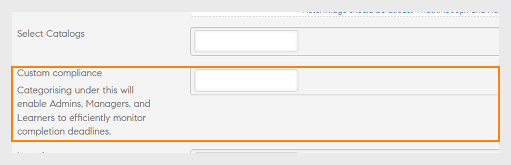
   _新增自訂合規性_

   >[!IMPORTANT]
   >
   >在加入自訂合規時，務必設定課程的截止日期。

   >[!NOTE]
   >
   >最多可有50門課程、學習路徑或證照，對自訂合規類型標籤具有相同價值。

1. 儲存並發佈課程/學習路徑/認證。
現在課程/學習路徑/認證被視為合規類型。 管理員可以將此課程加入合規儀表板，並與主管分享以追蹤進度

>[!NOTE]
>
>作者也可以編輯現有課程/學習路徑/認證，將合規標籤加進去。

## 遊戲化點數

你可以在關卡和關卡實例層級分配遊戲化點數。 透過這個，你可以為不同的課程或副本分配點數。 學習者會被激勵選修特定課程，或偏好某一課程範例。

1. 在課程實例層級，選擇 **[!UICONTROL Gamification Points]**。

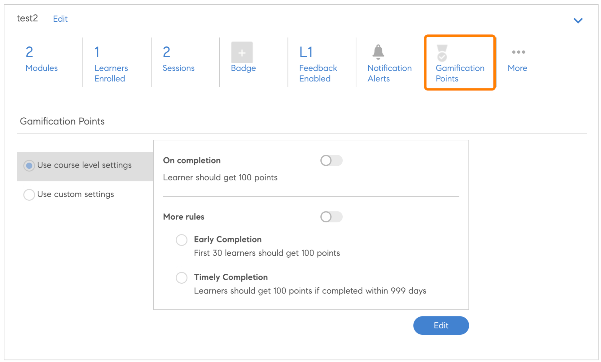

*遊戲化的設定點*

1. 選擇 **[!UICONTROL Edit]**。
1. 如果您選擇使用課程等級設定，會顯示以下選項：

   * **[!UICONTROL On completion]**： 如果你希望學習者完成課程時獲得100分，請選擇此切換。
   * **更多規則**

      * **[!UICONTROL Early completion]**：如果你選擇這個，前30名學習者完成課程後會獲得100分。
      * **[!UICONTROL Timely completion]**：若選擇此項，學習者若在999天內完成課程，將獲得100分。

1. 如果您選擇 **[!UICONTROL Use custom settings]**，以下選項會顯示：

   * **[!UICONTROL On completion]**： 如果你希望學習者完成課程時獲得100分，請選擇此切換。
   * **更多規則**

      * **[!UICONTROL Early completion]**：選擇此點數後，您可以決定有多少學習者會獲得指定積分。
      * **[!UICONTROL Timely completion]**：選擇此選項後，您可以決定在指定時間內完成課程後，學習者將獲得多少積分。

   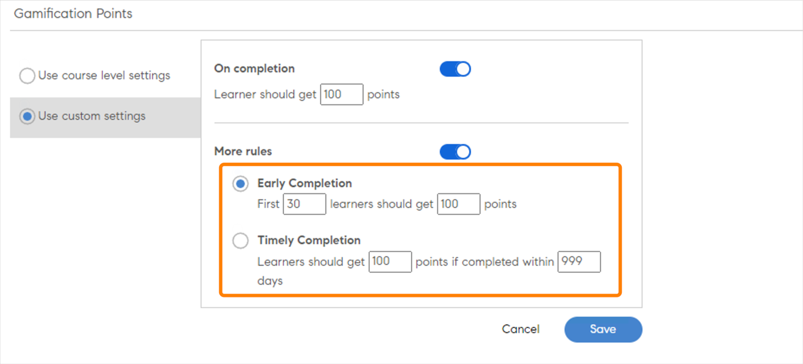

   *提前且及時完成*

1. 選擇 **[!UICONTROL Save]**。

## 彙整學習資源

作者可決定是否要將學習資源集中於學習計畫層級，或保留在單一課程層級。

作為作者，請選擇 **[!UICONTROL Learning Path]** > **[!UICONTROL Settings]**。 點擊 **[!UICONTROL Edit]**。

在該 **[!UICONTROL Resources]** 區塊中，勾選框「顯示在學習路徑層級彙整的組成課程資源」，若啟用，則顯示課程層級的資源是否會在學習路徑層級顯示。

>[!NOTE]
>
>在學習路徑的設定頁面，管理員也可以啟用此選項，顯示課程層級中現有的資源，與學習路徑層級相同。

## 排程助理

處理安排教師與教室的衝突。 如果你想知道任何講師在分配課程前的時間和日期，請使用排程助理。

在建立課程時，若是 VC 或 CR 課程，請點擊排程助理。

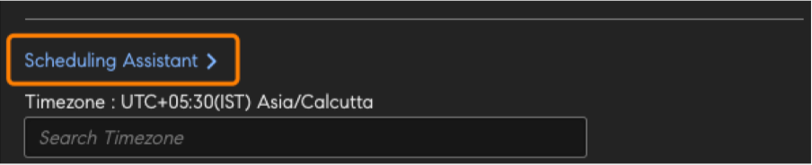

*發射排程助理*

排程助理視窗啟動。

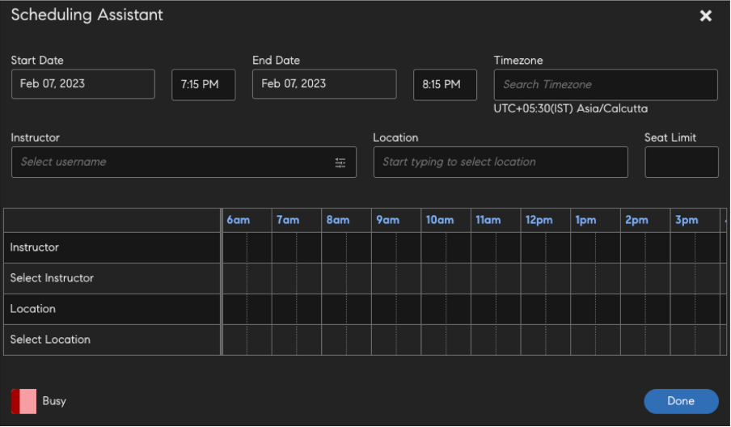

*排程助理對話框*

在排程助理中，你可以：

* 依照教師姓名搜尋。
* 依照技能搜尋講師。

### 依教師姓名搜尋

在講師欄位輸入講師姓名或搜尋部分講師姓名。 會顯示一份教練名單，你可以從中選擇一位教練。

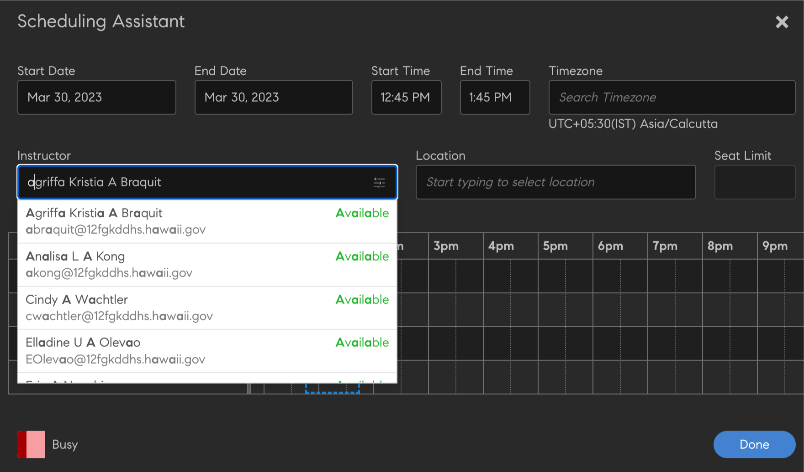

*尋找教練*

可選擇多位講師，但一次只能指派一位講師。 所選時間會在時間衝突視窗中被標示。 在講師附近會出現一個十字圖示，點擊它可以移除講師。

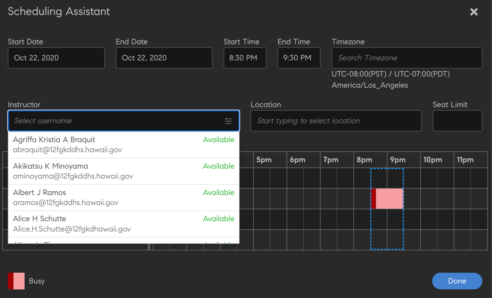

*搜尋多位講師*

### 依技能搜尋講師

尋找具備單一或多重技能的教練。 搜尋使用 AND 運算子。

技能只能以部分或完整技能名稱搜尋，不能依技能等級搜尋。

在助理欄上輸入教練姓名、地點和座位限制。

此外，你可以搜尋技能，點擊指導者搜尋框右側的篩選圖示後會顯示技能。 下面的截圖顯示了這個按鈕。

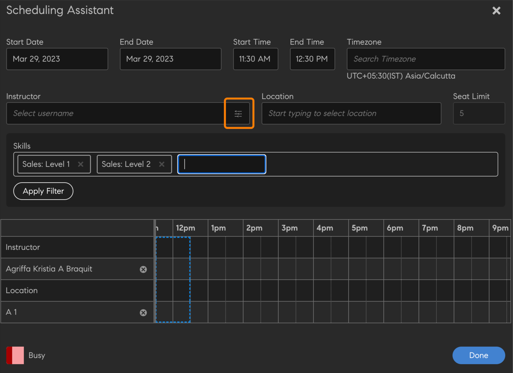

*依技能搜尋講師*

### 使用者群組過濾器

在講師欄位選擇篩選器。 作者 **[!UICONTROL User Group]** 或自訂作者可以透過使用者群組中的數值找到合適的講師。

若同時套用兩個篩選器，會顯示屬於使用者群組的教師名單，並顯示具備所選技能的教師名單。

這適用於課程或實例頁面的排程助理。

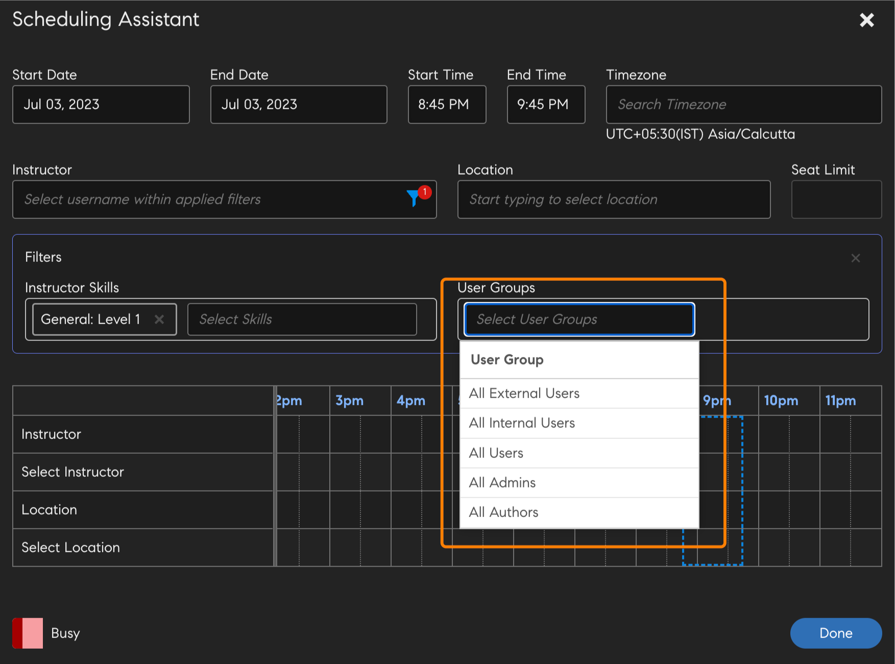

*依使用者群組篩選*

### 實例頁面

您也可以從實例頁面存取排程助理，如下所示。

排程助理也可在實例頁面使用，供管理員及自訂管理員/作者使用。

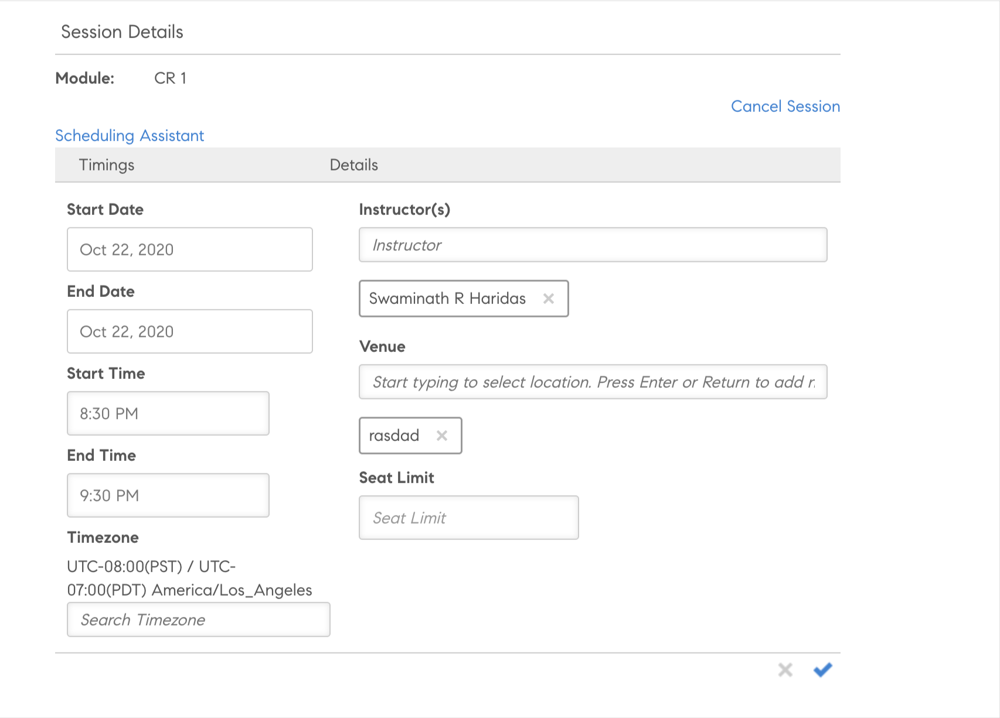

*從實例頁面安排老師*

### 尋找地點

你可以在模組和排程助理頁面上同時指定教室名稱和地點區域名稱來搜尋地點。

## 富文本格式化

在建立課程、學習計畫、認證或工作輔助工具時，作者可以輸入不同類型的內容，如文字、圖片，或套用各種文字格式選項。

建立課程時，你可以在課程概覽欄位看到富文本編輯器。 你可以格式化內容、加入圖片、新增超連結等等。

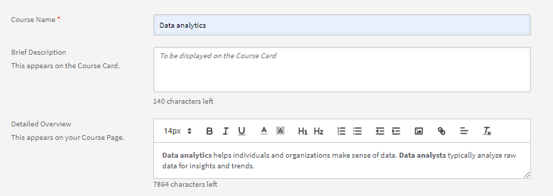

*啟動富文字編輯器*

同樣地，你也可以使用富文本編輯器在建立描述時修改：

**學習計畫**

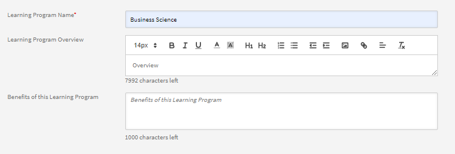

*使用富文本編輯器作為學習程式*

**認證**

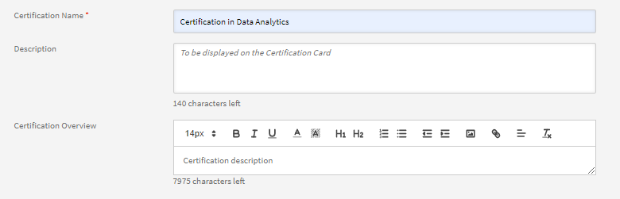

*使用富文字編輯器取得認證*

**就業援助**

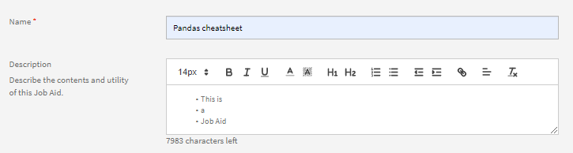

*使用富文字編輯器來申請工作協助*

此外，你也可以使用富文本編輯器來支援其他語言。

## 無頭使用者介面的富文本描述支援

### 為什麼需要 CSS？

富文本由 HTML 標記組成。 若依照原樣渲染標記，瀏覽器會套用預設樣式。 這通常與公司的風格規範不符。 符合指引是必須有CSS的。

### 預設風格

附上的 CSS 樣式表包含由 Learning Manager 套用的樣式。 外觀設計會根據大多數使用情境做調整。 下載附帶的 CSS 檔案，並依照你的慣例和建置系統匯入到你的網頁應用程式。 CSS 定義的類別會以 ql-editor 類別命名空間，且不會干擾你現有的樣式。

### 自訂風格

預設的造型可能無法滿足每個人的需求。 自訂可以透過覆蓋提供的 CSS 來完成。 所有樣式都包裹在 QL-editor 裡，作為後代選擇器。 使用以下類別：

* 縮排： **li.ql-indent-$number**。 $number範圍從1到9
* 尺寸： **QL尺寸-小**、 **QL-尺寸-大**、 **QL-尺寸-巨大**

* 對齊方式： **QL-對齊-中心**， **QL-對齊-對齊**， **QL-對齊-右**

* 顏色： **QL-顏色-$color**。 $color = 白色、紅色、橙色、黃色、綠色、藍色、紫色
* 背景： **QL-BG-$color**。 $color = 黑色、紅色、橘色、黃色、綠色、藍色、紫色
* HTML 標籤：P、OL、UL、PRE、BLOCKQUOTE、H1、H2、H3、H4、H5、H6

[CSS 檔案用於自訂。](assets/ql-headless.css)

### API 變更以支援渲染富文本總覽

當客戶建立無頭介面時，他們需要在他們正在開發的客製化使用者介面中顯示學習對象。 為此，通常會使用 [公開的 GET /learningObjects](https://learningmanagereu.adobe.com/docs/primeapi/v2/#!/learning_object/get_learningObjects) API。 現在 Learning Manager 支援為總覽欄位擷取「富文本」，API 回應中的學習物件資料模型也會暴露相同的內容。 請參閱下方 API 回應中模型片段中名為「richTextOverview」的欄位。 另外請注意，先前暴露的欄位（「概覽」）為向後相容保持不變。

```
{ 
 "data": [ 
 { 
 "id": "string", 
 "type": "string", 
 "attributes": { 
 … 
 "localizedMetadata": [ 
 { 
 "description": "string", 
 "locale": "string", 
 "name": "string", 
 "overview": "string", 
 "richTextOverview": "string" 
 } 
 ], 
 … 
 }, 
 "relationships": { 
 … 
 } 
 } 
 } 
 ] 
} 
```

已經使用總覽欄位的客戶，在無頭介面中仍會看到原有的純文字。 如果客戶想利用富文字概述，他們必須在作者介面中為學習物件建立格式豐富的概述，之後學習管理器會開始回傳富文本概述，除了 API 回應模型中的純文字外。

然而，要在使用者介面中呈現這些富文字，客戶必須包含 CSS。 以下章節將詳細說明此點。

## 允許多次嘗試 {#allowmultipleattempts}

管理員啟用多次嘗試後，作為作者，你可以在課程或模組層級為互動式電子學習模組設定多次嘗試。

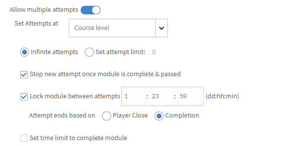

*為互動式電子學習模組配置多重嘗試*

<table>
 <tbody>
  <tr>
   <td>
    <p><b>選擇權</b></p></td>
   <td>
    <p><b>說明</b></p></td>
  </tr>
  <tr>
   <td>
    <p>Set 嘗試</p></td>
   <td>
    <p>你可以將模組的嘗試次數設為無限，或設定明確的限制。<span style="font-size: 0.8125rem;">嘗試資訊一旦啟用，學習者就會看到。 學習者可點擊「重試」按鈕選擇重試模組。</span></p></td>
  </tr>
  <tr>
   <td>
    <p>模組完成或通過後停止新嘗試</p></td>
   <td>
    <p>要設定何時停止學習者選擇新嘗試選項，請啟用「模組完成或通過後停止新嘗試」的勾選框。 「重試」選項會在學習者成功完成模組後從學生視圖中移除。</p></td>
  </tr>
  <tr>
   <td>
    <p>嘗試間鎖模組 0:0:1 格式：天/小時/分鐘</p></td>
   <td>
    <p>你可以在嘗試之間鎖定特定時間，方法是啟用「<b>在嘗試 0:0:1 格式：天/小時/分鐘</b>之間鎖定模組」的勾選框。 當模組被鎖定時，學習者必須在鎖定時間結束前進入該模組。 </p>
    <p>你可透過選擇「<b>玩家接近</b>」或「<b>完成</b>」的核取方塊來定義嘗試的結束條件。</p></td>
  </tr>
  <tr>
   <td>
    <p>球員接近</p></td>
   <td>
    <p>每次模組啟動若條件為「<b>玩家接近</b>」，則視為新嘗試。 學習者會被提示模組鎖定細節及嘗試細節，關閉玩家。</p></td>
  </tr>
  <tr>
   <td>
    <p>完工</p></td>
   <td>
    <p>如果嘗試結束是基於 <b>完成</b>度，則會根據內容成功標準計算。 學習者在內容傳送完成資訊前不得重試模組。 模組鎖定與嘗試細節會在嘗試結束後傳達給學習者。</p></td>
  </tr>
  <tr>
   <td>
    <p>設定完成模組的時間限制</p></td>
   <td>
    <p>作者可透過啟用「<b>設定完成模組</b>的時間限制」勾選框來設定完成模組的時間限制。</p>
    <p>每次玩家發射都視為一次新嘗試，學習者會在發射時被提示時間細節。</p>
    <p><b>注意：</b><span style="font-size: 0.8125rem;">時間一到，嘗試將自動結束。 關閉玩家會結束當前嘗試。</span></p></td>
  </tr>
  <tr>
   <td>
    <p>模組層級的多次嘗試</p></td>
   <td>
    <p>從「設定嘗試」下拉選單選擇「模組層級」嘗試，可以讓你在各個模組層級設定選項。</p></td>
  </tr>
 </tbody>
</table>

## 課程模組 {#coursemodules}

### 新增模組 {#addmodules}

你現在可以新增內容、前置和測試模組。 **內容** 模組是課程的主要模組。 **工作** 前模組包含一些基本資訊，有助於學習者為課程做好準備。 這些模組並非學習者必須完成的必修課程。 **&#x200B;**&#x200B;測驗模組幫助學習者跳過內容，若已熟悉內容並希望透過考試符合合規要求，便可直接參加考試。

要新增內容模組，請執行以下步驟：

1. 點擊 **[!UICONTROL Add Modules]**。 你可以看到四個新增模組的選項。 第一個選項是加入自學模組。 這些模組是你在 Adobe Learning Manager 中建立並加入模組庫的。 第二個選項是設置虛擬教室。 第三個是設置教室模組，第四個是活動模組。

   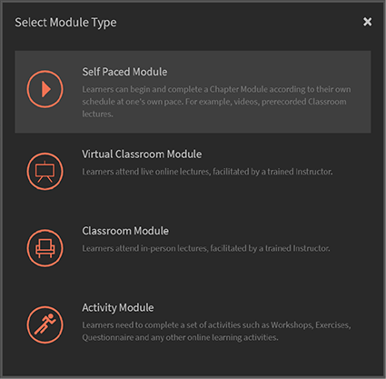

   *為課程新增模組*

   **自學模組：** 在此模式中，你可以依照自己的節奏開始並完成課程模組。 你可以自己安排時間表。

   點擊選項後，你可以看到已經加入模組庫的自學模組清單。 你可以在這裡瀏覽清單，選擇想加入的模組，或是透過在搜尋欄輸入模組名稱或模組標籤來搜尋模組。

   選擇模組後，請點擊 **[!UICONTROL Add]**。 這些模組現在都出現在內容區塊下。

   你也可以重新排列模組。 拖曳任意模組並向上或向下移動，並將模組依正確順序排列。

   **虛擬教室模組：** 在此模式下，學習者可參加由受過訓練的講師主持的線上直播講座。 輸入標題、描述，並設定會話長度。 你也可以指定會議網址和負責授課的講師。 要儲存變更，請點擊 **[!UICONTROL Done]**。

   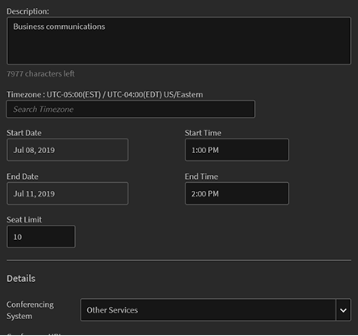

   *新增一個 VC 模組*

   在使用 Virtual Classroom 設定對話框建立課程時，請將會議系統&#x200B;**設定**&#x200B;為你所建立的 Teams 連線。選擇你是否想要活動的會議組織者。

   如果你選擇 **「是** 」作為會議組織者，必須輸入主辦人名稱。 輸入名稱並選擇主辦人。

   **繞過大廳**

   * 如果你選擇 **「是」**，任何學習者都可以加入會議。
   * 若選擇 **「否**」，則會向主辦方發送請求，決定是否允許學習者加入會議。

   **注意：** 學習者必須在 Microsoft Teams 上可用。 不過，學習者可以以訪客身份加入學習經理。

   **課堂模組：** 在此模式下，學習者需參加由受過訓練的講師主持的實體講座。 輸入標題、描述，並設定會話長度。 你也可以指定課程地點及授課老師。 要儲存變更，請點擊 **[!UICONTROL Done]**。

   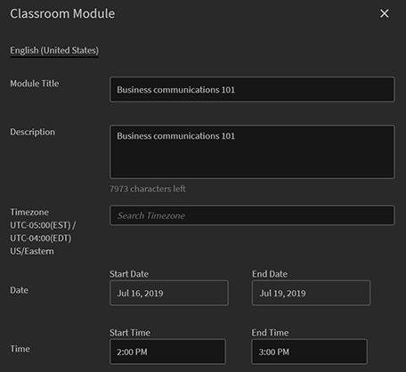

   *新增教室模組*

   建立課程時，在虛擬教室設定對話框中，將會議系統設定為你建立的 Microsoft Teams 連線。 選擇你是否想要活動的會議組織者。

   如果你選擇「是」作為會議組織者，必須輸入主辦人名稱。 輸入主辦人名稱並選擇主辦人。

   **繞過大廳**

   * 如果你選擇「是」，任何學習者都可以加入會議。
   * 若選擇「否」，則會向主辦方發送請求，決定是否允許學習者加入會議。

   **注意：** 若學習者想以訪客身份加入 Microsoft Teams，必須輸入電子郵件。 電子郵件必須存在於學習管理員中。

   **活動模組：** 在此模式中，學習者必須完成一系列活動，如工作坊、練習、問卷及其他學習活動。 輸入標題、描述和外部網址作為參考。 要儲存變更，請點擊 **[!UICONTROL Done]**。

   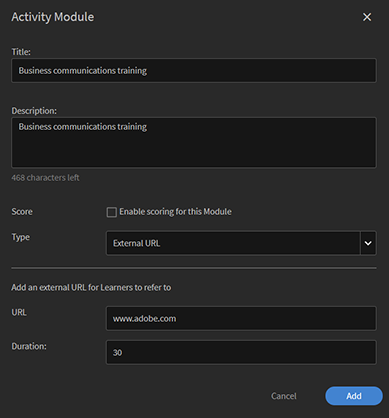

   *新增活動模組*

   你可以在課程中新增活動模組時指定活動類型、檔案提交和基於 xAPI 模組的長度。

1. 同樣地，加入預備工作和測試模式的模組。
1. 根據你的偏好，選擇模組的序列類型為有序或無序。

   如果你選擇 **有**&#x200B;序，模組會依照你建立的順序出現。 如果你選擇 **無序**，模組就不會被排序。 學習者可依任意順序完成模組。

1. 從必修模組下拉選單中，選擇學習者完成課程必須修讀的模組數量。
1. 新增課程封面圖片和橫幅圖片。 目錄由管理員建立。 欲了解更多資訊，請參閱 [目錄](/help/migrated/administrators/feature-summary/catalogs.md)。

   **注意：** 建議尺寸如下：

   * **封面圖片：** 300 px 300 px
   * **橫幅圖片：** 1600 像素 x 140 像素

1. 在頁面右上角，點擊 **[!UICONTROL Save]**。

#### 在活動模組中新增 HTML 連結

作者可以在活動模組中加入 HTML 連結並設定完成標準。 要新增 HTML 連結並設定完成條件，請依照以下步驟操作：

1. 在作者應用程式中，選擇 **[!UICONTROL Create Courses]** 首頁。
1. 從螢幕選擇&#x200B;**[!UICONTROL Add]** **[!UICONTROL Course Catalog]**
1. 請輸入課程名稱和說明。
1. 在選項 **[!UICONTROL Module]** 中，選擇 **[!UICONTROL Add Module]** > **[!UICONTROL Activity Module]**。
1. 在提示中 **[!UICONTROL Activity Module]** 輸入姓名和描述。
1. 選擇 **[!UICONTROL Type]** 為 **[!UICONTROL External URL]**。
1. 請從選項中 **[!UICONTROL Completion Criteria]** 選擇以下任一選項。
   * **[!UICONTROL Learner marks complete]**&#x200B;學習者可選擇在流體玩家中標記該課程為完成。
   * **[!UICONTROL On Launching content]**：當學習者啟動課程時，課程將自動標記為完成。

   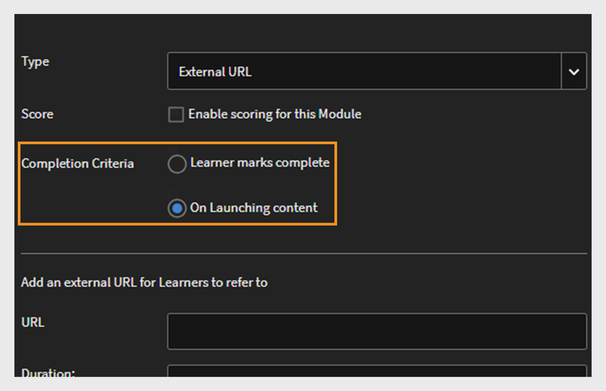
   _完成標準_

1. 選擇 **[!UICONTROL Add]** 並發布課程。

### 替換已出版課程中的模組

Adobe Learning Manager 為作者提供工具，以建立、編輯及管理由多個內容模組組成的課程。 當課程內容需要更新或改進時，作者可以替換現有模組，而不影響學習者的學習進度。

更換模組：

1. 以作者身份登入 Adobe Learning Manager。
2. 在左側導覽窗格選擇 **[!UICONTROL Courses]** 。
3. 選擇任一課程，然後選擇 **[!UICONTROL Edit]**。
4. 選擇你想更換的模組。
5. 更改標題和描述。
6. 請使用 **內容** 選項選擇模組。
   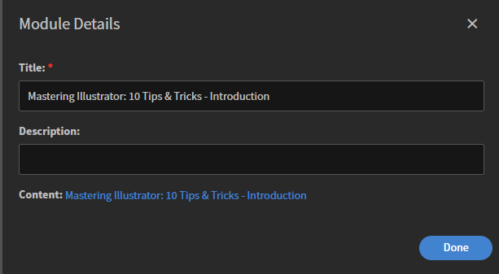
7. 選擇 **[!UICONTROL Done]**。
8. 選擇 **[!UICONTROL Republish]**。

學習者可保留其他模組的進度，但需完成新模組才能完成課程。

## 檢查清單 {#create-checklist}

評估是任何學習管理系統（LMS）中一個重要的環節。 線上評量是評估學習者對主題理解程度的主要方法之一。 但通常，在工作時，觀察一個人執行必要任務時，評估其理解程度是必要的。

考慮店員或倉庫員工，正在接受日常任務的評估。 可能是修理咖啡機的步驟，或是包裝材料的步驟。 講師可根據檢查清單評估員工，並在評估活動中以通過或不通過來評分。

### 建立清單 {#createachecklist}

只有作者才能製作清單。 檢查清單是一種活動模組。 在設定活動模組時，作為作者，你可以選擇「活動作為 **檢查清單**」，如下所示：

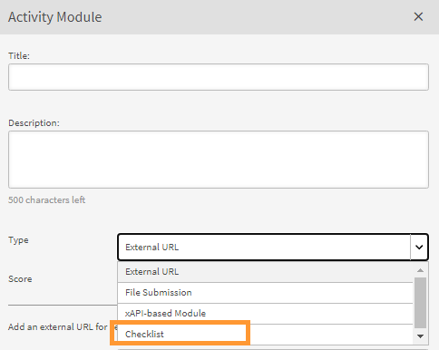

*建立清單*

一旦你選擇了「清單&#x200B;**」這個選項**，你會看到幾個額外的選項。

**檢查清單類型：** 選擇任意選項，是 **/否** 或 **1-5**。 如果你選擇是/否，清單上會出現只能用是或否回答的問題。 如果你選擇1到5分，可以看到李克特檢查表，你可以用五分制評分問題。

**通過標準：**

<table>
 <tbody>
  <tr>
   <td>
    <p>如果你選擇 <b>是/否</b>，那麼......</p></td>
   <td>
    <p>如果你選 <b>了1到5</b>，那麼......</p></td>
  </tr>
  <tr>
   <td>
    <p>將通過標準設為回答數量為「是」。 例如，若你輸入3，學習者在講師評估時至少收到三次 <b>「是」 </b>回答，即表示通過課程。</p></td>
   <td>
    <p>將通過標準設為1到5之間的任意門檻。 例如，若你輸入2和4，學習者若至少獲得 <b>兩次 </b>分數大於 <b>四</b>的評估，則該課程即通過。</p></td>
  </tr>
 </tbody>
</table>

選擇一位或多位教師來評估學習者。

另外，如果你有什麼想留言或做筆記，也可以在 **「備註給講師** 」的文字欄裡加入。

現在，加入清單問題。 點擊 **[!UICONTROL Add]**。 你最多只能加總150題。

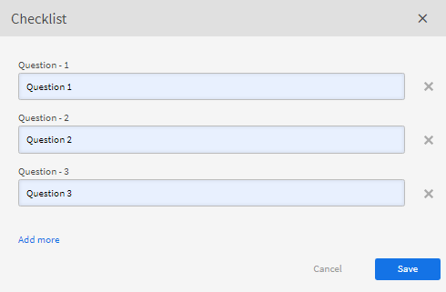

*新增清單問題*

如需新增更多問題，請點擊 **[!UICONTROL Add more]**。

儲存變更，新增模組，然後發佈課程。

### 新增技能 {#addskills}

在本頁請輸入以下細節：

1. 選擇課程技能、升級，並設定技能的學分。 如果需要，可以增加更多技能。

   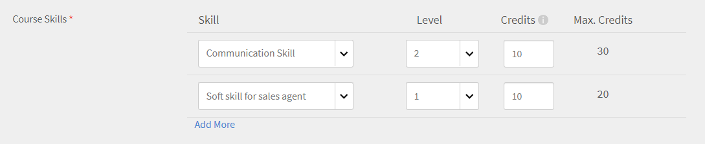

   *新增課程技能*

1. 選擇註冊類型。 以下是選項：

   * **經理提名：** 只有經理人可提名這些課程。 學習者無法報名這類課程。
   * **經理核准：** 經理核准這些課程。 學習者可以報名這些課程，但未經經理批准，不會直接註冊此類課程。 當學習者報名這類課程時，會向經理發送通知請求。 經經理核准後，這些課程會被列為已註冊學習者。
   * **自選：** 學習者可直接報名這類課程。

1. 如果您想讓學習者能夠自行退選課程，請啟用「學習者可以自行&#x200B;**退選」的勾選框**。
1. 選擇必須完成的先修課程，才能開始修課。 點擊課程欄位，從課程列表中選擇。

   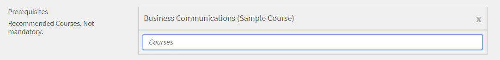

   *新增先修課程*

1. 如果你想讓先修課程成為必修，請啟用 **先修課程** 的勾選框。
1. 在課程中加入與你課程相關的關鍵字標籤。 這些標籤幫助學習者在搜尋時輕鬆找到你的課程。 所有這些標籤都是根據我們新增的模組自動新增的。 如果你有其他想加進這門課的標籤，也可以直接輸入。
1. 請點擊文字區，從建議中選擇你的目標受眾檔案。
1. 把課程的資源檔案當作額外資料。 拖曳你的素材，如文字、影片或音訊檔案。
1. 現在，這門課程將提供給擁有這些資料的學習者，作為推薦課程。 你也可以在本節附上學習者所需的額外資源。 學習者可下載這些檔案以供日後參考。 完成這些修改後，請點擊 **[!UICONTROL Save]** 右上角。 這樣可以將你的課程保存為草稿。 你的課程預設會被儲存為草稿。

## 指派課程講師 {#assigninstructorsformodules}

1. 在你為課程建立模組後，可以指派講師負責這些模組。 從作者儀表板點選 **[!UICONTROL Course Catalog]**。
1. 點擊你想分配講師的課程。
1. 在 **「新增模組** 」區塊，點選你想指派講師的模組。
1. 在講 **師** 欄位中，指定你想指派講師角色的使用者名稱。

   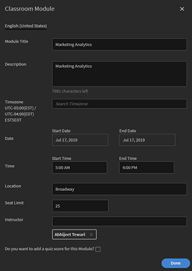

   *指派使用者一個講師角色*

1. 若要重新發布課程並更新內容，請點擊 **[!UICONTROL Republish]**。

### 讓教練能夠標記成功

Adobe Learning Manager 允許教師在教室或虛擬教室模組中標記學習者的成功狀態。 作者可在創建教室或虛擬教室模組時，授權教師標記學習者的成功狀態。 教師可透過標記學習者為通過或不及格，確保進度能相應更新。

為了讓教師能夠標記學習者的成功：

1. 以作者身份登入 Adobe Learning Manager。
2. 請在首頁選擇 **[!UICONTROL Create Courses]** 。
3. 選擇 **[!UICONTROL Add]**。
4. 輸入必要的細節並選擇 **[!UICONTROL Add Modules]**。
5. 選擇 **[!UICONTROL Virtual Classroom Module]** 或 **[!UICONTROL Classroom Module]**。
6. 輸入必要資料並選擇日期。
7. 選擇 **[!UICONTROL Allow Instructor to mark success]** 選項。

   
   _課程詳情畫面，並標示「允許講師標記成功」選項，針對教室或虛擬教室模組_

8. 選擇 **[!UICONTROL Done]**。


## 觀察檢查清單

現在，清單模組除了教師外，管理者也能審閱。 人員經理以及非階層式經理，如門市經理或地點經理，都可以檢視並完成清單。

課程作者可在設置檢查清單模組時，於「審查員」區塊中選擇這些角色選項，將人員管理者及非階層式經理（如適用）加入為審查員。 這可以在課程實例層級完成。

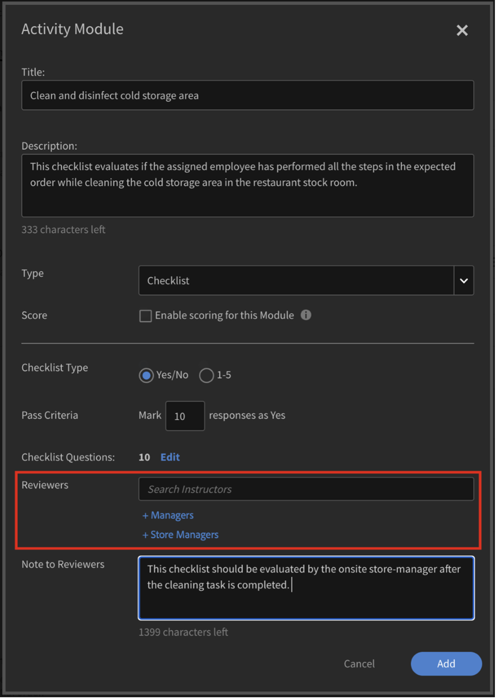

*在活動模組中新增審查員*

選擇「**[!UICONTROL +Managers]**」選項將自動啟用學習者在組織階層中的主管檢視檢查清單。 你不需要逐個搜尋並新增經理名字。

如果您的帳戶管理員透過「活動欄位」選項設定了非階層式的經理角色（如地點管理員或站點經理），這些管理員角色將可供您選擇並啟用以檢視清單。

你不需要逐個搜尋並新增經理名字。 當學習者報名清單課程時，系統會自動向他們的經理/店長發送通知，並附上所選教師一同審核。 這種工作流程讓作者可以簡單地不提及個別經理的名字。

在上方提供的範例截圖中，選擇「**[!UICONTROL +Store Managers]**」選項會自動啟用與學習者對齊的非階層式管理者檢視檢查清單。 請注意，這裡的「儲存」會被管理員定義的活動欄位取代。

檢查清單模組的更新也包括當學習者註冊包含檢查清單模組的課程時，會通知講師與經理。 審查員會收到學習經理通知中心以及講師/經理儀表板的通知，告知檢查清單行動即將完成。

<!--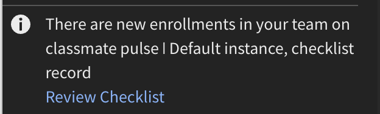-->

審查員登入教師/經理後，可從檢查清單選單及通知選單查看所有待處理清單複習項目的資訊。

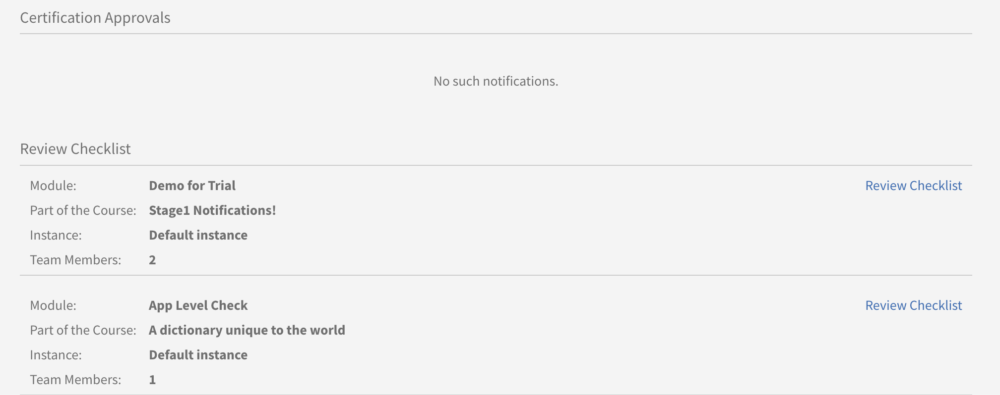

*認證批准*

點擊審查清單後，審核者即可完成評估。

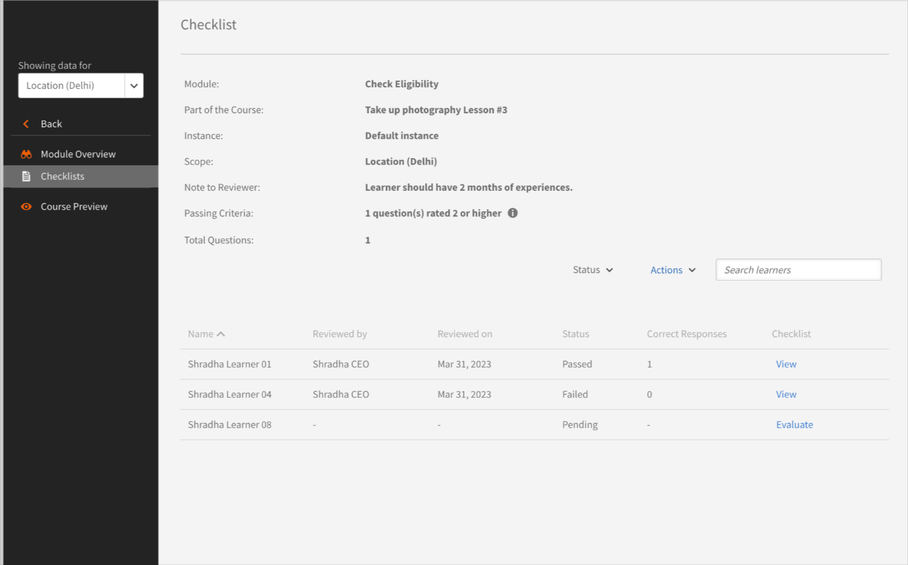

*檢視待處理的清單複習項目*

報告可在檢查清單中下載，包含學習者評估、審查者姓名、職務及電子郵件等詳細資訊。

檢查表報告 csv 包含了新的及更新欄位：

* 用審稿人姓名取代講師名
* 用評審郵件代替講師郵件
* 審查員角色-可能的價值包括經理、門市/地點經理、講師

## 預覽球場 {#previewacourse}

課程建立並儲存為草稿後，你可以以學習者身份預覽課程，然後發佈以提供課程目錄。

欲預覽課程，請點擊 **[!UICONTROL Preview as learner]**。

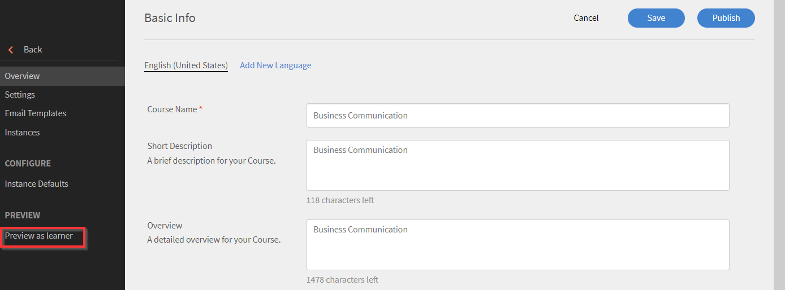

*以學習者身份預覽課程*

這會開啟課程 **概覽** 頁面，您可以查看模組、順序及其他相關細節。

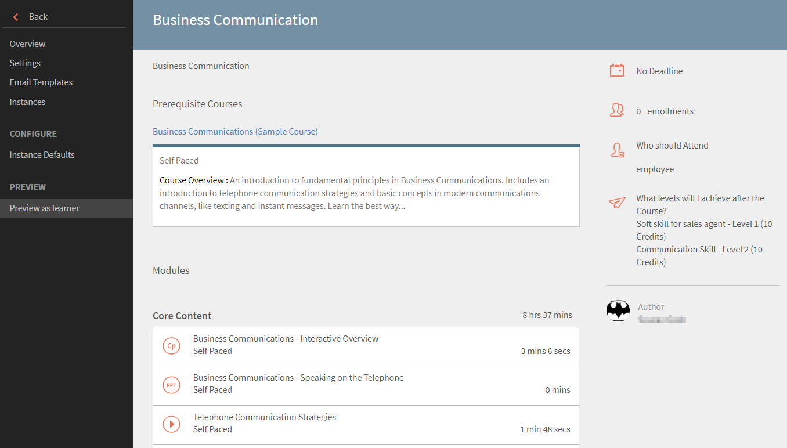

*查看模組及其他相關細節*

想了解學習者如何體驗此課程，請點擊每個模組開始遊玩。 這會開始在流體播放器中遊玩該賽道。

## 發表課程 {#publishacourse}

以學習者身份預覽課程後，你可以發布課程，讓學習者能直接使用。 請注意，課程仍處於選秀模式。

典型的課程生命週期如下：

* **草稿** ——作者完成課程建立並儲存的過程。 目前，課程尚未開放給學習者。
* **已出版** - 作者完成課程出版。 在此州，課程對學習者開放報名。 你也可以在這個州編輯課程。
* **退休** - 課程出版後，作者若不希望課程出現在學習者的課程目錄中，可以將其移至退休狀態。
* **已刪除** - 處於刪除狀態的課程是指該課程從 Adobe Learning Manager 應用程式中完全移除。 只有作者在課程處於草稿或退休狀態時才能刪除課程。

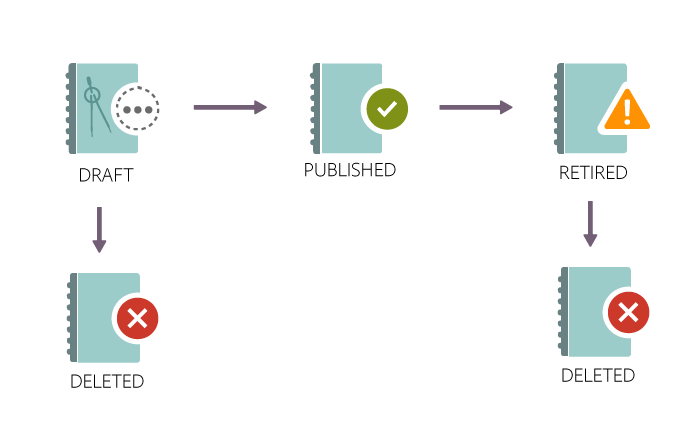

*課程生命週期的工作流程*

要發佈你所建立的課程，請點擊 **[!UICONTROL Publish]** 頁面右上角。

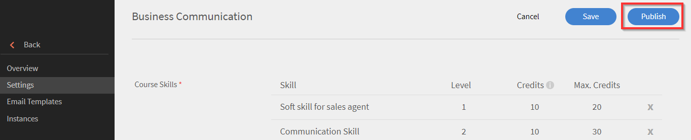

*發表課程*

在跳出的確認訊息中，點擊 **[!UICONTROL OK]**。

該課程現已收錄於課程目錄中。

## 查看課程 {#viewacourse}

你可以以作者身份查看所有可用課程的清單。 若要在 Learning Manager 帳號中查看所有課程，請點擊課程目錄。 要在學習管理員中查看你已撰寫的所有課程，請點擊 **[!UICONTROL My Courses]**。

在課程卡上，將滑鼠移到選項上，然後點選 **[!UICONTROL View Course]**。

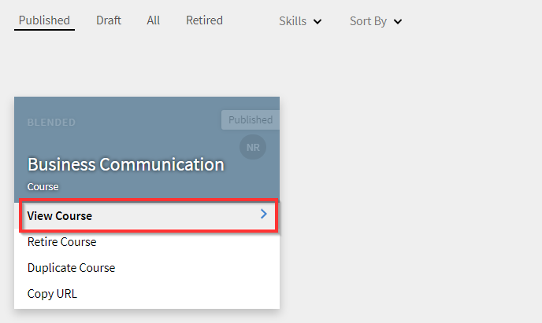

*查看課程*

賽道資訊視窗顯示。 課程為唯讀模式。 要修改課程，請點擊 **[!UICONTROL Edit]**。

## 退役課程 {#retireacourse}

管理員可以啟用 Adobe Learning Manager 帳號的退休選項。 此功能允許管理員退休課程，使新課程無法使用，同時讓已註冊的學習者保留使用權限。

退休課程會讓學習者發現，即使他們已經註冊或已完成。 如果您退休了一門課程，就無法為新學習者報名。 已註冊的學員可參加此課程。

要啟用 Adobe Learning Manager 帳號的退休選項：

1. 以管理員身份登入 Adobe Learning Manager。
2. 選擇 **[!UICONTROL Settings]** ，然後選擇 **[!UICONTROL General]**。
3. 可從以下選項中選擇退休選項之一：
   * 退休後，已註冊學習者將能查看並執行操作，但尚未註冊的學習者將失去存取權限。
   * 退休後，已註冊及尚未註冊的學員將失去使用權。

管理員可以從頁面中退休課程 **[!UICONTROL Courses]** 。

要退休課程，請在課程卡片上將滑鼠移到選項，然後點擊退休課程。

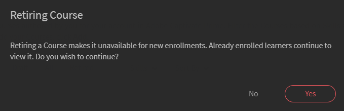

*退役課程*

在跳出的確認視窗中，點擊 **[!UICONTROL Yes]**。

## 重複課程 {#duplicateacourse}

你可以先建立課程副本，然後修改課程。 如果你想備份課程，可以複製課程。

## 搜尋課程 {#searchforcourses}

Adobe Learning Manager 讓您能更快找到心儀的課程。 您可以以下方式搜尋您的課程：

**搜尋欄：**&#x200B;點擊課程目錄&#x200B;**頁面右上角**&#x200B;的搜尋欄。輸入課程名稱或與課程相關的關鍵字。 你也可以使用課程創建時新增的標籤來搜尋。 標籤可在搜尋課程欄位中搜尋，也就是說，當你輸入時，標籤會顯示在搜尋欄位中。

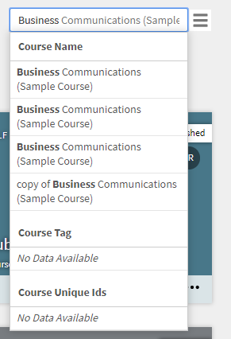

*搜尋課程*

**篩選課程列表：** 您可以依州篩選課程，如全部、已出版、選秀及退休。 根據您的選擇，您可以查看篩選後的課程清單並選擇必修課程。

作為作者，你也可以整理課程，以更好地找到你所要求的課程。 點擊 **[!UICONTROL Sort by]** 並選擇字母遞增順序、字母遞減順序、課程創建日期、課程更新日期及課程成效。

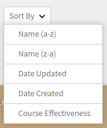

*課程篩選列表*

## 為學習者報名課程 {#enrolllearnersinacourse}

若要讓學習者註冊課程，或讓管理者提名學習者參加課程，您必須切換到管理員模式，因為只有管理員有權註冊學習者參加課程。

要切換到管理員模式，

1. 點擊你的個人頭像，然後選擇管理員。
1. 在管理員模式中，點擊 **[!UICONTROL Courses]** 左側窗格。 在此頁面，您可以查看所有作者在您的學習管理帳戶中所建立的所有課程。
1. 要註冊學習者，將滑鼠移到課程卡片上，你會看到「註冊學習者&#x200B;**」這個選項**。點選這個選項。

   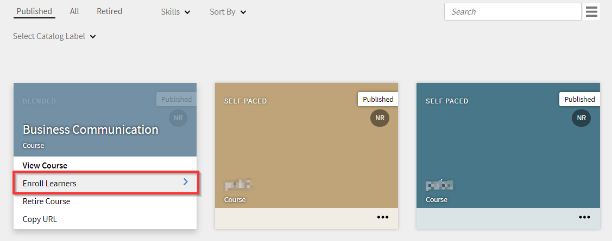

   *為學習者報名課程*

1. 在「註冊學習者」對話框右上角，你會看到選擇了「預設實例&#x200B;**」這個選項**。一旦作者建立課程，該課程的預設實例就會被建立。

   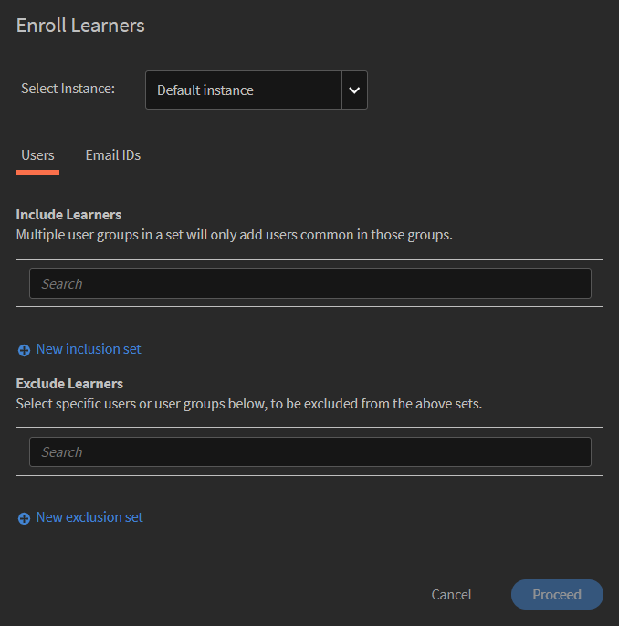

   *查看課程的預設實例*

1. 開始在「包含學習者」欄位輸入學習者的名字並選擇學習者。 你也可以在這裡新增使用者群組。 如果你想把所有學習者註冊到你的學習管理員帳號，請開始輸入全部。 你也可以讓學習者組成團隊。

   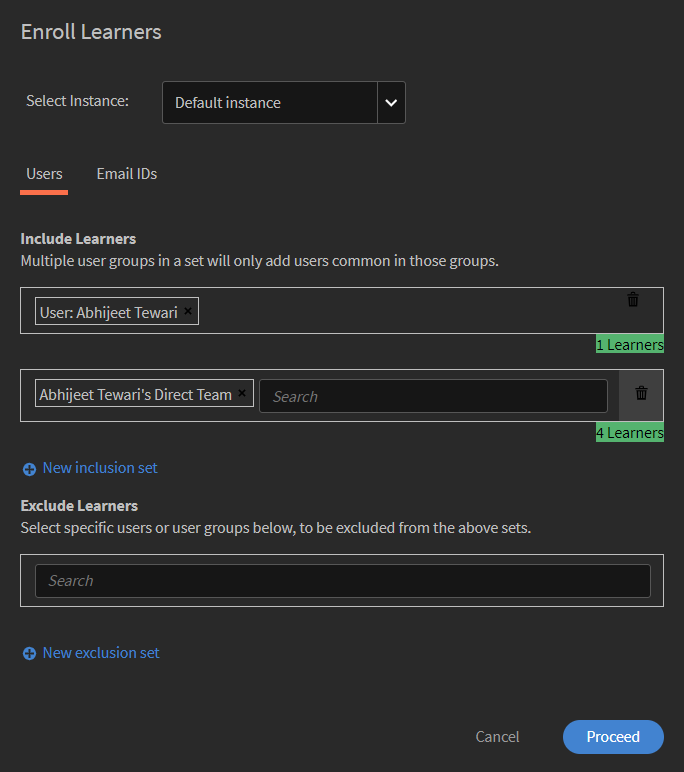

   *將 learhers 加入課程*

1. 若您想排除任何學習者，請在 **「排除學習者** 」欄位輸入學習者姓名。
1. 註冊學習者後，請點擊 **[!UICONTROL Proceed]**。 在「註冊學習者」對話框中，您可以查看註冊摘要。

   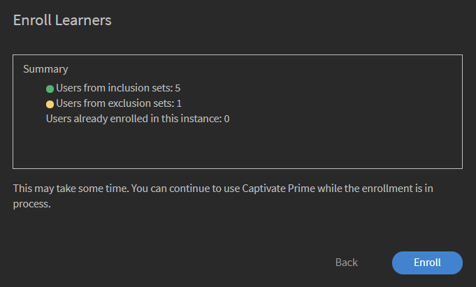

   *查看課程報名摘要*

1. 要報名所有學習者，請點擊 **[!UICONTROL Enroll]**。 這些學員現已成功註冊此課程。 學員會收到通知，可以繼續參加課程。 若要招收更多學生，請重複報名程序。

## Connect VC 模組課程實例頁面的變更 {#connect-vc}

在取得 Connect 課程時，你可以建立兩種類型的房間：

* 動態
* 持續性

持久的網址總是固定的。 但對於沒有 Connect 且沒有自己會議室的使用者來說，他們必須在執行時使用動態會議室。 人們接著可以加入他們的會議。

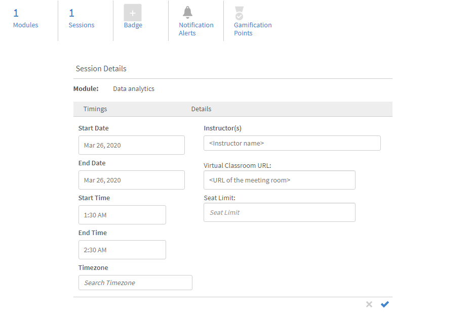

*動態會議室選項*

你現在可以在課程實例&#x200B;**頁面更改持久房間**&#x200B;的網址。

<!--
| 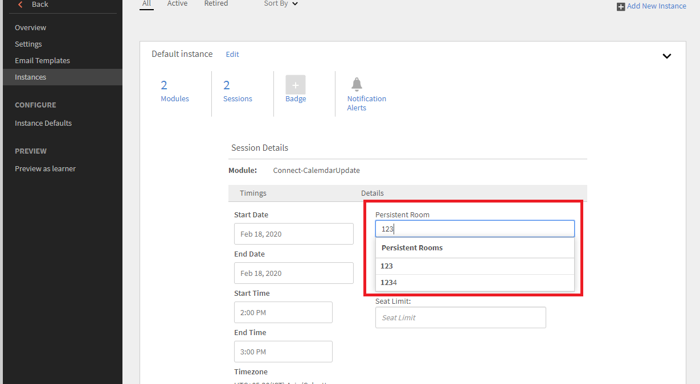 | 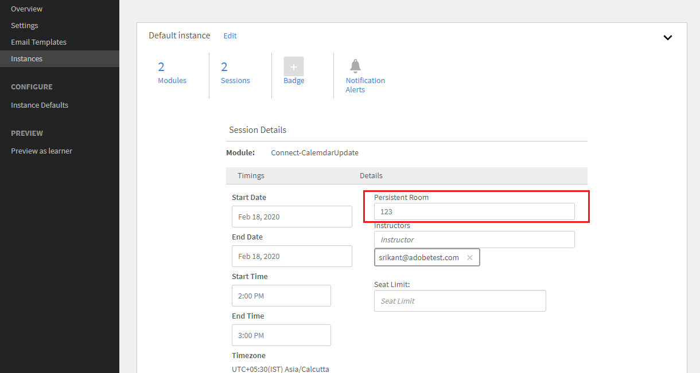 |
|---|---|
-->

## 退選課程的學習者 {#unenrolllearnersfromacourse}

在建立課程時，作者可啟用「學習者可自行&#x200B;**退選」的選項**，讓正在修課的學習者也能從課程中解讀。

管理員也可以取消學員的課程註冊。

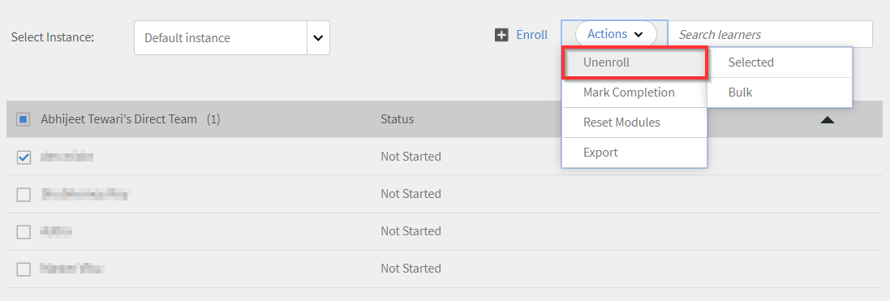

*退選課程的學習者*

更多資訊請參見 [「退學學習者](/help/migrated/administrators/feature-summary/courses.md)」。

## 新增 Captivate 與 Presenter 的課程模組 {#addcoursemodulesforcaptivateandpresenter}

你也可以透過 Adobe Captivate 和 Adobe Presenter 軟體，透過發佈選單將課程模組發佈到 Learning Manager。

1. 在 Captivate 中，點擊 **[!UICONTROL Publish]** > **[!UICONTROL Publish to Learning Manager]**。
1. 提供子網域名稱或電子郵件 ID 並點擊 **[!UICONTROL Submit]**。 如果你有多個帳號，系統會提示你選擇該帳號。
1. 用 Adobe 的登入憑證登入。 如果你沒有 Adobe ID，請點擊 **[!UICONTROL Create Account]**。 授權後，您將被導向模組發佈頁面。
1. 提供模組的所有基本資訊，然後點擊發佈。

你可以在學習經理模組頁面看到已發佈的模組。 欲了解更多資訊，請參閱 [「發佈專案至Adobe Learning Manager](https://helpx.adobe.com/tw/captivate/classic/publish-project-to-captivate-prime.html)」。

## 課程效能 {#courseeffectiveness}

課程效能分數幫助作者評估哪些課程未符合學習者需求，並相應調整。 課程效能評估用以了解課程對學習者的實用性。 它是學習者對課程內容反饋結果的綜合結果。 課程測驗結果與經理根據課程學習內容對學習者的評價。

在 **「我的課程」**&#x200B;中，作者可以在課程縮圖上查看課程效能評分，如下圖所示。 你可以看到這門課的評分是100分。

<!--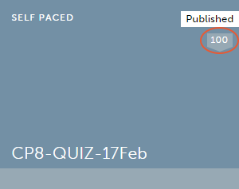-->

課程效能評分值是根據L1、L2及L3的反饋值得出。 要查看每項回饋的拆分，請點擊課程效能值。 彈出選單如下所示。

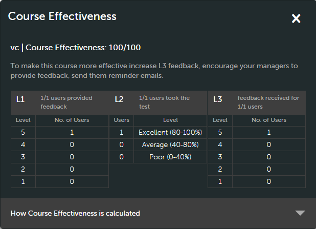

*計算水道效能*

在這個範例快照中，每一位使用者中就有一位收到了三種回饋，因此分數為100/100。 從這張表格，你可以了解哪些回饋缺失，以提升整體效能。 要查看球場效能的計算方式，請點擊彈出選單右下角的下箭頭。

<!--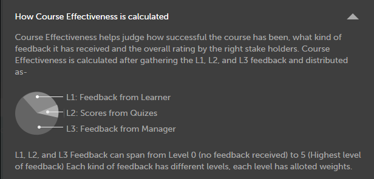-->

如上圖所示，管理層的回饋權重較高。

## 認證與學習計畫 {#certificationsandlearningprograms}

作者與管理員都能從作者應用程式為學習者建立認證與學習計畫。 從首頁點選「認證」或「學習計畫」以建立相應的學習物件。

欲了解如何建立和管理認證與學習計畫，請參閱  [「認證](/help/migrated/administrators/feature-summary/certifications.md) 與  [學習計畫](/help/migrated/administrators/feature-summary/learning-programs.md)」。

## 外部認證必修課程 {#mandatorycoursesforexternalcertification}

在早期的學習管理版本中，外部認證學習者完成課程並非完成證書的必要條件。

你現在可以在課程分頁啟用 **「將必修課程設為證書完成** 必修課程」選項，讓課程成為必修。

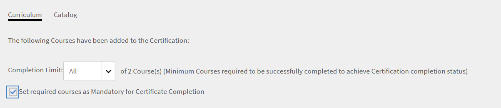

*設定必修課程以完成證書*

當課程被設定為必修時：

* 經理的提交頁面僅在學習者完成課程後列出學習者。
* 學習者必須在完成課程後才能上傳檔案。

## 常見問題 {#frequentlyaskedquestions}

+++如何移除課程的「尋求經理提名」？

請執行以下步驟：

1. 以作者身份登入學習管理員。
1. 開賽道。
1. 在左側窗格，點擊 **[!UICONTROL Settings]** > **[!UICONTROL Edit]**。
1. 在 **「登記類型** 」下拉選單中，將登記類型從 **「經理提名** 」改為 **「經理核准** 」或 **「自行登記**」。

1. 一旦你更改了報名類型，再重新發布課程。

+++

+++如何合併課程？

你可以透過學習計畫合併課程。

1. 以管理員身份登入學習管理員。
1. 在左側窗格，點擊 **[!UICONTROL Learning Programs]**。
1. 要新增學習計畫，請點擊 **[!UICONTROL Add]**。
1. 輸入學習計畫的詳細資訊，並儲存學習計畫，請點擊 **[!UICONTROL Save]**。
1. 建立學習計畫後，點擊 **[!UICONTROL Catalog]**。
1. 在課程卡上，點擊 **[!UICONTROL Add]**，如下所示。 重複這個流程，針對你想加入學習計畫的課程數量進行。

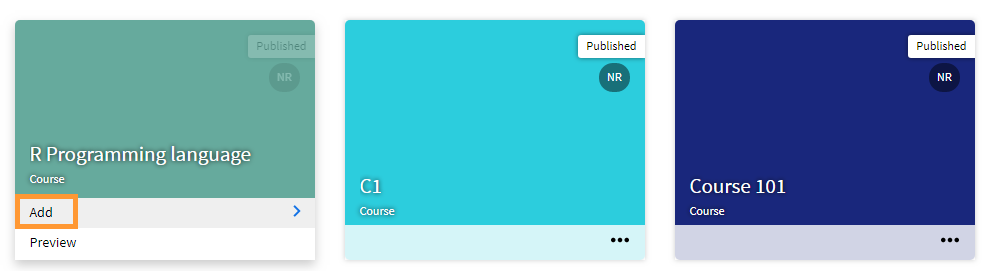

當您將所有必修課程加入學習計畫後，點擊 **[!UICONTROL Publish]**。

在學習計畫中，你只能新增自選課程，不能新增經理提名或經理核准課程。 這是 Learning Manager 的預設行為。

+++

+++如何確保所有學習者無法看到所有課程？

你可以透過目錄來達成這個目標。預設目錄包含所有預設加入 Learning Manager 的課程。

你必須停用預設目錄並建立自訂目錄。

1. 以管理員身份登入學習管理員。
1. 在左側窗格，點擊 **[!UICONTROL Catalogs]**。
1. 點擊 **[!UICONTROL Create]**&#x200B;建立目錄。 輸入詳情並點擊 **[!UICONTROL Save]**。

1. 在新建立的目錄選項中，你可以選擇不同類型的學習內容，例如學習計畫、認證或課程。
1. 在學習計畫區塊，點擊 **[!UICONTROL Add Content]**。
1. 在左側窗格，根據你想鎖定的受眾，點擊 **[!UICONTROL Share Internally]** 或 **[!UICONTROL Share Externally]** 。

1. 要新增使用者群組，請點擊 **[!UICONTROL Add User Groups]**。
1. 在目錄頁面，關閉 **D[!UICONTROL efault Catalog]** 鍵，並啟用你已建立的目錄。

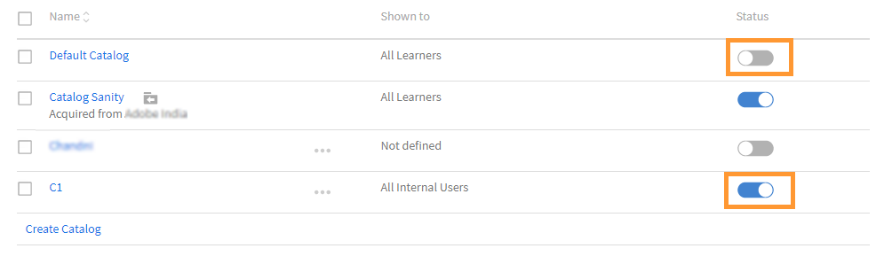

+++

+++如何重新報名完成的課程？

課程完成後無法回溯。 學習 **者無法重新註冊** 完成的課程。

+++

+++學習者完成課程後，如何還能查看？

學習者可點擊課程中的「重訪」按鈕，完成課程後查看該課程。

請執行以下步驟：

1. 以學習者身份登入。
1. 打開你已完成的課程。
1. 點擊 **[!UICONTROL Revisit]**。

+++

+++如何在課程中新增資源檔案？

在建立課程時，你可以加入與課程相關的影片、音訊、PDF 或文字檔案，讓學習者能存取更多訓練資料。

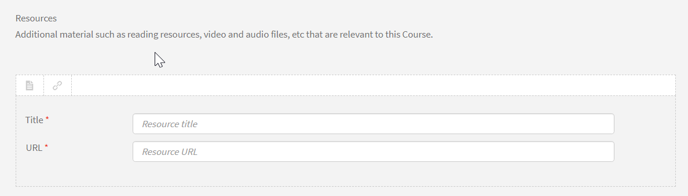

+++

+++如何在模組上設定多次嘗試？

**先決條件：** 管理員必須在管理員應用程式中啟用 **「多次嘗試** 」選項，>設定中 **為一般** 。

作為作者，在課程總覽頁面啟用「允許多次嘗試&#x200B;**」選項**。

欲了解更多資訊，請參閱 [多次嘗試](courses.md#Allowmultipleattempts)的章節。

+++

+++你能下載已上傳到 Adobe Learning Manager 的內容來修改內容嗎？

不，Learning Manager 上傳的內容是已發佈的壓縮檔，不是原始檔案。 因此，即使內容已下載，也無法在創作工具中進行編輯。 你需要一個原始檔案來編輯內容。

+++
