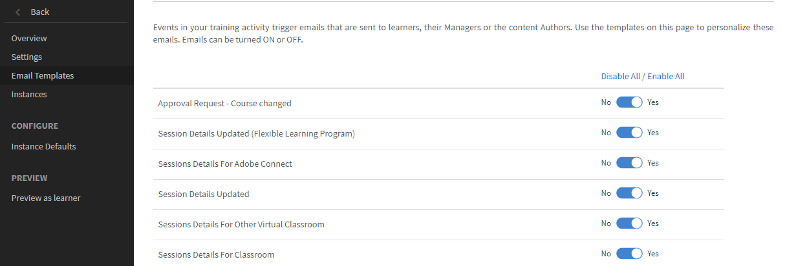
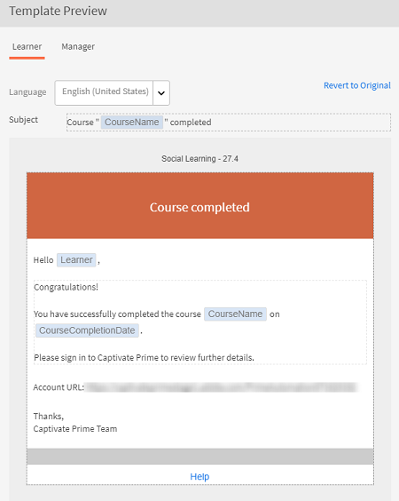
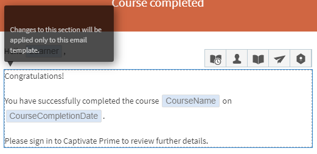

# 電子郵件範本

閱讀本文章，瞭解如何設定與所有學習物件相關之事件的電子郵件範本。

Learning Manager應用程式會根據事件傳送電子郵件通知給使用者的多個角色。

身為作者，您可以針對學習者、管理員及作者活動所觸發的各種事件，新增或修改內容並傳送通知給使用者，以自訂電子郵件範本。 例如，您可以在學習者註冊課程時傳送自訂電子郵件。 註冊時，學習者會自動收到課程專屬電子郵件。

您也可以停用電子郵件範本選項，選擇不傳送特定事件的電子郵件通知。

## 設定電子郵件通知 {#settingemailnotifications}

1. 從作者應用程式中，選取您要設定電子郵件範本的學習物件。 例如，課程。

1. 從「學習物件」頁面，按一下您要設定電子郵件設定的課程、認證或學習計畫。

1. 從學習物件詳細資訊頁面，選取&#x200B;**電子郵件範本** > **所有範本**。 電子郵件範本可用於&#x200B;**預設執行個體**&#x200B;和&#x200B;**目前的課程**。 您可以使用右上角的下拉式清單，在兩者之間切換。

   您可以檢視可供您所選學習物件使用的範本清單。

   
   *範本清單*

1. 按一下事件名稱，以在預覽模式中檢視範本。

   

   *檢視範本預覽*

   您可以按一下範本內文中的文字，自訂每個範本。 您可以按一下快照中所顯示的適當圖示，在文字中插入變數。 將滑鼠停留在每個圖示上以檢視名稱。

   
   *插入變數*

   可使用下列變數：

   * 流水標名稱
   * LPCompletionDeadline
   * 學習者姓名
   * 學習者電子郵件
   * 課程名稱
   * 課程說明
   * CourseCompletionDeadline
   * 課程技能詳細資訊
   * 課程徽章

   您可以按一下範本上方的「回覆成原始」連結，將訊息重設為預設內容。

   如您在範本頂端所見，您可以根據電子郵件通知的型別自訂多個角色（經理、學習者等）的範本。

1. 按一下範本頁面底部的「儲存」 。
1. 從「電子郵件範本」頁面，按一下「是/否」循環切換按鈕，以傳送或停用通知。

*啟用或停用電子郵件通知*

如果通知按鈕中每個事件名稱的圓圈與「是」（藍色陰影為背景）相鄰，則通知會啟用。 如果它是灰色陰影且圓形與「否」相鄰，則通知會停用。

當您在課程層級設定電子郵件範本時，其優先順序高於該特定課程的管理員層級設定。

## 電子郵件範本設定

作者可以在電子郵件範本設定中設定下列專案：

* **電子郵件橫幅**：可讓您修改電子郵件橫幅。

* **電子郵件簽章**：可讓您新增或編輯電子郵件簽章。
