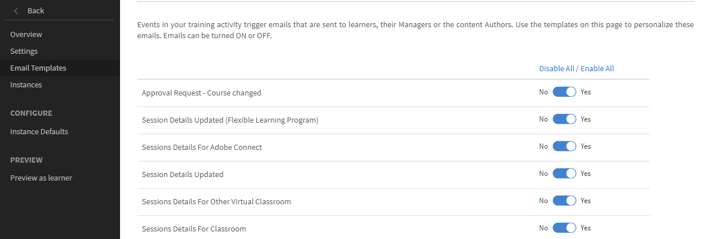
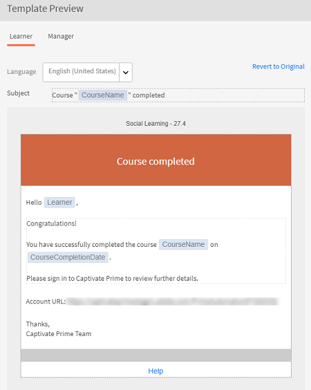
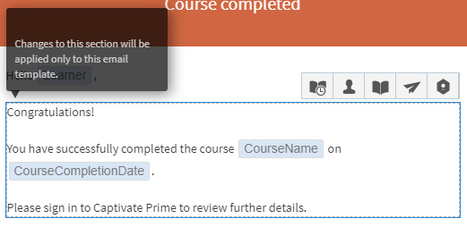
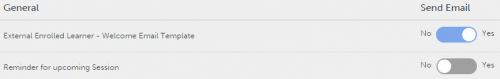

# 電子郵件範本

閱讀本文了解如何為所有學習物件相關的活動設定電子郵件範本。

Learning Manager 應用程式會根據事件向多個使用者角色發送電子郵件通知。

作為作者，你可以自訂電子郵件範本，新增或修改內容，並向使用者發送由學習者、管理者及作者活動觸發的各種事件通知。 例如，每當學員報名你的課程時，你可以發送客製化電子郵件。 註冊時，學習者將自動收到課程專屬電子郵件。

您也可以透過關閉電子郵件範本選項，選擇不發送某些活動的電子郵件通知。

## 設定電子郵件通知 {#settingemailnotifications}

1. 在 Author 應用程式中，選擇你想設定電子郵件範本的學習對象。 例如，課程。

1. 從學習物件頁面，點選你想設定電子郵件設定的課程、認證或學習計畫。

1. 從學習物件詳情頁面，選擇 **電子郵件範本** > **所有範本**。 電子郵件範本可用於 **預設實例** 與 **目前課程**。 你可以透過右上角的下拉選單切換。

   你可以看到你選擇的學習對象可用的範本清單。

   
   *範本列表*

1. 點擊事件名稱即可在預覽模式中查看範本。

   

   *請參閱範本預覽*

   你可以點擊範本正文中的文字來自訂每個範本。 你可以點擊快照中顯示的相應圖示，插入變數。 將滑鼠移到每個圖示上即可查看名稱。

   
   *插入變數*

   可用變數如下：

   * LPName
   * LPCompletionDeadline
   * LearnerName
   * 學習者電子郵件
   * 課程名稱
   * 課程說明
   * 課程完成截止日
   * 課程技能詳情
   * 課程徽章

   你可以點擊範本上方的「還原到原始」連結，將訊息重設為預設內容。

   如你在範本頂端看到的，你可以根據電子郵件通知類型，自訂多個角色（經理、學習者等）的範本。

1. 在範本頁面底部點擊儲存。
1. 在電子郵件範本頁面，點擊是/否循環切換按鈕，即可發送或停用通知。

*啟用或停用電子郵件通知*

如果通知按鈕中每個事件名稱旁的圓圈與「是」相鄰（背景為藍色陰影），則通知已啟用。 如果是灰色陰影且圓圈緊鄰「否」，則通知會被停用。

每當你在課程層級設定電子郵件範本時，它會優先於該課程的管理員層級設定。

## 電子郵件範本設定

作者可以在電子郵件範本設定中設定以下內容：

* **電子郵件橫幅**：允許你修改電子郵件橫幅。

* **電子郵件簽名**：允許你新增或編輯電子郵件簽名。
