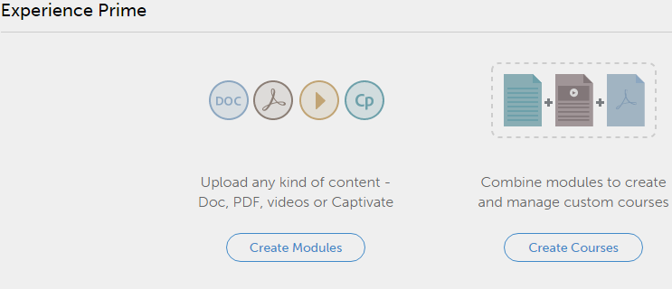

# 作者快速入門

快速入門頁面可協助您逐一瀏覽應用程式的主要功能。

您以作者身分登入後，即可檢視快顯視窗和影片清單。

## 檢視範例影片 {#viewsamplevideos}

瀏覽範例影片教學課程，以瞭解您作為作者的角色的主要功能。 如果您不想在登入期間顯示此快顯視窗，您可以按一下快顯視窗右下角的「登入時不要顯示」選項來停用它。

按一下「關閉視窗」以關閉快顯視窗。

<!---->

## 快速入門頁面 {#gettingstartedpage}

從快速入門頁面，您可以執行下列活動：

* 建立模組
* 建立課程

您也可以選擇檢視教學課程影片、說明內容並瞭解不同角色，以進一步瞭解Learning Manager應用程式。

<!---->
