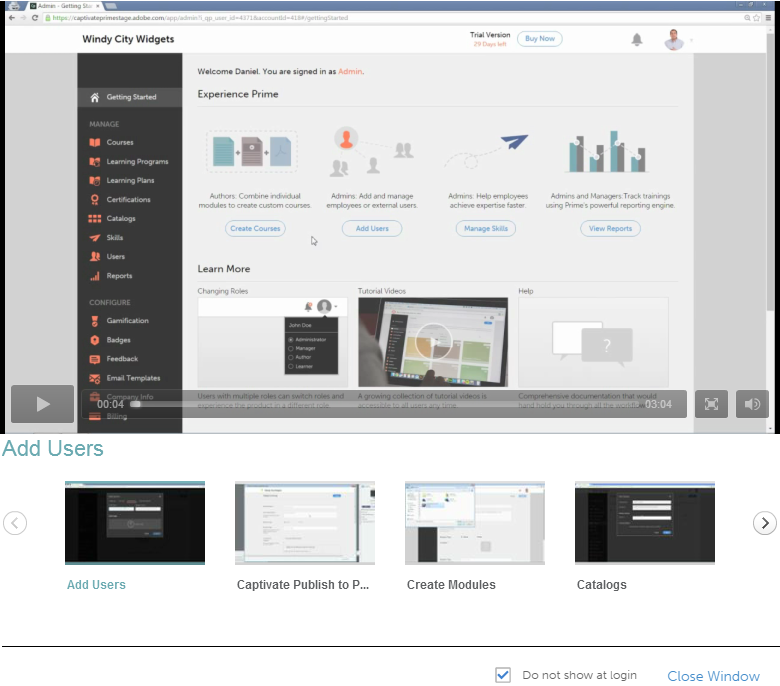

# 成為作家的起步

開始頁面幫助你瀏覽應用程式的主要功能。

登入後，你可以看到彈出的影片清單。

## 觀看範例影片 {#viewsamplevideos}

瀏覽範例影片教學，了解你作為作者角色的主要特點。 如果你不想讓這個彈出視窗在登入時出現，可以點擊彈出視窗右下角的「登入時不顯示」選項來停用它。

點擊「關閉視窗」即可關閉彈出視窗。

<!---->

## 開始頁面 {#gettingstartedpage}

從開始頁面，你可以執行以下操作：

* 建立模組
* 建立課程

你也可以透過觀看教學影片、說明內容及了解不同角色來進一步了解學習經理應用程式。

<!---->
