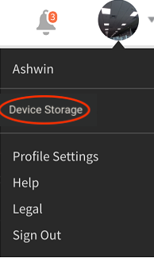
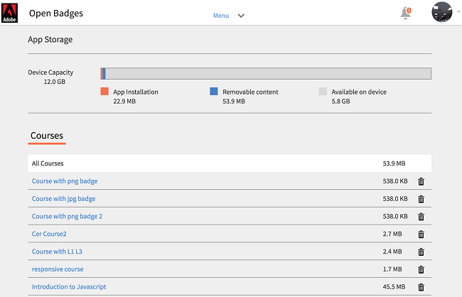

# iPad與Android平板電腦使用者

在iPad或Android平板電腦上的Learning Manager應用程式中，以學習者身分登入後，您會看到下列首頁：

若要導覽至學習和目錄功能，請點選 **選單** 下拉式清單，然後選擇適當的選項。

您可以在iPad和Android平板電腦中離線存取Learning Manager應用程式。 以離線模式下載及學習課程，並在連線至網路時，將內容同步回線上應用程式。

1. 點選頂端的「選單」下拉式清單，然後點選「學習」選項。 所有可用課程的清單會以圖磚顯示。
1. 點選每個學習物件圖磚底部的下載圖示，即可下載學習內容。

1. 當您線上上時，應用程式頂端的列會顯示提示，以檢查您是否要線上上同步處理內容。 如果您的答案是肯定的，請點選紅色長條。 綠色列表示您的內容與線上應用程式同步。

## 追蹤裝置儲存 {#trackdevicestorage}

您可以定期監視裝置儲存空間。

點選應用程式右上角的設定檔圖示，然後點選 **裝置儲存** 功能表選項。

應用程式儲存資訊對話方塊隨即顯示，如下所示。

使用應用程式儲存空間資訊，即可檢查裝置、應用程式和下載課程的總空間。 此資訊可讓您據以下載課程。 若要刪除裝置中已下載的課程，請點選每個課程名稱旁的X圖示。
