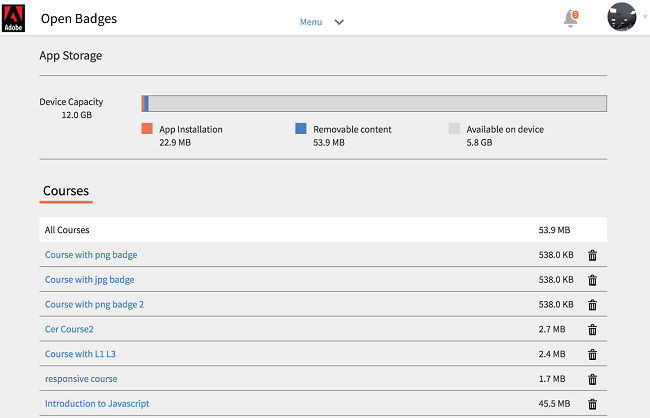

# iPad 與 Android 平板用戶

在 iPad 或 Android 平板的 Learning Manager 應用程式中，當你以學習者身份登入後，可以看到以下的主畫面：

要進入學習與目錄功能，請點選 **單** 下拉選單並選擇相應選項。

你可以在 iPad 和 Android 平板上離線使用 Learning Manager 應用程式。 下載並以離線模式修課，連接網路時將內容與線上應用程式同步。

1. 點選最上方的選單下拉選單，然後點選學習選項。 所有可用球場的清單以圖塊形式顯示。
1. 點擊每個學習物件圖塊底部的下載圖示，即可下載學習內容。

1. 當你在線上時，應用程式頂端的欄會跳出一個提示，讓你檢查是否要同步你的內容。 如果你的答案是肯定，請點擊紅色條。 綠色條表示你的內容與線上應用程式同步。

## 軌道裝置儲存 {#trackdevicestorage}

你可以定期監控裝置儲存空間。

點擊應用程式右上角的個人檔案圖示，然後點選 **裝置儲存** 選單選項。

應用程式儲存資訊對話框如下所示。

利用應用程式儲存資訊，您可以查看裝置、應用程式及已下載課程的總容量。 這些資訊讓你能依照需求下載課程。 要刪除裝置中已下載的課程，請點擊每門課程名稱旁的 X 圖示。
