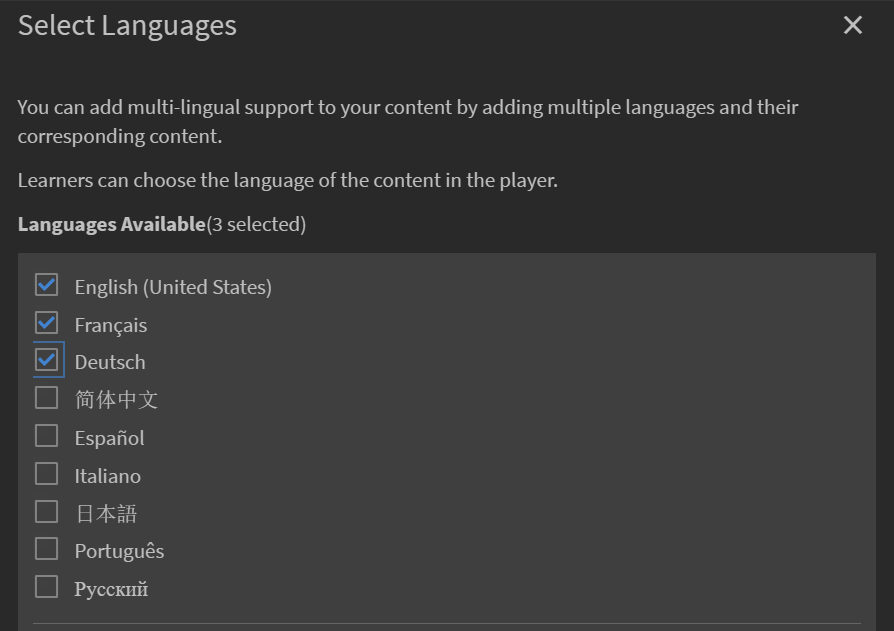
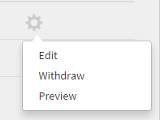
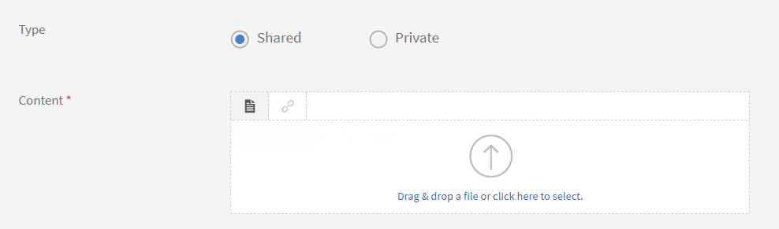

# 工作輔助

**工作輔助** 是訓練內容的存放庫，可供沒有任何註冊或完成條件的學習者存取。 學習者可以參考這些工作輔助，以獲得在組織中執行任何活動或任務的協助。

工作輔助可以單獨使用，或與Learning Manager中的課程使用一起使用。

作者可為學習者建立工作輔助。 使用工作輔助為學習者提供參考資料，例如提示、檢查清單、指南，以供他們持續使用以完成其任務。

## 建立工作輔助 {#createjobaid}

1. 在作者登入中，選取 **[!UICONTROL Job Aids]** 在左窗格。
1. 選取 **[!UICONTROL Create]** ，位於出現的頁面的右上角。
1. 輸入名稱、說明和標籤。 選擇技能和相關層次。 如果您不希望其他作者存取工作輔助，以指派至其各自的課程，請選取內容作為私人內容。

   工作輔助只能使用現有技能。 技能非必填。

1. 在內容區段上傳工作輔助內容。

   視訊、pdf、pptx和docx是支援的上傳檔案格式。 不支援上傳專案zip檔案或任何互動式內容。

1. 輸入工作輔助的持續時間（分鐘）。
1. 按一下 **[!UICONTROL Save]**.

   工作輔助已發佈。

## 新增不同語言的工作輔助 {#addcontentfordifferentlanguages}

1. 若要新增不同語言的工作輔助，請選取 **新增語言** 標籤，然後選擇所需的語言。 使用此方法，您可以為內容新增多語言支援。

   

   *為內容新增語言*

1. 針對新語言重複工作輔助上傳程式。
1. 如果要移除語言，請選取 **[!UICONTROL Add New Language]** 標籤，並清除您的選取專案。

   完成變更後，選取「儲存」。

## 支援的工作輔助型別 {#typesofsupportedjobaids}

以下是工作輔助支援的檔案格式。

* PDF
* PPT
* PPTX
* XLS
* XLSX
* DOC
* DOCX
* 所有視訊檔案格式

>[!NOTE]
>
>不支援Zip檔案和影像檔案。

## 撤銷/重新發佈工作輔助 {#withdrawrepublishjobaids}

您可以按一下工作輔助旁邊的設定圖示並選擇撤銷，以撤銷已發佈的工作輔助。

*編輯、撤銷或預覽已發佈的工作輔助*

按一下撤銷索引標籤，檢視撤銷的工作輔助。 您可以按一下設定圖示並選擇「發佈」來重新發佈撤銷的工作。

## 對工作輔助中HTML套件的支援

工作輔助現在以新型別的內容支援標準HTML套件。 透過此增強功能，學習者可以從工作輔助播放器開啟檢視並下載HTML套件。

建立工作輔助時，作者可以上傳標準HTML套件以及其他支援的檔案格式。

*支援HTML套件*

HTML封裝必須具備下列專案：

* Index.html檔案。
* Index.html檔案必須位於zip檔案的根資料夾中。

指定要以zip檔案上傳的內容，其中Index.html檔案位於該檔案中。

所有內容、資源和資產都必須在HTML套件中參考，並可透過Index.html存取。

## 常見問題 {#frequentlyaskedquestions}

+++如何建立工作輔助？

身為作者，在「工作輔助」頁面上按一下 **[!UICONTROL Create]**. 新增必要的詳細資料並儲存工作輔助。

建立「工作輔助」後，您可以在建立課程時將「工作輔助」新增到課程中。

+++

### 更多相關資訊

* [管理員的工作輔助](../../administrators/feature-summary/job-aids.md)
* [學習者的工作輔助](../../learners/feature-summary/job-aids.md)
