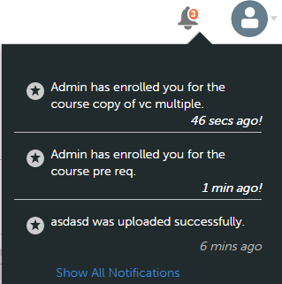
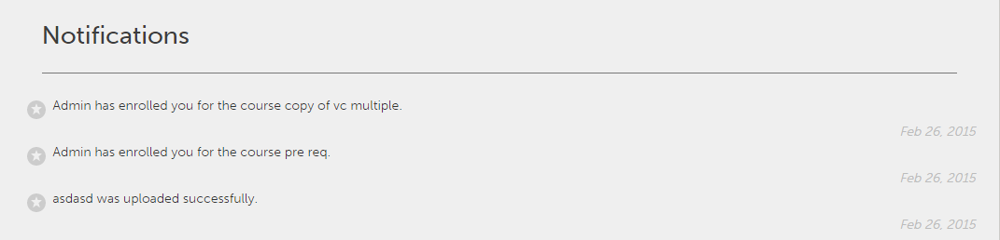

# 使用者通知

通知功能適用於Adobe Learning Manager的所有使用者。 但是，每個使用者根據其角色在不同情況下會獲得不同種類的通知。 所有給使用者的警報和通知都會透過通知快顯對話方塊顯示。

## 存取通知 {#accessnotifications}

使用者按一下視窗右上角的通知圖示即可檢視通知。

製作角色的通知視窗範例顯示在下列熒幕擷圖中：

此快顯視窗會顯示所有通知的醒目提示，以及發生時間和卷軸。

您可以透過通知圖示上方醒目提示的數字來瞭解最新通知的數量。 例如，如果在您上次登入後有五個最新的通知，您會看到通知圖示上方顯示五個最新通知。 讀取所有最新通知後，這些數字就會消失。

按一下通知快顯視窗底部的&#x200B;**[!UICONTROL Show all notifications]**&#x200B;連結，在個別頁面中檢視所有通知。

## 給作者的通知型別 {#typesofnotificationsforauthors}

當下列事件觸發時，作者會收到通知：

* 模組上傳成功時
* 模組版本變更時
