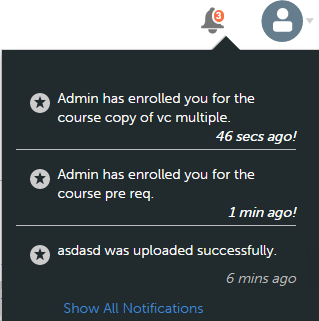

# 使用者通知

通知功能適用於所有 Adobe Learning Manager 使用者。 但每個使用者根據其角色在不同情境下會收到不同類型的通知。 所有通知與通知都會透過通知彈出視窗顯示。

## 存取通知 {#accessnotifications}

使用者可點擊視窗右上角的通知圖示查看通知。

以下截圖顯示作者角色的範例通知視窗：

這個彈出視窗會顯示所有通知的重點、發生時間和滾動列。

你可以透過通知圖示上方標示的數字來知道最新通知的數量。 例如，如果你上次登入後有五個最新通知，你可以看到通知圖示上方顯示的數字是五。 這些數字在你看完所有最新通知後就會消失。

點擊 **[!UICONTROL Show all notifications]** 通知彈出視窗底部的連結，可在獨立頁面查看所有通知。

## 作者通知的類型 {#typesofnotificationsforauthors}

當以下事件觸發時，作者會收到通知：

* 當模組上傳成功時
* 當模組版本變更時
