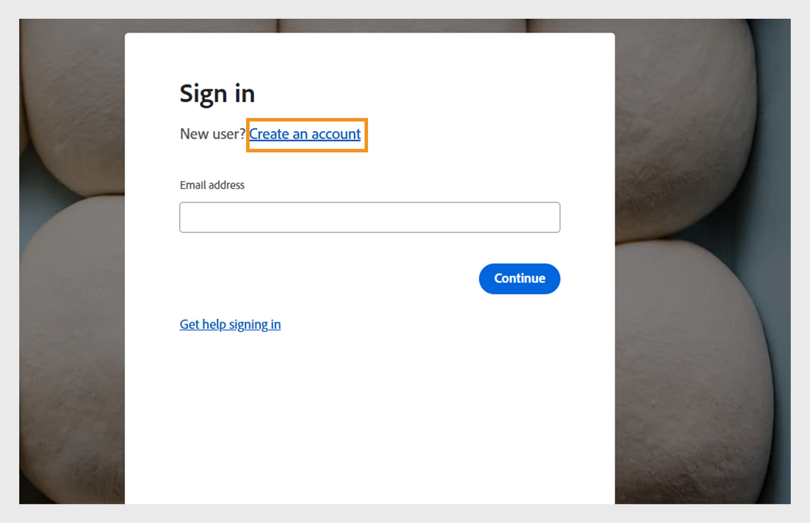
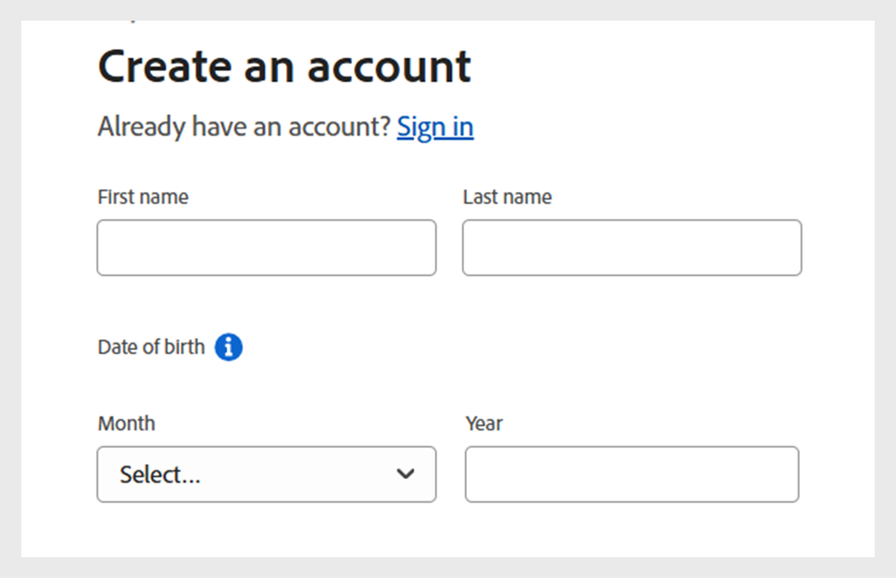
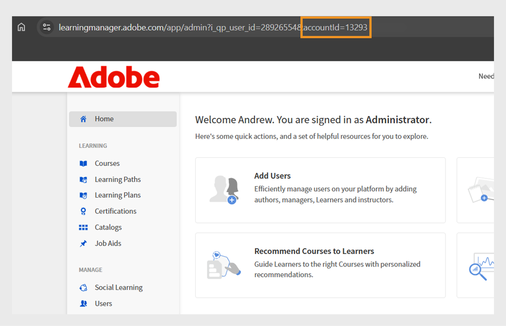

# 在Adobe Learning Manager中建立試用帳戶

您可以在Adobe Learning Manager中輕鬆設定免費的30天試用帳戶，以探索功能並測試學習工作流程。 本指南說明從何處開始、如何註冊，以及如何在設定後尋找您的帳戶詳細資料。

若要建立試用帳戶：

1. 移至[Adobe Learning Manager](https://business.adobe.com/products/learning-manager/adobe-learning-manager.html)。
2. 選取&#x200B;**[!UICONTROL Free 30-day trial]**。

   

3. 在登入頁面上選取&#x200B;**[!UICONTROL Create an account]**。

   

4. 輸入您的&#x200B;**[!UICONTROL Email address]**&#x200B;和&#x200B;**[!UICONTROL Password]**。

   

5. 輸入下列詳細資料，並選取&#x200B;**[!UICONTROL Create account]**：
   * 名字
   * 姓氏
   * 出生日期

   

6. 輸入並完成表單，其中包含設定試用帳戶所需的詳細資料。
7. 設定完成後，請在Adobe Learning Manager URL的URL中找到您的帳戶ID。

   
