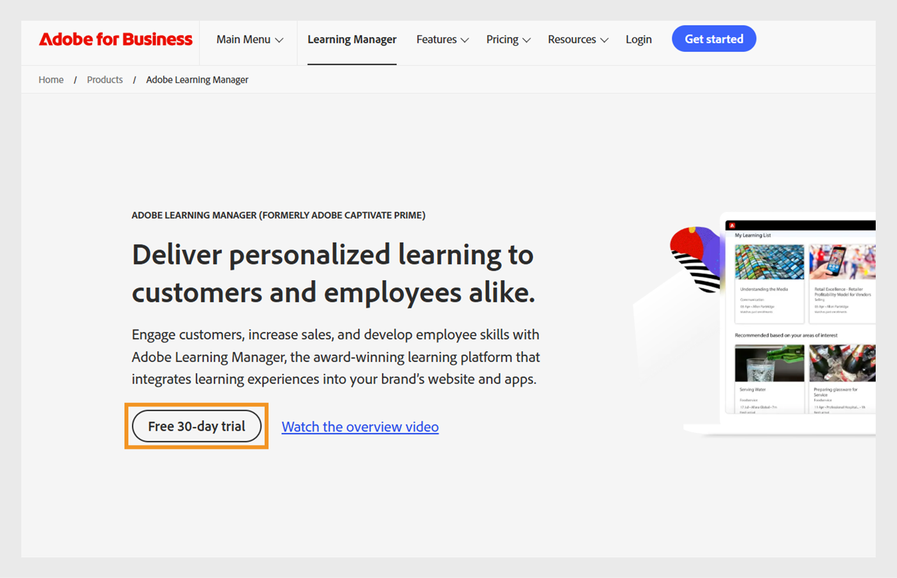
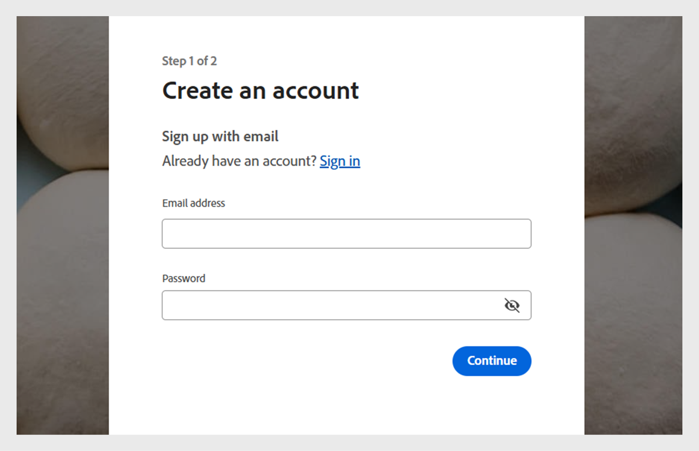
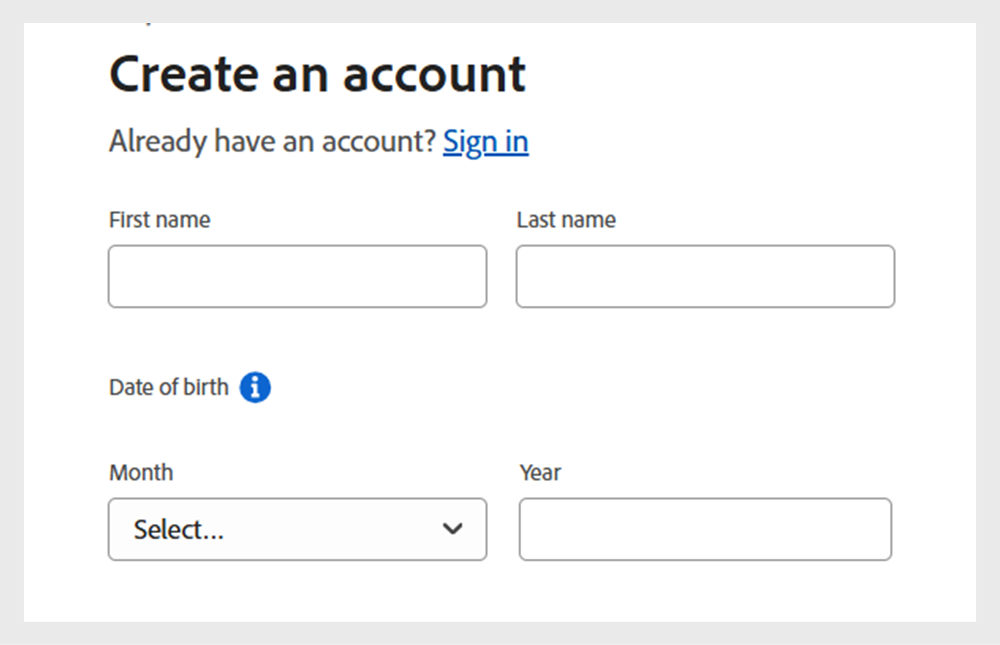

# 在 Adobe Learning Manager 建立試用帳號

你可以輕鬆地在 Adobe Learning Manager 中設定免費 30 天試用帳號，探索功能並測試學習流程。 本指南說明從哪裡開始、如何註冊，以及設定好後如何找到你的帳號資料。

要建立試用帳號：

1. 去 [Adobe Learning Manager](https://business.adobe.com/products/learning-manager/adobe-learning-manager.html) 看看。
2. 選擇 **[!UICONTROL Free 30-day trial]**。

   

3. 在登入頁面選擇 **[!UICONTROL Create an account]** 。

   

4. 輸入你的 **[!UICONTROL Email address]** 和 **[!UICONTROL Password]**。

   

5. 輸入以下資訊並選擇 **[!UICONTROL Create account]**：
   * 名字
   * 姓氏
   * 出生日期

   

6. 請輸入並填寫所需資料以建立試用帳號。
7. 設定完成後，在你的 Adobe Learning Manager URL 中找到你的帳號 ID。

   

