# Learning Manager部署指南

## 簡介 {#introduction}

Learning Manager是學習管理系統(LMS)，可讓訓練專業人員提供吸引人且可追蹤的學習資料，有助於滿足組織的需求或達成目標。 Learning Manager主要可讓訓練人員或經理以特定順序，為學習者指派課程和其他學習物件。 此工具也提供數種強大的功能，包括多格式流體播放器、遊戲化、徽章、易用的學習者儀表板。 不過，若要運用這些功能，必須先設定和設定Learning Manager。

本指南提供逐步指示，說明如何啟動和執行Learning Manager。 本檔案也提供配置和設定的詳細資訊。 請閱讀下文，瞭解如何開始使用Learning Manager。

## 本指南適用對象？ {#whoisthisguideintendedfor}

身為Learning Manager使用者，您可以戴著管理員、作者、講師、經理或學習者的帽子。 本指南適用於可能會參與為組織或使用者端設定LMS的使用者：

* **IT管理員**  — 身為IT管理員，您可以啟動或整合Learning Manager至您的組織。 IT管理員也可以新增單一或多個使用者，並可執行整合管理員或將Learning Manager與協力廠商應用程式整合的管理員的角色。
* **作者**  — 身為Learning Manager作者，您可以根據組織的學習需求建立學習內容。 作者參與建立在Learning Manager中上傳的基本內容。

* **Learning Manager管理員** - Learning Manager管理員會執行與應用程式相關的設定和活動。 在某些公司中，IT管理員可能也會擔任Learning Manager管理員的角色。

## 開始使用Learning Manager部署 {#getstartedwithcaptivateprimedeployment}

購買Learning Manager後，使用您收到的授權金鑰啟用Learning Manager帳戶。 繼續下列設定，如下列視覺效果所示：

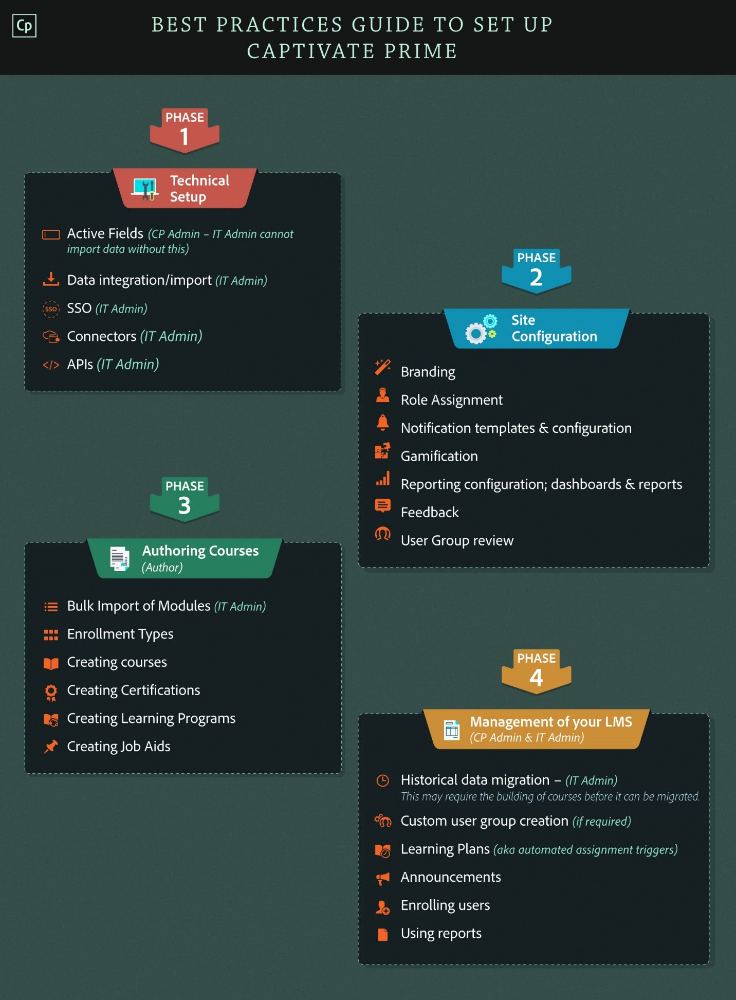

## 在Learning Manager中設定網站 {#configureyoursiteincaptivateprime}

在Learning Manager中新增及實作學習物件前，您需要完成幾項主要設定。 首先，請設定您的網站以符合您的組織。 網站設定包含下列步驟：

* 為您的組織設定品牌和標誌
* 設定電子郵件範本
* 設定基本帳戶設定
* 設定意見反應設定
* 設定學習者儀表板設定

### 設定品牌與標誌 {#setupbrandingandlogo}

作為管理員，您可以設定品牌和主題以符合組織的品牌需求。 若要設定網站的品牌和主題，請執行下列動作：

### 設定標誌與橫幅： {#settingthelogoandbanner}

使用標誌和橫幅設定在Learning Manager中顯示您公司的標誌。 設定品牌選項以在URL中設定公司的網域、顯示組織名稱，以及顯示符合組織品牌的色彩配置。 若要設定品牌設定：

* 以管理員身分登入您的Learning Manager帳戶。
* 從左窗格，按一下 **品牌化**.
* 在「品牌」頁面上，您可以按一下 **編輯** 針對您要修改的選項：

   * **組織名稱** ：您在此處指定的值將決定顯示在網站每個頁面橫幅上的名稱。
   * **子網域**：此值會決定您網站的URL。
   * **標誌樣式**：此欄位中的影像會在每個頁面的右上角顯示為標誌。 在這裡，您可以選擇只顯示標誌、貴組織的名稱，或標誌與組織名稱。

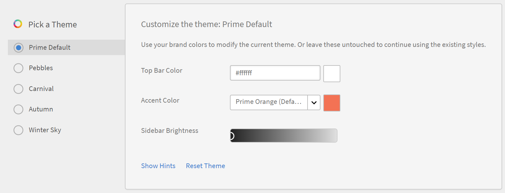

>[!NOTE]
>
>您只能使用「品牌」來設定名稱和標誌。 您無法變更標誌或影像的位置。

***Learning Manager支援下列標誌影像的檔案格式： .png、.jpeg、.jpg、.gif、.bmp***

### 設定您網站的主題 {#settingthethemesforyoursite}

Learning Manager可讓您使用主題變更網站的外觀和風格。 應用程式提供下列顏色主題供您選擇：

* Prime預設
* 鵝卵石
* 嘉年華
* 秋季
* 冬天

您可以選擇其中一個色彩配置，以符合您的企業品牌。

1. 在Learning Manager左側導覽窗格中，按一下 **[!UICONTROL Branding]**.
1. 在 **主題** 區段，按一下 **[!UICONTROL Edit]**. 應用程式可讓您挑選新主題。 選取主題時，您可以立即看到用於關鍵介面元素的色彩配置。

   

1. 此外，您也可以編輯 **頂端列色彩**， **輔色**，以及 **側欄亮度**.  您可以對這些關鍵介面元素使用您自己的品牌顏色。
1. 若要將您的佈景主題值重設為預設色彩配置，請按一下 **[!UICONTROL Reset Theme]**. 關鍵UI元素的顏色會設定為所選主題的預設選項。
1. 選擇主題後，按一下 **[!UICONTROL Show Hints]** 在預覽中檢視標籤或提示。

   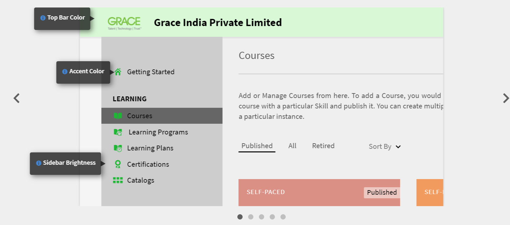

   請注意，此幻燈片中有數個影像， **主題** 區段。 此投影片可讓您立即預覽主題或色彩配置。 您可以立即預覽所選頁面，例如首頁、學習者儀表板等。

1. 如果您想在瀏覽器中預覽變更，請按一下 **[!UICONTROL Live Preview]**. 「即時佈景主題預覽」快顯視窗隨即出現，您可以在其中修改色彩配置，或使用預設選項繼續操作。 若要在瀏覽器中預覽選項，請按一下 **[!UICONTROL Preview]** 在此快顯視窗中。

   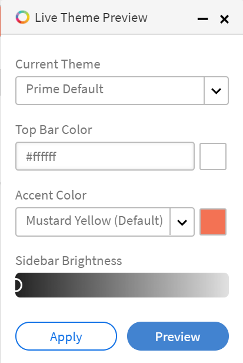

1. 所選的選項會暫時套用至您的網站。 如果要儲存選取的主題和色彩設定，請按一下 **[!UICONTROL Apply]**.
1. 選取並套用主題後，按一下 ****[!UICONTROL Save]**** 以儲存您的選擇。

## 設定電子郵件範本 {#configureemailtemplates}

作為管理員，您的下一步將是設定各種事件的電子郵件範本。 您可以啟用、停用及修改要傳送給使用者的電子郵件範本。 電子郵件範本主要分為三類：

* 一般電子郵件範本：這些電子郵件是為一般事件觸發的。 例如，使用者首次登入時的歡迎通知。
* 與學習物件或活動相關聯的電子郵件範本：每當有學習活動時，系統都會將這些電子郵件傳送給學習者、作者或經理。 例如，在課程註冊、教室參與率、課程完成等之後觸發的電子郵件。
* 提醒與更新：當使用者需要任何事件的更新或提醒時，就會觸發這些電子郵件。 例如，收到近期課程提醒的學習者，或收到共用報告電子郵件通知的管理員。

您可以從管理員控制面板啟用及設定任何這些電子郵件通知。 若要瞭解如何設定電子郵件範本，請執行以下步驟：

1. 在左側導覽窗格中，按一下 **[!UICONTROL **&#x200B;電子郵件範本&#x200B;**.]**
1. 按一下下列其中一個標籤：**[!UICONTROL **&#x200B;一般&#x200B;**/**&#x200B;學習活動&#x200B;**/**&#x200B;提醒與更新&#x200B;**.]** 例如，假設您按一下 **[!UICONTROL **&#x200B;學習活動&#x200B;**.]**
1. 針對您要觸發電子郵件的任何活動，按一下切換按鈕。 在此範例中，假設您按一下 **[!UICONTROL **&#x200B;學習計畫 — 由管理員註冊/經理&#x200B;**.]**

   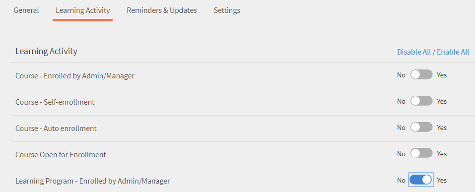

   系統會顯示「Enabled Successfully」快顯訊息。 現在，每當管理員或管理員註冊課程學習者時，學習者都會收到來自該Learning Manager帳戶的電子郵件。

1. 您可以修改預設的電子郵件範本。 若要這麼做，請按一下事件。 在此範例中，按一下 **[!UICONTROL  Learning Program - Enrolled by Admin/Manager.]**
1. 在 **[!UICONTROL Template Preview]** 快顯對話方塊中，請注意有兩個索引標籤： [!UICONTROL Learner] 和 [!UICONTROL Manager].

   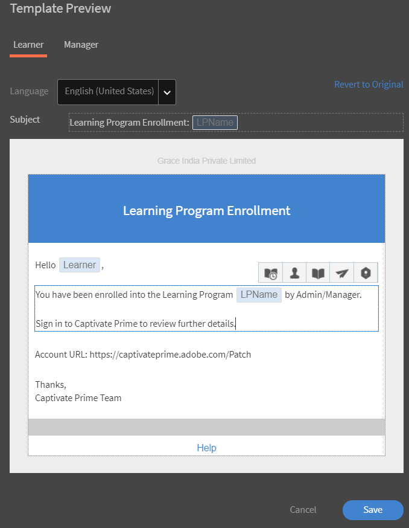

   對於每個標籤，按一下電子郵件內文以修改內容。 若要儲存對電子郵件範本所做的變更，請按一下 **[!UICONTROL Save]**.

   現在，每當學習者被經理或管理員註冊課程時，學習者及其經理都會收到電子郵件通知。

   ***附註：修改僅適用於與所選事件相關聯的電子郵件範本。***

1. 請注意，您無法修改電子郵件範本中的帳戶URL或簽章。 若要修改 **[!UICONTROL Account URL]** 或 **[!UICONTROL Signature]**，按一下 **[!UICONTROL Settings]** 標籤。 在此索引標籤中，您可以修改電子郵件橫幅、電子郵件簽名、帳戶URL。

   帳戶URL連結會顯示在所有電子郵件中，在簽名之前。 輸入您偏好的URL並按一下 **[!UICONTROL Save]**. 只有內部使用者可看見此URL。

   針對電子郵件橫幅，您可以選取以變更橫幅的顏色  **[!UICONTROL **&#x200B;橫幅背景&#x200B;**.]** 您也可以選取「 」，使用自訂影像作為橫幅 **[!UICONTROL Custom Image]** 選項。 按一下  **[!UICONTROL Save]** 進行變更之後。

   ***注意：電子郵件橫幅的自訂影像大小必須是1240x200px。 系統會裁切大於建議大小的影像。***

   ***Learning Manager僅支援電子郵件橫幅的.jpg、.jpeg和.png檔案型別。***

   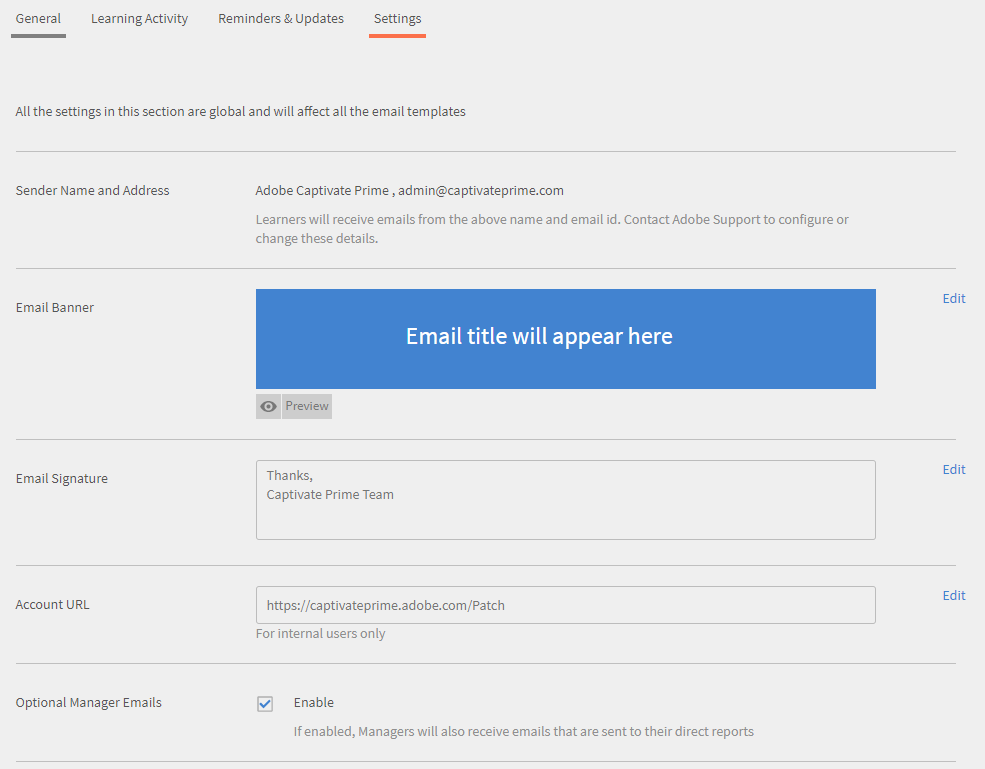

1. 您也可以選擇啟用「可選經理電子郵件」。 如果您選取 **[!UICONTROL Enable]** 核取方塊，每當直接下屬收到來自此Prime帳戶的電子郵件時，經理也會包含在郵寄清單中。

   ***注意：此標籤中的設定適用於全域所有範本。***

### 設定學習物件的電子郵件範本 {#configureemailtemplatesforalearningobject}

除了在全域層級設定電子郵件範本外，身為管理員，您也可以為特定學習物件設定電子郵件範本。 在這種情況下，您對電子郵件範本所做的任何變更都僅適用於該學習物件。

作者設定學習物件時，也可使用此選項。

若要設定學習物件的電子郵件範本：

1. 按一下您要設定電子郵件範本的課程、學習計畫或認證。
1. 從左窗格，按一下 **[!UICONTROL **&#x200B;電子郵件範本&#x200B;**.]** 系統顯示 ****[!UICONTROL Template Preview]**** 快顯對話方塊。
1. 修改電子郵件範本的主旨或內文，然後按一下**[!UICONTROL **儲存**]**以套用變更。
1. 若要取消變更，請按一下 **[!UICONTROL **&#x200B;還原為原始&#x200B;**.]**

### 限制使用者接收電子郵件 {#restrictusersfromreceivingemails}

作為管理員，您可以選取哪些人將會收到來自Learning Manager的電子郵件，哪些人不會收到。 您可以透過以下方式達成此目標： ****[!UICONTROL Restricted User]**** 選項下****[!UICONTROL Settings]** **tab. 使用者可透過其名稱、電子郵件ID或唯一使用者ID新增至此清單。 此選項下列出的使用者將無法接收來自Learning Manager的任何電子郵件通訊，

## 設定您的帳戶設定 {#configureyouraccountsettings}

Learning Manager可讓您進行一些帳戶設定，例如基本設定、意見回饋設定、一般設定，以及學習者控制面板的設定。 下列程式會告訴您如何設定這些設定：

### 設定基本設定 {#configurebasicsettings}

1. 在Learning Manager首頁中，按一下 ****[!UICONTROL Settings]****. 依預設，系統會顯示「基本資訊」頁面，其中包含預設的語言和位置欄位。
1. 按一下 ****[!UICONTROL Change]**** 編輯基本資訊的頁面。
1. 設定下列選項：

   * **國家**：從此下拉式欄位中選取國家/地區。
   * **時區**：設定您所在位置的適當時區。
   * **地區設定**：選取您選擇的語言。 如果您變更此欄位中的語言，變更將套用至使用此應用程式的所有使用者。 但是，每個使用者都可以單獨修改喜好的語言。
   * **財政年度開始於**：選取貴組織財政年度開始的月份。

   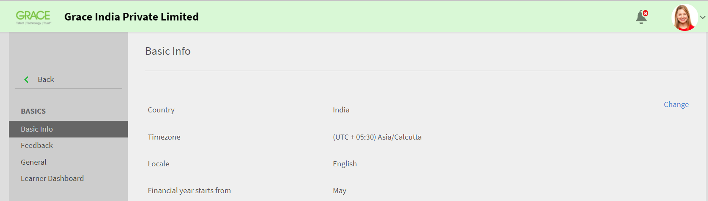

## 設定意見反應設定 {#configurefeedbacksettings}

Learning Manager可讓您收集學習者的課程意見回饋。 您也可以使用Learning Manager來收集學習者的意見回饋。 若要徵求意見反應，您必須先設定L1和L3型別的意見反應。

L3意見是經理提供的關於學習者的意見回饋。 您可以使用此回饋意見來追蹤學習者一段時間以來的成效。 L1意見是學習者提供的課程相關意見。 這類意見反應可協助管理員收集有關課程的直接意見反應。

身為管理員，您可以全域設定意見反應設定。 若要這麼做，請遵循下列程式：

1. 在Learning Manager首頁中，按一下 **[!UICONTROL Settings]**.
1. 在左窗格中，按一下 **[!UICONTROL General]**.
1. 若要設定L1意見反應，請按一下 **[!UICONTROL L1 Feedback]** 標籤。 您可以看到設定一個必要問題和數個選用問題的選項。 這些是學習者完成課程後提供意見回饋時檢視的問題。 問題會以陳述形式出現，因此學習者可以按1到5的級數選擇回應。

   L1回饋意見的第一個部分是學習者如何向朋友或同事推薦此課程的強制問題。

   ***備註：您無法編輯或修改必要的問題。***

   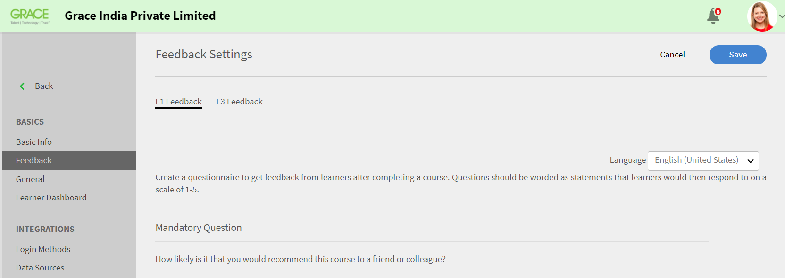

1. 若要設定意見調查問卷的其他問題，請按一下 ****[!UICONTROL Self-Paced Courses]****，或 ****[!UICONTROL Classroom Courses]****. 當您按一下問題時，系統可讓您編輯預設的問題。

   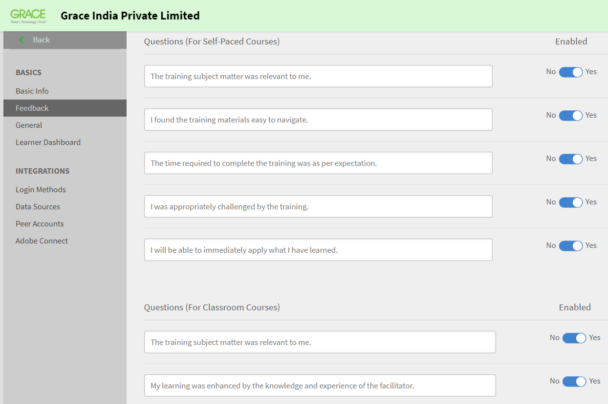

1. 您可以啟用或停用預設問題，或完全修改預設問題以符合您的需求。 例如，您可以移除預設問題「培訓事宜與我相關」，然後新增問題，以「我發現培訓有用且相關」來取代問題。
1. 完成學習者的問題後，即可進行提醒設定。 預設情況下會有現有的提醒，應用程式會在學習者成功完成課程時傳送自動提醒。 此提醒也設定為每兩週重複一次，直到學習者回應為止。 您可以按一下提醒來修改現有提醒，或新增提醒。

   

1. 完成下列選項以設定提醒設定：

   * **傳送時間**：指定您要在課程完成時或課程完成後傳送意見回饋要求。
   * **完成後的天數**：指定您想要傳送意見反應要求的間隔天數。 此欄位只有在選取時才會顯示 ****[!UICONTROL After course completion]****.

   * **週期**：指定您要每天、每週或每月傳送意見回饋提醒。 您也可以指定要傳送提醒的周數。

1. 按一下勾號以儲存您的提醒設定。
1. 完成所有意見設定後，請按一下「**立」[!UICONTROL **儲存**]**在頁面的右上角。

## 設定L3意見回饋： {#configurel3feedback}

L3意見反應包含在學習者完成課程後傳送給學習者經理的問題。 L3意見回饋可讓管理員追蹤學習者在一段時間內的行為或技能變化。 若要設定此意見回饋，請在「意見回饋」頁面上按一下 ****[!UICONTROL L3 Feedback]**** 標籤。 您會看到一個預設問題。 經理必須使用五點評等表回答這個問題。

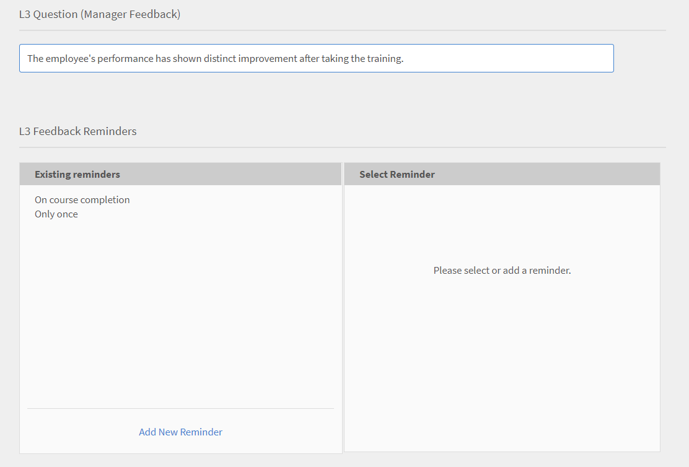

與L1意見反應類似，您可以為L3意見反應設定提醒。 您可以修改現有提醒，或新增意見反應提醒。

在您完成意見問題和提醒設定後，請按一下 ****[!UICONTROL Save]**** 以套用您的設定。

## 在執行個體層級設定意見回饋 {#configurefeedbackataninstancelevel}

前一個程式概述了在全域層級配置意見設定值的步驟。 也就是說，設定會套用至所有課程。 除了這些全域問題之外，作為管理員或作者，您可以在執行個體層級設定其他L1和L3意見問題。

若要在執行個體層級設定意見反應設定：

1. 在學習管理員首頁上，按一下 **[!UICONTROL Courses]**.
1. 暫留在您要設定意見設定的課程上。 按一下 [!UICONTROL **檢視課程**.]

   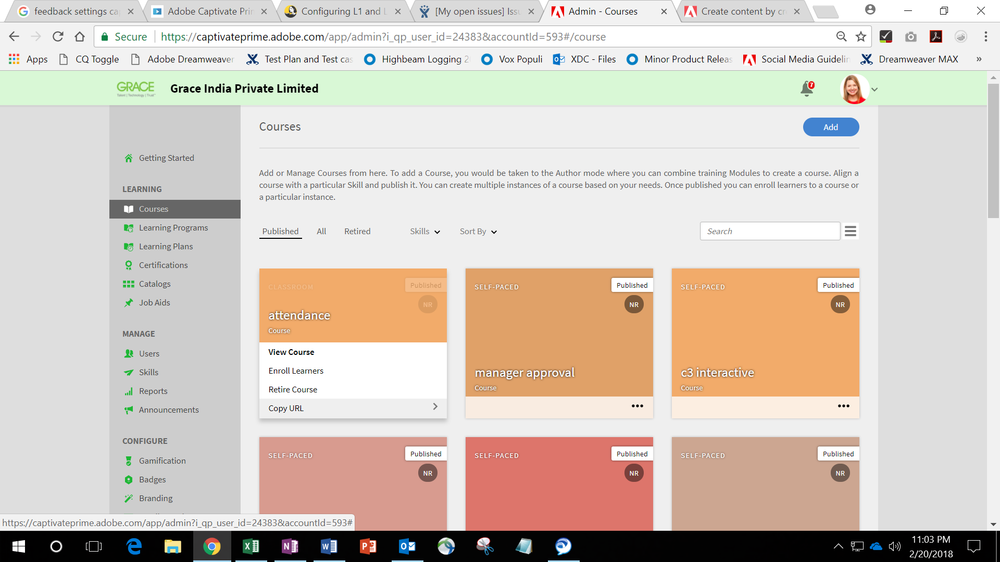

1. 在課程詳細資訊頁面中，按一下 **[!UICONTROL Instance Defaults]** 在設定區段中。
1. 在 [!UICONTROL **語言**] 下拉式清單，選取您要顯示意見調查表的語言。
1. 如果您想要徵求學習者的意見回饋，請啟用L1反應意見回饋。 您最多可以在此章節中新增兩個問題。 學習者可提供這些問題的描述性答案。
1. 選取 **[!UICONTROL Make Mandatory]** 核取方塊。
1. 選取 **[!UICONTROL Show questionnaire immediately after course completion]** 如果您希望學習者完成課程後能立即檢視意見回饋問卷。

   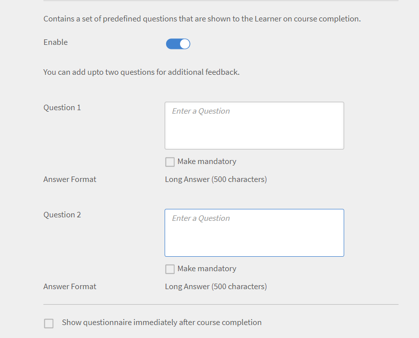

1. 若要在執行個體層級設定L3行為變更回饋， ****[!UICONTROL Enable]**** L3意見反應。 應用程式會顯示預先定義的必要問題和空白問題，您可在此輸入您選擇的問題。
1. 針對學習者參加課程後提升的預定義問題，答案為李克特量表格式。 也就是說，管理者必須選擇「強烈同意強烈不同意」等級的選項。
1. 指定管理員的第二個問題。 經理可提供此問題的描述性答案。
1. 選取 ****[!UICONTROL Make Mandatory]**** 核取方塊。

   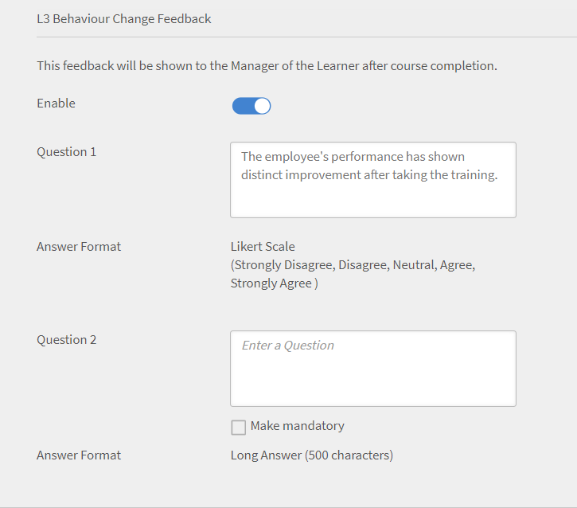

1. 您可以選擇在執行個體層級設定提醒設定。 如果您未在此處設定提醒設定，則會自動指派全域提醒設定。
1. 在您完成意見問題和提醒設定後，請按一下**[!UICONTROL **儲存**]**以套用您的設定。

   ***注意：意見設定不適用於認證。***

## 設定一般設定 {#configuregeneralsettings}

Learning Manager的一般設定可讓管理員設定影響應用程式中其他功能的一般設定。 例如，您可以使用一般設定來指定是否讓學習者看到課程成效。 若要設定一般設定：

1. 在Learning Manager首頁中，按一下 ****[!UICONTROL Settings]****.
1. 在左窗格中，按一下 ****[!UICONTROL General]****.
1. 您可以在「一般設定」頁面中設定下列選項：

   對於所有這些選項，每個選項所影響的特徵都是可變的。 如有必要，我們可為每個詳細功能提供交叉連結。

   * **顯示課程效果**：如果您希望學習者看到課程對課程標題的有效性，請啟用此選項。
   * **模組重設選項**：如果您想要讓學習者能夠重設模組，請啟用此選項。 如果學習者失敗，或已經部分完成模組並想要重新開始，則可重設模組。
   * **課程稽核**：如果您希望管理員在學習者看到課程變更前核准課程變更，請啟用此選項。
   * **討論區**：如果您希望學習者檢視並參與課程的討論區，請啟用此選項。 如果您啟用 **討論區** 核取方塊，學習者和講師可張貼課程註解。 不過，如果課程等級設定指出未選取此功能，則課程等級設定會優先於管理員設定。

   * **探索技能選項**：如果您希望學習者探索同儕和領導技能，請啟用此選項。
   * **學習物件不重複ID**：如果您想要讓作者新增唯一ID至學習物件，請啟用此選項。
   * **顯示目錄清單**：如果您希望學習者檢視所有可用的目錄，請啟用此選項。 此選項可協助學習者調整其學習物件清單。

   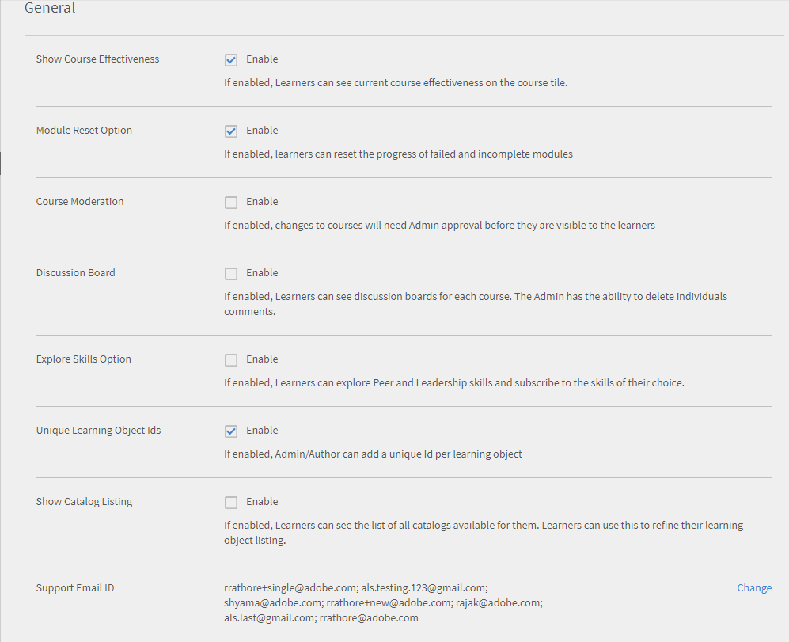

## 設定學習者控制面板設定 {#configurelearnerdashboardsettings}

Learning Manager中的學習者控制面板可讓學習者檢視其成就、技能和公告之外的必修課程和建議課程。 管理員可藉由設定學習者控制面板設定，決定此學習者控制面板的顯示方式。 這些設定決定可讓管理員在學習者頁面上設定Widget。 這些設定也會指定小工具在學習者控制面板上的放置方式與位置。 身為管理員，您可以在套用設定之前預覽學習者控制面板的版面。

1. 在Learning Manager首頁中，按一下 **[!UICONTROL Settings]**.
1. 在左側導覽窗格中，按一下 **[!UICONTROL **&#x200B;學習者控制面板&#x200B;**.]**
1. 選取您要啟用的Widget。 如果您取消選取Widget，該Widget會立即從預覽中移除。 學習者無法在他們的儀表板中看到此Widget。
1. 按一下 ****[!UICONTROL Save]**** 以套用設定。

   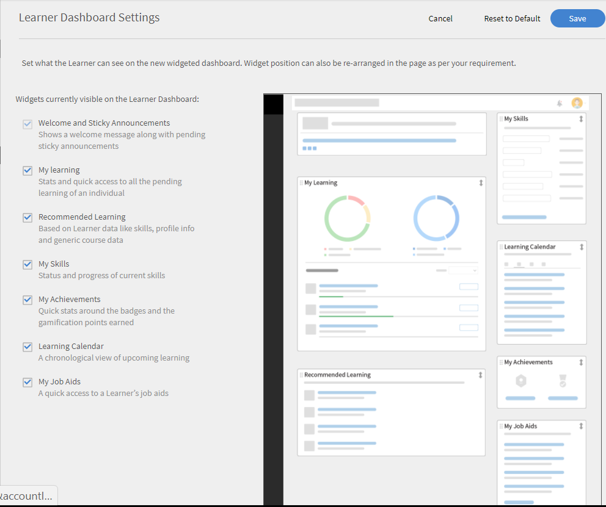

1. 若要套用預設設定，請按一下 **[!UICONTROL Restore to Default.]** 在此案例中，所有Widget除了 **[!UICONTROL Welcome and Sticky Announcements]** 是可見的。

   ***即使您啟用了學習者控制面板設定，學習者仍可修改並在其個別控制面板中移動Widget。***

