# 學習經理部署指南

## 簡介 {#introduction}

學習管理系統（Learning Manager）是一種學習管理系統（LMS），讓培訓專業人員能夠提供引人入勝且可追蹤的學習教材，以促進組織的需求或目標。 學習管理器主要允許培訓師或管理者依特定順序指派課程及其他學習物件給學習者。 此工具還提供多項強大功能，包括多格式流體播放器、遊戲化、徽章、易用學習者儀表板。 然而，要善用這些功能，首先必須設定並設定學習管理員。

本指南提供逐步操作學習管理器的指引。 本文件同時詳細提供設定與設定資訊。 繼續閱讀，了解如何開始使用 Learning Manager。

## 這本指南是針對誰？ {#whoisthisguideintendedfor}

作為學習管理員的使用者，你可以擔任管理員、作者、講師、經理或學習者的身份。 本指南是針對可能參與為組織或客戶建立 LMS 的使用者所設計：

* **IT 管理員** - 作為 IT 管理員，您可以在您的組織中啟用或整合學習管理員。 IT 管理員也可以新增單一或多位使用者，並可擔任整合管理員或將 Learning Manager 與第三方應用程式整合的管理員角色。
* **作者** - 作為學習經理作者，你可以創作符合組織學習需求的學習內容。 作者負責創建上傳至學習管理員的基本內容。

* **學習經理管理員** - 學習管理員負責與應用程式相關的設定與設定活動。 在某些公司，資訊科技管理員也可能同時擔任學習經理管理員的角色。

## 開始使用 Learning Manager 部署 {#getstartedwithcaptivateprimedeployment}

購買 Learning Manager 後，請使用你收到的授權金鑰啟用你的 Learning Manager 帳號。 請繼續前往以下圖示所示的配置：

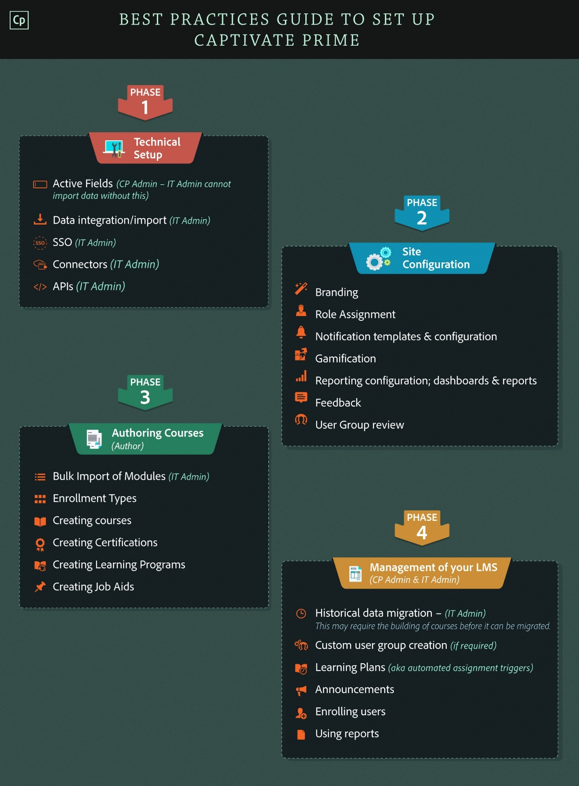

## 在 Learning Manager 中設定您的網站 {#configureyoursiteincaptivateprime}

在你開始在 Learning Manager 中加入和實作學習物件之前，有幾個關鍵的設定是必須的。 首先，將你的網站配置成適合你組織的方案。 場地配置包含以下步驟：

* 為您的組織建立品牌與標誌
* 設定電子郵件範本
* 設定基本帳號設定
* 設定回饋設定
* 設定學習器儀表板設定

### 建立品牌與標誌 {#setupbrandingandlogo}

作為管理員，你可以設定品牌與主題，以符合組織的品牌需求。 要設定網站的品牌與主題，請做以下步驟：

### 設定標誌與橫幅： {#settingthelogoandbanner}

使用標誌和橫幅設定，在學習管理員中顯示你公司的標誌。 設定品牌選項，在網址中設定公司網域、顯示組織名稱，並顯示與組織品牌相符的配色方案。 要設定品牌設定：

* 以管理員身份登入你的學習管理員帳號。
* 從左側窗格點選 **「品牌」**。
* 在品牌頁面，您可以點擊&#x200B;****&#x200B;想要修改的選項編輯，來設定以下選項：

   * **組織名稱** ：您在此指定的數值將決定您網站每頁橫幅上的名稱。
   * **子網域**：此值決定您網站的網址。
   * **標誌樣式**：此欄位中的圖片會以標誌形式出現在每頁右上角。 在這裡，你可以選擇只顯示標誌，或是你組織名稱，或是標誌加組織名稱。

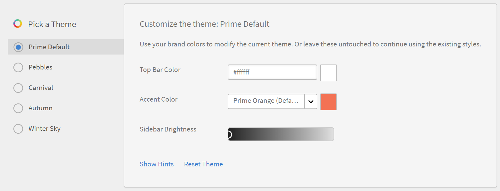

>[!NOTE]
>
>你只能用品牌設定名稱和標誌。 你無法更改標誌或圖片的位置。

***學習管理員支援以下標誌圖片檔案格式：.png、.jpeg、.jpg、.gif、.bmp***

### 設定你網站的主題 {#settingthethemesforyoursite}

學習管理器讓你能透過主題改變網站的外觀與氛圍。 應用程式提供以下色彩主題供您選擇：

* Prime Default
* 卵石
* 嘉年華
* 秋天
* 冬日天空

你可以選擇與企業品牌相符的配色方案。

1. 從學習管理員左側的導覽窗格，點擊 **[!UICONTROL Branding]**。
1. 在 **主題** 區，點擊 **[!UICONTROL Edit]**。 這個應用程式允許你選擇一個新主題。 當你選擇主題時，可以立即看到主要介面元素所使用的配色方案。

   

1. 此外，你還可以編輯 **頂部欄的顏色**、 **強調色**&#x200B;和 **側邊欄的亮度**。  你可以用自己品牌的顏色來呈現這些關鍵介面元素。
1. 要將數值重設為主題的預設配色方案，請點擊 **[!UICONTROL Reset Theme]**。 關鍵 UI 元素的顏色會設定為所選主題的預設選項。
1. 選擇主題後，點擊 **[!UICONTROL Show Hints]** 預覽中的標籤或提示。

   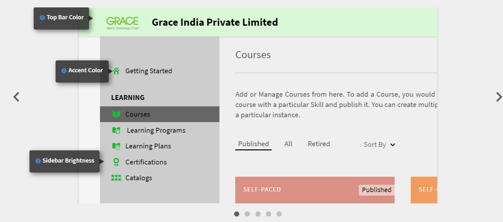

   請注意主題區有一張包含多張圖片&#x200B;****&#x200B;的幻燈片。這個投影片讓你能立即預覽主題或配色方案。 你可以立即預覽選定的頁面，如首頁、學習者儀表板等。

1. 如果你想在瀏覽器中預覽變更，請點擊 **[!UICONTROL Live Preview]**。 會跳出即時主題預覽視窗，你可以選擇修改配色方案，或繼續使用預設選項。 要在瀏覽器預覽選項，請點擊 **[!UICONTROL Preview]** 此彈出視窗。

   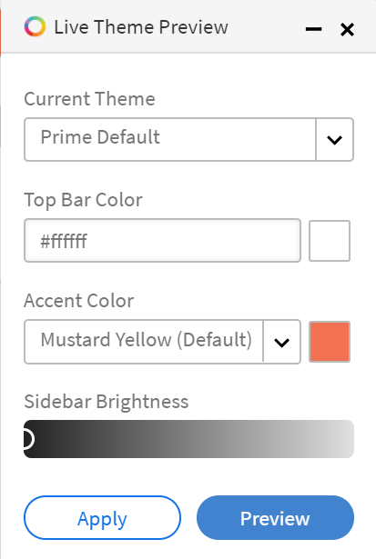

1. 所選選項會暫時套用到你的網站。 如果你想儲存所選主題和色彩設定，請點擊 **[!UICONTROL Apply]**。
1. 選擇並套用主題後，點擊 ****[!UICONTROL Save]**** 儲存你的選擇。

## 設定電子郵件範本 {#configureemailtemplates}

作為管理員，下一步是為各種活動設定電子郵件範本。 你可以啟用、停用並修改寄送給使用者的電子郵件範本。 電子郵件範本主要分為三大類：

* 一般電子郵件範本：這些郵件會針對一般事件觸發。 例如，使用者首次登入時會收到歡迎通知。
* 與學習對象或活動相關的電子郵件範本：每當有學習活動時，這些郵件會發送給學習者、作者或管理者。 例如，在課程註冊、課堂參與、完成課程等後觸發的電子郵件。
* 提醒與更新：當用戶需要任何活動的更新或提醒時，這些郵件會被觸發。 例如，學習者收到即將上課的提醒，或管理員收到分享報告的電子郵件通知。

你可以從管理員儀表板啟用並設定這些電子郵件通知。 要學習如何設定電子郵件範本，請執行以下步驟：

1. 在左側導覽窗格，點選 **[!UICONTROL **&#x200B;電子郵件範本&#x200B;**。]**
1. 請點擊以下其中一個分頁：一般/學習活動&#x200B;**/**&#x200B;提醒與更新&#x200B;**。]********[!UICONTROL ** 舉例來說，假設你點選 **[!UICONTROL **&#x200B;了學習活動&#x200B;**。]**
1. 點擊你想觸發郵件的切換按鈕。 在這個例子中，假設你點選 **[!UICONTROL **&#x200B;了「學習計畫 - 由管理員/經理&#x200B;**註冊」。]**

   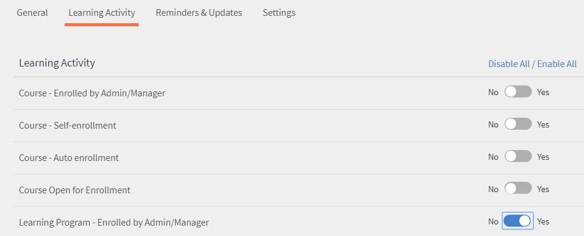

   系統會顯示「成功啟用」的彈出訊息。 現在，每當經理或管理員為學習者報名課程時，學習者會收到來自該學習管理員帳號的電子郵件。

1. 你可以修改預設的電子郵件範本。 點擊事件即可。 在這個例子中，點擊 **[!UICONTROL  Learning Program - Enrolled by Admin/Manager.]**
1. 在 **[!UICONTROL Template Preview]** 彈出視窗中，請注意有兩個分頁： [!UICONTROL Learner] 和 [!UICONTROL Manager]。

   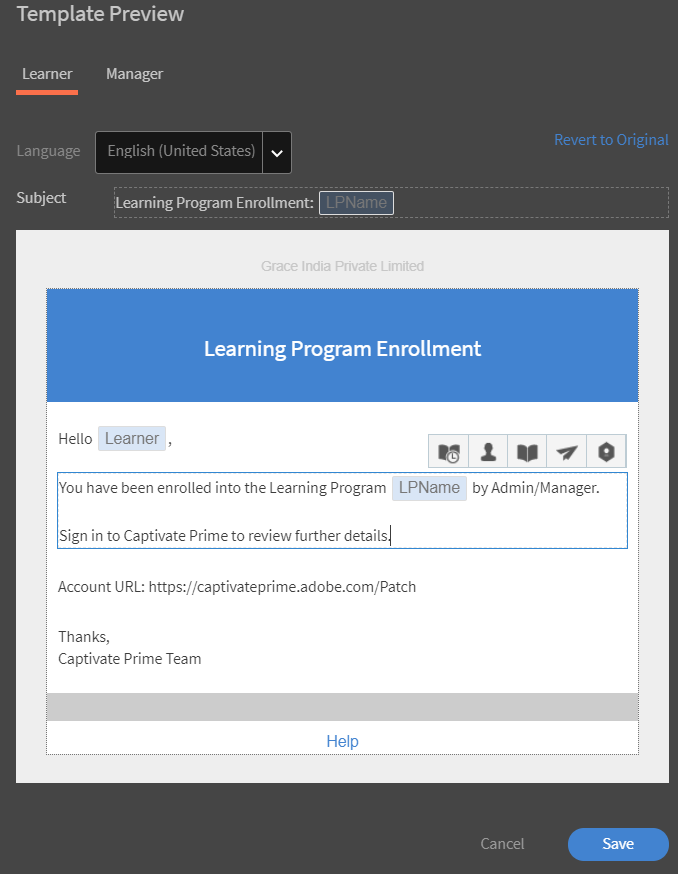

   在這些分頁中，點擊電子郵件正文以修改內容。 若要將變更儲存到電子郵件範本中，請點擊 **[!UICONTROL Save]**。

   現在，每當學員被經理或管理員報名課程時，學員和他的經理都會收到電子郵件通知。

   ***注意：這些修改僅適用於與所選活動相關的電子郵件範本。***

1. 請注意，您無法修改電子郵件範本中的帳戶網址或簽名。 要修改或&#x200B;**[!UICONTROL Account URL]****[!UICONTROL Signature]**，請點擊分&#x200B;**[!UICONTROL Settings]**&#x200B;頁。在這個分頁中，你可以修改電子郵件橫幅、電子郵件簽名、帳號網址。

   所有電子郵件中都會顯示帳號網址連結，就在簽名前。 輸入你偏好的網址並點擊 **[!UICONTROL Save]**。 這個網址僅對內部使用者可見。

   對於電子郵件橫幅，你可以選擇  **[!UICONTROL **&#x200B;橫幅&#x200B;**背景來更改橫幅的顏色。]** 你也可以選擇 **[!UICONTROL Custom Image]** 自訂圖片作為橫幅。 更改後點擊  **[!UICONTROL Save]** 。

   ***注意：電子郵件橫幅的自訂圖片尺寸必須是 1240x200px。 超過建議尺寸的圖片會被裁切。***

   ***Learning Manager 僅支援電子郵件橫幅的 .jpg、.jpeg 和 .png 檔案類型。***

   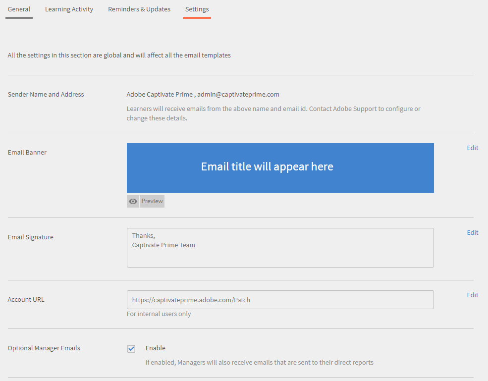

1. 您也可以選擇啟用可選經理電子郵件。 如果你勾選這個 **[!UICONTROL Enable]** 方塊，每當直屬下屬收到來自這個 Prime 帳戶的電子郵件時，該經理也會被包含在郵件名單中。

   ***注意：此分頁的設定適用於所有範本，且全球適用。***

### 為學習對象設定電子郵件範本 {#configureemailtemplatesforalearningobject}

除了在全域層級設定電子郵件範本外，作為管理員，你也可以為特定學習物件設定電子郵件範本。 在這種情況下，你對電子郵件範本所做的任何變更，僅適用於該學習對象。

這個選項也適用於作者，當作者建立學習物件時。

要為學習物件設定電子郵件範本：

1. 點擊你想設定電子郵件範本的課程、學習計畫或認證。
1. 從左側窗格點選&#x200B;**[!UICONTROL **「電子郵件範本」。**]** 系統會顯示 ****[!UICONTROL Template Preview]**** 彈出視窗。
1. 修改電子郵件範本的主旨或正文，並點擊**[!UICONTROL **儲存**]**以套用變更。
1. 要取消變更，請點擊&#x200B;**[!UICONTROL **「還原為原始」。**]**

### 限制使用者接收電子郵件 {#restrictusersfromreceivingemails}

作為管理員，您可以選擇誰會收到學習管理員的電子郵件，誰不會。 你可以透過 ****[!UICONTROL Restricted User]**** ****[!UICONTROL Settings]** ** 標籤下的選項來達成這個功能。 使用者可透過姓名、電子郵件 ID 或唯一使用者 ID 加入此名單。 此選項下的使用者將被限制無法接收來自 Learning Manager 的任何電子郵件通知。

## 設定你的帳號設定 {#configureyouraccountsettings}

學習管理員允許您設定一些帳號設定，如基本設定、回饋設定、一般設定，以及學習者儀表板的設定。 以下程序告訴你如何設定這些設定：

### 設定基本設定 {#configurebasicsettings}

1. 在學習管理員首頁，點擊 ****[!UICONTROL Settings]****。 預設情況下，系統會顯示基本資訊頁面，並顯示預設語言和地點欄位。
1. 點擊 ****[!UICONTROL Change]**** 頁面右上角以編輯基本資訊。
1. 請設定以下選項：

   * **國家**：從下拉選單中選擇國家。
   * **時區**：為你的位置設定合適的時區。
   * **地點：選擇**&#x200B;你選擇的語言。 如果你更改了這個欄位的語言，所有使用該應用程式的使用者都會被更改。 然而，每個使用者個別都可以修改偏好語言。
   * **財政年度開始日期：**&#x200B;選擇您組織財政年度開始的月份。

   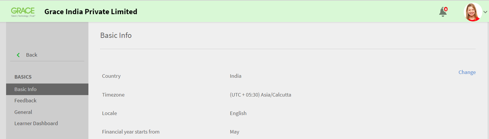

## 設定回饋設定 {#configurefeedbacksettings}

學習管理器讓你能從學習者那裡收集課程回饋。 也可以使用 Learning Manager 收集學習者的回饋。 要徵求回饋，你必須先設定 L1 和 L3 類型的回饋。

L3 回饋是經理對學習者的回饋。 你可以利用這種回饋來追蹤學習者隨時間的表現。 第一語言回饋是學習者對課程所提供的回饋。 這類回饋有助於管理員收集課程的直接回饋。

作為管理員，你可以全域設定回饋設定。 為此，請遵循以下程序：

1. 在學習管理員首頁，點擊 **[!UICONTROL Settings]**。
1. 在左側窗格，點擊 **[!UICONTROL General]**。
1. 要設定 L1 回饋，請點擊分 **[!UICONTROL L1 Feedback]** 頁。 你會看到設定一個必修題和幾個選修題的選項。 這些問題是學習者在完成課程後提供回饋時會看到的問題。 這些問題以陳述形式呈現，讓學習者能在1到5的評分尺度上選擇自己的答案。

   L1回饋的第一部分是必問的問題，詢問學習者如何向朋友或同事推薦此課程。

   ***注意：你無法編輯或修改必問問題。***

   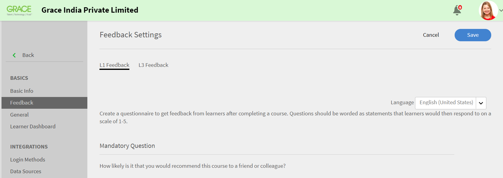

1. 若要設定回饋問卷的其他問題，請點擊 、 或 ****[!UICONTROL Classroom Courses]****&#x200B;中的問題&#x200B;****[!UICONTROL Self-Paced Courses]****。當你點擊問題時，系統允許你編輯預設問題。

   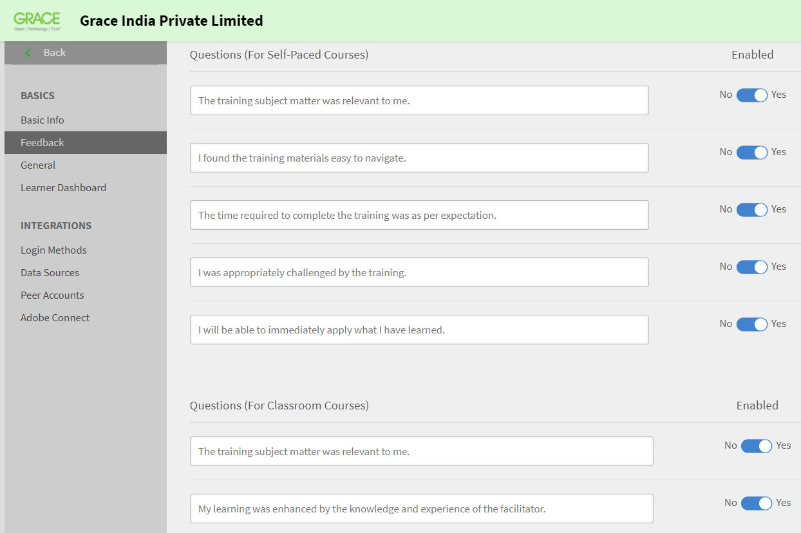

1. 你可以啟用或停用預設問題，或完全修改預設問題以符合你的需求。 例如，你可以移除預設的問題「訓練內容對我有關聯」，改為「我覺得訓練有用且相關」。
1. 完成學習者問題後，你可以設定提醒設定。 預設情況下，應用程式會自動發送提醒給學習者，當他們成功完成課程時。 此提醒也設定為每兩週重複一次，直到學習者回應。 你可以點擊提醒事項來修改現有的提醒，或新增新的提醒。

   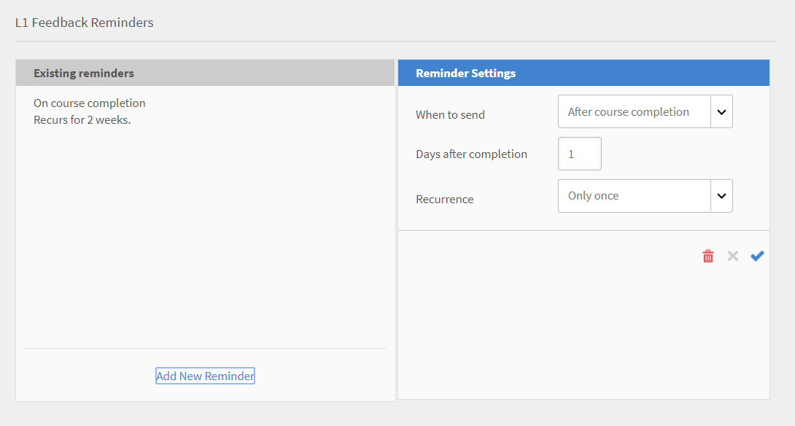

1. 請透過以下選項設定提醒事項：

   * **何時發送**：請明確表示您希望在課程結束時或課程結束後發送回饋請求。
   * **完成**&#x200B;後天數：指定你想在幾天後寄送回饋請求。 此欄位僅在選擇 ****[!UICONTROL After course completion]****&#x200B;時可見。

   * **重複**&#x200B;性：請指定你是想每天、每週或每月發送回饋提醒。 你也可以指定要發送提醒的週數。

1. 點擊勾選標記以儲存你的提醒設定。
1. 完成所有回饋設定後，點擊頁面右上角的「[!UICONTROL **儲存**]」。

## 設定 L3 回饋： {#configurel3feedback}

L3 回饋包含學習者完成課程後，會送達給其主管的問題。 L3 回饋讓管理員能追蹤學習者行為或技能隨時間的變化。 要設定此回饋，請在回饋頁面點擊分 ****[!UICONTROL L3 Feedback]**** 頁。 你看到一個預設問題。 經理必須用五分評分量表來回答這個問題。

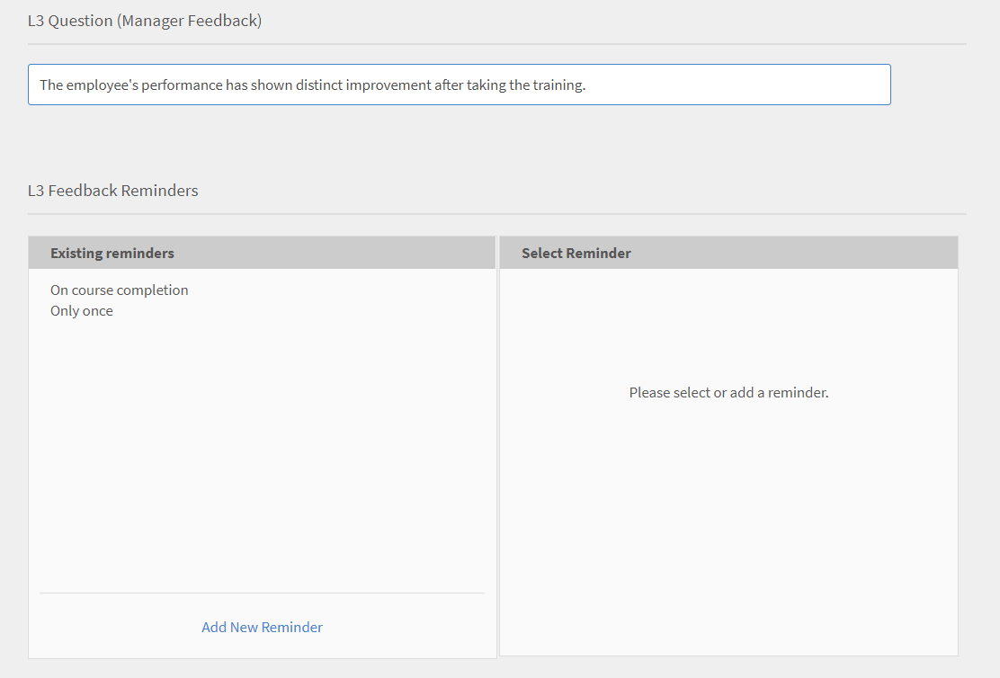

類似於 L1 回饋，你可以設定 L3 回饋的提醒。 你可以修改現有的提醒，或新增新的回饋提醒。

完成回饋問題和提醒設定後，點選 ****[!UICONTROL Save]**** 套用設定。

## 在實例層級配置回饋 {#configurefeedbackataninstancelevel}

先前的程序概述了在全局層級配置反饋設定的步驟。 也就是說，這些設定會套用到所有課程。 除了這些全域問題外，作為管理員或作者，你還可以在實例層級設定額外的 L1 和 L3 回饋問題。

要在實例層級設定回饋設定：

1. 在學習管理員首頁，點擊 **[!UICONTROL Courses]**。
1. 將滑鼠移到你想設定回饋設定的賽道上。 點擊 [!UICONTROL **查看課程**。]

   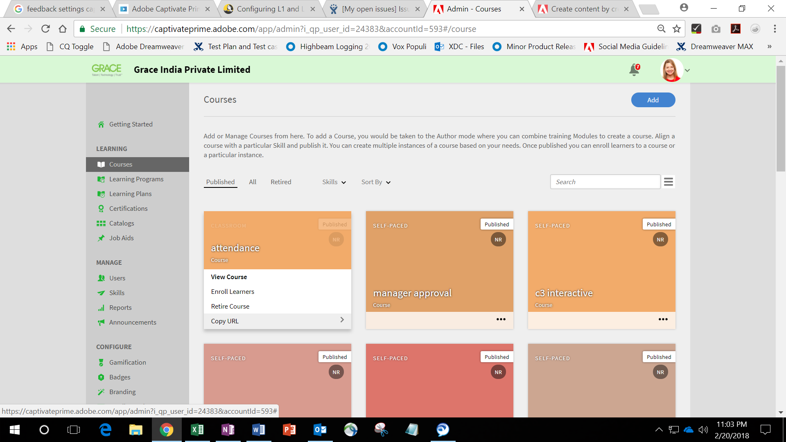

1. 在課程詳情頁面，點選 **[!UICONTROL Instance Defaults]** 「配置」區塊。
1. 在 [!UICONTROL **「語言**] 」下拉選單中，選擇你希望回饋問卷顯示的語言。
1. 如果你想徵求學習者的回饋，請啟用第一語言反應回饋。 在這個部分最多可以加兩個問題。 學習者能對這些問題提供描述性的回答。
1. 如果你想將其中一題或兩題設為必修，請勾 **[!UICONTROL Make Mandatory]** 選勾選方塊。
1. 選擇「 **[!UICONTROL Show questionnaire immediately after course completion]** 若希望學習者完成課程後立即查看回饋問卷」。

   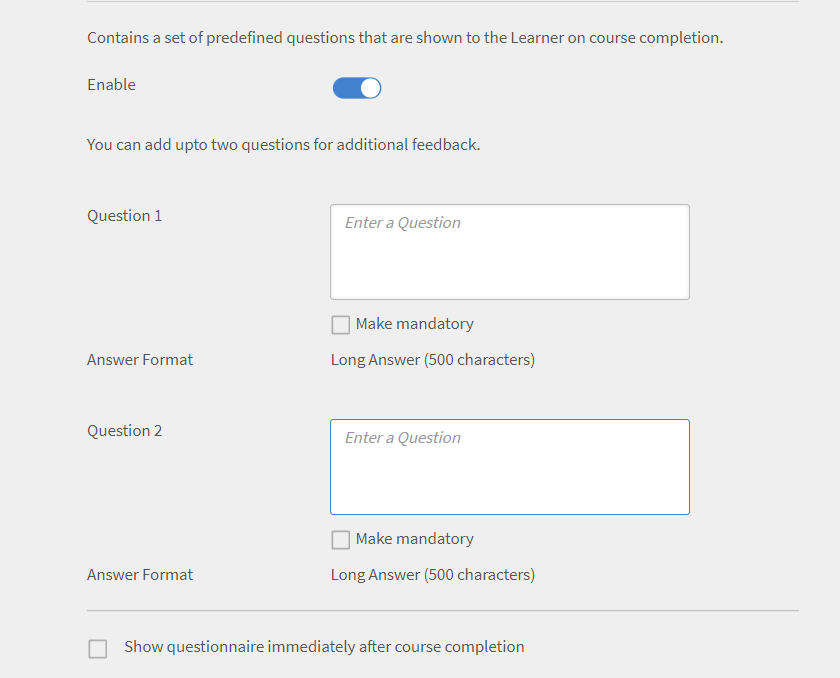

1. 若要在實例層級設定 L3 行為變更回饋，稱為 ****[!UICONTROL Enable]**** L3 回饋。 應用程式會顯示一個預設的必填問題，以及一個空白問題，你可以輸入你想要的問題。
1. 對於學習者修完課程後的成長問題，答案是李克特量表格式。 也就是說，經理必須在「強烈同意與強烈不同意」的尺度上選擇一個選項。
1. 請向經理說明第二個問題。 經理可以給出描述性的回答。
1. 如果你想讓第二個問題成為強制性，請勾 ****[!UICONTROL Make Mandatory]**** 選勾選方塊。

   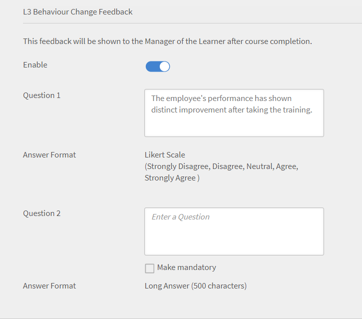

1. 也可以選擇在實例層級設定提醒。 如果你沒在這裡設定提醒，全域提醒設定會自動分配。
1. 完成回饋問題和提醒設定後，點擊 **[!UICONTROL **Save**]** 套用你的設定。

   ***注意：回饋設定不適用於認證。***

## 設定一般設定 {#configuregeneralsettings}

Learning Manager 中的一般設定允許管理員設定影響應用程式其他功能的通用設定。 例如，你可以使用一般設定來指定課程成效是否能讓學習者看見。 要設定一般設定：

1. 在學習管理員首頁，點擊 ****[!UICONTROL Settings]****。
1. 在左側窗格，點擊 ****[!UICONTROL General]****。
1. 在一般設定頁面，您可以設定以下選項：

   對於這些選項，每個選項影響的功能都各有不同。 如有需要，我們可以提供每個詳細功能的交叉連結。

   * **顯示課程成效**：若您希望學習者能在課程名稱中看到課程成效，請啟用此選項。
   * **模組重置選項**：如果你想讓學習者有重置模組的能力，請啟用此選項。 若學員未通過，或部分完成模組後想重新開始，則可重新開始。
   * **課程審核**：若您希望課程變更在學習者可見前先獲得管理員批准，請啟用此選項。
   * **討論區**：如果你希望學習者能瀏覽並參與課程討論區，請啟用此選項。 如果你啟用 **討論區** 勾選框，學習者和講師就可以對課程發表評論。 然而，如果課程層級設定顯示未選擇此功能，則課程層級設定優先於管理員設定。

   * **探索技能選項**：若希望學習者探索同儕與領導能力，請啟用此選項。
   * **獨特學習物件 ID：**&#x200B;如果你想讓作者能為學習物件新增唯一 ID，請啟用此選項。
   * **顯示目錄列表**：若想讓學習者看到所有可用的目錄，請啟用此選項。 此選項幫助學習者精煉學習物件清單。

   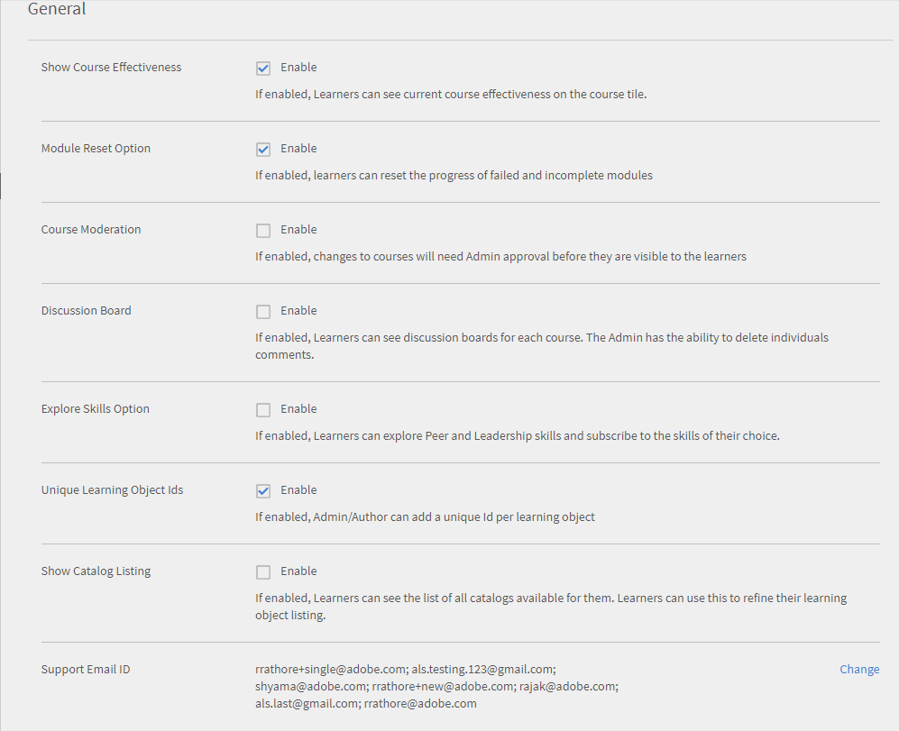

## 配置學習器儀表板設定 {#configurelearnerdashboardsettings}

學習管理員中的學習者儀表板讓學習者除了自己的成就、技能和公告外，還能查看必修與推薦課程。 管理員可透過設定學習者儀表板設定來決定學習者儀表板的呈現方式。 這些設定允許管理員在學習者頁面上設定小工具。 這些設定也指定了小工具如何以及在學習者儀表板上的位置。 作為管理員，您可以在套用設定前預覽學習者儀表板的版面。

1. 在學習管理員首頁，點擊 **[!UICONTROL Settings]**。
1. 在左側導覽窗格，點選 **[!UICONTROL **&#x200B;學習者儀表板&#x200B;**。]**
1. 選擇你想啟用的小工具。 如果你取消選取小工具，該小工具會立即從預覽中移除。 學習者無法在儀表板中看到這個小工具。
1. 點擊 ****[!UICONTROL Save]**** 套用設定。

   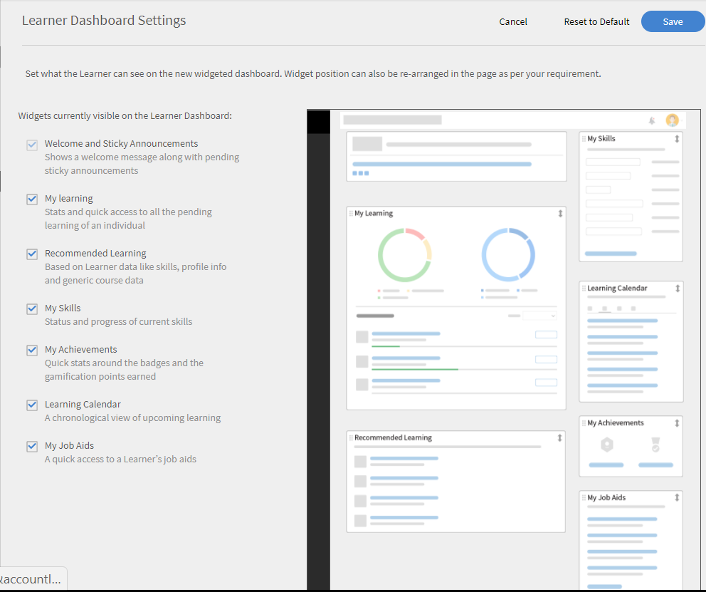

1. 要套用預設設定，請點擊 **[!UICONTROL Restore to Default.]** 。在這種情況下，除了 **[!UICONTROL Welcome and Sticky Announcements]** 所有小工具外，其他都可見。

   ***即使你啟用了學習者儀表板的設定，學習者仍可在各自的儀表板中修改和移動小工具。***
