# Learning Manager聯結器

瞭解如何使用聯結器將Salesforce與Learning Manager整合、如何將FTP與Learning Manager整合，以及如何使用FTP聯結器自動上傳CSV。

企業有其他應用程式和系統，可能需要與Learning Manager整合。 聯結器是有助於執行資料式整合的公用程式，例如從外部系統將資料匯入Learning Manager，或從Learning Manager將資料匯出至外部系統。 在2016年7月版本中，聯結器僅能從外部系統大量匯入Learning Manager的使用者。

Learning Manager提供Salesforce和FTP聯結器。 使用Salesforce聯結器，組織的整合管理員可以將其Salesforce應用程式與Learning Manager整合。 身為整合商，您也可以使用FTP聯結器將一組使用者自動匯入您的企業應用程式。

Learning Manager也提供Lynda、getAbstract和Harvard Management System聯結器，讓學習者能夠存取和使用Lynda.com、getAbstract和Harvard ManageMentor的課程。

請閱讀下文，瞭解如何在Learning Manager中設定和使用每個聯結器。

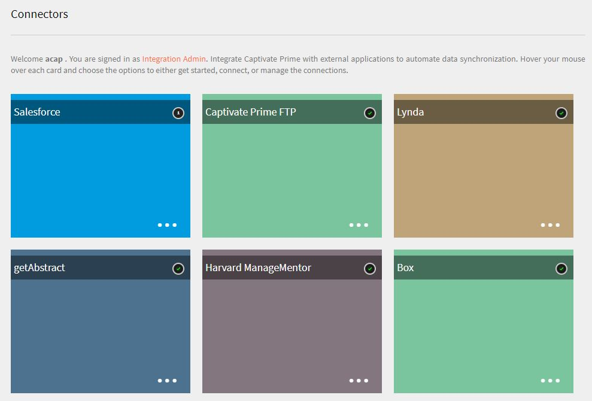

## Salesforce聯結器 {#sfconnector}

Salesforce聯結器會連線Learning Manager和Salesforce帳戶，以自動化資料同步。 Salesforce聯結器功能如下：

### 對應屬性

整合管理員可以選擇Salesforce欄，並將它們對應至對應的Learning Manager群組屬性。 這是單次性的工作。 完成對應後，後續的使用者匯入會使用相同的對應。 如果管理員想要為匯入使用者設定不同的對應，則可重新設定此對應。

### 自動匯入使用者

使用者匯入程式可讓Learning Manager管理員從Salesforce擷取員工詳細資訊，並自動將其匯入Learning Manager。 此自動化可避免建立CSV和上傳至Learning Manager的手動操作。

### 自動排程

使用自動排程功能以及自動使用者匯入功能可能很有效。 Learning Manager管理員可以根據組織需求設定排程。 Learning Manager應用程式中的使用者可以根據排程取得最新狀態。 同步可在Learning Manager應用程式中每天執行。

### 篩選使用者

Learning Manager管理員可在匯入使用者之前對其套用篩選。 例如，Learning Manager管理員可選擇匯入階層中一或多個特定管理員下的所有使用者。

## 設定Salesforce聯結器 {#configuresalesforceconnector}

瞭解將Learning Manager與Salesforce整合的程式。

### 先決條件 {#prerequisites}

確定您隨身帶著您的Salesforce組織URL。 例如，如果您的組織名稱為 **myorg**，則Salesforce URL可能是 [https://myorg.salesforce.com](https://myorg.salesforce.com/). 這是連線Salesforce帳戶與Learning Manager的唯一必要輸入。

同時請確定您擁有適當的認證以登入帳戶。

## 建立連線 {#createaconnection}

1. 在Learning Manager首頁中，將滑鼠游標停留在Salesforce卡片/縮圖上。 選單出現。 按一下 **[!UICONTROL Connect]** 功能表中的專案。

   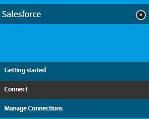

1. 會出現一個對話方塊，提示您輸入org-url。 按一下 **[!UICONTROL Connect]** 在提供URL之後。
1. 成功連線後，就會顯示覆寫頁面。

## 對應屬性 {#mapattributes}

成功建立連線後，您可以將Salesforce欄對應至Learning Manager的對應屬性。 此步驟為必要步驟。

1. 在對映頁面中，左側可看到Learning Manager的欄，右側可看到Salesforce欄。 選取對應至Learning Manager欄名稱的適當欄名稱。

   

   左側顯示的Learning Manager欄資料是從作用中欄位擷取。 此 **經理** 欄位必須對應到電子郵件地址型別的欄位。 必須先對應所有欄，才能使用聯結器。

1. 按一下 **[!UICONTROL Save]** 完成對應之後。
1. 聯結器現已準備就緒，可供使用。 現在已設定的帳戶會在管理員應用程式中顯示為資料來源，供管理員排程匯入或進行隨選同步。

## 使用Salesforce聯結器 {#usingsalesforceconnector}

Salesforce聯結器會連線至Salesforce.com ，擷取設定中的使用者，並將其新增至Learning Manager。

## Learning Manager FTP聯結器 {#ftpconnector}

使用FTP聯結器，您可以將Learning Manager與任意外部系統整合，以自動化資料同步。 外部系統應該可以匯出CSV格式的資料，並將其放在Learning Manager FTP帳戶的適當資料夾中。 FTP聯結器功能如下：

您也可以使用Box聯結器進行資料移轉、使用者匯入和資料匯出。 如需詳細資訊，請參閱 [方塊聯結器。](third-party-connectors.md#main-pars_header_302653946)

## 資料匯入 {#dataimport}

使用者匯入程式可讓Learning Manager管理員從Learning Manager FTP服務擷取員工詳細資訊，並自動將其匯入Learning Manager。 使用此功能，您可以將這些系統產生的CSV放在FTP帳戶的適當資料夾中，以整合多個系統。 Learning Manager會挑選CSV檔案、將其合併，並根據排程匯入資料。 如需詳細資訊，請參閱排程功能。

**對應屬性**

整合管理員可以選擇CSV欄，並將它們對應至Learning Manager的群組屬性。 此對應是一次性工作。 完成對應後，後續的使用者匯入會使用相同的對應。如果管理員想要擁有不同的對應來匯入使用者，可以重新設定對應。

## 匯出資料 {#exportdata}

「資料匯出」可讓使用者將使用者技能匯出至FTP位置，以便與任何第三方系統整合。

## 正在排程 {#scheduling}

管理員可以根據組織的需求設定排程任務，且Learning Manager應用程式中的使用者會根據排程瞭解最新狀態。 同樣地，整合管理員可以排程技能匯出，以及時與外部系統整合。 同步可在Learning Manager應用程式中每天執行。

## 設定Learning Manager FTP聯結器 {#configurecaptivateprimeftpconnector}

瞭解將Learning Manager與FTP聯結器整合的程式。

### 建立連線 {#Createaconnection-1}

1. 在Learning Manager首頁中，將滑鼠游標停留在FTP卡片/縮圖上。 選單出現。 按一下 **[!UICONTROL Connect]** 功能表中的專案。

   

1. 系統會顯示一個對話方塊，提示您輸入電子郵件ID。 提供組織內負責管理Learning Manager FTP帳戶人員的電子郵件ID。 按一下 **[!UICONTROL Connect]** 在提供電子郵件id之後。
1. Learning Manager會傳送電子郵件給您，提示使用者在首次存取FTP前重設密碼。 使用者必須重設密碼，並使用此密碼存取Learning Manager FTP帳戶。

   只能為特定Learning Manager帳戶建立一個Learning Manager FTP帳戶。

   在總覽頁面中，您可以指定整合的連線名稱。 從下列選項中選擇您要採取的動作：

   * 匯入內部使用者
   * 匯出使用者技能 — 設定排程
   * 匯出使用者技能 — 隨選

   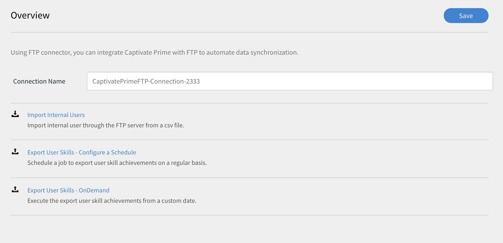

## 匯入

+++內部使用者

匯入內部使用者選項可讓您排程自動產生使用者匯入報告。 產生的報表會以.CSV檔案傳送給您。

+++

+++對應屬性

成功建立連線後，您可以將放在FTP資料夾中的CSV檔案欄對應至Learning Manager的對應屬性。 此步驟為必要步驟。

1. 在「對應屬性」頁面的左側，您可以看到Learning Manager的預期欄，而右側，您可以看到CSV欄名稱。 最初，您可以在右側看到一個空白的選取方塊。 按一下以匯入任何範本CSV **選擇檔案**.
1. 上述步驟會在右側的「選取」下拉式清單中填入所有CSV欄名稱。 選取對應至Learning Manager欄名稱的適當欄名稱。

   *[管理員]欄位必須對應到電子郵件地址型別的欄位。 必須先對應所有欄，才能使用聯結器。*

1. 按一下 **[!UICONTROL Save]** 完成對應之後。

   聯結器現已準備就緒，可供使用。 剛設定的帳戶現在會在管理員應用程式中顯示為資料來源，供管理員排程匯入或隨選同步。

+++

+++使用Learning Manager FTP聯結器

1. 來自外部系統的CSV檔案應放置在下列路徑中：

   `code $OPERATION$/$OBJECT_TYPE$/$SUB_OBJECT_TYPE$/data.csv`

   **注意：** 在2016年7月版本中，僅允許匯入使用者。 因此，若要使用FTP聯結器，您必須確保CSV檔案放置在下列資料夾中：

   `code Home/import/user/internal/*.csv`

1. FTP聯結器會擷取CSV檔案中的所有列，因此重要的是，一個CSV中對應到使用者的列不會出現在任何其他CSV中。
1. 所有CSV都應該包含對應中指定的欄。
1. 在程式開始之前，所有必要的CSV都應該出現在資料夾中。

將使用者匯入Learning Manager時，管理員還需要瞭解如何在Learning Manager中管理使用者。 請參閱 [使用者管理說明](../integration-admin/feature-summary/migration-manual.md#usermanagement) 以瞭解更多資訊。

+++

## 匯出

+++Skills

匯出使用者技能報告有兩個選項。

**[!UICONTROL User Skills - On Demand]**：您可以指定開始日期，並使用選項匯出報表。報表將會從輸入的日期擷取到目前為止。

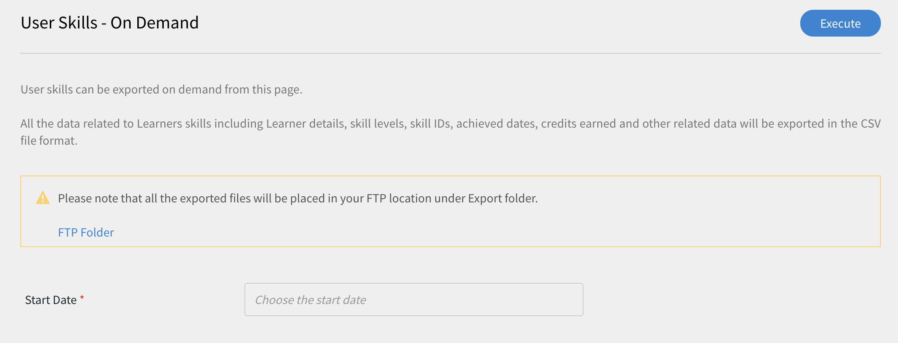

**[!UICONTROL User Skills - Configure]**：此選項可讓您排程報表的擷取。 選取「啟用排程」核取方塊，並指定開始日期和時間。 您也可以指定產生和傳送報告的間隔。

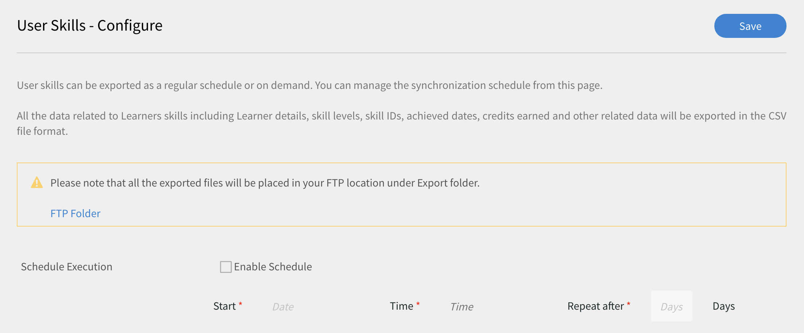

+++

若要開啟「匯出」資料夾（匯出的檔案將放置於您的FTP位置），請開啟「使用者技能」頁面中提供的「FTP資料夾」連結，如下所示。

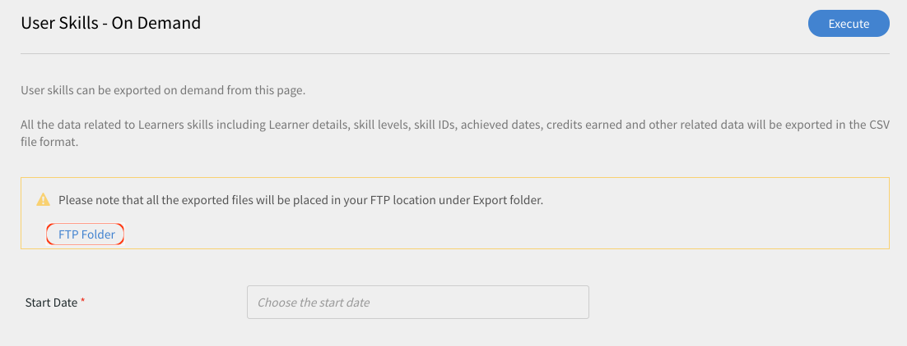

自動匯出的檔案會出現在位置中 **首頁/匯出/&#42;FTP位置&#42;**

自動匯出的檔案將以下列標題提供： **skill_achieves_&#42;起始日期&#x200B;&#42;_至_&#42;結束日期&#42;.csv**

## Lynda聯結器 {#lyndaconnector}

Lynda.com的企業客戶可使用琳達聯結器，他們想要讓學習者從Learning Manager中探索及使用Lynda課程。 聯結器可設定為定期使用您的API金鑰從Lynda.com擷取課程。 在Learning Manager中建立課程後，使用者可以搜尋課程並加以使用。 然後可以在Learning Manager中追蹤學習者進度。

### 設定Lynda聯結器 {#configurethelyndaconnector}

1. 在整合式管理員控制面板中，按一下Lynda 。

   您將會看到包含三個選項的圖磚：快速入門、連線及管理連線。

1. 如果您是第一次設定Lynda聯結器，請按一下「連線」。

   在設定此聯結器之前，必須先設定Exavault FTP帳戶。

1. 從連線頁面，指定聯結器的名稱。 輸入連線的Appkey和Secret金鑰。

   您必須連絡您的廠商以取得Appkey和秘密金鑰。

1. 按一下「儲存」。

   已儲存設定並新增您帳戶的Lynda連線。 您現在可以從首頁按一下管理連線，並隨時編輯您的設定。

1. 如果已建立連線，請按一下[管理連線]檢視所有連線。

   在您設定此聯結器之前，必須為您的帳戶啟用移轉功能。

1. 按一下您要編輯的連線。
1. 從左窗格中，按一下「設定」。 執行下列任一項作業：

   * 從此視窗檢視或編輯您帳戶的詳細資訊以及同步處理排程。 若要啟用此帳戶，您必須選取[啟用連線]核取方塊。
   * 按一下編輯並編輯您的認證。 按一下「重設」以復原此欄位的更新。
   * 按一下啟用排程來排程您的同步化。 您可以輸入開始時間與日期，然後輸入同步化排程的頻率（以天為單位）。 例如，每3天啟用一次同步處理。

   按一下「儲存」以儲存變更。

   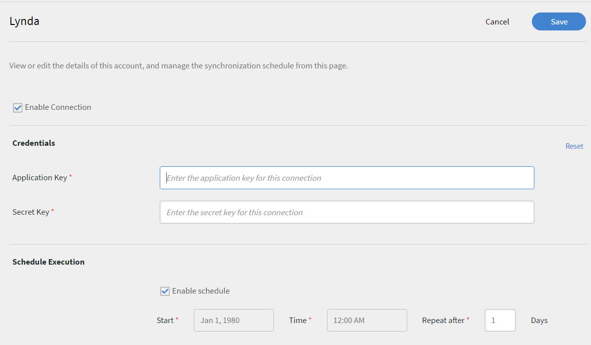

1. 從左窗格中，按一下「隨選執行」。 此選項可讓您從Lynda匯入使用者摘要和其他相關資料。 輸入隨選執行的「開始日期」，然後按一下「執行」以執行同步化。 從開始日期起直到現在的所有資料都會匯入。

   * 在執行期間，您可以按一下「停用對Learning Manager的存取」 ，其中應用程式會在同步期間停機。
   * 如果您在執行期間按一下「啟用對Learning Manager的存取權」，同步期間服務不會中斷。

   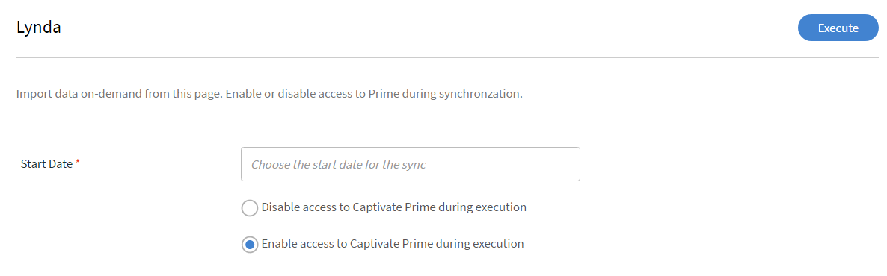

1. 您也可以隨時從左側窗格按一下「執行狀態」，以時間順序檢視此聯結器的所有執行摘要。 您可以檢視同步化的開始日期和持續時間、同步化的型別（無論是隨選同步化）以及同步化的狀態（無論是正在進行中還是已完成）。

   當您刪除並重新建立連線時，會再次出現聯結器的先前執行。 您可以在刪除連線之前檢視所有執行。

   您只能對最新的同步處理執行重新執行。

   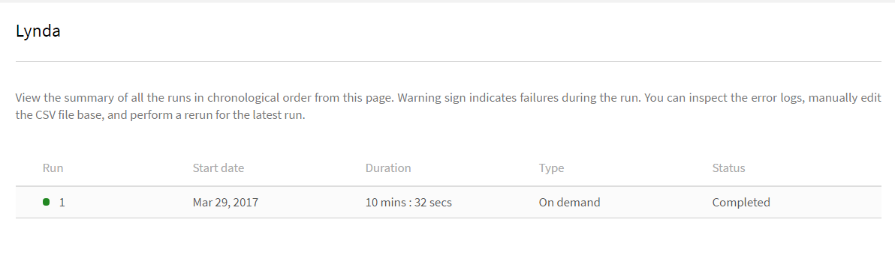

## getAbstract聯結器 {#getabstractconnector}

getAbstract.com的企業客戶可使用getAbstract聯結器，他們希望學習者探索及使用getAbstract摘要。 聯結器可設定為定期擷取使用資料，根據在Learning Manager中建立的學習者完成記錄而定。 請閱讀下文，瞭解如何在Learning Manager中設定此聯結器。

### 設定getAbstract聯結器 {#configurethegetabstractconnector}

1. 在整合式管理員控制面板中，按一下getAbstract。

   從圖磚中，您會看到三個選項：「快速入門」、「連線」和「管理連線」。

1. 如果您是第一次設定getAbstract聯結器，請按一下「連線」。

   在設定此聯結器之前，必須先設定Exavault FTP帳戶。

   請確定您與內容提供者共用此FTP認證，以存取摘要。

1. 在連線名稱欄位中輸入連線的名稱。

   在使用者端識別碼和使用者端密碼欄位中輸入適當的金鑰。 您可能需要連絡您的廠商，以取得此聯結器的適當金鑰。

   取得使用者端所使用課程的課程中繼資料需要金鑰。

1. 如果已建立連線，請從「首頁」按一下「取得抽象>管理連線」，以檢視並編輯現有的組態。

   在您設定此聯結器之前，必須為您的帳戶啟用移轉功能。

1. 按一下您要檢視或編輯其設定的連線。

   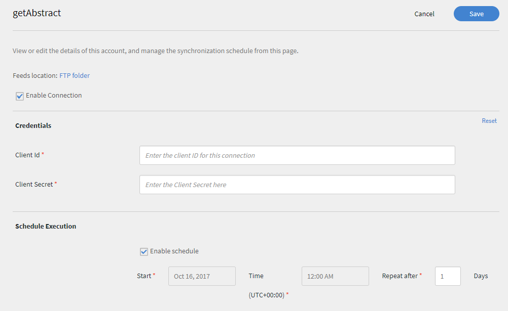

1. 從左窗格中，按一下「設定」。 執行下列任一項作業：

   * 從此視窗檢視或編輯您帳戶的詳細資訊以及同步處理排程。 若要啟用此帳戶，您必須選取[啟用連線]核取方塊。
   * 按一下編輯並編輯您的認證。 按一下「重設」以復原此欄位的更新。
   * 按一下啟用排程來排程您的同步化。 您可以輸入開始時間與日期，然後輸入同步化排程的頻率（以天為單位）。 例如，每3天啟用一次同步處理。

1. 按一下「儲存」。

   會儲存設定並新增您帳戶的getAbstract連線。

1. 從左窗格中，按一下「隨選執行」。 此選項可讓您從getAbstract匯入使用者摘要和其他相關的資料。 輸入隨選執行的「開始日期」，然後按一下「執行」以執行同步化。 從開始日期起直到現在的所有資料都會匯入。

   * 在執行期間，您可以按一下「停用對Learning Manager的存取」 ，其中應用程式會在同步期間停機。
   * 如果您在執行期間按一下「啟用對Learning Manager的存取權」，同步期間服務不會中斷。

1. 您也可以隨時從左側窗格按一下「執行狀態」，以時間順序檢視此聯結器的所有執行摘要。 您可以檢視同步化的開始日期和持續時間、同步化的型別（無論是隨選同步化）以及同步化的狀態（無論是正在進行中還是已完成）。

   當您刪除並重新建立連線時，會再次出現聯結器的先前執行。 您可以在刪除連線之前檢視所有執行。

   您只能對最新的同步處理執行重新執行。

   若要讓任何型別的同步作業運作，您必須確定使用者摘要出現在同步作業指定日期的getAbstract FTP資料夾中。

   請參閱下列excel工作表，此工作表是來自getAbstract的使用者摘要檔案範例。 檔案名稱應遵循以下格式：** report_export_yyyy_MM_dd_HHmmss.xlsx**或 **report_export_yyyy_MM_dd.xlsx**.
   [getAbstract使用者摘要範例excel工作表](assets/report-export-20170401175342.xlsx)

## Harvard ManageMentor聯結器 {#hmmconnector}

Harvard ManageMentor聯結器可供Harvard ManageMentor的企業客戶使用，他們想要讓學習者探索及使用Harvard ManageMentor課程。 聯結器可協助在Learning Manager中建立課程，並設定為定期擷取學習者進度資料。 若要配置此聯結器，請執行下列步驟：

### 設定Harvard ManagerMentor聯結器 {#configuretheharvardmanagermentorconnector}

1. 在「整合式管理員」控制面板中，按一下「Harvard管理導師」。

   從圖磚中，您會看到三個選項：「快速入門」、「連線」和「管理連線」。

1. 如果您是第一次設定Harvard ManageMentor聯結器，請按一下「連線」。

   您也必須先設定Exavault FTP帳戶，才能設定此聯結器。

   請確定您與內容提供者共用此FTP認證，以存取摘要。

1. 在「連線名稱」欄位中輸入連線的名稱。 按一下[連線]以儲存此連線。
1. 如果已建立連線，請從「首頁」按一下「Harvard管理導師」>「管理連線」。 按一下您要編輯的連線以編輯現有的組態。

   在您設定此聯結器之前，必須為您的帳戶啟用移轉功能。

   

1. 從左窗格中，按一下「設定」。 執行下列任一項作業：

   * 從此視窗檢視或編輯您帳戶的詳細資訊以及同步處理排程。 若要啟用此帳戶，您必須選取[啟用連線]核取方塊。
   * 按一下啟用排程來排程您的同步化。 您可以輸入開始時間與日期，然後輸入同步化排程的頻率（以天為單位）。 例如，每3天啟用一次同步處理。

1. 從左窗格中，按一下「隨選執行」。 此選項可讓您從Harvard ManageMentor匯入使用者摘要及其他相關資料。 輸入隨選執行的「開始日期」，然後按一下「執行」以執行同步化。 從此連線匯入從開始日期到目前的所有資料。

   * 在執行期間，您可以按一下「停用對Learning Manager的存取」 ，其中應用程式會在同步期間停機。
   * 如果您在執行期間按一下「啟用對Learning Manager的存取權」，同步期間服務不會中斷。

   如果您要每隔幾天自動執行同步處理，請在「重複天數」欄位中指定天數。 同步可確保您的帳戶更新為Harvard ManageMentor摘要的最新版本。

1. 您也可以隨時從左側窗格按一下「執行狀態」，以時間順序檢視此聯結器的所有執行摘要。 您可以檢視同步化的開始日期和持續時間、同步化的型別（無論是隨選同步化）以及同步化的狀態（無論是正在進行中還是已完成）。

   當您刪除並重新建立連線時，會再次出現聯結器的先前執行。 您可以在刪除連線之前檢視所有執行。

   您只能對最新的同步處理執行重新執行。

   若要同步成功，您必須確保Harvard ManageMentor FTP資料夾中至少有下列其中一個檔案：

   hmm12_metadata.xlsx：此檔案提供Harvard ManageMentor聯結器的課程中繼資料。 上傳檔案時，請務必遵循命名慣例。

   client_hmm12_20150125.xlsx：這是Harvard ManageMentor聯結器的使用者摘要。 您必須遵循的檔案命名慣例是 **client_hmm12_yyyyMMdd.xlsx。**

   請參閱此聯結器的以下兩個使用者資訊源範例和課程資訊源檔案：
   [Harvard ManageMentor聯結器的課程中繼資料檔案](assets/hmm12-metadata.xlsx) [Harvard ManageMentor聯結器的使用者摘要](assets/client-hmm12-20170304.xlsx)

## Workday聯結器 {#workdayconnector}

使用Workday聯結器，您可以整合Learning Manager與Workday租使用者，以自動化資料同步。

### 匯入

#### 對應屬性

整合管理員可以選擇Workday欄，並將它們對應至對應的Learning Manager群組屬性。 這是單次性的工作。 完成對應後，後續的使用者匯入會使用相同的對應。 如果管理員想要為匯入使用者設定不同的對應，則可重新設定此對應。

#### 自動匯入使用者

使用者匯入程式可讓Learning Manager管理員從Workday擷取員工詳細資訊，並自動將其匯入Learning Manager。

#### 篩選使用者

Learning Manager管理員可在匯入使用者之前對其套用篩選。 例如，Learning Manager管理員可選擇匯入階層中一或多個特定管理員下的所有使用者。

## 匯出

使用者技能匯出可讓使用者自動將使用者技能匯出至Workday。

不能使用同一Workday帳戶同時匯出來自多個Learning Manager帳戶的技能。

## 正在排程 {#Scheduling-1}

管理員可以根據組織的需求設定排程任務，且Learning Manager應用程式中的使用者會根據排程瞭解最新狀態。 同樣地，整合管理員可以排程技能匯出，以及時與外部系統整合。 同步可在Learning Manager應用程式中每天執行。

## 設定Workday聯結器 {#configureworkdayconnector}

**先決條件**：請您組織的Workday管理員建立具有ISU_Permissions檔案中定義之許可權的整合系統使用者(ISU)。 從下列連結下載副本。
[下載整合系統使用者(ISU)安全性的復本。](assets/isu-permissions-v1.pdf) 瞭解將Learning Manager與Workday聯結器整合的程式。

1. 在Learning Manager首頁中，將滑鼠游標停留在Workday圖磚上。 選單出現。 按一下 **[!UICONTROL Connect]** 功能表中的專案。

   

1. 會出現一個對話方塊，提示您輸入新連線的證明資料。 以下是建立連線前需要輸入的欄位。

   * 連線名稱：根據您的偏好設定提供連線名稱。
   * 主機URL：整合管理員可以從對應的Workday管理員取得主機URL詳細資訊。
   * 租使用者：租使用者是您公司的內部使用者。 您的Workday管理員將為您提供租使用者詳細資訊。
   * 使用者名稱和密碼： Workday管理員會建立具有所需安全性許可權的整合系統使用者(ISU)，並將其與整合管理員共用。

   注意： Learning Manager使用Workday API 28.1版。

   

1. 在所有相關欄位中輸入資訊後，按一下連線。

   您也可以將多個Workday連線同步至您的Learning Manager帳戶。

在總覽頁面中，您可以指定整合的連線名稱。 從下列選項中選擇您要採取的動作：

* 匯入內部使用者
* 匯出使用者技能 — 設定排程
* 匯出使用者技能 — 隨選

## 匯入

### 對應屬性 {#MapAttributes-1}

您可以使用Workday聯結器整合Learning Manager和Workday，以自動化資料同步。 您可以將所有作用中的使用者從Workday匯入至Learning Manager。 使用者可從各種資料來源匯入，包括FTP和Salesforce。

匯入使用者之前，必須先對應Learning Manager和Workday的使用者屬性。 在「概觀」頁面中，使用「匯入」下的「內部使用者」選項來提供對映屬性。

在「Learning Manager」欄下輸入Adobe的「Learning Manager」認證。Adobe 使用下拉式清單，為Workday下的欄選取正確的認證。

目前，Learning Manager支援從Workday匯入44個使用者屬性。 使用Learning Manager中的作用中欄位來新增其他屬性。

Workday有四個階層，而Learning Manager有兩個階層。 Workday中的四個層級是技能設定檔類別、技能設定檔、技能專案類別和技能專案。 您的技能名稱和Learning Manager層級會一起在Workday的技能專案底下對應。

+++支援的Workday屬性清單

wd：User_ID\
wd：Worker_ID\
wd：Personal_Data.wd：Name_Data.wd：Preferred_Name_Data.wd：Name_Detail_Data。@wd：Formatted_Name\
wd：Personal_Data.wd：Name_Data.wd：Legal_Name_Data.wd：Name_Detail_Data。@wd：Formatted_Name\
wd：Personal_Data.wd：Name_Data.wd：Legal_Name_Data.wd：Name_Detail_Data.wd：Prefix_Data.wd：Title_Descriptor\
wd：Personal_Data.wd：Name_Data.wd：Preferred_Name_Data.wd：Name_Detail_Data.wd：Prefix_Data.wd：Title_Descriptor\
wd：Personal_Data.wd：Name_Data.wd：Preferred_Name_Data.wd：Name_Detail_Data.wd：First_Name\
wd：Personal_Data.wd：Name_Data.wd：Preferred_Name_Data.wd：Name_Detail_Data.wd：Last_Name\
wd：Personal_Data.wd：Name_Data.wd：Legal_Name_Data.wd：Name_Detail_Data.wd：First_Name\
wd：Personal_Data.wd：Name_Data.wd：Legal_Name_Data.wd：Name_Detail_Data.wd：Last_Name\
wd：Personal_Data.wd：Contact_Data.wd：Address_Data.0。@wd：Formatted_Address\
wd：Personal_Data.wd：Contact_Data.wd：Address_Data.0.wd：Postal_Code\
wd：Personal_Data.wd：Contact_Data.wd：Address_Data.0.wd：Country_Region_Descriptor\
wd：Personal_Data.wd：Contact_Data.wd：Phone_Data.0。@wd：Formatted_Phone\
wd：Personal_Data.wd：Contact_Data.wd：Phone_Data.0.wd：Country_ISO_Code\
wd：Personal_Data.wd：Contact_Data.wd：Phone_Data.0.wd：International_Phone_Code\
wd：Personal_Data.wd：Contact_Data.wd：Phone_Data.0.wd：Phone_Number\
wd：Personal_Data.wd：Primary_Nationality_Reference.wd：ID.1。$\
wd：Personal_Data.wd：Gender_Reference.wd：ID.1。$\
wd：Personal_Data.wd：Identification_Data.wd：National_ID.0.wd：National_ID_Data.wd：ID\
wd：Personal_Data.wd：Identification_Data.wd：Custom_ID.0.wd：Custom_ID_Data.wd：ID\
wd：User_Account_Data.wd：Default_Display_Language_Reference.wd：ID.1。$\
wd：Role_Data.wd：Organization_Role_Data.wd：Organization_Role.0.wd：Organization_Role_Reference.wd：ID.1。$\
wd：Employment_Data.wd：Worker_Job_Data.0.wd：Position_Data.wd：Position_Title\
wd：Employment_Data.wd：Worker_Job_Data.0.wd：Position_Data.wd：Business_Title\
wd：Employment_Data.wd：Worker_Job_Data.0.wd：Position_Data.wd：Business_Site_Summary_Data.wd：Name\
wd：Employment_Data.wd：Worker_Job_Data.0.wd：Position_Data.wd：Business_Site_Summary_Data.wd：Address_Data。@wd：Formatted_Address\
wd：Employment_Data.wd：Worker_Job_Data.0.wd：Position_Data.wd：Job_Classification_Summary_Data.0.wd：Job_Classification_Reference.wd：ID.1。$\
wd：Employment_Data.wd：Worker_Job_Data.0.wd：Position_Data.wd：Job_Classification_Summary_Data.0.wd：Job_Group_Reference.wd：ID.1。$\
wd：Employment_Data.wd：Worker_Job_Data.0.wd：Position_Data.wd：Work_Space__Reference.wd：ID.1。$\
wd：Employment_Data.wd：Worker_Status_Data.wd：Active\
wd：Employment_Data.wd：Worker_Status_Data.wd：Active_Status_Date\
wd：Employment_Data.wd：Worker_Status_Data.wd：Hire_Date\
wd：Employment_Data.wd：Worker_Status_Data.wd：Original_Hire_Date\
wd：Employment_Data.wd：Worker_Status_Data.wd：Retired\
wd：Employment_Data.wd：Worker_Status_Data.wd：Retirement_Date\
wd：Employment_Data.wd：Worker_Status_Data.wd：Terminated\
wd：Employment_Data.wd：Worker_Status_Data.wd：Termination_Date\
wd：Employment_Data.wd：Worker_Status_Data.wd：Termination_Last_Day_of_Work\
wd：Organization_Data.wd：Worker_Organization_Data.0.wd：Organization_Data.wd：Organization_Code\
wd：Organization_Data.wd：Worker_Organization_Data.0.wd：Organization_Data.wd：Organization_Name\
wd：Organization_Data.wd：Worker_Organization_Data.0.wd：Organization_Data.wd：Organization_Type_Reference.wd：ID.1。$\
wd：Organization_Data.wd：Worker_Organization_Data.0.wd：Organization_Data.wd：Organization_Subtype_Reference.wd：ID.1。$\
wd：Qualification_Data.wd：Education.0.wd：School_Name\
wd：Qualification_Data.wd：External_Job_History.0.wd：Job_History_Data.wd：Job_Title\
wd：Qualification_Data.wd：External_Job_History.0.wd：Job_History_Data.wd：Company\
wd：Management_Chain_Data.wd：Worker_Supervisory_Management_Chain_Data.wd：Management_Chain_Data.0.wd：Manager.Employee_ID

+++

## 匯出

您可以將使用者從Learning Manager取得的所有技能匯出至Workday。 請注意，系統只會匯出所有作用中的使用者技能，而Learning Manager不會匯出已淘汰的技能。 您也可以將多個Learning Manager帳戶連線至同一個Workday聯結器。 如果兩個Learning Manager帳戶中的技能名稱相同，則會在Workday中將它們對應至相同的技能。 如果兩個Learning Manager帳戶使用相同的Workday帳戶，建議在更新Workday中的技能之前，先更新所有Learning Manager帳戶中的技能名稱。

+++使用者技能 — 設定

此選項可讓您排程報表的擷取。 確定已啟用使用此連線啟用使用者技能匯出核取方塊。 選取「啟用排程」核取方塊，並指定開始日期和時間。 您也可以指定產生和傳送報告的間隔。 選取啟用排程核取方塊，並輸入開始日期、時間和&#39;n&#39;天后重複。 完成後，按一下「儲存」。

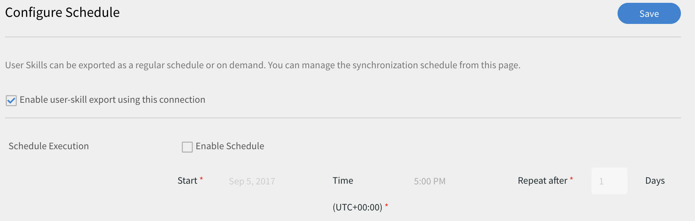

+++

+++使用者技能 — 隨選

您可以指定開始日期，並使用選項匯出報表。 報表將會從輸入的日期擷取到目前為止。 輸入您要開始產生報表的日期，然後按一下執行。

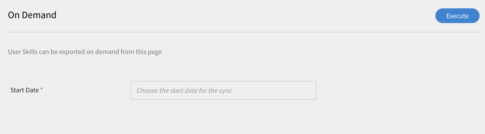

+++

+++使用者技能 — 執行狀態

在這裡，您可以檢視所有任務的摘要並取得其狀態報告。 您可以按一下錯誤報告連結來下載錯誤報告。

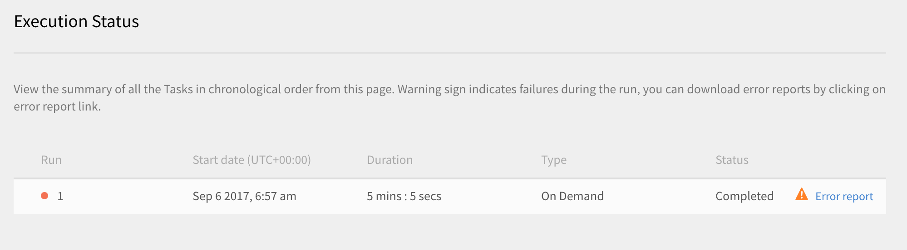

+++

## miniOrange聯結器 {#miniorangeconnector}

使用miniOrange聯結器，您可以整合Learning Manager與miniOrange租使用者，以自動化資料同步。

### 匯入

#### 對應屬性

整合管理員可以選擇miniOrange屬性，並將它們對應至對應的Learning Manager群組屬性。 這是單次性的工作。 完成對應後，後續的使用者匯入會使用相同的對應。 如果管理員想要為匯入使用者設定不同的對應，則可重新設定此對應。

#### 自動匯入使用者

使用者匯入程式可讓Learning Manager管理員從miniOrange擷取員工詳細資訊，並自動將其匯入Learning Manager。

#### 篩選使用者

Learning Manager管理員可在匯入使用者之前對其套用篩選。 例如，Learning Manager管理員可選擇匯入階層中一或多個特定管理員下的所有使用者。

若要設定miniOrange聯結器，請聯絡Learning Manager CSM團隊。

## 設定miniOrange聯結器 {#configureminiorangeconnector}

1. 在Learning Manager首頁中，將滑鼠游標停留在miniOrange卡/縮圖上。 選單出現。 按一下  **[!UICONTROL Connect]** 選單中的選項。

   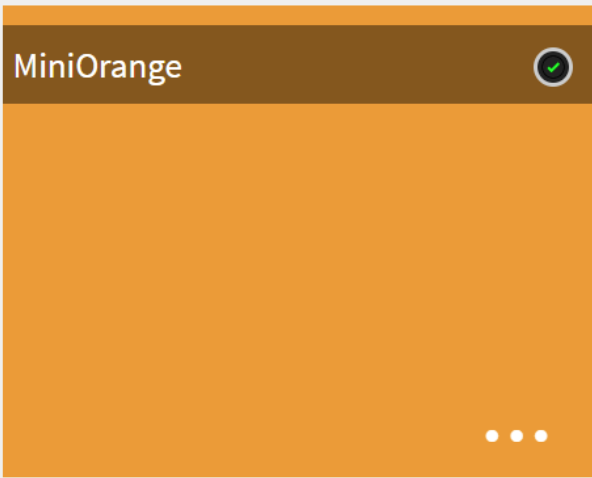

1. 按一下「連線」以建立新連線。 出現miniOrange聯結器頁面。 輸入您要對應的帳戶詳細資料。

   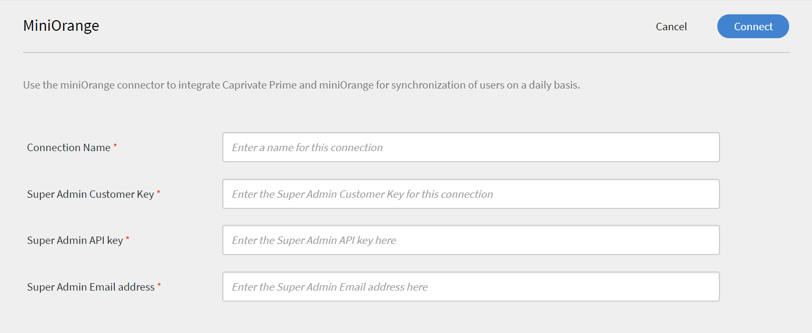

1. 如果您想要直接將miniOrnage使用者匯入為Learning Manager內部使用者，請使用 **[!UICONTROL Import Internal Users]** 選項。

   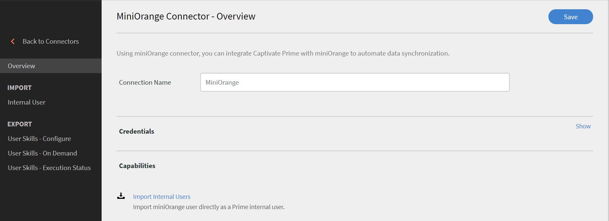

1. 在對映頁面中，左側可看到Learning Manager的欄，右側可看到miniOrnage欄。 選取對應至Learning Manager欄名稱的適當欄名稱。

   

1. 若要以管理員身分檢視和編輯資料來源，請按一下 **[!UICONTROL Settings > Data Source]**.

   將列出已建立的miniOrange來源。 如果您需要編輯篩選器，請按一下 **[!UICONTROL Edit]**.

   

1. 匯入完成後，您將會收到通知。 若要檢視或編輯匯入記錄，請按一下 **[!UICONTROL Users > Import log.]**

### 刪除連線 {#deleteaconnection}

請依照下列步驟刪除已建立的miniOrange連線。

## BlueJeans聯結器 {#bluejeansconnector}

您現在可以將Learning Manager與BlueJeans聯結器整合，並使用BlueJeans來託管課程。 BlueJeans可讓您啟動音訊與視訊電話會議、視訊聊天和網路研討會。

請依照下列步驟設定並使用聯結器。

1. 在Learning Manager首頁中，將滑鼠游標停留在BlueJeans卡片/縮圖上。 選單出現。 按一下  **[!UICONTROL Connect]** 選單中的選項。

   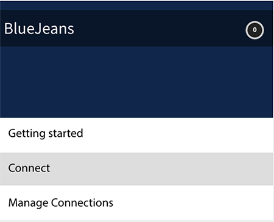

1. BlueJeans聯結器頁面隨即開啟。 在個別欄位中輸入您帳戶的詳細資料，以便整合Learning Manager和BlueJeans來同步使用者摘要。 您可以向BlueJeans帳戶的系統管理員取得詳細資訊。

   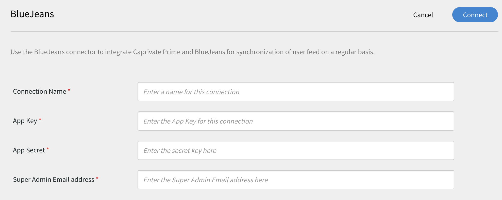

   作為學習者，在啟用聯結器時，請使用與您的Learning Manager帳戶相同的電子郵件ID來啟用使用者傳回Learning Manager的資訊。

1. 建立連線後，以Author身分，建立以BlueJeans作為會議系統的VC課程。

   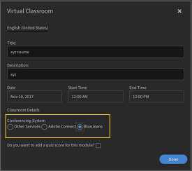

1. 管理員、經理和學習者可將學習者註冊到建立的課程。 註冊後，學習者會收到電子郵件。 學習者可登入其Learning Manager帳戶以檢視方案詳細資料並參加課程。
1. 完成課程後，完成報告會傳送至Learning Manager。 管理員可檢視完成報告，以檢查學習者的出席情況及分數。

   

## 方塊聯結器 {#boxconnector}

使用BOX聯結器，您可以將Learning Manager與任意外部系統整合，以自動化資料同步。 外部系統應該可以匯出CSV格式的資料，並將其放在Learning Manager Box帳戶的適當資料夾中。 方塊聯結器功能如下：

您也可以使用FTP聯結器進行資料移轉、使用者匯入和資料匯出。 如需詳細資訊， [Learning Manager FTP聯結器](third-party-connectors.md#main-pars_header_1427405935)

## 資料匯入 {#DataImport-1}

使用者匯入程式可讓Learning Manager管理員從Learning Manager Box服務擷取員工詳細資訊，並自動將其匯入Learning Manager。 使用此功能，您可以將這些系統產生的CSV放在Box帳戶的適當資料夾中，以整合多個系統。 Learning Manager會挑選CSV檔案、將其合併，並根據排程匯入資料。 如需詳細資訊，請參閱排程功能。

**對應屬性**

整合管理員可以選擇CSV欄，並將它們對應至Learning Manager的群組屬性。 此對應是一次性工作。 完成對應後，後續的使用者匯入會使用相同的對應。如果管理員想要擁有不同的對應來匯入使用者，可以重新設定對應。

## 資料匯出 {#dataexport}

「資料匯出」可讓使用者將使用者技能匯出至Box位置，以便與任何第三方系統整合。

## 排程報表 {#schedulereports}

管理員可以根據組織的需求設定排程任務，且Learning Manager應用程式中的使用者會根據排程瞭解最新狀態。 同樣地，整合管理員可以排程技能匯出，以及時與外部系統整合。 同步可在Learning Manager應用程式中每天執行。

## 設定方塊聯結器 {#configureboxconnector}

瞭解將Learning Manager與Box聯結器整合的程式。

1. 在Learning Manager首頁中，將滑鼠游標停留在Box卡片/縮圖上。 選單出現。 按一下功能表中的「連線」專案。

   

1. 系統會顯示一個對話方塊，提示您輸入電子郵件ID。 提供組織內負責管理Learning Manager Box帳戶人員的電子郵件ID。 提供電子郵件ID後，按一下「連線」 。

1. Learning Manager會傳送電子郵件給您，提醒使用者在第一次存取該方塊前重設密碼。 使用者必須重設密碼，並使用此密碼存取Learning Manager Box帳戶。

   只能為特定Learning Manager帳戶建立一個Learning Manager Box帳戶。

   在總覽頁面中，您可以指定整合的連線名稱。 從下列選項中選擇您要採取的動作：

   * 匯入內部使用者
   * 匯出使用者技能 — 設定排程
   * 匯出使用者技能 — 隨選

## 匯入

+++內部使用者

匯入內部使用者選項可讓您排程自動產生使用者匯入報告。 產生的報表會以.CSV檔案傳送給您。

+++

+++對應屬性

成功建立連線後，您可以將放入Box資料夾的CSV檔案欄對應至Learning Manager的對應屬性。 此步驟為必要步驟。

1. 在「對應屬性」頁面的左側，您可以看到Learning Manager的預期欄，而右側，您可以看到CSV欄名稱。 最初，您可以在右側看到一個空白的選取方塊。 按一下「選擇檔案」匯入任何範本CSV。

1. 上述步驟會在右側的「選取」下拉式清單中填入所有CSV欄名稱。 選取對應至Learning Manager欄名稱的適當欄名稱。

   *[管理員]欄位必須對應到電子郵件地址型別的欄位。 必須先對應所有欄，才能使用聯結器。*

1. 完成對應後，按一下「儲存」 。

   聯結器現已準備就緒，可供使用。 剛設定的帳戶現在會在管理員應用程式中顯示為資料來源，供管理員排程匯入或隨選同步。

+++

+++使用Learning Manager方塊聯結器

1. 來自外部系統的CSV檔案應放置在下列路徑中：

   `code $OPERATION$/$OBJECT_TYPE$/$SUB_OBJECT_TYPE$/data.csv`

   **注意：** 在2016年7月版本中，僅允許匯入使用者。 因此，若要使用「方塊」聯結器，您必須確定CSV檔案是放置在下列資料夾中：\
   `code Home/import/user/internal/*.csv`

1. Box聯結器會擷取CSV檔案中的所有列，因此重要的是，一個CSV中對應到使用者的列不會出現在任何其他CSV中。
1. 所有CSV都應該包含對應中指定的欄。
1. 在程式開始之前，所有必要的CSV都應該出現在資料夾中。

將使用者匯入Learning Manager時，管理員還需要瞭解如何在Learning Manager中管理使用者。 請參閱 [使用者管理說明](../integration-admin/feature-summary/migration-manual.md#usermanagement) 以瞭解更多資訊。

+++

## 匯出

+++Skills

匯出使用者技能報告有兩個選項。

使用者技能 — 隨選：您可以指定開始日期，並使用選項匯出報表。報表會從輸入的日期擷取到目前為止

**[!UICONTROL User Skills - Configure]**：此選項可讓您排程報表的擷取。 選取「啟用排程」核取方塊，並指定開始日期和時間。 您也可以指定產生和傳送報告的間隔。

+++

若要開啟Export資料夾（匯出的檔案將放置在Box位置中），請開啟「使用者技能」頁面中提供的Box資料夾連結，如下所示。

自動匯出的檔案會出現在位置中 **首頁/匯出/&#42;Box_location&#42;**

自動匯出的檔案將以下列標題提供： **skill_achieves_&#42;起始日期&#x200B;&#42;_至_&#42;結束日期&#42;.csv**

Learning Manager團隊共用的Box資料夾中的存取許可權和內容應由客戶管理。  另請注意，資料夾中的內容將會實際儲存在法蘭克福地區。

## LinkedInLearning聯結器 {#linkedinlearningconnector}

LinkedIn.com的企業客戶可使用LinkedInLearning聯結器，讓他們的學習者從Learning Manager中探索和使用課程。 聯結器可設定為定期使用您的API金鑰擷取課程。 在Learning Manager中建立課程後，使用者可以搜尋課程並加以使用。 然後可以在Learning Manager中追蹤學習者進度。

### 設定LinkedIn聯結器 {#configurelinkedinconnector}

1. 在整合式管理員控制面板中，按一下LinkedInLearning。

   您將會看到包含三個選項的圖磚：快速入門、連線及管理連線。

1. 如果您是第一次設定LinkedInLearning聯結器，請按一下「連線」。

   在設定此聯結器之前，必須先設定Exavault FTP帳戶。

1. 從連線頁面，指定聯結器的名稱。 輸入連線的Appkey和Secret金鑰。

   您必須聯絡您的廠商以取得Appkey和秘密金鑰。

1. 按一下「儲存」。

   會儲存設定並新增您帳戶的LinkedInLearning連線。 您現在可以從首頁按一下管理連線，並隨時編輯您的設定。

1. 如果已建立連線，請按一下[管理連線]檢視所有連線。

   在您設定此聯結器之前，必須為您的帳戶啟用移轉功能。

1. 按一下您要編輯的連線。
1. 從左窗格中，按一下「設定」。 執行下列任一項作業：

   * 從此視窗檢視或編輯您帳戶的詳細資訊以及同步處理排程。 若要啟用此帳戶，您必須選取[啟用連線]核取方塊。
   * 按一下編輯並編輯您的認證。 按一下「重設」以復原此欄位的更新。
   * 按一下啟用排程來排程您的同步化。 您可以輸入開始時間與日期，然後輸入同步化排程的頻率（以天為單位）。 例如，每3天啟用一次同步處理。

   按一下「儲存」以儲存變更。

1. 從左窗格中，按一下「隨選執行」。 此選項可讓您從LinkedIn匯入使用者摘要和其他相關資料。 輸入隨選執行的「開始日期」，然後按一下「執行」以執行同步化。 從開始日期起直到現在的所有資料都會匯入。

   * 在執行期間，您可以按一下「停用對Learning Manager的存取」 ，其中應用程式會在同步期間停機。
   * 如果您在執行期間按一下「啟用對Learning Manager的存取權」，同步期間服務不會中斷。

1. 您也可以隨時從左側窗格按一下「執行狀態」，以時間順序檢視此聯結器的所有執行摘要。 您可以檢視同步化的開始日期和持續時間、同步化的型別（無論是隨選同步化）以及同步化的狀態（無論是正在進行中還是已完成）。

   當您刪除並重新建立連線時，會再次出現聯結器的先前執行。 您可以在刪除連線之前檢視所有執行。

   您只能對最新的同步處理執行重新執行。

