# 學習管理連結器

學習如何利用連接器將 Salesforce 與 Learning Manager 整合，如何將 FTP 與 Learning Manager 整合，並透過 FTP 連接器自動上傳 CSV。

企業還有其他應用程式和系統，可能需要與 Learning Manager 整合。 連接器是協助執行基於資料整合的工具，例如從外部系統將資料匯入 Learning Manager，或從 Learning Manager 匯出資料至外部系統。 在 2016 年 7 月的版本中，連接器僅具備從外部系統批量匯入 Learning Manager 使用者的能力。

Learning Manager 提供 Salesforce 和 FTP 連接器。 透過 Salesforce 連接器，整合 組織管理員可以將 Salesforce 應用程式與 Learning Manager 整合。 作為整合商，你也可以使用 FTP 連接器自動匯入一組使用者到你的企業應用程式。

Learning Manager 也提供 Lynda、getAbstract 及 Harvard Management System 連接器，讓學習者能存取並使用來自 Lynda.com、getAbstract 及 Harvard ManageMentor 的課程。

繼續閱讀，了解如何在 Learning Manager 中配置和使用這些連接器。

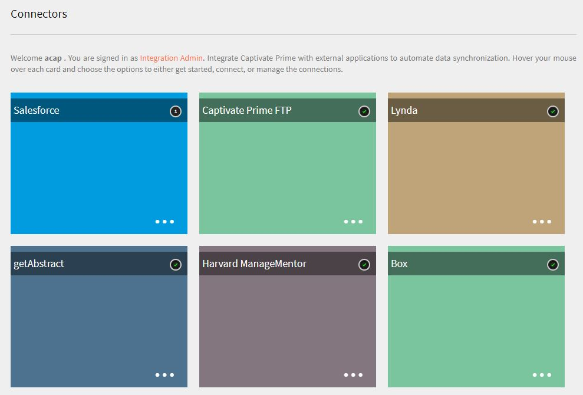

## Salesforce 連接器 {#sfconnector}

Salesforce 連接器連接 Learning Manager 與 Salesforce 帳號，以自動化資料同步。 Salesforce 連接器的功能如下：

### 地圖屬性

整合管理員可以選擇 Salesforce 欄位，並將其映射到對應的學習管理員可分組屬性。 這是一次性的努力。 映射完成後，後續使用者匯入會使用相同的映射。 如果管理員想要不同的匯入映射，也可以重新設定。

### 自動使用者匯入

使用者匯入流程允許 Learning Manager 管理員從 Salesforce 取得員工資料並自動匯入 Learning Manager。 這種自動化避免了手動建立 CSV 並上傳到 Learning Manager 的繁瑣工作。

### 自動排程

使用自動排程功能搭配自動使用者匯入功能會很有效。 學習經理管理員可依組織需求設定排程。 學習管理員應用程式中的使用者可依照排程隨時掌握最新資訊。 同步可在 Learning Manager 應用程式中每日執行。

### 篩選使用者

Learning Manager 管理員可以在匯入使用者前對使用者套用過濾。 例如，學習管理員管理員可以選擇將階層中所有使用者匯入一個或多個特定管理員。

## 配置 Salesforce 連接器 {#configuresalesforceconnector}

了解整合 Learning Manager 與 Salesforce 的流程。

### 先決條件 {#prerequisites}

務必攜帶您的 Salesforce 組織網址。 例如，如果你的組織名稱是 **myorg，Salesforce** 網址可以是 [https://myorg.salesforce.com](https://myorg.salesforce.com/)。 這是唯一需要輸入的，才能將 Salesforce 帳號與 Learning Manager 連結。

同時也要確保你有正確的登入帳號憑證。

## 建立連結 {#createaconnection}

1. 在 Learning Manager 首頁，將滑鼠移到 Salesforce 卡片/縮圖上。 選單出現了。 在選單中點選 **[!UICONTROL Connect]** 項目。

   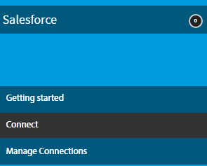

1. 會出現一個對話框，提示你輸入組織網址。 提供網址後點擊 **[!UICONTROL Connect]** 。
1. 成功連線後，會出現上層頁面。

## 地圖屬性 {#mapattributes}

一旦成功建立連線，你可以將 Salesforce 欄位映射到 Learning Manager 的相應屬性。 此步驟是強制步驟。

1. 在地圖頁面，左側可以看到學習管理員的欄位，右側則是 Salesforce 欄位。 選擇對應學習管理器欄位名稱的適當欄位名稱。

   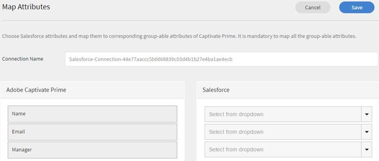

   學習管理員左側的欄位資料是從活動欄位擷取的。 **管理器**&#x200B;欄位必須對應到一個欄位，電子郵件地址。在使用連接器之前，必須對所有柱子進行映射。

1. 完成地圖後點擊 **[!UICONTROL Save]** 。
1. 接頭現在已經準備好可以使用了。 現在已設定的帳號會以管理員應用程式的資料來源形式出現，管理員可以排程匯入或按需同步。

## 使用 Salesforce 連接器 {#usingsalesforceconnector}

Salesforce 連接器會連接到 Salesforce.com，取得設定中的使用者並加入學習管理員。

## Learning Manager FTP 連接器 {#ftpconnector}

透過 FTP 連接器，你可以將學習管理員與任意外部系統整合，以自動化資料同步。 預期外部系統能以 CSV 格式匯出資料，並將其放入 Learning Manager FTP 帳號的適當資料夾中。 FTP 連接器的功能如下：

你也可以使用 Box 連接器進行資料遷移、使用者匯入和匯出資料。 更多資訊請參見 [盒子連接器。](third-party-connectors.md#main-pars_header_302653946)

## 資料匯入 {#dataimport}

使用者匯入流程允許學習管理員管理員從學習管理員的 FTP 服務中取得員工資料，並自動匯入學習管理員。 利用此功能，您可以將這些系統產生的 CSV 放入 FTP 帳戶的適當資料夾中，整合多個系統。 Learning Manager 會擷取 CSV 檔案，合併後依照排程匯入資料。 請參閱排程功能以獲得更多資訊。

**地圖屬性**

整合管理員可以選擇 CSV 的欄位，並將其映射到 Learning Manager 可分組的屬性。 這次地圖製作是一次性的努力。 映射完成後，後續的使用者匯入也會使用相同的映射。如果管理員想要不同的匯入使用者映射，也可以重新設定映射。

## 匯出資料 {#exportdata}

資料匯出功能允許使用者將技能匯出至FTP地點，以便整合至任何第三方系統。

## 排程 {#scheduling}

管理員可依組織需求設定排程任務，且學習管理軟體中的使用者會依照排程保持最新狀態。 同樣地，整合管理員也能及時排程技能匯出，並與外部系統整合。 同步可在 Learning Manager 應用程式中每日執行。

## 配置學習管理員 FTP 連接器 {#configurecaptivateprimeftpconnector}

學習整合 Learning Manager 與 FTP 連接器的流程。

### 建立連結 {#Createaconnection-1}

1. 在 Learning Manager 首頁，將滑鼠移到 FTP 卡片/縮圖上。 選單出現了。 在選單中點選 **[!UICONTROL Connect]** 項目。

   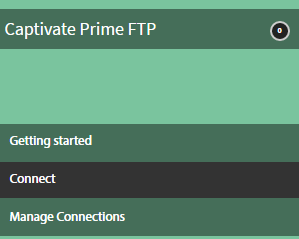

1. 會跳出一個對話框，提示你輸入電子郵件 ID。 提供負責管理該組織學習管理 FTP 帳戶的人員的電子郵件 ID。 提供電子郵件後點擊 **[!UICONTROL Connect]** 。
1. Learning Manager 會寄送電子郵件，提示使用者在首次存取 FTP 前重設密碼。 使用者必須重置密碼，並使用此密碼才能存取 Learning Manager 的 FTP 帳號。

   同一學習管理員帳號只能建立一個 Learning Manager 的 FTP 帳號。

   在概覽頁面，你可以指定整合的連線名稱。 從以下選項中選擇您想採取的行動：

   * 匯入內部使用者
   * 匯出使用者技能 - 設定排程
   * 匯出使用者技能 - 隨選

   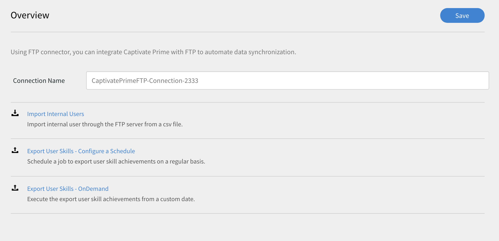

## 進口

+++內部使用者

匯入內部使用者選項允許你自動排程產生使用者匯入報告。 產生的報告會以 .CSV 檔案的形式傳送給你。

+++

+++地圖屬性

連線成功建立後，你可以將 CSV 檔案欄位映射到 FTP 資料夾中的對應屬性。 此步驟是強制步驟。

1. 在地圖屬性頁面，左側可以看到學習管理員預期的欄位，右側則可以看到 CSV 欄位名稱。 一開始，在右側你會看到一個空白的選擇框。 透過點選 **檔案**&#x200B;匯入任何範本 CSV。
1. 上述步驟會將所有 CSV 欄位名稱填滿右側的下拉選單。 選擇對應學習管理器欄位名稱的適當欄位名稱。

   *管理者欄位必須對應到某個欄位，電子郵件地址。 在使用連接器之前，必須對所有柱子進行映射。*

1. 完成地圖後點擊 **[!UICONTROL Save]** 。

   接頭現在已經準備好可以使用了。 剛設定的帳號現在會以資料來源出現在管理員應用程式中，供管理員排程匯入或按需同步。

+++

+++使用 Learning Manager FTP 連接器

1. 外部系統的 CSV 檔案應放在以下路徑：

   `code $OPERATION$/$OBJECT_TYPE$/$SUB_OBJECT_TYPE$/data.csv`

   **注意：** 在 2016 年 7 月的版本中，僅允許匯入使用者。 因此，使用 FTP 連接器時，必須確保 CSV 檔案放在以下資料夾中：

   `code Home/import/user/internal/*.csv`

1. FTP 連接器會從 CSV 檔案中擷取所有資料列，因此重要的是，某個 CSV 中對應的使用者資料列不會出現在其他 CSV 檔案中。
1. 所有 CSV 都應該包含映射中指定的欄位。
1. 所有必要的 CSV 檔案應該在流程開始前就已在資料夾中。

在將使用者匯入 Learning Manager 時，管理員也需要了解使用者在 Learning Manager 中如何管理。 請參閱使用者管理說明[&#128279;](../integration-admin/feature-summary/migration-manual.md#usermanagement)以獲取更多資訊。

+++

## 出口

+++技能

有兩種匯出使用者技能報告的選項。

**[!UICONTROL User Skills - On Demand]**：你可以指定開始日期並使用選項匯出報告。報告將從輸入日期擷取到現在。

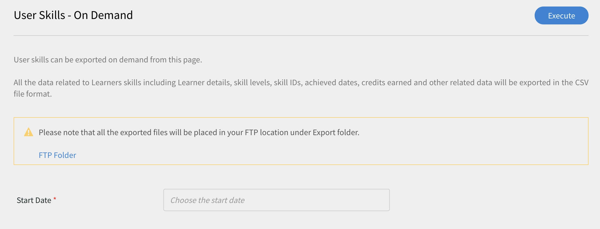

**[!UICONTROL User Skills - Configure]**：此選項允許您排程擷取報告。 選擇啟用排程勾選框，並指定開始日期與時間。 你也可以指定想要產生和傳送報告的間隔。

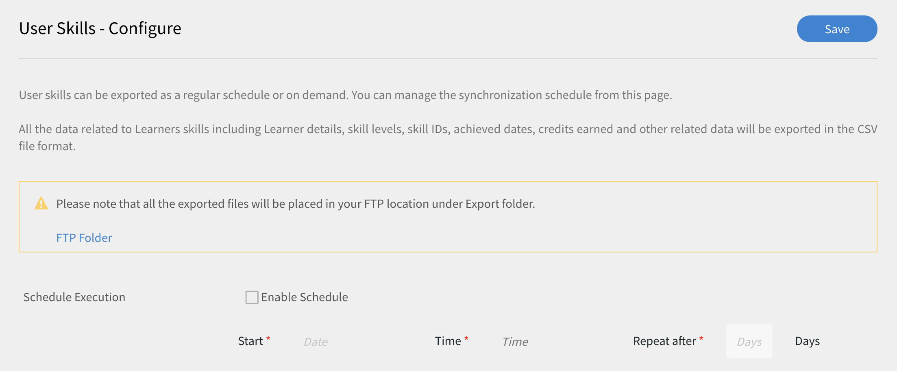

+++

要開啟匯出檔案將放置於 FTP 位置的匯出資料夾，請如下方所示，開啟使用者技能頁面中提供的 FTP 資料夾連結。

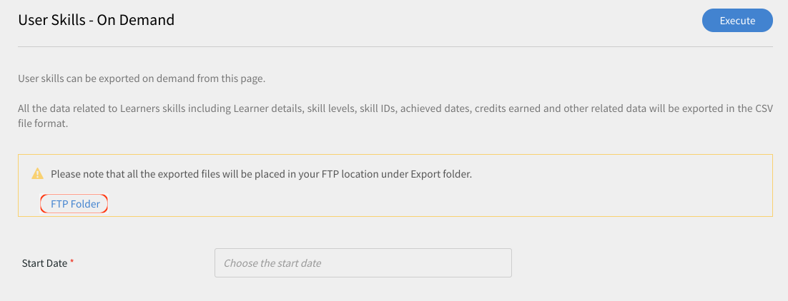

自動匯出的檔案會出現在 **Home/export/&#42;FTP_location&#42;**

自動匯出的檔案會顯示標題為&#x200B;**skill_achievements_&#42;日期&#x200B;_&#42;&#42;_至日期&#42;.csv**

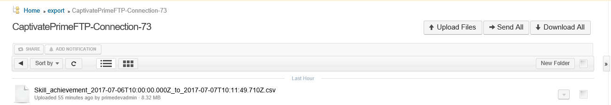

## Lynda 連接器 {#lyndaconnector}

Lynda 連接器可供企業客戶使用 Lynda.com 希望學生能在 Learning Manager 中發現並學習 Lynda 課程。 連接器可以設定成定期用 API 金鑰從 Lynda.com 抓取課程。 課程在學習管理員中建立後，使用者可以搜尋並使用課程。 學習者的進度可以在學習管理員中追蹤。

### 配置 Lynda 連接器 {#configurethelyndaconnector}

1. 在整合管理儀表板中，點選 Lynda。

   你會看到這個圖塊有三個選項：開始、連接和管理。

1. 如果您是第一次設定 Lynda 連接器，請點擊「連接」。

   你必須先先設定 Exavault FTP 帳號，才能設定這個連接器。

1. 在連接頁面，指定你的連接器名稱。 輸入 Appkey 和 Secret key，即可連接連線。

   你必須聯絡你的供應商才能取得 Appkey 和 Secret key。

1. 點擊儲存。

   設定會被保存，並且你的帳號會新增 Lynda 連線。 你現在可以從首頁點選「管理連線」，隨時編輯你的設定。

1. 如果你已經建立了連線，請點選「管理連線」，查看所有連線。

   在設定這個連接器之前，必須先啟用您的帳號遷移功能。

1. 點擊你想編輯的連結。
1. 從左側窗格點選「設定」。 請做以下其中一項：

   * 在此視窗查看或編輯您的帳戶詳細資訊及同步排程。 如果你想啟用此帳號，必須勾選啟用連線的勾選框。
   * 點擊編輯並編輯你的帳號。 點擊重置以撤銷你對此欄位的更新。
   * 點擊啟用排程以排程同步。 你可以輸入開始時間和日期，然後輸入以天為單位的同步頻率。 例如，每三天啟用一次同步。

   點擊儲存以儲存您的更改。

   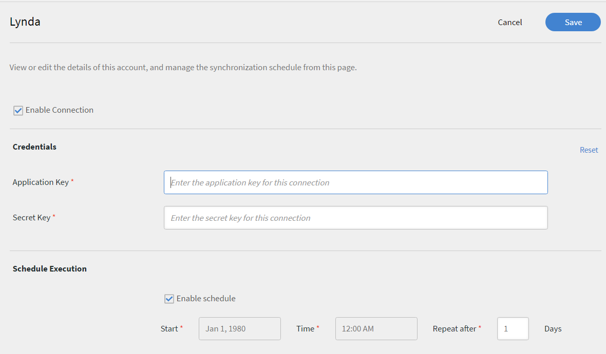

1. 從左側窗格點選「隨需執行」。 此選項允許您匯入 Lynda 的用戶動態及其他相關資料。 輸入按需執行的開始日期，並點擊執行以執行同步。 從起始日期到現在的所有資料都會匯入。

   * 你可以在執行時點選「停用 Learning Manager 存取權」，這樣應用程式在同步期間會有停機。
   * 如果你在執行時點選「啟用學習管理員存取」，同步過程中服務不會中斷。

   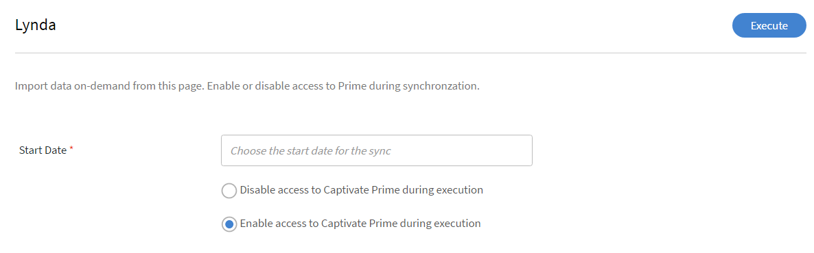

1. 你也可以隨時從左側面板點擊「執行狀態」，以時間順序查看此連接器所有運行的摘要。 您可以查看同步的開始日期與持續時間、同步類型（是否為按需同步）以及同步狀態（同步進行中或已完成）。

   當你刪除並重新建立連線時，之前針對連接器的執行會重新出現。 你可以查看刪除連線前的所有跑動紀錄。

   你只能重播以取得最新的同步。

   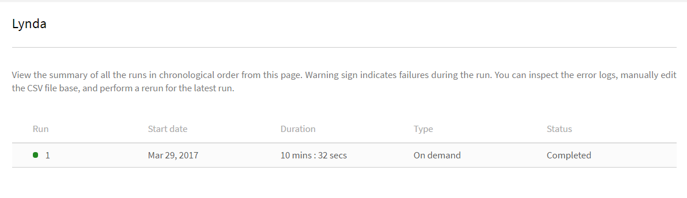

## getAbstract connector {#getabstractconnector}

getAbstract 連接器可供企業客戶使用 getAbstract.com，他們希望學生能發現並使用 getAbstract 摘要。 連接器可設定為定期擷取使用資料，根據學習管理員中建立的學習者完成紀錄。 繼續閱讀，了解如何在 Learning Manager 中設定這個連接器。

### 設定 getAbstract 連接器 {#configurethegetabstractconnector}

1. 從整合管理儀表板，點選 getAbstract。

   從圖塊中，你會看到三個選項：開始使用、連接和管理連接。

1. 如果你是第一次設定 getAbstract 連接器，請點擊 Connect。

   你必須先先設定 Exavault FTP 帳號，才能設定這個連接器。

   請確保你將此 FTP 憑證分享給你的內容提供者，以便存取這些串流。

1. 在「連線名稱」欄位輸入你的連線名稱。

   請在 Client ID 和 Client Secret 欄位輸入相應的金鑰。 你可能需要聯絡你的供應商，取得這個接頭所需的鑰匙。

   這些金鑰是取得客戶端所使用的課程元資料所必需的。

1. 如果你已經建立了連線，從首頁點選 getAbstract > 管理連線即可檢視並編輯你現有的設定。

   在設定這個連接器之前，必須先啟用您的帳號遷移功能。

1. 點擊你想查看或編輯設定的連線。

   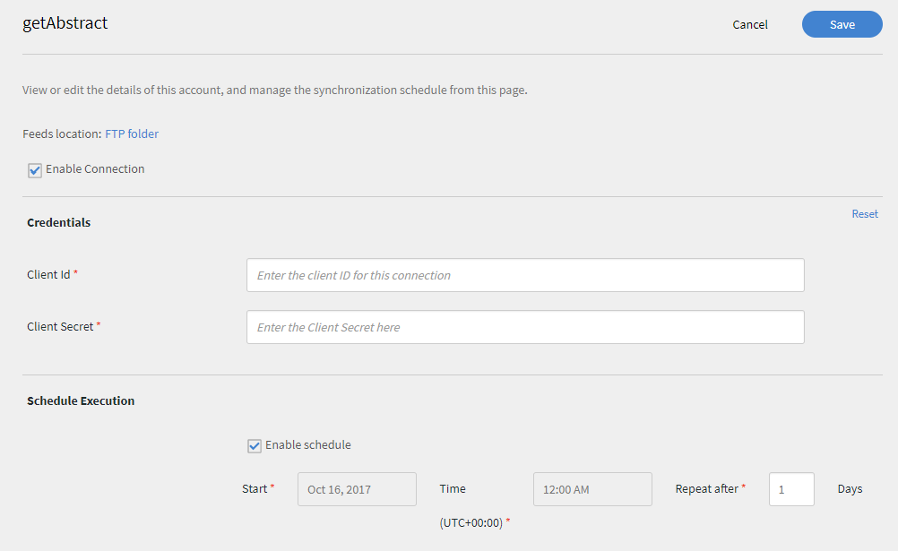

1. 從左側窗格點選「設定」。 請做以下其中一項：

   * 在此視窗查看或編輯您的帳戶詳細資訊及同步排程。 如果你想啟用此帳號，必須勾選啟用連線的勾選框。
   * 點擊編輯並編輯你的帳號。 點擊重置以撤銷你對此欄位的更新。
   * 點擊啟用排程以排程同步。 你可以輸入開始時間和日期，然後輸入以天為單位的同步頻率。 例如，每三天啟用一次同步。

1. 點擊儲存。

   設定會被儲存，並新增你的帳號 getAbstract 連線。

1. 從左側窗格點選「隨需執行」。 這個選項允許你匯入 getAbstract 中的用戶訂閱和其他相關資料。 輸入按需執行的開始日期，並點擊執行以執行同步。 從起始日期到現在的所有資料都會匯入。

   * 你可以在執行時點選「停用 Learning Manager 存取權」，這樣應用程式在同步期間會有停機。
   * 如果你在執行時點選「啟用學習管理員存取」，同步過程中服務不會中斷。

1. 你也可以隨時從左側面板點擊「執行狀態」，以時間順序查看此連接器所有運行的摘要。 您可以查看同步的開始日期與持續時間、同步類型（是否為按需同步）以及同步狀態（同步進行中或已完成）。

   當你刪除並重新建立連線時，之前針對連接器的執行會重新出現。 你可以查看刪除連線前的所有跑動紀錄。

   你只能重播以取得最新的同步。

   要讓任何類型的同步運作，你必須確保使用者訂閱源存在於 getAbstract FTP 資料夾中，且日期符合同步時指定的日期。

   請參考以下 Excel 表格，這是 getAbbtract 的範例用戶資料檔案。 檔案名稱應遵循格式：**report_export_yyyy_MM_dd_HHmmss.xlsx** 或 **report_export_yyyy_MM_dd.xlsx**。
   [getAbstract 用戶訂閱範例 Excel 表格](assets/report-export-20170401175342.xlsx)

## 哈佛 ManageMentor 連接器 {#hmmconnector}

Harvard ManageMentor 連接器可供企業用戶使用 Harvard ManageMentor，他們希望學習者能發現並使用哈佛 ManageMentor 課程。 該連接器有助於在 Learning Manager 內建立課程，並可設定為定期擷取學習者進度資料。 要配置此連接器，請執行以下程序：

### 設定 Harvard ManagerMentor 連接器 {#configuretheharvardmanagermentorconnector}

1. 從整合管理儀表板中，點選 Harvard ManageMentor。

   從圖塊中，你會看到三個選項：開始使用、連接和管理連接。

1. 如果您是第一次設定 Harvard ManageMentor 連接器，請點擊「連接」。

   你也必須先設定 Exavault FTP 帳號，才能設定這個連接器。

   請確保你將此 FTP 憑證分享給你的內容提供者，以便存取這些串流。

1. 在「連線名稱」欄位，輸入你的連線名稱。 點擊連接以儲存此連線。
1. 如果您已經建立了連結，請在首頁點擊 Harvard ManageMentor > 管理連結。 點擊你想編輯的連線來編輯你現有的設定。

   在設定這個連接器之前，必須先啟用您的帳號遷移功能。

   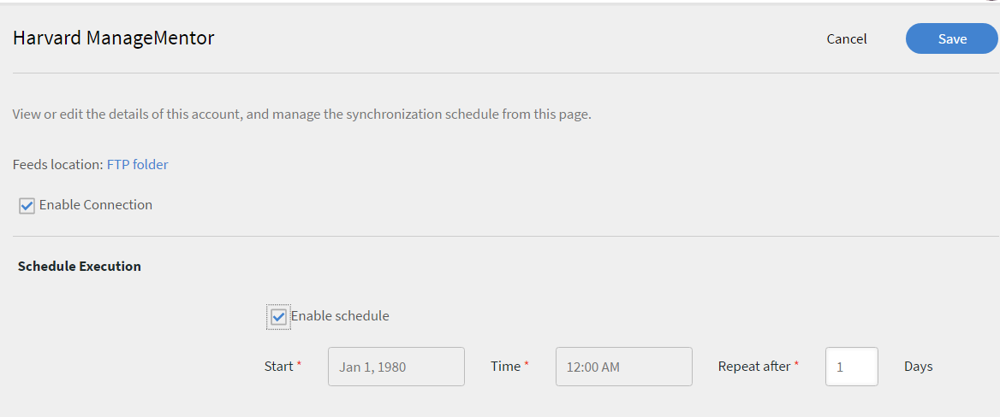

1. 從左側窗格點選「設定」。 請做以下其中一項：

   * 在此視窗查看或編輯您的帳戶詳細資訊及同步排程。 如果你想啟用此帳號，必須勾選啟用連線的勾選框。
   * 點擊啟用排程以排程同步。 你可以輸入開始時間和日期，然後輸入以天為單位的同步頻率。 例如，每三天啟用一次同步。

1. 從左側窗格點選「隨需執行」。 此選項允許您匯入 Harvard ManageMentor 的用戶訂閱及其他相關資料。 輸入按需執行的開始日期，並點擊執行以執行同步。 從起始日期到現在的所有資料都會匯入此連線。

   * 你可以在執行時點選「停用 Learning Manager 存取權」，這樣應用程式在同步期間會有停機。
   * 如果你在執行時點選「啟用學習管理員存取」，同步過程中服務不會中斷。

   如果你想每隔幾天自動同步一次，請在重複天數欄位中指定天數。 同步確保您的帳戶已更新至哈佛 ManageMentor 的摘要與摘要最新版本。

1. 你也可以隨時從左側面板點擊「執行狀態」，以時間順序查看此連接器所有運行的摘要。 您可以查看同步的開始日期與持續時間、同步類型（是否為按需同步）以及同步狀態（同步進行中或已完成）。

   當你刪除並重新建立連線時，之前針對連接器的執行會重新出現。 你可以查看刪除連線前的所有跑動紀錄。

   你只能重播以取得最新的同步。

   為了成功同步，您必須確保 Harvard ManageMentor FTP 資料夾中至少有一個檔案存在：

   hmm12_metadata.xlsx：此檔案提供哈佛 ManageMentor 連接器的課程元資料。 上傳檔案時，請確保遵循命名規則。

   client_hmm12_20150125.xlsx：這是哈佛 ManageMentor 連接器的使用者動態。 你必須遵守的檔案命名規則是 **client_hmm12_yyyyMMdd.xlsx。**

   請參考以下兩個使用者動態與課程動態範例檔案：
   [哈佛 ManageMentor 連接器](assets/hmm12-metadata.xlsx) [的課程元資料檔案 哈佛 ManageMentor 連接器的使用者資訊流](assets/client-hmm12-20170304.xlsx)

## Workday 連接器 {#workdayconnector}

透過 Workday 連接器，你可以將 Learning Manager 與 Workday 租戶整合，自動化資料同步。

### 進口

#### 地圖屬性

整合管理員可以選擇 Workday 欄位，並將其映射到對應的學習管理器可分組屬性。 這只是一次性的努力。 映射完成後，後續使用者匯入會使用相同的映射。 如果管理員想要不同的匯入映射，也可以重新設定。

#### 自動使用者匯入

使用者匯入流程允許學習經理管理員自動從 Workday 取得員工資料並匯入學習管理員。

#### 篩選使用者

Learning Manager 管理員可以在匯入使用者前對使用者套用篩選。 例如，學習管理員管理員可以選擇將階層中所有使用者匯入一個或多個特定管理員。

## 出口

使用者技能匯出功能允許使用者自動匯出使用者技能到 Workday。

多個 Learning Manager 帳號的技能無法同時用同一個 Workday 帳號匯出。

## 排程 {#Scheduling-1}

管理員可依組織需求設定排程任務，且學習管理軟體中的使用者會依照排程保持最新狀態。 同樣地，整合管理員也能及時排程技能匯出，並與外部系統整合。 同步可在 Learning Manager 應用程式中每日執行。

## 配置 Workday 連接器 {#configureworkdayconnector}

**前置條件**：請您組織的 Workday 管理員建立一個整合系統使用者（ISU），並依照ISU_Permissions文件所定義的權限。 請從下方連結下載副本。
[下載整合系統使用者（ISU）安全資料。](assets/isu-permissions-v1.pdf) 了解整合 Learning Manager 與 Workday Connector 的流程。

1. 在學習管理員首頁，將滑鼠移到Workday圖塊上。 選單出現了。 在選單中點選 **[!UICONTROL Connect]** 項目。

   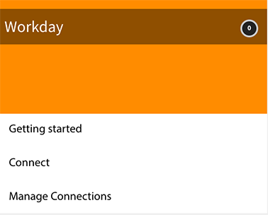

1. 會出現一個對話框，提示你輸入新連線的憑證。 以下是你需要在建立連結前輸入的欄位。

   * 連接名稱：依照您的偏好提供連接名稱。
   * 主機網址：整合管理員可以從對應的 Workday 管理員取得主機網址的詳細資訊。
   * 租戶：租戶是你公司內部的。 你的 Workday 管理員會提供租戶資料。
   * 使用者名稱與密碼：Workday 管理員建立一個具備必要安全權限的整合系統使用者（ISU），並與整合管理員分享。

   注意：Learning Manager 使用 Workday API 28.1 版本。

   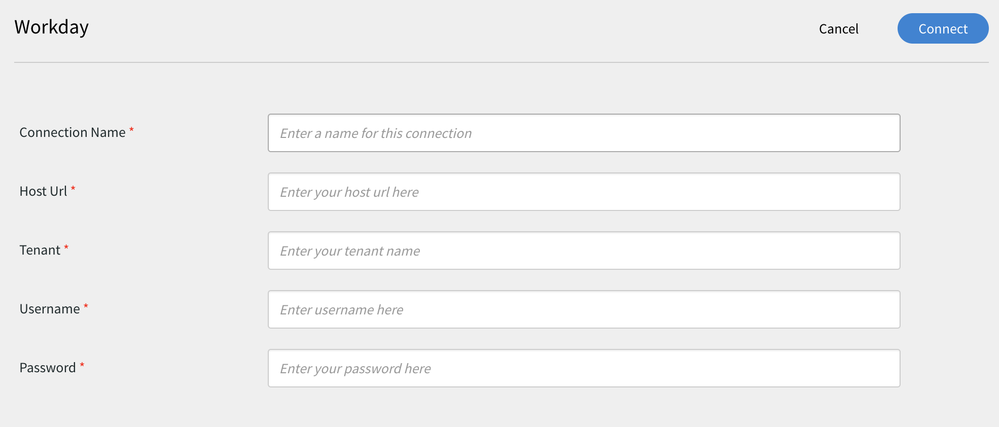

1. 輸入所有相關欄位後，點擊「連結」。

   你也可以讓多個 Workday 連線同步到你的學習管理員帳號。

在概覽頁面，你可以指定整合的連線名稱。 從以下選項中選擇您想採取的行動：

* 匯入內部使用者
* 匯出使用者技能 - 設定排程
* 匯出使用者技能 - 隨選

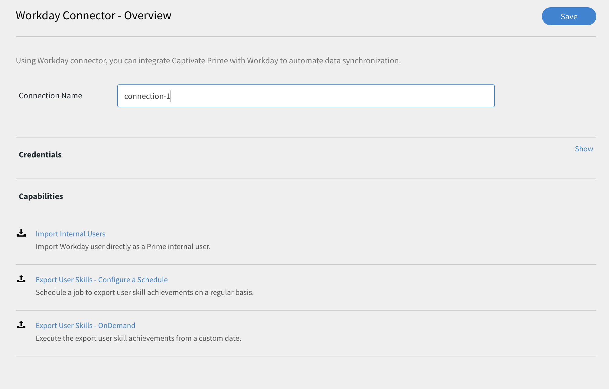

## 進口

### 地圖屬性 {#MapAttributes-1}

你可以使用 Workday 連接器整合 Learning Manager，並用 Workday 來自動化資料同步。 你可以將所有活躍使用者從 Workday 匯入到 Learning Manager。 使用者可從包括 FTP 和 Salesforce 在內的多種資料來源匯入。

Learning Manager 和 Workday 的使用者屬性需要先映射，才能匯入使用者。 在概覽頁面，使用匯入下的內部使用者選項提供地圖屬性。

在 Adobe Learning Manager 欄位輸入 Adobe Learning Manager 憑證。 請使用下拉選單選擇 Workday 欄位的正確憑證。

目前，Learning Manager 支援從 Workday 匯入 44 個使用者屬性。 使用 Learning Manager 的 Active Fields 新增屬性。

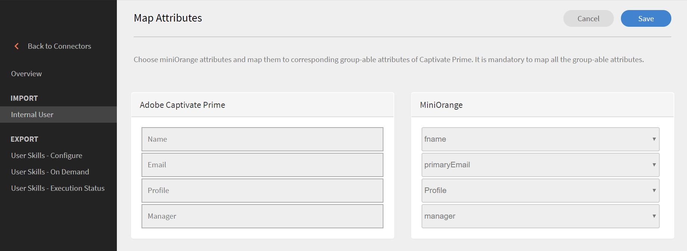

Workday 有四層級的階層結構，而 Learning Manager 有兩層。 Workday 的四個等級分別是技能檔案類別、技能檔案、技能物品類別和技能物品。 你的技能名稱和 Learning Manager 的等級會一起映射到 Workday 的技能項目下。

+++支援的 Workday 屬性列表

WD:User_ID\
WD:Worker_ID\
WDD:Personal_Data。WDD:Name_Data。WDD:Preferred_Name_Data。WD:Name_Detail_Data.@wd:Formatted_Name\
WDD:Personal_Data。WDD:Name_Data。WDD:Legal_Name_Data。WD:Name_Detail_Data.@wd:Formatted_Name\
WD.WD.WD.WD.WD.WD.WD:Personal_Data:Name_Data:Legal_Name_Data:Name_Detail_Data:Prefix_Data:Title_Descriptor\
WD.WD.WD.WD.WD.WD.WD:Personal_Data:Name_Data:Preferred_Name_Data:Name_Detail_Data:Prefix_Data:Title_Descriptor\
WD.WD.WD.WD.WD.WD:Personal_Data:Name_Data:Preferred_Name_Data:Name_Detail_Data:First_Name\
WD.WD.WD.WD.WD.WD:Personal_Data:Name_Data:Preferred_Name_Data:Name_Detail_Data:Last_Name\
WD.WD.WD.WD.WD.WD:Personal_Data:Name_Data:Legal_Name_Data:Name_Detail_Data:First_Name\
WD.WD.WD.WD.WD.WD:Personal_Data:Name_Data:Legal_Name_Data:Name_Detail_Data:Last_Name\
WDD:Personal_Data。WDD:Contact_Data。WD:Address_Data.0.@wd:Formatted_Address\
WD.WD.WD.0.wd:Personal_Data:Contact_Data:Address_Data:Postal_Code\
WD.WD.WD.0.wd:Personal_Data:Contact_Data:Address_Data:Country_Region_Descriptor\
WDD:Personal_Data。WDD:Contact_Data。WD:Phone_Data.0.@wd:Formatted_Phone\
WD.WD.WD.0.wd:Personal_Data:Contact_Data:Phone_Data:Country_ISO_Code\
WD.WD.WD.0.wd:Personal_Data:Contact_Data:Phone_Data:International_Phone_Code\
WD.WD.WD.0.wd:Personal_Data:Contact_Data:Phone_Data:Phone_Number\
WD.WD.WD.1:Personal_Data:Primary_Nationality_Reference:ID.$\
WD.WD.WD.1:Personal_Data:Gender_Reference:ID.$\
WDD.WDD.0.WD.WDD:Personal_Data:Identification_Data:National_ID:National_ID_Data:ID\
WDD.WDD.0.WD.WDD:Personal_Data:Identification_Data:Custom_ID:Custom_ID_Data:ID\
WD.WD.WD.1:User_Account_Data:Default_Display_Language_Reference:ID.$\
WD.WDD.WD.0.wd.wd.1:Role_Data:Organization_Role_Reference:Organization_Role_Data:Organization_Role:ID.$\
WDD.WD.0.WD.WDD:Employment_Data:Worker_Job_Data:Position_Data:Position_Title\
WDD.WD.0.WD.WDD:Employment_Data:Worker_Job_Data:Position_Data:Business_Title\
WD.WD.0.wd.wd.wd.wd:Employment_Data:Worker_Job_Data:Position_Data:Business_Site_Summary_Data:Name\
WD.WD.0.wd.wd.wd.wd:Employment_Data:Address_Data:Worker_Job_Data:Position_Data:Business_Site_Summary_Data.@wd:Formatted_Address\
WD.WD.0.wd.wd.0.wd.wd.1:Employment_Data:ID:Worker_Job_Data:Position_Data:Job_Classification_Summary_Data:Job_Classification_Reference.$\
WD.WD.0.wd.wd.0.wd.wd.1:Employment_Data:ID:Worker_Job_Data:Position_Data:Job_Classification_Summary_Data:Job_Group_Reference.$\
wd.wd.0.wd.wd.wd.1:Employment_Data:Work_Space__Reference:Worker_Job_Data:Position_Data:ID.$\
WDD:Employment_Data。WDD:Worker_Status_Data。WDD:Active\
WDD:Employment_Data。WDD:Worker_Status_Data。WDD:Active_Status_Date\
WDD:Employment_Data。WDD:Worker_Status_Data。WDD:Hire_Date\
WDD:Employment_Data。WDD:Worker_Status_Data。WDD:Original_Hire_Date\
WDD:Employment_Data。WDD:Worker_Status_Data。WDD:Retired\
WDD:Employment_Data。WDD:Worker_Status_Data。WDD:Retirement_Date\
WDD:Employment_Data。WDD:Worker_Status_Data。WDD:Terminated\
WDD:Employment_Data。WDD:Worker_Status_Data。WDD:Termination_Date\
WDD:Employment_Data。WDD:Worker_Status_Data。WDD:Termination_Last_Day_of_Work\
WDD.WD.0.WD.WDD:Organization_Data:Worker_Organization_Data:Organization_Data:Organization_Code\
WDD.WD.0.WD.WDD:Organization_Data:Worker_Organization_Data:Organization_Data:Organization_Name\
wd.wd.0.wd.wd.wd.1:Organization_Data:Organization_Type_Reference:Worker_Organization_Data:Organization_Data:ID.$\
wd.wd.0.wd.wd.wd.1:Organization_Data:Organization_Subtype_Reference:Worker_Organization_Data:Organization_Data:ID.$\
WD.WD.0.WDD:Qualification_Data:Education:School_Name\
WDD.WD.0.WD.WDD:Qualification_Data:External_Job_History:Job_History_Data:Job_Title\
WDD.WD.0.WD.WDD:Qualification_Data:External_Job_History:Job_History_Data:Company\
WDD.WDD.WD.0.WD:Management_Chain_Data:Management_Chain_Data:Worker_Supervisory_Management_Chain_Data:Manager。Employee_ID

+++

## 出口

你可以將使用者從學習管理器中獲得的所有技能匯出到 Workday。 請注意，只有所有活躍的使用者技能會被匯出，學習管理員不會匯出已退休的技能。 你也可以將多個 Learning Manager 帳號連接到同一個 Workday 連接器。 如果兩個學習管理帳戶的技能名稱相同，則在 Workday 中會對應到相同的技能。 建議在 Workday 更新技能前，先更新所有學習經理帳號的技能名稱，以避免兩個學習經理帳號同時使用同一 Workday 帳號。

+++使用者技能 - 配置

這個選項讓你可以排程擷取報告。 請確保啟用「使用此連線啟用使用者技能匯出」勾選框。 選擇啟用排程勾選框，並指定開始日期與時間。 你也可以指定想要產生和傳送報告的間隔。 選擇啟用排程勾選框，輸入開始日期、時間，並在 &#39;n&#39; 天後重複。 完成後，點擊儲存。

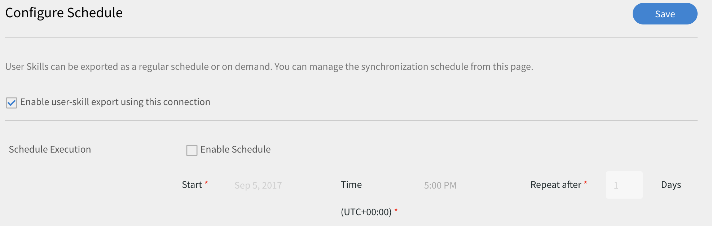

+++

+++使用者技能 - 隨選

你可以指定開始日期並用這個選項匯出報告。 報告將從輸入日期提取至今。 輸入你想開始產生報告的日期，然後點選執行。

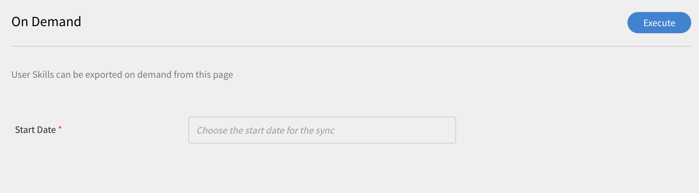

+++

+++使用者技能 - 執行狀態

在這裡，您可以查看所有任務的摘要並取得狀態報告。 你可以點擊錯誤報告連結下載錯誤報告。

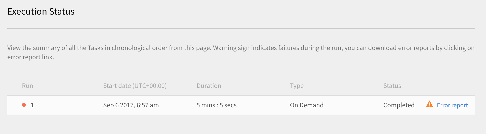

+++

## miniOrange 連接器 {#miniorangeconnector}

使用 miniOrange 連接器，你可以將 Learning Manager 與 miniOrange 租戶整合，以自動化資料同步。

### 進口

#### 地圖屬性

整合管理員可以選擇 miniOrange 屬性，並將其映射到對應的學習管理器可分組屬性。 這只是一次性的努力。 映射完成後，後續使用者匯入會使用相同的映射。 如果管理員想要不同的匯入映射，也可以重新設定。

#### 自動使用者匯入

使用者匯入流程允許學習管理員自動從 miniOrange 取得員工資料並匯入學習管理員。

#### 篩選使用者

Learning Manager 管理員可以在匯入使用者前對使用者套用篩選。 例如，學習管理員管理員可以選擇將階層中所有使用者匯入一個或多個特定管理員。

如需設定 miniOrange 連接器，請聯絡學習經理 CSM 團隊。

## 設定 miniOrange 連接器 {#configureminiorangeconnector}

1. 在 Learning Manager 首頁，將滑鼠移到 miniOrange 卡片/縮圖上。 選單出現了。 在選單中點選  **[!UICONTROL Connect]** 選項。

   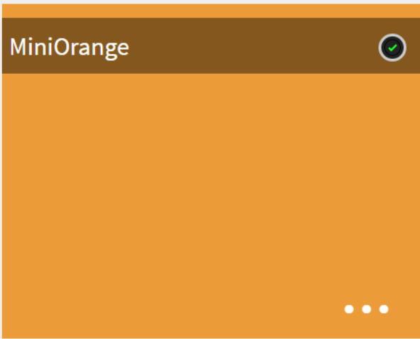

1. 點擊連接以建立新的連線。 miniOrange 連接器頁面會出現。 輸入你想要對應的帳號細節。

   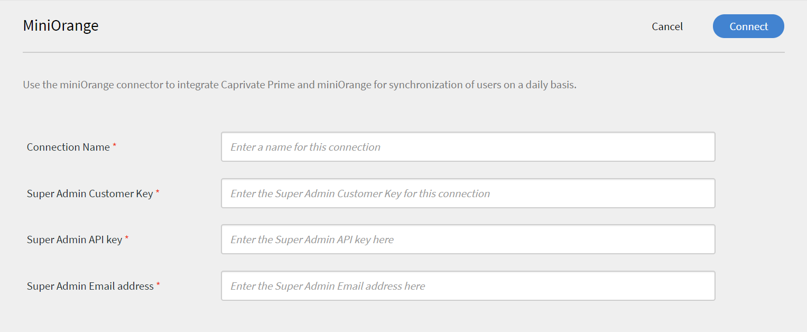

1. 如果你想直接匯入 miniOrnage 使用者作為 Learning Manager 內部使用者，請使用這個 **[!UICONTROL Import Internal Users]** 選項。

   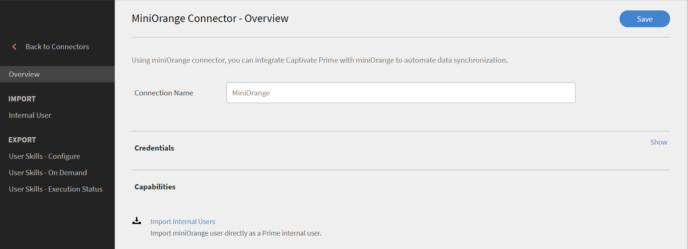

1. 在映射頁面左側可以看到學習管理器的欄位，右側則可以看到 miniOrnage 欄位。 選擇對應學習管理器欄位名稱的適當欄位名稱。

   

1. 作為管理員，若要查看及編輯資料來源，請點擊 **[!UICONTROL Settings > Data Source]**。

   已建立的 miniOrange 來源會被列出。 如果你需要編輯篩選，請點擊 **[!UICONTROL Edit]**。

   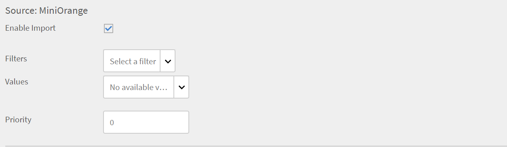

1. 匯入完成後，您將收到通知。 要查看或編輯匯入日誌，請點擊 **[!UICONTROL Users > Import log.]**

### 刪除連線 {#deleteaconnection}

請依照以下步驟刪除已建立的 miniOrange 連線。

## BlueJeans 連接器 {#bluejeansconnector}

你現在可以將 Learning Manager 與 BlueJeans 連接器整合，並用 BlueJeans 來主持課程。 BlueJeans 讓你能啟動音訊與視訊會議、視訊聊天及網路研討會。

請依照以下步驟設定並使用接頭。

1. 在 Learning Manager 首頁，將滑鼠移到藍牛仔卡片/縮圖上。 選單出現了。 從選單點選  **[!UICONTROL Connect]** 選項。

   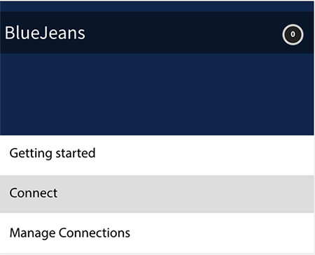

1. BlueJeans 連接頁打開了。 在各自欄位輸入你的帳號資料，以便整合 Learning Manager 和 BlueJeans，以同步用戶動態。 你可以從你的 BlueJeans 帳號管理員那裡取得詳細資訊。

   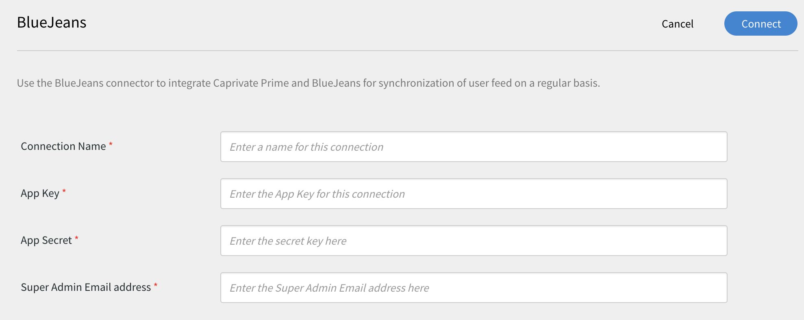

   作為學習者，啟用連接器時，請使用與 Learning Manager 帳號相同的電子郵件 ID，讓使用者回饋回學習管理員。

1. 建立連結後，作為作者，建立一門以 BlueJeans 作為會議系統的 VC 課程。

   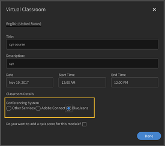

1. 管理者、經理與學員都可以為學員報名已建立的課程。 註冊後，學習者會收到一封電子郵件。 學習者可登入其學習經理帳號以查看課程詳情並參加課程。
1. 課程結束後，完成報告會寄送給學習管理員。 管理員可查看完成報告，以檢查學習者的出席情況與成績。

   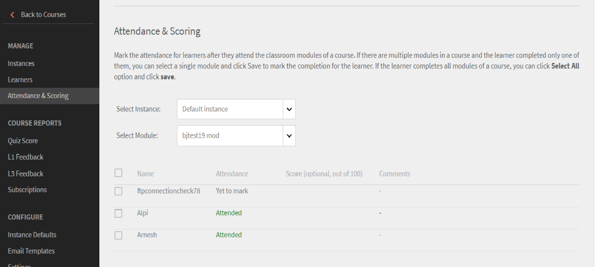

## 盒式連接器 {#boxconnector}

透過 BOX 連接器，你可以將 Learning Manager 與任意的外部系統整合，自動化資料同步。 預期外部系統能匯出 CSV 格式的資料，並將其放入學習管理盒帳戶的適當資料夾中。 盒子連接器的功能如下：

你也可以使用 FTP 連接器進行資料遷移、使用者匯入和匯出資料。 欲了解更多資訊，請參考 [Learning Manager FTP 連接器。](third-party-connectors.md#main-pars_header_1427405935)

## 資料匯入 {#DataImport-1}

使用者匯入流程允許學習經理管理員從學習管理工具服務中取得員工資料，並自動匯入學習管理工具。 利用此功能，你可以將這些系統產生的 CSV 放入 Box 帳戶的適當資料夾，整合多個系統。 Learning Manager 會擷取 CSV 檔案，合併後依照排程匯入資料。 請參閱排程功能以獲得更多資訊。

**地圖屬性**

整合管理員可以選擇 CSV 的欄位，並將其映射到 Learning Manager 可分組的屬性。 這次地圖製作是一次性的努力。 映射完成後，後續的使用者匯入也會使用相同的映射。如果管理員想要不同的匯入使用者映射，也可以重新設定映射。

## 資料匯出 {#dataexport}

資料匯出功能允許使用者將技能匯出到某個 Box 位置，以便整合到任何第三方系統。

## 賽程報告 {#schedulereports}

管理員可依組織需求設定排程任務，且學習管理軟體中的使用者會依照排程保持最新狀態。 同樣地，整合管理員也能及時排程技能匯出，並與外部系統整合。 同步可在 Learning Manager 應用程式中每日執行。

## 配置 Box 連接器 {#configureboxconnector}

了解整合 Learning Manager 與 Box 連接器的流程。

1. 在 Learning Manager 首頁，將滑鼠移到盒子卡片/縮圖上。 選單出現了。 在選單中點擊「連接項目」。

   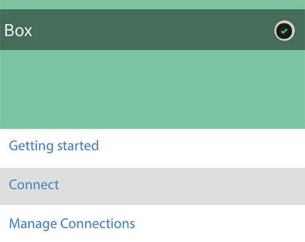

1. 會跳出一個對話框，提示你輸入電子郵件 ID。 提供負責管理該組織學習管理箱帳號的人員的電子郵件碼。 輸入電子郵件後點選 Connect。

1. Learning Manager 會寄送電子郵件，提示使用者在首次存取 Box 前重置密碼。 使用者必須重設密碼，並用此密碼存取學習管理器盒子帳號。

   同一學習經理帳號只能建立一個 Learning Manager Box 帳號。

   在概覽頁面，你可以指定整合的連線名稱。 從以下選項中選擇您想採取的行動：

   * 匯入內部使用者
   * 匯出使用者技能 - 設定排程
   * 匯出使用者技能 - 隨選

## 進口

+++內部使用者

匯入內部使用者選項允許你自動排程產生使用者匯入報告。 產生的報告會以 .CSV 檔案的形式傳送給你。

+++

+++地圖屬性

連線成功建立後，你可以將 Box 資料夾中 CSV 檔案的欄位映射到 Learning Manager 的對應屬性。 此步驟是強制步驟。

1. 在地圖屬性頁面，左側可以看到學習管理員預期的欄位，右側則可以看到 CSV 欄位名稱。 一開始，在右側你會看到一個空白的選擇框。 透過點選檔案匯入任何範本 CSV。

1. 上述步驟會將所有 CSV 欄位名稱填滿右側的下拉選單。 選擇對應學習管理器欄位名稱的適當欄位名稱。

   *管理者欄位必須對應到某個欄位，電子郵件地址。 在使用連接器之前，必須對所有柱子進行映射。*

1. 完成地圖後點擊儲存。

   接頭現在已經準備好可以使用了。 剛設定的帳號現在會以資料來源出現在管理員應用程式中，供管理員排程匯入或按需同步。

+++

+++使用 Learning Manager Box 連接器

1. 外部系統的 CSV 檔案應放在以下路徑：

   `code $OPERATION$/$OBJECT_TYPE$/$SUB_OBJECT_TYPE$/data.csv`

   **注意：** 在 2016 年 7 月的版本中，僅允許匯入使用者。 因此，使用 Box 連接器時，您必須確保 CSV 檔案放在以下資料夾中：\
   `code Home/import/user/internal/*.csv`

1. Box 連接器會擷取所有 CSV 檔案的列，因此重要的是，對應於某個 CSV 的使用者列不會出現在其他 CSV 檔中。
1. 所有 CSV 都應該包含映射中指定的欄位。
1. 所有必要的 CSV 檔案應該在流程開始前就已在資料夾中。

在將使用者匯入 Learning Manager 時，管理員也需要了解使用者在 Learning Manager 中如何管理。 請參閱使用者管理說明[&#128279;](../integration-admin/feature-summary/migration-manual.md#usermanagement)以獲取更多資訊。

+++

## 出口

+++技能

有兩種匯出使用者技能報告的選項。

使用者技能 - 隨選：你可以指定開始日期並透過選項匯出報告。報告將從輸入日期起提取至現在

**[!UICONTROL User Skills - Configure]**：此選項允許您排程擷取報告。 選擇啟用排程勾選框，並指定開始日期與時間。 你也可以指定想要產生和傳送報告的間隔。

+++

要開啟匯出檔案會放置於 Box 位置的匯出資料夾，請如下圖所示，開啟使用者技能頁面中提供的 Box 資料夾連結。

自動匯出的檔案會出現在 **Home/export/&#42;Box_location&#42;**

自動匯出的檔案會顯示標題為&#x200B;**skill_achievements_&#42;日期&#x200B;_&#42;&#42;_至日期&#42;.csv**

學習管理團隊共享的 Box 資料夾中的存取權限與內容應由客戶管理。  另外要注意，資料夾裡的內容會實體存放在法蘭克福地區。

## LinkedInLearning 連接器 {#linkedinlearningconnector}

LinkedInLearning 連接器可供企業客戶使用 LinkedIn.com，希望學生能在 Learning Manager 中發現並學習課程。 連接器可以設定成定期用 API 金鑰擷取課程。 課程在學習管理員中建立後，使用者可以搜尋並使用課程。 學習者的進度可以在學習管理員中追蹤。

### 設定 LinkedIn 連接器 {#configurelinkedinconnector}

1. 在整合管理儀表板中，點擊 LinkedInLearning。

   你會看到這個圖塊有三個選項：開始、連接和管理。

1. 如果你是第一次設定 LinkedInLearning 連接器，請點擊「連接」。

   你必須先先設定 Exavault FTP 帳號，才能設定這個連接器。

1. 在連接頁面，指定你的連接器名稱。 輸入 Appkey 和 Secret key，即可連接連線。

   你必須聯絡你的供應商才能取得應用程式金鑰和秘密金鑰。

1. 點擊儲存。

   設定會被保存，並且你的帳號會新增 LinkedInLearning 連結。 你現在可以從首頁點選「管理連線」，隨時編輯你的設定。

1. 如果你已經建立了連線，請點選「管理連線」，查看所有連線。

   在設定這個連接器之前，必須先啟用您的帳號遷移功能。

1. 點擊你想編輯的連結。
1. 從左側窗格點選「設定」。 請做以下其中一項：

   * 在此視窗查看或編輯您的帳戶詳細資訊及同步排程。 如果你想啟用此帳號，必須勾選啟用連線的勾選框。
   * 點擊編輯並編輯你的帳號。 點擊重置以撤銷你對此欄位的更新。
   * 點擊啟用排程以排程同步。 你可以輸入開始時間和日期，然後輸入以天為單位的同步頻率。 例如，每三天啟用一次同步。

   點擊儲存以儲存您的更改。

1. 從左側窗格點選「隨需執行」。 這個選項允許你匯入 LinkedIn 的用戶動態和其他相關資料。 輸入按需執行的開始日期，並點擊執行以執行同步。 從起始日期到現在的所有資料都會匯入。

   * 你可以在執行時點選「停用 Learning Manager 存取權」，這樣應用程式在同步期間會有停機。
   * 如果你在執行時點選「啟用學習管理員存取」，同步過程中服務不會中斷。

1. 你也可以隨時從左側面板點擊「執行狀態」，以時間順序查看此連接器所有運行的摘要。 您可以查看同步的開始日期與持續時間、同步類型（是否為按需同步）以及同步狀態（同步進行中或已完成）。

   當你刪除並重新建立連線時，之前針對連接器的執行會重新出現。 你可以查看刪除連線前的所有跑動紀錄。

   你只能重播以取得最新的同步。
