# Learning Manager部署指南 — 第2節

## 技術設定 {#technicalsetup}

您Learning Manager帳戶的技術設定主要是企業使用者所需。 本檔案說明如何為貴組織設定單一登入，以及如何將Learning Manager與協力廠商聯結器整合。

### 設定單一登入 {#configuresinglesignon}

身為Admin Console的系統管理員，您的首要任務之一是定義並設定身分系統，以驗證您的使用者。 當貴組織購買Learning Manager的授權時，您需要將這些授權布建給一般使用者。 為此，您需要一種方法來驗證這些使用者。 執行以下程式，為您的使用者設定SSO。

1. 從Learning Manager首頁，按一下 **[!UICONTROL **&#x200B;設定&#x200B;**>**&#x200B;登入方法&#x200B;**.]**

   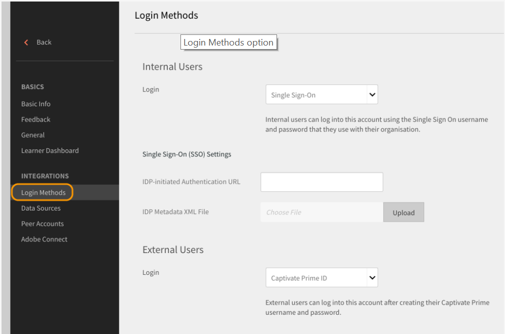

1. 根據您的使用者型別，選取 **[!UICONTROL **&#x200B;內部使用者&#x200B;**或**&#x200B;外部使用者&#x200B;**.]**

1. 從**[!UICONTROL **登入**]**下拉式欄位，選取 **[!UICONTROL **&#x200B;單一登入&#x200B;**.]**

   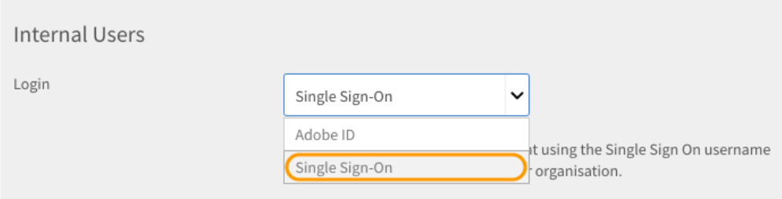

1. 若要設定「單一登入」設定，請按一下 **[!UICONTROL **&#x200B;變更&#x200B;**.]**

   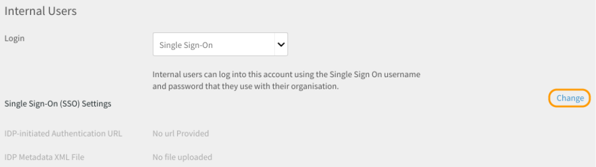

1. 在 ****[!UICONTROL IDP-Initiated Authentication URL]**** 欄位，輸入服務提供者提供的驗證URL。

   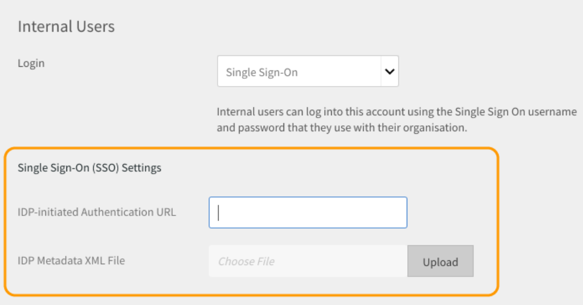

1. 按一下**[!UICONTROL **上傳&#x200B;**]**在&#x200B;**[!UICONTROL  **IDP中繼資料XML檔案&#x200B;**]******欄位，並上傳您的XML檔案。
1. 按一下 **[!UICONTROL **&#x200B;儲存&#x200B;**.]**
1. 已成功為您的帳戶設定SSO驗證。 您應能使用SSO登入您的Learning Manager帳戶。

   ***您在Learning Manager中設定的SSO應支援SAML 2.0。***

## 使用者資料的移轉 {#migrationofuserdata}

作為管理員，當您的企業購買Learning Manager時，您需要執行的其中一個關鍵步驟是移轉。 您必須將現有的訓練內容和使用者資料移至Learning Manager。 下列移轉工作流程可協助您運用現代且直覺式LMS的優點，而不會遺失組織的任何舊有資料。

Learning Manager可讓您透過逐步精靈，在反複衝刺中從現有的LMS移轉。 您可完整掌握每個衝刺的狀態，以確保學習者在您將舊資料移轉至Adobe Learning Manager時，不會出現停機時間。

若要執行移轉工作流程，您需要整合管理員許可權。 身為管理員，您可以擔任整合管理員的角色，或將此角色指派給其他使用者。

**我們可以在這裡利用Shaleen的協助來建立視覺效果。**

1. 先決條件
1. 評估現有內容和使用者資料
1. 從現有LMS匯出及對應資料
1. 設定FTP和BOX資料夾以進行移轉
1. 將學習者轉移至Learning Manager
1. 將學習內容轉移到Learning Manager
1. 將剩餘資料傳輸至Learning Manager

### 先決條件 {#prerequisite}

開始移轉程式之前，您必須先執行下列必要條件：

* 從現存的LMS擷取資料和內容，並將資料轉換為Learning Manager定義的檔案格式。
* 使用FTP和BOX聯結器匯入使用者。 整合管理員必須在移轉程式進行前確定已設定聯結器。

***建議管理員在將資料和內容移轉至Learning Manager生產環境前，先在試用帳戶中嘗試移轉程式。 ***

### 評估及匯出資料 {#evaluatingandexportingdata}

整合管理員應該先檢視目前LMS中可用的資料。 身為整合管理員，您只能移轉下列學習物件：

* 模組
* 課程
* 模組版本
* 課程例項
* 課程模組
* 技能
* 技能等級
* 技能課程
* 認證
* 認證課程
* 憑證認可
* 學習計畫
* 學習計畫課程
* 學習計畫執行個體
* 學習計畫課程例項
* 註冊
* 認證註冊
* 學習計畫註冊
* 使用者課程成績

評估現有資料後，您必須使用Learning Manager中的標準CSV規格對應此資料。 下載下列範例 ***csv-specifications.zip*** 此檔案包含此移轉所需的七份excel工作表。 這些Excel工作表包含的規格及說明，可讓您瞭解如何將現有資料與.csv檔案中的欄位對應。

<!--
<Download link to the zip file>
-->

確定每個.csv檔案都包含指定格式之每個欄位的資料：

<table> 
 <tbody> 
  <tr> 
   <th width="7%" valign="top">
<strong>不適用。</strong>
</th> 
   <th width="29%" valign="top">
<strong>Excel工作表名稱</strong>
</th> 
   <th width="31%" valign="top">
<strong>內容說明</strong>
</th> 
   <th width="31%" valign="top">
<strong>附註</strong>
</th> 
  </tr> 
  <tr> 
   <td>
1
</td> 
   <td>
module.xlsx
</td> 
   <td>
module.csv的中繼資料
</td> 
   <td>
 
</td> 
  </tr> 
  <tr> 
   <td>
2
</td> 
   <td>
course.xlsx
</td> 
   <td>
course.csv的中繼資料
</td> 
   <td>
提及指定課程的一個作者名稱，因為有時多個作者名稱在移轉後無法正確顯示在應用程式中。 
</td> 
  </tr> 
  <tr> 
   <td>
3
</td> 
   <td>
module_version.xlsx 
</td> 
   <td>
module_version.csv的中繼資料
</td> 
   <td>
請務必提供您上傳內容之Box帳戶資料夾的URL路徑。 
</td> 
  </tr> 
  <tr> 
   <td>
4
</td> 
   <td>
course_instance.xlsx
</td> 
   <td>
course_instance.csv的中繼資料 
</td> 
   <td> </td> 
  </tr> 
  <tr> 
   <td>
5
</td> 
   <td>
course_module.xlsx
</td> 
   <td>
course_module.csv的中繼資料
</td> 
   <td> </td> 
  </tr> 
  <tr> 
   <td>
6
</td> 
   <td>
skill.xlsx
</td> 
   <td>
skill.csv的中繼資料
</td> 
   <td> </td> 
  </tr> 
  <tr> 
   <td>
7
</td> 
   <td>
skill_level.xlsx
</td> 
   <td>
skill_level.csv的中繼資料
</td> 
   <td> </td> 
  </tr> 
  <tr> 
   <td>
8
</td> 
   <td>
skill_course.xlsx
</td> 
   <td>
skill_course.csv的中繼資料
</td> 
   <td> </td> 
  </tr> 
  <tr> 
   <td>
9
</td> 
   <td>
Certification.xlsx
</td> 
   <td>
Certification.csv中繼資料
</td> 
   <td> </td> 
  </tr> 
  <tr> 
   <td>
10
</td> 
   <td>
certification_course.xlsx
</td> 
   <td>
certification_course.csv中繼資料
</td> 
   <td> </td> 
  </tr> 
  <tr> 
   <td>
11
</td> 
   <td>
certification_commit.xlsx
</td> 
   <td>
certification_commit.csv的中繼資料
</td> 
   <td> </td> 
  </tr> 
  <tr> 
   <td>
12
</td> 
   <td>
learning_program.xlsx
</td> 
   <td>
learning_program.csv的中繼資料
</td> 
   <td> </td> 
  </tr> 
  <tr> 
   <td>
13
</td> 
   <td>
learning_program_course.xls 
</td> 
   <td>
learning_program_course.csv的中繼資料 
</td> 
   <td> </td> 
  </tr> 
  <tr> 
   <td>
14
</td> 
   <td>
learning_program_instance.xlsx 
</td> 
   <td>
learning_program_instance.csv的中繼資料
</td> 
   <td> </td> 
  </tr> 
  <tr> 
   <td>
15
</td> 
   <td>
learning_program_instance_course_instance.xlsx 
</td> 
   <td>
learning_program_instance_course_instance.csv的中繼資料
</td> 
   <td> </td> 
  </tr> 
  <tr> 
   <td>
16
</td> 
   <td>
enrollments.xlsx
</td> 
   <td>
Enrollments.csv的中繼資料
</td> 
   <td> </td> 
  </tr> 
  <tr> 
   <td>
17
</td> 
   <td>
certification_enrollment.xlsx
</td> 
   <td>
certification_enrollment.csv的中繼資料
</td> 
   <td> </td> 
  </tr> 
  <tr> 
   <td>
18
</td> 
   <td>
learning_program_enrollment.xlsx
</td> 
   <td>
learning_program_enrollment.csv的中繼資料
</td> 
   <td> </td> 
  </tr> 
  <tr> 
   <td>
19
</td> 
   <td>
User_course_grade.xlsx
</td> 
   <td>
User_course_grade.csv的中繼資料
</td> 
   <td>
在.csv檔案中提供所需的學習者記錄資料（即使並非強制性）。 若無此資訊，即使.csv經過移轉處理，Learning Manager應用程式可能不會反映任何資料。 
</td> 
  </tr> 
 </tbody> 
</table>

***Learning Manager僅支援UTF 8和32位元格式的日期和時間值。 如果您在日期超出範圍的CSV檔案（例如2038-07-17T08）中指定日期，則在移轉期間可能會收到錯誤:53:21.000Z或1980-04-17T08:13:25.322赫***

### 將資料匯入csv檔案時的相依性 {#dependencieswhileimportingdatatocsvfiles}

將現有資料匯入標準csv格式時，請注意以下相依性：

* module_version.csv依存於module.csv
* course_instance.csv依存於course.csv
* course_module.csv取決於course.csv、module.csv和module_version.csv
* course_instance.csv依存於course.csv
* enrollment.csv依存於course.csv
* user_course_grade.csv取決於course.csv和module.csv
* skill_course.csv依存於course.csv
* skill_level.csv取決於skill.csv
* learning_program_instance.csv取決於學習計畫和learning_program_course.csv
* learning_program_course.csv取決於learning_program.csv
* learning_program_enrollment.csv取決於學習計畫和learning_program_instance.csv
* learning_program_instance_course_instance.csv取決於learning_program.csv、learning_program_instance.csv和course_instance.csv
* certification_course.csv取決於certification.csv和course.csv
* certification_commit.csv取決於certification.csv和certification_course.csv
* certification_enrollment.csv取決於certification.csv、certification_course.csv和certification_enrollment.csv

匯出資料後，請將.csv檔案儲存在本機電腦中。 檔案現在已準備好放入FTP或BOX資料夾中。

## 設定要移轉的FTP和BOX資料夾 {#setupftpandboxfoldersforthemigration}

在您計畫和開始實際移轉所有內容之前，必須先設定FTP和BOX資料夾。 您需要這些資料夾才能將.csv檔案拖放到這些資料夾中。 FTP和BOX資料夾提供.csv格式的舊內容後，Learning Manager即可使用這些資料。

### 設定FTP帳戶 {#setupanftpaccount}

在整合管理首頁中，按一下 **[!UICONTROL **&#x200B;請求CSV FTP資料夾&#x200B;**.]** 在出現的快顯對話方塊中，輸入您的電子郵件ID。 透過線上精靈建立Exavault FTP帳戶。 建立帳戶之後，您就可以在Exavault FTP中檢視移轉專案和Sprint專案資料夾。

請參閱ExaVault專案檔案和資料夾的範例快照，如下所示：

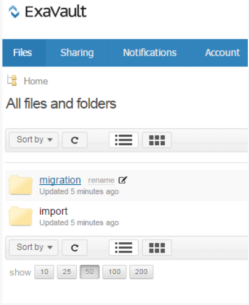

當您成功設定FTP資料夾時，系統會顯示「FTP資料夾設定完成」訊息。

## 設定BOX帳戶 {#setupaboxaccount}

若要建立BOX帳戶並設定BOX資料夾，請執行下列步驟：

在整合管理首頁中，選取移轉。

在「設定」區段中，按一下「要求Box資料夾」。

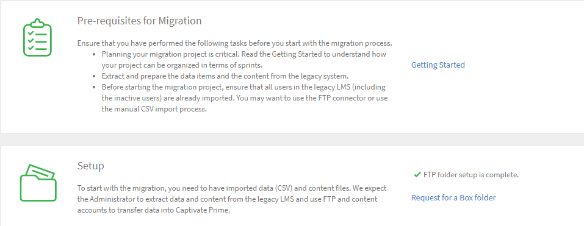

在 ****[!UICONTROL Enter Email]**** 欄位，輸入您要接收連線至Box之登入指示的電子郵件ID。

按一下 **[!UICONTROL **&#x200B;連線&#x200B;**.]**

您會收到來自Box的電子郵件，其中包含共用資料夾的連結。 如果您沒有Box帳戶，請按一下[註冊]並建立帳戶。 接著，系統會將登入指示傳送至整合管理員電子郵件ID。

儲存連線後，移轉頁面會顯示訊息：「Box資料夾設定完成」。

## 將內容移轉至Learning Manager {#migratingthecontenttocaptivateprime}

開始移轉之前，請務必注意下列事項：

* 在任一指定時間點，帳戶中只能有一個作用中的移轉專案。 在專案中，在任何指定時間點，只能有一個作用中的衝刺。
* 您無法復原已在處理中的「執行」。 不過，您可以使用Learning Manager每項功能中的現有刪除選項來復原任何資料或內容移轉。

移轉專案一開始，專案就會進入「移轉中」狀態。 在此狀態下，整合管理員以外的使用者無法登入Learning Manager。

將培訓內容上傳至內容資料夾：

在整合管理首頁中，按一下 **[!UICONTROL Migration.]**

在移轉首頁中，系統會顯示組織中已建立的移轉專案。

按一下**[!UICONTROL **新增**]**在頁面的右上角，建立移轉專案。

***如果您尚未建立FTP資料夾，系統會提示您建立FTP資料夾Exavault帳戶。 這是開始建立移轉專案之前的必要步驟。 ***

在 ****[!UICONTROL Create a New Migration Project]**** 頁面，指定專案名稱。

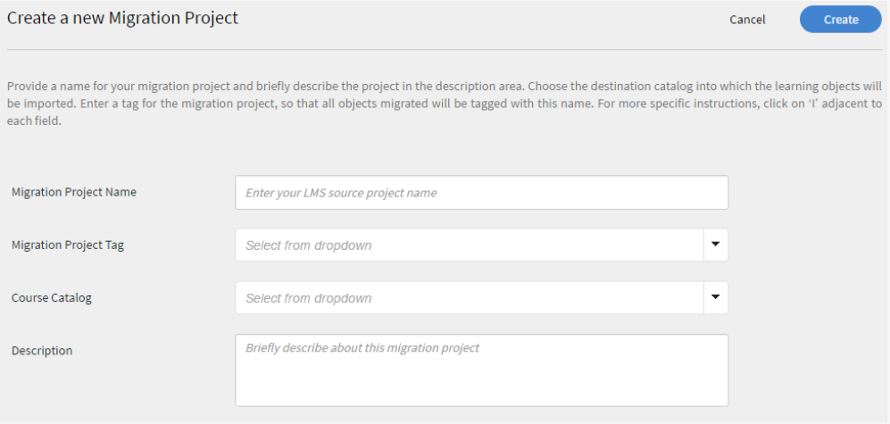

指定專案的標籤和課程目錄，並提供移轉專案的說明。 您的移轉資料專案是使用移轉專案標籤來識別。 如果您沒有任何特定的課程目錄，請從下拉式選單中選擇預設目錄，則使用移轉專案移轉的所有課程將包含在此階段選擇的目錄中。 如果您未選擇任何目錄，則所有移轉的課程都會成為預設目錄的一部分。

按一下 **[!UICONTROL Create.]**

在「衝刺(Sprint)設定」頁面中，為您的移轉專案建立衝刺。 Learning Manager移轉程式中的Sprint會定義您選擇從現有LMS移轉的一組移轉專案。

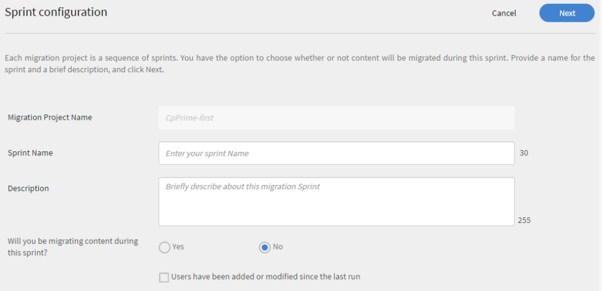

指定衝刺的名稱，並提供衝刺的說明。

選取 ****[!UICONTROL Users have been added or modified since the last run check box]****，將使用者清單與Learning Manager應用程式同步。 如果您要將內容和資料移轉至Learning Manager應用程式，則可能不需要這樣做。 但是，如果在先前的衝刺移轉與最新的衝刺移轉之間有時間間隔，建議您選擇同步使用者清單。 此步驟可讓Learning Manager資料庫與LMS使用者同步。

***移轉enrollment.csv和user_course_grade.csv時，建議使用「同步」步驟。 此步驟可讓Learning Manager資料庫與您的移轉資料庫保持同步，並確保所有要在Sprint中移轉記錄的使用者都可在移轉資料庫中使用。***

按一下 **[!UICONTROL **&#x200B;下一個&#x200B;**.]**

按一下**[!UICONTROL **開始**]**使用您上傳的資料和內容開始Sprint移轉。 按一下 ****[!UICONTROL Refresh]**** 開始執行Sprint Run以與Learning Manager同步FTP和內容資料夾之前。

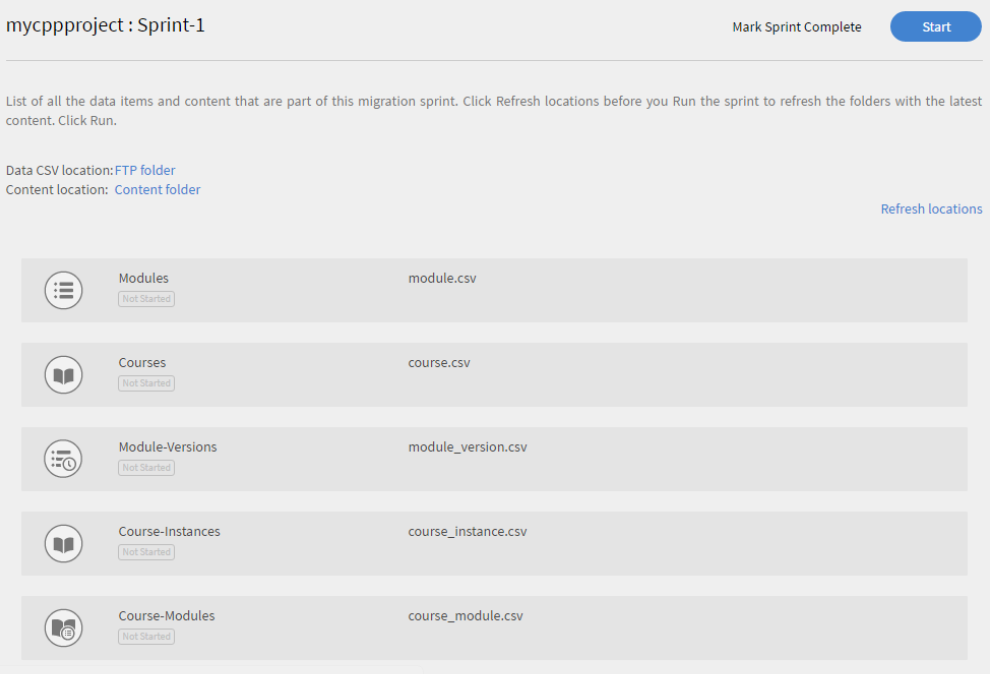

您可以按一下****[!UICONTROL Stop]****在Sprint移轉程式期間的任何時間點，中止該Sprint移轉。

系統會針對每個衝刺資料專案和內容顯示移轉狀態。 檢查移轉衝刺執行中成功和失敗的專案數。

如果您要上傳模組內容，請確定*module_version.csv *檔案中提供內容資料夾的路徑。 如果您未完成此步驟，移轉期間可能會發生錯誤。 例如，如果您要上傳自學式模組內容（例如視訊），則需在*module_version.csv *檔案中指定相對Box URL路徑。

以下提供移轉進度的範例快照供您參考。 如快照中所示，您可以檢視針對每個移轉資料專案處理的記錄數，以及成功和失敗專案的狀態。 按一下「下載失敗專案的錯誤記錄」 ，以下載並檢視錯誤記錄。 您可以修正CSV中的問題，並在FTP中再次上傳。

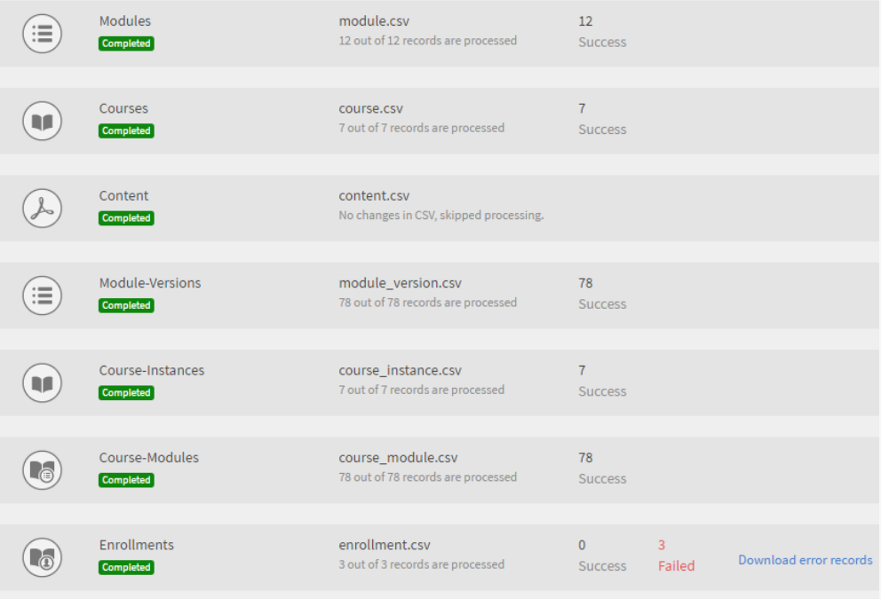

若要檢視移轉專案的所有衝刺清單，請按一下**[!UICONTROL **衝刺(sprint)**]**在左側導覽窗格中。 您可以檢視所有衝刺的清單、每個衝刺執行的「執行」數目、開始日期、持續期間和完成狀態，如下面的範例快照所示。

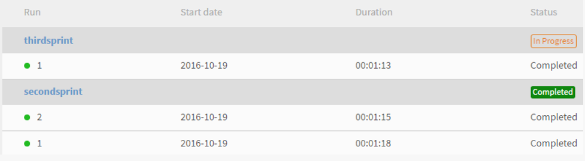

若要檢視移轉專案的所有衝刺清單，請按一下**[!UICONTROL **衝刺(sprint)**]**在左側導覽窗格中。 您可以檢視所有衝刺的清單、每個衝刺執行的「執行」數目、開始日期、持續期間和完成狀態，如下面的範例快照所示。

若要檢視移轉專案的所有衝刺清單，請按一下**[!UICONTROL **衝刺(sprint)**]**在左側導覽窗格中。 您可以檢視所有衝刺的清單、每個衝刺執行的「執行」數目、開始日期、持續期間和完成狀態，如下面的範例快照所示。

***將移轉專案標籤為完成之前，請確定專案中的所有衝刺都已完成。 一旦您將移轉專案標籤為完成，您就無法返回在該專案中建立任何沖刺。 您無法對該專案進行任何修改。 您只能建立其他移轉專案並新增衝刺。***

從組織的舊版LMS移轉學習資料和內容後，請確認資料和內容是否已正確匯入。 您可以以管理員身分登入並驗證匯入模組與課程資料與內容的可用性，以進行驗證

如需有關移轉的實用資源，請參閱下列內容：

* 疑難排解移轉問題
* 上傳CSV常見問題集

