# 學習經理部署指南 - 第二節

## 技術架構 {#technicalsetup}

Learning Manager 帳號的技術設定主要是企業用戶需要的。 本文件說明如何為您的組織設定單一登入，以及如何將 Learning Manager 與第三方連接器整合。

### 設定單一登入 {#configuresinglesignon}

作為管理控制台的系統管理員，您的首要任務之一是定義並設定一個身份系統，讓您的最終使用者能被驗證。 當您的組織購買 Learning Manager 的授權時，您需要將這些授權提供給最終使用者。 為此，你需要一種方法來驗證這些使用者。 請執行以下程序為您的使用者設定 SSO。

1. 從學習管理員首頁，點擊&#x200B;**[!UICONTROL **>登入方式&#x200B;**的設定****。]**

   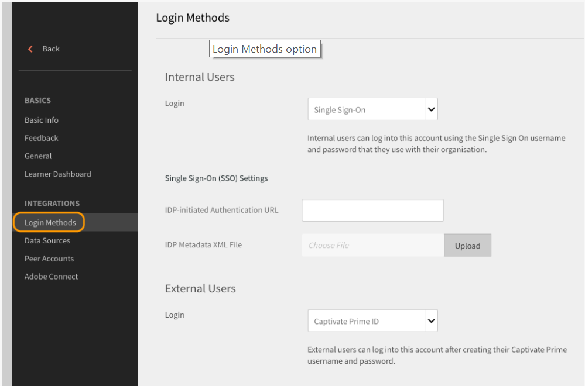

1. 根據你的使用者類型，選擇 **[!UICONTROL **「內部使用者&#x200B;**」或**「外部使用者&#x200B;**」。]**

1. 從&#x200B;**[!UICONTROL **&#x200B;登入&#x200B;**]**下拉選單欄位，選擇&#x200B;**[!UICONTROL **單一登入**。]**

   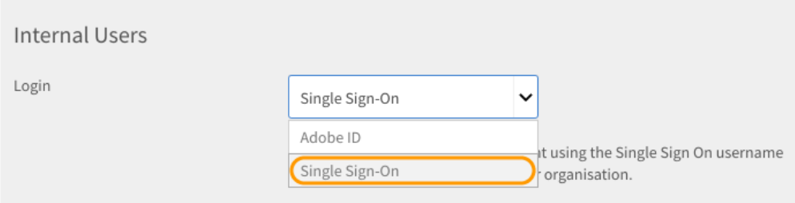

1. 要設定單一登入設定，請點擊 **[!UICONTROL **「變更&#x200B;**」。]**

   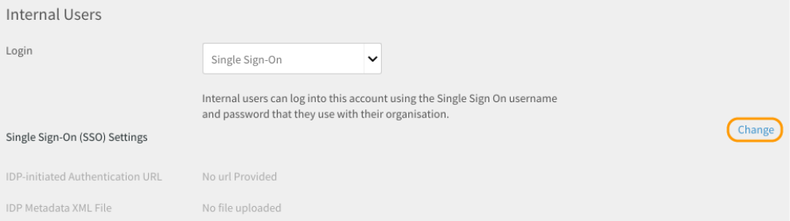

1. 在欄位 ****[!UICONTROL IDP-Initiated Authentication URL]**** 輸入服務提供者提供的認證網址。

   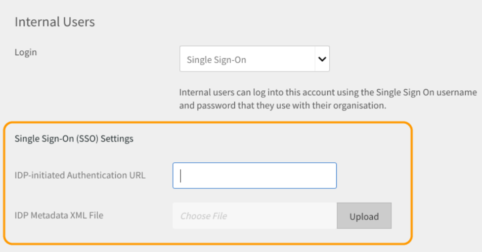

1. 點選 **[!UICONTROL **上傳&#x200B;**]**IDP 元資料 XML 檔案&#x200B;**]******欄位旁&#x200B;**[!UICONTROL  **的上傳，然後上傳你的 XML 檔案。
1. 點擊 **[!UICONTROL **&#x200B;儲存&#x200B;**。]**
1. SSO 認證已成功為你的帳號設定。 你應該可以用 SSO 登入你的 Learning Manager 帳號。

   ***你在 Learning Manager 中設定的 SSO 應該支援 SAML 2.0。***

## 使用者資料遷移 {#migrationofuserdata}

作為管理員，當您的企業購買 Learning Manager 時，其中一個關鍵步驟是遷移。 務必將現有的培訓內容和使用者資料移至 Learning Manager。 以下遷移工作流程幫助您善用現代且直覺式的LMS優勢，同時不損失組織的舊有資料。

Learning Manager 允許你透過逐步精靈，從現有的 LMS 遷移，進行迭代衝刺。 您可以完整掌握每個衝刺的狀態，確保學習者在遷移舊有資料至 Adobe Learning Manager 期間無任何停機。

要執行遷移工作流程，你需要整合管理員權限。 作為管理員，你可以選擇擔任整合管理員的角色，或將此角色指派給其他使用者。

**我們可以利用Shaleen的幫助來製作視覺效果。**

1. 前置條件
1. 現有內容與使用者資料的評估
1. 將現有LMS的資料匯出並映射
1. 設定 FTP 和 BOX 資料夾進行遷移
1. 將學習者轉接至學習管理
1. 將學習內容轉移至 Learning Manager
1. 將剩餘資料轉移至學習管理器

### 前置條件 {#prerequisite}

在開始遷移流程前，您必須完成以下先決條件：

* 從現有的學習管理系統（LMS）中擷取資料與內容，並將資料轉換為學習管理器定義的檔案格式。
* 使用 FTP 與 BOX 連接器匯入使用者。 整合管理員必須確保連接器在遷移前已設定妥當。

建議管理員在將資料與內容遷移至 Learning Manager 生產環境前，先在試用帳號中嘗試遷移流程。 ***

### 評估與匯出資料 {#evaluatingandexportingdata}

整合管理員應先檢視目前 LMS 中可用的資料。 作為整合管理員，您只能遷移以下學習物件：

* 模組
* 河道
* 模組版本
* 球場實例
* 課程模組
* 技能
* 技術水準
* 技能課程
* 認證
* 認證課程
* 認證提交
* 學習計畫
* 學習課程
* 學習程式實例
* 學習程式課程實例
* 招生人數
* 認證註冊
* 學習課程註冊
* 使用者課程成績

在評估現有資料後，必須將這些資料與 Learning Manager 中的標準 CSV 規格對應。 下載以下範例 ***csv-specifications.zip*** 檔案，其中包含七張遷移所需的 Excel 表格。 這些 Excel 表格包含規格說明，幫助你了解如何將現有資料與 .csv 檔案中的欄位對應。

<!--
<Download link to the zip file>

-->

確保每個.csv檔案都包含每個欄位的資料，格式如下：

<table> 
 <tbody> 
  <tr> 
   <th width="7%" valign="top">
<strong>不。</strong>
</th> 
   <th width="29%" valign="top">
<strong>Excel 工作表名稱</strong>
</th> 
   <th width="31%" valign="top">
<strong>內容說明</strong>
</th> 
   <th width="31%" valign="top">
<strong>註釋</strong>
</th> 
  </tr> 
  <tr> 
   <td>
1
</td> 
   <td>
module.xlsx
</td> 
   <td>
module.csv的元資料
</td> 
   <td>
 
</td> 
  </tr> 
  <tr> 
   <td>
2
</td> 
   <td>
course.xlsx
</td> 
   <td>
course.csv 的元資料
</td> 
   <td>
在遷移後，請標明一位作者姓名，因為遷移後申請表中有時會顯示多位作者姓名。 
</td> 
  </tr> 
  <tr> 
   <td>
3
</td> 
   <td>
module_version.xlsx 
</td> 
   <td>
module_version.csv 的元資料
</td> 
   <td>
請確保你提供你上傳內容的 Box 帳號資料夾的網址路徑。 
</td> 
  </tr> 
  <tr> 
   <td>
4
</td> 
   <td>
course_instance.xlsx
</td> 
   <td>
course_instance.csv的元資料 
</td> 
   <td> </td> 
  </tr> 
  <tr> 
   <td>
5
</td> 
   <td>
course_module.xlsx
</td> 
   <td>
course_module.csv 的元資料
</td> 
   <td> </td> 
  </tr> 
  <tr> 
   <td>
6
</td> 
   <td>
skill.xlsx
</td> 
   <td>
skill.csv 的元資料
</td> 
   <td> </td> 
  </tr> 
  <tr> 
   <td>
7
</td> 
   <td>
skill_level.xlsx
</td> 
   <td>
skill_level.csv 的元資料
</td> 
   <td> </td> 
  </tr> 
  <tr> 
   <td>
8
</td> 
   <td>
skill_course.xlsx
</td> 
   <td>
skill_course.csv的元資料
</td> 
   <td> </td> 
  </tr> 
  <tr> 
   <td>
9
</td> 
   <td>
Certification.xlsx
</td> 
   <td>
Certification.csv 的元資料
</td> 
   <td> </td> 
  </tr> 
  <tr> 
   <td>
10
</td> 
   <td>
certification_course.xlsx
</td> 
   <td>
certification_course.csv的元資料
</td> 
   <td> </td> 
  </tr> 
  <tr> 
   <td>
11
</td> 
   <td>
certification_commit.xlsx
</td> 
   <td>
certification_commit.csv 的元資料
</td> 
   <td> </td> 
  </tr> 
  <tr> 
   <td>
12
</td> 
   <td>
learning_program.xlsx
</td> 
   <td>
learning_program.csv的元資料
</td> 
   <td> </td> 
  </tr> 
  <tr> 
   <td>
13
</td> 
   <td>
learning_program_course.xls 
</td> 
   <td>
learning_program_course.csv 的元資料 
</td> 
   <td> </td> 
  </tr> 
  <tr> 
   <td>
14
</td> 
   <td>
learning_program_instance.xlsx 
</td> 
   <td>
learning_program_instance.csv 的元資料
</td> 
   <td> </td> 
  </tr> 
  <tr> 
   <td>
15
</td> 
   <td>
learning_program_instance_course_instance.xlsx 
</td> 
   <td>
learning_program_instance_course_instance.csv 的元資料
</td> 
   <td> </td> 
  </tr> 
  <tr> 
   <td>
16
</td> 
   <td>
enrollments.xlsx
</td> 
   <td>
enrollments.csv 的元資料
</td> 
   <td> </td> 
  </tr> 
  <tr> 
   <td>
17
</td> 
   <td>
certification_enrollment.xlsx
</td> 
   <td>
certification_enrollment.csv 的元資料
</td> 
   <td> </td> 
  </tr> 
  <tr> 
   <td>
18
</td> 
   <td>
learning_program_enrollment.xlsx
</td> 
   <td>
learning_program_enrollment.csv的元資料
</td> 
   <td> </td> 
  </tr> 
  <tr> 
   <td>
19
</td> 
   <td>
User_course_grade.xlsx
</td> 
   <td>
User_course_grade.csv的元資料
</td> 
   <td>
即使非強制，也要在 .csv 檔案中提供所需的學習者紀錄資料。 沒有這些資訊，即使.csv被處理進行遷移，學習管理員應用程式也可能無法反映任何資料。 
</td> 
  </tr> 
 </tbody> 
</table>

***Learning Manager 僅支援 UTF 8 和 32 位元格式的日期與時間值。 如果你在 CSV 檔案中指定日期，且日期超出範圍，例如 2038-07-17T08:53:21.000Z 或 1980-04-17T08:13:25.322Z，遷移時可能會出錯。***

### 將資料匯入 CSV 檔案時的相依關係 {#dependencieswhileimportingdatatocsvfiles}

在將現有資料匯入標準 csv 格式時，請注意以下相依性：

* module_version.csv取決於module.csv
* course_instance.csv取決於course.csv
* course_module.csv依賴於course.csv、module.csv和module_version.csv
* course_instance.csv取決於course.csv
* enrollment.csv取決於course.csv
* user_course_grade.csv取決於course.csv和module.csv
* skill_course.csv取決於course.csv
* skill_level.csv取決於skill.csv
* learning_program_instance.csv取決於學習、課程和learning_program_course.csv
* learning_program_course.csv取決於learning_program.csv
* learning_program_enrollment.csv取決於學習計畫和learning_program_instance.csv
* learning_program_instance_course_instance.csv取決於learning_program.csv、learning_program_instance.csv和course_instance.csv
* certification_course.csv取決於certification.csv和course.csv
* certification_commit.csv取決於certification.csv和certification_course.csv
* certification_enrollment.csv取決於certification.csv、certification_course.csv和certification_enrollment.csv

匯出資料後，將.csv檔案儲存到本地電腦。 檔案現在可以直接丟到 FTP 或 BOX 資料夾。

## 為遷移設置 FTP 和 BOX 資料夾 {#setupftpandboxfoldersforthemigration}

在你規劃並開始實際遷移所有內容之前，必須先設定 FTP 和 BOX 資料夾。 你需要這些資料夾來把.csv檔案放進這些資料夾裡。 一旦你的舊有內容以 .csv 檔案的形式出現在 FTP 和 BOX 資料夾中，Learning Manager 就能使用這些資料。

### 建立一個 FTP 帳號 {#setupanftpaccount}

在整合管理首頁，點選 **[!UICONTROL **「請求 CSV FTP 資料夾&#x200B;**」。]** 在彈出的對話框中，輸入您的電子郵件 ID。 透過線上精靈建立 Exavault FTP 帳號。 一旦你建立帳號，就可以在 Exavault FTP 中查看你的遷移專案和 Sprint 專案資料夾。

請參考 ExaVault 專案檔案與資料夾的範例快照，如下所示：

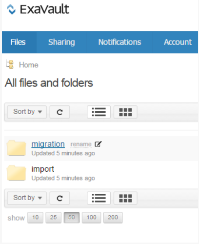

當你成功設定 FTP 資料夾時，系統會顯示「FTP 資料夾設定完成」的訊息。

## 建立一個BOX帳號 {#setupaboxaccount}

要建立 BOX 帳號並建立 BOX 資料夾，請執行以下步驟：

在整合管理首頁，選擇遷移。

在設定區塊，點選「請求盒子資料夾」。

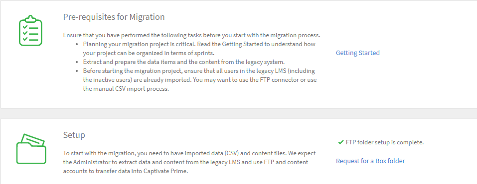

在欄位 ****[!UICONTROL Enter Email]**** 輸入你希望接收登入 Box 登入指示的電子郵件 ID。

點擊 **[!UICONTROL **「連結&#x200B;**」。]**

你會收到 Box 寄來的電子郵件，裡面有連結到共用資料夾。 如果你沒有盒子帳號，請點擊註冊並建立帳號。 登入指令會寄送至整合管理員的電子郵件 ID。

儲存連線後，遷移頁面會顯示訊息：「Box 資料夾設定完成」。

## 將內容遷移到 Learning Manager {#migratingthecontenttocaptivateprime}

在開始遷移之前，請注意以下幾點很重要：

* 同一帳戶在任何時間點只能有一個遷移專案處於活躍狀態。 在專案中，任何時間點只能有一個衝刺同時啟用。
* 你無法撤銷已經進行中的 Run。 不過，你可以利用 Learning Manager 每個功能中現有的刪除選項來撤銷任何資料或內容遷移。

一旦遷移專案開始，專案即進入「遷移中」狀態。 在此狀態下，除了整合管理員外，沒有其他使用者能登入學習管理員。

將訓練內容上傳至內容資料夾：

在整合管理首頁，點擊 **[!UICONTROL Migration.]**

在遷移首頁，系統會顯示已在組織中建立的遷移專案。

點擊頁面右上角的「**[!UICONTROL **New**]**」以建立遷移專案。

如果你還沒建立 FTP 資料夾，系統會提示你建立 Exavault 帳戶的 FTP 資料夾。 這是你開始建立遷移專案前必須做的步驟。 ***

在頁面 ****[!UICONTROL Create a New Migration Project]**** 中，請指定你的專案名稱。

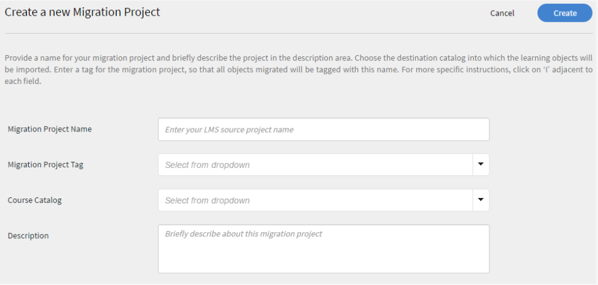

為你的專案、課程目錄指定標籤，並提供遷移專案的描述。 您的遷移資料項目會透過遷移專案標籤來識別。 如果你沒有特定的課程目錄，請從下拉選單選擇預設目錄，所有你透過遷移專案遷移的課程，都會包含在這個階段你選擇的課程目錄中。 如果你沒有選擇任何目錄，所有遷移的課程都會成為預設目錄的一部分。

喀嚓 **[!UICONTROL Create.]**

在 Sprint 設定頁面，為你的遷移專案建立一個 sprint。 在 Learning Manager 的遷移流程中，Sprint 定義了一組你選擇從現有 LMS 遷移的遷移項目。

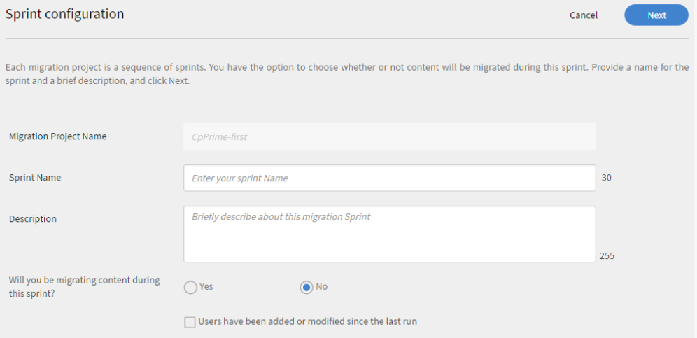

指定衝刺的名稱，並提供衝刺的描述。

選擇 ****[!UICONTROL Users have been added or modified since the last run check box]****，以同步使用者清單與學習管理員應用程式。 如果你是將內容和資料遷移到 Learning Manager 應用程式，這可能就不是必需的。 但如果你之前的 sprint 遷移與最新的 sprint 遷移之間有時間延遲，建議你選擇同步使用者清單。 此步驟可讓學習管理工具資料庫與你的 LMS 使用者同步。

***同步步驟建議在遷移enrollment.csv與user_course_grade.csv時使用。 此步驟使學習管理資料庫能與您的遷移資料庫同步，並確保所有在 Sprint 中需遷移的使用者都能在遷移資料庫中使用。***

點擊 **[!UICONTROL **&#x200B;下一步&#x200B;**。]**

點擊 **[!UICONTROL **Start**]** 以啟動您上傳的資料與內容的 Sprint 遷移。 在開始 Sprint Run 前點擊 ****[!UICONTROL Refresh]**** ，將 FTP 和 Content 資料夾與 Learning Manager 同步。

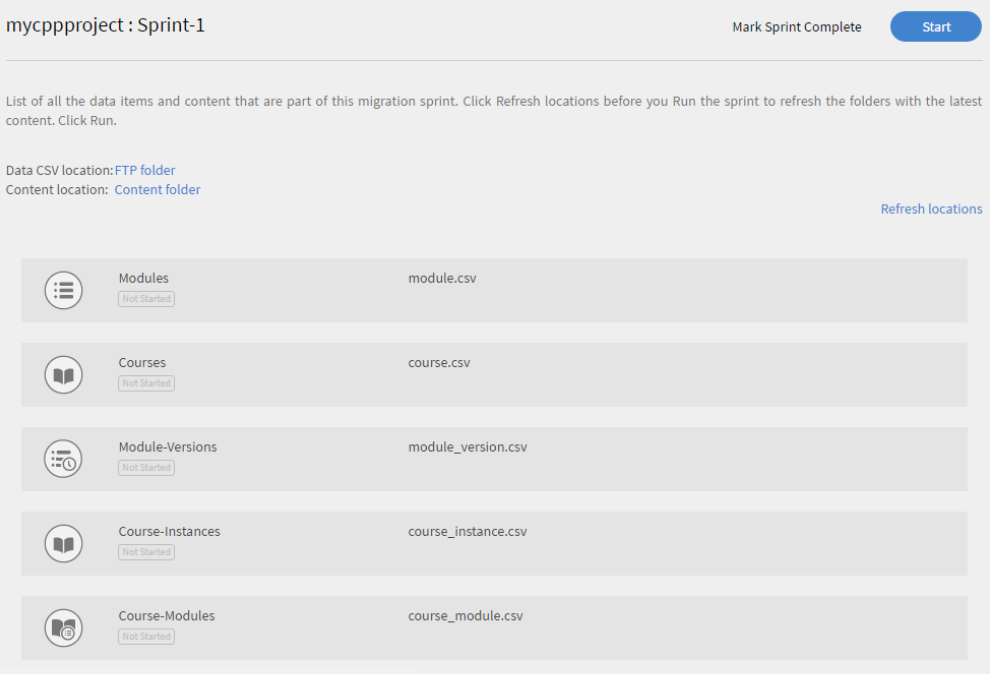

你可以在 Sprint 遷移過程中的任何時候點擊 ****[!UICONTROL Stop] 來中止遷移。

系統會顯示每個 sprint 資料項目與內容的遷移狀態。 檢查遷移衝刺執行中成功與失敗項目的數量。

如果你要上傳模組內容，請確保內容路徑資料夾在 *module_version.csv *檔案中提供。 若漏此步驟，遷移過程中可能會出錯。 例如，如果你要上傳自我進度的模組內容，例如影片，那麼你需要在 *module_version.csv *file 中指定相對的 Box URL 路徑。

以下提供遷移進度的範例快照供參考。 如快照所示，您可以查看每個遷移資料項目處理的紀錄數量，以及成功與失敗項目的狀態。 點擊「下載錯誤紀錄」以下載並查看錯誤日誌。 你可以在 CSV 裡修正問題，然後再用 FTP 上傳。

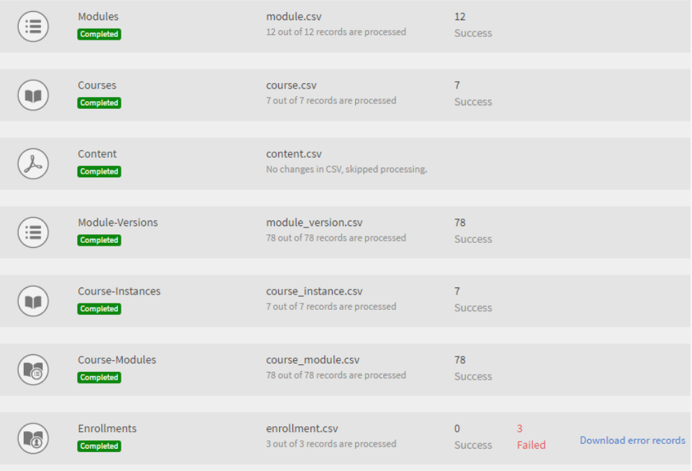

若要查看遷移專案中所有衝刺的清單，請點擊左側導覽窗格中的 **[!UICONTROL **Sprint**]**。 你可以查看所有衝刺清單、每個衝刺執行的跑動次數、開始日期、持續時間及完成狀態，如下方範例快照所示。

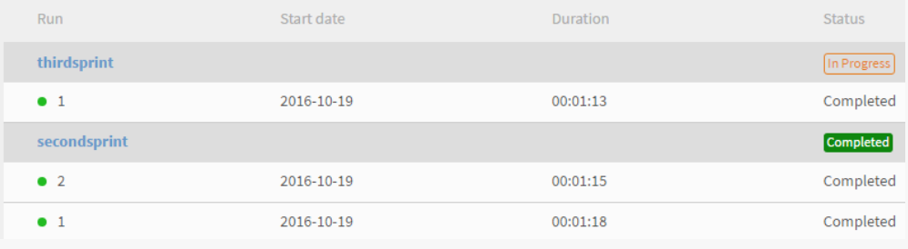

若要查看遷移專案中所有衝刺的清單，請點擊左側導覽窗格中的 **[!UICONTROL **Sprint**]**。 你可以查看所有衝刺清單、每個衝刺執行的跑動次數、開始日期、持續時間及完成狀態，如下方範例快照所示。

若要查看遷移專案中所有衝刺的清單，請點擊左側導覽窗格中的 **[!UICONTROL **Sprint**]**。 你可以查看所有衝刺清單、每個衝刺執行的跑動次數、開始日期、持續時間及完成狀態，如下方範例快照所示。

***在標記遷移專案為完成前，請確保專案中的所有衝刺都已完成。 一旦你標記遷移專案為完成，就無法回頭在該專案中建立任何衝刺。 你不能對該專案做任何修改。 你只能建立另一個遷移專案，然後把 sprint 加入去。***

在從組織舊有的學習管理系統遷移學習資料與內容後，請確認資料與內容是否正確匯入。 你可以以管理員身份登入，並確認匯入模組和課程的資料與內容是否可得來驗證

有關遷移的有用資源，請參考以下資料：

* 遷移問題故障排除
* 上傳 CSV 的常見問題
