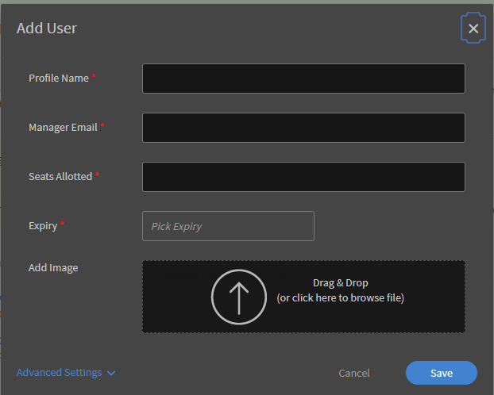
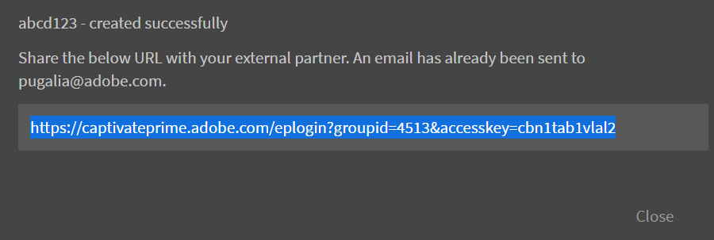
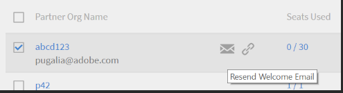
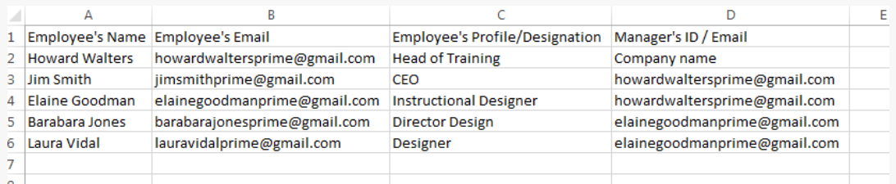
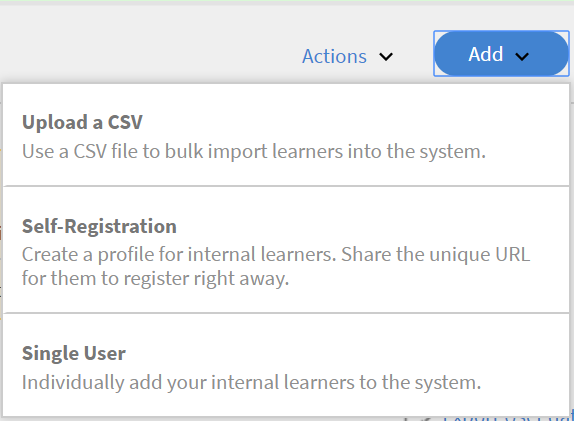
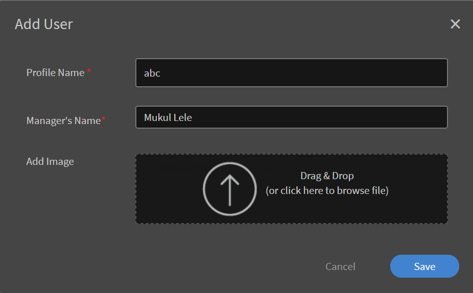
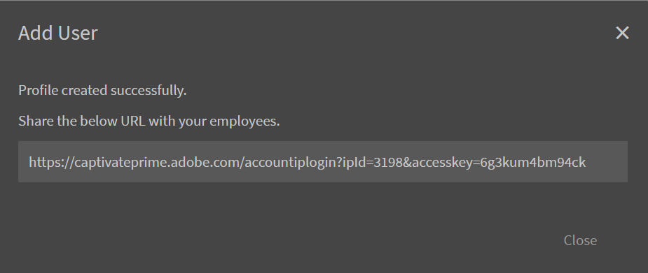
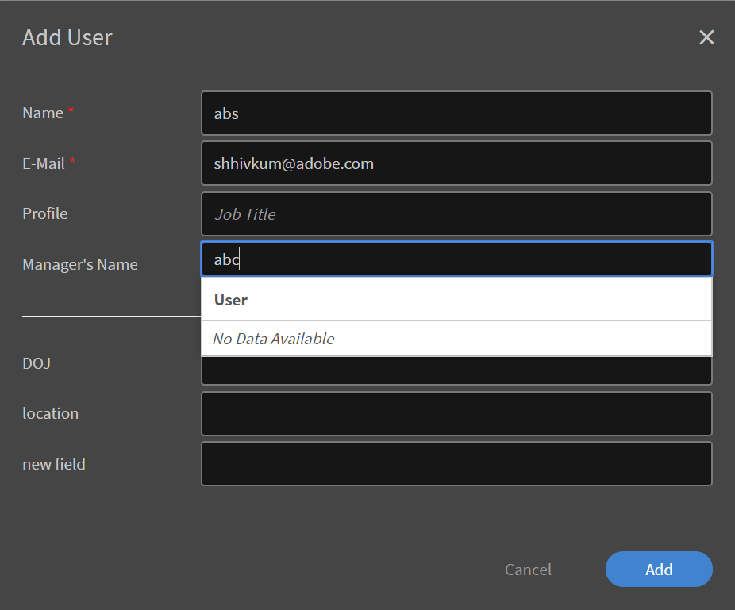
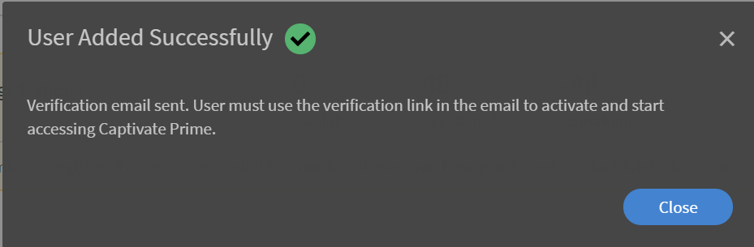
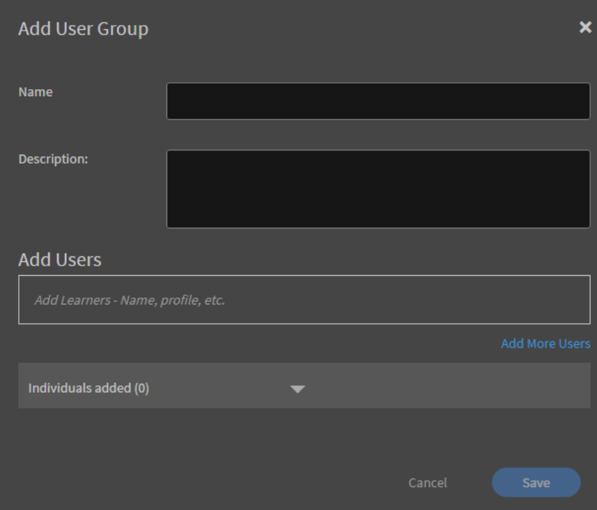

# 在Learning Manager中設定使用者

## 內部和外部使用者 {#internalandexternalusers}

在任何LMS中（包括Learning Manager），管理使用者都是很重要的一面。 Learning Manager可讓您將使用者分為內部和外部。 內部使用者是指屬於特定組織或群組的使用者。 一般而言，企業內的使用者是內部使用者。 這些使用者擁有由管理員或管理員所指派的特定學習物件，並具有特定的截止日期。

相反地，外部使用者通常是特定Learning Manager帳戶的臨時使用者。 這些使用者按一下透過電子郵件收到的暫時外部連結，即可存取特定學習物件。 外部使用者設定檔通常有到期日。 例如，進行Java認證的組織可能會有任何使用者暫時登入以完成相關課程，然後嘗試進行認證。 通常，專為外部使用者提供的課堂培訓和課程容量有限。

請閱讀下文，瞭解如何在Learning Manager中新增內部使用者和外部使用者。

## 設定外部使用者 {#setupexternalusers}

作為管理員，您可能會想要將外部使用者（例如合作夥伴組織的員工）新增到您的Learning Manager帳戶。 若要新增外部使用者：

1. 從**[!UICONTROL **管理員**]**登入頁面，按一下**[!UICONTROL **使用者**]**在左側導覽窗格中。
1. 在**中&#x200B;[!UICONTROL **使用者**]**page，按一下**[!UICONTROL **外部**]**在左側導覽窗格中。 系統會顯示「外部使用者」頁面，內含外部使用者清單（如果適用）。
1. 按一下**[!UICONTROL **新增**]**位於頁面的右上角。

   

1. 在**中&#x200B;[!UICONTROL **新增使用者**]**快顯對話方塊，下列欄位為必要欄位：

   * **[!UICONTROL **設定檔名稱**：]**指定您正在建立的外部設定檔名稱。
   * **[!UICONTROL **&#x200B;經理電子郵件&#x200B;**：]** 指定外部使用者管理員的電子郵件地址。
   * **[!UICONTROL **&#x200B;已分配的名額&#x200B;**：]** 指定可註冊課程的學習者人數。
   * **[!UICONTROL **&#x200B;到期&#x200B;**：]** 指定到期日，超過該日期外部使用者將無法註冊或使用課程。

1. 按一下 **[!UICONTROL **&#x200B;進階設定&#x200B;**.]**
1. 建立外部設定檔時，可選擇設定下列選項：

   * **[!UICONTROL **&#x200B;新增影像&#x200B;**：]** 拖放您想要的影像。 此影像會顯示在使用者的學習者頁面中。
   * **[!UICONTROL **&#x200B;登入要求&#x200B;**：]** 指定使用者需要登入的天數。 如果外部使用者超過此登入期間，學習者將無法存取或使用學習物件。
   * **[!UICONTROL **&#x200B;允許的網域&#x200B;**：]** 指定以逗號分隔的網域。 只有具有指定網域的使用者才能註冊該帳戶。
   * **[!UICONTROL **&#x200B;需要電子郵件驗證&#x200B;**：]** 如果您想要將驗證電子郵件傳送給使用者，請選取此核取方塊

1. 按一下 **[!UICONTROL Save.]**

   

   隨即顯示包含URL的快顯對話方塊。 您可以複製此URL並傳送給外部使用者。 預設情況下，會向使用者傳送包含此URL的電子郵件。

1. 當您新增外部設定檔時，它們會顯示在 **[!UICONTROL **&#x200B;外部使用者頁面&#x200B;**(**&#x200B;管理員&#x200B;**>**&#x200B;使用者&#x200B;**>**&#x200B;外部&#x200B;**)。]** 也會對這些使用者顯示名額限制、到期日和登入要求。
1. 若要隨時編輯外部使用者的設定，請按一下使用者名稱。 此 **[!UICONTROL Edit External Enrollment]** 對話方塊隨即顯示。 修改設定，然後按一下 **[!UICONTROL **&#x200B;儲存&#x200B;**.]**
1. 您也可以按一下外部設定檔旁邊的電子郵件/複製URL圖示，重新傳送歡迎電子郵件或隨時複製URL。

   

## 暫停外部使用者設定檔 {#pausetheexternaluserprofile}

將外部使用者群組新增至Learning Manager後，您也可以暫停外部使用者註冊程式。 當您暫停時，會封鎖外部使用者註冊程式。 不過，此程式只有在使用者尚未透過接受邀請註冊時才有效。

若要暫停外部使用者群組，請按一下**[!UICONTROL **動作**]**從頁面的右上角，然後選擇 **[!UICONTROL Pause]**.

## 繼續外部使用者設定檔 {#resumeexternaluserprofile}

您可以隨時選擇「繼續」選項來撤銷封鎖（暫停）。 按一下**[!UICONTROL **動作**]**位於頁面的右上角，然後選擇 **[!UICONTROL Resume]**.

**[!UICONTROL External user states]**

在Learning Manager中，下列狀態適用於外部使用者：

* **非使用中狀態**  — 在此狀態下，外部使用者註冊過期。 管理員透過新增使用者工作流程新增外部使用者時，可設定其到期日。
* **作用中狀態**  — 在此狀態下，外部使用者可註冊Learning Manager應用程式，也可登入應用程式。
* **暫停**  — 在此狀態下，會封鎖外部使用者的註冊程式。 但是，現有的使用者可以繼續登入。

## 設定內部使用者 {#setupinternalusers}

身為管理員，您可能想要為企業或組織設定使用者。 這些使用者也稱為內部使用者。 內部使用者可使用單一登入或使用Adobe ID登入應用程式。 接著，這些使用者就可以依需求存取及使用學習物件。 若要設定組織的內部使用者，有三種可能的方法：

* 使用CSV大量新增使用者
* 透過自助註冊新增使用者
* 新增單一內部使用者

## 使用CSV檔案新增使用者 {#addingusersusingacsvfile}

如果使用者人數很多，您可以選擇此方法來新增內部使用者。 第一次使用CSV來新增使用者時，必須將csv資料內容對應至應用程式標籤。 隨後當您新增使用者或更新使用者資料時，相同的對應會保留。 大量新增內部使用者：

1. 在 **[!UICONTROL Administrator Home]** 頁面，按一下**[!UICONTROL **使用者**]**在左側導覽窗格中。
1. 按一下 **[!UICONTROL **&#x200B;新增&#x200B;**>**&#x200B;上傳CSV **.]**
1. 在快顯對話方塊中，按一下 **[!UICONTROL **&#x200B;匯入&#x200B;**.]**
1. 瀏覽至儲存CSV檔案的位置。 按一下 **[!UICONTROL Open]**.
1. 匯入CSV檔案，並將該CSV檔案的內容與應用程式標籤對應。 此步驟僅適用於第一次上傳CSV檔案時。
1. 按一下**[!UICONTROL **儲存**]**儲存對應。
1. 按一下**[!UICONTROL **新增**]**上傳已對應至應用程式資料的CSV檔案。

### 建立CSV檔案以供上傳時的注意事項： {#considerationswhencreatingthecsvfileforupload}

當您建立CSV檔案以上傳內部使用者時，以下是您必須輸入資料的部分必要欄位：員工姓名、員工電子郵件、員工設定檔或指定，以及經理階層。

每個員工的姓名和電子郵件可直接對應至應用程式資料。 請注意，您必須指定CSV檔案中指定的電子郵件為「經理電子郵件」。 您可以在建立CSV檔案時定義Manager ID，也可以在上傳CSV檔案時指定與Manager ID對應的電子郵件ID。

***在新增ID作為員工的經理ID之前，請確保將經理新增為CSV檔案中的員工。***

***請確定專案之間沒有額外的空格，才能成功上傳CSV檔案。***

請在此處檢視CSV檔案的範例快照：

若要下載範例CSV檔案，請下載 `<give link to zip file>`.

<!--Zip file reference, no source file-->

### 設定根使用者 {#settinguprootuser}

自動大量匯入使用者。

## 透過自助註冊新增使用者 {#addingusersthroughselfregistration}

除了大量新增內部使用者外，您也可以透過自行註冊來新增使用者。 您可以透過自助註冊，讓員工在您的Learning Manager帳戶中註冊成為學習者。 當您建立自助註冊設定檔時，會建立唯一的URL。 與員工共用此URL，讓員工可在Learning Manager中註冊。

1. 在 **[!UICONTROL Administrator Home]** 頁面，按一下 **[!UICONTROL Users]** 於左側導覽窗格中。
1. 按一下 **[!UICONTROL **&#x200B;新增&#x200B;**>**&#x200B;自助註冊&#x200B;**.]**

   

1. 在 **[!UICONTROL Add User]** 快顯對話方塊，在 **[!UICONTROL Profile Name]** 欄位。
1. 在 **[!UICONTROL Manager's Name]** 欄位，輸入員工經理的名稱。
1. 您可以選擇使用 **[!UICONTROL Add Image]** 欄位。
1. 按一下 **[!UICONTROL Save]**.

   

   系統會顯示另一個快顯對話方塊，其中包含已成功建立設定檔的訊息。 此對話方塊中也會產生唯一的URL。

1. 與員工共用此URL，讓員工可自行註冊為學習者。

   

## 在Learning Manager中新增單一使用者 {#addsingleusersincaptivateprime}

新增單一使用者是您將內部使用者新增至帳戶的第三個方法。 如果您想要新增一些使用者，此程式是理想選擇。 若要新增單一使用者：

1. 在 **[!UICONTROL Administrator Home]** 頁面，按一下 **[!UICONTROL Users]** 於左側導覽窗格中。
1. 按一下 **[!UICONTROL **&#x200B;新增&#x200B;**>**&#x200B;單一使用者&#x200B;**.]**

1. 在「新增使用者」彈出式對話方塊中，指定使用者的下列詳細資料：

   * **[!UICONTROL Name]** **[!UICONTROL :]** 指定員工或內部使用者的名稱。 此欄位為必填。

   * **[!UICONTROL Email]** **[!UICONTROL :]** 指定員工的電子郵件識別碼。 此欄位為必填。

   * **[!UICONTROL Profile]** **[!UICONTROL :]** 指定員工的指定或職稱。

   * **[!UICONTROL **&#x200B;經理姓名&#x200B;**：]** 指定Manager的名稱。 管理員應該已經新增到要在此指定的資料庫中。
   * **[!UICONTROL ** DOJ **：]** 指定員工加入的日期。
   * **[!UICONTROL **位置**：]**指定員工的位置。 例如，如果您的組織位於數個地理位置，請指定員工所在的位置。

   

1. 按一下 **[!UICONTROL Add]**.
1. 系統會顯示使用者已成功新增的訊息。 使用者會以指定的電子郵件ID收到驗證連結。 使用者可以按一下此連結來啟動其帳戶，並開始存取Learning Manager。

   

## 在Learning Manager中管理使用者群組 {#managingusergroupsincaptivateprime}

使用者群組不過是屬於已定義類別的一組使用者。 身為管理員，您可以使用使用者群組來根據學習者的屬性快速選取學習者。 此外，您可以快速將標誌或目錄指派給使用者群組，並產生其進度的自訂報告。

Learning Manager中有兩種型別的使用者群組：自訂和自動產生。 當您將學習者新增至您的帳戶時，系統會根據您帳戶中使用者的角色和屬性自動建立某些預設群組。 這些群組是自動產生的。 例如，含有所有學習者或所有作者的群組。

***您無法編輯自動產生群組的名稱和說明。***

若要在Learning Manager中檢視自動產生的使用者群組，請在左窗格中按一下 **[!UICONTROL Auto-generated]**. 應用程式會顯示您的帳戶可用的所有自動產生使用者群組清單。

您也可以在Learning Manager中建立具有選定使用者清單的自訂群組。 自訂群組可讓您指定使用者群組的名稱、說明和屬性。 您在Learning Manager中建立的自訂群組本質上為動態群組。 也就是說，如果新使用者新增了類似的屬性，就會自動新增到這些使用者群組中。

## 建立自訂使用者群組 {#createcustomusergroups}

1. 在Learning Manager管理員首頁中，按一下 **[!UICONTROL Users]**.
1. 在「自訂使用者群組」頁面中，按一下**[!UICONTROL **新增**]**從頁面的右上角。

   系統會顯示 **[!UICONTROL Add User Group]** 對話方塊。

   

1. 指定使用者群組的名稱和說明。 例如，開發使用者，其中包含產品開發團隊的使用者。
1. 若要將使用者新增至自訂使用者群組，請在以下位置輸入使用者名稱或使用者設定檔： **[!UICONTROL **&#x200B;新增使用者&#x200B;**欄位。]**
1. 若要新增更多使用者至自訂群組，請按一下 **[!UICONTROL **&#x200B;新增更多使用者&#x200B;**.]**
1. 新增所有使用者後，按一下「 **[!UICONTROL Save]**儲存自訂使用者群組。

