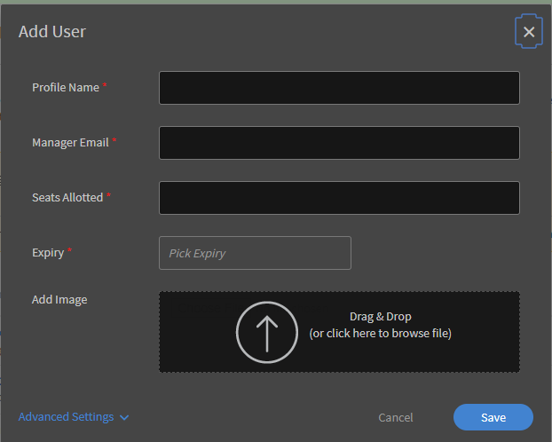
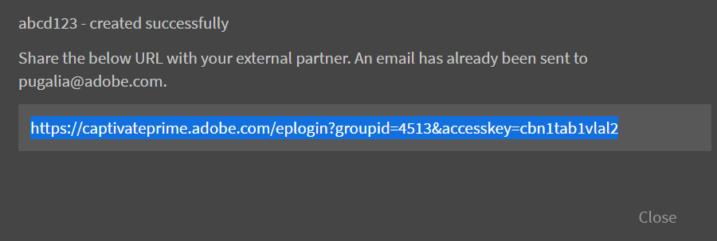
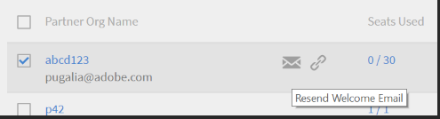
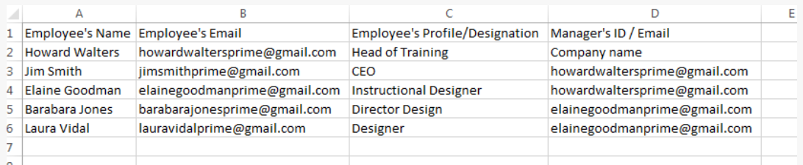
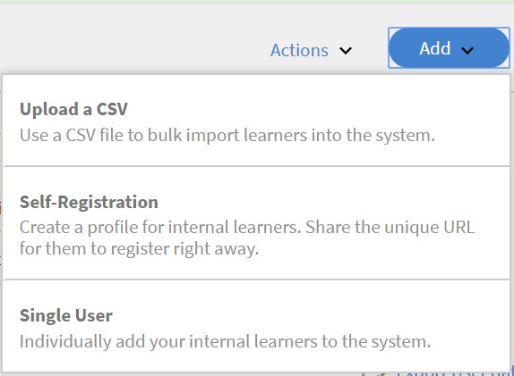
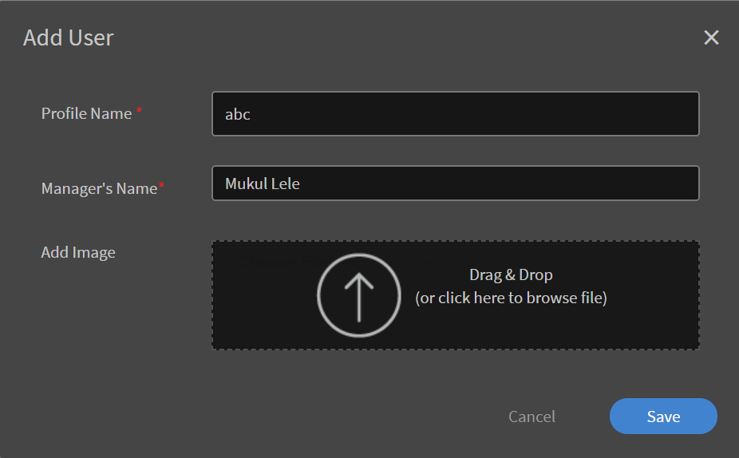
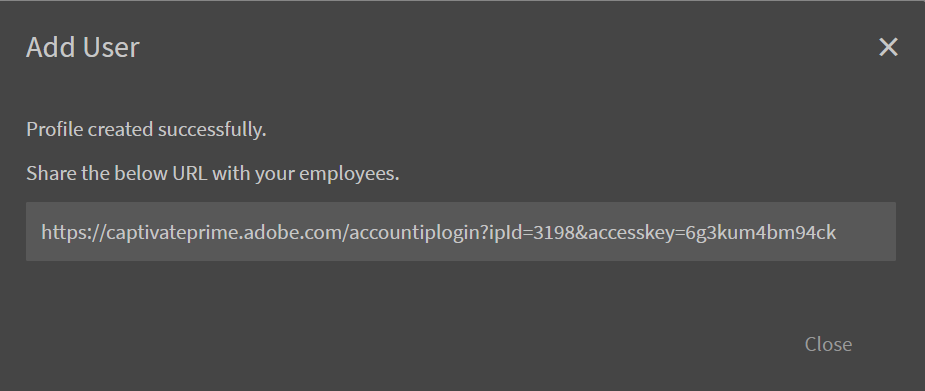
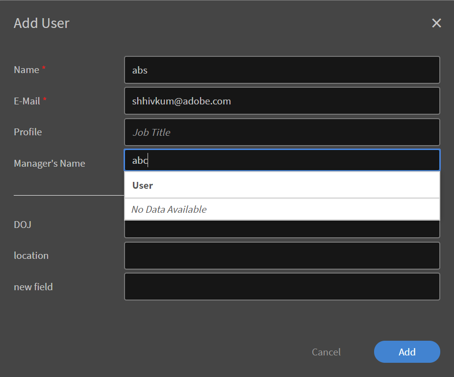
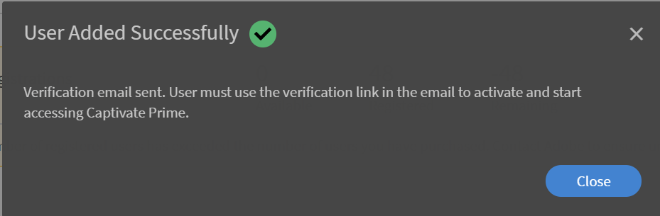
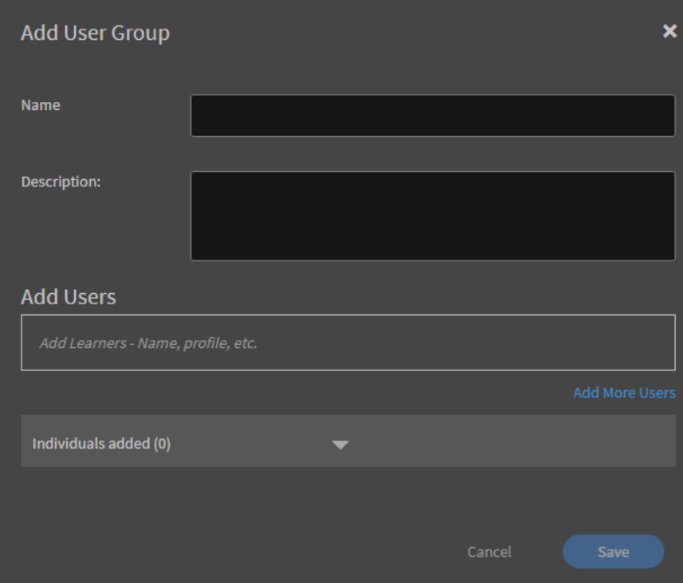

# 在 Learning Manager 中設定使用者

## 內部與外部使用者 {#internalandexternalusers}

在任何 LMS，包括學習管理員中，管理使用者都是重要的一環。 學習管理員允許您將使用者分類為內部與外部。 內部使用者是指屬於特定組織或團體的使用者。 一般來說，企業內的使用者是內部使用者。 這些使用者有特定的學習對象，並有特定的截止日期，這些期限由他們的主管或管理員指派。

相較之下，外部使用者通常是特定學習管理帳號的臨時使用者。 這些使用者可能會透過點擊透過電子郵件收到的臨時外部連結來存取特定的學習對象。 外部使用者設定檔通常有有效期限。 例如，一個負責 Java 認證的組織，可能會讓任何使用者暫時登入完成相關課程，然後嘗試認證。 通常，面向外部使用者的課堂訓練和課程容量也有限。

繼續閱讀，了解如何在 Learning Manager 中新增內部使用者和外部使用者。

## 設定外部使用者 {#setupexternalusers}

作為管理員，你可能會想將外部使用者（例如合作夥伴組織的員工）加入你的 Learning Manager 帳號。 新增外部使用者：

1. 從 **[!UICONTROL **Administrator**]**login 頁面，點擊左側導覽窗格的 **[!UICONTROL **Users**]**。
1. 在 **[!UICONTROL **Users**]** 頁面，點擊左側導覽窗格的 **[!UICONTROL **External**]**。 系統會顯示外部使用者頁面及外部使用者清單（如適用）。
1. 點擊頁面右上角的 **[!UICONTROL **Add**]**。

   

1. 在 **[!UICONTROL **新增使用者**]**彈出對話框中，以下欄位為必填：

   * **[!UICONTROL **&#x200B;個人檔案名稱**：]**請指定你正在建立的外部個人檔案名稱。
   * **[!UICONTROL **&#x200B;管理員電子郵件&#x200B;**：]** 請指定外部使用者經理的電子郵件地址。
   * **[!UICONTROL **&#x200B;分配名額&#x200B;**：]** 指定可報名課程的學習人數。
   * **[!UICONTROL **&#x200B;過期：**]**&#x200B;指定過期日期，超過此期限外，外部使用者無法註冊或使用課程。

1. 點選 **[!UICONTROL **&#x200B;進階設定&#x200B;**。]**
1. 建立外部設定檔時，可選擇性地設定以下選項：

   * **[!UICONTROL **&#x200B;新增圖片&#x200B;**：]** 拖放你想要的圖片。 此圖片顯示於學習者頁面，供使用者使用。
   * **[!UICONTROL **&#x200B;登入要求&#x200B;**：]** 指定使用者需要登入的天數。 若外部使用者超過此登入時間，學習者將無法存取或使用該學習物件。
   * **[!UICONTROL **&#x200B;允許的網域&#x200B;**：]** 請以逗號標示網域。 只有擁有指定網域的用戶才能註冊該帳號。
   * **[!UICONTROL **&#x200B;電子郵件驗證要求&#x200B;**：]** 若您希望收到驗證郵件，請勾選此方框

1. 喀嚓 **[!UICONTROL Save.]**

   

   會顯示一個包含網址的彈出對話框。 你可以複製這個網址並寄給外部使用者。 預設情況下，會寄送帶有此網址的電子郵件給使用者。

1. 當你新增外部設定檔時，它們會顯示在 **[!UICONTROL **&#x200B;外部使用者頁面&#x200B;**（**&#x200B;管理員&#x200B;**>**&#x200B;使用者&#x200B;**>**&#x200B;外部&#x200B;**）。]** 這些用戶也會顯示座位限制、到期日及登入要求。
1. 若要隨時編輯外部使用者的設定，請點擊使用者名稱。 **[!UICONTROL Edit External Enrollment]**&#x200B;對話框會出現。修改設定，然後點擊 **[!UICONTROL **&#x200B;儲存&#x200B;**。]**
1. 您也可以隨時點擊外部個人資料旁的電子郵件/複製網址圖示，重新寄出歡迎信箱或複製網址。

   

## 暫停外部使用者設定檔 {#pausetheexternaluserprofile}

在 Learning Manager 新增外部使用者群組後，你也可以暫停外部使用者註冊流程。 暫停時，外部用戶註冊流程會被阻擋。 不過，這個流程只有在用戶尚未接受邀請註冊時才有效。

若要暫停外部使用者群組，請從頁面右上角點擊「**[!UICONTROL **Actions**]**，並選擇 **[!UICONTROL Pause]**。

## 恢復外部使用者檔案 {#resumeexternaluserprofile}

在任何時候，你都可以選擇「繼續」選項來解除阻塞（暫停）。 點擊頁面右上角的 **[!UICONTROL **Actions**]** 並選擇 **[!UICONTROL Resume]**。

**[!UICONTROL External user states]**

在 Learning Manager 中，外部使用者適用以下狀態：

* **非活躍狀態** - 在此狀態下，外部使用者的註冊已過期。 管理員在新增使用者工作流程中，設定外部使用者的到期日。
* **主動狀態** - 在此狀態下，外部使用者可以註冊到 Learning Manager 應用程式，並登入該應用程式。
* **暫停** - 此狀態下，外部使用者的註冊流程會被封鎖。 不過，現有使用者仍可繼續登入。

## 建立內部使用者 {#setupinternalusers}

作為管理員，你可能會想為你的企業或組織設定使用者。 這些使用者也被稱為內部使用者。 內部使用者可透過單一登入或 Adobe ID 登入應用程式。 這些使用者可依需求存取並使用學習對象。 要為組織設定內部使用者，有三種可能的方法：

* 使用 CSV 批量新增使用者
* 透過自助註冊新增使用者
* 新增單一內部使用者

## 使用 CSV 檔案新增使用者 {#addingusersusingacsvfile}

如果使用者數量眾多，你可以選擇此方法新增內部使用者。 當你第一次使用 CSV 新增使用者時，必須將 CSV 資料內容映射到應用程式標籤。 之後當你新增使用者或更新使用者資料時，相同的映射會被保留。 要大量新增內部使用者：

1. 在頁面 **[!UICONTROL Administrator Home]** 上，點擊左側導覽窗格中的 **[!UICONTROL **Users**]**。
1. 點擊 **[!UICONTROL **&#x200B;新增&#x200B;**>**&#x200B;上傳 CSV **檔。]**
1. 在彈出視窗中，點擊 **[!UICONTROL **&#x200B;匯入&#x200B;**。]**
1. 瀏覽你儲存 CSV 檔案的位置。 點擊 **[!UICONTROL Open]**。
1. 匯入 CSV 檔案，並將 CSV 檔案內容與應用程式標籤對應。 此步驟僅適用於您首次上傳 CSV 檔案時。
1. 點擊 **[!UICONTROL **Save**]** 以儲存映射。
1. 點擊 **[!UICONTROL **Add**]** 以上傳已映射到應用程式資料的 CSV 檔案。

### 建立上傳 CSV 檔案時的考量事項： {#considerationswhencreatingthecsvfileforupload}

當您建立用於上傳內部使用者的 CSV 檔案時，以下是必須輸入資料的必填欄位：員工姓名、員工電子郵件、員工個人資料或職稱，以及經理階層。

每位員工的姓名與電子郵件可以直接對應到應用程式資料。 請注意，您必須指定 CSV 檔案中指定的電子郵件，稱為經理電子郵件。 你可以在建立 CSV 檔案時定義經理 ID，或是在上傳 CSV 檔案時指定與經理 ID 對應的電子郵件 ID。

***在你將 ID 加入員工的經理 ID 之前，請確保 CSV 檔案中已將經理加入為員工。***

***確保條目之間沒有多餘的空格，才能成功上傳 CSV 檔案。***

請在此查看 CSV 檔案的範例快照：

若要下載範例 CSV 檔案，請下載 `<give link to zip file>`。

<!--Zip file reference, no source file-->

### 設定根使用者 {#settinguprootuser}

自動化大量匯入使用者。

## 透過自助註冊新增使用者 {#addingusersthroughselfregistration}

除了大量新增內部用戶外，你也可以自行註冊新增用戶。 你可以使用自助註冊功能，讓員工能將自己註冊為學習者到你的學習管理員帳號。 當你建立自助註冊個人檔案時，會建立一個獨特的網址。 將此網址分享給員工，讓他們能在學習管理員中註冊。

1. 在頁面 **[!UICONTROL Administrator Home]** 上，點擊 **[!UICONTROL Users]** 左側導覽窗格。
1. 點擊 **[!UICONTROL **&#x200B;新增&#x200B;**>**&#x200B;自助註冊&#x200B;**。]**

   

1. 在 **[!UICONTROL Add User]** 彈出視窗中，請在欄位中指定員工 **[!UICONTROL Profile Name]** 姓名。
1. 在欄位 **[!UICONTROL Manager's Name]** 中輸入該員工的經理姓名。
1. 你也可以選擇用欄位 **[!UICONTROL Add Image]** 新增員工的頭像。
1. 點擊 **[!UICONTROL Save]**。

   

   系統會顯示另一個彈出視窗，顯示個人資料已成功建立。 此對話框中也會產生獨特的 URL。

1. 將此網址分享給員工，以便員工自行註冊為學習者。

   

## 在學習管理員中新增單一使用者 {#addsingleusersincaptivateprime}

新增單一使用者是你新增內部使用者到帳號的第三種方法。 當你想增加幾個使用者時，這個程序是理想的。 新增單一使用者：

1. 在頁面 **[!UICONTROL Administrator Home]** 上，點擊 **[!UICONTROL Users]** 左側導覽窗格。
1. 點擊 **[!UICONTROL **&#x200B;新增&#x200B;**>**&#x200B;單一使用者&#x200B;**。]**

1. 在「新增使用者」彈出視窗中，請為使用者指定以下細節：

   * **[!UICONTROL Name]****[!UICONTROL :]**&#x200B;請指定員工或內部使用者的姓名。這個欄位是必修的。

   * **[!UICONTROL Email]****[!UICONTROL :]**&#x200B;請指定員工的電子郵件 ID。這個欄位是必修的。

   * **[!UICONTROL Profile]****[!UICONTROL :]**&#x200B;請明確說明員工的職稱或職稱。

   * **[!UICONTROL **&#x200B;經理姓名&#x200B;**：]** 請指定經理的姓名。 管理器應該已經加入了這裡指定的資料庫。
   * **[!UICONTROL **&#x200B;司法部&#x200B;**：]** 請說明員工入職日期。
   * **[!UICONTROL **&#x200B;地點**：]**請指定員工所在地。 例如，如果您的組織分布在多個地理位置，請指定員工所在的位置。

   

1. 點擊 **[!UICONTROL Add]**。
1. 系統會顯示使用者已成功新增的訊息。 使用者會在指定的電子郵件 ID 中收到一個驗證連結。 使用者可以點擊此連結來啟用他的帳號，並開始存取學習管理員。

   

## 在 Learning Manager 管理使用者群組 {#managingusergroupsincaptivateprime}

使用者群組不過是一組與特定類別相關的使用者。 作為管理員，你可以利用使用者群組根據學習者的屬性快速選擇學習者。 此外，你還能快速為用戶群組指派標誌或目錄，並產生客製化的進度報告。

Learning Manager 中有兩種使用者群組：自訂與自動生成。 當你將學習者加入帳戶時，會根據帳戶中使用者的角色和屬性自動建立一些預設群組。 這些群組是自動生成的。 例如，一個全是學習者或全作者的群組。

***你無法編輯自動生成群組的名稱和描述。***

若要在學習管理員中查看自動產生的使用者群組，請在左側窗格點擊 **[!UICONTROL Auto-generated]**。 應用程式會顯示所有自動產生的用戶群組清單，這些群組可用於你的帳號。

你也可以在學習管理員中建立包含特定使用者清單的自訂群組。 自訂群組允許你指定使用者群組的名稱、描述和屬性。 你在 Learning Manager 中建立的自訂群組是動態的。 也就是說，如果新增具有相似屬性的新使用者，他們會自動加入這些使用者群組。

## 建立自訂使用者群組 {#createcustomusergroups}

1. 在學習管理員管理員首頁，點擊 **[!UICONTROL Users]**。
1. 在自訂使用者群組頁面，從頁面右上角點擊 **[!UICONTROL **Add**]**。

   系統會顯示對話 **[!UICONTROL Add User Group]** 框。

   

1. 請指定使用者群組的名稱和描述。 例如，Dev-Users，包含產品開發團隊的使用者。
1. 透過在新增使用者&#x200B;**欄位輸入使用者名稱或使用者的個人檔案&#x200B;**[!UICONTROL **，將使用者加入自訂使用者群組。]**
1. 若要新增更多使用者到自訂群組，請點擊 **[!UICONTROL **「新增更多使用者&#x200B;**」。]**
1. 新增所有使用者後，點選 **[!UICONTROL Save]** 以儲存自訂使用者群組。
