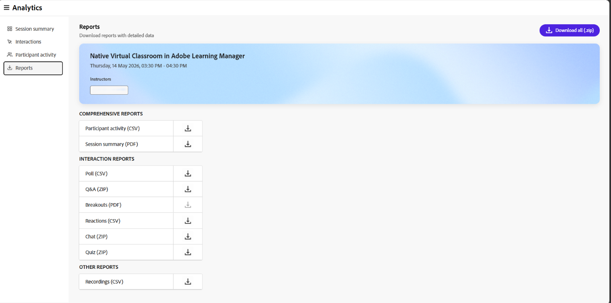

# 會話儀表板的組成部分

## 概觀

Live Hub 的 Session 儀表板包含多個區塊，提供關於課程表現與學習者參與度的詳細洞察。

每個環節都協助講師分析參與度、了解學習者行為，並評估 Live Hub 課程的成效。

## 會議摘要

會議摘要概述了現場與錄製的課程，包括錄音。 內容包括報名與加入學習人數、課程時長、參與人數、參與者參與度及觀看次數等細節。

選擇 **會議摘要（PDF）** 以下載摘要。

*選擇會議摘要（PDF）以下載摘要。*

您可以查看以下細節：

* **課程長度**：查看整體即時課程時長及學習者平均出席時間。

* **出席率**：查看註冊學習人數，以及已加入與未加入的人數。

* **出席人數隨時間**&#x200B;變化：檢視會議期間出席人數的變化，包括高峰出席人數及總參與者人數。

* **參與者參與**&#x200B;度：檢視學習者在課程中的參與情況，包括回答的投票數量、聊天互動、提出的問題、提交的測驗數量及回應。

### 錄音

查看與會話錄音相關的洞察。 這些洞察有助於你了解學習者的參與度並記錄使用情況。 您也可以下載錄音並取得報告以進行進一步分析。

* **總觀看次數**：錄影被觀看的總次數，以及獨立觀眾數。

* **同時參加現場課程**&#x200B;的觀眾人數：參加現場課程後，之後觀看錄影的學習者人數。 選擇 **下載清單** 以查看學習者名單。

* **平均觀看時長**：學習者觀看錄影的平均時間。

*會話儀表板檢視記錄洞察。*

在錄影選項中，可執行以下動作：

* 選擇 **下載** 以下載錄音。

* 選擇 **「編輯錄影** 」以修改錄影內容。 它會在錄音播放器中開啟錄音。

## 互動

從互動中觀察學習者如何互動並參與課程。 透過互動工具追蹤投票、問答指標及與會者反應的回應。

在左側面板選擇 **互動** ，即可查看與會者的互動方式。

互動儀表板包含以下分頁：

### 民調

投票分頁允許你查看新增到投票中的問題與回應。 你也可以從 **投票** 標籤下載所有投票互動的報告。 報告內容包括：

* 參與者資料，包括名字、姓氏及電子郵件地址。

* 投票號碼、投票類型和投票問題。

* 每位參與者對投票的回應。

*會話儀表板檢視投票互動。*

### 測驗

這個分頁讓你能在直播時查看測驗的指標。 其中包含以下面板：

* 下載測驗互動報告（ZIP 格式）。

* 查看一張示意圖，展示提交測驗、未完成或未嘗試的學習者。

* 測驗題數。 選擇 **檢視清單** 以查看所有問題。

* 選擇 **「查看詳細報告** 」，可依問題清單、問題、排行榜及個別回應查看參與者報告。

* 答案的平均準確度。 選擇 **「查看排行榜** 」以查看比分。

* 嘗試測驗的平均時間。

*會話儀表板檢視測驗互動。*

## 突圍事件

觀看學習者在現場課程中如何參與分組討論。 本節提供分組活動摘要及每場分組討論的詳細見解。

* **分組討論：**&#x200B;本場次中總共進行的分組討論次數。

* **分組時間**：所有分組會議的總總時長。

* **分組討論**&#x200B;的參與者人數：參與分組討論的人數。

選擇 **分組報告（PDF）** 以下載報告。

*會話儀表板檢視，顯示分組會議的洞察。*

對於每場分組討論，您可以查看課程名稱、時長及開始時間。 您也可以查看：

* **參與者**：分組討論的總參與者人數。

* **參與分布**：依參與程度劃分參與者。 可用的等級有高、中、低。

* **房間**：已建立的分組討論室數量。

選擇 **查看詳情** 以展開分組討論並查看各房間層級的見解。 選擇 **隱藏細節** 以再次摺疊。

### 分組討論室詳情

在展開後的檢視中，每個房間會顯示以下內容：

* **指示**：在場給參與者的提示或活動。

* **聊天記錄**：選擇 **聊天記錄** 以查看房間內的聊天內容。

* **教室內**&#x200B;的教練：一張列出每位教練姓名、分組時間及發言時間的表格。

* **房間內**&#x200B;參與者：一張列出每位參與者姓名、分組時間、發言時間及參與程度的表格。

*分組討論室的講師與參與者資料表。*

## 其他互動

從右上角下拉選單選擇 **下載互動報告** ，即可下載 **問答** 與 **反應** 報告。

*會話儀表板檢視，顯示下載互動報告的選項。*

### 問答指標

請查看以下問答指標的屬性：

* 問了完全的問題。

* 無數未解的問題。

* 問問題的參加人數。

* 問了多題的參加者數量，這些人很可能是頂尖的潛在客戶。

* 回答問題的平均時間。

### 反應

觀看學習者在課程中的反應，包括同意、不同意、掌聲與笑聲。

請在圖表上查看以下細節：

* 全體反應。

* 至少有一次反應的參加者人數。

* 總點擊數。

* 獨特的參加者。

* 以圖形化方式呈現每位不同參與者對每次反應的點擊總數。

## 參與者活動

**參與者活動**&#x200B;部分提供課程中個別學習者參與度的綜合視圖。它幫助講師分析參與程度，並追蹤學習者在不同活動中的互動。

從左側面板選擇 **參與者活動** ，可查看詳細的學習者層級洞察。 選擇 **參與者活動報告（CSV** ）以下載完整報告。

*表中顯示參與者活動報告細節。*

表格顯示學習者活動的以下資訊：

* **參與者資料**：姓名及電子郵件。

* **出席**&#x200B;時長：參與者出席會議的百分比。

* **回答**&#x200B;的投票數量：參與者回應的投票數量。

* **提交**&#x200B;測驗數量：參與者提交的測驗數量。

* **總測驗分數**：參加者在測驗中獲得的分數。

* **講者時間**：參與者在場次中發言的時長。

* **攝影機時間**：學習者攝影機啟動的時間長度。

* **問**&#x200B;問題數：參與者提出的問題數量。

* **反應**：參與者分享的反應數量。

* **懷疑反應**：參與者在療程中表示懷疑的次數。

## 報表

作為講師，從集中中心下載不同活動的報告。 這些報告記錄了現場及錄製表演期間與觀眾互動與互動的過程。

下載報告：

1. 從左側面板選擇 **下載報告**。

1. 選擇 **下載全部（.zip）** 以下載所有活動的綜合報告。

   
   *選擇「全部下載」（.zip）以下載合併報告。*

1. 請選擇每份報告旁的下載圖示，即可逐一下載。
