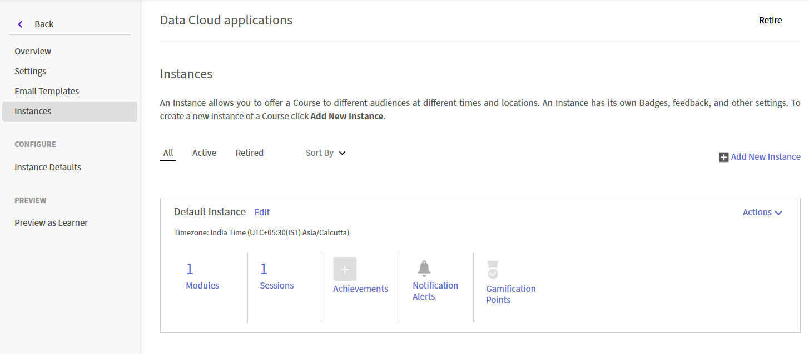

# 建立一個即時中樞（測試版）會話

使用 Live Hub 在 Adobe Learning Manager 課程中提供由講師主導的即時訓練。 你可以將 Live Hub 課程與自學內容結合，創造混合式學習體驗。

當你在課程中新增虛擬教室模組時，請選擇將承辦該線上課程的虛擬訓練工具。 你可以選擇 **Adobe 內建的 AI 虛擬訓練解決方案 Live Hub**，或使用外部供應商如 **Adobe Connect**。

>[!NOTE]
>
> Live Hub 只有在你的管理員在 Live Hub 設定中啟用時，才會以 Live Virtual Training Tool 的選項出現。 如果沒有啟用，請使用外部服務供應商如 Adobe Connect。 欲了解更多資訊，請參閱 [啟用 Live Hub](../administrators/feature-summary/enable-live-hub.md) 。

在建立 Live Hub 課程時，你可以：

* 在課程中新增一個或多個 Live Hub 課程。

* 您可以手動選擇講師，或使用AI輔助的講師推薦。

* 可以設定單一預設實例，或為不同時程或受眾建立多個實例。

本文說明如何建立 Live Hub 課程、指派講師，以及設定課程實例。

## 建立 Live Hub 課程

當你新增虛擬教室模組時，預設實例會自動建立。 當你想為所有學習者提供單一課程或標準時間表時，這非常有用。

要建立 Live Hub 課程：

1. 以作者身份登入 Adobe Learning Manager。

1. 選擇 **建立課程**。

1. 在 **課程目錄** 頁面，選擇 **新增**，然後輸入以下細節：

   1. 球場名稱

   1. 簡要說明

   
   *在新增模組前，請輸入課程名稱和簡短說明。*

1. 在模組區段選擇&#x200B;**內容**>**新增模組**。  **&#x200B;** 會跳 **出「選擇模組類型** 」視窗。

1. 選擇 **虛擬教室** ，輸入課程細節，包括標題、說明、時區、開始與結束日期，以及開始與結束時間。

1. 在 Live Virtual Training Tools 中選擇 **Live Hub**。**&#x200B;**

   
   *選擇 Live Hub 以啟用 AI 驅動的講師推薦。*

1. 透過以下選項之一新增講師：

   1. 在講&#x200B;**師欄位輸入講師姓名**。

   1. 選擇 **使用 AI** 尋找教師以查看 AI 推薦的教師。 [欲了解更多資訊，請使用「新增講師」](#add-instructors-using-instructor-finder)功能。

1. 選擇 **新增** > **儲存**。

1. 請在 **課程技能** 區段選擇所需技能。

1. 選擇 **技能等級**，然後檢視或更新 **最大信用點**&#x200B;數。

   
   *指定一項技能與技能等級，以定義完成課程後學習者可獲得的學分。*

1. 選擇 **儲存** > **發佈**。 課程已成功在 Adobe Learning Manager 中建立。

## 建立一個課程實例

管理員可以建立一個或多個課程實例，以提供給不同的受眾、時間表或地點。 每個實例都有自己的課程細節，因此你可以為同一課程的每個實例指派不同的講師、教練尋找器推薦和時間安排。

建立課程實例：

1. 以作者身份登入 Adobe Learning Manager。

1. 打開課程，然後從左側面板選擇 **Instances** 。

   
   *當你新增虛擬教室模組時，預設實例會自動建立。*

1. 選擇 **新增實例**。

1. 輸入 **實例名稱**、 **開始日期**&#x200B;和 **完成期限**。 選擇 **「顯示更多選項** 」以設定更多設定。

   
   *輸入實例名稱、開始日期及完成截止日期即可建立新課程實例。*

1. 選擇 **儲存**。   新實例會被加入 **實例** 清單。

   
   *新實例會與預設實例一同出現在實例清單中。*

1. 請在「會談」中&#x200B;**選擇號碼以查看**「會話詳情&#x200B;**」。**

   
   *課程細節顯示哪些時間、講師和地點欄位仍需設定。*

1. 請選擇會話細節旁的編輯（鉛筆）圖示以開啟會話設定面板。

   
   *為特定會話實例設定排程、講師及地點。*

1. 在 **講** 師欄位中，手動輸入姓名，或選擇 **使用 AI** 搜尋 AI 推薦講師。 [欲了解更多資訊，請使用「新增講師」](#add-instructors-using-instructor-finder)功能。

1. 輸入 **位置** 資訊，然後選擇 **儲存**。 課程會更新設定的時間、講師及地點資訊。

## 使用 Instructor Finder 新增講師

與其手動搜尋或新增講師，不如使用 **Instructor Finder** 來獲得 AI 驅動的講師推薦。 Instructor Finder 根據課程細節與所需技能配對教師，並考量組織的假期行事曆、教師可用時間及教師使用情況，以推薦最合適的教師。 請參閱 [新增與管理講師](./instructor-management.md) 以獲取更多資訊。

>[!NOTE]
>
> 只有當你的管理員在 Live Hub 設定中啟用了 Instructor Finder 助理時，才會出現 Instructor Finder Assistant。 欲了解更多資訊，請參閱 [啟用 Live Hub](../administrators/feature-summary/enable-live-hub.md) 。

使用 Instructor Finder 新增講師：

1. 請前往&#x200B;**虛擬教室**&#x200B;模組中的&#x200B;**講師**&#x200B;區。

1. 選擇 **使用 AI** 尋找講師。   **AI 助理**&#x200B;面板在右側開啟。

   
   *利用 AI 助理面板根據課程細節獲得指導老師和時間段的建議。*

1. 檢視推薦的講師名單。

1. 請導覽到你想指派的講師，然後選擇 **新增**。   所選講師會被加入 **講師** 欄位，作為標籤。

## 請為學習者報名課程

學習者可透過以下兩種方式報名 Live Hub 課程：

1. **管理員**&#x200B;會根據組織需求為學習者報名課程。請參閱 [「建立課程實例與學習路徑](https://experienceleague.adobe.com/zh-hant/docs/learning-manager/using/admin/courses) 」以獲取更多資訊。

1. 學習者可直接從 **課程目錄** 頁面報名。 若課程設定為自助報名，學習者會立即註冊，並可從 **My Learning** 存取課程。 [欲了解更多資訊，請參閱我的學習。](https://experienceleague.adobe.com/zh-hant/docs/learning-manager/using/learner/courses)

註冊後，學習者會被加入課程，並在他們的 Adobe Learning Manager 帳號中收到通知。 根據帳號的電子郵件通知設定，學習者也可能收到電子郵件邀請加入課程。

## 自訂 Live Hub 房間品牌

管理員可以自訂 Live Hub 房間的外觀，使其與組織品牌保持一致。 使用 **Adobe Learning Manager 的主題** 設定，在 Live Hub 會話中套用品牌色彩、標誌和視覺樣式。

客製化品牌塑造有助於創造一致的學習體驗，並確保現場訓練課程反映組織的身份。

欲了解更多關於設定主題的資訊，請參閱 [「色彩主題」](../administrators/feature-summary/themes.md#color-themes) 條目。
