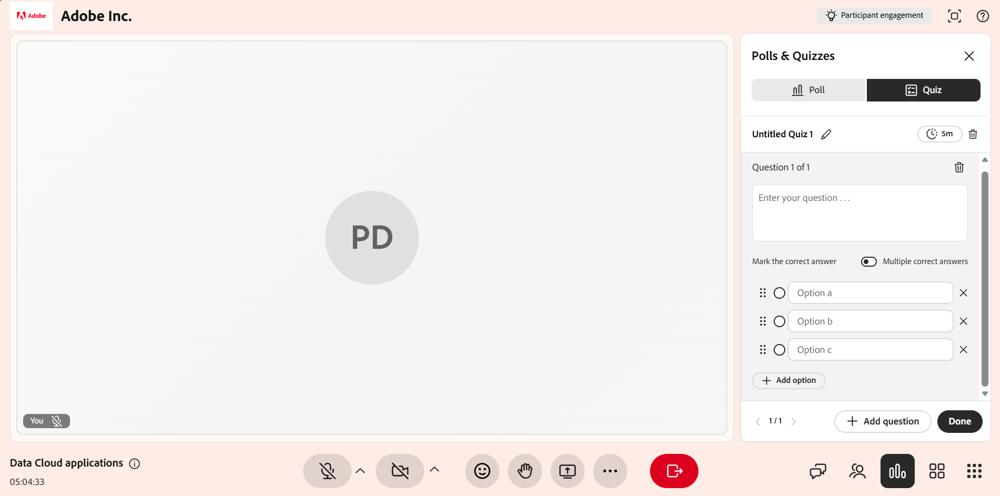
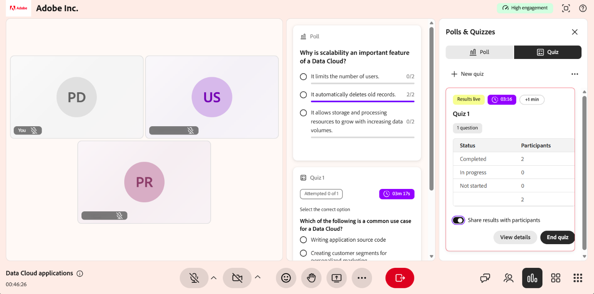

# 建立並管理測驗

作為講師，測驗功能讓你能衡量學習者在 Live Hub 課程中對主題的掌握程度。 與快速單題投票不同，測驗讓你能建立結構化、多題評量，包含多選題與多題問題、評分，以及時間限制和隨機問題或選項順序等設定。

本文將介紹所有教師可參與的小測驗動作，從製作小測驗到分享結果。

## 建立一個測驗

你可以設計測驗來評估學習者在課程中的理解度。 測驗可以包含不同題型，並支援評分以追蹤表現。 如果沒有小測驗，你可以從 **小測驗** 分頁建立新的小測驗。

要製作測驗：

1. 從&#x200B;**投票與測驗**&#x200B;面板中選擇&#x200B;**測驗**&#x200B;標籤。

   
   *從投票與測驗面板中選擇測驗標籤。*

1. 選擇 **建立新測驗**。 一個名為 **「無題測驗1** 」的新問答開始。

1. 在問題欄輸入你的問題。

1. 請在選項欄位輸入你的答案選項。 預設提供三個選項。 你可以：

   1. 選擇 **+ 新增選項** 以新增其他選項。

   1. 選擇選項旁的 **X** 鍵來移除它。

   1. 把把手拖到選項旁邊，可以重新排序。

1. 請標記正確答案：

   1. 要設定單一正確答案，請選擇正確選項旁的單選按鈕。

   1. 若要允許多個正確答案，請啟用 **「多個正確答案** 」切換，然後為每個正確選項選擇單選按鈕。

1. 要新增問題，請選擇 **+ 新增問題**。

   
   *測驗分頁介面顯示建立測驗的選項。*

1. 選擇 **完成**。

1. 選擇 **儲存**。 該測驗現已開放。

## 設定測驗時間限制

你可以設定可選的時間限制，讓學習者必須在限定時間內完成測驗。 時間限制由測驗頂端的計時器決定。

設定時間限制：

1. 請選擇測驗頂端的計時器圖示。

1. 啟用設定 **時間限制**。

1. 將持續時間設定為分鐘。

*測驗分頁介面顯示設定測驗時間限制的選項。*

## 編輯測驗

在啟動小測驗前，請更新問題、修改答案選項或重新排序問題。 一旦測驗啟動，就無法編輯。

編輯測驗：

1. 選擇測驗&#x200B;****&#x200B;標籤。

1. 請導覽到你想編輯的測驗。

1. 選擇編輯（鉛筆）圖示。

1. 請執行以下任一動作：

   1. 編輯題目內容。

   1. 更新或移除答案選項。

   1. 選擇正確答案。

   1. 請使用新增 **問題**。

   1. 如果問題不再需要，請刪除。

   
   *測驗分頁介面顯示編輯測驗的選項。*

1. 選擇 **儲存** 以套用變更。

## 發起小測驗

建立並儲存測驗後，它會以新&#x200B;**標籤顯示在**&#x200B;測驗&#x200B;**標籤**&#x200B;中。啟動測驗讓學習者可見，並允許他們即時嘗試題目。

啟動測驗：

1. 選擇測驗&#x200B;****&#x200B;標籤。

1. 從已儲存的測驗清單中，選擇 **啟動測驗**。

當你啟動小測驗時，它會出現 **在「投票與測驗** 」面板中，讓學習者回答。 如果設定了時間限制，你也可以在現場測驗中選擇 **+1分鐘** 來延長測驗時間。

*測驗分頁介面顯示為參與者啟動的測驗。*

>[!NOTE]
>如果您在建立或啟動測驗時遇到錯誤，請參閱 [Live Hub](../kb/troubleshooting-guide-for-live-hub.md#quiz-tab-issues) 的故障排除指南，裡面有常見錯誤訊息及解決方法。

## 查看測驗結果

在課程中及結束後查看測驗結果，以監控學習者的表現與參與度。 隨著學習者嘗試並完成測驗，結果會即時更新。

查看測驗結果：

1. 從中，選擇測驗&#x200B;****&#x200B;標籤。

1. 切換到進行中或已完成的小測驗。

1. 選擇 **查看結果**。

*測驗分頁介面顯示「查看詳情」選項，可存取並查看測驗結果。*

**測驗**&#x200B;小組會根據以下細節顯示結果：

* 學習者檔案

* 嘗試題目數量

* 比分

* 完成測驗所需時間

## 查看參與者的詳細回應

從結果列表中選擇一位參與者以查看詳細回應。 你可以看到學習者如何回答每個問題。

*測驗回應彈出視窗，顯示學習者的詳細結果。*

## 結束一個測驗

當學習者完成回答或你想停止提交時，使用此選項結束進行中的測驗。

總結小考：

1. 選擇 **關閉測驗**。 所有學習者的小考立即停止。

1. 測驗狀態更新為 **已關閉**。

*測驗分頁介面顯示已關閉測驗狀態。*

## 與參與者分享測驗結果

你可以在結束或結束測驗後，與參與者分享測驗結果。 要讓所有人都能看到結果，請啟用 **「與參與者** 分享結果」切換。

啟用結果分享時，測驗會以 Results live **標籤標**&#x200B;示。這表示結果會被展示給學習者。

*啟用 與參與者分享結果，以便與學習者分享成果。*

## 管理一個小測驗

你可以從選項中管理已儲存或封閉測驗（**...**） 選單中「投票與測驗&#x200B;**」面板。**&#x200B;這些選項可以讓你清除答案、重複使用測驗內容，或將其從會議中移除。

要管理小考：

1. 從中，選擇測驗&#x200B;****&#x200B;標籤。

1. 進入測驗並選擇選項（**...**） 菜單。

   
   *測驗分頁介面顯示「重置、複製和刪除測驗」的選項。*

1. 請選擇以下選項之一：

| **選擇權** | **描述** |
|----|----|
| **重置** | 永久刪除所有測驗的回應，但保留測驗本身。 利用這個方法再次執行同一個測驗，收集新的答案。 |
| **重複** | 會建立測驗的副本，包含問題和答案選項，讓你可以重複使用或調整，而不必從頭開始。 |
| **刪除** | 永久移除測驗及其所有回答。 這種行為無法撤銷。 |
