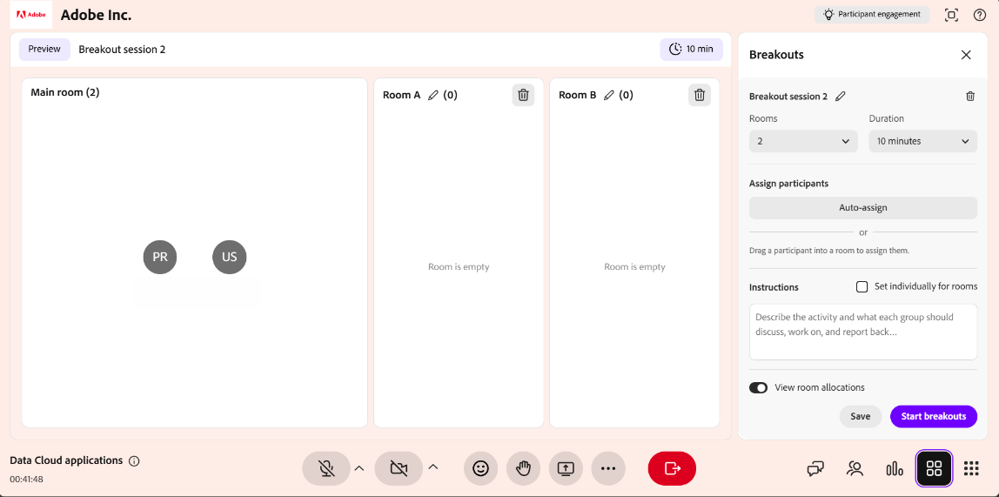

# 創建並管理分組討論

講師可以將 Live Hub 課程拆分成較小且互動的小組，進行專注的活動與討論。 你可以建立分組討論室、自動或手動分配學習者、設定活動指示，並控制課程持續時間。 分組討論進行時，你可以透過 AI 生成的摘要監控房間，加入房間共享螢幕或聊天，並延長會議時間。

本指南將逐步介紹所有分組討論室的操作，從建立分組會議到檢視課程報告。

## 建立分組討論

分組討論會將虛擬教室拆分成較小且互動的小組。 請依照以下步驟建立一個。

要建立分組討論：

1. 從控制列選擇  。

   
   *Live Hub 介面顯示分軌面板。*

1. 選擇 **設定分組討論會**。

分組格打開。 從這裡，你可以設定分組討論室、指派學習者，並管理分組討論的設定。

>[!NOTE]
>如果分組會議尚未開始，請參閱 [Live Hub](../kb/troubleshooting-guide-for-live-hub.md#breakout-session-issues) 故障排除指南，裡面有常見錯誤訊息及解決方法。

## 設計分組討論

在開始分組討論前，先設定教室、分配學習者，並使用 **分組** 面板定義活動細節。 正確的配置有助於正確安排學習者，並理解每個分組活動的目標。

設計分組討論：

1. 從控制列選擇  。   分組格打開。

   
   *分組討論面板顯示設定分組房間的選項。*

1. 請使用以下選項配置分組討論室：

| **選擇權** | **描述** |
|----|----|
| 編輯圖示 | 選擇編輯圖示以重新命名分組討論。 |
| **房間** | 使用增加或減少控制來設定分組房間數量。 最多可 **容納10** 間客房。 |
| **持續時間** | 定義分組討論會持續多久。 最短時長為 **5分鐘**，最長為 **60分鐘**。 |
| **分配參與者** | 選擇 **自動指派** 以自動分配參與者到房間。 你也可以拖放學習者，讓他們移動到不同的房間。 |
| **房間個別設定** | 為每個分組討論室分別客製化說明。 |
| **說明** | 描述活動內容並概述分組討論的預期結果。 |
| **景觀房間分配** | 在課程開始前，預覽學習者將如何分布在分組討論室。 |
| **開始分組** | 開始分組討論，並帶領學員回到指定的教室。 |
| 棄牌圖示 | 捨棄目前的分拆組，且不儲存變更。 |

1. 選擇 **儲存**。   分組討論會以新&#x200B;**標籤出現在**&#x200B;分組&#x200B;**討論中**。

## 開始分組討論

一旦分組會議設定並儲存，它會出現在 **分組** 面板中。 開始課程，將學習者移入指定房間。

開始分組討論的方法是：

1. 打開 **分組** 面板。

1. 帶著新標籤&#x200B;**進入分組討論。**

1. 選擇&#x200B;**開始分組。**  5秒&#x200B;**後會顯示**「開始」通知，學習者隨後會被帶到分配的分組教室，並套用已設定的設定。

   
   *選擇開始分組討論以開始分組討論。*

## 管理分組討論

儲存分組會議後，它會出現在 **分組** 面板中。 每個儲存的會話會顯示其狀態（**新或**&#x200B;**已**&#x200B;關閉）、房間數量及持續時間。從這個面板，你可以根據需要編輯、複製或刪除會話。

### 編輯分組討論

使用此選項更新現有的分線配置。 新&#x200B;**&#x200B;**&#x200B;狀態下可進行編輯。

要編輯分組討論：

1. 打開 **分組** 面板。

1. 前往你想更換的分組討論場。

1. 在會話中選擇編輯（鉛筆）圖示。

   
   *選擇編輯（鉛筆）圖示以更新分組會議設定。*

1. 根據需要更新配置，例如房間數量、持續時間或指示。

1. 選擇 **儲存**。

### 重複分組討論

透過複製先前建立的會話，重用現有的分組設置。

要複製一個會話：

1. 打開 **分組** 面板。

1. 請導向你想要複製的分組討論。

1. 選擇更多選項（**...**） 會議上的圖示。

   
   *「更多」選項選單顯示「重複動作」。*

1. 選擇 **重複**。

會建立一個新的會話，房間配置、參與者分配、指示及時長相同。 複製的分組討論室會顯示在面板頂端，顯示&#x200B;**新狀態**&#x200B;及名稱，例如&#x200B;**分組會議 1（複製）。**

### 刪除分組討論

使用此選項移除不再必要的分組討論。

刪除分組討論：

1. 打開 **分組** 面板。

1. 切換到已儲存的分組討論。

1. 選擇更多選項（**...**） 會議上的圖示。

1. 選擇 **刪除**。   確認視窗會跳出。

   
   *從確認彈出視窗選擇刪除以刪除分組會議。*

1. 選擇 **刪除**。

## 在積極的分組討論中管理活動

在活躍的分組討論中，講師可以監控教室活動、與學習者溝通，並透過加入個別分組討論室與參與者合作。 主會議中大多數協作工具，如聊天、螢幕分享和白板，也在分組討論室中提供，運作方式相同。

### 查看 AI 生成的分組討論室摘要

講師可以查看每個分組討論室中由 AI 生成的討論摘要，以監控參與者對話、評估與活動的契合度，並決定何時加入該房間。 摘要會隨著討論進行自動更新。

>[!NOTE]
>
>分組討論室至少需要60秒的討論時間，才能產生摘要。 活動量低於此的房間，檢查室視窗中不會顯示摘要。

要查看摘要：

1. 前往你想檢視的房間。

1. 選擇 **「檢查房間**」。   **會出現「檢查室**」的彈出視窗，顯示房間的摘要。

   
   *「檢查房間」彈出視窗會顯示房間的摘要。*

1. （可選）再選一間房。 摘要會更新以顯示所選房間的詳細資訊。

### 在分組討論室使用協作工具

加入分組討論後，講師可以使用主會議中使用的協作工具，引導並與學習者互動。 你可以：

* 與學習者聊天，回答問題並促進討論。 欲了解更多資訊，請參閱 [「關於聊天室」面板](./about-the-chat-panel.md) 。

* 分享你的螢幕或簡報，用來解釋概念或示範任務。 請參閱 [關於螢幕共享](./about-the-screen-sharing.md) 的資訊。

* 利用白板進行腦力激盪、註解和互動活動。 請參閱 [關於白板](./about-the-whiteboard.md) 的更多資訊。

## 結束分組討論

你可以隨時結束分組討論。

1. 請前往 **分組** 面板。

1. 選擇&#x200B;**在主動分組會議 中結束分組。** 所有學習者被帶回主教室，分組討論結束。

   
   *分組會議2，展示結束分組的選項以結束分組會議。*

## 查看分組討論報告

分組討論結束後，您可以查看分組討論報告，檢視分組活動與參與情況。 報告包含參與者細節、分組討論的整體及特定房間摘要、與參與者分享的指示，以及場次長度與參與度的概述。

>[!NOTE]
>
>討論時間少於60秒的分組討論室，報告中不會包含摘要。

要查看分組討論報告：

1. 請前往分組&#x200B;**討論面板中的**&#x200B;封閉分組討論。

1. 選擇 **查看報告**。   分組報告彈出視窗會顯示會議摘要。

   
   *分組報告彈出視窗顯示分組房間報告。*

1. 請做以下其中一項：
   * 選擇 **「所有房間** 」以查看 **分組討論的整體摘要** 。
   * 選擇房間分頁以查看該房間的摘要。

所有分組會議的洞察也都可在 **會議儀表板**&#x200B;中查看，您可以檢視摘要、分析參與度，並追蹤會議結束後的成果。 欲了解更多資訊，請參閱 [會話儀表板](./components-of-the-session-dashboard.md) 的組件。

## 延長分組討論

如果需要更多時間，你可以在分組討論進行中選擇延長時間2分鐘&#x200B;**，從分組會議控制中延長**&#x200B;會議時間。每次分組討論中最多可延長兩次。 更新後的學習時長會立即生效，讓學習者能持續進行活動而不中斷。
