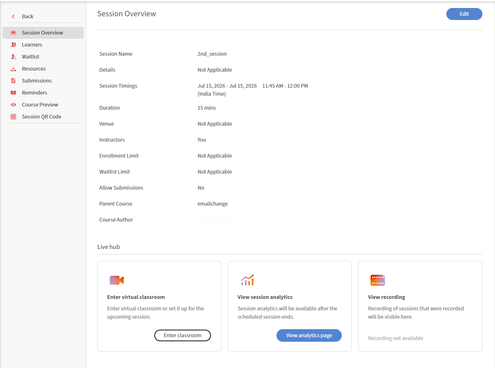

# 以講師身份參加 Live Hub 課程

教師可在預定開始時間前進入虛擬教室，準備教室、設定學習者權限、字幕、投票、測驗及分組討論，並在學習者到場前自行設置音訊與視訊。

## 加入會議

講師可以在預定課程開始前加入教室，準備課程並設定所需設定，然後學生才會加入。

1. 登入 Adobe Learning Manager。

1. 從即將到來的場次&#x200B;**中選擇排定的 Live Hub 場次**。

   
   *選擇即將到來的課程以開啟教室加入的網址。*

1. 從列出的課程中選擇該課程。   **會話總覽**&#x200B;頁面會打開。

   
   *會話總覽頁面顯示進入 Live Hub 會話的選項。*

1. 從 Live hub 選擇 **「進入教室** 」。   Live Hub 加入介面開啟。

   
   *Live Hub 的加入前畫面。*

1. （可選）測試麥克風並套用虛擬背景。 查看 [在 Live Hub](./setup-pre-join-screen-in-live-hub.md) 中設定加入前畫面以獲取更多資訊。

1. 選擇 **加入**。
