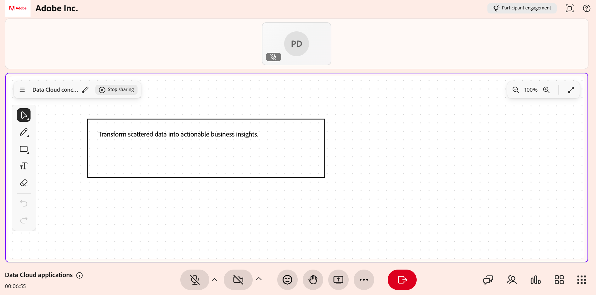

# 分享白板

在 Live Hub 課程中使用白板，視覺化解釋概念、標註內容，並與學習者即時協作。 作為講師，你可以建立新的白板或重新開啟現有白板，新增圖畫、形狀和文字，並在一次課程中管理多個白板。

你也可以重新命名白板、匯出白板作為圖片、讓學習者在白板上協作，並開啟像 Miro 這類的外部白板。

本文說明如何在 Live Hub 工作階段中建立、管理、分享及匯出白板。

## 分享一塊新的白板

當你想在現場會議中呈現想法、說明或圖表時，可以重新開始一個白板。

分享新的白板：

1. 從會話控制列中選擇 **更多選項**。

1. 選擇 **分享白板**。

1. 選擇 **新白板**。 新的白板會打開，所有參與者都能看到。

   
   *Live Hub 介面顯示共享白板的選項。*

## 重新打開白板

你可以打開現有的白板，存取之前在會話中分享過的內容。 這樣你就能繼續討論或在之前的說明上繼續，而不必重新開始。

要重新打開白板：

1. 選擇 **更多選項**。

1. 選擇 **分享白板**。

1. 從可用白板清單中選擇白板。 選定的白板會打開，所有學習者都能看到。

   
   *分享白板選項，顯示現有可用白板清單。*

>[!NOTE]
>
> 你也可以從 **白板內的「更多」** 選單開啟先前共享的白板。

## 使用白板工具

白板工具讓你能在即時會議中製作視覺說明、繪圖、添加圖形、插入文字及註解內容。

*白板介面顯示白板工具。*

請使用以下白板工具在課程中創建並註解內容：

| **工具參考** | **描述** |
|----|----|
| **精選** | 在白板上選擇形狀或文字。 選取物件後，你可以移動、調整大小、旋轉、複製或刪除它。 |
| **潘** | 拖曳畫布即可瀏覽並查看白板的不同區域。 |
| **標記** | 在白板畫布上自由手繪筆觸。 使用色彩選擇器和筆劃粗細選項來自訂畫作。 |
| **形狀** | 加入幾何圖形，如矩形、圓形、箭頭和線條。 拖曳畫布來畫出一個形狀。 調整填充顏色、邊框和厚度。 |
| **正文** | 在白板上添加文字標籤、筆記或說明。 選擇畫布來插入文字。 使用字體大小、樣式和顏色等格式選項。 |
| **橡皮擦** | 移除白板上的筆劃或物件。 對於繪畫，橡皮擦允許部分去除。 對於形狀或文字，整個物件會被移除。 |
| **還原** | 還原最近在白板上執行的動作，例如繪圖、新增文字、插入形狀或刪除物件。 選擇 **復原** 多次以順序反轉多個動作。 |
| **重來** | 還原白板上最近被撤銷的行動。 選擇 **重做** 以重新套用先前用 **復原**&#x200B;方式反轉的動作。 |

## 清除所有白板內容

清空白板，移除所有圖畫、形狀和文字，然後從空白畫布開始。

清空白板：

1. 請前往白板左上角。

1. 選擇 **更多選項**。

1. 選擇 **清除所有內容**。 白板上的所有內容都會被移除。

   
   *更多選單顯示清除所有白板內容的選項。*

你可以用 **復原** 工具恢復你已清除的內容。

## 管理現有白板

講師可以在 Live Hub 課程中利用 **白板** 面板建立、組織並控制多個白板。 此面板協助您檢視可用的白板，並採取大量行動，例如清除或刪除白板。

管理現有董事會：

1. 從控制列選擇 **更多選項** 。

1. 選擇 **分享白板**。

1. 選擇 **檢視看板**。 **白板**&#x200B;面板會開啟並顯示本次會議中所有產生的白板。

   
   *白板面板顯示管理現有看板的選項。*

### 白板面板中的可用動作

從 **白板** 面板中，講師可以執行以下動作：

| **行動** | **描述** |
|----|----|
| **分享** | 分享選定的白板。 |
| **刪除** | 永久刪除白板&#x200B;**面板中的**&#x200B;目前白板。 |
| **全部刪除** | 永久刪除白板&#x200B;**面板中列出**&#x200B;的所有白板。 |

## 重新命名白板

直接從白板介面重新命名白板，以便在會話中更清楚地辨識其內容。

要重新命名白板：

1. 從白板面板選擇&#x200B;**分享**&#x200B;**。**

1. 在白板工具列中，選擇 **白板名稱旁的「編輯** （鉛筆）」圖示。

1. 輸入新名字並選擇勾選圖示。 白板會以更新後的名稱重新命名。

   
   *在白板介面中重新命名白板選項。*

## 將白板快照匯出為圖片

講師可以將白板內容匯出為圖片，以捕捉課程中產生的重要討論、圖表或註解。

要匯出白板快照：

1. 請前往白板左上角。

1. 選擇 **更多選項**。

1. 選擇 **匯出快照**。 白板內容會匯出成 **PNG** 圖片並下載到您的本地系統。

   
   *更多選單顯示將白板匯出成圖片的選項。*

## 允許參與者編輯白板

你也可以允許參與者在課程中繪圖並與白板互動。 允許參與者使用白板，有助於協作、腦力激盪與積極參與。

要授權編輯白板：

1. 請前往白板左上角。

1. 選擇 **更多選項**。

1. 啟用 **允許參與者繪製**。 參與者現在可以在白板上繪畫、添加形狀、插入文字，並使用所有可用的註解工具。

   
   *更多選項選單，顯示讓學習者編輯白板的控制選項。*

## 分享 Miro 及其他外部白板

講師可以在 Live Hub 課程中分享第三方白板，例如 Miro。

分享 Miro 滑板：

1. 從控制列選擇 **「更多應用程式** 」。

1. 選擇 **米羅**。

1. 登入你的 Miro 帳號。

   
   *更多應用程式選單，展示分享 Miro 主板的選項。*

1. 從 Miro 專案頁面，選擇你想分享的板子。

學習者可以根據會話設定查看共享的 Miro 看板，但無法開啟或分享 Miro 看板。
