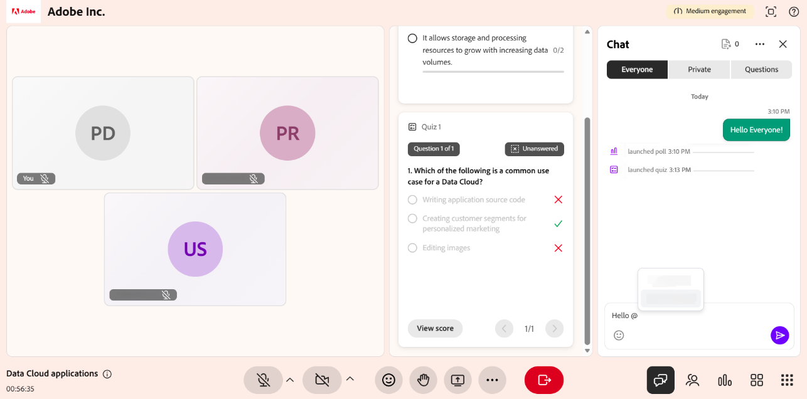

# 以講師身份使用聊天面板

作為講師，聊天面板是您在 Live Hub 課程中管理溝通的樞紐。 從單一小組中，你可以追蹤公開討論、進行私下對話，並檢視 AI 從聊天中偵測到的問題。 你也可以主持對話並用 AI 協助回應。

本文將介紹講師在聊天面板中可用的操作，從存取面板到管理訊息與設定。

## 進入聊天面板

使用聊天面板管理對話、回應學習者，以及在課程中監控問題。 該小組提供公開、私人及提問式討論的交流，集中於一處。

請依照以下步驟進入聊天面板：

1. 加入 Live Hub 的場次。

1. 從控制列選擇  。 聊天面板開啟時預設 **選擇了「所有人** 」標籤，讓你可以開始或加入正在進行的對話。

1. 請依需求選擇以下一項：

   1. 大家

   1. 私人

   1. 問題

   
   *聊天面板會打開到「所有人」分頁，你可以在那裡追蹤公開對話，並切換到「私人」和「問題」分頁。*

1. 輸入您的訊息並選擇 **發送**。

## 聊天面板設定

聊天面板提供管理對話及自訂聊天體驗的選項。 你可以清除訊息、控制通知，並根據需要調整文字大小。

*聊天面板設定選單。*

以下選項可從聊天面板設定中取得：

| **選擇權** | **描述** |
|----|----|
| **清除所有聊天** | 從聊天面板移除所有訊息。 |
| **關閉聊天通知** | 關閉會話聊天通知。 |
| **文字大小** | 調整聊天訊息大小以提升閱讀性。 可選的選項有 **小型**、 **中**&#x200B;型和 **大型**。 |

## 回覆聊天訊息

回覆功能讓你能直接回覆特定訊息，有助於在討論中維持上下文，並讓對話更易理解。

回覆聊天訊息：

1. 將滑鼠移到你想回覆的訊息上。

1. 選擇 **回覆**。

   
   *選擇回覆訊息即可直接回覆，並保持對話內容的上下文。*

1. 在訊息輸入欄輸入你的回應。

1. 選擇 **傳送**。

回覆會顯示原始訊息的片段，與你的回應並列，幫助參與者理解對話的脈絡。

### 回應訊息

你也可以對訊息做出反應，快速回覆或回覆，而不必打字回覆。 將滑鼠移到訊息上並選擇反應。 所選反應顯示在訊息下方，並對聊天室其他參與者可見。

*訊息下方會出現一個反應，且聊天室中所有人都能看到。*

## 編輯聊天訊息

編輯訊息功能允許你在發送訊息後更新訊息，幫助你修正或精煉回覆。

要編輯聊天中的訊息：

1. 將滑鼠移到你想編輯的訊息上。

1. 選擇 **編輯**。

   
   *選擇編輯以更新你已發送的訊息。*

1. 更新輸入欄位的訊息。

1. 選擇儲存&#x200B;**以套用變更，或**&#x200B;選擇&#x200B;**取消**&#x200B;以刪除變更。

更新後的訊息會取代聊天中原本的訊息，並標示 **為已**&#x200B;編輯。

## 在聊天訊息中提及參與者

聊天面板的標籤功能允許你在課程中直接對特定學習者稱呼。 使用標籤能吸引注意力，提升你提到的學習者的能見度，尤其是在積極討論時。

在聊天中提到一位學習者：

1. 在訊息輸入欄位輸入 **@**。

1. 從列表中選擇參與者的名字。

   
   *輸入 @ 即可填入參與者名單，並從列表中選擇姓名。*

1. 請輸入您的訊息。

1. 選擇 **傳送**。

被標記的學習者會收到通知，且其姓名會在訊息中被高亮顯示以便提升可見性。

## 開始私人聊天

**聊天面板的私人**&#x200B;分頁允許你在不中斷公開討論的情況下進行私人訊息。你可以開始新聊天、繼續現有對話，或與特定學習者溝通。

要開始私人聊天：

1. 選擇「 **私人** 」標籤。 參與者名單會出現。

   
   *私人分頁會列出參與者，讓你可以只聯絡講師或個別學習者。*

1. 你可以做以下幾件事：

   1. 只在列表頂端選擇 **「講師」** 以便發送訊息給其他講師。 訊息僅對講師可見。

   1. 選擇一位學生開始私人對話。

1. 輸入您的訊息並選擇 **發送**。 訊息僅對你和被選中的參與者可見。

### 關閉學習者的私人聊天功能

預設情況下，學習者可以私下與其他參與者聊天。 作為講師，你可以控制學習者是否能在課程中使用私人聊天。

要關閉學習者的私人聊天功能：

1. 開放 **房間設定**。

1. 選擇 **參與者權限**。

   
   *在參與者權限中關閉「發送私人訊息」以阻止學習者私下聊天。*

1. 關閉 **發送私人訊息**。

1. 選擇 **完成**。

一旦失去行動能力，學習者將無法再開始或參與私人對話。

## 使用 AI 對參與者問題的草稿回覆

**問題**&#x200B;分頁幫助講師更有效率地管理並回應學習者的問題。AI 會自動偵測聊天中的問題，並在課程中提供建議回答以協助講師。

要產生 AI 輔助回覆：

1. 請前往 **「問題** 」標籤。

1. 將滑鼠移到偵測到的問題上。

1. 選擇 **AI** 的草稿回覆。

   
   *選擇 AI 的草稿回覆，以生成對偵測到問題的建議回應。*

1. （選填）檢視並編輯建議回應。

1. 選擇 **傳送**。

AI 生成的回覆會加入聊天室，並在發送前進行修改以確保準確性與相關性。

>[!NOTE]
>如果問題未被上傳的參考內容涵蓋，AI 助理可能會顯示錯誤訊息，而非產生答案。 詳情請參閱 [Live Hub](../kb/troubleshooting-guide-for-live-hub.md#answer-generation-toast-issues) 的故障排除指南。

### 上傳檔案以獲得更好的回應

你也可以上傳參考檔案，以提升 AI 生成回應的準確性與相關性。

上傳檔案：

1. 請前往聊天面板的右上角。

   
   *開啟上傳內容參考資料，加入有助於 AI 產生更準確回應的檔案。*

1. 選擇 **「上傳內容參考資料**」。 會跳出一個 **QnA 參考內容** 的視窗。

1. 選擇 **瀏覽檔案**。

   
   *在 QnA 參考內容視窗中選擇瀏覽檔案，從系統上傳參考檔案。*

1. 從你的系統上傳檔案。

AI 利用上傳的內容，在「Everyone **」**&#x200B;標籤中產生更準確且相關的回答。

>[!NOTE]
>如果上傳失敗或檔案被拒絕，請參閱 [Live Hub](../kb/troubleshooting-guide-for-live-hub.md#upload-content-issues) 故障排除指南，裡面列出常見錯誤訊息及解決方法。

## 刪除訊息

刪除訊息選項允許你從聊天中移除訊息，保持討論的焦點與相關性。 你可以刪除與主題無關或干擾討論的訊息。

*刪除自己的訊息，讓討論保持焦點且相關。*
