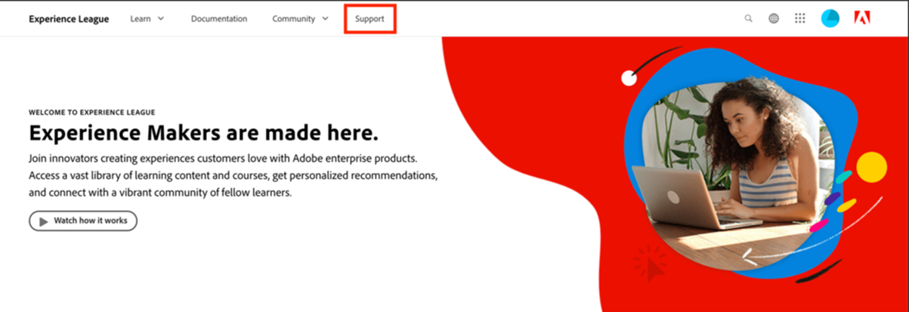
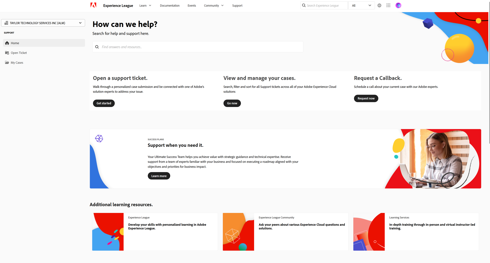
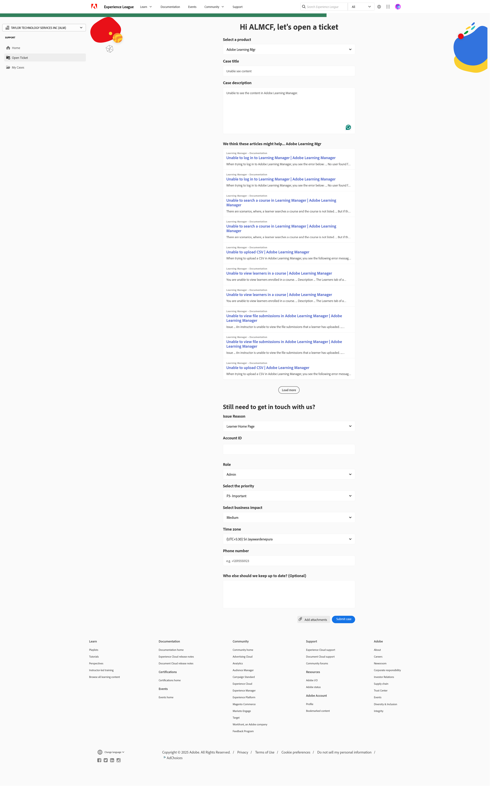

# 如何在Experience League上提交支援票證

提交Adobe Learning Manager支援票證的程式現在直接與Experience League支援平台整合。 這是自助式入口網站，最近經過重新設計，提供更個人化且易於使用的權利客戶。 請參閱以下指南，深入瞭解如何存取Experience League支援入口網站及登記票證。

請注意，僅授權支援聯絡人可提交支援票證。 如需支援諮詢，請繼續透過電子郵件向Adobe Learning Manager提交支援票證，直到2025年5月11日為止。 在此日期後，除了現有的電子郵件通道外，您還可以透過下述的Experience League支援入口網站提交支援票證。

1. 若要存取支援入口網站，請造訪&#x200B;**[!UICONTROL Experience League]**&#x200B;網站，並選取位於頁面頂端的&#x200B;**[!UICONTROL Support]**&#x200B;索引標籤。 或者，您也可以造訪[直接連結](https://experienceleague.adobe.com/home?lang=zh-Hant#support)。

   
   _支援首頁_

2. 從&#x200B;**[!UICONTROL Support]**&#x200B;首頁，您可以輕鬆導覽至未解決的案例、記錄新案例、檢視熱門支援文章或探索其他學習資源。

   
   _開啟票證_

3. 若要提交案例，請選取選項&#x200B;**[!UICONTROL Open a support case]**。 您也可以選取側邊欄功能表上的&#x200B;**[!UICONTROL Open Tickets]**&#x200B;選項。 系統會將您導向案例建立頁面，您可以在其中輸入您的產品名稱(Adobe Learning Manager、Audience Manager、Campaign、Target等)、**[!UICONTROL Case title]**&#x200B;和&#x200B;**[!UICONTROL Case description]**。 若要加快疑難排解程式，請在描述您面臨的問題時儘可能提供說明。

   在表單快要結束時，請填寫下列欄位，以提供更具體的資訊，協助我們進行疑難排解：

   * 問題原因（為問題型別選取適當的下拉式清單）
   * 帳戶 ID
   * 角色（管理員、作者、學習者、整合管理員等）
   * 案例優先順序(低、Medium、高、嚴重)
   * 業務影響
   * 時區
   * 複製預期使用者的選項。

   最後，按一下「**[!UICONTROL Submit]**」之前，請務必上傳任何相關檔案。 （附件大小不超過24 MB）

   
   _票證表單_

4. 按一下「**[!UICONTROL Submit case]**」後，您將會重新導向至「**[!UICONTROL My cases]**」頁面，您可在此檢視貴組織提交的任何及所有案例。 您也可以按一下側邊欄功能表上的「**[!UICONTROL My cases]**」按鈕，以導覽至此頁面。 在此頁面上，您將能夠檢視所有未結和已結的支援案例。 使用頁面頂端的選項，您可以依案例狀態（未完成或已關閉）或Experience Cloud解決方案來篩選。 您也可以使用搜尋列來搜尋與您的支援問題有關的任何關鍵字。

   
   _未解決的案例_

5. 若要檢視案例的更多詳細資料，請按一下案例以存取其案例檢視。 在案例檢視中，您可以檢視指派案例擁有者的最新註解，並新增您想要的任何額外附件或回應。

您可以選取「案例詳細資料」下頁面右側的「呈報至管理」選項，以呈報案例。 您也可以選取相鄰的「關閉大小寫」按鈕，關閉大小寫。

## 其他附註

我們的支援領導團隊若要以最有效率的方式處理您的問題上報，請僅在嚴重影響您的組織、合作夥伴或客戶時，才提交案件上報。

如果您有任何關於如何使用&#x200B;**[!UICONTROL Experience League Support]**&#x200B;入口網站的進一步問題，請在以下的註解區段中通知我們，或直接透過此電子郵件地址[almdynsupp@adobe.com](mailto:almdynsupp@adobe.com)聯絡我們的支援團隊。

若要新增可透過Experience League (EXL)開啟支援票證的授權連絡人，請造訪[http://licensing.adobe.com](http://licensing.adobe.com)。

