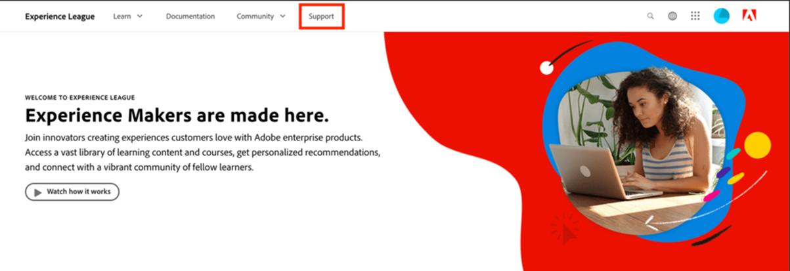
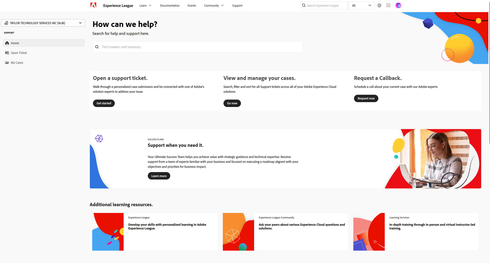
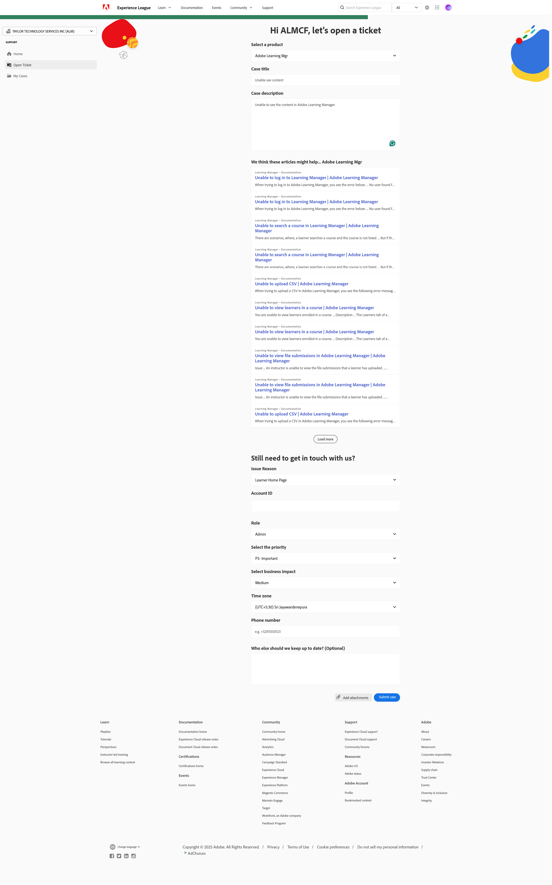
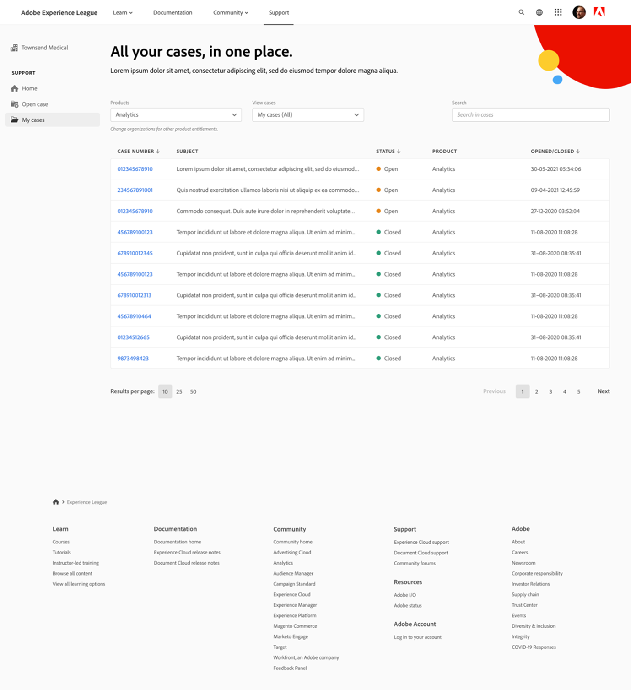

# 如何在 Experience League 提交支援工單

Adobe Learning Manager 支援工單的提交流程現在已直接整合至 Experience League 支援平台。 這是一個自助入口網站，最近重新設計，為有特權感的顧客提供更多個人化與易用性。 請參考以下指南，了解如何進入體驗聯盟支援入口網站並登錄工單。

請注意，提交支援單僅限授權客服聯絡人使用。 對於您的支援問題，請持續透過電子郵件向 Adobe Learning Manager 提交支援工單，直到 2025 年 5 月 11 日。 在此日期之後，你可以透過以下說明的 Experience League 支援入口網站提交支援工單，此外還有現有的電子郵件管道。

1. 要進入支援入口網站，請造訪 **[!UICONTROL Experience League]** 網站並選擇 **[!UICONTROL Support]** 頁面頂端的分頁。 或者，你也可以造訪直接 [連結](https://experienceleague.adobe.com/home?lang=zh-Hant#support)。

   
   _支援首頁_

2. 從 **[!UICONTROL Support]** 首頁，您可以輕鬆瀏覽未解決案件、登錄新案件、瀏覽熱門支援文章，或探索更多學習資源。

   
   _開放票_

3. 要提交案件，請選擇選項 **[!UICONTROL Open a support case]**。 你也可以在側邊欄選單中選擇這個 **[!UICONTROL Open Tickets]** 選項。 您將被導向案件建立頁面，輸入產品名稱（Adobe Learning Manager、Audience Manager、Campaign、Target 等）、 **[!UICONTROL Case title]**&#x200B;**[!UICONTROL Case description]**&#x200B;以及 。為了加快故障排除流程，請在描述你遇到的問題時盡可能詳細描述。

   在表格結尾，請填寫以下欄位，以便提供更具體的資訊，幫助我們排除問題：

   * 問題原因（選擇針對議題類型的相應下拉選單）
   * 帳戶 ID
   * 角色（管理員、作者、學習者、整合管理員等）
   * 案件優先順序（低、中、高、危急）
   * 商業影響
   * 時區
   * 複製目標使用者的選項。

   最後，請務必在點擊 **[!UICONTROL Submit]**&#x200B;前上傳相關檔案。 （附件大小不超過 24 MB）

   
   _票券表格_

4. 點擊 **[!UICONTROL Submit case]**&#x200B;後，您將被導往該 **[!UICONTROL My cases]** 頁面，您可以查看您組織提交的所有案件。 你也可以點擊 **[!UICONTROL My cases]** 側邊欄選單上的按鈕來瀏覽此頁面。 在此頁面，您可以查看所有已開啟及已關閉的支援案件。 利用頁面頂端的選項，您可以依案件狀態（開啟或已結）或 Adobe CX 企業解決方案篩選。 您也可以使用搜尋欄搜尋與您的支援問題相關的關鍵字。

   
   _未結案件_

5. 欲查看案件詳情，請點擊該案件以進入其案件視圖。 在案件檢視中，您可以查看與分配案件擁有者的最新留言，並添加任何您想要的附加文件或回應。

你可以在頁面右側的案件詳情中選擇「升級到管理層」選項來升級案件。 你也可以選擇旁邊的「關閉案件」按鈕來關閉案件。

## 附加說明

為了讓我們的支援領導團隊以最有效率的方式處理您的升級問題，請僅在案件嚴重影響您的組織、合作夥伴或客戶時提交升級申請。

如果你對如何使用入口 **[!UICONTROL Experience League Support]** 網站有任何進一步疑問，請在下方留言區告訴我們，或直接透過此電子郵件地址 [almdynsupp@adobe.com](mailto:almdynsupp@adobe.com) 聯絡我們的客服團隊。

若要新增可透過 Experience League （EXL） 開啟支援工單的授權聯絡人，請造訪 [http://licensing.adobe.com](http://licensing.adobe.com)。

