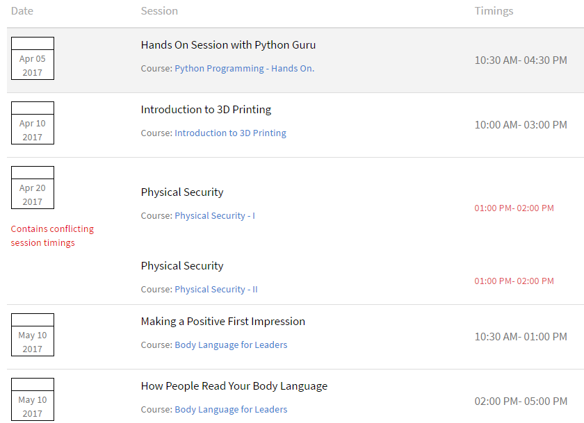
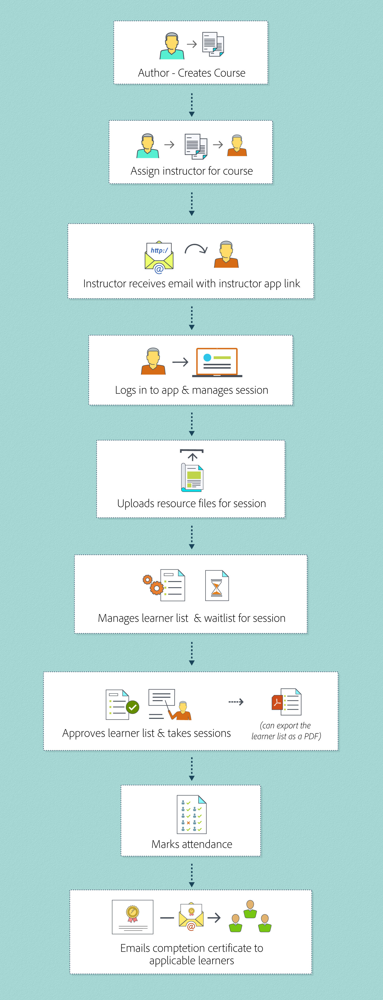

# Learning Manager講師入門

閱讀本文以瞭解如何開始使用Learning Manager的講師。

## 以講師身分登入 {#loginasaninstructor}

當作者將您新增為課程模組的講師時，您會收到註冊電子郵件中的電子郵件。 電子郵件包含指向講師應用程式的連結。 按一下連結，前往Learning Manager登入頁面。

1. 登入Learning Manager。

   畫面會顯示「講師應用程式首頁」。 您可以檢視近期工作階段的詳細資料。

   

   *檢視講師應用程式首頁*

管理員新增課程執行個體的工作階段資料時，也可以將使用者作為作者新增至模組。

## 以講師身分管理模組 {#managingmodulesasaninstructor}

請參閱下圖，瞭解Learning Manager的講師工作流程：

*講師的工作流程*
