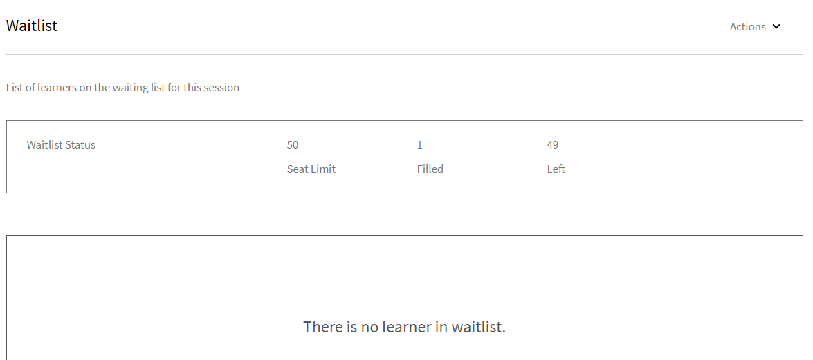
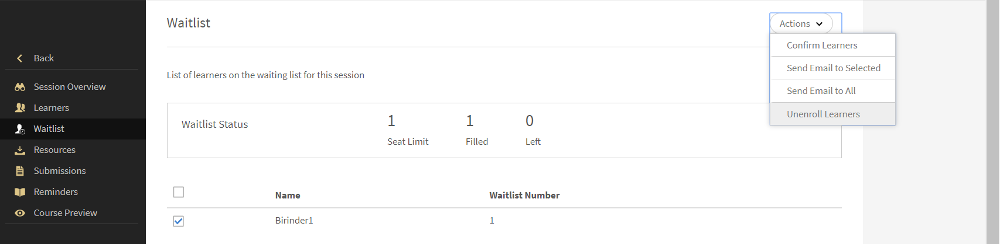
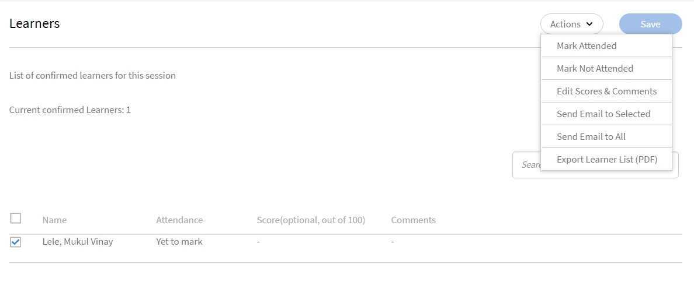
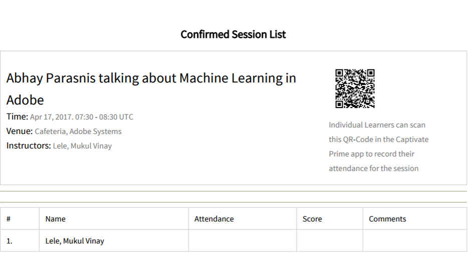
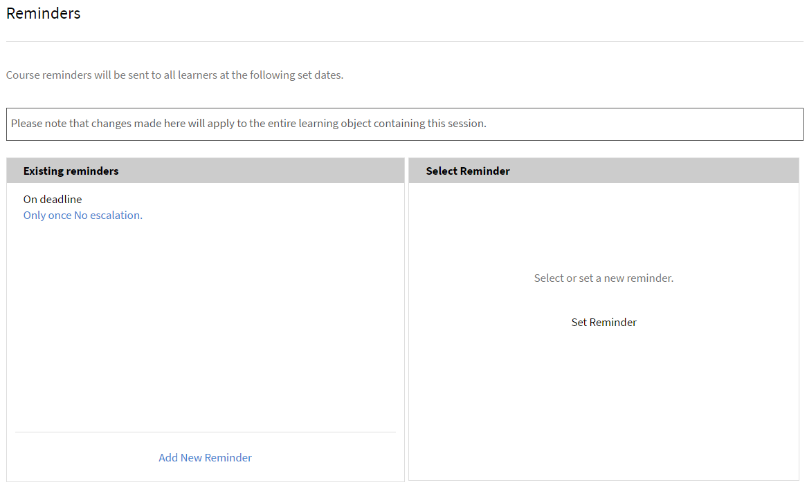
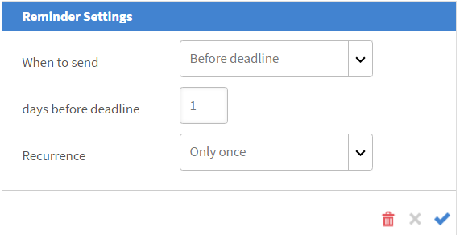

# 管理工作階段的學習者

閱讀本文章，瞭解如何管理出席者、傳送課程相關電子郵件及工作階段提醒。

## 請參閱階段作業或含有擱置檢閱的模組 {#pending}

身為講師，您可以檢視含有擱置稽核的工作階段或模組。

在「工作階段/模組」頁面上，您可以看到&#x200B;**擱置中的稽核**&#x200B;欄，其中顯示對應工作階段/活動的擱置稽核數目。

## 管理您工作階段的輪候表 {#managewaitlistforyoursession}

當學習者註冊您的模組時，您可以從輪候表頁面檢視註冊和輪候表的最新狀態。

1. 在「講師應用程式」的左側導覽窗格中，選取「近期工作階段>輪候表」 。

   您可以檢視「座位限制」、目前已填補的座位數，以及空置的座位數。 表格也會列出已輪候的學習者。 如果沒有輪候表佇列，則此為空白。

   
   *檢視輪候學習者*

1. 從輪候表選取要確認的學習者或學習者。
1. 選取「動作>確認學習者」。

   您確認的學習者會新增至「已確認的學習者」清單。

講師可讓學習者取消註冊工作階段。 這也會將他們從對應的學習課程中取消註冊。 選取&#x200B;**[!UICONTROL Waitlist]**&#x200B;標籤。 使用核取方塊選取要取消註冊的學習者。 若要取消註冊，請選取&#x200B;**[!UICONTROL Actions]** > **[!UICONTROL Unenroll learners]**。

*取消學習者註冊*

### 輪候表報告

Adobe Learning Manager的新&#x200B;**[!UICONTROL Waitlist Report]**&#x200B;可讓講師下載課程所有執行個體的輪候學習者清單。 講師可以從&#x200B;**[!UICONTROL Session Overview]**&#x200B;頁面上的&#x200B;**[!UICONTROL Waitlist]**&#x200B;區段存取此報告。

依照輪候表報表中的可用欄執行：

* 課程名稱
* 執行個體名稱
* 執行個體ID
* 執行個體狀態
* 使用者名稱
* 電子郵件
* 使用者唯一ID
* 註冊日期（UTC時區）
* 狀態
* 輪候表編號
* 輪候表限制
* 名額限制

若要從講師區段下載報表：

1. 以&#x200B;**[!UICONTROL Instructor]**&#x200B;登入。
2. 從首頁選取任何階段作業。
3. 在&#x200B;**[!UICONTROL Session Overview]**&#x200B;頁面中選取&#x200B;**[!UICONTROL Waitlist]**&#x200B;選項。
4. 選取&#x200B;**[!UICONTROL Actions]** > **[!UICONTROL Export Report]**&#x200B;以下載&#x200B;**[!UICONTROL Waitlist]**&#x200B;報告。

## 標籤工作階段的出席情況 {#markattendanceforyoursession}

您可以從「學習者」頁面檢視參與工作階段的已確認學習者數、其姓名、學習者的參與狀態以及其他詳細資訊。

1. 在左側導覽窗格中，按一下「近期工作階段>學習者」 。
1. 從與會者清單中選取學習者或學習者，然後執行下列任一項作業：

   * 若要標示出勤，請按一下「動作>標示出勤」。 一旦狀態標籤為「已參加」，您就無法變更狀態。
   * 若要標示未出席，請按一下「動作>未出席」。
   * 若要因取消或其他原因刪除學習者，請按一下「動作>刪除學習者」 。

   學習者必須等到出席狀態顯示已出席後才能完成模組。

   
   *標籤學習者出席情況*

## 傳送電子郵件給學習者 {#sendemailstolearners}

您可以傳送電子郵件給您工作階段的特定或所有出席者。 如果您要確認學習者的出席情況，或要傳送有關工作階段的通訊，「傳送電子郵件」功能會非常有用。 您也可以使用「傳送電子郵件給全部」選項，以電子郵件傳送指派和工作階段資料，或傳送一般通訊給所有學習者。

若要從講師應用程式的學習者頁面傳送電子郵件給學習者，請執行下列任一項作業：

* 若要傳送電子郵件給特定出席者，請選取出席者，然後按一下「動作>傳送電子郵件給選取的專案」。
* 若要傳送電子郵件給所有出席者以傳送課程資料或指派，請按一下[動作] > [傳送電子郵件給所有人]。

## 匯出學習者清單 {#exportinglearnerslist}

身為講師，您可以將與會者清單匯出為PDF，輕鬆標籤所有學習者的出席情況。 若要匯出出席者清單，請從左窗格的學習者匯出。 按一下「動作>匯出學習者清單」(PDF)。

確認工作階段的出席者清單後，您可以將清單匯出為PDF。 此易於列印的pdf會將學習者顯示為表格。 接著，您就可以標籤出勤率或提供分數，並為學習者製作或提供附註，而且全都採用相同的PDF。

請注意此PDF右上角的QR碼。 此功能可讓個別學習者使用Learning Manager行動應用程式掃描程式碼，讓學習者標籤出席情況。

*掃描QR碼以標籤出席情況*

## 核准或拒絕提交 {#approveorrejectsubmissions}

如果學習者已上傳工作階段的檔案，例如指派、報告或評估，您可以在「提交」頁面中檢視檔案。 您可以使用材料來閱卷學習者，並核准或拒絕提交。

1. 從左窗格中，根據工作階段排程，按一下「近期工作階段」或「過去工作階段」 。
1. 按一下您要檢視其提交內容的課程。

   從左窗格中，按一下「提交」。

1. 您可以檢視學習者為您選取的工作階段提交的提交內容。 選取您要核准或拒絕的提交，然後按一下「核准」或「拒絕」。

   根據您的動作，提交狀態會變更為「已核准」或「已拒絕」。

## 設定工作階段的提醒 {#configureremindersforyoursession}

1. 從左窗格中，按一下「即將進行的工作階段」。
1. 按一下您要設定提醒的課程。 從左窗格中，按一下「提醒」。
1. 在「選取提醒」方塊中，按一下「設定提醒」。

   
   *設定您工作階段的提醒*

1. 執行下列動作：

   * 在「提醒設定」對話方塊中，設定向學習者傳送提醒的選項：截止日期前、截止日期當天或截止日期之後。
   * 在截止日期前的天數欄位中，設定您要將提醒傳送給學習者的截止日期前的天數。
   * 設定提醒的週期。

   
   *檢視提醒設定*

1. 執行下列任一項作業：

   * 按一下勾號以儲存提醒。
   * 按一下十字記號以取消提醒。

   在您於提醒設定中指定的設定日期向所有學習者傳送自動課程提醒。

   如果您已經設定工作階段的提醒，則可以在現有的提醒圖磚下看到提醒。 此外，您也可以將其他提醒新增至現有提醒。

   若要刪除現有提醒，請按一下提醒。 從出現的快顯視窗中，按一下「刪除」圖示（垃圾桶圖示）以刪除提醒。
