# 模組

閱讀本文章，瞭解如何以講師身分管理Learning Manager的模組。

## 檢視工作階段概觀 {#viewsessionoverview}

1. 從左窗格中，按一下[即將到來的工作階段]。
1. 從近期工作階段清單中，選取您要檢視其詳細資訊的工作階段。

   應用程式會顯示工作階段概述以及工作階段名稱、地點、時間、註冊限制、輪候表限制等詳細資訊。

   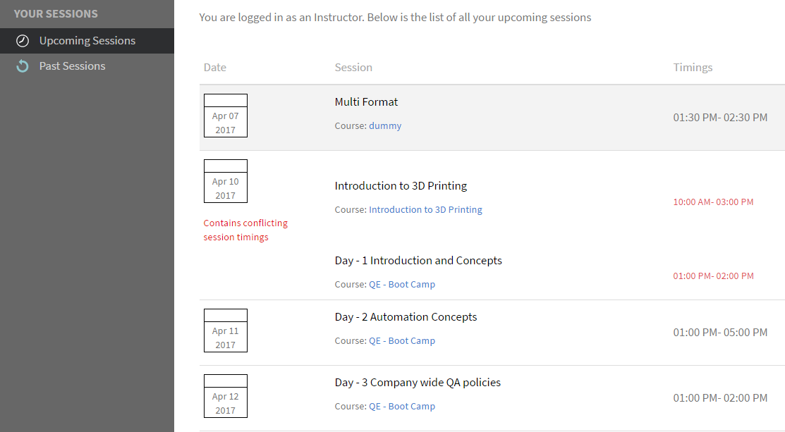
   *檢視即將到來的工作階段*

## 設定工作階段詳細資訊 {#configuresessiondetails}

1. 從左窗格中，按一下[即將到來的工作階段]。
1. 選取您要更新的工作階段。
1. 按一下右上角的「編輯」 。

   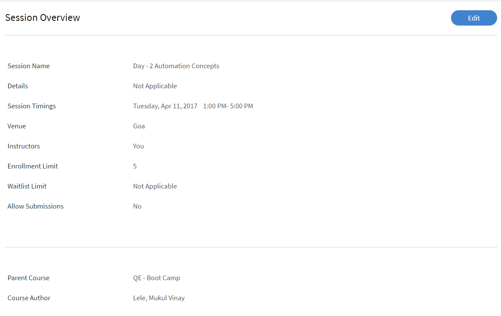
   *設定工作階段詳細資訊*

1. 從「工作階段總覽」頁面，您可以編輯工作階段時間安排、日期、地點等。 您也可以編輯或新增下列工作階段詳細資訊：

   * 指定註冊限制，以設定工作階段允許的最大學習者數量。
   * 如果您想要設定工作階段輪候表上允許的學習者數目上限，請指定輪候表上限。
   * 在「允許提交」欄位中選取「是」，讓學習者可以提交工作分派。 如果您選取「否」，學習者無法上傳工作階段的指派提交。

   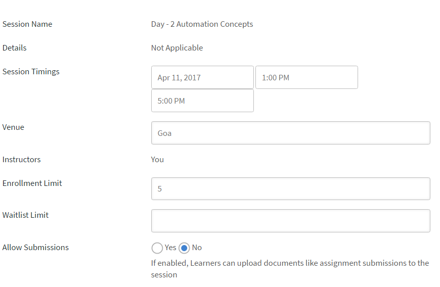
   *編輯工作階段詳細資訊*

1. 按一下「儲存」。

   您無法在此頁面編輯[講師]欄位。

## 上傳工作階段的資源檔案 {#uploadresourcefilesforyoursession}

身為講師，您可以上傳資源檔案（例如模組的任務檔案或簡報）或模組的活動檔案。 使用「資源」功能表，為您的模組或工作階段新增資源檔案。

1. 在「講師應用程式」中，按一下「近期工作階段>資源」 。

   您可以檢視「資源」頁面，此頁面已連結至作者針對與模組相關課程而可能上傳的資源。 此外，講師也可以上傳模組的資源檔案。

1. 按一下「新增」。

   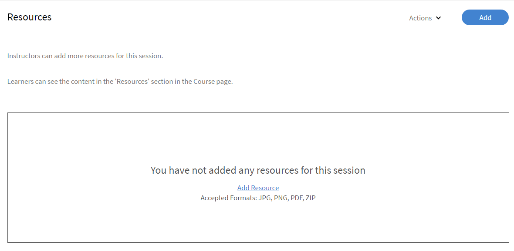
   *為工作階段新增資源*

1. 瀏覽至您電腦中適當的檔案。 選取檔案，然後按一下「開啟」。
1. 上傳檔案後，您可以檢視檔案以及其新增日期。

   已註冊此模組的學習者，上傳檔案後即可在課程下的資源區段檢視檔案。

   要刪除資源檔案，請選取要刪除的一個或多個檔案。 按一下「資源」頁面中的「動作>刪除檔案」 。

## 活動模組的檔案提交 {#filesubmissionforactivitymodules}

活動模組支援檔案提交工作流程。 以作者身分，建立活動模組並選取  **[!UICONTROL File Submission]** 選項。 這可讓學習者提交檔案。

這些檔案可由模組講師核准/拒絕。 只有當講師核准提交後，模組才會完成。

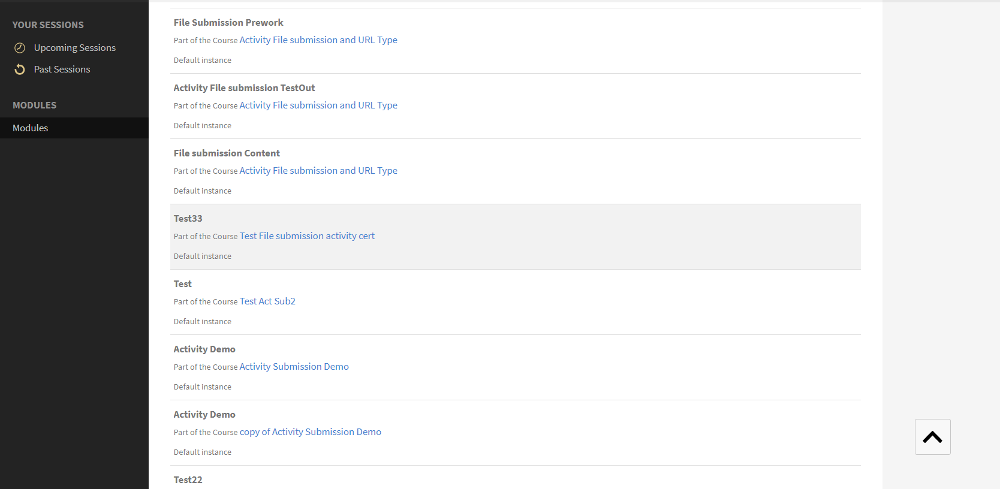 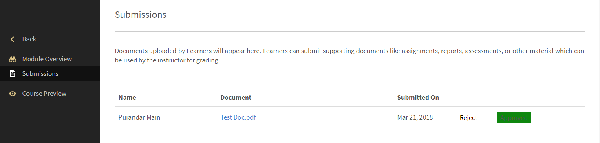
*核准或拒絕檔案*

## 評估檢查清單模組 {#evaluate-checklist-module}

學習者參加課程後，講師會在「 」的「提交/檢查清單」頁面上看到檢查清單模組 **模組**&#x200B;區段。 此頁面包含所有活動檢查清單模組，以及應檢閱的活動提交模組。 針對每個模組，會顯示要評估對象的學習者人數。

在下列頁面中，您可以檢視型別模組 **提交** 和 **檢查清單**. 在此範例中，我們將使用檢查清單模組。

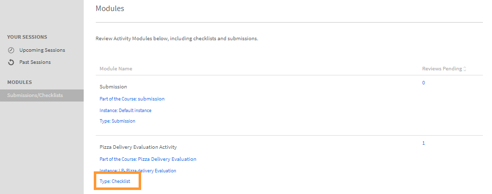
*檢視模組清單*

按一下檢查清單模組。 在 **檢查清單** 頁面中，您會看到下列內容：

* 模組的名稱
* 課程名稱
* 課程所屬的執行個體
* 通過作者設定的條件
* 檢查清單問題數目

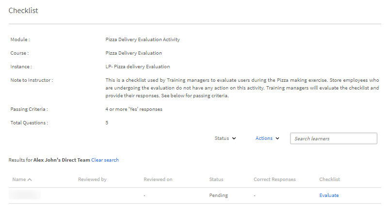
*檢視檢查清單頁面*

若要評估學習者，請按一下 **[!UICONTROL Evaluate]** 在 **[!UICONTROL Checklist]** 欄。 您還可以看到稽核的狀態為 **擱置中**.

評估學習者並按一下 **[!UICONTROL Submit]**. 身為講師，您必須回答所有評估問題。

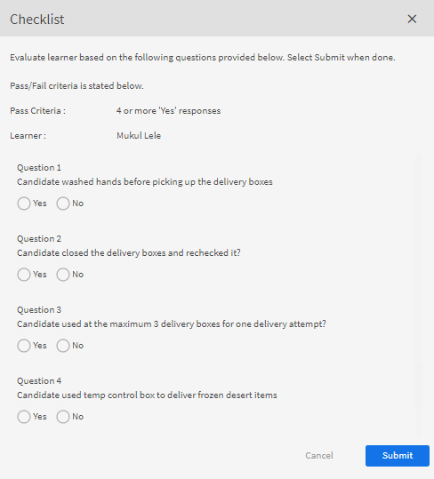
*評估檢查清單*

視通過條件而定，狀態將為失敗或通過。

檢查清單一經評估，便無法重新評估。

講師也可以檢視模組其他講師提交的回應。

您可以根據套用的搜尋篩選條件，將學習者匯出為csv。

講師使用檢查清單評估課程後，學習者會看到模組狀態 **通過** 和課程狀態為 **已完成**，或模組狀態為 **失敗**，而課程狀態為 **已完成**.

## 拒絕活動的講師註解 {#rejection-comments}

學習者可以在傳送拒絕的通知中看到講師的評論。 然後，學習者可以透過以評論的形式提供更多資訊來重新提交。

以下是工作流程：

1. 作者使用活動模組建立課程、指派講師，然後發佈課程。

1. 學習者使用課程，在完成課程後提交完成證明。

   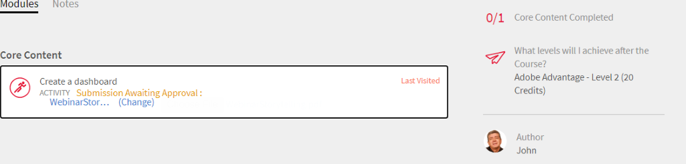
   *提交完成證明*

1. 然後，講師會選取指派給他/她的活動模組。 在模組的「提交」頁面中，講師按一下 **編輯**. 然後他/她可以輸入要拒絕的註解，並啟用顯示註解選項，讓學習者可以在通知中檢視註解。

   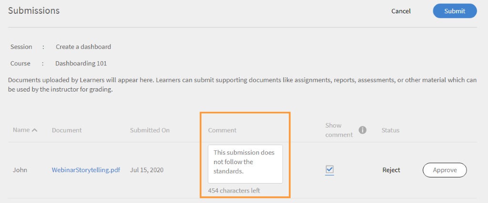
   *輸入完成註解*

1. 講師可按一下 **拒絕**. 提交作業的狀態會變更為 **已標籤為拒絕**.

   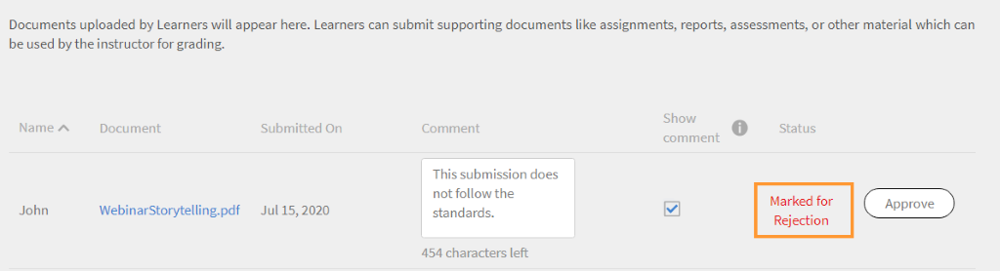
   *拒絕提交*

1. 提交後，狀態會變更為 **已拒絕**.

   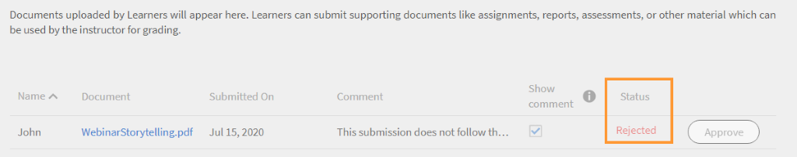
   *檢視拒絕狀態*

1. 學習者現在會看到通知，告知其提交內容已遭拒絕。 講師的註解也會出現在通知中。

   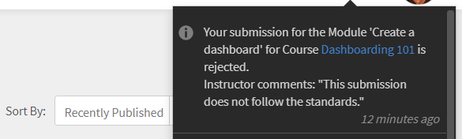
   *接收拒絕通知*

為配合變更，Adobe已更新以下專案的電子郵件範本： **提交已拒絕**.

## 新增活動模組的分數和評論 {#addscoresandcommentsforactivitymodules}

若要針對已傳送提交之活動模組新增分數和註解，請遵循下列步驟：

1. 從左窗格，按一下 **[!UICONTROL Learner]**.

   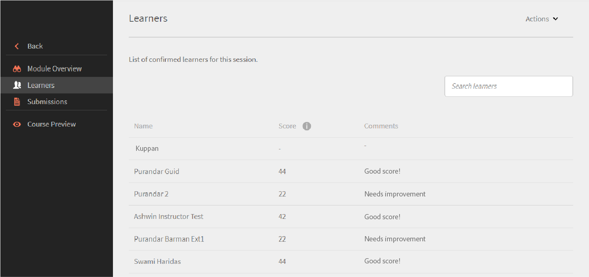
   *選取學習者*

1. 在學習者頁面中，按一下 **[!UICONTROL Actions]** > **[!UICONTROL Edit Scores & Comments]**.

   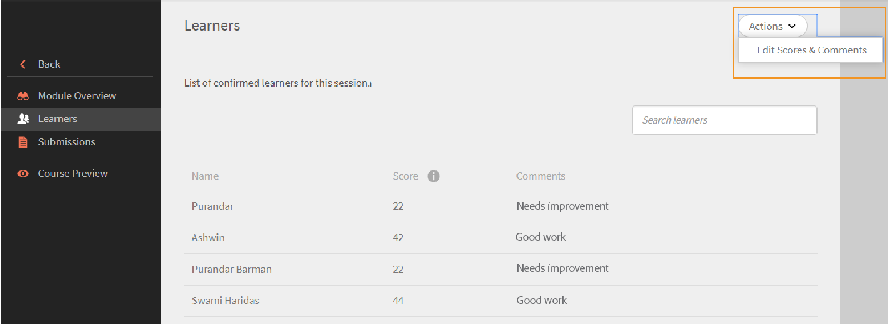
   *新增註解*

   若是尚未完成課程的學習者，分數和註解輸入欄位不會出現。

   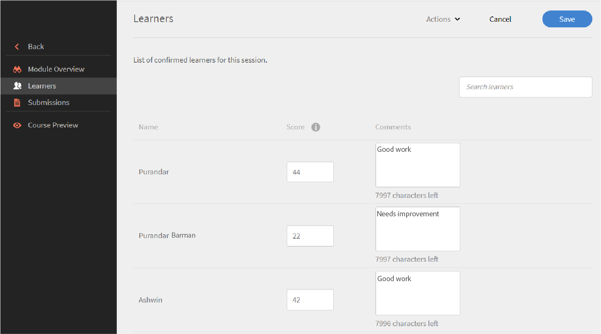
   *編輯分數和評論*

1. 按一下 **[!UICONTROL Save]**.
