# 模組

閱讀本文，了解如何以學習管理（Learning Manager）講師的身份管理模組。

## 查看會議總覽 {#viewsessionoverview}

1. 從左側窗格點選「即將到來的會話」。
1. 從即將到來的會話清單中，選擇你想查看的會話細節。

   應用程式會顯示課程總覽，並包含課程名稱、場地、時間、報名人數、候補名單人數等細節。

   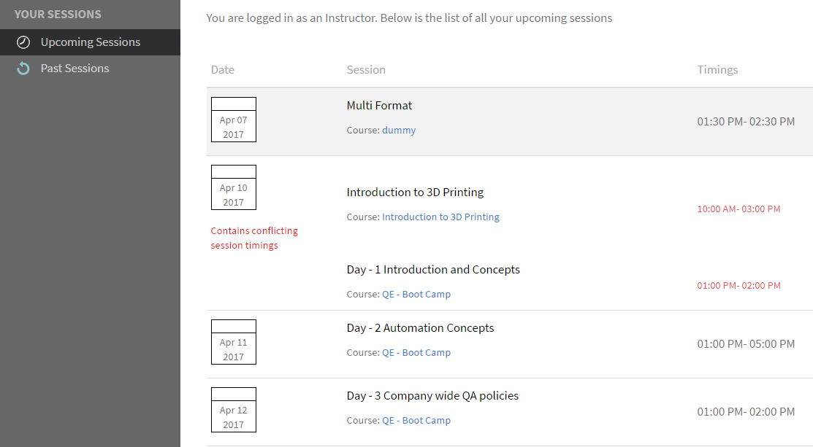
   *查看即將舉行的場次*

## 設定會話細節 {#configuresessiondetails}

1. 從左側窗格點選「即將到來的會話」。
1. 選擇你想更新的會話。
1. 點擊右上角的編輯。

   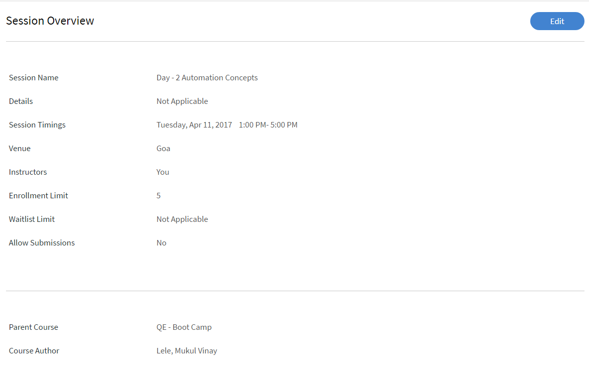
   *設定會話細節*

1. 在「場次總覽」頁面，你可以編輯場次時間、日期、場地等資訊。 您也可以編輯或新增以下會議細節：

   * 請指定註冊人數上限，以設定本課程允許的最大學習人數。
   * 如果你想設定該課程等待名單上允許的最大學習人數，請指定候補名單限制。
   * 在允許提交欄位中，選擇「是」以啟用學習者提交作業。 若選擇「否」，學習者無法上傳本課程的作業提交。

   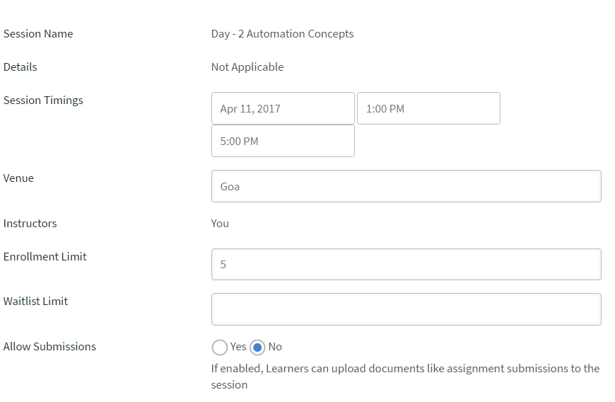
   *編輯會話細節*

1. 點擊儲存。

   你無法從本頁編輯講師欄位。

## 上傳你的工作階段資源檔案 {#uploadresourcefilesforyoursession}

作為講師，你可以上傳資源檔案，例如模組的作業檔案或簡報，或模組的活動檔案。 使用資源選單為你的模組或會議新增資源檔案。

1. 在講師應用程式中，點擊即將到來的課程>資源。

   你可以查看資源頁面，裡面已經有作者可能上傳的課程連結，與你的模組相關課程。 此外，講師也可以上傳模組的資源檔案。

1. 點擊新增。

   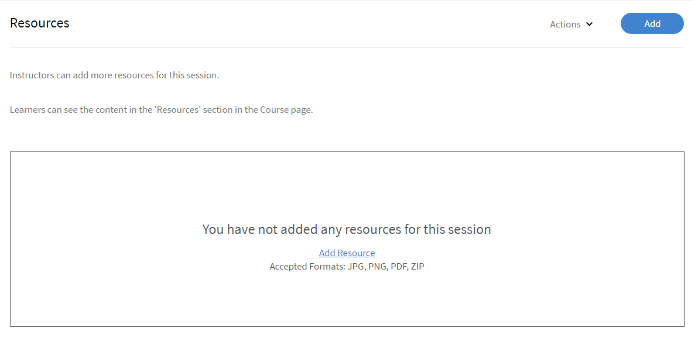
   *為該場次新增資源*

1. 在電腦中瀏覽對應的檔案。 選擇檔案，然後點選開啟。
1. 檔案上傳後，你可以看到檔案以及新增日期。

   已報名本模組的學習者可在課程的資源區段看到檔案上傳後的檔案。

   要刪除資源檔案，請選擇你想刪除的檔案。 從資源頁面點選「動作>刪除檔案」。

## 活動模組的檔案提交 {#filesubmissionforactivitymodules}

活動模組支援檔案提交工作流程。 作為作者，建立一個活動模組並選擇該  **[!UICONTROL File Submission]** 選項。 這讓學習者能夠提交檔案。

這些檔案可由課程教師審核或拒絕。 該模組只有在授課老師核准後才會完成。

 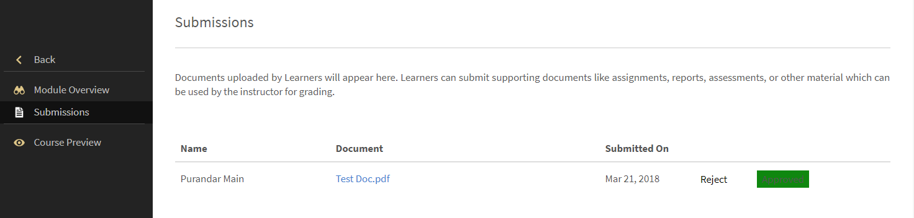
*批准或拒絕檔案*

## 評估檢查清單模組 {#evaluate-checklist-module}

學習者完成課程後，講師會在模組&#x200B;**區的提交/檢查清單頁面**&#x200B;查看檢查清單模組。本頁包含所有活動清單模組，以及需提交審查的活動提交模組。 每個模組會顯示評估截止人數。

在下方頁面，您可以瀏覽「提交」**和**「檢查清單&#x200B;**」這類**&#x200B;模組。在這個範例中，我們將使用 Checklist 模組。

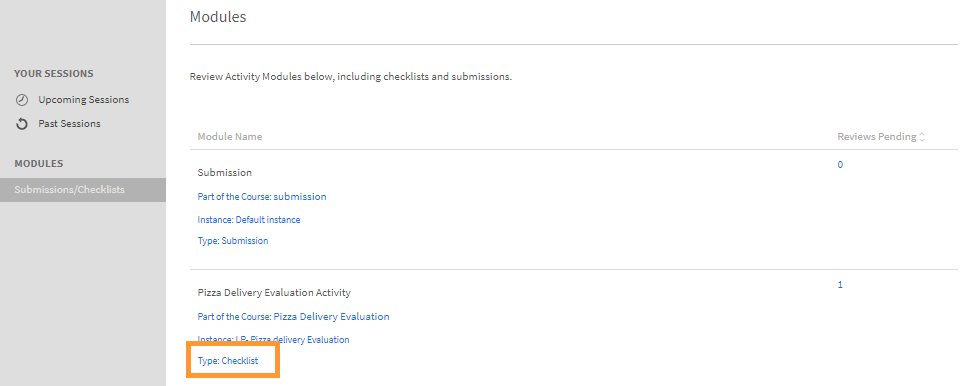
*查看模組列表*

點擊「清單」模組。 在 **清單** 頁面上，你會看到以下內容：

* 模組名稱
* 課程名稱
* 例如該課程屬於
* 作者設定的通過標準
* 檢查題數量

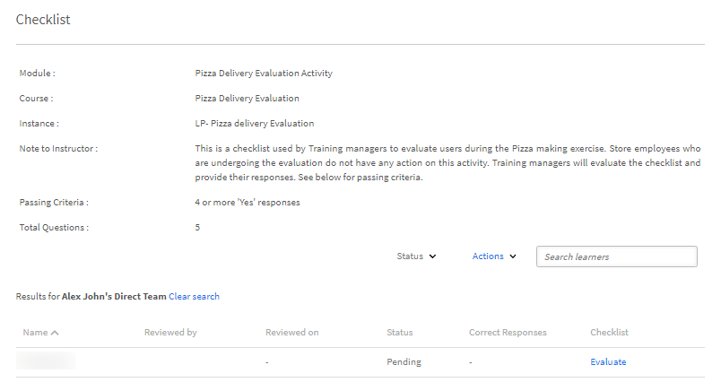
*請看清單頁面*

要評估學習者，請點擊 **[!UICONTROL Evaluate]** 欄位 **[!UICONTROL Checklist]** 。 你也可以看到審查狀態為 **待**&#x200B;處理。

評估學習者並點擊 **[!UICONTROL Submit]**。 作為講師，你必須回答所有評估問題。

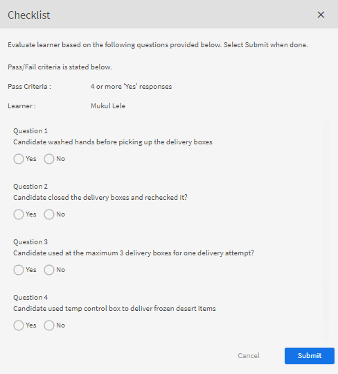
*評估檢查清單*

根據通過條件，狀態會是失敗或通過。

清單一旦評估完畢，就無法重新評估。

講師也可以查看其他講師提交的回答。

你可以根據所套用的搜尋篩選器，將學習者匯出成 csv。

講師使用檢查表評估課程後，學習者會看到模組狀態為 **通過** ，課程狀態為 **完成**，或模組狀態為 **失敗**，課程狀態為 **完成**。

## 老師因拒絕某項活動而給予評論 {#rejection-comments}

學習者可以在被拒絕通知中看到教師的評論。 學習者可透過提供更多意見形式重新提交。

工作流程如下：

1. 作者會建立包含活動模組的課程，指派一位講師，然後發佈課程。

1. 學習者會閱讀課程內容，完成課程後提交完成證明。

   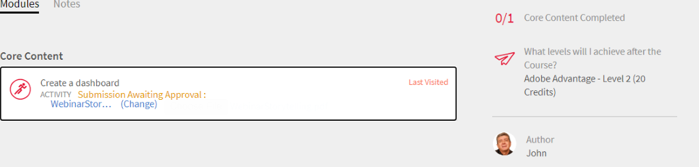
   *提交完成證明*

1. 講師接著選擇分配給他的活動模組。 在模組的提交頁面，講師點 **選編輯**。 他/她可以輸入拒絕留言，並啟用「顯示留言」選項，讓學習者能在通知中查看留言內容。

   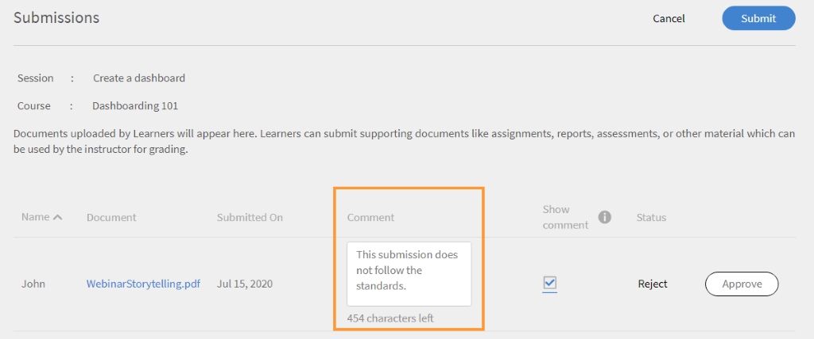
   *請進入完成評論*

1. 老師可以點擊 **拒絕**。 投稿狀態會變成 **「標記為拒絕**」。

   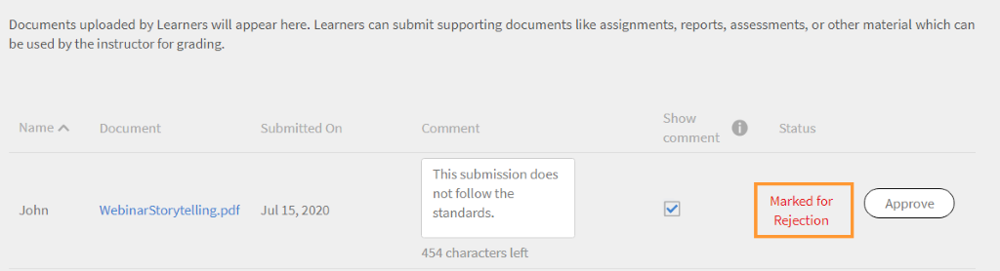
   *拒絕投稿*

1. 提交後，狀態會變成 **拒絕**。

   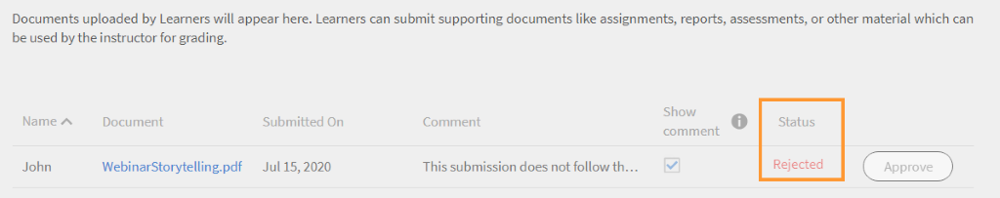
   *查看拒絕狀態*

1. 學習者現在會看到通知，表示其提交已被拒絕。 講師的留言也會顯示在通知中。

   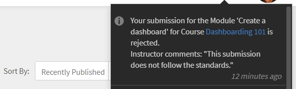
   *收到拒絕通知*

為了配合這些變更，Adobe 更新了「提交拒絕」**的電子郵件範本**。

## 為活動模組新增分數與評論 {#addscoresandcommentsforactivitymodules}

若要為已送交的活動模組新增分數與評論，請依照以下步驟進行：

1. 從左側窗格點擊 **[!UICONTROL Learner]**。

   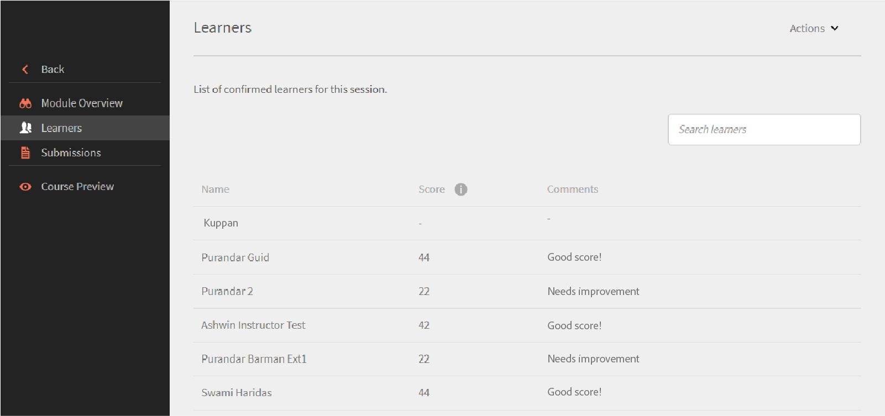
   *選擇學習者*

1. 從學習者頁面，點擊 **[!UICONTROL Actions]** > **[!UICONTROL Edit Scores & Comments]**。

   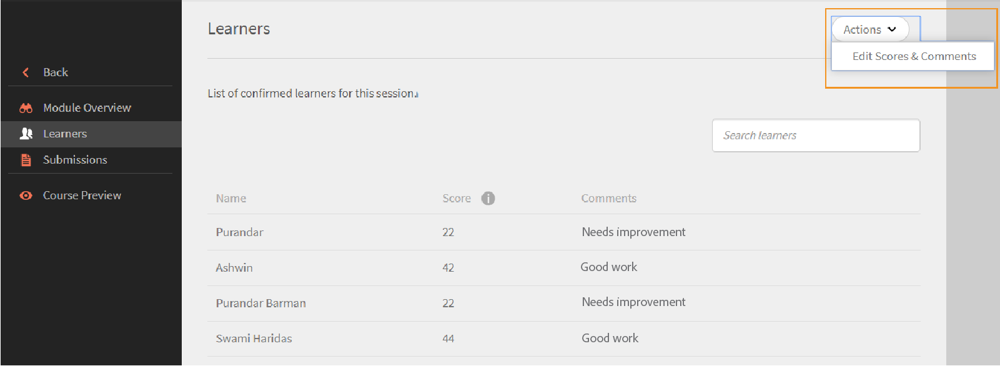
   *新增評論*

   對於尚未完成課程的學習者，分數與評論輸入欄位將不會出現。

   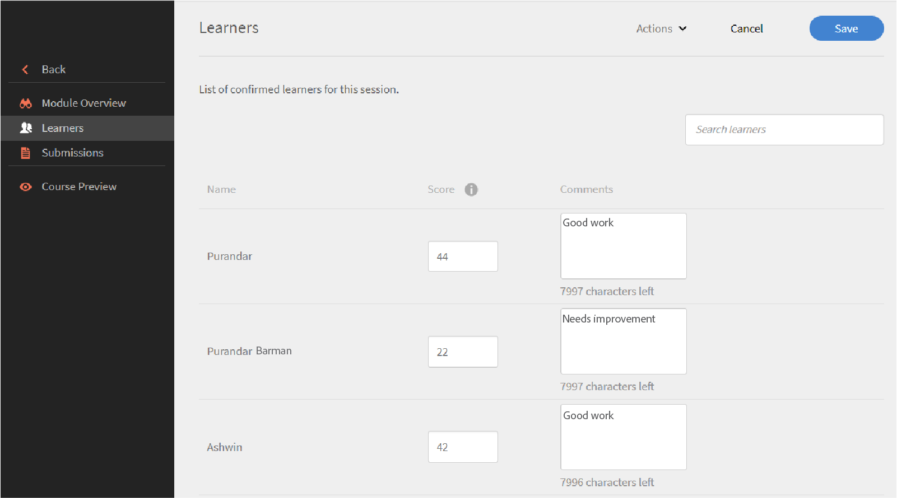
   *編輯分數與評論*

1. 點擊 **[!UICONTROL Save]**。
