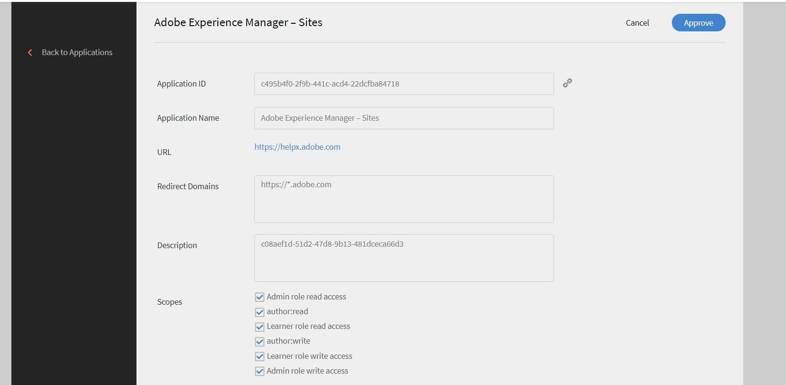
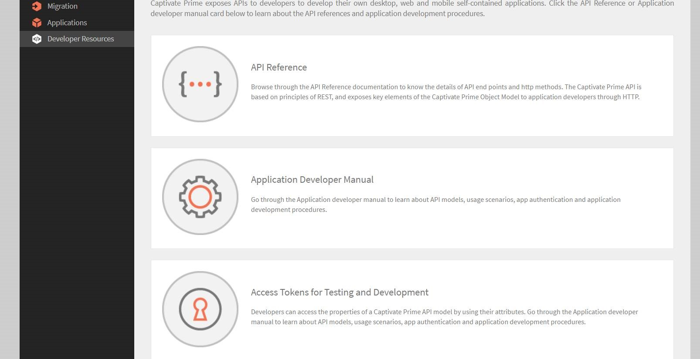

# 將Learning Manager與AEM整合

## 概觀 {#overview}

Learning Manager是內建學習內容管理系統的學習管理系統。 使用者透過將學習內容上傳到Learning Manager來管理其學習內容，讓Learning Manager執行版本設定、課程分配、定義學習者的可見度，以及追蹤消耗並回報給管理員。

不過，有些使用者會在資產管理系統上儲存和管理其內容。 然後，內容會重新用於各種其他功能。

學習者應用程式中存在的各種區段可以嵌入到AEM網站中。 任何登入AEM網站的學習者都會透過這些長條看到其特定的訓練資料。

## 下載內容封裝 {#downloadthecontentpackage}

安裝程式是以AEM內容套件的形式提供。 [***下載封裝***](https://github.com/adobe/captivate-prime-aem-components/releases)。

內容套件以zip檔案形式提供，並與AEM 6.4和AEM 6.5相容。

## 安裝Learning Manager元件 {#installcaptivateprimecomponent}

使用AEM Package Manager安裝Learning Manager內容套件：

>[!NOTE]
>
>如需安裝套件的資訊，請參閱&#x200B;[***如何使用套件***](https://experienceleague.adobe.com/docs/experience-manager-65/administering/contentmanagement/package-manager.html?lang=en#how-to-work-with-packages)。

1. 以AEM Author身分，開啟AEM Package Manager。

1. 按一下按鈕&#x200B;**上傳封裝**。

1. 按一下&#x200B;**[!UICONTROL Browse]**&#x200B;並上傳內容封裝。
1. 按一下&#x200B;**[!UICONTROL Upload]**。
1. 上傳套件後，選取內容套件並按一下&#x200B;**[!UICONTROL Install]**&#x200B;以安裝內容套件。

   

## 產生重新整理權杖 {#generatetherefreshtoken}

AEM管理員需要Learning Manager帳戶的重新整理權杖。 Learning Manager整合管理員會產生重新整理權杖。

1. 核准AEM Sites精選應用程式。

   按一下&#x200B;**[!UICONTROL Applications]** > **[!UICONTROL Featured Apps]** > **[!UICONTROL Adobe Experience Manager - Sites]**。

   

1. 按一下&#x200B;**[!UICONTROL Applications]** > **[!UICONTROL Featured Apps]**，然後開啟AEM網站應用程式。

   複製應用程式ID和說明。

1. 按一下&#x200B;**[!UICONTROL Developer Resources]** > **[!UICONTROL Access Tokens]**。

   

1. 輸入下列明細：

   * 使用者端ID，即為應用程式ID。
   * 使用者端密碼，顯示在說明中。

1. 取得OAuth程式碼。 您必須在重新導向URI中使用v2 API。
1. 按一下&#x200B;**[!UICONTROL Submit]**&#x200B;並取得重新整理權杖。

## 在AEM中設定Widget {#configurethewidgetinaem}

若為Widget設定，AEM作者只需要由Learning Manager整合管理員提供的重新整理權杖。

您也可以在多個頁面中設定多個帳戶設定。

1. 按一下&#x200B;**[!UICONTROL Tools]** > **[!UICONTROL Cloud Services]** > **[!UICONTROL Captivate Learning Manager Widget Configuration]**。
1. 按一下&#x200B;**[!UICONTROL Create]**。
1. 在這裡輸入重新整理權杖。 設定其他設定。
1. EU地區的主機名稱應該變更為「learningmanagereu」。
1. 儲存並關閉設定。
1. 選取設定併發佈設定。

## AEM作者 {#aemauthor}

AEM作者必須先在AEM範本中新增元件

然後，AEM作者將能夠拖放Adobe Learning Manager元件並據此進行設定。

Learning Manager元件需要將上步驟中建立的設定對應至頁面。  作者可以在&#x200B;**[!UICONTROL Advanced]** > **[!UICONTROL Configuration]** > **[!UICONTROL Cloud Configuration]**&#x200B;下編輯頁面屬性來對應設定，並提供設定路徑。 如此一來，作者就能建立多個Learning Manager帳戶的設定，並將每個帳戶對應至不同的Sites頁面。 如果組態未對應至頁面，元件會從父頁面遞回讀取組態，直到找到為止。

## 學習者 {#learner}

學習者可以從頁面內參加課程。

若要存取Learning Manager Widget，學習者應為已登入AEM的使用者。 此外，學習者的rep：User節點的&quot;/profile&quot;節點中應存在屬性&#x200B;**電子郵件**。 此電子郵件應與Learning Manager帳戶中顯示的電子郵件完全相同。

學習者可以從頁面內參加課程。

也會儲存課程進度。

提供下列Widget：

1. 遊戲
1. 學習行事曆
1. 社交Widget
1. 目錄Widget
1. 我的學習
1. 根據同儕學習的建議
1. 依管理員的Recommendations
1. 根據學習者興趣的建議

如果沒有建議，Widget會顯示為空白。

## 支援Skyline

Skyline是AEM的雲端版本。 您必須先從封裝管理員安裝Skyline。 若要在AEM中使用Skyline元件，使用者必須在Learning Manager帳戶中。 換言之，使用者的電子郵件地址必須存在於帳戶中。

## 部署Skyline

設定Skyline的步驟已在[GitHub存放庫](https://github.com/adobe/captivate-prime-aem-components)中提及。

## 目錄Widget

目錄Widget會向使用者顯示特定或一組目錄的培訓。 在頁面屬性的「屬性」區段中，從列出的選項中選取「目錄」。


目錄Widget包含下列選項：

* **[!UICONTROL Catalog ids]：**&#x200B;需要顯示培訓的逗號分隔目錄ID。
* **[!UICONTROL Sort]：**&#x200B;訓練的排序順序。 選項包括 — name、date、dateCreated、dateRegistered等。
* **[!UICONTROL Learner State]：**&#x200B;傳回所有使用下列作為篩選器的訓練 — 已註冊、已開始、已完成及未註冊。 如果排序選項是dateRegistered、dueDate或dateRegistered，將不會顯示搜尋結果。
* **[!UICONTROL Skill name]：**&#x200B;用來篩選確切訓練的技能。
* **[!UICONTROL Tag name]：**&#x200B;用來篩選確切結果的標籤。

以下是一些您可以自訂的其他元件：

**[!UICONTROL Learning Object Types]：**&#x200B;根據學習物件的型別篩選。 支援的型別為course、certification、jobAid和learningProgram。

在AEM中，長條圖中的卡片標題最初會是空的。 在屬性中，輸入widgets.html中標題的名稱。

**自訂**

您可以使用widgets.html來自訂版面外觀與風格。 您可以變更顯示的卡片外觀並自訂主題。

在&#x200B;**[!UICONTROL General Settings]**&#x200B;區段中，您可以選擇卡片的主要和次要顏色，並指定自訂佈景主題的屬性。

```
\{ 
 "globalCssText":"@import url('https://fonts.googleapis.com/css2?family=Grandstander:ital,wght@0,100;0,200;0,300;0,400;0,500;0,600;0,700;0,800;0,900;1,100;1,200;1,300;1,400;1,500;1,600;1,700;1,800;1,900&family=Montserrat:ital,wght@0,100;0,200;0,300;0,400;0,500;0,600;0,700;0,800;0,900;1,100;1,200;1,300;1,400;1,500;1,600;1,700;1,800;1,900&display=swap');", 
 "fontNames":"Grandstander", 
 "cardLayout":{ 
 "cardLayoutName":"compact", 
 "cardPrimaryColor":"#376BA4", 
 "cardSecondaryColor":"#F98EB0", 
 "startedStateTextColor":"#ffffff", 
 "continueStateTextColor":"#ffffff", 
 "revisitStateTextColor":"#ffffff", 
 "startedStateColor":"#a0a0a0", 
 "continueStateColor":"#f9a122", 
 "revisitedStateColor":"#7fbc64", 
 "textPrimaryColor":"#ffffff", 
 "textSecondaryColor":"#d93f3f", 
 "navIconColor":"#a0a0a0" 
 } 
}
```

### 忽略高階LO註冊

如果已啟用&#x200B;**[!UICONTROL Ignore Higher Order LO Enrollment]**&#x200B;核取方塊，且使用者已直接註冊學習計畫或認證，則該認證或學習計畫的課程將顯示在Widget中供使用者使用。

如果核取方塊已停用，使用者未直接註冊的學習計畫或認證中的課程將不會顯示。


然後，此設定會套用至Widget。

### 安全性

使用者端ID和使用者端密碼欄位已新增。 此外，重新整理權杖會被遮罩。 使用者建立整個設定後，如果使用者再次開啟設定進行編輯，或其他使用者開啟此設定，則重新整理權杖將被遮罩。
