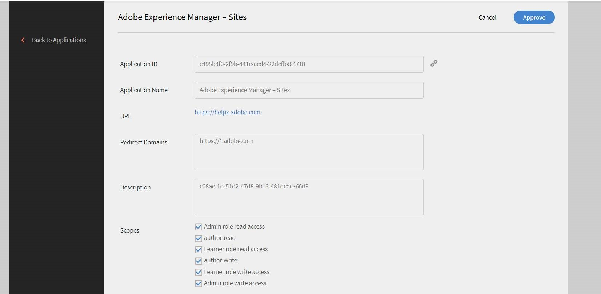
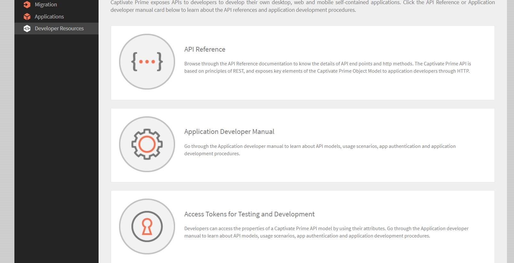

# 將學習管理工具整合進 AEM

## 概觀 {#overview}

學習管理系統是內建學習內容管理系統的學習管理系統。 使用者透過上傳至 Learning Manager 來管理學習內容，讓 Learning Manager 執行版本調整、課程分配、定義學習者可見性、追蹤使用情況並回報給管理員。

然而，也有使用者將內容儲存和管理於資產管理系統上。 內容隨後被重新利用於其他各種功能。

學習者應用程式中存在的各種條帶可以嵌入 AEM 網站中。 任何登入 AEM 網站的學習者，都會在這些試圖中看到他/她的專屬訓練資料。

## 下載內容包 {#downloadthecontentpackage}

安裝程式是以 AEM 內容套件形式出貨。 [***下載套件***](https://github.com/adobe/captivate-prime-aem-components/releases)。

內容包以壓縮檔形式提供，且相容於 AEM 6.4 與 AEM 6.5。

## 安裝學習管理器元件 {#installcaptivateprimecomponent}

使用 AEM 套件管理器安裝學習管理員內容套件：

>[!NOTE]
>
>關於安裝套件的資訊，請參閱  [***「如何處理套件***](https://experienceleague.adobe.com/docs/experience-manager-65/administering/contentmanagement/package-manager.html?lang=zh-Hant#how-to-work-with-packages)」。

1. 以 AEM 作者身份，開啟 AEM 套件管理器。

1. 點擊「上傳套件&#x200B;**」按鈕**。

1. 點擊 **[!UICONTROL Browse]** 並上傳內容包。
1. 點擊 **[!UICONTROL Upload]**。
1. 套件上傳後，選擇內容套件並點擊 **[!UICONTROL Install]**。

   

## 產生刷新令牌 {#generatetherefreshtoken}

AEM 管理員需要從學習管理員帳號重新整理令牌。 學習管理整合管理員會產生刷新令牌。

1. 批准 AEM 網站推薦應用程式。

   點擊 **[!UICONTROL Applications]** > **[!UICONTROL Featured Apps]** > **[!UICONTROL Adobe Experience Manager - Sites]**。

   

1. 點擊 **[!UICONTROL Applications]** > **[!UICONTROL Featured Apps]**，並開啟 AEM 網站應用程式。

   複製申請編號和說明。

1. 點擊 **[!UICONTROL Developer Resources]** > **[!UICONTROL Access Tokens]**。

   

1. 請輸入以下細節：

   * 客戶端 ID，也就是應用程式 ID。
   * 客戶端秘密，存在於描述中。

1. 取得 OAuth 代碼。 你必須在重定向 URI 中使用 v2 API。
1. 點擊 **[!UICONTROL Submit]** 並取得刷新代幣。

## 在 AEM 中設定小工具 {#configurethewidgetinaem}

對於元件設定，AEM 作者只需 Learning Manager 整合管理員提供的刷新權杖即可。

你也可以在多個頁面設定多個帳號設定。

1. 點擊 **[!UICONTROL Tools]** > **[!UICONTROL Cloud Services]** > **[!UICONTROL Captivate Learning Manager Widget Configuration]**。
1. 點擊 **[!UICONTROL Create]**。
1. 請在此輸入刷新代幣。 設定其他設定。
1. 主機名稱應改為歐盟區域的「learningmanagereu」。
1. 儲存並關閉設定。
1. 選擇一個配置並發布該設定。

## AEM 作者 {#aemauthor}

AEM 作者必須先將元件加入 AEM 範本中

AEM 作者就能拖放 Adobe Learning Manager 元件並相應配置。

Learning Manager 元件要求上述步驟建立的設定必須映射到頁面。  作者可以透過編輯頁面屬性>**[!UICONTROL Advanced]**&#x200B;**[!UICONTROL Cloud Configuration]**> **[!UICONTROL Configuration]** 來映射設定，並提供設定路徑。透過這種方式，Author 可以為多個 Learning Manager 帳號建立設定，並將每個帳號對應到不同的網站頁面。 如果設定未映射到頁面，元件會從父頁面反覆讀取該設定，直到找到設定為止。

## 學習者 {#learner}

學習者可以在頁面內修讀課程。

要存取 Learning Manager 元件，Learner 必須是已登入的 AEM 使用者。 此外，學&#x200B;**員代表:User節點的「/profile」節點中應該有屬性電子郵件**。這個電子郵件應該和 Learning Manager 帳號裡的郵件完全一樣。

學習者可以在頁面內修讀課程。

課程進度也會被保存。

提供以下小工具：

1. 遊戲化
1. 學習行事曆
1. 社群小工具
1. 目錄小工具
1. 我的學習
1. 基於同儕學習的推薦
1. 管理員建議
1. 根據學習者興趣的推薦

如果沒有推薦，該小工具會顯示為空白。

## 支援天際線

Skyline 是 AEM 的雲端版本。 你必須先從套件管理器安裝 Skyline。 要在 AEM 中使用 Skyline 元件，使用者必須在學習管理員帳號中存在。 換句話說，使用者的電子郵件地址必須存在於帳號中。

## 部署 Skyline

設定 Skyline 的步驟在 GitHub 倉庫[&#128279;](https://github.com/adobe/captivate-prime-aem-components)中有說明。

## 目錄小工具

目錄小工具會顯示特定或一組目錄的訓練給使用者。 在頁面屬性的屬性區塊，從列出的選項中選擇目錄。


目錄小工具包含以下選項：

* **[!UICONTROL Catalog ids]：** 需顯示訓練內容的逗號分隔目錄ID。
* **[!UICONTROL Sort]：** 訓練順序。 選項有：姓名、日期、已建立日期、已註冊日期等等。
* **[!UICONTROL Learner State]：** 回傳所有使用以下篩選條件的訓練——已註冊、開始、完成及未註冊。 若排序選項為 dateEnrolled、dueDate 或 dateEnrolled，搜尋結果將不顯示。
* **[!UICONTROL Skill name]：** 用來篩選精確訓練的技能。
* **[!UICONTROL Tag name]：** 用來篩選精確結果的標籤。

以下是一些你可以自訂的額外組件：

**[!UICONTROL Learning Object Types]：** 根據學習物件的類型進行篩選。 支援的類型包括課程、認證、就業援助和學習計畫。

在 AEM 中，條狀卡片的標題一開始會是空的。 在物業中輸入標題名稱，widgets.html。

**客製化**

你可以用widgets.html自訂版面的外觀和感覺。 你可以改變出現卡片的外觀並自訂主題。

在這個 **[!UICONTROL General Settings]** 區塊中，你可以選擇卡片的主色和副色，並指定屬性來自訂主題。

```
\{ 
 "globalCssText":"@import url('https://fonts.googleapis.com/css2?family=Grandstander:ital,wght@0,100;0,200;0,300;0,400;0,500;0,600;0,700;0,800;0,900;1,100;1,200;1,300;1,400;1,500;1,600;1,700;1,800;1,900&family=Montserrat:ital,wght@0,100;0,200;0,300;0,400;0,500;0,600;0,700;0,800;0,900;1,100;1,200;1,300;1,400;1,500;1,600;1,700;1,800;1,900&display=swap');", 
 "fontNames":"Grandstander", 
 "cardLayout":{ 
 "cardLayoutName":"compact", 
 "cardPrimaryColor":"#376BA4", 
 "cardSecondaryColor":"#F98EB0", 
 "startedStateTextColor":"#ffffff", 
 "continueStateTextColor":"#ffffff", 
 "revisitStateTextColor":"#ffffff", 
 "startedStateColor":"#a0a0a0", 
 "continueStateColor":"#f9a122", 
 "revisitedStateColor":"#7fbc64", 
 "textPrimaryColor":"#ffffff", 
 "textSecondaryColor":"#d93f3f", 
 "navIconColor":"#a0a0a0" 
 } 
}
```

### 忽略高階LO的註冊

如果 **[!UICONTROL Ignore Higher Order LO Enrollment]** 勾選框啟用且使用者直接註冊學習計畫或認證，該認證或學習計畫的課程會顯示在元件中。

若該勾選框被停用，則學習計畫或認證中未直接註冊的課程將不會出現。


接著將設定套用到小工具上。

### 安全性

新增了 Client ID 和 Client Secret 欄位。 此外，刷新代幣也會被遮蔽。 使用者建立完整組態後，若再次開啟組建以編輯，或是其他使用者開啟此組，刷新令牌將會被遮蔽。
