# 將Adobe Learning Manager與AEM整合

Adobe Learning Manager (ALM)與Adobe Experience Manager (AEM)網站整合。 這可讓您以最少的編碼工作量，為Adobe Learning Manager建立自己的網站和回應式行動介面。 透過這項整合，您可以為使用者建立自訂的學習體驗。

為了建立這樣的體驗，ALM以ZIP檔案的形式，提供適用於AEM Sites的Adobe Learning Manager參考站台套件（ALM參考站台套件），您可以安裝在您的AEM Sites執行個體上。

此套件包含AEM Sites網頁範本和網站元件以及內嵌的Widget，例如學習目錄、內嵌的Widget、日曆等。

安裝ALM參考站台套件後，您就可以開始建立Adobe Learning Manager的網站，以便在AEM Sites執行個體上託管。 之後，您的使用者可以將元件拖放至網站上。

>[!IMPORTANT]
>
>適用於AEM Sites的Adobe Learning Manager (ALM)套件提供實作的快速入門程式碼區塊。 此套件是專為Headless部署所設計。 實施提供的程式碼基底後，進行中的維護和進一步開發應由實施方負責，這與以Adobe Learning Manager為基礎的Headless應用程式的標準做法相同。

## 安裝ALM參照站台套件

### 先決條件

* AEM Sites和Adobe Commerce的授權。
* AEM on-premise 6.5或Adobe Experience Manager - Cloud Service
* Adobe Commerce 2.4.3

保護AEM Sites環境後，您必須安裝ALM參考站台套件。 此套件包含協助建構學習平台的AEM網頁和網站元件。

參考站台封裝裝載於&#x200B;[**GitHub存放庫**](https://github.com/adobe/adobe-learning-manager-reference-site/releases/tag/1.0.0)。

如需詳細資訊，請參閱README。

## 下載內容封裝 {#downloadthecontentpackage}

安裝程式是以AEM內容套件的形式提供。 [***下載封裝***](https://github.com/adobe/adobe-learning-manager-reference-site)。

內容套件以zip檔案形式提供，並與AEM 6.4和AEM 6.5相容。

## 安裝Learning Manager元件 {#installcaptivateprimecomponent}

使用Learning Manager Package Manager安裝AEM內容套件：

>[!NOTE]
>
>如需有關安裝套件的資訊，請參閱&#x200B;[***如何使用套件***](https://experienceleague.adobe.com/docs/experience-manager-65/administering/contentmanagement/package-manager.html?lang=zh-Hant#how-to-work-with-packages)。

1. 以AEM Author的身分，開啟AEM Package Manager。
1. 按一下按鈕&#x200B;**[!UICONTROL Upload Package]**。
1. 按一下&#x200B;**[!UICONTROL Browse]**&#x200B;並上傳內容封裝。
1. 按一下&#x200B;**[!UICONTROL Upload]**。
1. 上傳套件後，選取內容套件並按一下&#x200B;**[!UICONTROL Install]**&#x200B;以安裝內容套件。

   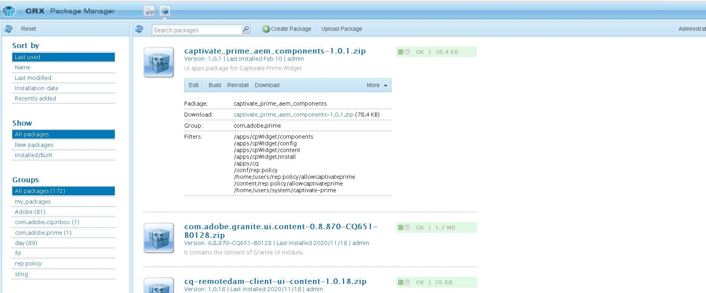

   *安裝內容封裝*

## 在[!DNL Adobe Learning Manager]中建立應用程式

安裝AEM網站套件後，您必須設定ALM應用程式，將學習入口網站與AEM網站連線。

此案例適用於AEM搭配[!DNL Adobe Learning Manager]使用的情況。

請遵循下列步驟：

1. 以整合管理員的身分，按一下&#x200B;**[!UICONTROL Applications]**。
1. 若要建立新的應用程式，請按一下頁面右上角的&#x200B;**[!UICONTROL Register]**。
1. 在註冊新應用程式畫面中，輸入下列詳細資訊：

   1. 應用程式名稱：您正在建立的應用程式名稱。
   1. URL：您組織的URL。
   1. 重新導向網域： AEM網站的代管網域。 您也可以指定萬用字元。
   1. 說明：應用程式的說明。
   1. 範圍：選取學習者角色讀取存取權和學習者角色寫入存取權。
   1. 僅針對此帳戶？：如果您要將應用程式用於現有的ALM帳戶，請選取「是」。

1. 進行變更後，按一下「儲存」 。

從畫面中記下應用程式認證。

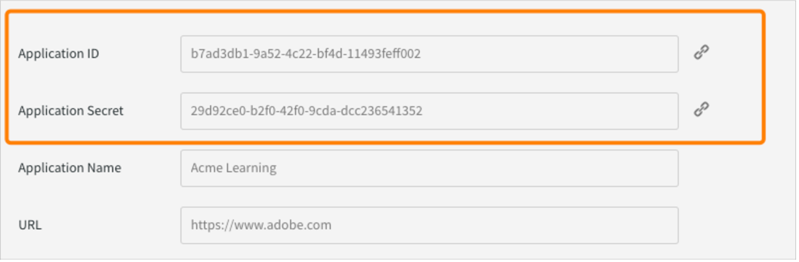
*應用程式認證*

若要核准應用程式，請按一下&#x200B;**[!UICONTROL Approve]**。

## 取得權杖

1. 在[開發人員資源]索引標籤中，按一下&#x200B;**[!UICONTROL Access Tokens for Testing and Development]**。

   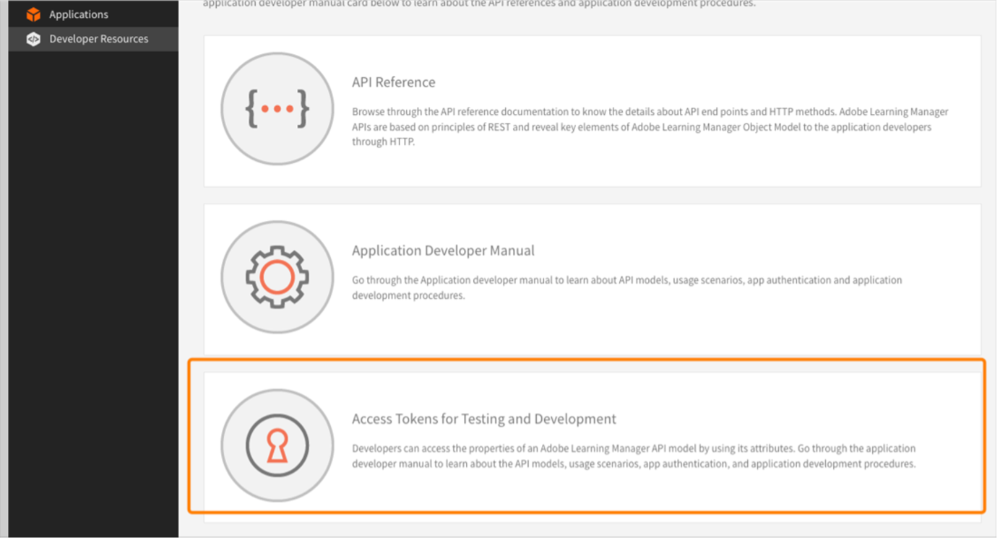

   *選取用於測試和開發的存取權杖*

1. 輸入下列明細：

   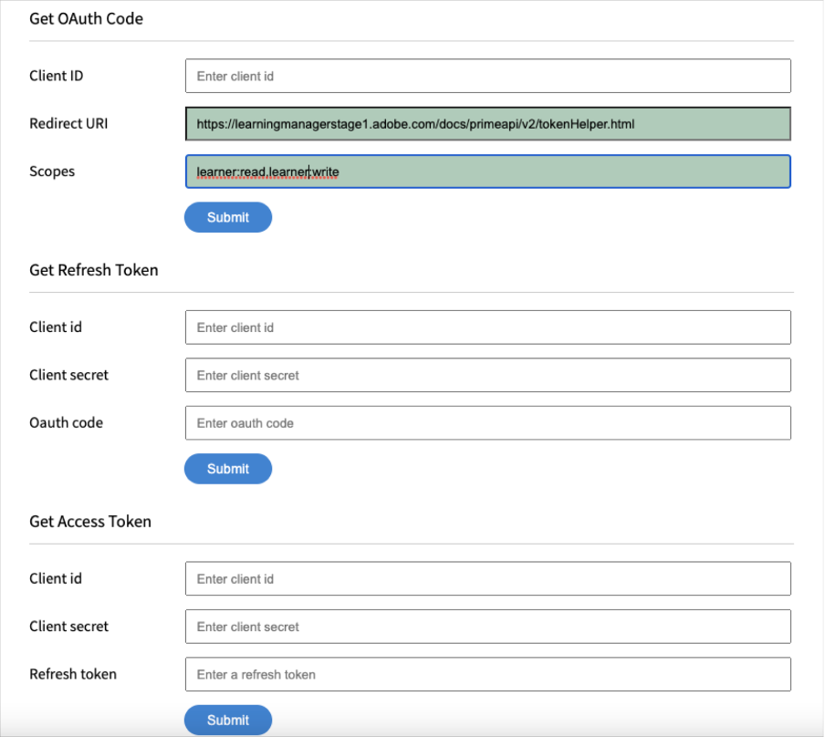
   *輸入權杖詳細資料*

   1. 取得OAuth代碼：輸入上一節的使用者端ID並變更範圍。 按一下「提交」以取得Oauth代碼。
   1. 取得重新整理Token：輸入上一節中的使用者端ID和密碼。 同時輸入您在上一步得到的OAuth程式碼。 按一下「提交」。
   1. 取得存取Token：輸入上一節中的使用者端ID和密碼。 同時輸入您在上一步驟中取得的重新整理Token。 按一下「提交」。
   1. 取得存取Token詳細資料：輸入您在上一步驟中取得的存取Token。 按一下「提交」。

1. 您可以透過以下的JSON回應取得詳細資料。 回應包含存取權杖、重新整理權杖、使用者角色、帳戶ID、使用者ID和到期時間。 記下重新整理權杖，因為您將重複使用它。

## 在AEM中設定ALM帳戶

1. 啟動您的AEM執行個體。
1. 按一下「設定>雲端服務」 。
1. 按一下「Adobe Learning Manager設定」 。

   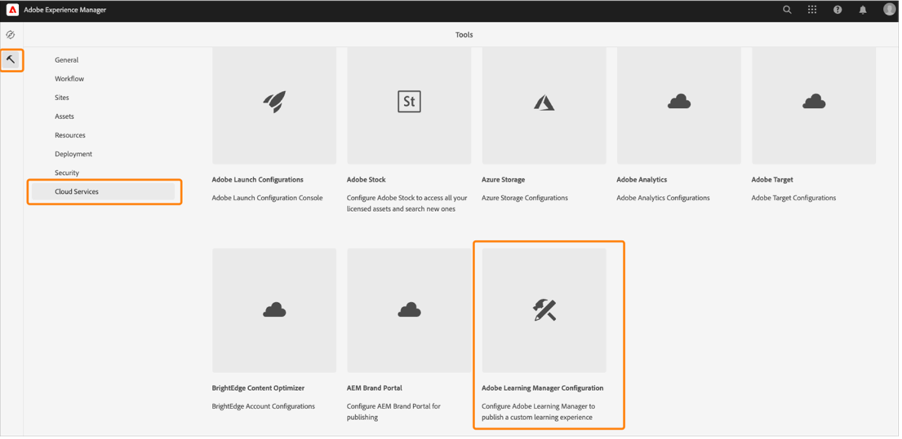
   *選取Adobe Learning Manager設定*

1. 按一下「建立>組態資料夾」。 為資料夾命名。

   
   *建立設定*

1. 在學習專案中，選取您建立的設定。

1. 輸入設定的詳細資料。

   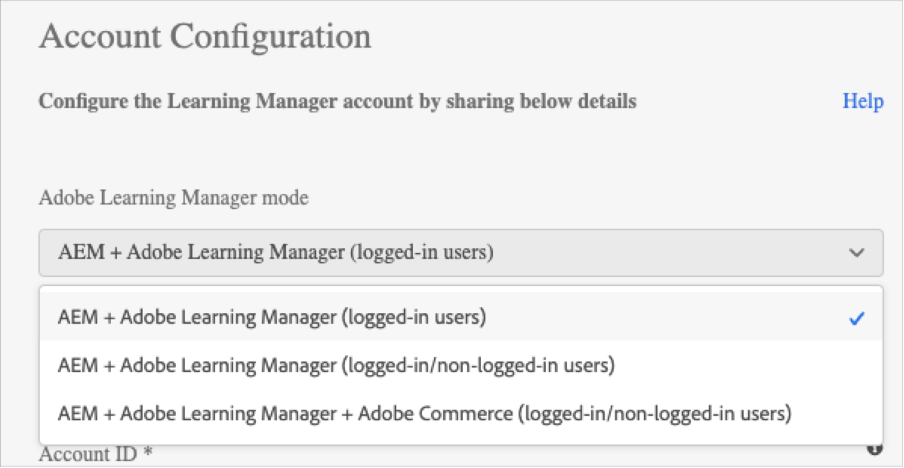
   *建立設定資料夾*

   1. Adobe Learning Manager模式：選擇您希望登入和未登入學習者的學習體驗。
   1. Adobe Learning Manager URL：輸入託管學習服務之ALM執行個體的URL。
   1. 帳戶ID： ALM帳戶ID。
   1. 使用者端ID、使用者端密碼和作者重新整理權杖：輸入您在ALM中建立應用程式時獲得的認證。
   1. 自訂Widget：如需詳細資訊，請參閱[與AEM整合](/help/migrated/integrate-aem-learning-manager.md) `.`

1. 儲存並關閉設定。

### AEM + Adobe Learning Manager （已登入/未登入的使用者）

Adobe Learning Manager現在可讓您向現有和潛在客戶及合作夥伴展示您的產品和訓練，而不需要建立或登入帳戶。 此功能可為學習者提供訓練的快速輕鬆預覽，有助於強調和推廣產品功能，進而協助您促進產品和訓練的採用。 因此，您可以有效地展示您的產品和方案，尤其是向潛在客戶和合作夥伴展示，進而提升產品知名度。 輕鬆存取和更好的可及性帶來更高的興趣，有助於推動培訓註冊和學習採用。

學習者使用此工作流程即可預覽訓練、存取訓練資訊，或搜尋訓練，而無需登入Adobe Learning Manager。 此工作流程不適用於原生Learning Manager介面(僅適用於AEM Sites和其他Headless介面)。

**設定並啟用學習平台聯結器**

本節將說明設定和啟用以下聯結器所需的步驟：

**訓練資料存取**

此聯結器可讓您的AEM Sites式或其他自訂的Headless使用者介面擷取訓練資訊並將資訊呈現給學習者，並在學習者登入之前或之後實現無縫的訓練資訊搜尋。

只有在您使用AEM Sites或其他Headless介面時，才需要使用此聯結器。

聯結器會將訓練中繼資料匯出至資料儲存和擷取解決方案，以及搜尋啟用系統。 因此，您可以設定AEM Sites式或其他自訂的Headless使用者介面，使用這兩項服務來擷取訓練資料、轉譯網頁，並為學習者提供最佳化的訓練搜尋功能。 例如，未登入AEM Sites型介面可使用匯出的中繼資料，協助學習者搜尋、瀏覽及存取顯示訓練資訊的訓練頁面。

啟用此聯結器可建置及轉譯您的AEM Sites網頁，並在登入前後為學習者提供自訂體驗。 啟用此聯結器可建置及轉譯您的AEM Sites網頁，並在登入前後為學習者提供自訂體驗。

* Adobe Learning Manager CDN基底URL — 從訓練資料存取連線頁面輸入資料擷取CDN服務路徑的基底URL。
* 管理員重新整理Token — 輸入您在前一節中決定的重新整理Token。
* 訓練中繼資料基底URL — 從「訓練資料存取」連線頁面，輸入搜尋啟用與搜尋資料擷取服務路徑的基底URL。
* Adobe Learning Manager註冊URL — 輸入整合管理員為帳戶產生的自助註冊URL，學習者可使用此帳戶註冊培訓。

### AEM + Adobe Learning Manager + Adobe Commerce （已登入/未登入的使用者）

Adobe Learning Manager現在提供解決方案，協助您將學習平台與Adobe Commerce緊密整合。 此版本可讓您輕鬆地將原生、AEM網站型或其他Headless Learning Manager介面連線到Adobe Commerce。 此整合可讓您在學習平台中實現電子商務功能。 您現在可以為客戶和商務合作夥伴提供付費培訓，並讓您在原生和非原生Learning Manager介面上輕鬆購買培訓。 學習者也可預覽訓練、存取訓練資訊，或搜尋訓練，而不需要登入Adobe Learning Manager。

使用者可以使用已經的AEM應用程式並加以核准，而不是建立應用程式。

* Adobe Learning Manager CDN基底URL — 輸入來自Adobe Commerce連線頁面之資料擷取CDN服務路徑的基底URL。
* Adobe Commerce URL — 輸入您使用的Adobe Commerce執行個體的URL。
* GraphQL Proxy路徑 — 使用者端Learning Manager元件會直接存取Adobe Commerce GraphQL端點，因此可能會發生CORS錯誤。 若要避免此錯誤，所有呼叫都必須從與AEM相同的端點提供服務，或是透過新增CORS標題的Proxy提供。
* Adobe Commerce商店名稱 — 輸入您在前一節中判斷的Adobe Commerce商店名稱。
* Adobe Commerce客戶權杖存留期（以秒為單位） — 輸入客戶權杖存留期，表示登入工作階段的預先確定期間。
* 管理員重新整理Token — 輸入您在前一節中決定的重新整理Token。

## 自訂網頁

使用AEM參考網站和可用的Widget來自訂您的網頁。

1. 啟動您的AEM執行個體。
1. 按一下Sites並開啟設定頁面。
1. 按一下&#x200B;**[!UICONTROL Learning Site]** > **[!UICONTROL Language Masters]** > **[!UICONTROL English]**。 專案中的所有網頁都包含在資料夾中。

   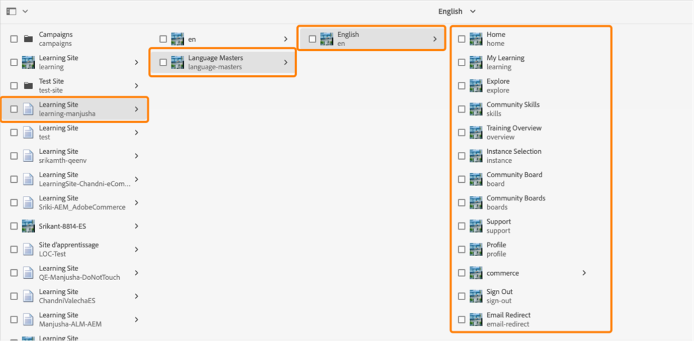
   *檢視所有網頁*

1. 選取任何範本並按一下&#x200B;**[!UICONTROL Edit]**。

1. 在頁面上，按一下元件設定按鈕並變更元件的屬性。

   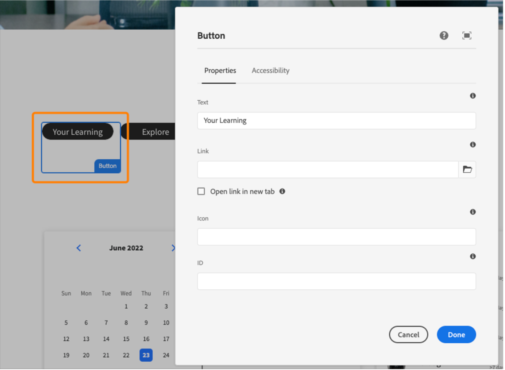
   *選取設定按鈕*

1. 預覽您的變更，或者您可以發佈頁面。

## 建立網頁

除了參考網站套件所提供的可用範本以外，您也可以根據範本ibn AEM建立網頁。

1. 在AEM首頁面上，按一下「建立>頁面」 。

1. 選擇要自訂的範本。 按一下「下一步」。

1. 輸入頁面屬性。

   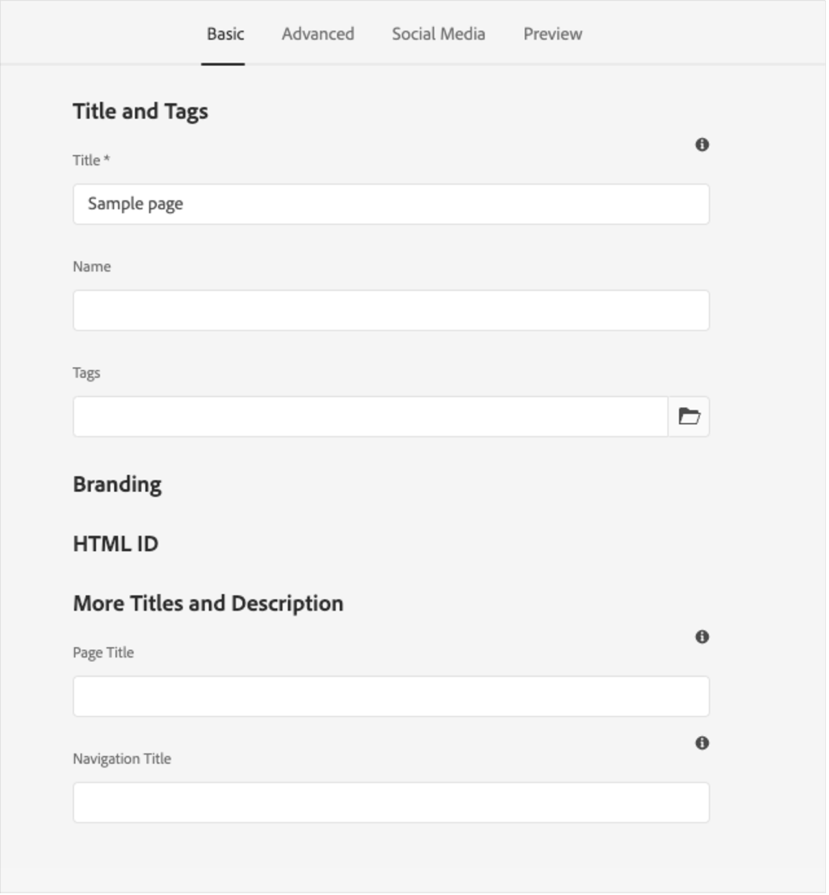
   *頁面屬性*

1. 若要建立頁面，請按一下&#x200B;**[!UICONTROL Create]**。

1. 選取新頁面並按一下&#x200B;**[!UICONTROL Edit]**。

1. 在頁面上插入元件，例如&#x200B;**學習 — 內容**。

   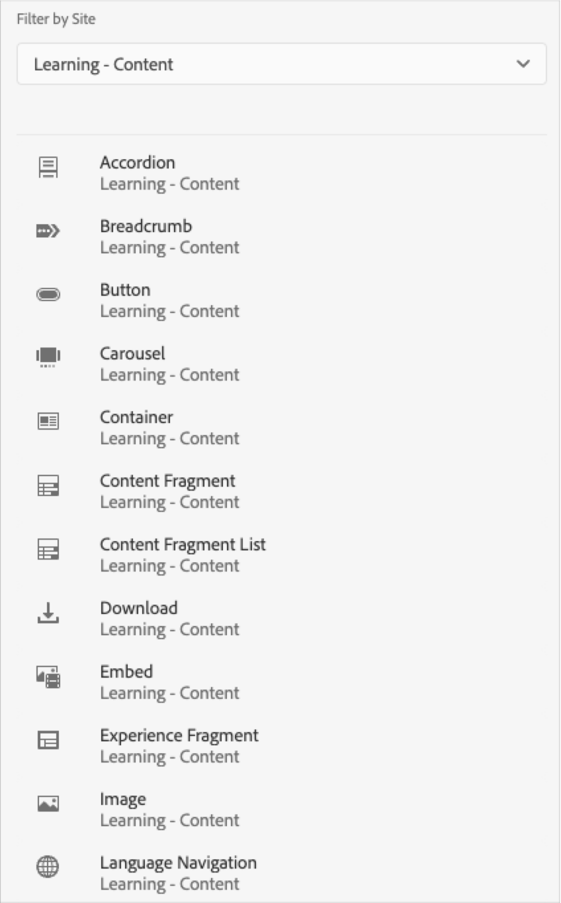
   *依網站篩選*

1. 選擇要在頁面上顯示的必要目錄篩選器。

## 從藍圖建立網站

ALM參考網站套件提供「學習網站藍圖」，可讓您為學習平台建立網站。 AEM藍圖可讓您直接從AEM Sites元件建置網頁。 您不需要使用任何範本。

1. 在AEM起始頁面上，按一下&#x200B;**[!UICONTROL Sites]**。

1. 按一下&#x200B;**[!UICONTROL Create]** > **[!UICONTROL Site]**。

1. 按一下學習網站Blueprint。

   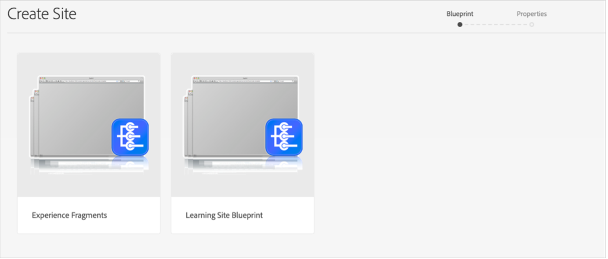

   *從Blueprint建立網站*

1. 按一下「下一步」。

1. 在屬性頁面上，輸入頁面中繼資料。 按一下「建立」。

   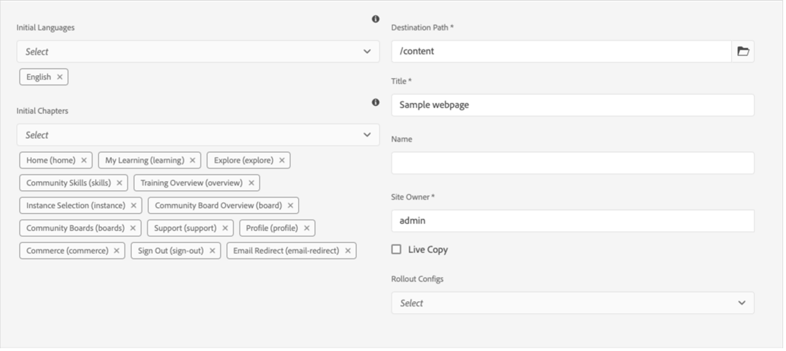
   *選取學習網站Blueprint*

1. 按一下「首頁」超連結，以導覽至您已建立之網站的首頁。 您可以在此頁面上自訂Widget和目錄元件。

## 為您的網站編碼

除了使用內建範本並使用WYSIWYG元件從頭開始建立您的網站外，您還可以撰寫程式碼並建置網站。

程式碼位於[參考網站GitHub存放庫](https://github.com/adobe/adobe-learning-manager-reference-site)中，可供您開始使用。

範本的主要部分為：

* core：Java套件組合包含所有核心功能（例如OSGi服務、接聽程式或排程器）以及與元件相關的Java程式碼（例如servlet或請求篩選器）。
* ui.apps：包含專案的/apps （和/etc）部分，即JS&amp;CSS clientlibs、元件、範本。
* ui.content：此變數包含使用ui.apps中的元件的範例內容
* ui.frontend：包含React元件。

所有程式碼都位於存放庫中，可供您啟動和執行。

## 將學習管理員元件匯入並新增至現有網頁或範本

安裝AEM參考站台套件會將Learning Manager元件新增至您的AEM Sites執行個體。 預設情況下，您可以將這些元件新增到我們提供的現成可用的Web專案（網站）學習網站。 這些元件也可在您從學習網站Blueprint建立的網站中使用。

不過，如果您想要將這些新新增的Learning Manager元件用於您現有的Web專案或網站，則應使用下列程式匯入這些元件。

1. 安裝ALM參照站台套件。

1. 開啟Web專案，並導覽至HTML檔案(針對您要新增Learning Manager元件的網頁或網頁範本)。
1. 加入會議

   開啟HTML檔案並將下列程式碼片段新增至頁面元件，讓程式碼在頁面轉譯器中呈現的學習元件之前執行。

   *`<sly data-sly-use.configModel="com.adobe.learning.core.models.GlobalConfigurationModel"/>`*
   *`<meta name="cp-config" content="${configModel.config}" />`*

   上述程式碼會將對應的設定新增至頁面的meta標籤中，這是學習元件轉譯的必要條件。 如需詳細資訊，請參閱[Adobe Learning Manager參考網站](https://github.com/adobe/adobe-learning-manager-reference-site/blob/master/ui.apps/src/main/content/jcr_root/apps/learning/components/page/customheaderlibs.html)。

1. 確認您已對應組態與Web專案。
1. 開啟您要匯入AEM Sites元件的Learning Manager範本。
1. 在範本頁面編輯器上，瀏覽至「允許的元件」容器，並選取&#x200B;**原則**。
1. 在「原則」頁面中，導覽至「屬性>允許的元件」，並選取下列元件「學習 — 內容」、「學習 — 表單」和「學習 — 結構」

下列程式可讓範本完成匯入的Learning Manager元件的使用者端程式庫相依性。

包含這些元件的網頁應載入這些程式庫，才能成功轉譯和使用元件。

1. 在範本頁面編輯器上，按一下頁面資訊，然後按一下頁面原則。
1. 在「原則」頁面中，導覽至「屬性>使用者端程式庫」，並將它們新增至您的範本頁面：

   1. learning.site
   1. learning.ui
   1. learning.commerce

儲存此範本後，您可以在衍生自此範本的所有網頁中新增Learning Manager元件。

## 在AEM中設定Widget {#configurethewidgetinaem}

針對Widget設定，AEM作者只需要Learning Manager整合管理員提供的重新整理權杖。

您也可以在多個頁面中設定多個帳戶設定。

1. 按一下&#x200B;**[!UICONTROL Tools]** > **[!UICONTROL Cloud Services]** > **[!UICONTROL Learning Manager Widget Configuration]**。
1. 按一下&#x200B;**[!UICONTROL Create]**。
1. 在這裡輸入重新整理權杖。 設定其他設定。
1. EU地區的主機名稱應該變更為「learningmanagereu」。
1. 儲存並關閉設定。
1. 選取設定併發佈設定。

## AEM Author {#aemauthor}

AEM作者必須先在AEM範本中新增元件

接著AEM作者將能夠拖放Adobe Learning Manager元件，並據此進行設定。

Learning Manager元件需要將上述步驟中建立的設定對應至頁面。  作者可以在&#x200B;**[!UICONTROL Advanced]** > **[!UICONTROL Configuration]** > **[!UICONTROL Cloud Configuration]**&#x200B;下編輯頁面屬性來對應設定，並提供設定路徑。 如此一來，作者就能建立多個Learning Manager帳戶的設定，並將每個帳戶對應至不同的Sites頁面。 如果組態未對應至頁面，元件會從父頁面遞回讀取組態，直到找到為止。

## 學習者 {#learner}

學習者可以從頁面內參加課程。

若要存取Learning Manager Widget，學習者應為已登入AEM的使用者。 此外，學習者的rep **節點的&quot;/profile&quot;節點中應存在屬性**&#x200B;電子郵件:User。 此電子郵件應與Learning Manager帳戶中顯示的電子郵件完全相同。

學習者可以從頁面內參加課程。

也會儲存課程進度。

提供下列Widget：

1. gamification
1. 學習行事曆
1. 社交Widget
1. 目錄Widget
1. 我的學習
1. 根據同儕學習的建議
1. 管理員的建議
1. 根據學習者興趣的建議

如果沒有建議，Widget會顯示為空白。

## 支援Skyline

Skyline是AEM的雲端版本。 您必須先從封裝管理員安裝Skyline。 若要在AEM中使用Skyline元件，使用者必須在Learning Manager帳戶中。 換言之，使用者的電子郵件地址必須存在於帳戶中。

### 部署Skyline

設定Skyline的步驟已在[GitHub存放庫](https://github.com/adobe/captivate-prime-aem-components)中提及。

## 我的學習Widget

**[!UICONTROL My Learning]** Widget可讓您向使用者顯示特定或一組目錄的培訓。

在頁面屬性的&#x200B;**[!UICONTROL Properties]**&#x200B;區段中，從列出的選項中選取&#x200B;**[!UICONTROL Catalog]**。

<!--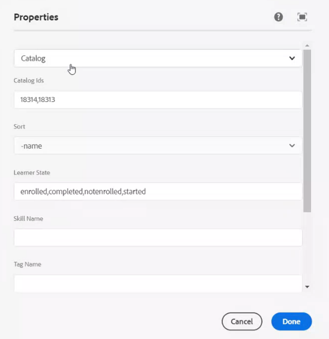-->

「目錄」選項包含下列選項：

* **[!UICONTROL Catalog ids]：**&#x200B;需要顯示培訓的逗號分隔目錄ID。
* **[!UICONTROL Sort]：**&#x200B;訓練的排序順序。 選項包括 — name、date、dateCreated、dateRegistered等。
* **[!UICONTROL Learner State]：**&#x200B;傳回所有使用下列作為篩選器的訓練 — 已註冊、已開始、已完成和未註冊。 如果排序選項是dateRegistered、dueDate或dateRegistered，將不會顯示搜尋結果。
* **[!UICONTROL Skill name]：**&#x200B;用來篩選確切訓練的技能。
* **[!UICONTROL Tag name]：**&#x200B;用來篩選確切結果的標籤。

以下是一些您可以自訂的其他元件：

**[!UICONTROL Learning Object Types]：**&#x200B;根據學習物件的型別篩選。 支援的型別為course、certification、jobAid和learningProgram。

在AEM中，橫條中的卡片標題最初會是空的。 在屬性中，輸入widgets.html中標題的名稱。

**自訂**

您可以使用widgets.html來自訂版面外觀與風格。 您可以變更顯示的卡片外觀並自訂主題。

在&#x200B;**[!UICONTROL General Settings]**&#x200B;區段中，您可以選擇卡片的主要和次要顏色，並指定自訂佈景主題的屬性。

```
{ 
 "globalCssText":"@import url('https://fonts.googleapis.com/css2?family=Grandstander:ital,wght@0,100;0,200;0,300;0,400;0,500;0,600;0,700;0,800;0,900;1,100;1,200;1,300;1,400;1,500;1,600;1,700;1,800;1,900&family=Montserrat:ital,wght@0,100;0,200;0,300;0,400;0,500;0,600;0,700;0,800;0,900;1,100;1,200;1,300;1,400;1,500;1,600;1,700;1,800;1,900&display=swap');", 
 "fontNames":"Grandstander", 
 "cardLayout":{ 
 "cardLayoutName":"compact", 
 "cardPrimaryColor":"#376BA4", 
 "cardSecondaryColor":"#F98EB0", 
 "startedStateTextColor":"#ffffff", 
 "continueStateTextColor":"#ffffff", 
 "revisitStateTextColor":"#ffffff", 
 "startedStateColor":"#a0a0a0", 
 "continueStateColor":"#f9a122", 
 "revisitedStateColor":"#7fbc64", 
 "textPrimaryColor":"#ffffff", 
 "textSecondaryColor":"#d93f3f", 
 "navIconColor":"#a0a0a0" 
 } 
}
```

### 在AEM網站中設定我儲存的課程Widget

「我的已儲存課程」Widget可讓學習者直接在學習頁面上檢視其已建立書籤或已儲存的課程，並可讓您輕鬆存取要稍後重新造訪或完成的課程。

若要在AEM網站中設定「我的已儲存課程」Widget：

1. 啟動AEM網站。
2. 以&#x200B;**[!UICONTROL Edit]**&#x200B;模式開啟頁面。
3. 前往&#x200B;**[!UICONTROL Components Browser]**&#x200B;並將&#x200B;**[!UICONTROL My Learning widget]**&#x200B;新增至頁面。
4. 選取元件，然後選取&#x200B;**[!UICONTROL Configure]**。
5. 從&#x200B;**[!UICONTROL My Saved Courses]**&#x200B;的下拉式功能表中選取&#x200B;**[!UICONTROL Properties]**。
6. 選取&#x200B;**[!UICONTROL Done]**，然後在&#x200B;**[!UICONTROL Preview]**&#x200B;或&#x200B;**[!UICONTROL Publish]**&#x200B;模式下重新整理頁面。

Widget會顯示已儲存的課程給學習者。


### 忽略高階LO註冊

如果已啟用&#x200B;**忽略高階LO註冊**&#x200B;核取方塊，且使用者已直接註冊學習計畫或認證，則該認證或學習計畫的課程將會顯示在Widget中供使用者使用。

如果核取方塊已停用，使用者未直接註冊的學習計畫或認證中的課程將不會顯示。


*選取「忽略較高訂單的學習對象註冊」核取方塊。

然後，此設定會套用至Widget。

### 安全性

使用者端ID和使用者端密碼欄位已新增。 此外，重新整理權杖會被遮罩。 使用者建立整個設定後，如果使用者再次開啟設定進行編輯，或其他使用者開啟此設定，則重新整理權杖將被遮罩。
