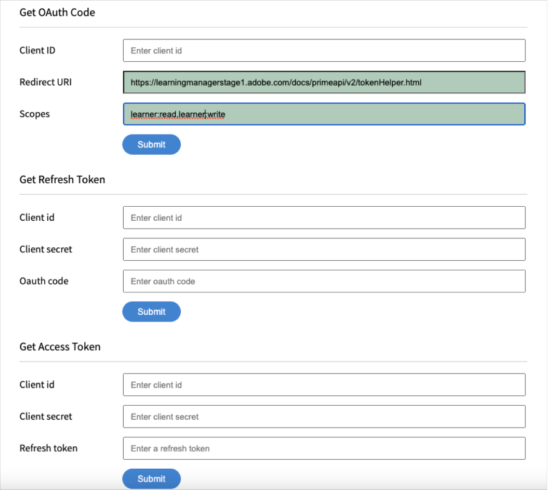
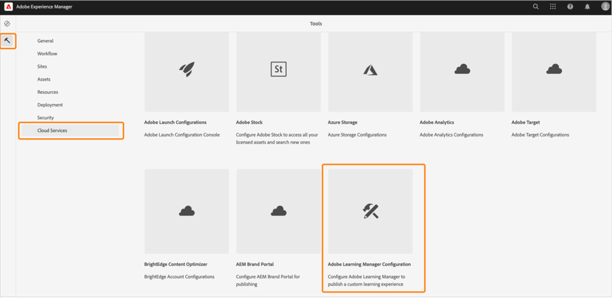
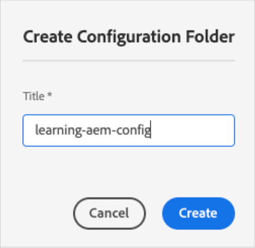
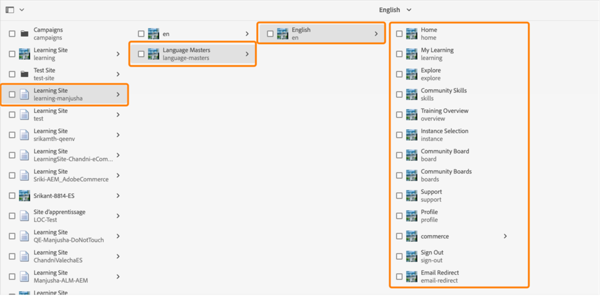

# 將 Adobe Learning Manager 與 AEM 整合

Adobe Learning Manager （ALM） 可與 Adobe Experience Manager （AEM） 網站整合。 這讓你能以最少的程式碼工作量，為 Adobe Learning Manager 建立自己的網站和響應式行動介面。 透過此整合，您可以為使用者打造客製化的學習體驗。

為了建立這樣的體驗，ALM 提供了 Adobe Learning Manager 參考網站套件（ALM 參考網站套件），以 ZIP 檔形式安裝於你的 AEM Sites 實例中。

該套件包含 AEM Sites 的網頁範本與網站元件，以及可嵌入的小工具。 例如學習目錄、行事曆、合規、分類、課程與路徑等等。

安裝 ALM 參考網站套件後，你可以開始為 Adobe Learning Manager 建立一個網站，並架設在你的 AEM Sites 實例上。 使用者接著可以在網站上拖放這些元件。

>[!IMPORTANT]
>
>AEM Sites 的 Adobe Learning Manager （ALM） 套件提供快速啟動程式碼區塊以供實作使用。 此套件專為無頭部署設計。 在實作所提供程式碼庫後，持續維護與後續開發將由實施方負責，這也是基於 Adobe Learning Manager 的無頭應用程式的標準做法。

## 安裝 ALM 參考網站套件

### 先決條件

* AEM 網站與 Adobe Commerce 的授權。
* AEM 本地部署 6.5 或 Adobe Experience Manager - 雲端服務
* Adobe Commerce 2.4.3

在您確保 AEM Sites 環境安全後，必須安裝 ALM 參考網站套件。 此套件包含 AEM 網頁與網站元件，協助建構學習平台。

參考網站套件託管在 [**GitHub 倉庫**](https://github.com/adobe/adobe-learning-manager-reference-site/releases)中。

欲了解更多資訊，請參閱說明文件。

## 下載內容包 {#downloadthecontentpackage}

安裝程式是以 AEM 內容套件形式出貨。 [***下載套件***](https://github.com/adobe/adobe-learning-manager-reference-site)。

內容包以壓縮檔形式提供，且相容於 AEM 6.4 與 AEM 6.5。

## 安裝學習管理器元件 {#installcaptivateprimecomponent}

使用 AEM 套件管理器安裝學習管理員內容套件：

>[!NOTE]
>
>關於安裝套件的資訊，請參閱  [***「如何操作套件***](https://experienceleague.adobe.com/docs/experience-manager-65/administering/contentmanagement/package-manager.html?lang=zh-Hant#how-to-work-with-packages)」。

1. 以 AEM 作者身份，開啟 AEM 套件管理器。
1. 點擊按鈕 **[!UICONTROL Upload Package]**。
1. 點擊 **[!UICONTROL Browse]** 並上傳內容包。
1. 點擊 **[!UICONTROL Upload]**。
1. 套件上傳後，選擇內容套件並點擊 **[!UICONTROL Install]**。

   

   *安裝內容包*

## 建立應用程式 [!DNL Adobe Learning Manager]

安裝 AEM 網站套件後，您必須設定一個 ALM 應用程式，將您的學習入口網站與 AEM 網站連接。

此情境適用於 AEM，且 [!DNL Adobe Learning Manager]。

請依照以下步驟操作：

1. 作為整合管理員，請點擊 **[!UICONTROL Applications]**。
1. 要建立新應用程式，請在頁面右上角點擊 **[!UICONTROL Register]**。
1. 在「註冊新申請」畫面，請輸入以下資料：

   1. **應用程式名稱：** 您所建立的應用程式名稱。
   1. **網址：** 您組織的網址。
   1. **重定向網域：** AEM 網站的主機網域。 你也可以指定萬用字。
   1. **說明：** 應用程式的描述。
   1. **範圍：** 選擇學習者角色讀取權限及學習者角色寫入權限。
   1. **僅限此帳戶？：** 若您想使用現有ALM帳戶的應用程式，請選擇「是」。

1. 完成變更後，點擊 **儲存**。

請注意螢幕上的應用程式憑證。


*申請憑證*

要批准申請，請點擊 **[!UICONTROL Approve]**。

## 去拿代幣

1. 在開發者資源標籤中，點擊 **[!UICONTROL Access Tokens for Testing and Development]**。

   

   *選擇存取權杖進行測試與開發*

1. 請輸入以下細節：

   
   *輸入代幣細節*

   1. **取得 OAuth 代碼：** 輸入前一節的客戶 ID，並更改範圍。 點擊提交以取得 Oauth 代碼。
   1. **取得刷新令牌：** 輸入前一節的客戶端 ID 和秘密。 另外，輸入你從前一步取得的 OAuth 代碼。 點擊 **提交**。
   1. **取得存取權杖：** 輸入前一部分的客戶 ID 和秘密資料。 另外輸入你從前一步獲得的刷新代幣。 點擊 **提交**。
   1. **取得存取權杖詳情：** 輸入你從前一步取得的存取權杖。 點擊 **提交**。

1. 你可以從接下來的 JSON 回應中獲得詳細資訊。 回應包含存取權杖、刷新權杖、使用者角色、帳號 ID、使用者 ID 以及到期時間。 請注意刷新標記，因為你會重複使用它。

## 在 AEM 中設定 ALM 帳戶

1. 啟動你的 AEM 實例。
1. 點選&#x200B;**雲端服務**>**設定**。
1. 點選 **Adobe Learning Manager 設定**。

   
   *選擇 Adobe Learning Manager 設定*

1. 點擊 **建立** > **設定資料夾**。 說出你的資料夾。

   
   *建立設定*

1. 在學習專案中，選擇你所建立的設定。

1. 請參考配置細節。

   
   *建立設定資料夾*

   1. **Adobe Learning Manager 模式：** 選擇你想要的學習體驗，無論是登入還是未登入的學習者。
   2. **Adobe Learning Manager 網址：** 輸入學習服務所託管的 ALM 實例的網址。
   3. **帳號ID：** ALM帳號的ID。
   4. **客戶端 ID、客戶端秘密與作者刷新令牌：** 輸入你在 ALM 建立應用程式時取得的憑證。
   5. **小工具自訂：**&#x200B;更多資訊請參見[與 AEM](/help/migrated/integrate-aem-learning-manager.md) 整合 `.`

1. 儲存並關閉設定。

### AEM + Adobe Learning Manager（登入/未登入用戶）

Adobe Learning Manager 現在讓你能向現有及潛在客戶及合作夥伴展示產品與培訓，無需強制建立帳號或登入。 此功能將協助你推動產品與培訓的採用，透過快速且簡便地預覽訓練內容，突顯並推廣產品特色。 因此，您可以有效地展示產品與服務，特別是向潛在客戶和合作夥伴展示，提升產品知名度。 易於取得且更易接觸，促進興趣提升，有助於推動培訓報名與學習採用。

透過此工作流程，學習者可在不登入 Adobe Learning Manager 的情況下預覽訓練、存取培訓資訊或搜尋培訓內容。 此工作流程不適用於原生 Learning Manager 介面（僅適用於 AEM 網站及其他無頭介面）。

**設定並啟用學習平台連接器**

本節強調配置及啟用以下連接器所需的步驟：

**訓練資料存取**

此連接器可讓你的 AEM Sites 基礎或其他客製化無頭使用者介面，能取得並呈現訓練資訊給學習者，並在學習者登入前或登入後實現無縫的培訓資訊搜尋。

此連接器僅在使用 AEM Sites 或其他無頭介面時才需要。

連接器將訓練中繼資料匯出至資料儲存與檢索解決方案，以及搜尋啟用系統。 因此，你可以設定基於 AEM Sites 或其他客製化的無頭使用者介面，利用這兩項服務來取得訓練資料、呈現網頁，並為學習者提供優化的訓練搜尋功能。 例如，一個未登入的 AEM Sites 介面，可以利用匯出的元資料協助學習者搜尋、瀏覽及存取顯示培訓資訊的培訓頁面。

啟用此連接器，建立並呈現基於 AEM Sites 的網頁，並為學習者在登入前後提供客製化體驗。 啟用此連接器，建立並呈現基於 AEM Sites 的網頁，並為學習者在登入前後提供客製化體驗。

* **Adobe Learning Manager cdn 基礎網址：** 從訓練資料存取連接頁面輸入資料擷取 CDN 服務路徑的基礎網址。
* **管理員刷新令牌：** 輸入你在前一部分決定的刷新令牌。
* **訓練中繼資料庫 URL：** 從訓練資料存取連接頁面輸入搜尋啟用與搜尋資料檢索服務路徑的基礎 URL。
* **Adobe Learning Manager 註冊網址：** 輸入由整合管理員為帳號產生的自助註冊 URL，該 URL 供學習者用來註冊培訓。

### AEM + Adobe Learning Manager + Adobe Commerce（登入/未登入用戶）

Adobe Learning Manager 現提供解決方案，幫助您無縫整合學習平台與 Adobe 商務。 此版本將讓您輕鬆將原生、AEM 網站或其他無頭學習管理介面與 Adobe Commerce 連接。 這種整合讓你能在學習平台上實現電子商務能力。 你現在可以向客戶和商業夥伴提供付費培訓，並輕鬆在原生與非原生學習管理器介面上啟用培訓購買。 學習者也可在不登入 Adobe Learning Manager 的情況下預覽訓練、存取培訓資訊或搜尋培訓內容。

使用者可以使用已存在的 AEM 應用程式並核准，而不必自行建立一個應用程式。

* **Adobe Learning Manager cdn 基礎網址：** 從 Adobe Commerce 連線頁面輸入資料擷取 CDN 服務路徑的基礎網址。
* **Adobe Commerce 網址：** 輸入你正在使用的 Adobe Commerce 實例的網址。
* **GraphQL 代理路徑：** 用戶端學習管理元件直接存取 Adobe Commerce GraphQL 端點，因此可能會發生 CORS 錯誤。 為避免此錯誤，所有通話必須由與 AEM 相同的端點提供，或透過加入 CORS 標頭的代理伺服器來提供。
* **Adobe Commerce 商店名稱：** 輸入您在前述區塊中確定的 Adobe Commerce 商店名稱。
* **Adobe Commerce 客戶代幣壽命（以秒計）：** 輸入客戶代幣壽命，表示預定的登入時間。
* **管理員刷新令牌：** 輸入你在前一部分決定的刷新令牌。

## 自訂網頁

利用 AEM 參考網站及可用的小工具自訂您的網頁。

1. 啟動你的 AEM 實例。
1. 點選 **「網站** 」並開啟設定頁面。
1. 點擊 **[!UICONTROL Learning Site]** > **[!UICONTROL Language Masters]** > **[!UICONTROL English]**。 專案中的所有網頁都包含在資料夾中。

   
   *查看所有網頁*

1. 選擇任何範本並點擊 **[!UICONTROL Edit]**。

1. 在頁面上，點擊元件設定按鈕並更改元件的屬性。

   
   *選擇設定按鈕*

1. 預覽您的更改，或您也可以發布該頁面。

## 建立網頁

除了參考網站套件提供的範本外，你也可以根據 AEM 範本建立網頁。

1. 在 AEM 主頁，點擊 **建立** > **頁面**。

2. 選擇你想自訂的範本。 點擊 **下一步**。

3. 進入頁面屬性。

   
   *頁面屬性*

4. 要建立頁面，請點擊 **[!UICONTROL Create]**。

5. 選擇新頁面並點擊 **[!UICONTROL Edit]**。

6. 在頁面中新增一個元件。 例如， **Adobe Learning Manager Widget**。

   
   *依網站篩選*

7. 將 Adobe Learning Manager 小工具&#x200B;**拖放**&#x200B;到你想要放置的頁面。
8. 選擇設定圖示。 **「屬性**」彈出視窗打開。
9. 從下拉選單選擇一個小工具，輸入標題和描述，然後選擇 **完成**。 選中的元件會被加入頁面。

## Adobe Learning Manager 小工具

Adobe Learning Manager Widget 在 2.0.0 版本及以上 **版本的學習-內容** 組件群組中提供。 單一元件可容納 ALM 首頁的所有元件，這些元件可從創作對話框的下拉選單中選擇。

隨著新增 **Adobe Learning Manager 小工具**&#x200B;的加入，您可以在 AEM 網站創建與原生 Adobe Learning Manager 頁面相當的體驗——首頁、目錄、學習物件總覽，以及使用類別、課程和路徑等小工具建立的自訂頁面。

**可用小工具：**

* **我的學習** — 目前已註冊的學習內容
* **排行榜** — 遊戲化積分排行榜
* **行事曆** — 即將進行及已完成的課程，按月份組織
* **合規** ——有逾期或即將截止日期的課程
* **社會學習** — 社會學習相關文章
* **分類** — 目錄、產品或職務卡片
* **課程與路徑** ——精選清單，來源驅動或精心挑選
* **書籤** — 學習者儲存的課程
* **管理員建議** — 由管理員設定的內容
* **興趣領域、趨勢與發現建議** ——由帳號層級推薦設定驅動

### 著作功能

* 目錄、產品、職務與課程皆可從對話框內的可搜尋下拉選單中選擇。
* 多重選擇欄位支援最多 25 個項目，並具備拖曳重排序及標籤顯示功能。
* 帳戶層級的術語（例如目錄或&#x200B;**角色**&#x200B;的自訂名稱&#x200B;**&#x200B;**）會自動反映在對話標籤中。

### 球場圖塊自訂

在 ALM 管理應用程式 **中，於「管理** > **品牌」** > **「課程圖塊** 」中所做的課程圖塊自訂，適用於所有為課程、學習路徑、認證及工作輔助工具繪製磚塊的小工具。 利用此設定控制哪些細節（格式、時長、技能、評分、作者姓名、描述、完成狀態等）會透過單一配置，在你的 AEM Sites 學習學院中傳遞給學習者。

如需自訂 Adobe Learning Manager 小工具，請參見 [與 AEM](/help/migrated/integrate-aem-learning-manager.md) 整合。


## 從 Blueprint 建立網站

ALM 參考網站套件提供「學習網站藍圖」，讓您能為學習平台建立網站。 AEM 藍圖允許您直接從 AEM Sites 元件建立網頁。 你不需要使用任何範本。

1. 在 AEM 開始頁面，點擊 **[!UICONTROL Sites]**。

1. 點擊 **[!UICONTROL Create]** > **[!UICONTROL Site]**。

1. 點擊 **學習網站藍圖**。

   

   *從藍圖建立網站*

1. 點擊 **下一步**。

1. 在屬性頁面輸入頁面的元資料。 點擊 **「建立**」。

   
   *選擇學習網站藍圖*

1. 點擊 **首頁** 超連結，導覽至您已建立網站的首頁。 在此頁面，您可以自訂小工具與目錄元件。

## 寫程式設計你的網站

除了使用內建範本並利用所見即所得（WYSIWYG）元件從零建立網站外，你也可以撰寫程式碼並建置網站。

程式碼在 [參考網站的 GitHub 倉庫](https://github.com/adobe/adobe-learning-manager-reference-site) 裡，方便你開始使用。

範本的主要部分包括：

* `core:` Java 套件包含所有核心功能，如 OSGi 服務、監聽器或排程器，以及與元件相關的 Java 程式碼，如 servlets 或請求過濾器。
* `ui.apps:` 包含專案中的 /apps（及 /等）部分，例如 JS&amp;CSS 客戶函式庫、元件、範本。
* `ui.content:` 包含使用 UI.Apps 元件的範例內容
* `ui.frontend:` 包含 React 元件。

### 使用程式碼自訂 Adobe Learning Manager 小工具

**Adobe Learning Manager Widget** 元件會直接使用 React 元件渲染到頁面 DOM。

**這對你的專案意味著什麼？**

* 小工具標記、樣式和 React 原始碼都是 AEM 套件的一部分，且你的專案可以存取
* 用你自己的 clientlib 覆蓋 CSS，但不動套件
* 關於行為變更、重新標籤按鈕、條件邏輯以及自訂元件輸出，請在 ui.frontend 模組中編輯 React 原始碼並重建

### 用於小工具的預先定義 CSS 類別

以下預定義的 CSS 類別可作為元件層級樣式的目標：

| 小工具名稱 | 容器 CSS |
|------------|---------------|
| 賽程表 | `alm-calendar-widget-container` |
| 類別 | `alm-category-widget-container` |
| 類別卡 | `alm-category-card-container` |
| 合規 | `alm-compliance-container` |
| 路線與路徑 | `alm-course-path-widget-container` |
| 路線與路徑 LO 卡 | `alm-training-card-v2-card` |
| 全部推薦 | `alm-course-path-widget-container` |
| 遊戲化 | `alm-leaderboard-container` |
| 社會學習 | `alm-social-learning-container` |

所有程式碼都在倉庫裡，幫助你啟動並運作。

## 匯入並新增學習管理工具元件至現有網頁或範本

安裝 AEM 參考網站套件會將學習管理員元件加入您的 AEM 網站實例。 預設情況下，您可以將這些元件加入我們開箱即用的網頁專案（網站）學習網站。 這些元件也可在你從學習網站藍圖建立的網站上取得。

不過，如果你想將這些新加入的 Learning Manager 元件用於現有的網頁專案或網站，應該依照以下步驟匯入。

1. 安裝 ALM 參考網站套件。

1. 打開網頁專案，然後進入 HTML 檔案（就是你想加入學習管理員元件的網頁或網頁範本）。
1. 打開 HTML 檔案，將以下程式碼片段加入頁面元件，讓程式碼在頁面渲染中的學習元件之前執行。

   *`<sly data-sly-use.configModel="com.adobe.learning.core.models.GlobalConfigurationModel"/>`*
   *`<meta name="cp-config" content="${configModel.config}" />`*

   前述程式碼在頁面的元標籤中加入映射配置，這是學習元件渲染所需的。 更多細節請參閱 [Adobe Learning Manager 參考網站](https://github.com/adobe/adobe-learning-manager-reference-site/blob/master/ui.apps/src/main/content/jcr_root/apps/learning/components/page/customheaderlibs.html)。

1. 確保你已經將設定映射到網頁專案。
1. 打開 **你想匯入學習管理員元件的 AEM Sites** 範本。
1. 在範本頁面編輯器中，導覽到 **允許元件** 容器並選擇 **政策**。
1. 在&#x200B;**政策頁面中，導覽至**「Properties **>** Allowed Components」**，並選擇以下元件「** Learning - Content」、「**&#x200B;** Learning - Form **」及「** Learning - Structure **&#x200B;**」。

以下程序使範本能滿足匯入學習管理器元件的客戶端函式庫相依性。

包含這些元件的網頁應該載入這些函式庫，才能成功渲染並使用元件。

1. 在範本頁面編輯器中，點選 **頁面資訊** ，然後點擊 **頁面政策**。
1. 在 **政策** 頁面，導覽至 **屬性** > **用戶端函式庫** ，並將這些資料加入你的範本頁面：

   1. learning.site
   1. 學習網站
   1. learning.commerce

儲存此範本後，您可以在所有由此範本衍生的網頁中加入學習管理員元件。

## 在 AEM 中設定小工具 {#configurethewidgetinaem}

對於元件設定，AEM 作者只需 Learning Manager 整合管理員提供的刷新權杖即可。

你也可以在多個頁面設定多個帳號設定。

1. 點擊 **[!UICONTROL Tools]** > **[!UICONTROL Cloud Services]** > **[!UICONTROL Learning Manager Widget Configuration]**。
1. 點擊 **[!UICONTROL Create]**。
1. 請在此輸入刷新代幣。 設定其他設定。
1. 歐盟區域的主機名稱應改為 **learningmanagereu** 。
1. 儲存並關閉設定。
1. 選擇一個配置並發布該設定。

## AEM 作者 {#aemauthor}

AEM 作者必須先將元件加入 AEM 範本中

AEM 作者就能拖放 Adobe Learning Manager 元件並相應配置。

學習管理元件要求上述步驟建立的設定必須映射到頁面&#x200B;**&#x200B;**。作者可以透過編輯頁面屬性>**[!UICONTROL Advanced]**&#x200B;**[!UICONTROL Cloud Configuration]**> **[!UICONTROL Configuration]** 來映射設定，並提供設定路徑。透過這種方式，作者可以為多個 Learning Manager 帳號建立設定，並將每個帳號對應到不同的網站頁面。 如果設定未映射到頁面，元件會從父頁面反覆讀取該設定，直到找到設定為止。

## 學習者 {#learner}

學習者可以在頁面內修讀課程。

要存取 Learning Manager 元件，Learner 必須是已登入的 AEM 使用者。 此外，學&#x200B;**員代表:User節點的「/profile」節點中應該有屬性電子郵件**。這個電子郵件應該和 Learning Manager 帳戶裡的郵件完全一樣。

學習者可以在頁面內修讀課程。

課程進度也會被保存。

提供以下小工具：

1. 遊戲化
1. 學習行事曆
1. 社群小工具
1. 目錄小工具
1. 我的學習
1. 基於同儕學習的推薦
1. 管理員建議
1. 根據學習者興趣的推薦

如果沒有推薦，該小工具會顯示為空白。

## 支援天際線

Skyline 是 AEM 的雲端版本。 你必須先從套件管理器安裝 Skyline。 要在 AEM 中使用 Skyline 元件，使用者必須在學習管理員帳號中存在。 換句話說，使用者的電子郵件地址必須存在於帳號中。

### 部署 Skyline

設定 Skyline 的步驟在 GitHub 倉庫[&#128279;](https://github.com/adobe/captivate-prime-aem-components)中有說明。

## 我的學習小工具

**[!UICONTROL My Learning]** 小工具允許你向使用者顯示特定或一組目錄的訓練內容。

在 **[!UICONTROL Properties]** 頁面屬性的區塊中，從列出的選項中選擇 **[!UICONTROL Catalog]** 。

<!---->

目錄選項包含以下選項：

* **[!UICONTROL Catalog ids]：** 需顯示訓練內容的逗號分隔目錄ID。
* **[!UICONTROL Sort]：** 訓練順序。 以下是排序選項：
   * 名稱：依字母順序從 A 到 Z 排序學習物件。
   * -名稱：將學習對象按字母順序從 Z 排序到 A。
   * 日期：依日期由高至低排序。
   * -日期：依日期由多到低排序（最新先行）。
   * dateCreated：依學習物件的建立日期排序（最早的）。
   * -dateCreated：依創建日期排序（最新先）。
   * 日期已註冊：依學習者註冊日期排序（最早者）。
   * -日期已註冊：依註冊日期排序（最近日期排第一）。
   * 評分：依學習者評分排序（由低到高）。
   * -評分：依評分排序（由高到低）。
   * dueDate：依課程截止日期排序（最早截止日期先）。
   * 效能：根據學習者回饋依效能分數排序。
   * 進度：依學習者進度排序（對大多數人而言，進步最少）。
* **[!UICONTROL Learner State]：** 回傳所有使用以下篩選條件的訓練——已註冊、已開始、完成及未註冊。 若排序選項為 dateEnrolled、dueDate 或 dateEnrolled，搜尋結果將不顯示。
* **[!UICONTROL Skill name]：** 用來篩選精確訓練的技能。
* **[!UICONTROL Tag name]：** 用來篩選精確結果的標籤。

以下是一些你可以自訂的額外組件：

**[!UICONTROL Learning Object Types]：** 根據學習物件的類型進行篩選。 支援的類型包括課程、認證、就業輔助及學習計畫。

在 AEM 中，條狀卡片的標題一開始會是空的。 在物業中輸入標題名稱，widgets.html。

**客製化**

你可以用widgets.html自訂版面的外觀和感覺。 你可以改變出現卡片的外觀並自訂主題。

在這個 **[!UICONTROL General Settings]** 區塊中，你可以選擇卡片的主色和副色，並指定屬性來自訂主題。

```
{ 
 "globalCssText":"@import url('https://fonts.googleapis.com/css2?family=Grandstander:ital,wght@0,100;0,200;0,300;0,400;0,500;0,600;0,700;0,800;0,900;1,100;1,200;1,300;1,400;1,500;1,600;1,700;1,800;1,900&family=Montserrat:ital,wght@0,100;0,200;0,300;0,400;0,500;0,600;0,700;0,800;0,900;1,100;1,200;1,300;1,400;1,500;1,600;1,700;1,800;1,900&display=swap');", 
 "fontNames":"Grandstander", 
 "cardLayout":{ 
 "cardLayoutName":"compact", 
 "cardPrimaryColor":"#376BA4", 
 "cardSecondaryColor":"#F98EB0", 
 "startedStateTextColor":"#ffffff", 
 "continueStateTextColor":"#ffffff", 
 "revisitStateTextColor":"#ffffff", 
 "startedStateColor":"#a0a0a0", 
 "continueStateColor":"#f9a122", 
 "revisitedStateColor":"#7fbc64", 
 "textPrimaryColor":"#ffffff", 
 "textSecondaryColor":"#d93f3f", 
 "navIconColor":"#a0a0a0" 
 } 
}
```

### 在 AEM 網站中設定已儲存課程的小工具

我的已儲存課程小工具讓學習者能直接在學習頁面查看已收藏或儲存的課程，方便你找到想要重溫或完成的課程。

要在 AEM Sites 中設定 **「我已儲存的課程」小工具** ：

1. 啟動 **AEM 網站**。
2. 以模式開啟頁面 **[!UICONTROL Edit]** 。
3. 前往並 **[!UICONTROL Components Browser]** 新增 **[!UICONTROL My Learning widget]** 到頁面。
4. 選擇元件，然後選擇 **[!UICONTROL Configure]**。
5. **[!UICONTROL My Saved Courses]**&#x200B;從 **[!UICONTROL Properties]**.
6. 選擇 **[!UICONTROL Done]** 並重新整理頁面，進入 **[!UICONTROL Preview]** 或 **[!UICONTROL Publish]** 模式。

學習者可以在學習者首頁的條帶中查看他們已儲存的課程 **[!UICONTROL Saved by Me]** 。 選擇條 **[!UICONTROL Saved by Me]** 帶後，學習者會進入目錄頁面，並顯示已收藏的課程數量。

當你在目錄&#x200B;**中套用另一個篩選器**&#x200B;時，只會顯示符合該篩選器的結果。書籤項目不會自動包含。

### 忽略高階LO的註冊

如果 **啟用「忽略高階 LO 註冊** 」勾選框，且使用者直接註冊於學習計畫或認證，該認證或學習計畫的課程將顯示在小工具中。

若該勾選框被停用，則學習計畫或認證中未直接註冊的課程將不會出現。


*選擇忽略高階貸款登記方框。

接著將設定套用到小工具上。

### 安全性

新增了 **Client ID** 和 **Client Secret** 欄位。 此外，刷新代幣也會被遮蔽。 使用者建立完整組態後，若再次開啟組建以編輯，或是其他使用者開啟此組，刷新令牌將會被遮蔽。
