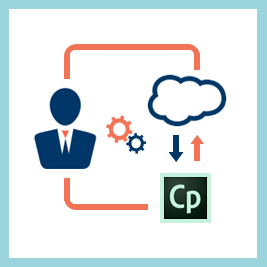

# 整合管理員

<table> 
 <tbody>
  <tr> 
   <td></td> 
   <td>
請閱讀下文，瞭解與整合管理員角色相關的Learning Manager功能。 
 
整合管理員是整合AdobeLearning Manager應用程式與任何第三方應用程式或您組織的應用程式（例如SalesForce或FTP）的管理員。 Learning Manager的整合管理員也可以根據Learning Manager API開發應用程式。 
</td> 
  </tr> 
 </tbody>
</table>

## 功能 {#features}

* [移轉手冊](integration-admin/feature-summary/migration-manual.md)

* [Learning Manager聯結器](integration-admin/feature-summary/connectors.md)
* [應用程式開發人員手冊](integration-admin/feature-summary/developer-manual.md)
* [Salesforce應用程式](integration-admin/feature-summary/sfdc-app.md)

