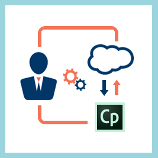

# 整合管理

<table> 
 <tbody>
  <tr> 
   <td></td> 
   <td>
繼續閱讀，了解與整合管理員角色相關的學習管理功能。 
 
整合管理員是指將 Adobe Learning Manager 應用程式與任何第三方應用程式或貴組織的應用程式（如 Salesforce 或 FTP）整合的管理員。 Learning Manager 的整合管理員也能基於 Learning Manager API 開發應用程式。 
</td> 
  </tr> 
 </tbody>
</table>

## 特色 {#features}

* [遷移手冊](integration-admin/feature-summary/migration-manual.md)

* [學習管理工具連結器](integration-admin/feature-summary/connectors.md)
* [應用程式開發手冊](integration-admin/feature-summary/developer-manual.md)
* [Salesforce 應用程式](integration-admin/feature-summary/sfdc-app.md)

