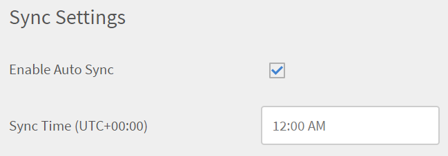

# 透過CSV檔案管理自訂角色

整合管理員可以透過CSV大量新增自訂角色至其帳戶，也可以將相同角色指派給各種使用者。 此方法可自動建立自訂角色。

您可以透過Learning Manager FTP和Box聯結器設定角色。

登入Box儲存體帳戶後，整合管理員即可在帳戶中新增下列csv：

* user.csv
* role.csv
* user_role.csv

若要開始使用，請下載csv並根據您的要求變更值。

* 範例檔案： [role.csv](assets/role.csv)
* 範例檔案： [user_role.csv](assets/user_role.csv)

**role.csv**

<table>
 <tbody>
  <tr>
   <td>
    <p><b>欄名稱</b></p></td>
   <td>
    <p><b>說明</b></p></td>
   <td>
    <p><b>範例值</b></p></td>
  </tr>
  <tr>
   <td>
    <p>名稱</p></td>
   <td>
    <p>在CSV中識別要指派給使用者的角色。</p></td>
   <td>
    <p>銷售作者</p></td>
  </tr>
  <tr>
   <td>
    <p>&lt;實體&gt;</p></td>
   <td>
    <p>識別每種實體型別（例如課程、目錄等）的存取型別（完整、寫入、註冊、報告、無）。</p></td>
   <td>
    <p>完整</p>
    <p>無</p>
    <p>寫入 | 報告</p>
    <p>欄名稱將對應至實體型別名稱，例如，目錄、課程、學習計畫等。</p>
    <p>CSV中將呈現每個實體型別的一欄。 實體若未獲得任何許可權，應包含在值為無中</p></td>
  </tr>
  <tr>
   <td>
    <p>目錄範圍規範</p></td>
   <td>
    <p>單一型錄名稱或決定此角色範圍的PIPE (|)分隔型錄名稱清單。</p></td>
   <td>
    <p>銷售目錄 | 一般目錄</p></td>
  </tr>
  <tr>
   <td>
    <p>使用者群組範圍規範</p></td>
   <td>
    <p>使用者群組屬性名稱及決定此角色之使用者範圍的值。</p>
    <p>請參閱下節以取得範圍。</p></td>
   <td>
    <p>location=倫敦</p></td>
  </tr>
  <tr>
   <td>
    <p>說明</p></td>
   <td>
    <p>選用的使用者易記說明，有助於瞭解角色的用途和後續參考。</p></td>
   <td>
    <p>銷售目錄中的記錄檔的完整作者存取權</p></td>
  </tr>
 </tbody>
</table>

除「說明」以外的所有欄都是強制性的。

## 定義使用者群組的範圍 {#definescopeofusergroups}

您可以透過下列方式，為各種型別的群組指定使用者群組的範圍：

* 使用者群組名稱依原樣（例如「所有作者」、「我的自訂群組」）
* 分葉屬性和值（例如，Department=HR）
* 自我註冊設定檔群組(self_registration=profilename)
* 外部註冊設定檔群組(ext_registration=profilename)
* 經理的直接下屬團隊(manager_direct=`<emailid>`)
* 管理員的完整組織(manager_org=`<emailid>`)

**user_role.csv**

<table>
 <tbody>
  <tr>
   <td>
    <p><b>欄名稱</b></p></td>
   <td>
    <p><b>說明</b></p></td>
   <td>
    <p><b>註解</b></p></td>
  </tr>
  <tr>
   <td>
    <p>Id</p></td>
   <td>
    <p>要指派可設定角色之使用者的電子郵件ID。</p></td>
   <td>
    <p>如果使用者已經指派了可設定的角色，該角色將替換為CSV中指定的新角色。 未回報任何錯誤。</p></td>
  </tr>
  <tr>
   <td>
    <p>自訂角色</p></td>
   <td>
    <p>要指派給使用者的可設定角色名稱</p></td>
   <td>
    <p>角色名稱必須是CSV中指定的現有角色。 您可以在此處使用管理員透過UI建立的角色。</p></td>
  </tr>
 </tbody>
</table>

**完整範圍功能**

每當為下列任何功能（帳戶層級功能）指派完整許可權時，使用者群組範圍和目錄範圍會自動被視為「完整」，因為使用者無法有限地存取這些功能。

如果CSV中有提供任何目錄名稱或使用者群組名稱，則會以「完整」許可權加以覆寫。

* 公告
* 技能
* gamification
* 使用者
* 學習方案
* 電子郵件範本

## 在帳戶中新增角色CSV {#addtherolecsvsintheaccount}

在您的Box帳戶中，選擇&#x200B;**匯入>使用者>內部**，然後上傳檔案 — role.csv和user_role.csv。

* role.csv和user_role.csv必須複製到資料夾&#x200B;**匯入** > **使用者** > **內部** > **使用者角色**。
* 必須將user.csv複製到資料夾&#x200B;**匯入** > **使用者** > **內部**&#x200B;中。

這兩個CSV都必須僅透過Box上傳，且無法透過UI上傳。

>[!NOTE]
>
>使用者CSV檔案為必要專案，但自訂角色CSV為選用專案。 所有存在的檔案都會被處理，而其他檔案則會被跳過。

管理員在UI中看不到使用csv檔案建立的自訂角色。 這些角色不會與UI所建立（或稍後再建立）的角色相關或受其影響。

已由CSV建立的自訂角色可透過CSV本身完全管理。 這包括新增、修改和刪除角色。

您可從user_role csv中移除指派專案，以撤銷指派的角色。 但透過管理員UI完成的指派不受此影響。

若要指派和撤銷自訂角色，請更新csv檔案。

## 同步化自訂角色 {#synchronizationofcustomroles}

在整合管理員上傳聯結器儲存體中的角色型CSV後，管理員可以啟用與CSV的同步。 每次在CSV中更新、新增或刪除自訂角色時，管理員都可以同步檔案中的資訊，並讓角色清單成為最新角色。

在管理員面板上的快速入門頁面上，按一下&#x200B;**[!UICONTROL Settings]** > **[!UICONTROL Data Sources]**。

在[同步設定]區段中，啟用選項&#x200B;**[!UICONTROL Enable Auto Sync]**。



*選取[啟用自動同步]選項*

選擇此選項時，您可以在同步時間欄位中指定的確切時間排定同步時間。 如果您將同步時間指定為中午12:00，則自訂角色會在每天的指定時間更新。

如果您要視需要同步處理資料，請按一下&#x200B;**[!UICONTROL Sync Now]**。

## 設定角色時的限制 {#constraintswhileconfiguringroles}

在任何帳戶中，角色的名稱必須是唯一的。 因此，透過UI或CSV建立的角色名稱，不得與透過UI或CSV建立的另一個角色相同。

在類似的一行，從管理員UI，無法指派可透過CSV建立的可設定角色給使用者，因為這些角色將不可用。

但是，使用者指派CSV可用於指派UI建立的角色。

## 對自訂角色的增量和多增量支援

管理員可以更有效率地為增量使用者指派自訂角色。 他們可以上傳使用者、角色和使用者角色資料，而不需要每次重新上傳整個資料集。

對於每個上傳的使用者匯入檔案，使用以下結構在FTP中建立個別的資料夾：

```
import/user/internal/
     user1.csv
     user2.csv
     user3.csv

UserRole/
    user1_role.csv
    user1_user_role.csv
    user2_role.csv
    user2_user_role.csv
    user3_role.csv
    user3_user_role.csv
```

**檔案詳細資料**

* 使用者匯入檔案： user1.csv
* 角色檔： user1_role.csv
* 使用者 — 角色對應檔案：user1_user_role.csv

在此處下載[範例CSV](/help/migrated/assets/sample-csv-Incremnetal.zip)。

每個使用者匯入檔案都直接連結到其對應的角色和使用者角色對應檔案，以確保適當的增量處理。
