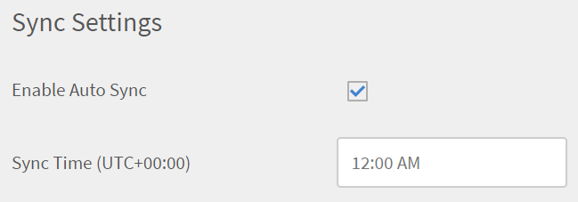

# 透過 CSV 檔案管理自訂角色

整合管理員可以透過 CSV 批量新增多個自訂角色到他的帳戶，並且可以將這些角色指派給不同使用者。 此方法自動化了自訂角色的建立過程。

你可以透過 Learning Manager 的 FTP 和 Box 連接器來設定角色。

登入 Box 儲存帳號後，整合管理員可以在帳號中新增以下 csv：

* user.csv
* role.csv
* user_role.csv

開始時，下載 CSV 檔，並根據需求調整數值。

* 範例檔案： [role.csv](assets/role.zip)
* 範例檔案： [user_role.csv](assets/user-role.zip)

**role.csv**

<table>
 <tbody>
  <tr>
   <td>
    <p><b>柱名</b></p></td>
   <td>
    <p><b>說明</b></p></td>
   <td>
    <p><b>範例數值</b></p></td>
  </tr>
  <tr>
   <td>
    <p>名稱</p></td>
   <td>
    <p>在 CSV 中指定角色以指派給使用者。</p></td>
   <td>
    <p>銷售作者</p></td>
  </tr>
  <tr>
   <td>
    <p>&lt;Entity&gt;</p></td>
   <td>
    <p>為每個實體類型（如課程、目錄等）識別存取類型（FULL、WRITE、ENROLL、REPORT、NONE）。</p></td>
   <td>
    <p>滿載</p>
    <p>沒有</p>
    <p>寫 |報告</p>
    <p>欄位名稱會對應實體類型名稱，如目錄、課程、學習計畫等。</p>
    <p>CSV 中每個實體類型都會有一欄。 對於不需要授權的實體，應以 NONE 的值納入</p></td>
  </tr>
  <tr>
   <td>
    <p>目錄範圍規範</p></td>
   <td>
    <p>單一目錄名稱或 PIPE （|） 分離的目錄名稱清單，決定此角色的範圍。</p></td>
   <td>
    <p>銷售目錄 |總目錄</p></td>
  </tr>
  <tr>
   <td>
    <p>使用者群組範圍規範器</p></td>
   <td>
    <p>使用者群組屬性名稱與值，決定該角色使用者的範圍。</p>
    <p>請參考下方章節的示波器。</p></td>
   <td>
    <p>地點=倫敦</p></td>
  </tr>
  <tr>
   <td>
    <p>說明</p></td>
   <td>
    <p>可選的使用者友善描述，幫助理解角色目的及後續參考。</p></td>
   <td>
    <p>作者可完整存取銷售目錄中的銷售目錄（LO）</p></td>
  </tr>
 </tbody>
</table>

除了說明欄外，所有欄位皆為必填。

## 定義使用者群組的範圍 {#definescopeofusergroups}

你可以用以下方式為各種類型的群組指定使用者群組的範圍：

* 使用者群組名稱如實（例如，所有作者、我的自訂群組）
* 葉子屬性與值（例如，部門=人力資源）
* 自助註冊個人檔案群組（self_registration=profilename）
* 外部註冊設定群組（ext_registration=設定檔名稱）
* 經理的直屬下屬團隊（manager_direct=`<emailid>`）
* 經理的完整組織 （manager_org=`<emailid>`）

**user_role.csv**

<table>
 <tbody>
  <tr>
   <td>
    <p><b>欄名</b></p></td>
   <td>
    <p><b>說明</b></p></td>
   <td>
    <p><b>留言</b></p></td>
  </tr>
  <tr>
   <td>
    <p>本我</p></td>
   <td>
    <p>要被指派可設定角色的使用者電子郵件 ID。</p></td>
   <td>
    <p>如果使用者已經被指派了可設定的角色，該角色會被 CSV 中指定的新角色取代。 未報告錯誤。</p></td>
  </tr>
  <tr>
   <td>
    <p>自訂角色</p></td>
   <td>
    <p>將指派給使用者的可配置角色名稱</p></td>
   <td>
    <p>角色名稱必須是 CSV 中指定的現有角色。 管理員透過使用者介面建立的角色可以在這裡使用。</p></td>
  </tr>
 </tbody>
</table>

**完整功能**

當對以下任何功能（帳號層級功能）獲得完全權限時，使用者群組範圍與目錄範圍會自動視為完整權限，因為使用者無法限制這些功能的存取權限。

若 CSV 中提供任何目錄名稱或使用者群組名稱，則需完全權限覆蓋。

* 公告
* 技能
* 遊戲化
* 使用者
* 學習計畫
* 電子郵件範本

## 在帳戶中新增角色 CSV {#addtherolecsvsintheaccount}

在你的 Box 帳號中，選擇 **匯入>使用者>內部檔案**，並上傳檔案——role.csv 和 user_role.csv。

* role.csv和user_role.csv必須複製到「匯入>使用者」資料夾&#x200B;**>**&#x200B;**內部**>**user_role**。**&#x200B;**
* user.csv必須複製到「匯入&#x200B;**>**&#x200B;使用者&#x200B;**>**&#x200B;內部&#x200B;**」資料夾**&#x200B;中。

這兩個 CSV 都必須只能透過 Box 上傳，且無法透過 UI 上傳。

>[!NOTE]
>
>使用者 CSV 檔案是必須的，但自訂角色 CSV 檔是可選的。 所有存在的檔案都會被處理，其他檔案則會被跳過。

使用 csv 檔案建立的自訂角色在 UI 中對管理員是看不到的。 這些角色不會與 UI 所建立（或未來將建立）的角色相關或影響。

由 CSV 建立的自訂角色可以完全由 CSV 本身管理。 這包括新增、修改和刪除角色。

可透過移除 CSV 中的指派條目來撤銷分配user_role角色。 但透過管理員介面完成的作業不會受到這個影響。

要指派和撤銷自訂角色，請更新 csv 檔案。

## 自訂角色同步 {#synchronizationofcustomroles}

整合管理員將基於角色的 CSV 上傳至 Connector 儲存後，管理員即可啟用與 CSV 的同步。 每當自訂角色在 CSV 中更新、新增或刪除時，管理員可以同步檔案中的資訊，使角色清單保持最新。

在管理員面板的「開始使用」頁面，點擊 **[!UICONTROL Settings]** > **[!UICONTROL Data Sources]**。

在同步設定區段，啟用 **[!UICONTROL Enable Auto Sync]**。



*選擇「啟用自動同步」這個選項*

選擇此選項後，你可以在同步時間欄位中指定同步時間。 如果你指定同步時間為凌晨 12：00，自訂角色每天都會在指定的時間更新。

如果你想按需同步資料，請點擊 **[!UICONTROL Sync Now]**。

## 角色配置時的限制 {#constraintswhileconfiguringroles}

在任何帳號中，角色名稱必須是唯一的。 因此，透過 UI 或 CSV 建立的角色名稱不得與已由 UI 或 CSV 建立的另一個角色名稱相同。

同理，從管理介面看，使用者無法被指派透過 CSV 建立的可設定角色，因為這些角色不會被使用。

不過，使用者指派 CSV 可以用來指派由 UI 建立的角色。

## 自訂角色的增量與多增量支援

管理員可以更有效率地為增量使用者指派自訂角色。 他們可以上傳使用者、角色及使用者-角色資料，而不必每次都重新上傳整個資料集。

對於每個上傳的使用者匯入檔案，請在 FTP 中使用以下結構建立獨立資料夾：

```
import/user/internal/
     user1.csv
     user2.csv
     user3.csv

UserRole/
    user1_role.csv
    user1_user_role.csv
    user2_role.csv
    user2_user_role.csv
    user3_role.csv
    user3_user_role.csv
```

**檔案細節**

* 使用者匯入檔案：user1.csv
* 角色檔案：user1_role.csv
* 使用者角色映射檔案：user1_user_role.csv

點此下載 [範例CSV](/help/migrated/assets/sample-csv-Incremnetal.zip) 。

每個使用者匯入檔案都直接連結其對應的角色及使用者角色映射檔案，確保增量處理的正確性。
