# Learning Manager聯結器

企業有其他應用程式和系統，必須與Learning Manager整合。 聯結器是公用程式，可協助您執行資料式整合，例如從外部系統將資料匯入Learning Manager。  它也會從Learning Manager將資料匯出至外部系統。

Learning Manager提供Salesforce和FTP聯結器。 使用Salesforce聯結器，組織的整合管理員可以將其Salesforce應用程式與Learning Manager整合。 身為整合商，您也可以使用FTP聯結器將一組使用者自動匯入您的企業應用程式。

Learning Manager也提供Lynda、getAbstract和Harvard Management System聯結器。 這些聯結器可讓學習者存取及使用Lynda.com、getAbstract和Harvard ManageMentor的課程。

請閱讀下文，瞭解如何在Learning Manager中設定和使用每個聯結器。

<!--
>[!NOTE]
>
>**Update:** December 2020 update of Learning Manager
>
>For **FTP**, **Box**, and **Custom FTP** connectors, while exporting Learner Transcript or xAPI, you can also export the data as a **zip** file, for:
>
>* Learner Transcripts
>* xAPI
-->

>[!NOTE]
>
>2022年11月發行的Adobe Learning Manager已棄用Zoom [2023年6月前進行JWT驗證](https://marketplace.zoom.us/docs/guides/auth/jwt/). 因此，在提及日期之前，具有JWT的Zoom聯結器將繼續運作，但我們建議使用者建立伺服器對伺服器OAuth應用程式，以取代其帳戶中的功能。 依預設，任何新連線都會進行Zoom OAuth驗證。

## Salesforce聯結器 {#sfconnector}

Salesforce聯結器會連線Learning Manager和Salesforce帳戶，以自動化資料同步。 Salesforce聯結器功能如下：

### 對應屬性

整合管理員可以選擇Salesforce欄，並將它們對應至對應的Learning Manager群組屬性。 完成對應後，後續的使用者匯入會使用相同的對應。 如果管理員想要為匯入使用者設定不同的對應，則可重新設定此對應。

### 自動匯入使用者

使用者匯入程式可讓Learning Manager管理員從Salesforce擷取員工詳細資訊，並自動將其匯入Learning Manager。 此自動化可避免建立CSV和上傳至Learning Manager的手動操作。

### 自動排程

使用自動排程功能以及自動使用者匯入功能可能很有效。 Learning Manager管理員可以根據組織需求設定排程。 Learning Manager應用程式中的使用者可以根據排程取得最新狀態。 同步可在Learning Manager應用程式中每天執行。

### 篩選使用者

Learning Manager管理員可在匯入使用者之前對其套用篩選。 例如，Learning Manager管理員可選擇匯入階層中一或多個特定管理員下的所有使用者。

### 設定Salesforce聯結器 {#configuresalesforceconnector}

若要將Salesforce與Learning Manager整合，請瞭解此程式

#### 先決條件 {#prerequisites}

確定您隨身帶著您的Salesforce組織URL。 例如，如果您的組織名稱為 **myorg**，則Salesforce URL可能是 `https://myorg.salesforce.com`. 這是連線Salesforce帳戶與Learning Manager的唯一必要輸入。

同時請確定您擁有適當的認證以登入帳戶。

#### 建立連線 {#createaconnection}

1. 在Learning Manager首頁中，將滑鼠游標停留在Salesforce卡片/縮圖上。 選單出現。 按一下 **[!UICONTROL Connect]** 功能表中的專案。

   

   *連線選項*

1. 會出現一個對話方塊，提示您輸入org-url。 按一下 **[!UICONTROL Connect]** 在提供URL之後。
1. 成功連線後，概觀頁面就會顯示。

### 對應屬性 {#mapattributes}

成功建立連線後，您可以將Salesforce欄對應至Learning Manager的對應屬性。 此步驟為必要步驟。

1. 在對映頁面中，左側可看到Learning Manager的欄，右側可看到Salesforce欄。 選取對應至Learning Manager欄名稱的適當欄名稱。

   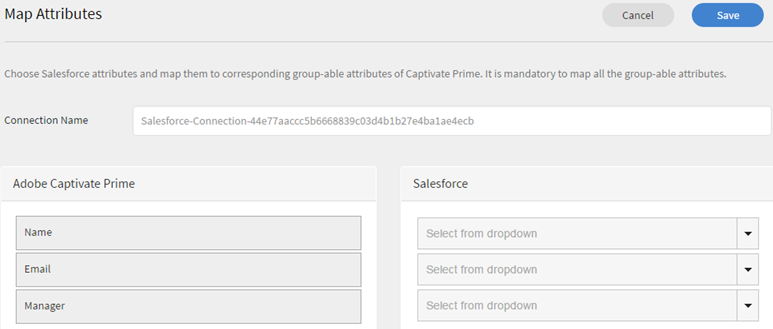
   *對應屬性*

   >[!NOTE]
   >
   >左側顯示的Learning Manager欄資料是從作用中欄位擷取。 此 **經理** 欄位必須對應到電子郵件地址型別的欄位。 必須先對應所有欄，才能使用聯結器。

1. 按一下 **[!UICONTROL Save]** 完成對應之後。
1. 聯結器現已準備就緒，可供使用。 已設定的帳戶，並在管理員應用程式中顯示為資料來源。 管理員可以排程匯入或進行隨選同步。

## 使用Salesforce聯結器 {#usingsalesforceconnector}

Salesforce聯結器會連線至Salesforce.com ，擷取設定中的使用者，並將其新增至Learning Manager。

### 從Salesforce聯絡人匯入使用者 {#import-salesforce-contacts}

Learning Manager增強了Salesforce聯結器，可擷取聯絡人和Salesforce使用者並自動將其匯入Learning Manager。

在Salesforce聯結器頁面上，輸入Salesforce url並完成驗證。 驗證之後，您可以繼續匯入使用者或連絡人。 如果您選擇「連絡人」選項，則指定要匯入的連絡人子集。

選擇Salesforce欄，並將它們對應至對應的Learning Manager群組屬性。 完成對應後，後續的使用者匯入會使用相同的對應。

1. 登入Salesforce。
1. 在連線頁面上，按一下 **[!UICONTROL Import Internal Users]**.

   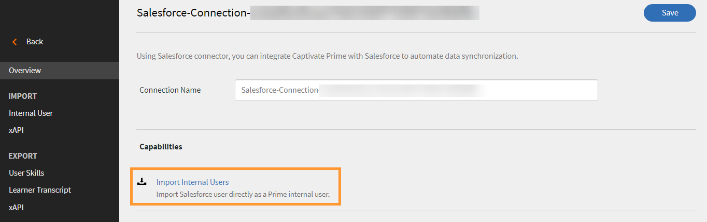
   *匯入內部使用者*

1. 在 **匯入使用者** 頁面，新增連絡人選項。 按一下選擇鈕 **連絡人** 而且您會看到下列選項。

   
   *對應連絡人屬性*

1. 如果您按一下 **[!UICONTROL Yes]**，您可以執行下列動作：

   * **選擇「連絡人」欄：** 選取您要匯入至Learning Manager的欄位。
   * **指定值：** 選擇代表所選欄位的值。

   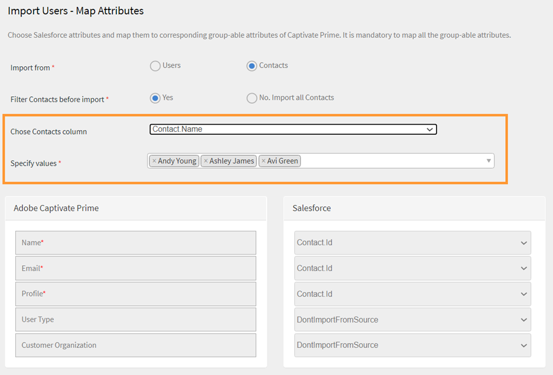
   *指定值*

   * 將Salesforce欄與Learning Manager的欄對應。
   * 若要開始匯入，請按一下 **[!UICONTROL Save]**.

1. 如果您按一下 **[!UICONTROL No. Import all Contacts]**，您可以直接對應欄位而不需篩選連絡人。 在此處，您將從Salesforce匯入所有連絡人。
1. 若要開始匯入，請按一下 **[!UICONTROL Save]**.

## 匯出學習記錄

Learning Manager可將學習記錄（如成績單、使用者報告、技能報告）匯出至Salesforce。 您可以決定匯出的資料是否應該連結至Salesforce中的「使用者」表格或「聯絡人」表格。

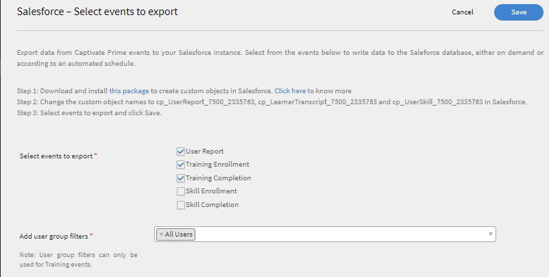
*匯出學習記錄*

### Salesforce中的自訂物件

從Learning Manager匯出學習記錄之前，您必須在Salesforce中建立自訂物件。 自訂物件是您建立的物件，用來儲存公司或產業的特定資訊。 如需詳細資訊，請參閱 [Salesforce自訂物件](https://trailhead.salesforce.com/en/content/learn/modules/data_modeling/objects_intro).

以下是建立物件的方式：

1. 下載並安裝套裝軟體以建立自訂物件。

   * [套件1](https://test.salesforce.com/packaging/installPackage.apexp?p0=04t1k0000008WPJ)
   * [套件2](https://test.salesforce.com/packaging/installPackage.apexp?p0=04t1k0000008WPT)
   * [套件3](https://test.salesforce.com/packaging/installPackage.apexp?p0=04t1k0000008WPi)

1. 重新命名Salesforce中自訂物件的名稱。
1. 選取事件並按一下 **[!UICONTROL Save]**.

**連結事件與：** 選擇要匯出的區段 — 使用者或連絡人。 如果您選擇連絡人物件，在Learning Manager中出現，但不在Salesforce中的使用者將在Salesforce中建立。

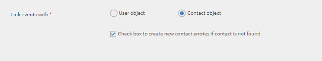
*連結事件選項*

>[!NOTE]
>
>您可以在一個帳戶中建立多個連線。 單一連線最多可在Salesforce中提供三個自訂物件。 如果要為同一Salesforce帳戶建立多個連線，您必須安裝三個套件。 我們提供最多三個套件的支援。
>
>您必須安裝儘可能多的套裝軟體，才能建立儘可能多的連線。

>[!NOTE]
>
>在Salesforce的「執行狀態」頁面上，只能從Salesforce檢查處理的記錄數。 即使已處理的所有記錄中有部分匯出或失敗，Learning Manager也會將狀態顯示為「已完成」。

## 安裝Salesforce套件

Learning Manager提供Salesforce應用程式套件。 在SFDC中安裝並設定後，銷售員工可以在SFDC入口網站中執行其培訓活動。 此應用程式可讓SFDC使用者直接在SFDC入口網站中探索新培訓、檢視建議並加以使用。 使用者也可以直接在SFDC入口網站的應用程式中，取得管理員以刊頭形式傳送的公告。

### 在Learning Manager應用程式中設定

1. 以整合管理員身分登入您的Learning Manager管理員帳戶。
1. 按一下 **[!UICONTROL Applications]** > **[!UICONTROL Featured Apps]**.
1. 按一下 **[!UICONTROL Salesforce]**.
1. 在Salesforce應用程式頁面上，記下說明中提及的應用程式ID （也稱為使用者端ID）和使用者端密碼。
1. 按一下 **[!UICONTROL Approve]** 而且您的應用程式必須成功核准。
1. 按一下 **[!UICONTROL Developer Resources]** > **[!UICONTROL Access Tokens for Testing and Development]**.
1. 在取得OAuth程式碼區段中，使用者端ID和範圍必須設定為 — admin：read，admin：write。 按一下 **[!UICONTROL Submit]**.
1. 在取得重新整理權杖中，輸入使用者端ID和使用者端密碼。 按一下 **[!UICONTROL Submit]** 並記下重新整理權杖。

### 在Salesforce應用程式中建立帳戶

1. 在Salesforce註冊頁面上建立帳戶。 您必須在開發人員版或企業版中建立Salesforce帳戶。  [開發人員註冊URL](https://developer.salesforce.com/signup). 請務必使用電子郵件ID註冊用於Learning Manager的Salesforce。
1. 透過驗證電子郵件驗證您的帳戶。
1. 建立密碼並登入Salesforce。
1. 記下登入後的Salesforce URL (例如site.lightning.force.com)

### 安裝Learning Manager套件

如果要安裝套件，必須先刪除Salesforce中的現有套件。 在解除安裝之前，您必須啟用設定，如下所示。 必須套用這些設定，否則您將無法安裝套件。

>[!NOTE]
>
>Adobe Learning Manager應用程式僅在Salesforce閃電檢視中受支援。

1. 啟動 [Learning Manager套件url](https://login.salesforce.com/packaging/installPackage.apexp?p0=04t1k0000008WOQ).
1. 在 **登入** 頁面，按一下 **[!UICONTROL Use Custom Domain]**.
1. 輸入封裝URL並按一下 **[!UICONTROL Continue]**. 安裝頁面必須選取僅供管理員安裝的選項。 請勿變更此選項。
1. 按一下 **[!UICONTROL Install]**. 安裝套件後，按一下 **[!UICONTROL Done]**. 系統會引導您前往已安裝套件頁面，您會看到AdobeLearning Manager已安裝套件。
1. 前往App Launcher （「設定」旁）搜尋AdobeLearning Manager。
1. 若要設定應用程式，請按一下 **[!UICONTROL Configure]**.
1. 按一下 **[!UICONTROL New]** 並新增下列詳細資料：

   * **設定：** 輸入您選擇的名稱。
   * **使用者端ID**：輸入您從第一個區段取得的值。
   * **使用者端密碼：** 輸入您從第一個區段中取得的值。
   * **RefreshToken：** 輸入您從第一個區段中取得的值。
   * **LearningManager基礎URL：** Learning Manager託管所在網站的URL。

### 新增遠端站台設定

1. 在頁面的右上角，按一下 **[!UICONTROL Setup]**.
1. 在 **[!UICONTROL Quick Find]**，搜尋遠端網站設定。
1. 按一下 **[!UICONTROL New Remote Site]**.
1. 輸入詳細資料：

   * **遠端站台名稱：** 輸入您選擇的名稱。
   * **遠端站台URL：** Learning Manager託管所在網站的URL。

1. 啟動Learning Manager。

### 啟用Learning Manager應用程式通知

1. 在右上角，按一下 **[!UICONTROL Setup]**.
1. 搜尋自訂通知。
1. 按一下 **[!UICONTROL New]**.
1. 輸入下列明細：

   1. **自訂通知名稱：** LearningManager通知
   1. **API名稱：** LearningManager通知

1. 選取兩者 **案頭** 和 **行動** 作為支援的管道。

1. 按一下 **[!UICONTROL Save]**.
1. 若要啟用行動裝置的推播通知，請遵循下列步驟：

   1. 在行動電話中安裝Salesforce行動應用程式。
   1. 使用您的憑證登入應用程式。
   1. 前往 **設定** > **通知傳送設定**.
   1. 新增適用於iOS和Android的Salesforce。

### 從Salesforce解除安裝Learning Manager

1. 在Salesforce應用程式中，前往已安裝的套件。
1. 按一下 **[!UICONTROL Uninstall]**.

## 為Salesforce使用者設定Learning Manager

Learning Manager應用程式也可供任何Salesforce帳戶中的使用者使用。 Salesforce管理員可以根據設定檔新增使用者。 Salesforce設定檔類似於Learning Manager中的設定檔。 例如，管理員、整合管理員、講師等。 Salesforce管理員也可以建立自訂設定檔。

身為Salesforce管理員，您可以將設定檔指派給使用者或建立自訂設定檔。

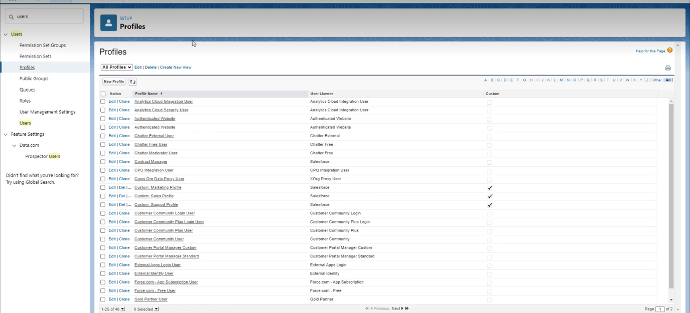

安裝套件時，您可以將Salesforce設定檔指派給學習者。

安裝套件後，您必須設定設定檔。

按一下 **[!UICONTROL Configure]** > **[!UICONTROL New]**，然後新增下列專案：

* 設定名稱
* 使用者端ID
* 使用者端密碼
* LearningManagerBaseURL
* 停用重新導向

>[!NOTE]
>
>若要讓學習者檢視Learning Manager應用程式，您必須為所有學習者啟用應用程式。

下一步是提供存取Learning Manager應用程式的許可權。

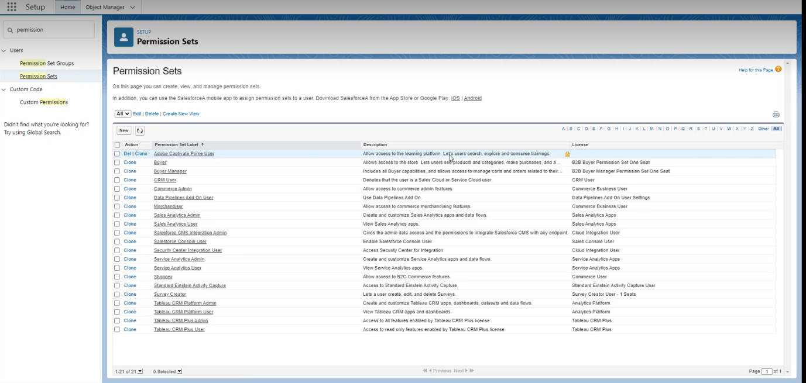

*設定存取Learning Manager應用程式的許可權*

選取使用者並據此指派許可權。 學習者現在可以存取Learning Manager應用程式。

現在，選取設定檔，例如，使用者的標準設定檔，然後按一下該設定檔。 按一下 **[!UICONTROL Edit]** 和 **自訂應用程式設定** 區段，啟用核取方塊 **AdobeLearning Manager**. 這可讓使用者存取應用程式。

在 **自訂標籤設定** 區段，在 **學習者首頁** 從下拉式清單中選取選項 **預設於**.

您必須讓所有設定檔都能看見應用程式。

按一下 **[!UICONTROL Save]** 而屬於所有設定檔的學習者將可存取Learning Manager應用程式。

### 學習路徑相關變更

#### 現有連線

如果「管理員」帳戶中的「學習路徑」選項已停用，報表中不會新增任何列和欄。

如果「管理員」帳戶中啟用了「學習路徑」選項，則學習者註冊時，「型別」欄會填入學習路徑。

>[!NOTE]
>
>如果旗標已啟用，而您使用現有的連線，則可能會遺漏一些記錄。

#### 新連線

如果「管理員」帳戶中的「學習路徑」選項已停用，訓練報表將由下列欄組成，但不會包含任何資料。

* **內嵌路徑：** 顯示學習計畫的名稱
* **內嵌路徑ID：** 顯示學習計畫的ID。
* **內嵌課程ID：** 顯示學習路徑內課程的ID。

此外，若為已啟用學習路徑的帳戶中的新連線，將顯示三個新欄，且所有資料都會流動。

此外，對於所有已註冊學習路徑的學習者，報表會包含「學習路徑（更高級別）」欄型別。

在「型別」欄中，學習方案將重新命名為「學習路徑」。 對於現有的連線，將不會有任何變更。

## Learning Manager FTP聯結器 {#ftpconnector}

使用FTP聯結器，您可以將Learning Manager與任意外部系統整合，以自動化資料同步。 外部系統應該可以匯出CSV格式的資料，並將其放在Learning Manager FTP帳戶的適當資料夾中。 FTP聯結器功能如下：

您也可以使用Box聯結器進行資料移轉、使用者匯入和資料匯出。 如需詳細資訊，請參閱方塊聯結器。

### 資料匯入 {#dataimport}

使用者匯入程式可讓Learning Manager管理員從Learning Manager FTP服務擷取員工詳細資訊，並自動將其匯入Learning Manager。 使用此功能，您可以將這些系統產生的CSV放在FTP帳戶的適當資料夾中，以整合多個系統。 Learning Manager會挑選CSV檔案、將其合併，並根據排程匯入資料。 如需詳細資訊，請參閱排程功能。

**對應屬性**

整合管理員可以選擇CSV欄，並將它們對應至Learning Manager的群組屬性。 此對應是一次性工作。 完成對應後，後續的使用者匯入會使用相同的對應。 如果管理員想要擁有不同的對應來匯入使用者，可以重新設定對應。

#### 匯出資料 {#exportdata}

「資料匯出」可讓使用者將使用者技能和學習者成績單匯出至FTP位置，以便與任何協力廠商系統整合。

#### 正在排程 {#scheduling}

管理員可以根據組織的需求設定排程任務，且Learning Manager應用程式中的使用者會根據排程瞭解最新狀態。 同樣地，整合管理員可以排程技能匯出，以及時與外部系統整合。 同步可在Learning Manager應用程式中每天執行。

### 設定Learning Manager FTP聯結器 {#configurecaptivateprimeftpconnector}

若要將FTP聯結器與Learning Manager整合，請瞭解此程式。

#### 建立連線 {#Createaconnection-1}

1. 在Learning Manager首頁中，將滑鼠游標停留在FTP卡片/縮圖上。 選單出現。 按一下 **[!UICONTROL Connect]** 功能表中的專案。

   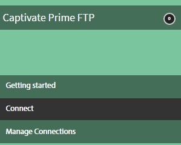

   *連線選項*

1. 系統會顯示一個對話方塊，提示您輸入電子郵件ID。 提供組織內負責管理Learning Manager FTP帳戶人員的電子郵件ID。 按一下 **[!UICONTROL Connect]** 在提供電子郵件id之後。
1. Learning Manager會傳送電子郵件給您，提示使用者在首次存取FTP前重設密碼。 使用者必須重設密碼，並使用它來存取Learning Manager FTP帳戶。

   >[!NOTE]
   >
   >只能為特定Learning Manager帳戶建立一個Learning Manager FTP帳戶。

   在總覽頁面中，您可以指定整合的連線名稱。 從下列選項中選擇您要採取的動作：

   * 匯入內部使用者
   * 匯入xAPI
   * 匯出使用者技能 — 設定排程
   * 匯出使用者技能 — 隨選
   * 匯出學習者成績單 — 設定排程
   * 匯出學習者成績單 — 隨選

   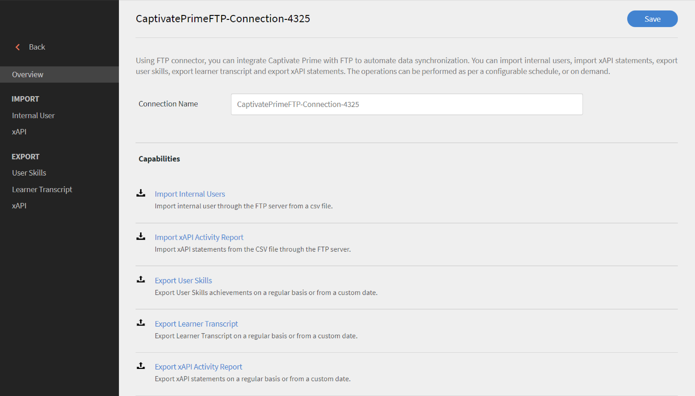
   *匯出選項*

### 匯入

+++內部使用者

「匯入內部使用者」選項可讓您根據需求或排程將使用者從csv匯入Learning Manager。

+++

+++對應屬性

成功建立連線後，您可以對應CSV檔案的欄。 它會放置在FTP資料夾中並對應至Learning Manager的屬性。 此步驟為必要步驟。

1. 在「對應屬性」頁面的左側，您可以看到Learning Manager的預期欄，而右側，您可以看到CSV欄名稱。 最初，您可以在右側看到一個空白的選取方塊。 按一下以匯入任何範本CSV **選擇檔案**.
1. 上述步驟會在右側的「選取」下拉式清單中填入所有CSV欄名稱。 選取對應至Learning Manager欄名稱的適當欄名稱。

   >[!NOTE]
   >
   >[管理員]欄位必須對應到電子郵件地址型別的欄位。 必須先對應所有欄，才能使用聯結器。

1. 按一下 **[!UICONTROL Save]** 完成對應之後。

   聯結器現已準備就緒，可供使用。 已設定的帳戶會在管理員應用程式中顯示為資料來源，供管理員排程匯入或進行隨選同步。

+++

+++使用Learning Manager FTP聯結器

1. 來自外部系統的CSV檔案必須放在以下路徑中：

   `code $OPERATION$/$OBJECT_TYPE$/$SUB_OBJECT_TYPE$/data.csv`

   >[!NOTE]
   >
   >在2016年7月版本中，僅允許匯入使用者。 因此，若要使用FTP聯結器，請確保CSV檔案放置在下列資料夾中：

   `code Home/import/user/internal/*.csv`

1. FTP聯結器會擷取CSV檔案中的所有列。 重要的是，對應至一個CSV中使用者的列不會出現在任何其他CSV中。
1. 所有CSV都必須包含對應中指定的欄。
1. 在程式開始之前，所有必需的CSV都必須存在於資料夾中。

>[!NOTE]
>
>將使用者匯入Learning Manager時，管理員也必須知道如何在Learning Manager中管理使用者。 請參閱 [使用者管理說明](migration-manual.md#usermanagement) 以瞭解更多資訊。

+++

+++匯入xAPI

匯入xAPI選項可讓您依需求排程從第三方服務將xAPI陳述式匯入Learning Manager。

+++

+++匯入xAPI所需的設定

1. 在設定頁面中，選取可在設定清單中取得的現有設定，以從CSV匯入xAPI陳述式。 按一下「編輯」或 **新增設定** 連結，可瀏覽至設定匯入來源頁面。

   **設定**

   * 在「設定匯入來源」頁面中，填寫兩個欄位，即「名稱」和「來源檔案名稱」。 來源檔案名稱應符合FTP資料夾位置中提供的檔案名稱。
   * 按一下 **[!UICONTROL Save]** 以儲存變更。

   
   *設定*

   **篩選**

   * 從左窗格，按一下 **[!UICONTROL Filter]**.
   * 在設定匯入 — 篩選頁面中，填寫名稱和條件欄位以篩選出記錄。 按一下 **[!UICONTROL Add new Filter]** 以新增另一個篩選器。 您可以按一下「 」，儲存或刪除篩選器 **儲存** 或 **刪除** 選項。

   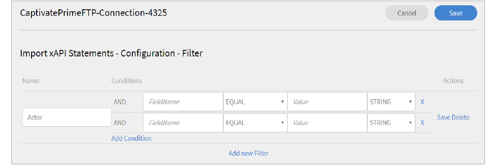
   *篩選*

   **對應**

   * 從左窗格，按一下 **[!UICONTROL Mapping]**.
   * 在「匯入xAPI陳述式 — 設定 — 對應」頁面的左側，您可以看到需要以CSV欄名稱對應的xAPI JSON欄位路徑名稱。
   * 依預設，需要以CSV欄名稱對應的三個JSON路徑欄位名稱是 **actor.mbox**， **verb.id**、和 **object.id**. 您可以按一下「 」，新增其他欄位以對應 **新增對應**.

   * 選取您要與Json欄位路徑名稱對應的欄名稱型別（不論是字串、數字、布林值或日期型別）。
   * 完成對應後，按一下「儲存」 。 現在可以依排程或依需求匯入xAPI匯入。

   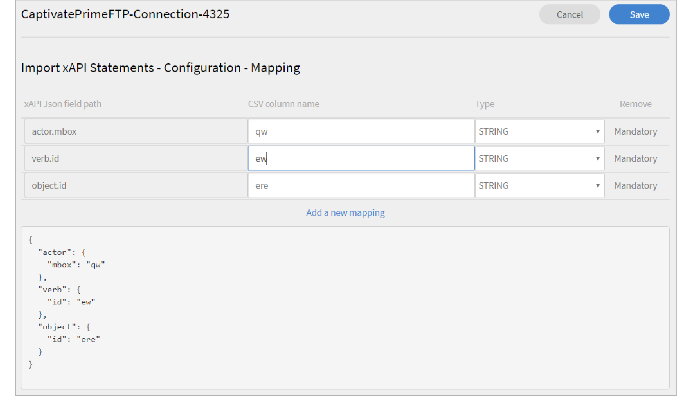
   *對應*

1. 從左窗格，按一下 **[!UICONTROL Configure Schedule]**. 按一下 **[!UICONTROL Enable Schedule]** 排程匯入xAPI陳述式。

   您可以輸入開始時間和日期，然後輸入xAPI匯入排程的頻率（以天為單位）。 例如，每3天啟用xAPI匯入一次。

   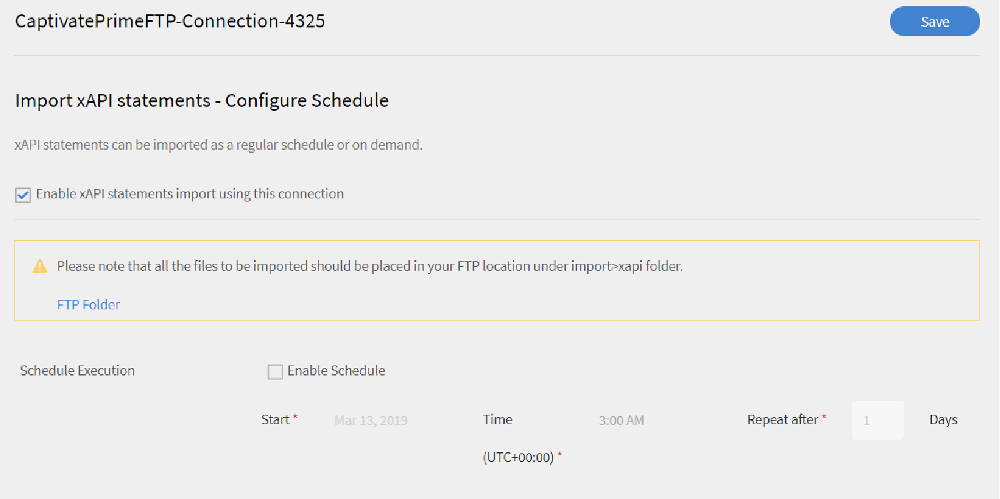
   *匯入xAPI陳述式 — 設定排程*

1. 從左窗格，按一下 **[!UICONTROL On Demand Execution]**.

   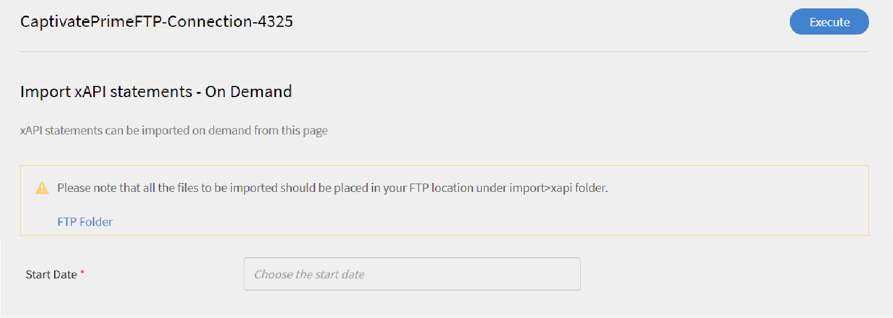
   *匯入xAPI陳述式 — 隨選*

1. 從左窗格，按一下 **[!UICONTROL Execution Status]** 以時間順序檢視此聯結器的所有執行摘要。 您可以檢視匯入xAPI的開始日期和所需時間、匯入型別（無論是隨選匯入還是已排程）以及匯入狀態（無論是xAPI匯入正在進行中、已完成還是失敗）。

   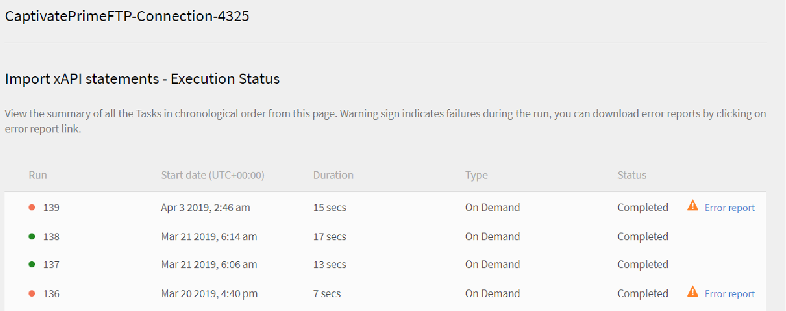
   *匯入xAPI陳述式 — 執行狀態*

+++

### 匯出

+++Skills

匯出使用者技能報告有兩個選項。

**[!UICONTROL User Skills - On Demand]**：您可以指定開始日期，並使用選項匯出報表。 報表會從輸入的日期擷取，直到現在為止。

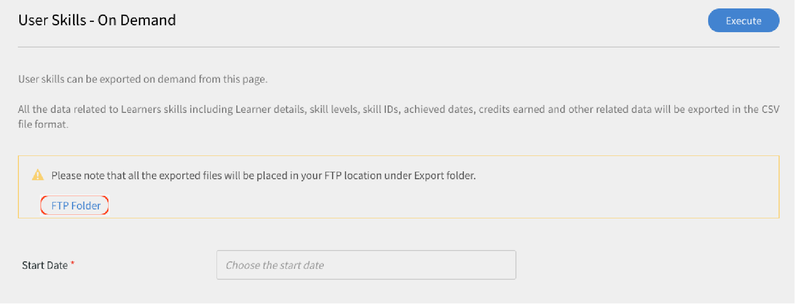
*隨選匯出選項*

**[!UICONTROL User Skills - Configure]**：此選項可讓您排程報表的擷取。 選取「啟用排程」核取方塊，並指定開始日期和時間。 您也可以指定產生和傳送報告的間隔。

*設定報告的匯出*

+++

若要開啟存放匯出檔案的「匯出」資料夾，請開啟「使用者技能」頁面中提供的「FTP資料夾」連結，如下所示。

*FTP資料夾以檢視檔案*

自動匯出的檔案會出現在位置中 **首頁/匯出/&#42;FTP位置&#42;**

自動匯出的檔案的標題為 **skill_achieves_&#42;起始日期&#x200B;&#42;_至_&#42;結束日期&#42;.csv**

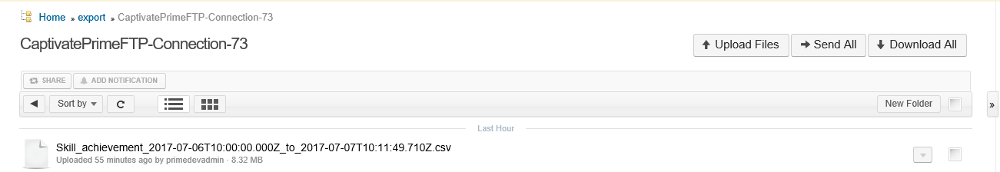
*已匯出的.csv檔案*

+++學習者成績單

**設定**：此選項可讓您排程報表的擷取。 選取「啟用排程」核取方塊，並指定開始日期和時間。 您也可以指定產生和傳送報告的間隔。

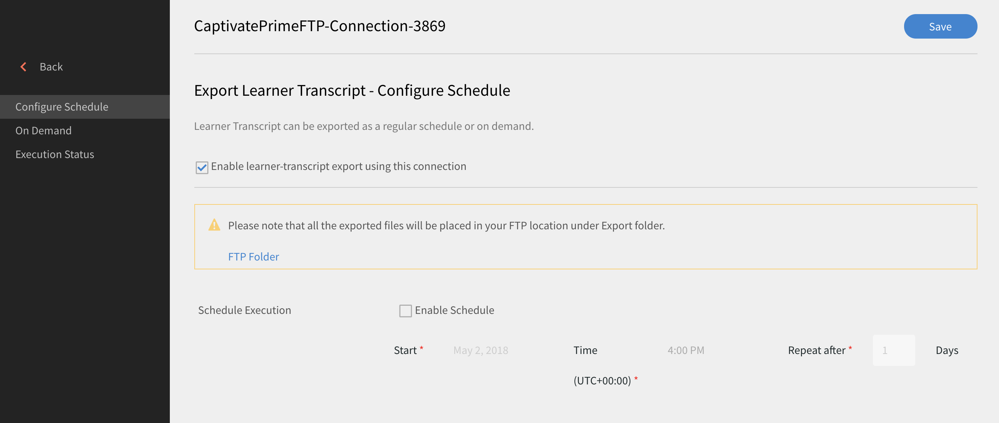

+++

若要開啟匯出檔案放置在FTP位置中的匯出資料夾，請開啟「學習者成績單」頁面上提供的FTP資料夾連結，如下所示

自動匯出的檔案會出現在位置中 **首頁/匯出/&#42;FTP位置&#42;**

自動匯出的檔案的標題為 **學習者成績單_&#42;起始日期&#x200B;&#42;_至_&#42;結束日期&#42;.csv**

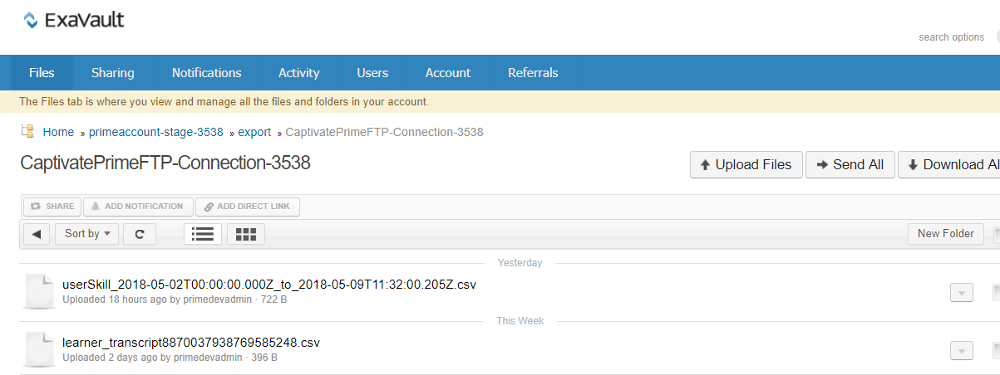

### 支援手動csv欄位 {#supportformanualcsvfields}

透過FTP匯入使用者資料時，管理員必須將系統中出現的所有作用中欄位對應到csv中的對應欄位。

這是所有csv作用中欄位的必填。 對於手動作用中欄位，整合管理員可以選取選項 **不要從來源匯入**.

選取此選項後，手動作用中欄位值不會使用csv匯入填入。 學習者提供的值會維持不變。

>[!NOTE]
>
>對應時，如果選項 **不要從來源匯入** 已針對csv作用中欄位選取，則將從系統中刪除此欄位。

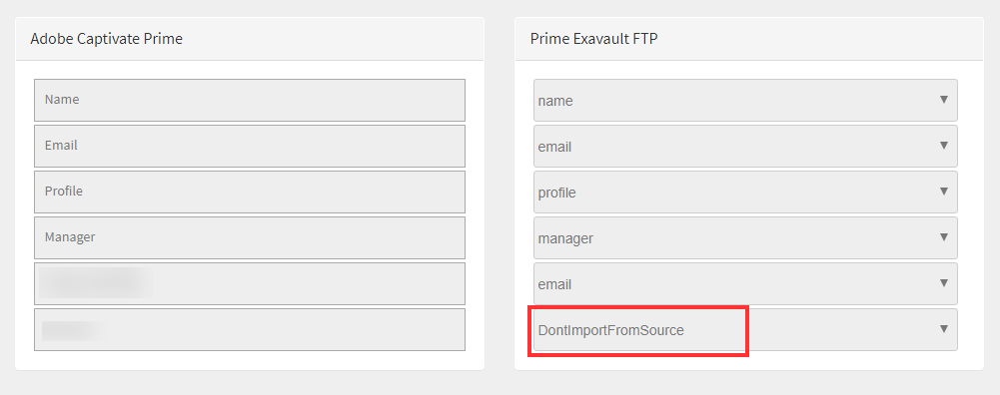
*作用中欄位的FTP聯結器*

## Lynda聯結器 {#lyndaconnector}

Lynda.com的企業客戶會使用Lynda聯結器，他們想要讓學習者從Learning Manager中探索及使用Lynda課程。 聯結器可設定為定期使用您的API金鑰從Lynda.com擷取課程。 在Learning Manager中建立課程後，使用者可以搜尋課程並加以使用。 然後可以在Learning Manager中追蹤學習者進度。

### 設定Lynda聯結器 {#configurethelyndaconnector}

1. 在整合式管理員控制面板中，按一下Lynda 。

   您會看到內含三個選項的圖磚：快速入門、連線及管理連線。

1. 如果您是第一次設定Lynda聯結器，請按一下「連線」。

   <!--Configure the Exavault FTP account before you configure this connector.-->

1. 從連線頁面，指定聯結器的名稱。 輸入連線的Appkey和Secret金鑰。

   >[!NOTE]
   >
   >請聯絡您的廠商以取得Appkey和秘密金鑰。

1. 按一下「儲存」。

   已儲存設定並新增您帳戶的Lynda連線。 您現在可以從首頁按一下管理連線，並隨時編輯您的設定。

1. 如果已建立連線，請按一下[管理連線]檢視所有連線。

   >[!NOTE]
   >
   >在您設定此聯結器之前，必須為您的帳戶啟用移轉功能。

1. 按一下您要編輯的連線。
1. 從左窗格，按一下 **[!UICONTROL Configure]**. 執行下列任一項作業：

   * 從此視窗檢視或編輯您帳戶的詳細資訊以及同步處理排程。 若要啟用此帳戶，請選取[啟用連線]核取方塊。
   * 按一下編輯並編輯您的認證。 若要復原此欄位的更新，請按一下[重設]
   * 按一下啟用排程來排程您的同步化。 您可以輸入開始時間與日期，然後輸入同步化排程的頻率（以天為單位）。 例如，每三天啟用同步處理一次。

   按一下 **[!UICONTROL Save]** 以儲存變更。

   

   *設定Learning Manager的Lynda聯結器*

1. 從左窗格中，按一下「隨選執行」。 此選項可讓您從Lynda匯入使用者摘要和其他相關資料。 輸入隨選執行的「開始日期」，然後按一下「執行」以執行同步化。 從開始日期到出現的所有資料都會匯入。

   * 在執行期間，如果應用程式在同步期間發生停機時間，您可以按一下「停用對Learning Manager的存取」 。
   * 如果您在執行期間按一下「啟用對Learning Manager的存取權」，同步期間服務不會中斷。

   

   *對Lynda聯結器執行隨選執行*

1. 您也可以隨時從左側窗格按一下「執行狀態」，以時間順序檢視此聯結器的所有執行摘要。 您可以檢視同步化的開始日期和持續時間、同步化的型別（無論是隨選同步化）以及同步化的狀態（無論是正在進行中還是已完成）。

   >[!NOTE]
   >
   >當您刪除並重新建立連線時，會再次出現聯結器的先前執行。 您可以在刪除連線之前檢視所有執行。

   您只能對最新的同步處理執行重新執行。

   

   *檢視所有執行的摘要，按一下執行狀態*

## getAbstract聯結器 {#getabstractconnector}

getAbstract.com的企業客戶會使用getAbstract聯結器，他們想要讓學習者探索及使用getAbstract摘要。 聯結器可設定為定期擷取使用資料，根據在Learning Manager中建立的學習者完成記錄而定。 請閱讀下文，瞭解如何在Learning Manager中設定此聯結器。

### 設定getAbstract聯結器 {#configurethegetabstractconnector}

1. 在整合式管理員控制面板中，按一下getAbstract。

   從圖磚中，您會看到三個選項：「快速入門」、「連線」和「管理連線」。

1. 如果您是第一次設定getAbstract聯結器，請按一下「連線」。

   <!--Configure the Exavault FTP account before you configure this connector.

   Ensure that you share this FTP credentials with your content provider to access the feeds.-->

1. 在連線名稱欄位中輸入連線的名稱。

   在使用者端識別碼和使用者端密碼欄位中輸入適當的金鑰。 請連絡您的廠商以取得此聯結器的適當金鑰。

   取得使用者端所使用課程的課程中繼資料需要金鑰。

1. 如果已建立連線，請從首頁按一下「getAbstract >管理連線」，以檢視並編輯現有的組態。

   >[!NOTE]
   >
   >在您設定此聯結器之前，必須為您的帳戶啟用移轉功能。

1. 按一下您要檢視或編輯其設定的連線。

   

   *設定Learning Manager的getAbstract聯結器*

1. 從左窗格中，按一下「設定」。 執行下列任一項作業：

   * 從此視窗檢視或編輯您帳戶的詳細資訊以及同步處理排程。 若要啟用此帳戶，請選取[啟用連線]核取方塊。
   * 按一下編輯並編輯您的認證。 若要復原此欄位的更新，請按一下[重設]
   * 按一下啟用排程來排程您的同步化。 您可以輸入開始時間與日期，然後輸入同步化排程的頻率（以天為單位）。 例如，每三天啟用同步處理一次。

1. 按一下 **[!UICONTROL Save]**.

   會儲存設定並新增您帳戶的getAbstract連線。

1. 從左窗格中，按一下「隨選執行」。 此選項可讓您從getAbstract匯入使用者摘要和其他相關的資料。 輸入隨選執行的「開始日期」，然後按一下「執行」以執行同步化。 從開始日期到出現的所有資料都會匯入。

   * 在執行期間，如果應用程式在同步期間發生停機時間，您可以按一下「停用對Learning Manager的存取」 。
   * 如果您在執行期間按一下「啟用對Learning Manager的存取權」，同步期間服務不會中斷。

1. 您也可以隨時從左側窗格按一下「執行狀態」，以時間順序檢視此聯結器的所有執行摘要。 您可以檢視同步化的開始日期和持續時間、同步化的型別（無論是隨選同步化）以及同步化的狀態（無論是正在進行中還是已完成）。

   >[!NOTE]
   >
   >當您刪除並重新建立連線時，會再次出現聯結器的先前執行。 您可以在刪除連線之前檢視所有執行。

   您只能對最新的同步處理執行重新執行。

   若要讓任何型別的同步作業運作，請確定使用者摘要出現在同步作業指定日期的getAbstract FTP資料夾中。

   請參閱下列excel工作表，此工作表是來自getAbstract的使用者摘要檔案範例。 檔案名稱必須遵循以下格式： **report_export_yyyy_MM_dd_HHmmss.xlsx** 或 **report_export_yyyy_MM_dd.xlsx**.
   [getAbstract使用者摘要範例excel工作表](assets/report-export-20170401175342.xlsx)

## Harvard ManageMentor聯結器 {#hmmconnector}

Harvard ManageMentor聯結器是由Harvard ManageMentor的企業客戶所使用，他們想要讓學習者探索及使用Harvard ManageMentor課程。 聯結器可協助在Learning Manager中建立課程，並設定為定期擷取學習者進度資料。 若要配置此聯結器，請執行下列步驟：

### 設定Harvard ManagerMentor聯結器 {#configuretheharvardmanagermentorconnector}

1. 在「整合式管理員」控制面板中，按一下「Harvard管理導師」。

   從圖磚中，您會看到三個選項：「快速入門」、「連線」和「管理連線」。

1. 如果您是第一次設定Harvard ManageMentor聯結器，請按一下「連線」。

   <!--Configure the Exavault FTP account before you configure this connector.

   Ensure that you share this FTP credentials with your content provider to access the feeds.-->

1. 在「連線名稱」欄位中輸入連線的名稱。 按一下[連線]以儲存此連線。
1. 如果已建立連線，請從首頁按一下「Harvard管理導師」>「管理連線」。 按一下您要編輯現有設定的連線。

   >[!NOTE]
   >
   >在您設定此聯結器之前，必須為您的帳戶啟用移轉功能。

   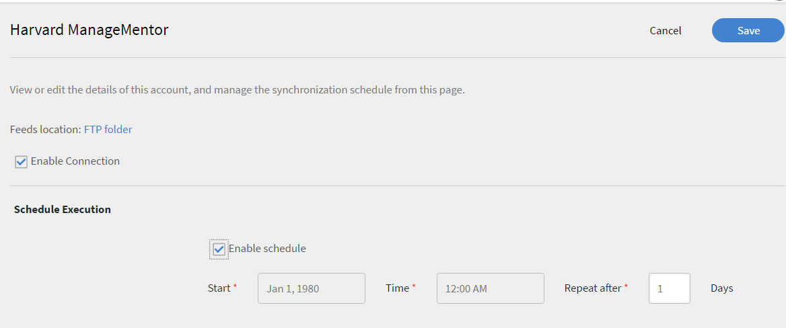

   *設定Learning Manager的HarvardManage Mentor聯結器*

1. 從左窗格中，按一下「設定」。 執行下列任一項作業：

   * 從此視窗檢視或編輯您帳戶的詳細資訊以及同步處理排程。 若要啟用此帳戶，請選取[啟用連線]核取方塊。
   * 按一下啟用排程來排程您的同步化。 您可以輸入開始時間與日期，然後輸入同步化排程的頻率（以天為單位）。 例如，每三天啟用同步處理一次。

1. 從左窗格中，按一下「隨選執行」。 此選項可讓您從Harvard ManageMentor匯入使用者摘要及其他相關資料。 輸入隨選執行的「開始日期」，然後按一下「執行」以執行同步化。 會為此連線匯入從開始日期起直到出現的所有資料。

   * 在執行期間，如果應用程式在同步期間發生停機時間，您可以按一下「停用對Learning Manager的存取」 。
   * 如果您在執行期間按一下「啟用對Learning Manager的存取權」，同步期間服務不會中斷。

   如果您要每隔幾天自動執行同步處理，請在「重複天數」欄位中指定天數。 同步可確保您的帳戶更新為Harvard ManageMentor摘要的最新版本。

1. 您也可以隨時從左側窗格按一下「執行狀態」，以時間順序檢視此聯結器的所有執行摘要。 您可以檢視同步化的開始日期和持續時間、同步化的型別（無論是隨選同步化）以及同步化的狀態（無論是正在進行中還是已完成）。

   >[!NOTE]
   >
   >當您刪除並重新建立連線時，會再次出現聯結器的先前執行。 您可以在刪除連線之前檢視所有執行。

   您只能對最新的同步處理執行重新執行。

   若要同步成功，請確定Harvard ManageMentor FTP資料夾中至少有下列其中一個檔案：

   hmm12_metadata.xlsx：此檔案提供Harvard ManageMentor聯結器的課程中繼資料。 上傳檔案時，請務必遵循命名慣例。

   client_hmm12_20150125.xlsx：這是Harvard ManageMentor聯結器的使用者摘要。 以下的檔案命名慣例是 **client_hmm12_yyyyMMdd.xlsx。**

   請參閱此聯結器的以下兩個使用者資訊源範例和課程資訊源檔案：

   * [Harvard ManageMentor聯結器的課程中繼資料檔案](assets/hmm12-metadata.xlsx)
   * [Harvard ManageMentor聯結器的使用者摘要](assets/client-hmm12-20170304.xlsx)

## Workday聯結器 {#workdayconnector}

使用Workday聯結器，您可以整合Learning Manager與Workday租使用者，以自動化資料同步。

### 匯入

#### 對應屬性

整合管理員可以選擇Workday欄，並將它們對應至對應的Learning Manager群組屬性。 完成對應後，後續的使用者匯入會使用相同的對應。 如果管理員想要為匯入使用者設定不同的對應，則可重新設定此對應。

#### 自動匯入使用者

使用者匯入程式可讓Learning Manager管理員從Workday擷取員工詳細資訊，並自動將其匯入Learning Manager。

#### 篩選使用者

Learning Manager管理員可在匯入使用者之前對其套用篩選。 例如，Learning Manager管理員可選擇匯入階層中一或多個特定管理員下的所有使用者。

### 匯出

使用者技能匯出可讓使用者自動將使用者技能匯出至Workday。

>[!NOTE]
>
>不能使用同一Workday帳戶同時匯出來自多個Learning Manager帳戶的技能。

#### 要註記的點

* 確認在多個Workday整合中，UUID、電子郵件地址和員工名稱都是唯一的。 不正確的值將導致連線失敗。
* UUID欄位一經在透過Workday填入，便無法由任何面對LMS管理員的使用者端刪除。 如果您想要變更值，請聯絡Learning Manager上線或支援團隊的Adobe。
* 由於「使用者清除」只支援每個執行清除50個使用者，因此「使用者清除」選項也可能無法運作。 透過UUID上傳使用者時，請格外小心。

### 正在排程 {#Scheduling-1}

管理員可以根據組織的需求設定排程任務，且Learning Manager應用程式中的使用者會根據排程瞭解最新狀態。 同樣地，整合管理員可以排程技能匯出，以及時與外部系統整合。 同步可在Learning Manager應用程式中每天執行。

### 設定Workday聯結器 {#configureworkdayconnector}

>[!PREREQUISITES]
>
>請貴組織的Workday管理員建立具有ISU_Permissions檔案中定義之許可權的整合系統使用者(ISU)。 從下列連結下載副本。

[下載整合系統使用者(ISU)安全性的復本。](assets/isu-permissions-v1.pdf) 若要將Workday聯結器與Learning Manager整合，請瞭解此程式。

1. 在Learning Manager首頁中，將滑鼠游標停留在Workday圖磚上。 選單出現。 按一下 **[!UICONTROL Connect]** 功能表中的專案。

   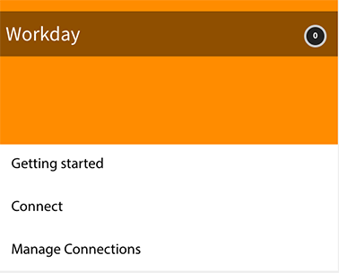

   *Workday動態磚*

1. 會出現一個對話方塊，提示您輸入新連線的證明資料。 建立連線之前，請輸入下列欄位。

   * 連線名稱：根據您的偏好設定提供連線名稱。
   * 主機URL：整合管理員可以從對應的Workday管理員取得主機URL詳細資訊。
   * 租使用者：租使用者是您公司的內部使用者。 您的Workday管理員會提供租使用者詳細資訊。
   * 使用者名稱和密碼： Workday管理員會建立具有所需安全性許可權的整合系統使用者(ISU)，並將其與整合管理員共用。

>[!NOTE]
>
>   Learning Manager使用Workday API 40.1版。

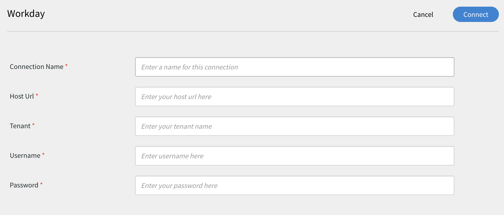
*設定Workday聯結器*

1. 在所有相關欄位中輸入資訊後，按一下連線。

   >[!NOTE]
   >
   >您也可以將多個Workday連線同步至您的Learning Manager帳戶。

在總覽頁面中，您可以指定整合的連線名稱。 從下列選項中選擇您要採取的動作：

* 匯入內部使用者
* 匯出使用者技能 — 設定排程
* 匯出使用者技能 — 隨選

*Workday概觀*

### 匯入

#### 對應屬性 {#MapAttributes-1}

您可以使用Workday聯結器整合Learning Manager和Workday，以自動化資料同步。 您可以將所有作用中的使用者從Workday匯入至Learning Manager。 使用者可從各種資料來源匯入，包括FTP和Salesforce。

在匯入使用者之前，必須先對應Learning Manager和Workday的使用者屬性。 在「概觀」頁面中，使用「匯入」下的「內部使用者」選項來提供對映屬性。

在「Learning Manager」欄下輸入Adobe的「Learning Manager」認證。Adobe 使用下拉式清單，為Workday下的欄選取正確的認證。

>[!NOTE]
>
>目前，Learning Manager支援從Workday匯入69個使用者屬性。 使用Learning Manager中的作用中欄位來新增更多屬性。

*對應屬性*

選取 **排除臨時職工** 核取方塊，以防止匯入管理員下可用的臨時背景工作。

Workday有四個階層，而Learning Manager有兩個階層。 Workday中的四個層級是技能設定檔類別、技能設定檔、技能專案類別和技能專案。 您的技能名稱和Learning Manager的層級會一起在Workday的技能專案底下對應。

>[!NOTE]
>
>您可以新增其他Workday屬性。 請聯絡您的CSAM以新增屬性。

+++支援的Workday屬性清單

wd：User_ID wd：Worker_ID管理員wd：Personal_Data.wd：Name_Data.wd：Preferred_Name_Data.wd：Name_Detail_Data。@wd：Formatted_Name wd：Personal_Data.wd：Name_Data.wd：Legal_Name_Data.wd：Name_Detail_Data。@wd：Formatted_Name wd：Personal_Data.wd：Name_Data.wd：Legal_Name_Data.wd：Name_Detail_Data.wd：Prefix_Data.wd：Title_Descriptor wd：Personal_Data.wd：Name_Data.wd：Prefix_Data.wd：Title_Descriptor wd：Personal_Data.wd：Name_Data.wd：Preferrequed_Name_Data name_Detail_Data.wd：First_Name wd：Personal_Data.wd：Name_Data.wd：Preferred_Name_Data.wd：Name_Detail_Data.wd：Last_Name wd：Personal_Data.wd：Name_Data.wd：Name_Detail_Data.wd：First_Name wd：Personal_Data.wd：Name_Detail_Data.wd ：Last_Name wd：Personal_Data.wd：Contact_Data.wd：Address_Data.0。@wd：Formatted_Address wd：Personal_Data.wd：Contact_Data.wd：Address_Data.0.wd：Postal_Code wd：Personal_Data.wd：Contact_Data.wd：Email_Address_Data.0.wd：Email_Address wd：Contact_Data.wd：Country_Region_Descriptor wd：Personal_Data.wd：Personal_Data.wd：Wd：Phone_Data.wd：Phone_Data.Phone_Data.Data.0.@wd：Formatted_Phone wd：Personal_Data.wd：Contact_Data.wd：Phone_Data.0.wd：Country_ISO_Code wd：Personal_Data.wd：Contact_Data.wd：International_Phone_Code wd：Personal_Data.wd：Contact_Data.wd：Phone_Data.0.wd：Phone_Number wd：Personal_Data_Reference.wd：ID.ID.1。$ wd：Personal_Data.wd：Gender_Reference.wd：ID.1.$ wd：Personal_Data.wd：Identification_Data.wd：National_ID.0.wd：National_ID_Data.wd：ID wd：Personal_Data.wd：Identification_Data.wd：Custom_ID.0.wd：Custom_ID_Data.wd：ID wd：User_Account_Data.wd：Default_Display_Language_Reference.wd：WD.WD.WD.ID.1。$ wd：Role_Data.wd：Organization_Role_Data.wd：Organization_Role.0.wd：Organization_Role_Reference.wd：ID.1.$ wd：Employment_Data.wd：Worker_Job_Data.0.wd：Position_Data.wd：Position_Title wd：Employment_Data.wd：Worker_Job_Data.0.wd：Business_Title wd：Employment_Data.wd：Worker_Job_Data.0.wd：Position_Data.wd：Name wd：Employment_Data.wd：Worker_Job_Data.0.wd Position_Data.wd：Business_Site_Summary_Data.wd：Address_Data。@wd：Formatted_Address wd：Employment_Data.wd：Worker_Job_Data.0.wd：Position_Data.wd：Job_Classification_Summary_Data.0.wd：Job_Classification_Reference.wd：ID.1.$ wd：Employment_Data.wd：Worker_Job_Data.0.wd：Position_Data.wd：Job_Classification_Summary_Data.0.wd：Job_Group_Reference.wd：ID.1.$ wd：Employment_Data.wd：Worker_Job_Data.0.wd：Position_Data.wd：Work_Space__Reference.wd：ID.1.$ wd：Employment_Data.wd：Worker_Job_Data.0.wd：Position_Data.wd：Job_Profile_Summary_Data.wd：Job_Family_Reference.0.wd：ID.1.$ wd：Employment_Data.wd：Worker_Job_Data.0.wd：Position_Data.wd：Job_Profile_Summary_Data.wd：Job_Profile_Name wd：Employment_Data.wd：Worker_Job_Data.0.wd：Position_Data.wd：Job_Profile_Summary_Data.wd：Job_Profile_Reference.wd：ID.1.$ wd：Employment_Data.wd：Worker_Job_Data.0.wd：Position_Data.wd：Business_Site_Summary_Data.wd：Address_Data.0.wd：Country_Reference.wd：ID.2.$ wd：Employment_Data.wd：Worker_Job_Data.0.wd：Position_Data.wd：Worker_Type_Reference.wd：ID.1.$ wd：Employment_Data.wd：Worker_Job_Data.0.wd：Position_Data.wd：Business_Site_Summary_Data.wd：Address_Data.0.@wd：Formatted_Address wd：Employment_Data.wd：Worker_Job_Data.0.wd：Position_Data.wd：Job_Profile_Summary_Data.wd：Management_Level_Reference.wd：ID.1。$ wd：Employment_Data.wd：Worker_Status_Data.wd：Active wd：Employment_Data.wd：Active_Status_Date wd：Employment_Data.wd：Worker_Status_Data.wd：Hire_Date wd：Employment_Data.wd：Worker_Status_Data.wd：Original_Hire_Date wd：Employment_Data.wd：Data.wd：Retirealled_Data.wd：Retiretireated wd：Employment_Data_Data_Data.wd：Data.wd worker_Status_Data.wd：Retirement_Date wd：Employment_Data.wd：Worker_Status_Data.wd：Terminated wd：Employment_Data.wd：Worker_Status_Data.wd：Employment_Data.wd：Worker_Status_Data.wd：Termination_Last_Day_of_Work wd：Organization_Data.wd：Organization_Code wd：Organization_Data.wd Worker_Organization_Data.0.wd：Organization_Data.wd：Organization_Name wd：Organization_Data.wd：Worker_Organization_Data.0.wd：Organization_Data.wd：Organization_Type_Reference.wd：ID.1。$ wd：Organization_Data.wd：Worker_Organization_Data.0.wd：Organization_Data.wd：Organization_Subtype_Reference.wd：ID.1.$ wd：Qualification_Data.wd：Education.0.wd：School_Name wd：Qualification_Data.wd：External_Job_History.0.wd：Job_History_Data.wd：Job_Title wd：Qualification_Data.wd：External_Job_History.0.wd：Company wd：Management_Chain_Data.wd：Worker_Supervisory_Management_Chain_Data.wd.wd：Manager Employee_ID主要工作電子郵件wd：Organization_Type_Reference_Cost_Center_ID wd：Organization_Type_Reference_Cost_Center_Name wd：Organization_Type_Reference_Company wd：Organization_Subtype_Reference_Department wd：Organization_Subtype_Reference_Division wd：Universal_ID_Field_Override_Data.3.wd：Value wd：Worker_Job_Data_Data.Data.wd.Wd.Worker_Job.Data wd：Business_Site_Summary_Data.wd：Address_Data.0.wd：Country_Region_Descriptor wd：Employment_Data.wd：Worker_Job_Data.0.wd：Position_Data.wd：Business_Site_Summary_Data.wd：Address_Data.0.wd：Country_Region_Reference.wd：ID.2。$ wd：Personal_Data.wd：Contact_Data.wd：Address_Data.0.wd：Unicialty

+++

### 匯出

您可以將使用者從Learning Manager取得的所有技能匯出至Workday。 系統只會匯出所有作用中的使用者技能，而Learning Manager不會匯出已淘汰的技能。 您也可以連線多個Learning Manager\
帳戶至相同的Workday聯結器。 如果兩個Learning Manager帳戶中的技能名稱相同，則會在Workday中將它們對應至相同的技能。 在Workday中更新技能之前，如果兩個Learning Manager帳戶使用相同的Workday帳戶，建議您更新所有Learning Manager帳戶中的技能名稱。

+++使用者技能 — 設定

此選項可讓您排程報表的擷取。 確定已啟用使用此連線啟用使用者技能匯出核取方塊。 選取「啟用排程」核取方塊，並指定開始日期和時間。 您也可以指定產生和傳送報告的間隔。 選取「啟用排程」核取方塊，並輸入「開始日期」、「時間」和「n」天后重複。 完成後，按一下「儲存」。

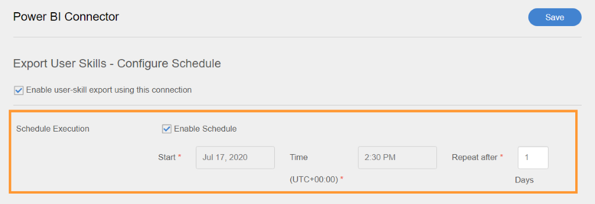
*設定使用者技能報表*

+++

+++使用者技能 — 隨選

您可以指定開始日期，並使用選項匯出報表。 報表會從輸入的日期擷取，直到現在為止。 輸入您要開始產生報表的日期，然後按一下執行。

*隨選使用者技能報表*

+++

+++使用者技能 — 執行狀態

在這裡，您可以檢視所有任務的摘要並取得其狀態報告。 您可以按一下錯誤報告連結來下載錯誤報告。

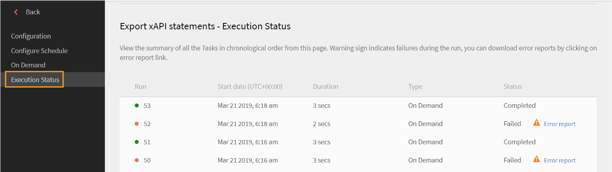
*使用者技能執行報表*

+++

## miniOrange聯結器 {#miniorangeconnector}

使用miniOrange聯結器，您可以整合Learning Manager與miniOrange租使用者，以自動化資料同步。

### 匯入

#### 對應屬性

整合管理員可以選擇miniOrange屬性，並將它們對應至對應的Learning Manager群組屬性。 完成對應後，後續的使用者匯入會使用相同的對應。 如果管理員想要為匯入使用者設定不同的對應，則可重新設定此對應。

#### 自動匯入使用者

使用者匯入程式可讓Learning Manager管理員從miniOrange擷取員工詳細資訊，並自動將其匯入Learning Manager。

#### 篩選使用者

Learning Manager管理員可在匯入使用者之前對其套用篩選。 例如，Learning Manager管理員可選擇匯入階層中一或多個特定管理員下的所有使用者。

若要設定miniOrange聯結器，請聯絡Learning Manager CSM團隊。

### 設定miniOrange聯結器 {#configureminiorangeconnector}

1. 在Learning Manager首頁中，將滑鼠游標停留在miniOrange卡/縮圖上。 選單出現。 按一下  **[!UICONTROL Connect]** 選單中的選項。

   

   *miniOrange聯結器圖磚*

1. 按一下 **[!UICONTROL Connect]** 以建立新連線。 出現miniOrange聯結器頁面。 輸入您要對應的帳戶詳細資料。

   

   *建立連線*

1. 如果您想要直接將miniOrange使用者匯入為Learning Manager內部使用者，請使用 **[!UICONTROL Import Internal Users]** 選項。

   

   *匯入內部使用者*

1. 在對映頁面中，左側可看到Learning Manager的欄，右側可看到miniOrnage欄。 選取對應至Learning Manager欄名稱的適當欄名稱。

   

   *對應屬性*

1. 若要檢視及編輯資料來源，請以管理員身分按一下 **[!UICONTROL Settings > Data Source]**.

   將列出已建立的miniOrange來源。 如果您需要編輯篩選器，請按一下 **[!UICONTROL Edit]**.

   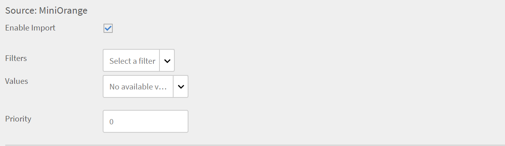

   *檢視和編輯資料來源*

1. 匯入完成後，您會收到通知。 若要檢視或編輯匯入記錄，請按一下 **[!UICONTROL Users > Import log.]**

#### 刪除連線 {#deleteaconnection}

若要刪除已建立的miniOrange連線，請按照下列步驟操作。

<!---## Video conferencing connectors (Bluejeans Meetings and Zoom) {#bluejeansconnector}

You can now integrate Learning Manager with BlueJeans and Zoom connectors and use them to host classes.  The connector enables you to set up video conferencing meetings/classes with the learners.

To set up and use the connector, follow these steps.

1. In Learning Manager  home page , hover the mouse over the BlueJeans/Zoom thumbnail. A menu appears. Click  **[!UICONTROL Connect]** option from the menu.

   

   *Zoom connector tile*

1. The BlueJeans/ Zoom connector page opens. Enter the details of your account into respective fields to integrate and synchronize the user feed. You can get the details from the administrator of your connector account.

   
   *Connect to BlueJeans/ Zoom*

   >[!NOTE]
   >
   >As a learner, while enabling the connector, use the same email id used for your Learning Manager account to enable user feeds back into Learning Manager.

1. Once the connection is established, as an Author, create a VC course with BlueJeans/ Zoom as the conferencing system.

   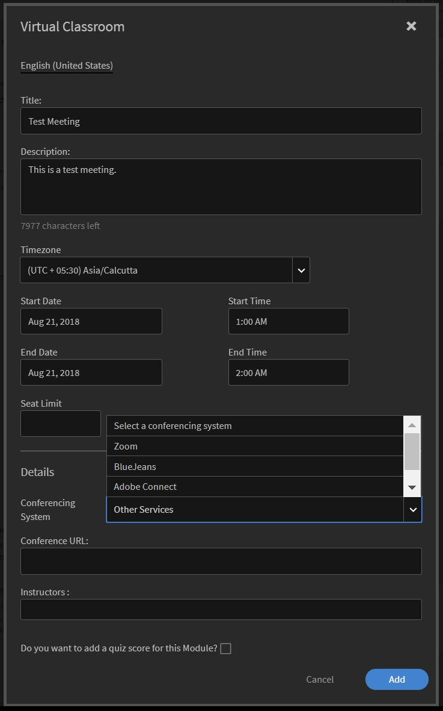
   
   *Create a VC course*

1. Administrators, managers, and learners can enroll learners  to  the created course. Upon enrollment, the learner receives an email. The learner can sign in to their Learning Manager account to view the program details and take the course.
1. When the course is complete, the completion report is sent to Learning Manager. The administrator can see the completion report to check the attendance and score of the learners.

   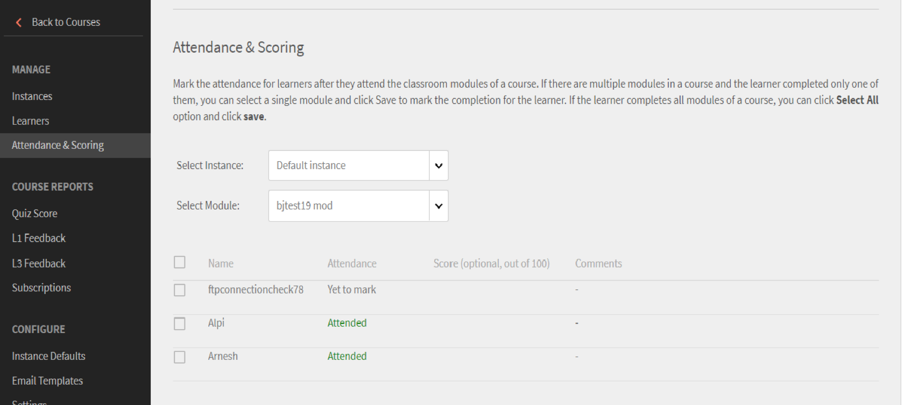
   *Attendance and scoring report*

### Create a zoom server-to-server OAuth app

When you create a Zoom Server-to-Server OAuth app to be used in Adobe Learning Manager, you must add scopes required by Adobe Learning Manager while creating the connection.

Adobe Learning Manager requires the scopes below and the scopes must be selected in the OAuth app.

* View all user meetings `/meeting:read:admin`
* View and manage all user meetings `/meeting:write:admin`
* View report data `/report:read:admin`
* View all user information `/user:read:admin`
* View users' information and manage users `/user:write:admin`-->

## 方塊聯結器 {#boxconnector}

使用Box聯結器，您可以將Learning Manager與任意外部系統整合，以自動化資料同步。 外部系統應該可以匯出CSV格式的資料，並將其放在Learning Manager Box帳戶的適當資料夾中。 方塊聯結器功能如下：

您也可以使用FTP聯結器進行資料移轉、使用者匯入和資料匯出。 如需詳細資訊， [Learning Manager FTP聯結器](connectors.md#main-pars_header_1427405935)

### 資料匯入 {#DataImport-1}

使用者匯入程式可讓Learning Manager管理員從Learning Manager Box服務擷取員工詳細資訊，並自動將其匯入Learning Manager。 使用此功能，您可以將這些系統產生的CSV放在Box帳戶的適當資料夾中，以整合多個系統。 Learning Manager會挑選CSV檔案、將其合併，並根據排程匯入資料。 如需詳細資訊，請參閱排程功能。

**對應屬性**

整合管理員可以選擇CSV欄，並將它們對應至Learning Manager的群組屬性。 此對應是一次性工作。 完成對應後，後續的使用者匯入會使用相同的對應。 如果管理員想要擁有不同的對應來匯入使用者，可以重新設定對應。

## 資料匯出 {#dataexport}

「資料匯出」可讓使用者將使用者技能和學習者成績單匯出至Box位置，以便與任何協力廠商系統整合。

## 排程報表 {#schedulereports}

管理員可以根據組織的需求設定排程任務，且Learning Manager應用程式中的使用者會根據排程瞭解最新狀態。 同樣地，整合管理員可以排程技能匯出，以及時與外部系統整合。 同步可在Learning Manager應用程式中每天執行。

## 設定方塊聯結器 {#configureboxconnector}

若要將Box聯結器與Learning Manager整合，請瞭解此程式。

1. 在Learning Manager首頁中，將滑鼠游標停留在Box卡片/縮圖上。 選單出現。 按一下功能表中的「連線」專案。

   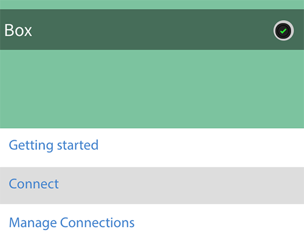

   *連線到方塊*

1. 系統會顯示一個對話方塊，提示您輸入電子郵件ID。 提供組織內負責管理Learning Manager Box帳戶人員的電子郵件ID。 提供電子郵件ID後，按一下「連線」 。
1. Learning Manager會傳送電子郵件給您，提醒使用者在第一次存取該方塊前重設密碼。 使用者必須重設密碼，並使用它來存取Learning Manager Box帳戶。

   >[!NOTE]
   >
   >只能為特定Learning Manager帳戶建立一個Learning Manager Box帳戶。

   在總覽頁面中，您可以指定整合的連線名稱。 從下列選項中選擇您要採取的動作：

   * 匯入內部使用者
   * 匯入xAPI活動報表
   * 匯出使用者技能 — 設定排程
   * 匯出使用者技能 — 隨選
   * 匯出學習者成績單 — 設定排程
   * 匯出學習者成績單 — OnDemand

## 匯入

+++內部使用者

匯入內部使用者選項可讓您排程自動產生使用者匯入報告。 產生的報表會以.CSV檔案傳送給您。

+++

+++對應屬性

成功建立連線後，您可以將置於Box資料夾中的CSV檔案欄對應至Learning Manager的對應屬性。 此步驟為必要步驟。

1. 在「對應屬性」頁面的左側，您可以看到Learning Manager的預期欄，而右側，您可以看到CSV欄名稱。 最初，您可以在右側看到一個空白的選取方塊。 按一下「選擇檔案」匯入任何範本CSV。
1. 上述步驟會在右側的「選取」下拉式清單中填入所有CSV欄名稱。 選取對應至Learning Manager欄名稱的適當欄名稱。

   *[管理員]欄位必須對應到電子郵件地址型別的欄位。 必須先對應所有欄，才能使用聯結器。*

1. 完成對應後，按一下「儲存」 。

   聯結器現已準備就緒，可供使用。 已設定的帳戶會在管理員應用程式中顯示為資料來源，供管理員排程匯入或進行隨選同步。

+++

+++xAPI活動報表

「xAPI報表活動」選項可讓您從協力廠商服務產生匯入xAPI陳述式。 檔案會儲存為.CSV檔案，並在匯入至Learning Manager時轉換為xAPI陳述式。

+++

+++匯入xAPI所需的設定

1. 在設定頁面中，選取可在設定清單中取得的現有設定，以從CSV匯入xAPI陳述式。 按一下編輯或&#x200B;**新增設定** 此連結可瀏覽至「匯入xAPI陳述式 — 組態來源檔案」頁面。

   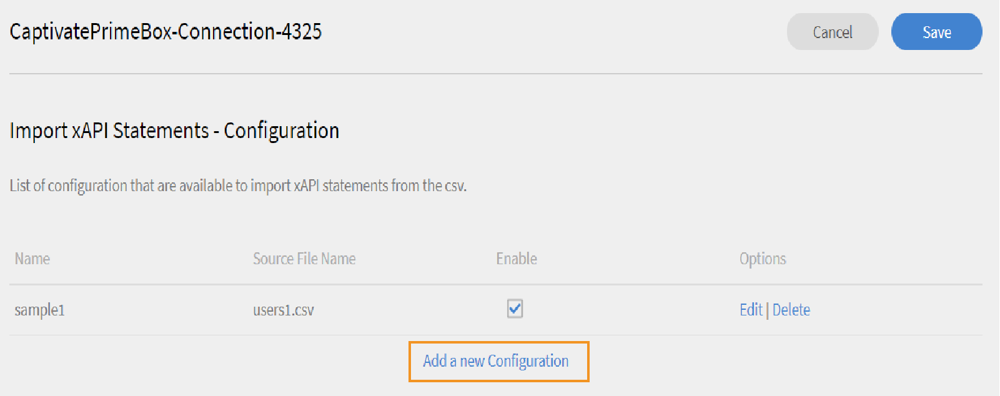

   *編輯或新增設定*

   **設定**

   * 在「設定匯入來源」頁面中，填寫兩個欄位，即「名稱」和「來源檔案名稱」。 來源檔案名稱應符合FTP資料夾位置中提供的檔案名稱。
   * 按一下 **[!UICONTROL Save]** 以儲存變更。

   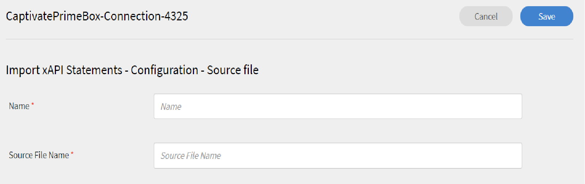

   *設定*

   **篩選**

   * 從左窗格中，按一下「篩選」
   * 在「設定匯入 — 篩選」頁面中，填寫「名稱和條件」欄位以篩選出記錄。 按一下「新增篩選器」以新增另一個篩選器。 您可以按一下「動作」欄下的「儲存或刪除」選項，儲存或刪除篩選器。

   

   *篩選*

   **對應**

   * 從左窗格中，按一下對應。
   * 在「設定匯入 — 對應」頁面的左側，您可以看到需要以CSV欄名稱對應的xAPI Json欄位路徑名稱。
   * 依預設，需要以CSV欄名稱對應的三個Json路徑欄位名稱是 **actor.mbox**， **verb.id**、和 **object.id**. 您可以按一下「新增對應」，新增其他欄位以對應。
   * 選取您要與Json欄位路徑名稱對應的欄名稱型別（不論是字串、數字、布林值或日期型別）。
   * 完成對應後，按一下「儲存」 。 現在可以依排程或依需求匯入xAPI匯入。

   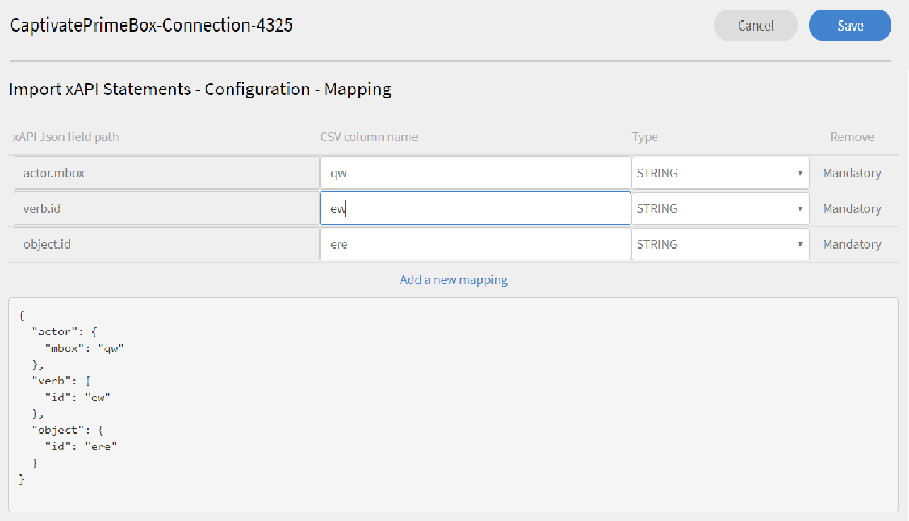
   *對應*

1. 從左窗格，按一下 **[!UICONTROL Configure Schedule]**. 按一下「啟用排程」以排程xAPI陳述式的匯入。 您可以輸入開始時間和日期，然後輸入xAPI匯入排程的頻率（以天為單位）。 例如，每3天啟用xAPI匯入一次。

   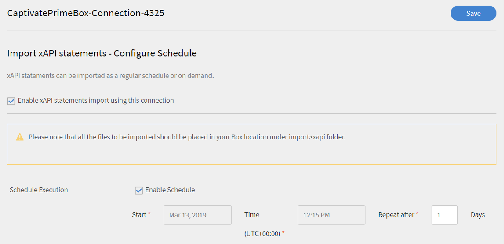
   *匯入xAPI陳述式 — 設定排程*

1. 從左窗格，按一下 **[!UICONTROL On Demand Execution]**.

   
   *匯入xAPI陳述式 — 隨選*

1. 從左窗格，按一下 **[!UICONTROL Execution Status]** 以時間順序檢視此聯結器的所有執行摘要。 您可以檢視匯入xAPI的開始日期和所需時間、匯入型別（無論是隨選匯入還是已排程）以及匯入狀態（無論是xAPI匯入正在進行中、已完成還是失敗）。

   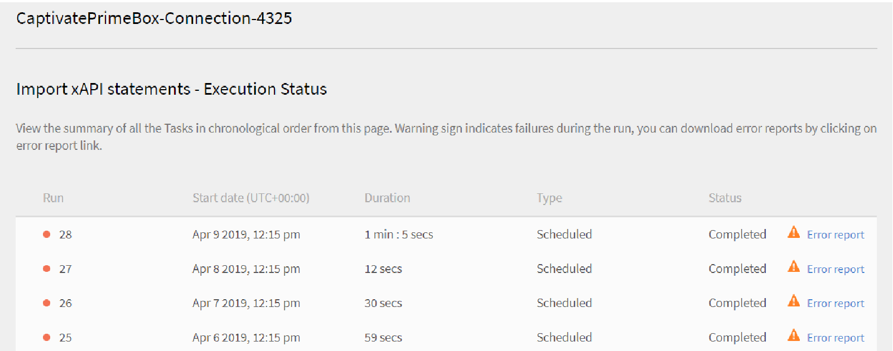
   *匯入xAPI陳述式 — 執行狀態*

+++

+++使用Learning Manager方塊聯結器

1. 來自外部系統的CSV檔案必須放在以下路徑中：

   `code $OPERATION$/$OBJECT_TYPE$/$SUB_OBJECT_TYPE$/data.csv`

   >[!NOTE]
   >
   >在2016年7月版本中，僅允許匯入使用者。 因此，若要使用「方塊」聯結器，請確定CSV檔案是放置在下列資料夾中：

   `code Home/import/user/internal/*.csv`

1. Box聯結器會從CSV檔案中取得所有列。 重要的是，對應至一個CSV中使用者的列不會出現在任何其他CSV中。
1. 所有CSV都必須包含對應中指定的欄。
1. 在程式開始之前，所有必需的CSV都必須存在於資料夾中。

將使用者匯入Learning Manager時，管理員也必須知道如何在Learning Manager中管理使用者。 請參閱 [使用者管理說明](migration-manual.md#usermanagement) 以瞭解更多資訊。

+++

## 匯出

+++Skills

匯出使用者技能報告有兩個選項。

使用者技能 — 隨選：您可以指定開始日期，並使用選項匯出報表。 報表會從輸入的日期擷取，直到現在為止

**[!UICONTROL User Skills - Configure]**：此選項可讓您排程報表的擷取。 選取「啟用排程」核取方塊，並指定開始日期和時間。 您也可以指定產生和傳送報告的間隔。

+++

若要開啟匯出檔案放置在Box位置中的Export資料夾，請開啟「使用者技能」頁面中提供的Box資料夾連結，如下所示。

自動匯出的檔案會出現在位置中 **首頁/匯出/&#42;Box_location&#42;**

自動匯出的檔案的標題為 **skill_achieves_&#42;起始日期&#x200B;&#42;_至_&#42;結束日期&#42;.csv**

>[!NOTE]
>
>客戶可管理Learning Manager團隊共用Box資料夾中的存取許可權和內容。  此外，資料夾中的內容將會實際儲存在法蘭克福地區。

### 支援手動csv欄位 {#Supportformanualcsvfields-1}

透過Box匯入使用者資料時，管理員必須將系統中出現的所有作用中欄位對應到csv中的對應欄位。

這是所有csv作用中欄位的必填。 對於手動作用中欄位，整合管理員可以選取選項 **不要從來源匯入**.

選取此選項後，手動作用中欄位值不會使用csv匯入填入。 學習者提供的值會維持不變。

>[!NOTE]
>
>對應時，如果選項 **不要從來源匯入** 已針對csv作用中欄位選取，則將從系統中刪除此欄位。

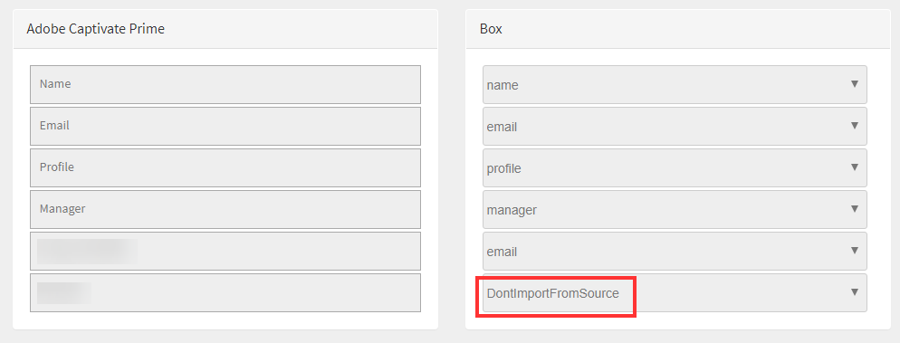
*作用中欄位的方塊聯結器*

>[!NOTE]
>
>任何使用FTP/Box作為資料來源的聯結器或移轉，都會刪除所有已處理的csv檔案。
>
>內容聯結器(例如LinkedIn)的csv將在七天後刪除，而匯入使用者的csv將立即刪除。

## linkedIn學習聯結器 {#linkedinlearningconnector}

LinkedIn.com的企業客戶會使用LinkedIn學習聯結器，他們想要讓學習者從Learning Manager中探索和使用課程。 聯結器可設定為定期使用您的API金鑰擷取課程。 在Learning Manager中建立課程後，使用者可以搜尋課程並加以使用。 然後可以在Learning Manager中追蹤學習者進度。

>[!NOTE]
>
>linkedIn學習課程所花費的學習時間會由LinkedIn內容/LinkedIn平台傳送至Learning Manager學習平台。 如果LinkedIn學習未傳送學習時間，我們的學習平台將無法記錄該時間。 在這種情況下，Learning Manager顯示的學習時間為零。

### 在Linkedln學習入口網站中設定設定 {#configuresettingsinlinkedlnlearningportal}

1. 以管理員身分登入Linkedln Learning LMS。
1. 按一下 **[!UICONTROL admin]** 從頂端導覽面板。
1. 按一下 **[!UICONTROL settings]** 標籤來選取下一個視窗。
1. 選取 **[!UICONTROL Playback Integration]** 從左側導覽面板，然後按一下 **整合** 標籤。
1. 按一下 **[!UICONTROL LMS Content Launch Settings]** 以展開其設定。
1. 新增下列三個主機名稱： **learningmanager.adobe.com**， **learningmanagerlrs.adobe.com**， **cpcontents.adobe.com**
1. 選取 **[!UICONTROL Enable AICC Integration]**.

   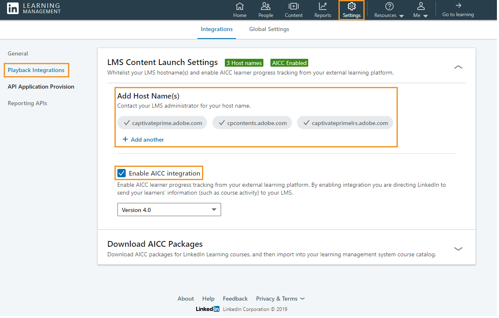

   *linkedIn學習設定*

### 設定LinkedIn學習聯結器 {#configurelinkedinlearningconnector}

1. 在整合管理控制面板中，按一下 [!UICONTROL LinkedIn Learning]. 將會顯示[快速入門]、[連線]和[管理連線]選項。
1. 如果您是第一次設定LinkedIn學習聯結器，請按一下 [!UICONTROL Connect].

   <!--Configure the Exavault FTP account before you configure this connector.

   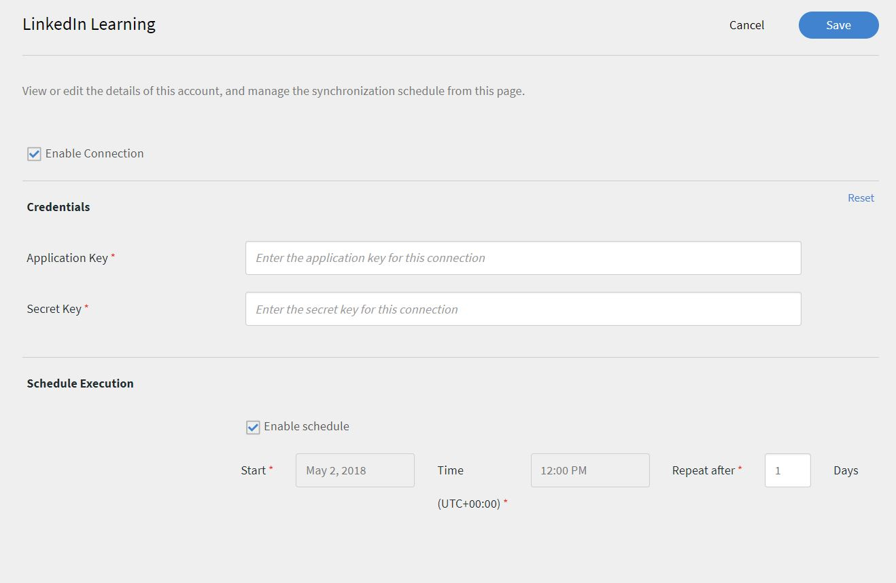
   *Configure connection*-->

1. 從連線頁面，指定聯結器的名稱。 輸入連線的Appkey和Secret金鑰。

   >[!NOTE]
   >
   >企業管理員可以從LinkedIn學習管理員入口網站產生新應用程式，以取得Appkey和秘密金鑰。

1. 按一下 **[!UICONTROL Save]**.

   設定已儲存，且您的帳戶已新增LinkedIn學習連線。 您現在可以按一下 **[!UICONTROL Manage Connections]** ，並隨時編輯您的設定。

1. 如果已建立連線，請按一下 **[!UICONTROL Manage Connections]** 檢視您的所有連線。

   >[!NOTE]
   >
   >在您設定此聯結器之前，必須為您的帳戶啟用移轉功能。

1. 按一下您要編輯的連線。
1. 從左窗格中，按一下「設定」。 執行下列任一項作業：

   * 從此視窗檢視或編輯您帳戶的詳細資訊以及同步處理排程。 選取 **[!UICONTROL Enable Connection]** 核取方塊。
   * 按一下 **[!UICONTROL Edit]** 並編輯您的認證。 若要復原此欄位的更新，請按一下[重設]。
   * 按一下 **[!UICONTROL Enable Schedule]** 以排程您的同步化。 您可以輸入開始時間與日期，然後輸入同步化排程的頻率（以天為單位）。 例如，每三天啟用同步處理一次。

   按一下 **[!UICONTROL Save]** 以儲存變更。

1. 從左窗格，按一下 **[!UICONTROL On-Demand Execution]**. 此選項可讓您從LinkedIn匯入使用者摘要和其他相關資料。 輸入隨選執行的「開始日期」，然後按一下「執行」以執行同步化。 從開始日期到出現的所有資料都會匯入。

   * 您可以按一下 **[!UICONTROL Disable access]** Learning Manager的執行期間，應用程式在同步期間發生停機狀況。
   * 如果您按一下 **[!UICONTROL Enable access]** Learning Manager在執行期間，同步期間不會中斷服務。

   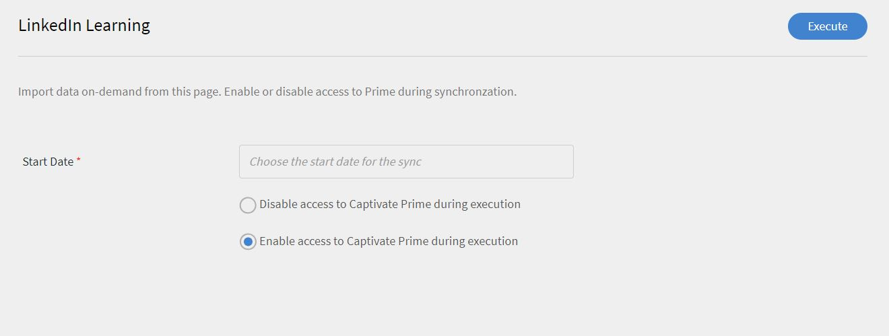

   *依需求執行報表*

1. 您也可以隨時從左側窗格按一下「執行狀態」，以時間順序檢視此聯結器的所有執行摘要。 您可以檢視同步化的開始日期和持續時間、同步化的型別（無論是隨選同步化）以及同步化的狀態（無論是正在進行中還是已完成）。

   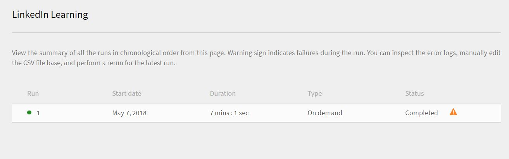

   *報告執行狀態*

   >[!NOTE]
   >
   >當您刪除並重新建立連線時，會再次出現聯結器的先前執行。 您可以在刪除連線之前檢視所有執行。

   您只能對最新的同步處理執行重新執行。

### 篩選LinkedIn學習內容 {#filter-linkedin}

linkedIn聯結器提供篩選條件，可根據LinkedIn學習資料庫隔離內容。 此外，您也可以根據語言和資料庫篩選內容，並僅匯入必要語言的課程。 匯入後，內容會根據匯入設定分隔至多個目錄。

以下是篩選器：

**篩選訓練，使用：** 將課程子集從LinkedIn篩選至Learning Manager。

* **根據語言**

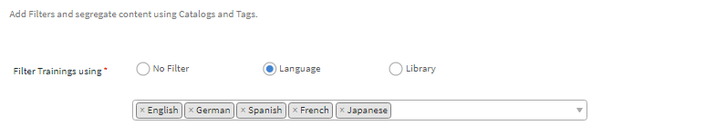

*依語言篩選*

* **根據LinkedIn學習的資料庫**

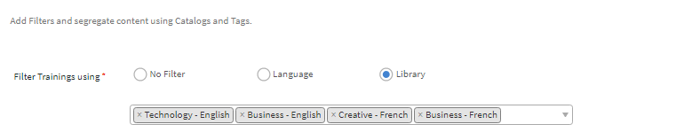

*依目錄篩選*

**將培訓匯入**

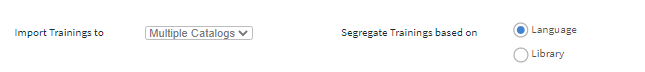
*將訓練匯入目錄*

**匯入標籤**

有標籤型別 —  **自訂標籤**，可用來將自訂標籤新增至LinkedIn學習課程。 您可以新增任意數量的標籤，並以逗號分隔。

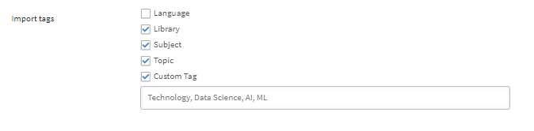

*新增自訂標籤*

內容僅在移轉後儲存。 內容將會儲存在個別目錄中。

## Power BI聯結器 {#powerbiconnector}

>[!NOTE]
>
>Learning Manager僅支援MicrosoftPower BI的商業授權整合。 它不會與政府雲端上的MicrosoftPower BI整合。

您可以透過此聯結器使用整合，以運用現有Power BI帳戶在Power BI中分析和視覺化學習管理員的學習資料。 在設定期間，整合管理員可以設定其Power BI工作區，以增量填入兩個即時資料集 — 學習者成績單和使用者技能報告。 然後，您可以使用PowerBI的所有功能和威力，開發、部署和發佈他們想要的組織中的自訂儀表板。

### 設定聯結器 {#configuringtheconnector}

若要設定聯結器，請在 **[!UICONTROL Connectors]** 頁面，將游標暫留在 **[!UICONTROL Power BI]** 圖磚並按一下 **[!UICONTROL Connect]**. Power BI頁面隨即開啟。 若要建立連線，您必須提供應用程式使用者端ID、應用程式使用者端密碼、租使用者名稱稱和工作區ID （選用）。 若要取得這些認證，請依照下列步驟進行。

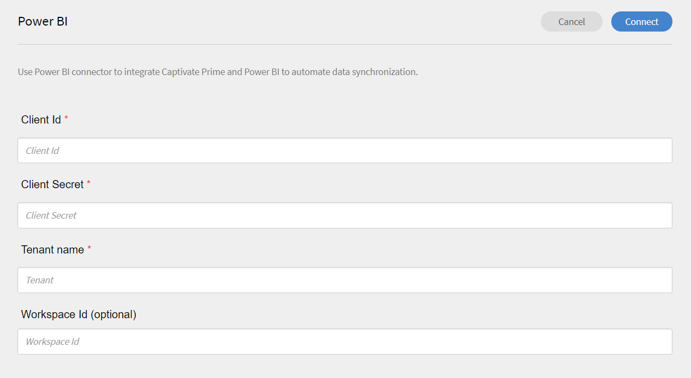

*設定Power BI聯結器*

1. Launch <https://app.powerbi.com/embedsetup>.
1. 按一下 **[!UICONTROL Embed for your organization]** 並登入您的Microsoft帳戶。
1. 輸入應用程式的名稱。
1. 在「應用程式型別」區段中，選取「伺服器端Web應用程式」選項。
1. 在 **[!UICONTROL Redirect URL]** 區段，選取選項 **使用自訂URL** （如果您知道目標應用程式的URL，請選擇此選項）。 輸入下列URL：

   `https://learningmanager.adobe.com/ctr/app/azure/_callback` （根據環境更新網域）

1. 在「首頁URL」欄位中，輸入下列URL， `https://learningmanager.adobe.com/`
1. 在許可權區段中，選取 **讀取所有資料集** 和 **讀取和寫入所有資料集**.

   取得租使用者：請聯絡您的Power BI管理員以提供租使用者名稱稱。

   取得Workplace Id：只有Power BIPro使用者才能建立Workplace。 您可以在Power BI中建立工作區，並從URL取得ID。

1. 按一下 **[!UICONTROL Register app]** 並儲存使用者端ID和使用者端密碼。

>[!NOTE]
>
>如果您想要再次授權連線，則必須建立另一個Power App，並指定品牌重新導向的URL。

您可以使用相同的方法匯出學習者成績單、使用者技能和xAPI活動報告。 從左側面板選擇「學習者成績單/使用者技能」。 「匯出」頁面隨即開啟。

啟用 **[!UICONTROL Enable User-Skill/ Learner Transcript export using this connection check box]**. 儲存變更。

**匯出設定**：如果您想要排程報表擷取。 選取 **[!UICONTROL Enable Schedule]** 核取方塊，並指定開始日期和時間。 您也可以指定產生和傳送報告的間隔。

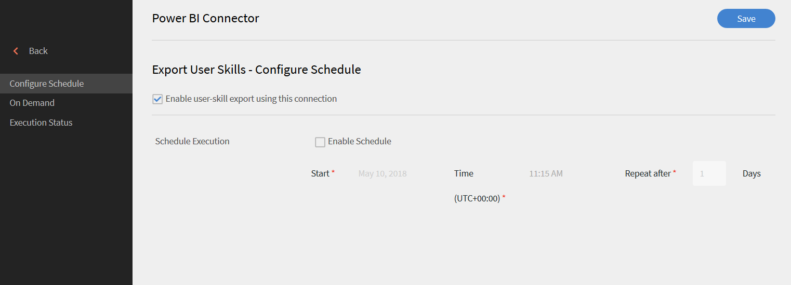

*匯出設定以排程報表*

**隨選匯出：** 您可以指定開始日期，並使用選項匯出報表。 報表會從輸入的日期擷取，直到現在為止。

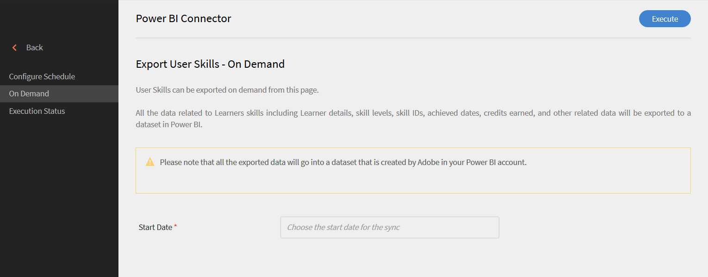

*隨選匯出*

可透過登入您的Power BI帳戶來檢視匯出的資料。 匯出的資料會列在資料集選項下。

### 在Learning Manager中匯出xAPI活動報表 {#exportxapiactivityreportsincaptivateprime}

從PowerBI-xAPI功能頁面，按一下 **[!UICONTROL Export xAPI Activity Report]**.

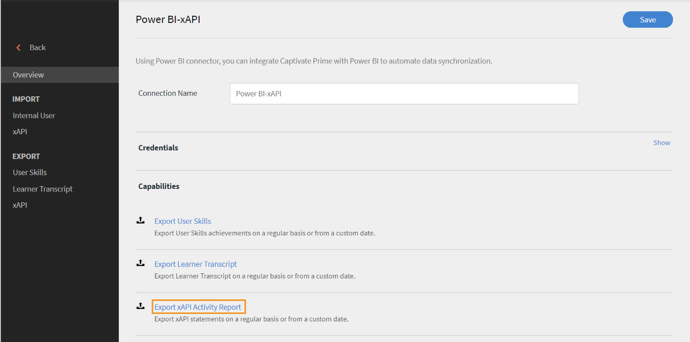
*PowerBI — 匯出xAPI活動報表*

從左窗格中選取 **設定** 並遵循下列步驟：

* 填寫符合欄名稱和字串型別的JSON路徑欄位。
* 若要新增更多JSON路徑，請按一下 **[!UICONTROL Add]**.
* 您可以按一下「 」，編輯JSON路徑欄位中的專案 **[!UICONTROL Edit]**.
* 按一下 **[!UICONTROL Save]** 以儲存變更。

**設定排程**

從左窗格，按一下 **[!UICONTROL Configure Schedule]** 並執行下列動作：

* 按一下「啟用使用此連線的xAPI陳述式匯出」。
* 按一下 **[!UICONTROL Enable Schedule]** 核取方塊，並指定開始日期和時間。 您也可以指定要重複及傳送匯出的間隔天數。
* 按一下 **[!UICONTROL Save]** 按鈕以儲存設定排程設定。

*xAPI匯出設定排程*

**隨選**

從左窗格，按一下 **[!UICONTROL On Demand]** 並在「匯出xAPIi陳述式 — 隨選」頁面中指定開始日期。

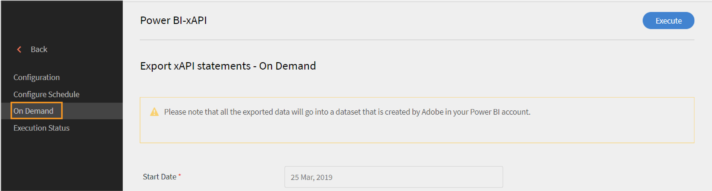
*隨選的xAPI匯出*

所有匯出的資料都將進入您的Power BI帳戶中Adobe建立的資料集。

如果LRS中的少數xAPI陳述式沒有設定為要匯出的json路徑，則xAPI匯出至Power BI會失敗。 對於無法使用json路徑的xAPI陳述式，應新增N/A常數值並以Power BI顯示。

**執行狀態**

選取 **執行狀態** 以時間順序檢視所有工作的摘要。 警告符號表示執行期間發生失敗。 您可以下載錯誤報告為 **CSV** 按一下「錯誤報表」連結。

*xAPI匯出執行狀態*

### 統一報告 {#unified-reports}

Learning Manager提供的方法可讓您建立匯出並包含使用者資料、學習者成績單、遊戲化、意見回饋報告等報表組合，作為一個Power BI資料集。

這可讓Power BI使用者合併來自多個報表的資料，以在Power BI中顯示更強大的分析和視覺效果。

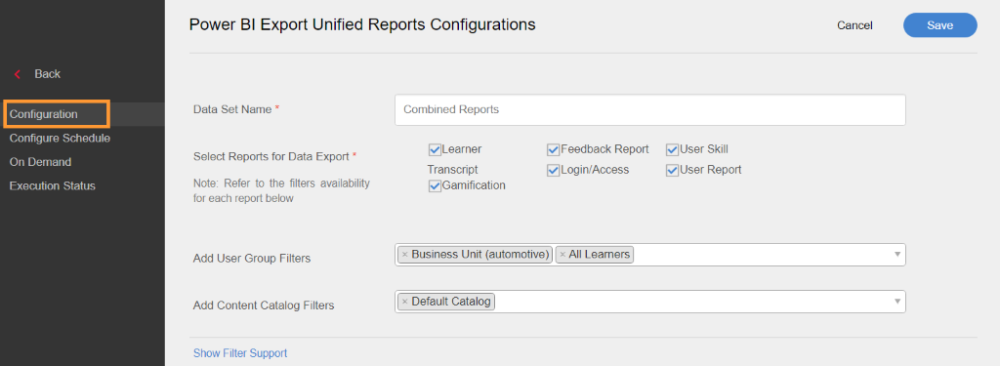
*統一的Power BI報表*

**隨選匯出**

指定開始日期和結束日期，並使用選項匯出報表。 系統會擷取指定日期範圍的報表。

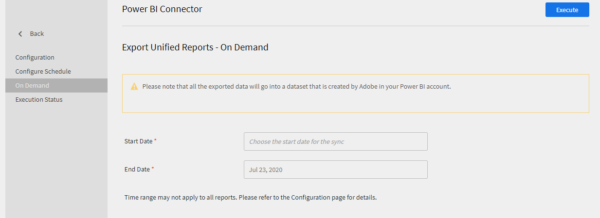
*隨選匯出*

**排定的匯出**

如果您想要排程報表擷取。 選取 **啟用排程** 核取方塊，並指定開始日期和時間。 您也可以指定產生和傳送報告的間隔。

*設定排程*

您也可以將培訓報表匯出至Power BI。

訓練報告可以匯出為Power BI作為統一報告功能的一部分。

訓練報告有兩個額外的欄位：

* 在課程上分享意見回饋的使用者人數
* 課程的平均星級評等

### 學習者成績單的篩選狀態 {#lt-status}

在Power BI連線的「統一報告」區段中，可選擇根據學習物件的狀態匯出學習者成績單。

* **全選：** 匯出指定日期範圍內的所有記錄或模組層級活動。
* **已完成：** 匯出在日期範圍內完成的所有記錄。
* **進行中：** 匯出所有狀態為「處理中」的記錄。
* **尚未開始：** 排除已在指定日期範圍內註冊，但在產生報表時尚未開始的記錄。

* **取消註冊：** 包括日期範圍內未註冊的所有記錄。

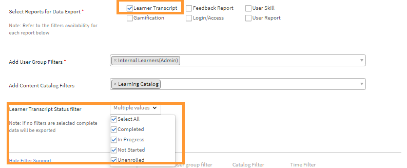
*學習成績單的篩選狀態*

您可以匯出必要的清單，稍後再使用Power BI分析報表。

### 下載Power BI範本 {#template}

Learning Manager也提供現成的Power BI範本。 這些範本為AdobeLearning Manager帳戶管理員提供更好的分析功能。

您可以使用這些可用的範本輕鬆下載範本、匯出相關報告和繪圖報告。

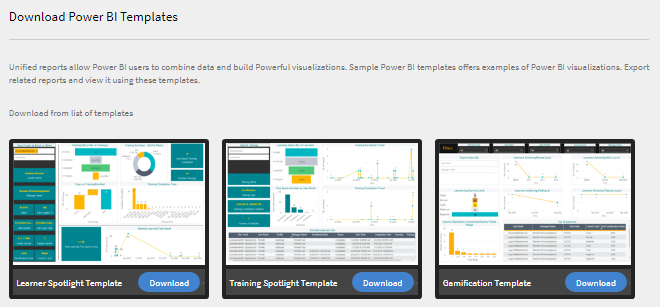
*下載Power BI範本*

這可讓使用者下載這些範本，並將其用於Power BI應用程式，進一步自訂這些範本，讓您的報表展現精彩的故事。

[**下載範本**](https://documentcloud.adobe.com/link/track?uri=urn:aaid:scds:US:842bb6a2-cd7d-4c3d-b968-da38bc1cc18a)

<!--<table> 
 <tbody>
  <tr> 
   <td></td> 
   <td>
 
 
<a disablelinktracking="false" href="https://documentcloud.adobe.com/link/track?uri=urn:aaid:scds:US:842bb6a2-cd7d-4c3d-b968-da38bc1cc18a"><strong><em>Download the templates</em></strong></a>
</td> 
  </tr> 
 </tbody>
</table>-->

您也可以透過上述連結手動下載範本。 使用範本並據以自訂您的報表。

### 匯出訓練報告

訓練報告可以匯出為Power BI作為統一報告功能的一部分。

培訓報告有以下其他欄位：

* 在課程上分享意見回饋的使用者人數
* 課程的平均星級評等

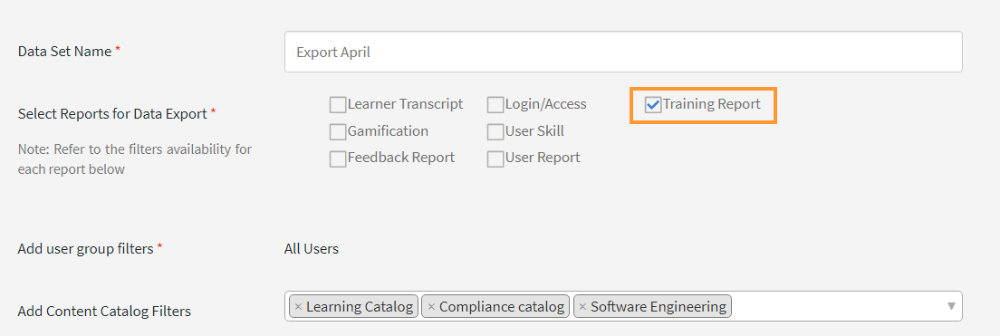
*匯出訓練報告*

### 學習路徑相關變更

#### 管理員：學習成績單和統一報告

**現有連線**

如果「管理員」帳戶中的「學習路徑」選項已停用，報表中不會新增任何列和欄。

如果在「管理員」帳戶中啟用了「學習路徑」選項，則報表會針對所有已註冊學習路徑的學習者，包含「學習路徑（更高級別）」欄型別。

**新連線**

如果「管理員」帳戶中的「學習路徑」選項已停用，訓練報表會由下列欄組成：

* 內嵌路徑：顯示學習計畫的名稱
* 內嵌路徑ID：顯示學習計畫的ID。
* 內嵌課程ID：顯示學習路徑中課程的ID。

此外，對於所有已註冊學習路徑的學習者，報表會包含「學習路徑（更高級別）」欄型別。

在「型別」欄中，學習方案將重新命名為「學習路徑」。 對於現有的連線，將不會有任何變更。 不過，如果是新連線，30天後才會反映變更。

#### 訓練報告：統一報告

**現有連線**

如果「管理員」帳戶中的「學習路徑」選項已停用，報表中不會新增任何列和欄。

如果「管理員」帳戶中啟用了「學習路徑」選項，報表會包含「型別」欄。 欄中包含「學習路徑（較高級別） （如適用）的新值」。

**新連線**

如果「管理員」帳戶中的「學習路徑」選項已停用，訓練報表會由下列欄組成：

* **內嵌路徑：** 顯示學習計畫的名稱
* **內嵌路徑ID：** 顯示學習計畫的ID。
* **內嵌課程ID：** 顯示學習路徑內課程的ID。

此外，對於所有已註冊學習路徑的學習者，報表會包含「學習路徑（更高級別）」欄型別。

在「型別」欄中，學習方案將重新命名為「學習路徑」。 對於現有的連線，將不會有任何變更。 不過，如果是新連線，30天後才會反映變更。

## 自訂FTP {#custom-ftp}

**先決條件**

>[!NOTE]
>
>若要設定自訂FTP，請聯絡您的CSM。 CSM將提供設定FTP的必要詳細資訊。
>
>設定FTP需要前置時間，且需要IT支援才能允許IP和連線埠清單，以及在FTP伺服器上建立具有特定許可權的特定資料夾。

Learning Manager提供連線至自訂FTP位置的功能。

您的FTP將支援下列專案：

### 資料匯入

使用者匯入程式可讓Learning Manager管理員從Learning Manager FTP服務擷取員工詳細資訊，並自動將其匯入Learning Manager。 使用此功能，您可以將這些系統產生的CSV放在FTP帳戶的適當資料夾中，以整合多個系統。 Learning Manager會挑選CSV檔案、將其合併，並根據排程匯入資料。 如需詳細資訊，請參閱排程功能。

**對應屬性**

整合管理員可以選擇CSV欄，並將它們對應至Learning Manager的群組屬性。 此對應是一次性工作。 完成對應後，後續的使用者匯入會使用相同的對應。 如果管理員想要擁有不同的對應來匯入使用者，可以重新設定對應。

### 資料匯出

資料匯出可讓使用者將使用者技能和學習者成績單匯出至FTP位置，以便與任何第三方系統整合。

### 排程報表

管理員可以根據組織的需求設定排程任務，且Learning Manager應用程式中的使用者會根據排程瞭解最新狀態。 同樣地，整合管理員可以排程技能匯出，以及時與外部系統整合。 同步可在Learning Manager應用程式中每天執行。

若要設定您自己的FTP，請以整合管理員身分登入，然後按一下 **[!UICONTROL Custom FTP]** > **[!UICONTROL Connect]**.

有兩種驗證型別：

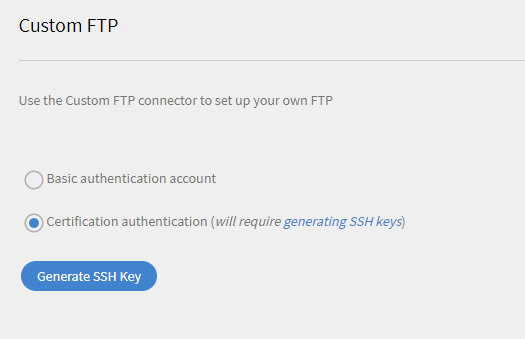
*自訂FTP驗證選項*

* **基本：** 在基本驗證中，您只需要提供FTP網域URL、使用者名稱和密碼。 提供詳細資訊後，按一下「連線」。
* **認證：** 如果客戶FTP支援憑證驗證，則他們可以選擇此選項。 在您按一下「產生SSH金鑰」之後，SSH金鑰就會下載至您的本機電腦。 當您開啟檔案時，金鑰看起來像，

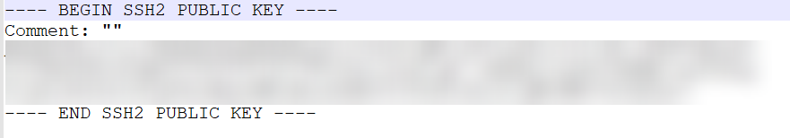
*ssh公開金鑰*

在新增以下詳細資料之前，您必須將此公開金鑰放入FTP伺服器。 將指定金鑰設為FTP的公開金鑰後，提供FTP網域URL和使用者名稱，然後按一下 **連線** 按鈕以設定連線。

連線設定完成後，會在ftp位置中自動建立匯入和匯出的資料夾。 之後，自訂FTP會提供匯入/匯出功能。

>[!NOTE]
>
>自訂FTP聯結器只能設定為SFTP伺服器。

## ADFS聯結器 {#adfsconnector}

建立ADFS連線的先決條件：

* 使用此URL登入您的Azure入口網站：  [https://portal.azure.com/](https://portal.azure.com/) 註冊您的應用程式之前。
* 開啟Azure Active Directory

## 註冊應用程式的步驟 {#stepstoregisteryourapplication}

* 按一下Azure Active Directory。 按一下 **[!UICONTROL Add]** > **[!UICONTROL App registration]**.

  <!--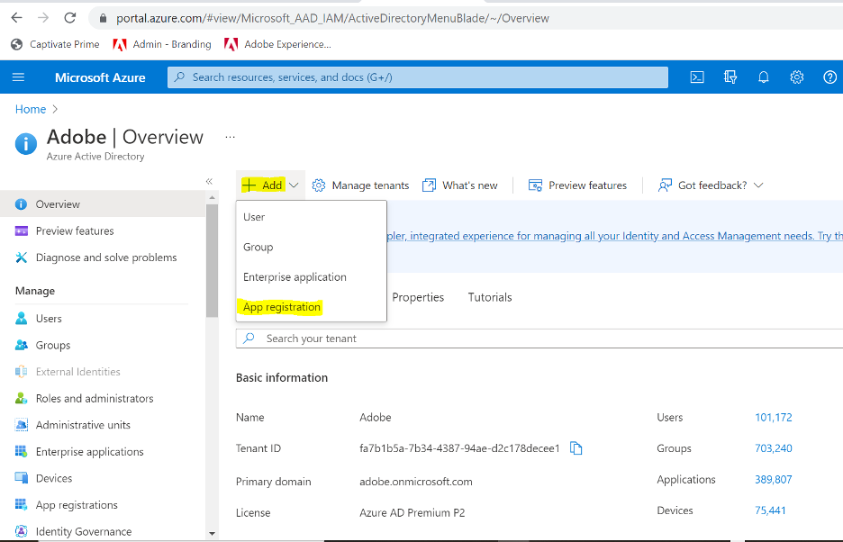-->
  <!-- *Add app registration*-->

* 輸入應用程式的名稱。

  <!--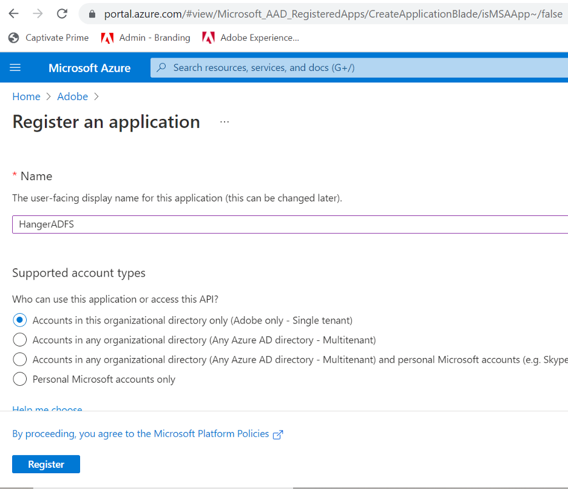-->
  <!--*Enter the name of the application*-->

  按一下 **[!UICONTROL Register]**.

* 在右窗格中，選取 **[!UICONTROL Certificates and Secrets]**.

  <!--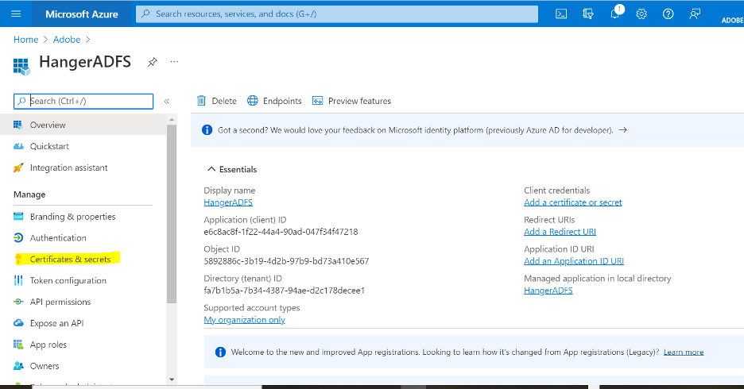-->

  <!--*Select Certificates and Secrets*-->

* 新增使用者端密碼。

  <!--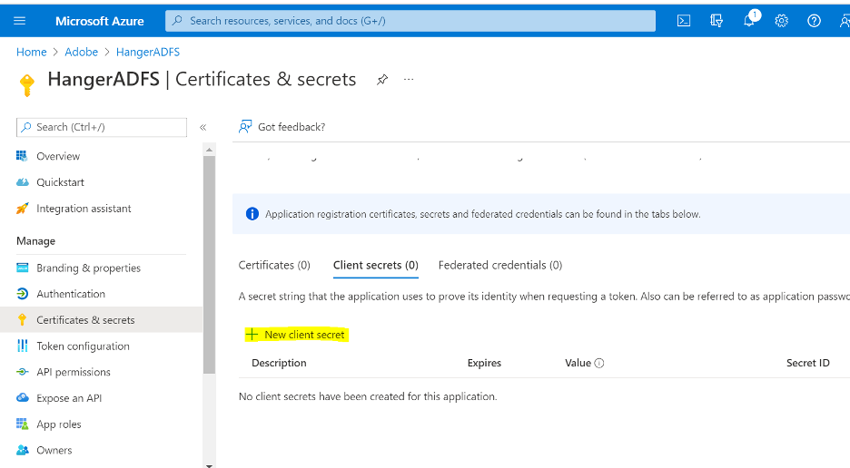-->

  <!--*Add a client secret*-->

* 為密碼新增說明，並將到期日設為24個月。

  <!-- 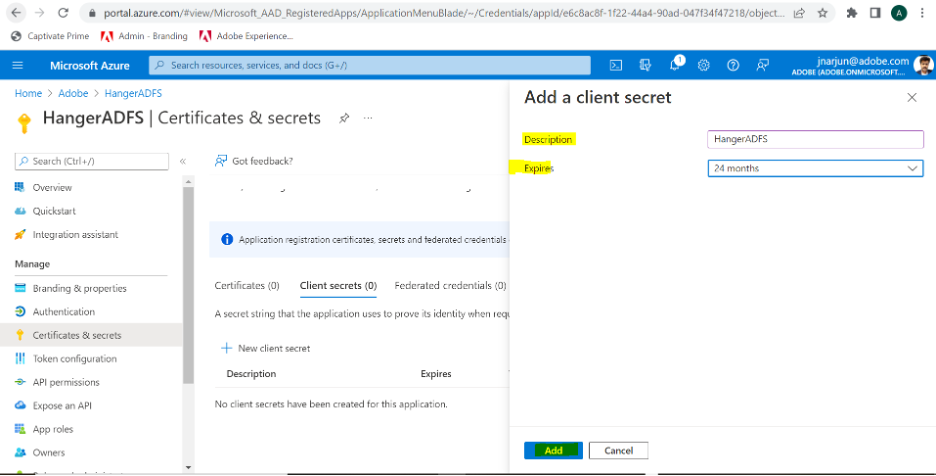-->

  <!--*Add description*-->

* 將值和密碼複製到（例如記事本）。

  <!-- 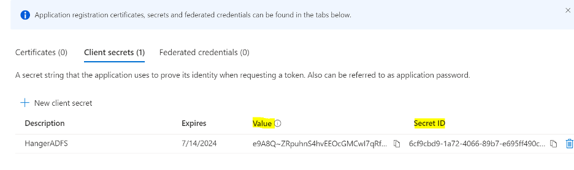-->

  <!--*Copy value and secret key*-->

* 選取 **API許可權**.

  <!--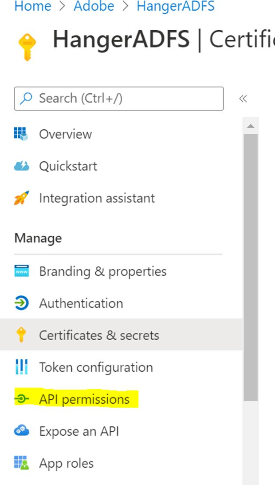-->

  <!-- *Left pane containing API Permissions*-->

* 選取 **新增許可權**. 此外，啟用選項， **授予管理員同意**.

  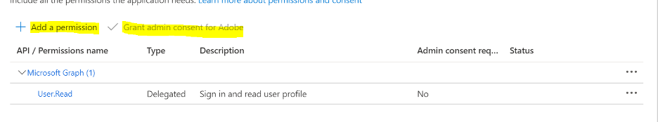

  *新增許可權*

* 選取 **Microsoft Graph**.

  <!--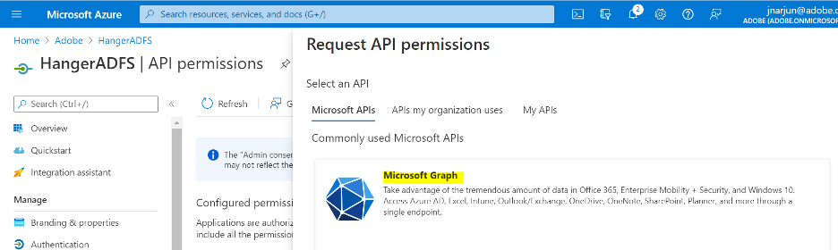-->

  <!--*Select Microsoft Graph*-->

* 選取 **應用程式許可權**.

  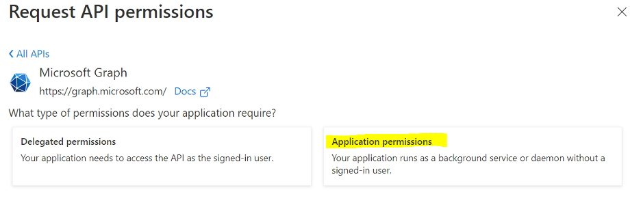

  *選取應用程式許可權*

* 搜尋 *目錄* 並選取 **讀取目錄資料**.

  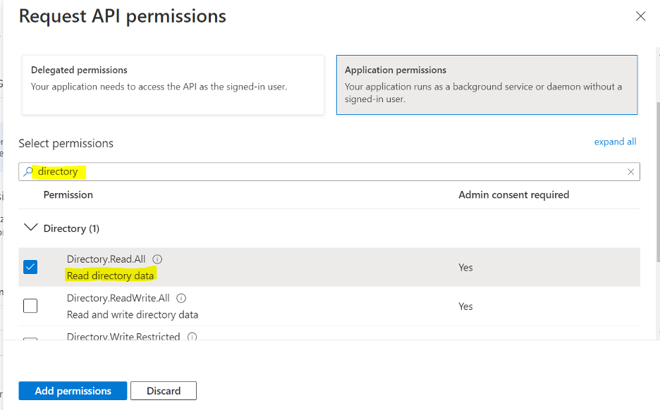

  *選取讀取目錄資料*

* 輸入 *使用者* 作為搜尋字詞。

  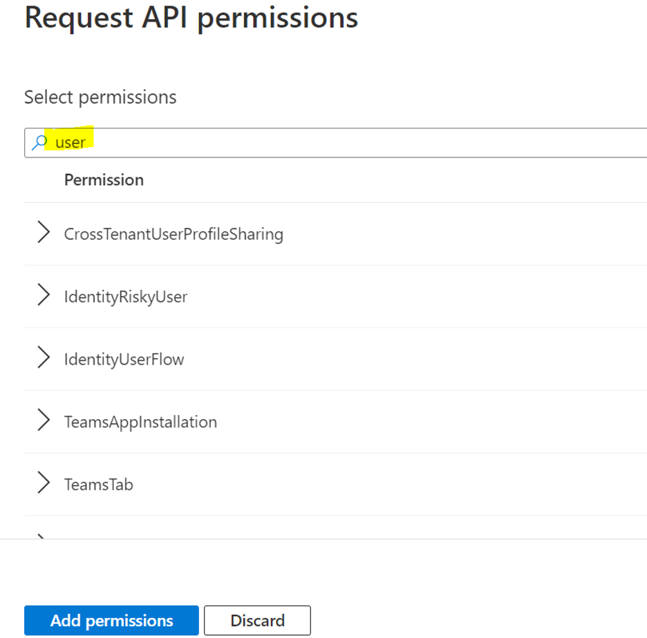

  *輸入搜尋字詞*

* 選取 **讀取所有使用者的完整設定檔**.

  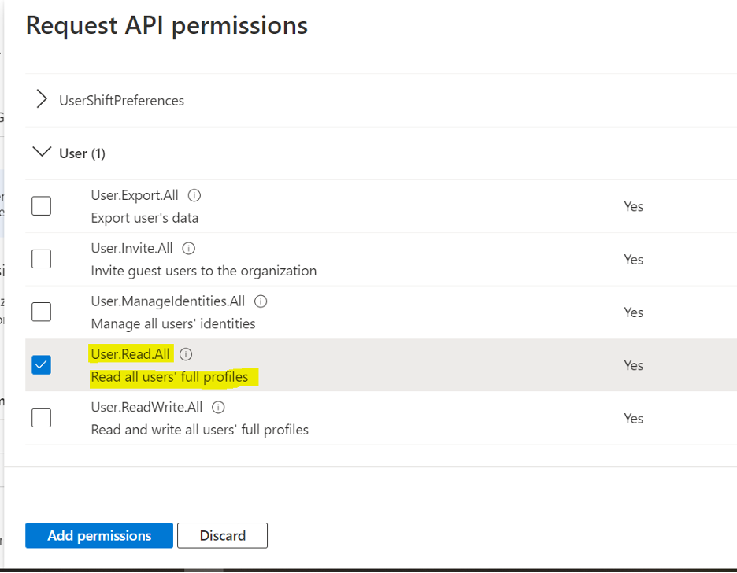

  *選取讀取所有使用者的完整設定檔*

* 選取 **新增許可權**.

  <!--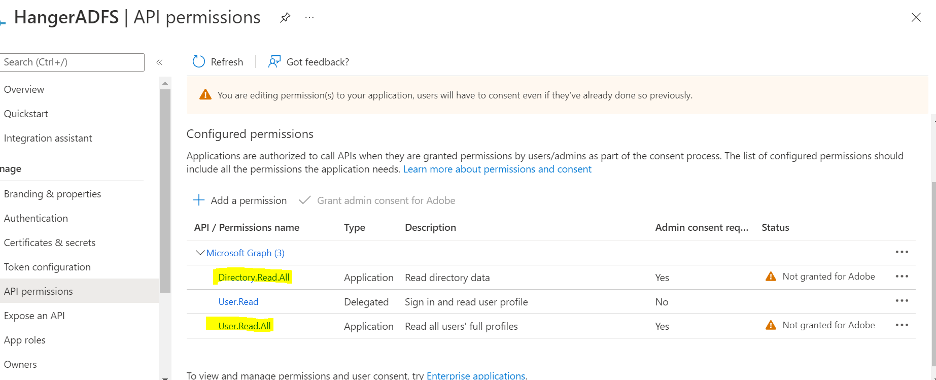-->

  <!-- *Select Add Permissions*-->

### ADFS設定頁面

1. 在Adobe Learning Manager的ADFS設定頁面中，輸入您先前取得的使用者端ID和使用者端密碼。

   按一下 **[!UICONTROL Connect]**.

1. 登入 **portal.azure.com**. 值將會填入租使用者ID和主要網域欄位中。

### 匯入

#### 對應屬性

整合管理員可以選擇ADFS屬性，並將其對應至對應的Learning Manager群組屬性。 完成對應後，後續的使用者匯入會使用相同的對應。 如果管理員想要為匯入使用者設定不同的對應，則可重新設定此對應。

#### 自動匯入使用者

使用者匯入程式可讓Learning Manager管理員從ADFS擷取員工詳細資訊，並自動將其匯入Learning Manager。

#### 篩選使用者

Learning Manager管理員可在匯入使用者之前對其套用篩選。 例如，Learning Manager管理員可選擇匯入階層中一或多個特定管理員下的所有使用者。

若要設定ADFS聯結器，請聯絡Learning Manager CSM團隊。

## 設定ADFS聯結器 {#configureadfsconnector}

1. 在Learning Manager首頁中，將滑鼠游標停留在ADFS卡片/縮圖上。 選單出現。 按一下功能表中的「連線」選項。

   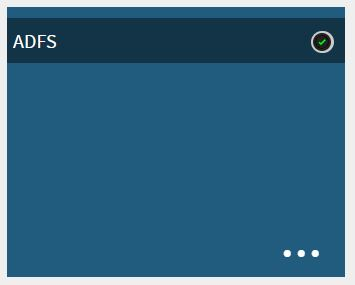

   *ADFS縮圖*

1. 按一下「連線」以建立新連線。 會顯示ADFS聯結器頁面。 輸入您要對應的帳戶詳細資料。

   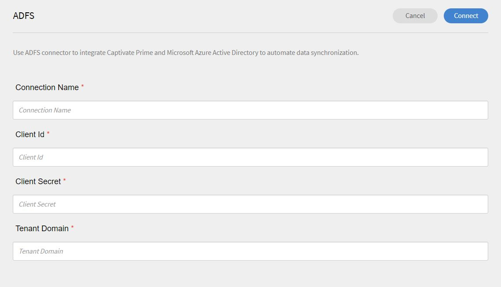

   *建立連線*

1. 如果您想要直接將ADFS使用者匯入為Learning Manager內部使用者，請使用「匯入內部使用者」選項。

   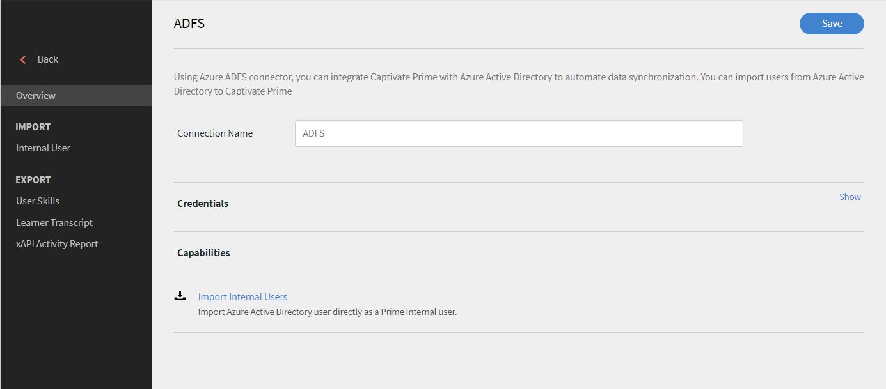

   *將使用者匯入Learning Manager*

1. 在對映頁面中，左側可看到Learning Manager的欄，右側可看到ADFS欄。 選取對應至Learning Manager欄名稱的適當欄名稱。

   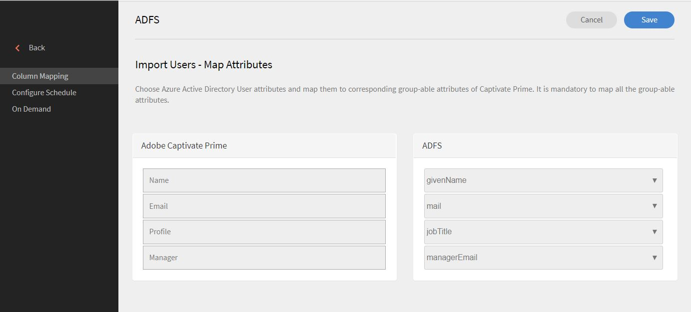

   *對應屬性*

1. 若要檢視及編輯資料來源，請以管理員身分按一下 **[!UICONTROL Settings]** > **[!UICONTROL Data Source]**.

   將列出已建立的ADFS來源。 如果您需要編輯篩選器，請按一下 **[!UICONTROL Edit]**.

   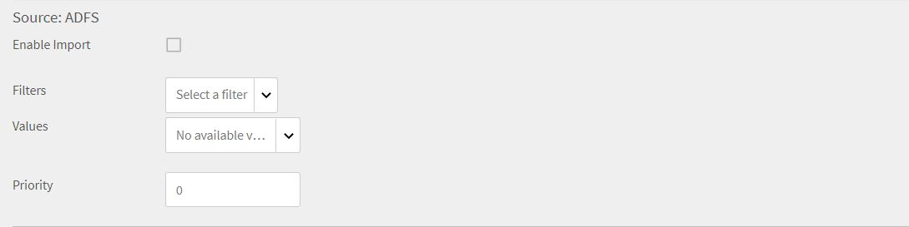
   *資料來源設定*

1. 匯入完成後，您會收到通知。 若要檢視或編輯匯入記錄，請按一下 **[!UICONTROL Users]** > **[!UICONTROL Import log]**.

### 刪除連線 {#Deleteaconnection-1}

若要刪除已建立的miniOrange連線，請按照下列步驟操作。

## Adobe Connect {#connect}

1. 在Adobe Connect上，按一下卡片上的三個點，然後選擇 **連線**.
1. 按一下 **立即設定** Adobe Connect設定區段中的連結。
1. 提供您公司的Adobe Connect網域名稱並登入認證。

   Adobe Connect URL範例： ***mycompany.adobeconnect.com***

   您必須提供Adobe連線帳戶管理員的電子郵件ID。

   >[!NOTE]
   >
   >Learning Manager僅支援Adobe代管的連線帳戶。 範例； &#39;.adobeconnect.com&#39;。

1. 按一下 **[!UICONTROL Integrate]**.

   驗證電子郵件ID後，Learning Manager會在Connect成功整合時顯示訊息。 您可以開始使用Adobe Connect自動檢視您的虛擬教室課程。

   **Connect帳戶管理員驗證其電子郵件ID後，該請求就會取得Adobe Connect後端團隊的核准。 通常需要一兩天的時間，才能核准和設定整合。**

   >[!NOTE]
   >
   >Adobe Connect帳戶管理員應接受使用Adobe Connect的條款與條件。 如果不接受此設定，您的登入驗證可能會失敗。 建立Adobe Connect帳戶後，請登入該帳戶一次。 第一次登入時，條款與條件頁面就會顯示。

### 新增虛擬教室工作階段資訊 {#addvirtualclassroomsessioninformation}

如果虛擬教室課程的作者未提供工作階段資訊，則管理員可包含工作階段詳細資訊。

在管理員登入中，按一下VC課程名稱。 按一下左窗格中的執行個體和工作階段詳細資訊。  按一下「階段作業詳細資訊」頁面右角的編輯圖示，以新增階段作業資訊。

透過整合Adobe Learning Manager和Adobe Connect來建立虛擬教室模組或工作階段，您的Connect帳戶應可支援會議室，且會議室數量足以提供您使用案例的並行使用者。 這些會議室用於託管Learning Manager虛擬教室模組。 Learning Manager會針對Learning Manager中的每個虛擬教室模組或工作階段，動態建立新的Connect會議室。

>[!NOTE]
>
>除了Adobe Learning Manager，您還必須另外購買Adobe Connect。

### Adobe Connect永續會議室 {#persistent}

在Adobe Connect中，客戶會使用已在Connect中建立的現有會議室。 「連線」中的所有會議室都是永久性的，會議室範本經過精心設定，為每個永久性的會議室提供統一的體驗。

您可以使用Adobe Connect中已建立的其中一個聊天室來建立虛擬教室工作階段。

Learning Manager也可讓學習者使用驗證方法進入虛擬工作階段的連線室。

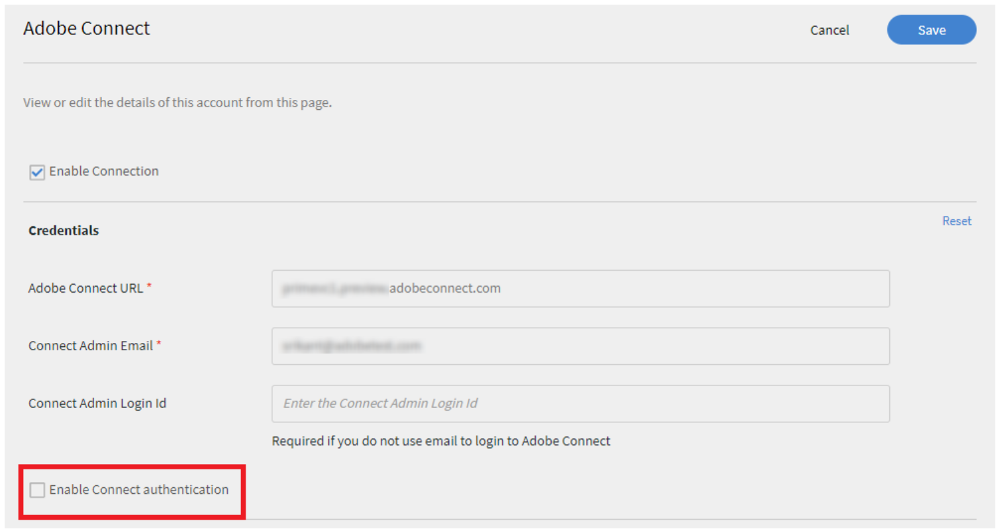
*Adobe Connect驗證*

使用Adobe Connect建立VC模組時，您可以選取永久聊天室。 如果 **否** 選取後，會像之前一樣建立動態會議室。

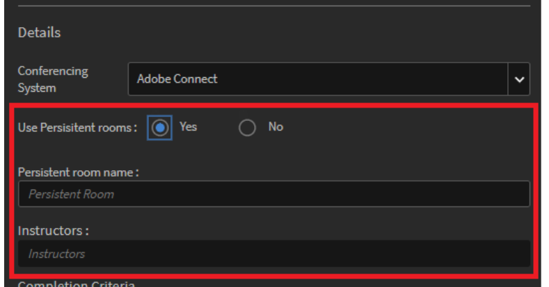
*永久會議室選擇*

學習者透過Adobe Connect參加課程並完成課程後，一段時間後，工作階段紀錄及密碼會顯示於學習者應用程式上。

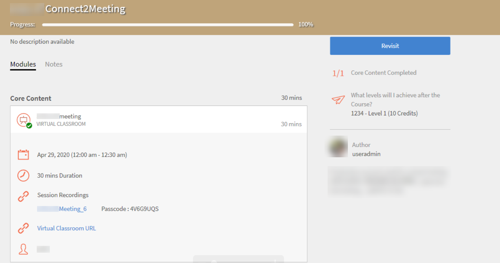
*連線錄製*

### 從Adobe Connect匯入測驗分數 {#quiz-adobe-connect}

將連線測驗資料匯入Learning Manager並整合現有報告工作流程，這樣Learning Manager使用者就可以在報告內從Adobe Connect工作階段取得測驗資料、使用者回應和分數，就像提供測驗功能的自學課程模組一樣。

在「連線」區段中，如果有任何學習者參加測驗課程或任何支援測驗報告的互動，則除了完成以外，還會追蹤學習者的所有互動。 課程必須是Connect VC訓練。

以下是此程式的簡短工作流程。

**Adobe Connect — 主機**

* Connect中的主機會建立課程並上傳包含測驗和互動式內容的內容。
* 主機會建立 **虛擬教室** 訓練並儲存VC訓練。 主機可以選擇將以上建立的課程連結至VC，或者他/她可以使用 **共用課程** 課程共用期間連線應用程式內的選項。

**Learning Manager — 作者**

* 作者在Learning Manager中建立課程，模組型別為 **虛擬教室。**
* 從 **會議系統** 從下拉式清單中選擇[Connect]作為VC提供者。
* 選擇「持續會議」課程，並在「連線」中選取由主機建立的VC教室。 選擇講師。 儲存並發佈課程。

**Learning Manager — 學習者**

* 課程發佈後，學習者即註冊課程。
* 學習者會重新導向至Connect VC工作階段，在此階段中允許Connect主機存取VC工作階段。

**Adobe Connect — 主機**

* 在VC工作階段中，Connect主機會共用先前共用的測驗。

**Adobe Connect — 學習者**

* 學習者會參加測驗，並在測驗完成後關閉工作階段。

**Learning Manager — 學習者**

* 學習者會關閉工作階段並自動同步工作階段。

**Learning Manager — 管理員**

* 工作階段過期後，就會在排定的期間後觸發測驗匯入工作流程。
* 等候排程觸發且處理完成。 若要從整合管理員端檢視處理狀態，您可以檢視 **執行狀態** 在Adobe Connect聯結器內觀看進度。 一旦執行成功，狀態將變更為 **已完成**.

* 管理員可選擇先前建立的Learning Manager課程。 管理員會看到以下內容：

   * **出席與評分**  — 顯示最終測驗分數和出勤狀態。
   * **L2測驗分數**

      * **依使用者**  — 顯示最終測驗分數，如 **點** 和 **百分比**.
      * **按問題**  — 以報表圖表顯示測驗資訊。

## Marketo Engage聯結器 {#marketo}

Learning Manager整合Marketo Engage，這是一個協助執行行銷活動的行銷自動化軟體。

Marketo Engage聯結器可在新使用者新增至Learning Manager帳戶時，在Marketo Engage資料庫中新增（或更新）銷售機會。 它也會將使用者在Learning Manager中的學習行為（課程註冊、課程完成、技能指派和技能成績）關聯為自訂物件與Marketo Engage中的對應銷售機會。 這可讓行銷人員使用這些資訊，根據從Learning Manager擷取的學習行為來鎖定對象，並使用「智慧清單」等Marketo Engage功能。

身為整合管理員，您可以整合Learning Manager與Marketo Engage例項，以自動化資料同步。 您可以匯出內部使用者，以及匯出訓練註冊和技能完成事件。 作業可在排程上執行，且可視需要加以設定。

若要讓Learning Manager與您的Marketo帳戶整合，您的Marketo帳戶必須能夠透過API建立結構描述。

您可從Marketo應用程式下載下列三個報表：

* 使用者報告
* 學習成績單
* 使用者技能報告

建立Marketo Engage連線時，您必須提供下列詳細資訊：

* 連線名稱
* 使用者端ID
* 使用者端密碼
* Marketo Engage網域

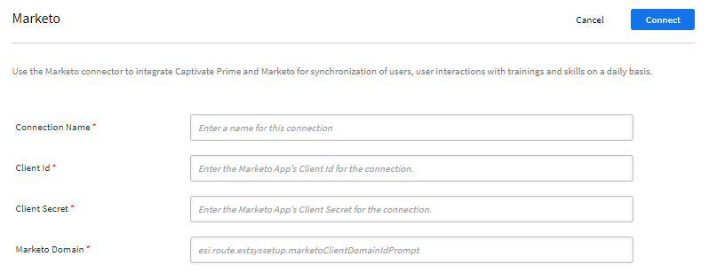

*輸入Marketo的認證*

>[!NOTE]
>
>您可以從Marketo Engage應用程式取得使用者端ID和密碼。 在Marketo應用程式上，您可以從取得使用者端ID和密碼， **啟動點** 區段，以及中的Marketo網域 **網站服務** 區段。

在 **統一報告** 在Learning Manager應用程式中Marketo Engage連線的區段，您可以根據下列專案建立行銷活動：

* 新使用者已新增至Learning Manager
* 新使用者已註冊課程
* 新使用者已完成課程
* 學習者已註冊一項技能
* 學習者已習得技能

如同任何其他聯結器，您可以視需要排程及匯出資料。

### Marketo Engage中的欄對應 {#columnmappinginmarketoengage}

Marketo中有兩種型別的資料庫：

* 潛在客戶資料庫
* 自訂物件資料庫

欄對應用於建立潛在客戶資料庫。 潛在客戶是您已從「使用者報表」匯出的使用者。

「使用者報表」中的欄位列在「學習管理員」Adobe欄下方。 Marketo提供的欄是Marketo底下的欄位。 使用這兩欄時，您可以將Learning Manager中的任何欄位對應至Marketo中的欄位。 從Learning Manager欄加入來自Marketo的相關欄。 加入欄之後，就會建立潛在客戶資料庫。

接著，您就可以在Marketo中檢視所有匯出的使用者。

在 **Marketo自訂物件** Marketo應用程式中的區段，您可以看到學習者成績單、使用者技能和使用者報告這三個報告全部存在。 這些報表具有字串 **&quot;cp_&quot;** 在每一個專案前面加上。 匯出至Marketo的每個新使用者都會被視為潛在客戶。

### 活動

將資料從Learning Manager事件匯出至Marketo Engage例項。 選取要依需求或依排程匯出至Marketo Engage資料庫的事件。

* 新增使用者
* 更新使用者中繼資料
* 更新使用者活動
* 訓練註冊
* 自助註冊
* 技能完成

<!--## BlueJeans Events {#bj-events}

BlueJeans Events connector connects Learning Manager and BlueJeans systems to automate data synchronization. Using this connector, you can:

* **Set up virtual sessions using BlueJeans Events:** Configure a new event in BlueJeans and setup a VC session in Learning Manager by selecting the appropriate BlueJeans event. Date and time details are picked automatically from the BlueJeans events.
* **Automated User Completion Syncing:** An Automated user completion syncing process allows the Learning Manager Administrator to fetch completion records for BlueJeans events automatically.

This new connector requires a separate set of credentials to configure the connector. The credentials of the existing BlueJeans Meetings connector will not work for BlueJeans Events connector.

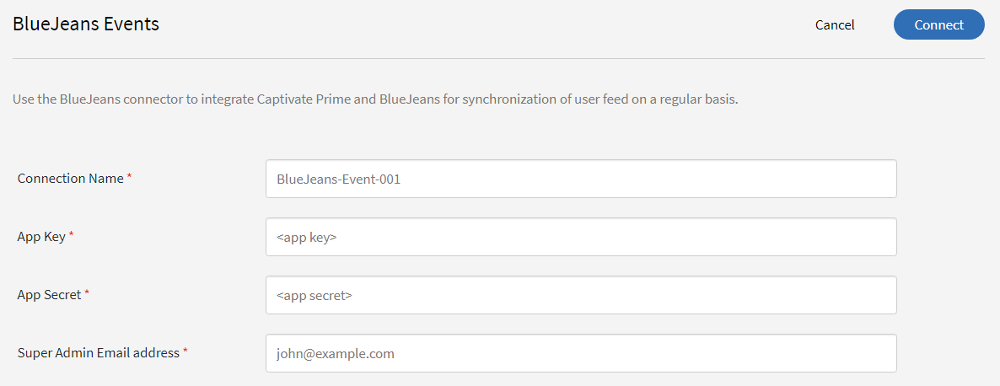 
*Credentials for BlueJeans Event Connector*

### Workflow {#workflow}

1. The BlueJeans Event moderator creates an event from within BlueJeans.
1. The author creates BlueJeans event course using the BlueJeans event url, which is created in future dates.
1. Since BlueJeans events have a similar title for multiple events, the author must append the event attendee url to the room name, so that he/she can choose the appropriate event.

   The format to enter event url: ***event name--event attendee url***

   For Dynamic rooms, the behavior is similar to that of Adobe Connect.

   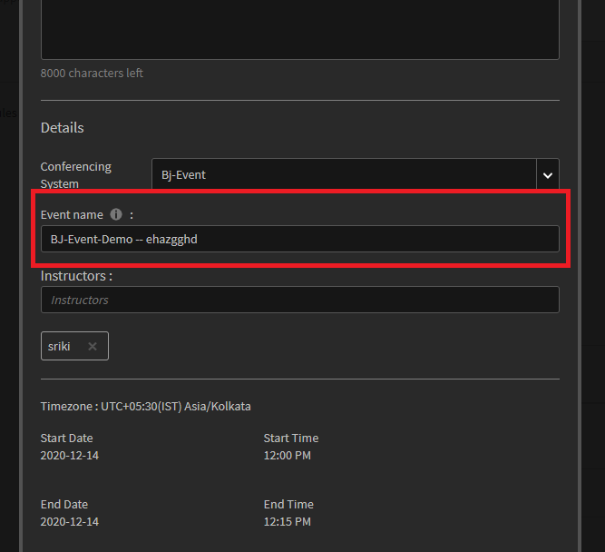
   *BlueJeans Events configuration*

1. Once the author enters the BlueJeans event url, the date and time will be auto populated.
1. Add an instructor to the event. The instructor will now have elevated privileges as a Presenter in a BlueJeans event.

Administrators, managers, and learners can enroll learners to the created course. Upon enrollment, the learner receives an email. The learner can sign in to their Learning Manager account to view the program details and take the course.

When the course is complete, the completion report gets triggered after a scheduled duration. The administrator can see the completion report to check the attendance and score of the learners.

If the BlueJeans Event moderator enables the recording during the session, after session ends, the recording is available in the learner app.

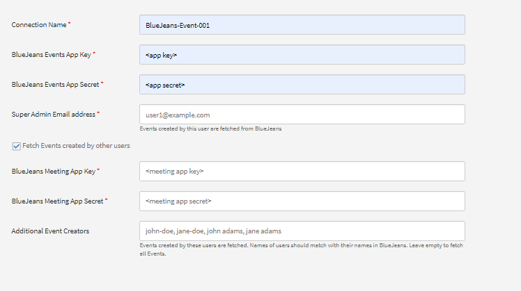
*BlueJeans Events configuration*

When you enable the check-box **Fetch Events created by the other users**, you can then add the list of BlueJeans event creators in the **Additional Event Creators** field. In the Author app, only events created by these users are searchable via the type-ahead field.

If the **Additional Event Creators** field is left blank, all events created in BlueJeans will be available for searching in the Author App.

The Author, in the Author app, then selects an event from the list of available events. In addition, the Author can add instructors to the event. These instructors in Learning Manager would become the presenters within BlueJeans events.

>[!NOTE]
>
>All users must belong to the same enterprise in BlueJeans Events App.

>[!NOTE]
>
>We've added a caching mechanism that improves the overall user experience. It is applicable when you select additional event creators. In this mode, the events are fetched the first time when an author searches for an event. The cache persists for 30 mins so that authors know how long they must wait to fetch the new events.-->

## Microsoft Teams聯結器

Microsoft® Teams®是永續性的聊天式共同作業平台，可支援檔案共用、線上會議和其他商務通訊功能。

Adobe Learning Manager使用虛擬教室聯結器，可用來將Microsoft Teams會議整合至Learning Manager。

Microsoft Teams聯結器會連線Learning Manager和Microsoft Teams系統，以啟用自動資料同步。 下列清單說明Microsoft Teams聯結器功能：

**使用Microsoft Teams設定虛擬工作階段**

此聯結器有助於將您的AdobeLearning Manager帳戶與Microsoft Teams帳戶整合。 整合後，聯結器可讓Learning Manager中的作者將Microsoft Teams作為在Learning Manager中建立的虛擬教室模組的技術服務提供者。

**允許Microsoft Teams在進入虛擬教室時驗證學習者**

會議召集人可以啟用大廳來限制會議進入，並控制Microsoft Teams提供的其他會議選項。

**使用自動使用者完成同步**

自動使用者完成同步程式可讓Learning Manager管理員自動擷取完成記錄並記錄Teams會議的URL。

如需詳細資訊，請參閱  [**在Adobe Learning Manager中安裝Microsoft Teams聯結器**](install-microsoft-teams-connector.md).

## 訓練資料存取

>[!IMPORTANT]
>
>此特定功能僅在Adobe Learning Manager以Adobe Experience Manager附加元件的形式銷售時才能使用。 課程資料將在24小時內過時。

>[!NOTE]
>
>區段會強調基礎架構的運作方式，但若是建置Headless或AEM型非登入體驗，請聯絡我們。 我們會為您提供使用案例的正確方法依據。 此功能目前不是自助式。

訓練資料存取聯結器可讓您的AEM Sites式自訂使用者介面擷取訓練資訊並將資訊呈現給學習者，並幫助輕鬆快速地搜尋。

聯結器會將訓練中繼資料匯出至資料儲存和擷取解決方案。 接著，您可以設定AEM Sites介面，使用這兩項服務來擷取訓練資料、轉譯網頁，並為學習者提供最佳化的訓練搜尋功能。

本文會重點說明基礎架構的運作方式，但若是建置Headless或AEM型非登入體驗，請聯絡我們。 我們會為您提供使用案例的正確方法依據。 此功能目前不是自助式。

啟用此聯結器以建置及轉譯您的AEM Sites式網頁，並將自訂體驗從AEM提供給您的學習者，其中課程資訊是使用公用API (Headless LMS)擷取。

### 設定聯結器

使用訓練資料存取聯結器將您的Adobe學習管理器帳戶與資料儲存和擷取服務以及搜尋啟用系統整合，讓您的AEM Sites式介面擷取訓練資料、轉譯網頁，並為學習者提供最佳化的訓練搜尋功能。

將訓練中繼資料從Adobe Learning Manager匯出至資料擷取和搜尋啟用服務。 您也可以建立排程來自動化這些匯出。

1. 輸入連線的名稱和有效的網域名稱。

   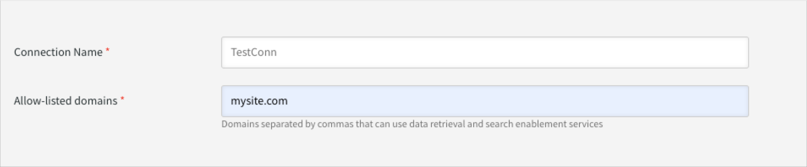

   *輸入連線和網域名稱*

1. 按一下 **[!UICONTROL Connect]**. 基底URL和擷取URL隨即產生。

   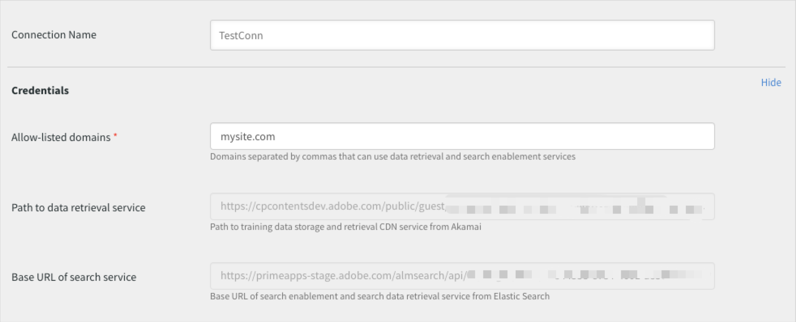

   *產生URL*

1. 啟用連線。

   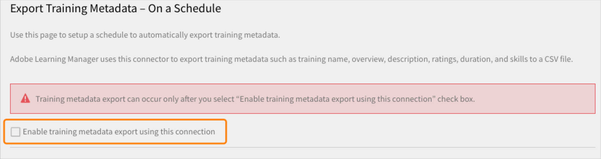

   *啟用連線*

1. 啟用連線後，所有課程、學習路徑和憑證的影像都會移轉至CDN。
1. 將課程、學習路徑和憑證的中繼資料匯出至搜尋和擷取服務。

### 在AEM中建立網站

**先決條件：** 從安裝AEM套件  [**GitHub存放庫**](https://github.com/adobe/adobe-learning-manager-reference-site/releases/tag/1.0.0).

1. 使用基礎和擷取URL、使用者端ID、使用者端密碼和管理員重新整理權杖，並在AEM中建立設定。
1. 使用AEM元件建立網站。
1. 發佈網站。

如需詳細資訊，請參閱此  [**檔案**](../../adobe-learning-manager-integration-aem.md).

### 學習者

發佈的網站會顯示所有已移轉的課程、憑證和學習路徑的清單，這些是從Search Service擷取給未登入的學習者。

當學習者按一下課程或憑證或學習路徑時，概觀頁面就會啟動。 在頁面上，學習者註冊時，必須先登入，然後才可參加課程。

## Adobe Commerce聯結器

>[!NOTE]
>
>此特定功能僅在Adobe Learning Manager以Adobe Experience Manager附加元件的形式銷售時才能使用。

>[!NOTE]
>
>試用帳戶也可以啟用此聯結器。

Adobe Learning Manager現在提供與Adobe Commerce的整合，這是一個為B2B和B2C客戶建立電子商務體驗的平台。

Adobe Commerce是可擴充的商務啟用解決方案，可讓您在單一平台上為B2B和B2C客戶建立多管道商務體驗。 使用Adobe Commerce聯結器將您的AdobeLearning Manager帳戶連線至Adobe Commerce，並在學習平台上實現電子商務功能。

啟用此聯結器並運用Adobe Commerce功能，以付費培訓的形式提供學習方案。 請注意，您需要先單獨購買Adobe Commerce，才能使用此聯結器將其與Adobe Learning Manager整合。

聯結器會透過將培訓資料傳送至商務平台來與Adobe Commerce整合，接著讓學習者可以進行付款和購買培訓。

除了啟動購買作業，聯結器也會從Adobe Commerce收集購買詳細資訊，Adobe Learning Manager會使用該資訊來驗證購買動作並解鎖訓練存取權。

**先決條件**

1. 啟用  [RabbitMq](https://devdocs.magento.com/cloud/project/services-rabbit.html) 或任何其他傳訊代理人。
1. 啟用  [CRON](https://devdocs.magento.com/cloud/env/variables-deploy.html#cron_consumers_runner).
1. 對於步驟1和2，編輯以下檔案：

   1. .magento.app.yaml
   1. .magento/services.yaml
   1. .magento.env.yaml

1. 透過自訂模組覆寫選項限制。 此為選用步驟，但強烈建議用於大型資料集。
1. 啟用頁面上的所有非同步API。 由於可能會有大量資料，匯出會以非同步方式進行。 來自Adobe Commerce的API稱為，用於傳送要求裝載。 此請求會將訊息推送到佇列，而且此佇列有一個消費者，它會處理這些訊息並在商業端建立產品。 Adobe Commerce預設不提供此非同步處理。 因此您必須啟用此選項。
1. 新增連結，以返回付款成功頁面上的ALM。 必須在Adobe Commerce中設定此傳回URL。 用於連結的URL。-  `https://learningmanager.adobe.com/app/learner#/postPayment`
1. 將索引從「儲存時」變更為「已排程」。  如需詳細資訊，請參閱此  [KB](https://support.magento.com/hc/en-us/articles/360040227191).
1. 套用下列修補程式。 如需詳細資訊，請參閱  [套用修補程式](https://devdocs.magento.com/cloud/project/project-patch.html).
1. 設定Fastly。  雲端基礎結構上的Adobe Commerce需要Fastly，並用於中繼和生產環境。 如需詳細資訊，請參閱 [設定Fastly](https://devdocs.magento.com/cloud/cdn/configure-fastly.html).

### 設定聯結器

作為整合管理員，在Adobe Commerce聯結器中，按一下 **[!UICONTROL Connect]**.

在設定頁面上，輸入下列詳細資訊。 這些詳細資訊（授權金鑰）可在Adobe Commerce中使用。 在Adobe Commerce中建立整合後，即可使用該憑證。

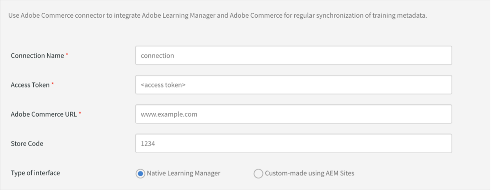
*設定Adobe Commerce聯結器*

啟用Adobe Commerce聯結器連線後，作者就可以設定課程、學習路徑或憑證的價格。

發佈課程、學習路徑或憑證後，學習者就可以在學習者應用程式中購買課程。

* **原生Learning Manager：** 學習者可以在Learning Manager內購買課程、學習計畫或憑證。 這僅適用於作者已新增價格的情況。
* **使用AEM網站自訂製作：** 學習者可以從AEM網站購買課程。

### 工作流程

Adobe Commerce管理員會將Learning Manager設定為整合。

作者會將課程、學習路徑或憑證標示為進階並指定價格。 只有在帳戶已啟用電子商務時，才會出現此選項。 如需詳細資訊，請參閱 [建立課程](../../authors/feature-summary/courses.md).

在Adobe Commerce中同步資料之前，無法購買課程或學習路徑。

### 將課程匯出至Adobe Commerce

作者設定好各種課程、學習路徑或認證的價格後，您身為整合管理員，會將課程、學習路徑或認證匯出至Adobe Commerce。

>[!NOTE]
>
>在2024年3月發行的Adobe Learning Manager中，我們引進了對 [Adobe Commerce 2.4.6](https://experienceleague.adobe.com/docs/commerce-operations/release/notes/adobe-commerce/2-4-6.html?lang=en).

1. 按一下 **[!UICONTROL Export Training Metadata]** > **[!UICONTROL On Demand]**.

1. 選取日期。

1. 按一下 **[!UICONTROL Execute]**. 成功執行後，所有定價的課程或學習路徑將移至Adobe Commerce。 然後，學習者便可以向Learning Manager購買課程。

### 使用Adobe Commerce的原生學習管理員

#### 學習者

身為學習者，您必須登入才能購買課程、憑證或學習路徑。

若要購買課程，請按一下「立即購買」。 系統會將您重新導向至Adobe Commerce以完成購買。 付款成功後，您會看到一則訊息，提示您返回Learning Manager並開始課程。 您也必須個別登入Adobe Commerce才能完成購買。

從ALM Native或AEM購買課程、憑證或學習路徑時，您會收到ALM和Adobe Commerce的電子郵件。

此外，您也可以啟用/停用來自Adobe Commerce的電子郵件。

### 具有Adobe Commerce的AEM網站

啟用「使用AEM網站自訂」選項後，學習者可以從自訂AEM網站購買課程。

AEM網站將擁有Learning Manager的所有中繼資料，可透過Adobe Commerce啟用搜尋。 在非登入情況下從Adobe Commerce擷取課程。

登入和非登入體驗皆為可能。 未登入的使用者可以搜尋及瀏覽課程目錄、學習方案和憑證。 不過，如果您想要購買課程，則必須登入AEM網站。

如同原生學習管理員，登入後，您可以將課程新增至購物車，接著預覽或購買課程。

### 設定Adobe Commerce聯結器

#### 先決條件

管理員會啟用核取方塊， **啟用訓練的定價**，在 **設定>一般** 在管理員應用程式中。 如果已啟用此選項，則作者可以指定培訓價格。 當您新增Adobe Commerce連線時，此核取方塊會自動選取並強制執行。

Adobe Learning Manager支援電子商務買賣訓練。 在此，使用者可以銷售培訓以促銷其產品的向上銷售和交叉銷售。

透過Adobe Commerce整合，Adobe Learning Manager可支援培訓專案的購買和銷售，以便在客戶合作夥伴教育案例中提供更完整的客戶體驗。

這項整合的主要目標如下：

* 使用者可以透過在AdobeLearning Manager或Headless學習介面中銷售課程來產生收入。
* 啟用Adobe Commerce與平台的整合，以使用Learning Manager的原生應用程式和AEM銷售課程。
* 允許Learning Manager的客戶以付費課程的形式提供正式學習。
* 讓學習者在決定購買培訓之前預覽課程。

#### AdobeLearning Manager原生

**整合管理員**

1. 在整合管理員頁面上，新增Adobe Commerce聯結器。 從在Adobe Commerce中建立的應用程式取得驗證。
1. Adobe Commerce啟用後，AdobeLearning Manager就會啟用電子商務。 從Learning Manager到Adobe Commerce的資料會根據排程進行同步。 資料包含所有培訓（付費）以及中繼資料（使用者、技能、作者姓名、價格等）。

>[!NOTE]
>
>Adobe Learning Manager和Adobe Commerce有不同的登入。

### AEM

在此模式中，學習者會從AEM型網站參加課程，該網站是使用AEM型範本和元件建立的。

在AEM網站上，學習者支援購物車、新增至購物車按鈕、從購物車刪除課程等。

如果使用者未登入，他們仍可搜尋課程目錄和檢視課程詳細資料，但無法購買課程。 如果您想要購買課程，身為學習者必須登入。

學習者購買課程後，系統會將他們重新導向至已註冊狀態的課程概觀頁面，以便參加購買的培訓。

#### Headless — 未登入

學習者可以：

* 從搜尋列搜尋任何訓練。
* 依價格範圍篩選任何訓練。

學習者無法：

* 從總覽頁面購買課程。
* 預覽付費內容。

#### Headless — 登入

學習者可以：

* 探索、檢視、搜尋和篩選付費或免費的培訓課程。

* 新增課程至購物車，然後結帳購買。
* 新增、更新或刪除購物車中的培訓課程。
* 同時支付多個訓練課程費用。
* 在播放器中預覽付費課程。
* 若發生付款錯誤，請參閱訊息。

* 購買課程後，在電子郵件中檢視發票作為附件。

#### 隨選同步

Learning Manager和Adobe Commerce之間的同步每天進行兩次。 管理員為電子商務啟用帳戶後， **使用此連線啟用訓練中繼資料匯出** 選項啟用時，會將課程、學習路徑和憑證的影像儲存在公用CDN中。

如果資料保持未同步化，則不會為學習者顯示定價資訊。

針對原生Learning Manager，如果已啟用電子商務並完成Learning Manager與Adobe Commerce之間的同步，則學習者可以檢視或搜尋免費或付費培訓。

AEM不提供「立即購買」，只提供 **加入購物車** 按鈕。 如果未執行同步，此按鈕也會維持停用狀態。

#### 常見問題

+++哪些課程無法購買？

學習者不可購買循環認證、內容市場培訓、從聯結器獲得的培訓、工作輔助以及經理核准/提名的課程等課程。
+++

+++學習者成績單及培訓報表是否有任何變更？

這些報表會顯示帳戶中所有已購買培訓的價格和購買日期。
+++

+++學習者可以註冊免費培訓嗎？

是，學習者可註冊免費培訓。 免費培訓會顯示「培訓概覽」頁面上的「預覽和註冊」按鈕。
+++
