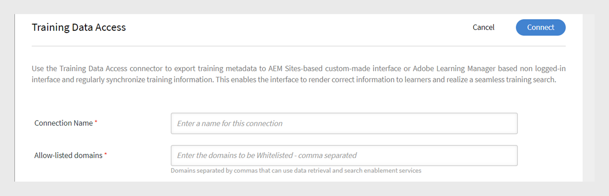
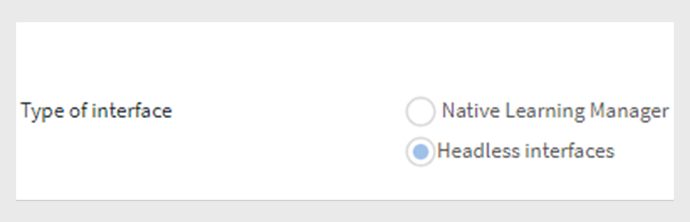

# 學習管理員連接器

企業還有其他應用程式和系統必須與學習管理器集成。 連接器是在執行基於數據的整合（例如將數據從外部系統導入學習管理器）時說明的實用程式。  它還從學習管理員將數據匯出到外部系統。

Learning Manager 提供 Salesforce 和 FTP 連接器。 使用 Salesforce 連接器，整合 組織的管理員可以將其 Salesforce 應用程式 與 Learning Manager 集成。 作為集成商，您還可以使用 FTP 連接器將一組用戶自動導入到企業應用程式中。

Learning Manager 還提供 Lynda、getAbstract 和 Harvard Management System 連接器。 這些連接器使學習者能夠訪問和使用來自 Lynda.com、getAbstract 和 Harvard ManageMentor 的課程。

請繼續閱讀，瞭解如何在學習管理器中配置和使用這些連接器。

<!--
>[!NOTE]
>
>**Update:** December 2020 update of Learning Manager
>
>For **FTP**, **Box**, and **Custom FTP** connectors, while exporting Learner Transcript or xAPI, you can also export the data as a **zip** file, for:
>
>* Learner Transcripts
>* xAPI
-->

>[!NOTE]
>
>在 2022 年 11 月發布的 Adobe Systems 學習管理器中，縮放 在 2023](https://marketplace.zoom.us/docs/guides/auth/jwt/) 年 6 月之前棄[用了 JWT 身份驗證。因此，帶有 JWT 的 縮放 連接器將繼續工作，直到上述日期，但我們建議使用者創建伺服器到伺服器 OAuth 應用以替換其帳戶中的功能。 默認情況下，任何新連接都將具有縮放 OAuth 身份驗證。

## Salesforce 連接器 {#sfconnector}

Salesforce 連接器連接 Learning Manager 和 Salesforce 帳戶，實現數據同步自動化。 Salesforce 連接器功能如下：

### 映射屬性

集成管理員可以選擇 Salesforce 列，並將其映射到相應學習管理器的可群組屬性。 對應完成後，後續的 用戶 匯入也會使用相同的對應。 如果管理員希望為導入使用者使用不同的映射，則可以重新配置它。

### 自動匯入用戶

用戶導入過程允許學習管理員管理員從 Salesforce 獲取員工詳細資訊，並將其自動導入學習管理員。 這種自動化避免了創建CSV和上傳到學習管理器所涉及的手動工作。

### 自動計劃

使用自動計劃功能以及自動用戶導入功能可能很有效。 學習管理員管理員可以根據組織的需要設置計劃。 學習管理器中的使用者可以根據計劃應用程式獲得最新信息。 可以每天在學習管理器應用程式中執行同步。

### 篩選使用者

學習管理員管理員可以在導入使用者之前對使用者應用篩選。 例如，學習管理員管理員可以選擇在一個或多個特定管理器下導入階層中的所有使用者。

### 設定 Salesforce 連接器 {#configuresalesforceconnector}

若要整合 Salesforce 與學習管理器，請瞭解相關過程

#### 必要條件 {#prerequisites}

確保隨身攜帶 Salesforce 組織URL。 例如，如果您的組織名稱為 **myorg**，則 Salesforce URL可以是 `https://myorg.salesforce.com`。 它是將 Salesforce 帳戶 與學習管理器連接起來所需的唯一輸入。

此外，請確保您具有登錄 帳戶 的適當憑據。

#### 建立連接 {#createaconnection}

1. 在學習管理器首頁中，將滑鼠懸停在 Salesforce 卡片/縮略圖上。 將出現一個功能表。 按兩下 **[!UICONTROL Connect]** 選單中的專案。

   

   *連接選項*

1. 此時會出現一個對話框，提示您輸入組織網址。 提供URL后按兩下 **[!UICONTROL Connect]** 。
1. 成功連線后，將顯示概述頁面。

### 映射屬性 {#mapattributes}

成功建立連接后，您可以將 Salesforce 列映射到學習管理員的相應屬性。 此步驟是必需的。

1. 在映射頁面中，左側可以看到學習管理器的列，右側可以看到 Salesforce 列。 選擇映射到學習管理器列名稱的相應列名稱。

   
   *映射屬性*

   >[!NOTE]
   >
   >顯示在左側的學習管理器列數據是從活動欄位中獲取的。 **經理**&#x200B;欄位必須映射到電子郵件地址類型的欄位。必須先映射所有列，然後才能使用連接器。

1. 完成映射后按一下 **[!UICONTROL Save]** 。
1. 連接器現在已準備就緒，可供使用。 已配置並在管理員應用程式中显示為資料來源的帳戶。 管理員可以排程匯入或按需同步。

## 使用 Salesforce 連接器 {#usingsalesforceconnector}

Salesforce 連接器連接到 Salesforce.com 以按配置獲取使用者並將其添加到學習管理器。

### 從 Salesforce 聯絡人匯入使用者 {#import-salesforce-contacts}

學習管理器增強了 Salesforce 連接器，可獲取聯繫人和 Salesforce 使用者，並自動將其導入學習管理器。

在 Salesforce 連接器頁面上，輸入 Salesforce url 並完成驗證。 進行身份驗證后，您可以繼續導入使用者或聯繫人。 如果選擇選項聯繫人，則指定要導入的聯繫人子集。

選擇 Salesforce 列並將其映射到相應學習管理器的可群組屬性。 對應完成後，後續的 用戶 匯入也會使用相同的對應。

1. 登入至 Salesforce。
1. 在連接頁面上，按兩下 **[!UICONTROL Import Internal Users]**。

   
   *匯入內部使用者*

1. 在“ **匯入使用者** ”頁面上，有一個新選項“聯繫人”。 按兩下收音機按鈕 **聯繫人** ，您將看到以下選項。

   
   *映射聯繫人屬性*

1. 如果按下 **[!UICONTROL Yes]**，則可以執行以下操作：

   * **選擇「聯繫人」列：** 選擇要導入到學習管理器的欄位。
   * **指定值：** 選取代表所選欄位的值。

   
   *指定值*

   * 將 Salesforce 列與學習管理器的列對應。
   * 要開始匯入，請按兩下 **[!UICONTROL Save]**。

1. 如果按兩下 **[!UICONTROL No. Import all Contacts]**，則無需篩選聯繫人即可直接映射欄位。 在這裡，您將從Salesforce導入所有聯繫人。
1. 要開始匯入，請按兩下 **[!UICONTROL Save]**。

## 匯出學習記錄

學習管理器提供了將學習記錄按讚成績單、用戶報告、技能報告導出到 Salesforce 的功能。 您可以確定匯出的數據是應連結到 Salesforce 中的「使用者」表還是「聯繫人」 表。

*匯出學習記錄*

### Salesforce 中的自定義物件

從學習管理器匯出學習記錄之前，您必須在 Salesforce 中創建自定義物件。 自定義對像是創建的物件，用於商店特定於公司或行業的資訊。 有關詳細資訊，請參閱 [Salesforce 自定義物件](https://trailhead.salesforce.com/en/content/learn/modules/data_modeling/objects_intro)。

以下是建立物件的方法：

1. 下載並安裝包以創建自定義物件。

   * [套餐 1](https://test.salesforce.com/packaging/installPackage.apexp?p0=04t1k0000008WPJ)
   * [套餐 2](https://test.salesforce.com/packaging/installPackage.apexp?p0=04t1k0000008WPT)
   * [套餐 3](https://test.salesforce.com/packaging/installPackage.apexp?p0=04t1k0000008WPi)

1. 重新命名 Salesforce 中自定義物件的名稱。
1. 選取事件並按下 **[!UICONTROL Save]**。

>[!NOTE]
>
>請確保已授予系統管理員對套件安裝後添加的所有活動欄位的訪問許可權。

**將事件與：** 選擇要匯出的部分 - 用戶或聯繫人。 如果您選擇聯繫人物件，則將在 Salesforce 中創建存在於學習管理器中但不存在於 Salesforce 中的使用者。

*連結事件選項*

>[!NOTE]
>
>您可以在一個帳戶中創建多個連接。 一個連接最多可為 Salesforce 中的三個自定義物件提供服務。 如果要為同一 Salesforce 帳戶建立多個連接，則必須安裝這三個套裝。 我們最多提供三個軟體包的支援。
>
>要創建多少個連接，就必須安裝盡可能多的包。

>[!NOTE]
>
>在「Salesforce 的執行狀態 頁面」上，僅可從 Salesforce 檢查已處理的記錄數。 當已處理的所有記錄出現部分匯出或失敗時，學習管理器平均將狀態顯示為已完成。

## 安裝 Salesforce 套裝

Learning Manager 提供 Salesforce 應用程式 套裝。 在 SFDC 中安裝和配置后，銷售員工可以在 SFDC 門戶中執行其培訓活動。 此應用程式允許 SFDC 使用者探索新的培訓、視圖建議並直接在 SFDC 門戶中使用它們。 使用者還可以在 SFDC 門戶內的應用程式內以刊頭的形式接收管理員發送的通知。

### 在學習管理器應用中設置

1. 以集成管理員身份登錄學習管理器管理員帳戶。
1. 點選 **[!UICONTROL Applications]** > **[!UICONTROL Featured Apps]**。
1. 按兩下 **[!UICONTROL Salesforce]**。
1. 在 Salesforce 應用程式頁面上，記下說明中提到的應用程式 ID（也稱為用戶端 ID）和客戶端密碼。
1. 按兩下， **[!UICONTROL Approve]** 您的應用必須成功獲得批准。
1. 點選 **[!UICONTROL Developer Resources]** > **[!UICONTROL Access Tokens for Testing and Development]**。
1. 在“獲取 OAuth Code”部分中，用戶端 ID 和範圍必須設置為 - admin：read，admin：write。 按兩下 **[!UICONTROL Submit]**。
1. 在「獲取重新整理令牌」中，輸入「用戶端 ID」 和「用戶端密碼」。 按兩下 **[!UICONTROL Submit]** 並注意刷新令牌。

### 在 Salesforce 應用程式中建立 帳戶

1. 建立 Salesforce 註冊頁面上的帳戶。 您必須建立開發人員版或企業版的 Salesforce 帳戶。  [開發者註冊URL](https://developer.salesforce.com/signup)。 確保必須使用電子郵件 ID 註冊用於學習管理器的 Salesforce。
1. 通過驗證電子郵件驗證您的帳戶。
1. 建立密碼並登入 Salesforce。
1. 記下 登入 后的 Salesforce url（例如 site.lightning.force.com）

### 安裝學習管理員包

如果要安裝套裝，必須先在 Salesforce 中刪除現有套裝。 在卸載之前，您必須啟用設置，如下所示。 必須應用這些設置，否則將無法安裝包。

>[!NOTE]
>
>Adobe Systems Learning Manager 應用程式僅在 Salesforce Lightning 視圖 中受支持。

1. [Launch學習管理器包 URL](https://login.salesforce.com/packaging/installPackage.apexp?p0=04t1k0000008WOQ)。
1. 在 **「登入」** 頁面中，按兩下 **[!UICONTROL Use Custom Domain]**。
1. 輸入封裝URL然後按下 **[!UICONTROL Continue]**。 安裝頁面必須選中「僅供管理員安裝」選項。 請勿變更此選項。
1. 按兩下 **[!UICONTROL Install]**。 安裝套件後，按兩下 **[!UICONTROL Done]**。 系統將引導您進入“已安裝的包”頁面，並可以看到Adobe Systems學習管理器已安裝的包。
1. 轉到應用程式啟動器（設置旁邊）並搜尋學習管理器Adobe Systems。
1. 要設定應用程式，請按下 **[!UICONTROL Configure]**。
1. 按下 **[!UICONTROL New]** 並新增以下詳細資訊：

   * **配置：** 輸入您選擇的名稱。
   * **用戶端 ID**：輸入從第一部分獲取的值。
   * **用戶端機密：** 輸入從第一部分獲取的值。
   * **刷新令牌：** 輸入從第一部分獲取的值。
   * **學習管理器基本 URL：** 託管學習管理員的網站的URL。

### 添加遠端網站設定

1. 在頁面的右上角，按兩下 **[!UICONTROL Setup]**。
1. 在 中 **[!UICONTROL Quick Find]**，搜尋用于遠端網站設定。
1. 按兩下 **[!UICONTROL New Remote Site]**。
1. 輸入詳細資訊：

   * **遠端網站名稱：** 輸入您選擇的名稱。
   * **遠端網站URL：** 託管學習管理器的網站URL。

1. Launch學習管理員。

### 為學習管理員應用啟用通知

1. 在右上角 **[!UICONTROL Setup]**&#x200B;按鍵 。
1. Search自定義通知。
1. 按兩下 **[!UICONTROL New]**。
1. 輸入以下詳細資訊：

   1. **自定義通知名稱：** LearningManagerNotification
   1. **API 名稱：** LearningManagerNotification

1. 選擇桌面&#x200B;**和**&#x200B;行動裝置&#x200B;**作為**&#x200B;支援的頻道。

1. 按兩下 **[!UICONTROL Save]**。
1. 要啟用行動裝置的推送通知，追隨以下步驟：

   1. 在行動電話中安裝 Salesforce 行動應用程式。
   1. 使用您的憑據登錄到應用程式。
   1. 轉至 **設定** 通知> **傳送設定**。
   1. 新增適用於 iOS 和 Android 的 Salesforce。

### 從 Salesforce 中卸載學習管理器

1. 在 Salesforce 應用程式中，轉到已安裝的套件。
1. 按兩下 **[!UICONTROL Uninstall]**。

## 為 Salesforce 使用者設定學習管理員

學習管理器應用程式也可供任何 Salesforce 帳戶中的使用者使用。 Salesforce 管理員可以根據使用者檔案新增使用者。 Salesforce 設定檔與學習管理器中的配置檔類似。 例如，管理員、整合管理員、講師等。 Salesforce 管理員還可以創建自定義設定檔。

作為 Salesforce 管理員，您可以將設定檔分配給使用者或創建自定義設定檔。

安裝套裝時，您可以將 Salesforce 設定檔指派給學習者。

安裝包后，必須配置設定檔。

按兩下 **[!UICONTROL Configure]** > **[!UICONTROL New]**「然後添加以下內容：

* 設定名稱
* ClientID
* ClientSecret
* LearningManagerBaseURL
* 停用重新導向

>[!NOTE]
>
>要讓學習者視圖學習管理器應用程式，您必須為所有學習者啟用該應用程式。

下一步是提供訪問學習管理器應用權限。

*設置訪問學習管理員應用的許可權*

選擇用戶並相應地分配許可權。 學習者現在可以訪問學習管理器應用程式。

現在，選擇一個設定檔，例如用戶的標準配置文件，然後按下設定檔。 按兩下 **[!UICONTROL Edit]** 並在自定義 **應用程式 設定** 部分中，啟用 **Adobe Systems學習管理器**&#x200B;複選框。 這使得用戶可以訪問該應用程式。

在“**自定義選項卡設定**”部分的“學習者主頁&#x200B;**”**&#x200B;下拉清單中，選擇選項&#x200B;**“默認打開**”。

您必須讓應用程式對所有設定檔可見。

按兩下， **[!UICONTROL Save]** 屬於所有設定檔的學習者將訪問學習管理器應用程式。

### 學習路徑相關變更

#### 現有連接

如果在管理員帳戶中禁用了“學習路徑”選項，則不會在報表中添加任何行和列。

如果在「管理路徑」中啟用了「學習路徑」選項帳戶，則“類型”列將使用“學習路徑”填充，以防學習者註冊。

>[!NOTE]
>
>如果啟用了標幟並且您使用現有連接，則可能會丟失一些記錄。

#### 新連接

如果在“管理員”帳戶中禁用了“學習路徑”選項，則培訓報表將包含以下列，但不包含任何數據。

* **嵌入路徑：** 顯示學習計劃的名稱
* **嵌入式路徑 ID：** 顯示學習計劃的 ID。
* **嵌入式課程ID：** 顯示學習路徑內課程的ID。

此外，對於啟用了學習路徑的帳戶中的新連接，將顯示三個新列，並且所有數據都將流動。

此外，該報告將包含已註冊學習路徑的所有學習者的“學習路徑（更高級別）”列類型。

在“類型”列中，“學習計劃”將重命名為“學習路徑”。 對於現有連接，不會有任何變化。

## 學習管理員 FTP 連接器 {#ftpconnector}

使用 FTP 連接器，您可以將學習管理員與任意外部系統集成，以自動進行數據同步。 預計外部系統可以匯出CSV格式中的數據，並將其放置在學習管理器 FTP 帳戶的相應資料夾中。 FTP 連接器功能如下：

還可以使用 Box 連接器進行資料遷移、用戶導入和數據匯出。 有關詳細資訊，請參閱 Box 連接器。

### 數據匯入 {#dataimport}

用戶導入過程允許學習管理員管理員從學習管理員 FTP 服務獲取員工詳細資訊，並將其自動導入學習管理器。 使用此功能，您可以通過將這些系統生成的CSV放在 FTP 帳戶的相應資料夾中來整合多個系統。 學習管理器選取CSV檔，合併它們，然後根據計劃導入數據。 更多資訊，請參閱排程功能。

**映射屬性**

集成管理員可以選擇CSV列，並將其映射到學習管理器的可群組屬性。 此映射只需一次工作。 映射完成後，後續用戶導入中將使用相同的映射。 如果管理員希望對導入使用者使用不同的映射，則可以重新配置映射。

#### 匯出數據 {#exportdata}

數據匯出允許使用者將使用者技能和學習者成績單導出到 FTP 位置，以整合任何協力廠商系統。

#### 調度 {#scheduling}

管理員可以根據組織的要求設置計劃任務，學習管理器中的使用者應用程式根據計劃是最新的。 同樣，集成管理員可以及時安排技能導出，以便與外部系統集成。 可以每天在學習管理器應用程式中執行同步。

### 配置學習管理員 FTP 連接器 {#configurecaptivateprimeftpconnector}

若要將 FTP 連接器與學習管理器集成，請瞭解該過程。

#### 建立連接 {#Createaconnection-1}

1. 在學習管理器首頁中，將滑鼠懸停在 FTP 卡片/縮略圖上。 將出現一個功能表。 按兩下 **[!UICONTROL Connect]** 選單中的專案。

   

   *連接選項*

1. 將出現一個對話框，提示您輸入電子郵件ID。 提供負責管理組織的學習管理器 FTP 帳戶的人員的電子郵件 ID。 提供電子郵件ID後按兩下 **[!UICONTROL Connect]** 。
1. 學習管理員會向您發送一封電子郵件，提示您用戶在首次訪問 FTP 之前重置密碼。 用戶必須重置密碼並使用它來訪問學習管理器 FTP 帳戶。

   >[!NOTE]
   >
   >只能為給定的學習管理器帳戶創建一個學習管理器 FTP 帳戶。

   在概述頁面中，您可以指定集成的“連接名稱”。 從下列選項選擇您要執行的操作：

   * 匯入內部使用者
   * 匯入 xAPI
   * 匯出使用者技能 - 配置計劃
   * 匯出使用者技能 - 按需
   * 匯出學習者成績單 - 配置時程表
   * 匯出學習者成績單 - 按需

   
   *匯出選項*

### 進口

++內部使用者

導入内部用戶選項允許您將用戶從 csv 導入學習管理器隨選或計劃。

+++

+++對應屬性

成功建立連接后，可以映射CSV文件的列。 它放置在學習管理員的相應屬性的 FTP 資料夾中。 此步驟是必需的。

1. 在「映射屬性」頁面左側，可以看到學習管理器的預期列，右側可以看到CSV列名稱。 一開始，您可以在右側看到一個空的選擇框。 按兩下選擇 **匯入檔案即可任何範本 CSV**。
1. 上述步驟使用所有CSV列名稱填充右側選擇下拉清單。 選擇映射到學習管理器列名稱的相應列名稱。

   >[!NOTE]
   >
   >「經理」欄位必須對應至電子郵件地址類型的欄位。 必須先映射所有列，然後才能使用連接器。

1. 完成映射后按一下 **[!UICONTROL Save]** 。

   連接器現在已準備就緒，可供使用。 配置帳戶在管理員應用程式中显示為資料來源，供管理員安排導入或按需同步。

+++

+++使用學習管理器 FTP 連接器

1. 來自外部系統的CSV檔案必須放置在以下路徑中：

   `code $OPERATION$/$OBJECT_TYPE$/$SUB_OBJECT_TYPE$/data.csv`

   >[!NOTE]
   >
   >在2016年7月發行版中，只允許匯入使用者。 因此，若要使用 FTP 連接器，請確保將CSV檔放置在以下資料夾中：

   `code Home/import/user/internal/*.csv`

1. FTP 連接器從CSV檔中獲取所有行。 重要的是，與一個CSV中的用戶對應的行不會出現在任何其他 CSV 中。
1. 所有 CSV 都必須包含對應中指定的列。
1. 在該過程開始之前，資料夾中必須存在所有必需的 CSV。

>[!NOTE]
>
>將使用者導入學習管理員時，管理員還必須知道如何在學習管理器中管理使用者。 請参閱 [User Management 說明](migration-manual.md#usermanagement) 以了解更多信息。

+++

+++匯入 xAPI

導入 xAPI 選項允許您計劃將 xAPI 語句從第三方服務導入學習管理器隨選。

+++

+++需要匯入 xAPI 的設定

1. 從配置頁面中選擇配置清單中可用的現有配置，以從CSV導入 xAPI 語句。 按下编辑或 **添加新的配置** 連結以導航到“配置匯入-源”頁面。

   **配置**

   * 在“配置匯入-源”頁面中，填寫兩個字段，即“名稱”和“來源 檔案名稱”。 源檔名應與 FTP 資料夾位置中提供的檔名相匹配。
   * 按兩下 **[!UICONTROL Save]** 以儲存變更。

   
   *配置*

   **濾波器**

   * 在左窗格中按下 **[!UICONTROL Filter]**。
   * 在“配置匯入-篩選 頁面”中，填寫“名稱”和“條件”字段以篩選出記錄。 按兩下 **[!UICONTROL Add new Filter]** 以新增另一個篩選。 您可以按下&#x200B;**儲存操作」欄下的刪除******&#x200B;選項，儲存或刪除篩選。

   
   *濾波器*

   **映射**

   * 在左窗格中按下 **[!UICONTROL Mapping]**。
   * 在 匯入 xAPI 語句-配置映射頁面的左側，您可以看到需要與CSV列名稱映射的 xAPI JSON 字段路徑名。
   * 默認情況下，需要使用CSV列名稱映射的三個 JSON 路徑欄位名稱為 **actor.mbox**、 **verb.id** 和 **object.id**。 您可以通過按下新增 **映射**&#x200B;將其他欄位添加到映射中。

   * 選擇要使用 Json 欄位路徑名稱映射的欄名稱的類型（無論是字串、數位、布爾值還是日期類型）。
   * 完成對應后，按兩下「儲存」。 現在可以依計劃或按需匯入 xAPI 匯入。

   
   *映射*

1. 在左窗格中按下 **[!UICONTROL Configure Schedule]**。 按兩下 **[!UICONTROL Enable Schedule]** 以安排 xAPI 語句的導入。

   您可以輸入開始時間和日期，然後輸入 xAPI 導入计划頻率（以天為單位）。 例如，每3天啟用一次 xAPI 導入。

   
   *匯入 xAPI 語句 - 設定排程*

1. 在左窗格中按下 **[!UICONTROL On Demand Execution]**。

   
   *匯入 xAPI 語句 - 隨選*

1. 在左窗格中，按時間 **[!UICONTROL Execution Status]** 順序視圖此連接器的所有運行的摘要。 您可以視圖導入 xAPI 所花費時間的開始日期和持續時間、導入類型（是隨選還是計劃導入）和導入狀態（xAPI 導入是正在進行中還是已完成或失敗）。

   
   *匯入 xAPI 語句 - 執行狀態*

+++

### 匯出

+++技能

有兩個選項可用於匯出使用者技能報告。

**[!UICONTROL User Skills - On Demand]**：您可指定開始日期，然後使用該選項匯出報表。 該報表從輸入日期提取至今。

*按需匯出選項*

**[!UICONTROL User Skills - Configure]**..此選項可讓您排程報表的摘取。 選中“啟用計劃”複選框並指定開始日期和時間。 您也可以指定產生和傳送報表的時間間隔。

*配置報表導出*

+++

若要打開放置導出文件的“導出”資料夾，請打開“使用者技能”頁面中提供的連結到 FTP 檔案夾，如下所示。

*FTP 資料夾以視圖檔案*

自動導出的檔存在於 **位置主頁/匯出/&#42;FTP_location&#42;**

自動導出的文件的標題&#x200B;**為skill_achievements_從&#x200B;&#42;_截止日期_&#42;&#42;.csv&#42;**

*導出的.csv檔*

+++學習者成績單

**配置**：此選項允許您計劃報表的摘取。 選中“啟用計劃”複選框並指定開始日期和時間。 您也可以指定產生和傳送報表的時間間隔。

+++

要打開導出文件放置在 FTP 位置的導出資料夾，請打開學習者成績單頁面中提供的 FTP 檔案夾連結，如下所示

自動導出的檔存在於 **位置主頁/匯出/&#42;FTP_location&#42;**

自動導出的文件的標題&#x200B;**為learner_transcript_截止日期.csv&#42;&#42;__&#42;&#42;**

### 支援手動 csv 欄位 {#supportformanualcsvfields}

在通過FTP導入用戶數據時，管理員必須將系統中存在的所有活動欄位映射到csv中的相應欄位。

這是所有 csv 活動欄位的必要專案。 對於手動活動欄位，集成管理員可以選擇選項 **DontImportFromSource**。

通過選擇此選項，手動活動字段值不會使用 csv 導入填充。 學習者提供的值保持不變。

>[!NOTE]
>
>映射時，如果為 csv 活動欄位選擇了選項 **DontImportFromSource** ，則將從系統中刪除此字段。

*用於使用中欄位的 FTP 連接器*

## 林達連接器 {#lyndaconnector}

Lynda 連接器由 Lynda.com 的企業客戶使用，他們將按讚學習者從學習管理器中發現和使用 Lynda 課程。 連接器可以配置為使用 API 金鑰定期從 Lynda.com 獲取課程。 在學習管理器中創建課程后，用戶可以為它們搜尋並使用它們。 然後，可以在學習管理器中跟蹤學習者進度。

### 配置 Lynda 連接器 {#configurethelyndaconnector}

1. 在整合管理儀錶板中，按兩下 Lynda。

   你會看到包含三個選項的磁貼：“快速入門”、“連接”和“管理連接”。

1. 如果您是首次配置 Lynda 連接器，請按兩下連接。

   <!--Configure the Exavault FTP account before you configure this connector.-->

1. 從連接頁面中，指定連接器的名稱。 輸入連接的應用金鑰和金鑰。

   >[!NOTE]
   >
   >請與供應商聯繫以獲取應用金鑰和金鑰。

1. 按兩下儲存。

   將保存配置並添加帳戶的 Lynda 連接。 現在，您可以從首頁按兩下管理連接，並隨時編輯您的配置。

1. 如果已建立連接，請按兩下“管理連接”視圖所有連接。

   >[!NOTE]
   >
   >在配置此連接器之前，必須為帳戶啟用遷移功能。

1. 按兩下要編輯的連接。
1. 在左窗格中按下 **[!UICONTROL Configure]**。 進行以下一項操作：

   * 從此窗口中檢視或编辑帳戶的詳細信息以及同步計劃。 如果要啟用該帳戶，請選中“啟用連接”複選框。
   * 按兩下編輯並編輯您的憑據。 要撤銷對此欄位的更新，請按下重設
   * 按兩下啟用排程以排程同步。 可以輸入開始時間和日期，然後輸入同步計劃的頻率（以天為單位）。 例如，啟用每三天一次的同步。

   按兩下 **[!UICONTROL Save]** 以儲存變更。

   

   *為學習管理器配置 Lynda 連接器*

1. 從左窗格中，按下按需執行。 此選項可讓您從 Lynda 匯入用戶摘要和其他相關數據。 輸入隨選執行的開始日期，然後按下執行以執行同步。 將匯入從開始日期到現在的所有數據。

   * 您可以在執行期間按兩下禁用對學習管理員的訪問，因為應用程式在同步期間有停機時間。
   * 如果在執行期間按兩下啟用對學習管理員的訪問”

   

   *執行 Lynda 連接器的按需執行*

1. 還可以隨時按兩下左窗格中的“執行狀態”，按時間順序視圖此連接器的所有運行的摘要。 您可以視圖同步的開始日期和持續時間、同步類型（無論是按需同步）還是同步狀態（同步正在進行還是已完成）。

   >[!NOTE]
   >
   >刪除並重新創建連接時，連接器的先前運行將再次出現。 可以在刪除連接之前視圖所有運行。

   您只能對最新的同步執行重新運行。

   

   *檢視所有運行的摘要，按兩下“執行狀態*

## getAbstract 連接器 {#getabstractconnector}

getAbstract連接器由 getAbstract.com 的企業客戶使用，他們將按讚他們的學習者發現和使用getAbstract摘要。 連接器可以配置為定期提取使用情況數據，具體取決於在學習管理器中創建的學習者完成記錄。 請繼續閱讀以瞭解如何在學習管理器中配置此連接器。

### 設定 getAbstract 連接器 {#configurethegetabstractconnector}

1. 從「整合管理」控制面板，按兩下 getAbstract。

   在磁貼中，可以看到三個選項：“快速入門”、“連接”和“管理連接”。

1. 如果您是首次配置 getAbstract 連接器，請按兩下連接”

   <!--Configure the Exavault FTP account before you configure this connector.

   Ensure that you share this FTP credentials with your content provider to access the feeds.-->

1. 在「連接名稱」欄位中輸入連接的名稱。

   在「用戶端 ID」和「用戶端密碼」欄位中輸入相應的密鑰。 請與供應商聯繫以獲取此連接器的相應金鑰。

   獲取客戶使用的課程的課程中繼資料需要密鑰。

1. 如果已建立連接，請從首頁中按兩下 getAbstract >管理連接以視圖並编辑現有配置。

   >[!NOTE]
   >
   >在配置此連接器之前，必須為帳戶啟用遷移功能。

1. 按兩下要視圖或編輯其配置的連接。

   

   *為學習管理器配置 getAbstract 連接器*

1. 在左窗格中，按兩下配置。 進行以下一項操作：

   * 從此窗口中檢視或编辑帳戶的詳細信息以及同步計劃。 如果要啟用該帳戶，請選中“啟用連接”複選框。
   * 按兩下編輯並編輯您的憑據。 要撤銷對此欄位的更新，請按下重設
   * 按兩下啟用排程以排程同步。 可以輸入開始時間和日期，然後輸入同步計劃的頻率（以天為單位）。 例如，啟用每三天一次的同步。

1. 按兩下 **[!UICONTROL Save]**。

   將保存配置並添加帳戶的 getAbstract 連接。

1. 從左窗格中，按下按需執行。 該選項允許您從 getAbstract 匯入用戶摘要和其他相關數據。 輸入隨選執行的開始日期，然後按下執行以執行同步。 將匯入從開始日期到現在的所有數據。

   * 您可以在執行期間按兩下禁用對學習管理員的訪問，因為應用程式在同步期間有停機時間。
   * 如果在執行期間按兩下啟用對學習管理員的訪問”

1. 還可以隨時按兩下左窗格中的“執行狀態”，按時間順序視圖此連接器的所有運行的摘要。 您可以視圖同步的開始日期和持續時間、同步類型（無論是按需同步）還是同步狀態（同步正在進行還是已完成）。

   >[!NOTE]
   >
   >刪除並重新創建連接時，連接器的先前運行將再次出現。 可以在刪除連接之前視圖所有運行。

   您只能對最新的同步執行重新運行。

   要使任何類型的同步正常工作，請確保同步中指定的日期的 getAbstract FTP 資料夾中存在用戶 摘要。

   請參閱下面的 Excel 工作表，它是來自 getAbstract 的示例用戶 摘要檔。 文件名必須追隨格式： **report_export_yyyy_MM_dd_HHmmss.xlsx** 或 **report_export_yyyy_MM_dd.xlsx**。
   [getAbstract 用戶 摘要範例 Excel 工作表](assets/report-export-20170401175342.xlsx)

## 哈佛管理導師連接器 {#hmmconnector}

哈佛管理導師的企業客戶使用哈佛管理導師連接器，他們將按讚他們的學習者發現和使用哈佛管理導師課程。 連接器有助於在學習管理器中創建課程，並且可以配置為定期獲取學習者進度數據。 要設定此連接器，請執行以下過程：

### 配置 Harvard ManagerMentor 連接器 {#configuretheharvardmanagermentorconnector}

1. 在集成管理儀錶板中，按一下 Harvard ManageMentor。

   在磁貼中，可以看到三個選項：“快速入門”、“連接”和“管理連接”。

1. 如果您是首次配置 Harvard ManageMentor 連接器，請按兩下連接”

   <!--Configure the Exavault FTP account before you configure this connector.

   Ensure that you share this FTP credentials with your content provider to access the feeds.-->

1. 在「連接名稱」欄位中，輸入連接的名稱。 按兩下連接以儲存此連接。
1. 如果已建立連接，請從首頁按兩下“哈佛管理導師”>“管理連接”。 按兩下要編輯現有配置的連接。

   >[!NOTE]
   >
   >在配置此連接器之前，必須為帳戶啟用遷移功能。

   

   *為學習管理器配置 HarvardManage Mentor 連接器*

1. 在左窗格中，按兩下配置。 進行以下一項操作：

   * 從此窗口中檢視或编辑帳戶的詳細信息以及同步計劃。 如果要啟用該帳戶，請選中“啟用連接”複選框。
   * 按兩下啟用排程以排程同步。 可以輸入開始時間和日期，然後輸入同步計劃的頻率（以天為單位）。 例如，啟用每三天一次的同步。

1. 從左窗格中，按下按需執行。 此選項允許您從哈佛管理導師導入用戶源和其他相關數據。 輸入隨選執行的開始日期，然後按下執行以執行同步。 將從開始日期到現在的所有數據都為此連接導入。

   * 您可以在執行期間按兩下禁用對學習管理員的訪問，因為應用程式在同步期間有停機時間。
   * 如果在執行期間按兩下啟用對學習管理員的訪問”

   如果要每隔幾天自動執行同步，請在「重複天數」欄位中指定天數。 同步可確保您的帳戶使用哈佛管理導師的最新版本的摘要和摘要進行更新。

1. 還可以隨時按兩下左窗格中的“執行狀態”，按時間順序視圖此連接器的所有運行的摘要。 您可以視圖同步的開始日期和持續時間、同步類型（無論是按需同步）還是同步狀態（同步正在進行還是已完成）。

   >[!NOTE]
   >
   >刪除並重新創建連接時，連接器的先前運行將再次出現。 可以在刪除連接之前視圖所有運行。

   您只能對最新的同步執行重新運行。

   要使同步成功，請確保 Harvard ManageMentor FTP 資料夾中至少存在以下檔之一：

   hmm12_中繼資料.xlsx：此文件提供了哈佛管理導師連接器的課程中繼資料。 確保在上傳文件時追隨命名約定。

   client_hmm12_20150125.xlsx：這是哈佛管理導師連接器的用戶 摘要。 **client_hmm12_yyyyMMdd.xlsx以下的檔命名約定。**

   請參閱此連接器的以下兩個範例用戶 摘要和課程摘要檔：

   * [哈佛管理導師連接器的課程中繼資料檔](assets/hmm12-metadata.xlsx)
   * [Harvard ManageMentor 連接器的用戶摘要](assets/client-hmm12-20170304.xlsx)

## 工作日連接器 {#workdayconnector}

使用 Workday 連接器，可以將學習管理員與 Workday 租戶集成，以自動執行數據同步。

### 進口

#### 映射屬性

集成管理員可以選擇 Workday 列，並將其映射到相應學習管理器的可群組屬性。 對應完成後，後續的 用戶 匯入也會使用相同的對應。 如果管理員希望為導入使用者使用不同的映射，則可以重新配置它。

#### 自動匯入用戶

用戶導入過程允許學習管理員管理員從 Workday 獲取員工詳細資訊，並將其自動導入學習管理員。

#### 篩選使用者

學習管理員管理員可以在導入使用者之前對使用者應用篩選。 例如，學習管理員管理員可以選擇在一個或多個特定管理器下導入階層中的所有使用者。

### 匯出

使用者技能導出允許用戶自動將使用者技能導出到 Workday。

>[!NOTE]
>
>不能使用相同的工作日帳戶同時匯出來自多個學習管理器帳戶的技能。

#### 點注意事項

* 確保 UUID、電子郵件地址和員工的姓名在多個工作日集成中是唯一的。 錯誤的值將導致連接失敗。
* UUID 欄位一旦通過工作日填充，任何面向 LMS 管理員的用戶端都無法刪除。 如果要更改該值，請與Adobe Systems學習管理器入門或支持團隊聯繫。
* “使用者清除”選項也可能不起作用，因為“使用者清除”僅支援每次運行清除 50 個使用者。 透過 UUID 上載使用者時請格外小心。

### 調度 {#Scheduling-1}

管理員可以根據組織的要求設置計劃任務，學習管理器中的使用者應用程式根據計劃是最新的。 同樣，集成管理員可以及時安排技能導出，以便與外部系統集成。 可以每天在學習管理器應用程式中執行同步。

### 配置工作日連接器 {#configureworkdayconnector}

>[!PREREQUISITES]
>
>請求組織的 Workday 管理員創建具有ISU_Permissions 檔案中定義的許可權的整合系統使用者 （ISU）。 從下面的連結下載副本。

[下載集成系統用戶 （ISU） 安全性的副本。](assets/isu-permissions-v1.pdf) 若要將 Workday 連接器與學習管理器整合，請瞭解該過程。

1. 在“學習管理器”首頁中，將滑鼠懸停在“工作日”磁貼上。 將出現一個功能表。 按兩下 **[!UICONTROL Connect]** 選單中的專案。

   

   *工作日磁貼*

1. 將出現一個對話框，提示您輸入新連接的憑據。 在建立連接之前，請輸入以下欄位。

   * 連接名稱：根據您的首選項提供連接名稱。
   * 主機URL：集成管理員可以從相應的 Workday 管理員處獲取主機URL詳細資訊。
   * 租戶：租戶是公司內部租戶。 工作日管理員會為你提供租用戶詳細資訊。
   * 使用者名和密碼：Workday 管理員創建具有所需安全許可權的集成系統用戶 （ISU），並與集成管理員共用。

>[!NOTE]
>
>   學習管理員使用 Workday API 40.1 版。

*配置工作日連接器*

1. 在所有相關欄位中輸入資訊后，按兩下連接。

   >[!NOTE]
   >
   >您還可以將多個工作日連接同步到學習管理器帳戶。

在概述頁面中，您可以指定集成的“連接名稱”。 從下列選項選擇您要執行的操作：

* 匯入內部使用者
* 匯出使用者技能 - 配置計劃
* 匯出使用者技能 - 按需

*工作日概述*

### 進口

#### 地圖屬性 {#MapAttributes-1}

可以使用 Workday 連接器整合學習管理員和 Workday 以自動執行數據同步。 您可以將所有活動使用者從工作日導入學習管理員。 可以從各種數據源匯入使用者，包括 FTP 和 Salesforce。

在導入使用者之前，必須映射學習管理器和工作日中的用戶屬性。 在概述頁面中，使用匯入下的“内部使用者”選項提供映射屬性。

在Adobe Systems學習管理器列下輸入Adobe Systems學習管理器憑據。 使用下拉清單為「工作日」下的列選擇正確的憑據。

>[!NOTE]
>
>目前，學習管理器支援從 Workday 導入 69 個用戶屬性。 使用學習管理器中的活動欄位添加更多屬性。

*映射屬性*

**選中 排除臨時工作人員** 複選框以防止導入經理下可用的臨時工作人員。

Workday 有四個階層級別，而學習管理器有兩個級別。 Workday 中的四個級別是技能設定檔 類別、技能設定檔、技能項類別和技能項。 您的技能名稱和學習管理器中的級別一起映射到 Workday 中的技能專案下。

>[!NOTE]
>
>您可以添加其他工作日屬性。 請聯絡您的CSAM以新增屬性。

+++支援的工作日屬性清單

wd：User_ID
wd：Worker_ID
經理
wd：Personal_Data.wd：Name_Data.wd：Preferred_Name_Data.wd：Name_Detail_Data.@wd：Formatted_Name
wd：Personal_Data.wd：Name_Data.wd：Legal_Name_Data.wd：Name_Detail_Data.@wd：Formatted_Name
wd：Personal_Data.wd：Name_Data.wd：Legal_Name_Data.wd：Name_Detail_Data.wd：Prefix_Data.wd：標題_Descriptor
wd：Personal_Data.wd：Name_Data.wd：Preferred_Name_Data.wd：Name_Detail_Data.wd：Prefix_Data.wd：標題_Descriptor
wd：Personal_Data.wd：Name_Data.wd：Preferred_Name_Data.wd：Name_Detail_Data.wd：First_Name
wd：Personal_Data.wd：Name_Data.wd：Preferred_Name_Data.wd：Name_Detail_Data.wd：Last_Name
wd：Personal_Data.wd：Name_Data.wd：Legal_Name_Data.wd：Name_Detail_Data.wd：First_Name
wd：Personal_Data.wd：Name_Data.wd：Legal_Name_Data.wd：Name_Detail_Data.wd：Last_Name
wd：Personal_Data.wd：Contact_Data.wd：Address_Data.0.@wd：Formatted_Address
wd：Personal_Data.wd：Contact_Data.wd：Address_Data.0.wd：Postal_Code
wd：Personal_Data.wd：Contact_Data.wd：Email_Address_Data.0.wd：Email_Address
wd：Personal_Data.wd：Contact_Data.wd：Address_Data.0.wd：Country_Region_Descriptor
wd：Personal_Data.wd：Contact_Data.wd：Phone_Data.0.@wd：Formatted_Phone
wd：Personal_Data.wd：Contact_Data.wd：Phone_Data.0.wd：Country_ISO_Code
wd：Personal_Data.wd：Contact_Data.wd：Phone_Data.0.wd：International_Phone_Code
wd：Personal_Data.wd：Contact_Data.wd：Phone_Data.0.wd：Phone_Number
wd：Personal_Data.wd：Primary_Nationality_Reference.wd：ID.1.$
wd：Personal_Data.wd：Gender_Reference.wd：ID.1.$
wd：Personal_Data.wd：Identification_Data.wd：National_ID.0.wd：National_ID_Data.wd：ID
wd：Personal_Data.wd：Identification_Data.wd：Custom_ID.0.wd：Custom_ID_Data.wd：ID
wd：User_Account_Data.wd：Default_Display_語言_Reference.wd：ID.1.$
wd：Role_Data.wd：Organization_Role_Data.wd：Organization_Role.0.wd：Organization_Role_Reference.wd：ID.1.$
wd：Employment_Data.wd：Worker_Job_Data.0.wd：Position_Data.wd：Position_標題
wd：Employment_Data.wd：Worker_Job_Data.0.wd：Position_Data.wd：企業_標題
wd：Employment_Data.wd：Worker_Job_Data.0.wd：Position_Data.wd：企業_Site_Summary_Data.wd：Name
wd：Employment_Data.wd：Worker_Job_Data.0.wd：Position_Data.wd：企業_Site_Summary_Data.wd：Address_Data.@wd：Formatted_Address
wd：Employment_Data.wd：Worker_Job_Data.0.wd：Position_Data.wd：Job_Classification_Summary_Data.0.wd：Job_Classification_Reference.wd：ID.1.$
wd：Employment_Data.wd：Worker_Job_Data.0.wd：Position_Data.wd：Job_Classification_Summary_Data.0.wd：Job_Group_Reference.wd：ID.1.$
wd：Employment_Data.wd：Worker_Job_Data.0.wd：Position_Data.wd：Work_Space__Reference.wd：ID.1.$
wd：Employment_Data.wd：Worker_Job_Data.0.wd：Position_Data.wd：Job_Profile_Summary_Data.wd：Job_Family_Reference.0.wd：ID.1.$
wd：Employment_Data.wd：Worker_Job_Data.0.wd：Position_Data.wd：Job_Profile_Summary_Data.wd：Job_Profile_Name
wd：Employment_Data.wd：Worker_Job_Data.0.wd：Position_Data.wd：Job_Profile_Summary_Data.wd：Job_Profile_Reference.wd：ID.1.$
wd：Employment_Data.wd：Worker_Job_Data.0.wd：Position_Data.wd：企業_Site_Summary_Data.wd：Address_Data.0.wd：Country_Reference.wd：ID.2.$
wd：Employment_Data.wd：Worker_Job_Data.0.wd：Position_Data.wd：Worker_Type_Reference.wd：ID.1.$
wd：Employment_Data.wd：Worker_Job_Data.0.wd：Position_Data.wd：企業_Site_Summary_Data.wd：Address_Data.0.@wd：Formatted_Address
wd：Employment_Data.wd：Worker_Job_Data.0.wd：Position_Data.wd：Job_Profile_Summary_Data.wd：Management_Level_Reference.wd：ID.1.$
wd：Employment_Data.wd：Worker_狀態_Data.wd：Active
wd：Employment_Data.wd：Worker_狀態_Data.wd：Active_狀態_Date
wd：Employment_Data.wd：Worker_狀態_Data.wd：Hire_Date
wd：Employment_Data.wd：Worker_狀態_Data.wd：Original_Hire_Date
wd：Employment_Data.wd：Worker_狀態_Data.wd：Retired
wd：Employment_Data.wd：Worker_狀態_Data.wd：Retirement_Date
wd：Employment_Data.wd：Worker_狀態_Data.wd：Terminated
wd：Employment_Data.wd：Worker_狀態_Data.wd：Termination_Date
wd：Employment_Data.wd：Worker_狀態_Data.wd：Termination_Last_Day_of_Work
wd：Organization_Data.wd：Worker_Organization_Data.0.wd：Organization_Data.wd：Organization_Code
wd：Organization_Data.wd：Worker_Organization_Data.0.wd：Organization_Data.wd：Organization_Name
wd：Organization_Data.wd：Worker_Organization_Data.0.wd：Organization_Data.wd：Organization_Type_Reference.wd：ID.1.$
wd：Organization_Data.wd：Worker_Organization_Data.0.wd：Organization_Data.wd：Organization_Subtype_Reference.wd：ID.1.$
wd：Qualification_Data.wd：Education.0.wd：School_Name
wd：Qualification_Data.wd：External_Job_History.0.wd：Job_History_Data.wd：Job_標題
wd：Qualification_Data.wd：External_Job_History.0.wd：Job_History_Data.wd：Company
wd：Management_Chain_Data.wd：Worker_Supervisory_Management_Chain_Data.wd：Management_Chain_Data.0.wd：Manager.Employee_ID
主要工作電子郵件
wd：Organization_Type_Reference_Cost_Center_ID
wd：Organization_Type_Reference_Cost_Center_Name
wd：Organization_Type_Reference_Company
WD：Organization_Subtype_Reference_Department
wd：Organization_Subtype_Reference_Division
wd：Universal_ID
wd：Integration_Field_Override_Data.3.wd：值
wd：Employment_Data.wd：Worker_Job_Data.0.wd：Position_Data.wd：企業_Site_Summary_Data.wd：Address_Data.0.wd：Country_Region_Descriptor
wd：Employment_Data.wd：Worker_Job_Data.0.wd：Position_Data.wd：企業_Site_Summary_Data.wd：Address_Data.0.wd：Country_Region_Reference.wd：ID.2.$
wd：Personal_Data.wd：Contact_Data.wd：Address_Data.0.wd：Municipality

+++

### 匯出

您可以將用戶獲得的所有技能從學習管理器導出到 Workday。 僅導出所有活動的使用者技能，學習管理器不會匯出已停用的技能。 您還可以連接多個學習管理員\
帳戶到同一工作日連接器。 如果兩個學習管理器帳戶中的技能名稱相同，則它們將在 Workday 中映射到同一技能。 在 Workday 中更新技能之前，如果兩個學習管理器帳戶使用相同的工作日帳戶，建議更新所有學習管理器帳戶中的技能名稱。

+++使用者技能 - 配置

此選項可讓您計劃報表的摘取。 確保已啟用「使用此連接啟用用戶技能導出」複選框。 選中“啟用計劃”複選框並指定開始日期和時間。 您也可以指定產生和傳送報表的時間間隔。 選中“啟用計劃”複選框，然後輸入開始日期、時間和“n”天后重複。 完成後，按兩下儲存。

*設定用戶技能報表*

+++

+++使用者技能 - 按需

您可指定開始日期，然後使用該選項導出報表。 該報表從輸入日期提取至今。 輸入您希望開始產生報表的起始日期，然後按兩下執行。

*隨選用戶技能報表*

+++

+++使用者技能 - 執行狀態

在這裡，您可以視圖所有任務的摘要並獲取其狀態報告。 您可以通過按兩下錯誤報告連結來下載錯誤報告。

*使用者技能執行報告*

+++

## 迷你橙色連接器 {#miniorangeconnector}

使用 miniOrange 連接器，可以將學習管理員與 miniOrange 租戶集成，以自動執行數據同步。

### 進口

#### 映射屬性

集成管理員可以選擇 miniOrange 屬性，並將其映射到相應學習管理器的可群組屬性。 對應完成後，後續的 用戶 匯入也會使用相同的對應。 如果管理員希望為導入使用者使用不同的映射，則可以重新配置它。

#### 自動匯入用戶

用戶導入過程允許學習管理員管理員從 miniOrange 獲取員工詳細資訊，並將其自動導入學習管理員。

#### 篩選使用者

學習管理員管理員可以在導入使用者之前對使用者應用篩選。 例如，學習管理員管理員可以選擇在一個或多個特定管理器下導入階層中的所有使用者。

要設置 miniOrange 連接器，請聯繫學習管理器 CSM 團隊。

### 配置迷你橙色連接器 {#configureminiorangeconnector}

1. 在學習管理器首頁中，將滑鼠懸停在迷你橙色卡片/縮略圖上。 將出現一個功能表。 按兩下  **[!UICONTROL Connect]** 選單中的選項。

   

   *迷你橙色連接器磁貼*

1. 按兩下 **[!UICONTROL Connect]** 以建立新連接。 此時將顯示 miniOrange 連接器頁面。 輸入要映射的帳戶的詳細信息。

   

   *建立連接*

1. 如果要將 miniOrange 用戶 直接導入為學習管理器內部用戶，請使用該 **[!UICONTROL Import Internal Users]** 選項。

   

   *匯入內部使用者*

1. 在映射頁面中，左側可以看到學習管理器的列，右側可以看到迷你Ornage列。 選擇映射到學習管理器列名稱的相應列名稱。

   

   *映射屬性*

1. 要視圖和编辑資料來源，以管理員的身分按兩下 **[!UICONTROL Settings > Data Source]**。

   將列出已建立的迷你橙色源。 如果需要編輯篩選器，請按下 **[!UICONTROL Edit]**。

   

   *檢視和编辑資料來源*

1. 完成匯入后，您會收到一封通知。 要視圖或编辑匯入日誌，請按兩下 **[!UICONTROL Users > Import log.]**

<!-- #### Delete a connection {#deleteaconnection}

To delete an established  miniOrange  connection, follow these steps. -->

## 縮放 連接器 {#zoom-connector}

您可以將學習管理器與縮放連接器集成，並使用它們主機課程。  該連接器使您能夠與學習者設置視頻會議/課程。

若要設置和使用連接器，請追隨以下步驟。

1. 在“學習管理器首頁”中，將滑鼠懸停在縮放縮略圖上。 將出現一個功能表。 按兩下  **[!UICONTROL Connect]** 選單中的選項。

   <!-- 

   *Zoom connector tile* -->

1. 縮放連接器頁面打開。 在相應的欄位中輸入帳戶的詳細信息，以集成和同步用戶 摘要。 可以從連接器帳戶的管理員處獲取詳細信息。

   <!-- 
   *Connect to BlueJeans/ Zoom* -->

   >[!NOTE]
   >
   >作為學習者，在啟用連接器時，請使用用於學習管理器帳戶的相同電子郵件 ID，以啟用用戶反饋到學習管理器。

1. 建立連接后，作為作者，創建以縮放作為會議系統的 VC 課程。

   <!-- 
   
   *Create a VC course* -->

1. 管理員、經理和學習者可以將學習者註冊到創建的課程。 註冊后，學習者會收到一封電子郵件。 學習者可以登錄到其學習管理器帳戶以視圖方案詳細信息並參加課程。
1. 課程完成後，完成報告將發送給學習管理員。 管理員可以查看完成報告，以檢查學習者的出勤率和分數。

   
   *出勤和評分報告*

### 建立縮放伺服器到伺服器 OAuth 應用程式

創建要在學習管理器中使用的縮放伺服器到伺服器 OAuth 應用時Adobe Systems必須在創建連接時添加Adobe Systems學習管理器所需的範圍。

Adobe Systems學習管理器需要以下範圍，並且必須在 OAuth 應用中選擇範圍。

* 檢視所有用戶會議 `/meeting:read:admin`
* 檢視和管理所有用戶會議 `/meeting:write:admin`
* 檢視報表數據 `/report:read:admin`
* 檢視所有用戶信息 `/user:read:admin`
* 檢視使用者資訊和管理使用者 `/user:write:admin`

## 盒子連接器 {#boxconnector}

使用 Box 連接器，可以將學習管理員與任意外部系統整合，以自動進行數據同步。 預計外部系統可以匯出CSV格式中的數據，並將其放置在學習管理器框帳戶的相應資料夾中。 盒子連接器功能如下：

您還可以使用 FTP 連接器進行資料遷移、用戶導入和數據匯出。 有關詳細資訊，請參閱 [學習管理器 FTP 連接器。](connectors.md#main-pars_header_1427405935)

### Data 匯入 {#DataImport-1}

用戶導入過程允許學習管理員管理員從學習管理器框服務中獲取員工詳細資訊，並將其自動導入學習管理員。 使用此功能，您可以通過將這些系統生成的CSV放在 Box 帳戶的相應資料夾中來整合多個系統。 學習管理器選取CSV檔，合併它們，然後根據計劃導入數據。 更多資訊，請參閱排程功能。

**映射屬性**

集成管理員可以選擇CSV列，並將其映射到學習管理器的可群組屬性。 此映射只需一次工作。 映射完成後，後續用戶導入中將使用相同的映射。 如果管理員希望對導入使用者使用不同的映射，則可以重新配置映射。

## 數據匯出 {#dataexport}

數據匯出允許使用者將使用者技能和學習者成績單導出到 Box 位置，以整合任何協力廠商系統。

## 計劃報表 {#schedulereports}

管理員可以根據組織的要求設置計劃任務，學習管理器中的使用者應用程式根據計劃是最新的。 同樣，集成管理員可以及時安排技能導出，以便與外部系統集成。 可以每天在學習管理器應用程式中執行同步。

## 配置框連接器 {#configureboxconnector}

若要將 Box 連接器與學習管理器整合，請瞭解該過程。

1. 在學習管理器首頁中，將滑鼠懸停在框卡片/縮略圖上。 將出現一個功能表。 按兩下選單中的連接項。

   

   *連接到盒子*

1. 將出現一個對話框，提示您輸入電子郵件ID。 提供負責管理組織的學習管理器框帳戶的人員的電子郵件 ID。 提供電子郵件 ID 後，按兩下連接。
1. 學習管理員會向您發送一封電子郵件，提示您用戶在首次訪問 Box 之前重置密碼。 用戶必須重置密碼並使用它來訪問學習管理器框帳戶。

   >[!NOTE]
   >
   >只能為給定的學習管理器帳戶創建一個學習管理器框帳戶。

   在概述頁面中，您可以指定集成的“連接名稱”。 從下列選項選擇您要執行的操作：

   * 匯入內部使用者
   * 匯入 xAPI 活動報告
   * 匯出使用者技能 - 配置計劃
   * 匯出使用者技能 - 按需
   * 匯出學習者成績單 - 配置時程表
   * 匯出學習者成績單 - 按需

## 進口

+++内部用戶

「匯入內部用戶」選項允許您計劃自動產生用戶入報表。 產生的報表以 形式傳送給您。CSV檔案。

+++

+++對應屬性

成功建立連接后，可以將放置在 Box 資料夾中的CSV檔列映射到學習管理員的相應屬性。 此步驟是必需的。

1. 在「映射屬性」頁面左側，可以看到學習管理器的預期列，右側可以看到CSV列名稱。 一開始，您可以在右側看到一個空的選擇框。 按兩下選擇檔案匯入任意範本 CSV。
1. 上述步驟使用所有CSV列名稱填充右側選擇下拉清單。 選擇映射到學習管理器列名稱的相應列名稱。

   *「經理」欄位必須對應至電子郵件地址類型的欄位。 必須先映射所有列，然後才能使用連接器。*

1. 完成對應后，按兩下「儲存」。

   連接器現在已準備就緒，可供使用。 配置帳戶在管理員應用程式中显示為資料來源，供管理員安排導入或按需同步。

+++

+++xAPI 活動報表

xAPI 報告活動選項允許您從第三方服務生成 xAPI 語句的導入。 檔案另存為 .CSV檔，然後在導入到學習管理器時轉換為 xAPI 語句。

+++

+++需要匯入 xAPI 的設定

1. 從配置頁面中選擇配置清單中可用的現有配置，以從CSV導入 xAPI 語句。 按下编辑或輸入&#x200B;**新的配置** 連結以導航到匯入 xAPI 語句-配置來源 檔案 頁面。

   

   *編輯或新增設定*

   **配置**

   * 在“配置匯入-源”頁面中，填寫兩個字段，即“名稱”和“來源 檔案名稱”。 源檔名應與 FTP 資料夾位置中提供的檔名相匹配。
   * 按兩下 **[!UICONTROL Save]** 以儲存變更。

   

   *配置*

   **濾波器**

   * 在左窗格中，按兩下篩選
   * 在“配置匯入-篩選 頁面”中，填寫“名稱和條件”字段以篩選出記錄。 按下添加新過濾器以添加其他篩檢程式。 您可以按下的儲存或刪除選項來儲存或刪除篩選器。

   

   *濾波器*

   **映射**

   * 在左窗格中，按兩下映射。
   * 在“配置匯入映射”頁面左側，可以看到需要使用CSV列名稱映射的 xAPI Json 字段路徑名稱。
   * 默認情況下，需要使用CSV列名稱映射的三個 Json 路徑欄位名稱為 **actor.mbox**、 **verb.id** 和 **object.id**。 您可以按下新增對應，將其他欄位新增至對應。
   * 選擇要使用 Json 欄位路徑名稱映射的欄名稱的類型（無論是字串、數位、布爾值還是日期類型）。
   * 完成對應后，按兩下「儲存」。 現在可以依計劃或按需匯入 xAPI 匯入。

   
   *映射*

1. 在左窗格中按下 **[!UICONTROL Configure Schedule]**。 按兩下啟用排程，排程 xAPI 語句的匯入。 您可以輸入開始時間和日期，然後輸入 xAPI 導入计划頻率（以天為單位）。 例如，每3天啟用一次 xAPI 導入。

   
   *匯入 xAPI 語句 - 設定排程*

1. 在左窗格中按下 **[!UICONTROL On Demand Execution]**。

   
   *匯入 xAPI 語句 - 隨選*

1. 在左窗格中，按時間 **[!UICONTROL Execution Status]** 順序視圖此連接器的所有運行的摘要。 您可以視圖導入 xAPI 所花費時間的開始日期和持續時間、導入類型（是隨選還是計劃導入）和導入狀態（xAPI 導入是正在進行中還是已完成或失敗）。

   
   *匯入 xAPI 語句 - 執行狀態*

+++

+++使用學習管理器框連接器

1. 來自外部系統的CSV檔案必須放置在以下路徑中：

   `code $OPERATION$/$OBJECT_TYPE$/$SUB_OBJECT_TYPE$/data.csv`

   >[!NOTE]
   >
   >在2016年7月發行版中，只允許匯入使用者。 因此，若要使用 Box 連接器，請確保將CSV檔放置在以下資料夾中：

   `code Home/import/user/internal/*.csv`

1. Box 連接器獲取CSV檔中的所有行。 重要的是，與一個CSV中的用戶對應的行不會出現在任何其他 CSV 中。
1. 所有 CSV 都必須包含對應中指定的列。
1. 在該過程開始之前，資料夾中必須存在所有必需的 CSV。

將使用者導入學習管理員時，管理員還必須知道如何在學習管理器中管理使用者。 請参閱 [User Management 說明](migration-manual.md#usermanagement) 以了解更多信息。

+++

## 匯出

+++技能

有兩個選項可用於匯出使用者技能報告。

使用者技能 - 按需：您可以指定開始日期，然後使用該選項匯出報表。 此報表從輸入日期提取至今

**[!UICONTROL User Skills - Configure]**..此選項可讓您排程報表的摘取。 選中“啟用計劃”複選框並指定開始日期和時間。 您也可以指定產生和傳送報表的時間間隔。

+++

若要打開將導出的文件放置在 Box 位置的“匯出”資料夾，請打開“使用者技能”頁面中提供的 Box 檔案夾連結，如下所示。

自動導出的檔存在於位置 **主頁/匯出/&#42;Box_location&#42;**

自動導出的文件的標題&#x200B;**為skill_achievements_從&#x200B;&#42;_截止日期_&#42;&#42;.csv&#42;**

>[!NOTE]
>
>客戶管理學習管理器團隊共享的 Box 資料夾中的訪問許可權和內容。  此外，資料夾中的內容將實際存儲在法蘭克福區域。

### 支援手動 csv 欄位 {#Supportformanualcsvfields-1}

在通過Box導入用戶數據時，管理員必須將系統中存在的所有活動欄位映射到csv中的相應欄位。

這是所有 csv 活動欄位的必要專案。 對於手動活動欄位，集成管理員可以選擇選項 **DontImportFromSource**。

通過選擇此選項，手動活動字段值不會使用 csv 導入填充。 學習者提供的值保持不變。

>[!NOTE]
>
>映射時，如果為 csv 活動欄位選擇了選項 **DontImportFromSource** ，則將從系統中刪除此字段。

*用於活動欄位的框連接器*

>[!NOTE]
>
>任何使用 FTP/Box 作為資料來源的連接器或遷移，將刪除所有處理的 csv 文件。
>
>內容連接器（例如 LinkedIn）的 csv 將在七天后刪除，而導入使用者的 csv 將立即刪除。

## LinkedIn學習連接器 {#linkedinlearningconnector}

LinkedIn 學習連接器由 LinkedIn.com 的企業客戶使用，這些客戶按讚學習者從學習管理器中發現和使用課程。 連接器可以配置為使用 API 金鑰定期獲取課程。 在學習管理器中創建課程后，用戶可以為它們搜尋並使用它們。 然後，可以在學習管理器中跟蹤學習者進度。

>[!NOTE]
>
>您將獲得從LinkedIn學習連接器導入到Adobe Systems學習管理器的所有課程的唯一 LO ID。

>[!NOTE]
>
>LinkedIn學習課程所花費的學習時間由 LinkedIn 內容/LinkedIn 平台傳達給學習管理器學習平台。 如果LinkedIn學習沒有發送學習時間，我們的學習平臺將無法記錄。 在這種情況下，學習管理器顯示的學習花費時間為零。

### 在Linkedln學習入口網站中配置設定 {#configuresettingsinlinkedlnlearningportal}

1. 以管理員身份登錄 Linkedln Learning LMS。
1. 從面板頂部按兩下 **[!UICONTROL admin]** 導覽。
1. 按下 **[!UICONTROL settings]** 一個視窗中的標籤。
1. 從左側的導覽面板中選取&#x200B;**[!UICONTROL Playback Integration]**，然後按兩下「整合&#x200B;**」**&#x200B;標籤。
1. 按兩下 **[!UICONTROL LMS Content Launch Settings]** 以展開其設置。
1. 新增下列三個主機名稱：**learningmanager.adobe.com、****learningmanagerlrs.adobe.com****cpcontents.adobe.com**
1. 選擇 **[!UICONTROL Enable AICC Integration]**。

   

   *LinkedIn 學習設定*

### 配置LinkedIn學習連接器 {#configurelinkedinlearningconnector}

1. 在「整合管理」控制面板中，按兩下 [!UICONTROL LinkedIn Learning]。 將顯示「快速入門」、「連接」和「管理連接」選項。
1. 如果您是首次設定 LinkedIn 學習連線器，請按下 [!UICONTROL Connect]。

   <!--Configure the Exavault FTP account before you configure this connector.

   
   *Configure connection*-->

1. 從連接頁面中，指定連接器的名稱。 輸入連接的應用金鑰和金鑰。

   >[!NOTE]
   >
   >企業管理員可以從LinkedIn學習管理門戶生成新應用程式，以獲取應用密鑰和密鑰。

1. 按兩下 **[!UICONTROL Save]**。

   將保存配置並添加帳戶的LinkedIn學習連接。 現在，您可以從首頁按兩下 **[!UICONTROL Manage Connections]** ，並隨時編輯您的設定。

1. 如果已建立連接，請按兩下“ **[!UICONTROL Manage Connections]** 視圖所有連接”。

   >[!NOTE]
   >
   >在配置此連接器之前，必須為帳戶啟用遷移功能。

1. 按兩下要編輯的連接。
1. 在左窗格中，按兩下配置。 進行以下一項操作：

   * 從此窗口中檢視或编辑帳戶的詳細信息以及同步計劃。 **[!UICONTROL Enable Connection]**&#x200B;如果要啟用該複選框帳戶，請選中該複選框。
   * 按兩下 **[!UICONTROL Edit]** 並編輯您的憑據。 要撤銷對此欄位的更新，請按下重設。
   * 按兩下 **[!UICONTROL Enable Schedule]** 以排程同步。 可以輸入開始時間和日期，然後輸入同步計劃的頻率（以天為單位）。 例如，啟用每三天一次的同步。

   按兩下 **[!UICONTROL Save]** 以儲存變更。

1. 在左窗格中按下 **[!UICONTROL On-Demand Execution]**。 此選項可讓您從LinkedIn匯入用戶摘要和其他相關數據。 輸入隨選執行的開始日期，然後按下執行以執行同步。 將匯入從開始日期到現在的所有數據。

   * 您可以在執行期間按兩下 **[!UICONTROL Disable access]** 學習管理器，其中應用程式在同步期間有停機時間。
   * 如果在執行期間按兩下 **[!UICONTROL Enable access]** 學習管理員，則同步期間服務不會中斷。

   

   *按需執行報表*

1. 還可以隨時按兩下左窗格中的“執行狀態”，按時間順序視圖此連接器的所有運行的摘要。 您可以視圖同步的開始日期和持續時間、同步類型（無論是按需同步）還是同步狀態（同步正在進行還是已完成）。

   

   *報表執行狀態*

   >[!NOTE]
   >
   >刪除並重新創建連接時，連接器的先前運行將再次出現。 可以在刪除連接之前視圖所有運行。

   您只能對最新的同步執行重新運行。

### 篩選 LinkedIn學習內容 {#filter-linkedin}

LinkedIn連接器中有篩選器，用于根據LinkedIn學習庫隔離內容。 此外，您還可以根據語言和資料庫過濾內容，並僅導入所需語言的課程。 匯入后，內容會根據匯入設定隔離至多個目錄。

以下是篩選器：

**篩選培訓使用：** 將課程子集從LinkedIn篩選到學習管理器。

* **根據語言**

*依語言篩選*

* **基於 LinkedIn Learning 的圖書館**

*依目錄篩選*

**匯入培訓**

*目錄匯入 培訓*

**匯入標記**

有一個標記類型 - **自定義標籤**，您可以使用它向LinkedIn學習課程添加自定義標籤。 您可以新增任意數量的標記，用逗號分隔。

*新增自訂標記*

只有在遷移後才會保存內容。 內容將保存在相應的目錄中。

## Power BI 連接器 {#powerbiconnector}

>[!NOTE]
>
>學習管理器僅支援與 Microsoft Power BI 的商業許可證集成。 它不會在政府雲端上整合 Microsoft Power BI。

可以使用與此連接器的集成來利用現有的Power BI帳戶來分析和可視化Power BI中學習管理器中的學習數據。 在配置過程中，集成管理員可以將其Power BI工作環境設置為增量填充兩個即時數據集 - 學習者成績單和用戶技能報告。 然後，可以使用PowerBI的所有功能和功能，根據需要在其組織中開發、部署和分發自定義儀錶板。

### 配置連接器 {#configuringtheconnector}

若要設定連接器，請在頁面中 **[!UICONTROL Connectors]** 將滑鼠懸停在磁貼上 **[!UICONTROL Power BI]** 並按兩下 **[!UICONTROL Connect]**。 此時會開啟 Power BI 頁面。 若要建立連接，請提供應用程式用戶端 ID、應用程式用戶端密碼、租戶名稱和工作環境 ID（可選）。 若要獲取這些憑據，請追隨以下步驟。

*設定 Power BI 連接器*

1. <https://app.powerbi.com/embedsetup>Launch .
1. 按兩下 **[!UICONTROL Embed for your organization]** 並登入您的Microsoft 帳戶。
1. 輸入應用程式的名稱。
1. 在“應用程式類型”部分中，選擇“伺服器端 Web 應用”選項。
1. 在該 **[!UICONTROL Redirect URL]** 部分中，選擇選項 **使用自定義URL** （如果您知道目標 應用程式的URL，請選擇此選項）。 輸入下列URL：

   `https://learningmanager.adobe.com/ctr/app/azure/_callback` （根據環境更新網域）

1. 在「主頁URL」欄位中，輸入以下URL， `https://learningmanager.adobe.com/`
1. 在許可權部分中，選擇讀取 **所有數據集** 和 **讀取和寫入所有數據集**。

   獲取租戶：請聯繫 Power BI 管理員以提供租戶名稱。

   取得工作區ID：只有Power BI Pro使用者才能創建工作區。 可以在 Power BI 中創建工作區，並從URL獲取 ID。

1. 按兩下 **[!UICONTROL Register app]** 並商店用戶端 ID 和客戶端密碼。

>[!NOTE]
>
>如果要再次授權連接，則必須創建另一個 Power 應用程式，並指定更名後的重新導向 URL。

您可以使用相同的方法匯出學習者成績單、使用者技能和 xAPI 活動報告。 從左側面板中選擇學習者成績單/使用者技能。 此時會開啟「導出頁面」。

**[!UICONTROL Enable User-Skill/ Learner Transcript export using this connection check box]**&#x200B;開啟 .儲存變更。

**匯出配置**：如果要計劃報表的摘取。 **[!UICONTROL Enable Schedule]**&#x200B;選中該複選框並指定開始日期和時間。您也可以指定產生和傳送報表的時間間隔。

*匯出、設定以排程報表*

**导出隨選：** 您可指定開始日期並使用選項導出報表。 該報表從輸入日期提取至今。

*导出隨選*

導出的數據可以通過記錄 Power BI 帳戶來查看。 匯出的數據列在數據集選項下。

### 在學習管理器中匯出 xAPI 活動報告 {#exportxapiactivityreportsincaptivateprime}

從 PowerBI-xAPI 功能 頁面中，按兩下 **[!UICONTROL Export xAPI Activity Report]**。

*PowerBI - 匯出 xAPI 活動報表*

在左窗格中，選擇“ **配置** ”並追隨以下步驟：

* 填寫與列名稱和字串類型匹配的 JSON 路徑欄位。
* 要新增更多 JSON 路徑，請按下 **[!UICONTROL Add]**。
* 您可以按下 編輯 JSON 路徑欄位中 **[!UICONTROL Edit]**&#x200B;的項目。
* 按兩下 **[!UICONTROL Save]** 以儲存變更。

**設定排程**

在左窗格中，按兩下 **[!UICONTROL Configure Schedule]** 並執行以下操作：

* 按兩下啟用使用此連接匯出 xAPI 語句。
* **[!UICONTROL Enable Schedule]**&#x200B;按下複選框並指定開始日期和時間。您也可以指定重複和傳送導出的間隔天數。
* 按兩下按鈕 **[!UICONTROL Save]** 以儲存設定排程設定。

*xAPI 匯出、設定排程*

**隨選**

在左窗格中，按兩下 **[!UICONTROL On Demand]** 並在「導出 xAPi 語句 - 按需匯出」頁面中指定開始日期。

*xAPI 隨選匯出*

所有導出的數據都將進入由 Power BI 帳戶中的Adobe Systems創建的資料集。

如果 LRS 中的少數 xAPI 語句沒有配置為導出的 json 路徑，則 xAPI 匯出到 Power BI 將失敗。 對於 json 路徑不可用的 xAPI 語句，應添加 N/A 常量值，並將其顯示在 Power BI 中。

**執行狀態**

選擇 **“執行狀態** ”以按時間順序視圖所有任務的摘要。 警告標誌指示運行期間的失敗。 您可以按CSV **方式下載**&#x200B;錯誤報告連結。

*xAPI 匯出執行狀態*

### 統一報表 {#unified-reports}

學習管理器提供了一種創建導出的方法，其中包含按讚用戶數據、學習者成績單、遊戲化、反饋報告等報表的組合，作為 Power BI 的一個資料集。

這允許 Power BI 使用者合併來自多個報表的數據，以在 Power BI 中呈現更強大的分析和可視化效果。

*統一的Power BI報表*

**按需匯出**

指定開始日期和結束日期，然後使用該選項匯出報表。 將提取特定日期範圍的報表。

*按需匯出*

**已排定導出**

如果您要排程報表的摘取。 選中“ **啟用計劃** ”複選框並指定開始日期和時間。 您也可以指定產生和傳送報表的時間間隔。

*設定排程*

您也可以將訓練報表導出至 Power BI。

培訓報表可作為整合報表功能的一部分導出至 Power BI。

培訓報表有兩個附加欄位..

* 共用課程反饋的用戶計數
* 課程的平均星級評分

### 學習者成績單的篩選狀態 {#lt-status}

在 Power BI 連接的“統一報告”部分中，有一個選項可以根據學習對象的狀態匯出學習者成績單。

* **選擇全部：** 導出指定日期範圍中的所有記錄或模組級別活動。
* **已完成：** 匯出日期範圍中完成的所有記錄。
* **處理中：** 匯出狀態為“進行中”的所有記錄。
* **未開始：** 排除在給定日期範圍中註冊但在生成報告時尚未開始的記錄。

* **未註冊：** 包括在日期範圍中取消註冊的所有記錄。

*篩選學習成績單的狀態*

可以導出所需的清單，稍後使用 Power BI 分析報表。

### 下載Power BI 樣本 {#template}

學習管理器還提供現成的Power BI範本。 這些範本為Adobe Systems學習管理器帳戶管理員提供更好的分析功能。

您可以使用這些可用範本輕鬆下載範本、導出相關報告和繪製報告。

*下載Power BI 樣本*

這允許使用者下載這些範本並在 Power BI 中使用它，應用程式並進一步自定義這些範本，並使報表講述引人入勝的故事。

[**下載範本**](https://documentcloud.adobe.com/link/track?uri=urn:aaid:scds:US:842bb6a2-cd7d-4c3d-b968-da38bc1cc18a)

<!--<table> 
 <tbody>
  <tr> 
   <td></td> 
   <td>
 
 
<a disablelinktracking="false" href="https://documentcloud.adobe.com/link/track?uri=urn:aaid:scds:US:842bb6a2-cd7d-4c3d-b968-da38bc1cc18a"><strong><em>Download the templates</em></strong></a>
</td> 
  </tr> 
 </tbody>
</table>-->

您也可以透過上述連結手動下載模板。 使用範本並據以自訂報表。

### 匯出培訓報表

您可以將培訓報表導出至 Power BI，這是統一報表功能的一部分。

培訓報表具有以下附加欄位：

* 共用課程反饋的用戶計數
* 課程的平均星級評分

*導出培訓報表*

### 學習路徑相關變更

#### 管理員：學習成績單和統一報告

**現有連接**

如果在管理帳戶中禁用了“學習路徑”選項，則不會在報表中添加任何行和列。

如果在管理員帳戶中啟用了“學習路徑”選項，則報告將包含已註冊學習路徑的所有學習者的“學習路徑（更高級別）”列類型。

**新連接**

如果在管理員帳戶中禁用了「學習路徑」選項，則培訓報告將包含以下列：

* 嵌入路徑：顯示學習計劃的名稱
* 嵌入式路徑 ID：顯示學習計劃的 ID。
* 嵌入式課程ID：顯示學習路徑內課程的ID。

此外，該報告將包含已註冊學習路徑的所有學習者的“學習路徑（更高級別）”列類型。

在“類型”列中，“學習計劃”將重命名為“學習路徑”。 對於現有連接，不會有任何變化。 但是，對於新連接，更改將在 30 天后反映。

#### 培訓報告：統一報告

**現有連接**

如果在管理帳戶中禁用了“學習路徑”選項，則不會在報表中添加任何行和列。

如果在「管理員」帳戶中啟用了「學習路徑」選項，則報表將包含「類型」 列。 該列包含新值“學習路徑（更高級別），如果適用”。

**新連接**

如果在管理員帳戶中禁用了「學習路徑」選項，則培訓報告將包含以下列：

* **嵌入路徑：** 顯示學習計劃的名稱
* **嵌入式路徑 ID：** 顯示學習計劃的 ID。
* **嵌入式課程ID：** 顯示學習路徑內課程的ID。

此外，該報告將包含已註冊學習路徑的所有學習者的“學習路徑（更高級別）”列類型。

在“類型”列中，“學習計劃”將重命名為“學習路徑”。 對於現有連接，不會有任何變化。 但是，對於新連接，更改將在 30 天后反映。

## 自訂 FTP {#custom-ftp}

**必要條件**

>[!NOTE]
>
>要設定自訂 FTP，請聯絡您的 CSM。 CSM 將提供設定 FTP 所需的詳細資訊。
>
>設置 FTP 涉及前置時間，需要 IT 支持以允許清單 IP 和埠，並在 FTP 伺服器上創建具有特定許可權的某些資料夾。

學習管理員提供連接到自定義 FTP 位置的功能。

您的 FTP 將支援以下各項：

### Data 匯入

用戶導入過程允許學習管理員管理員從學習管理員 FTP 服務獲取員工詳細資訊，並將其自動導入學習管理器。 使用此功能，您可以通過將這些系統生成的CSV放在 FTP 帳戶的相應資料夾中來整合多個系統。 學習管理器選取CSV檔，合併它們，然後根據計劃導入數據。 更多資訊，請參閱排程功能。

**映射屬性**

集成管理員可以選擇CSV列，並將其映射到學習管理器的可群組屬性。 此映射只需一次工作。 映射完成後，後續用戶導入中將使用相同的映射。 如果管理員希望對導入使用者使用不同的映射，則可以重新配置映射。

### 數據匯出

數據匯出允許用戶將使用者技能和學習者成績單導出到FTP位置，以整合任何協力廠商系統。

### 計劃報表

管理員可以根據組織的要求設置計劃任務，學習管理器中的使用者應用程式根據計劃是最新的。 同樣，集成管理員可以及時安排技能導出，以便與外部系統集成。 可以每天在學習管理器應用程式中執行同步。

若要配置自己的 FTP，請以整合管理員身份登錄，然後按兩下 **[!UICONTROL Custom FTP]** > **[!UICONTROL Connect]**“。

有兩種類型的身份驗證：

*自訂 FTP 驗證選項*

* **基本：** 在基本身份驗證中，只需提供 FTP 域 URL、使用者名和密碼。 提供詳細資訊後，按兩下連接”
* **認證：** 如果客戶 FTP 支持證書身份驗證，則可以選擇此選項。 按兩下「產生 SSH 金鑰」後，SSH 金鑰將下載到本地電腦。 打開檔時，密鑰看起來按讚，

*SSH 公鑰*

您必須先將此公鑰置於 FTP 伺服器中，才能新增下列詳細資料。 將給定金鑰設置為FTP的公鑰後，請提供FTP域URL和使用者名，然後按兩下連接&#x200B;****&#x200B;按鈕以設置連接。

連接設置完成後，將自動在 FTP 位置建立用於匯入和導出的資料夾。 之後，導入/匯出功能由自定義 FTP 提供。

>[!NOTE]
>
>只能使用SFTP 伺服器配置自定義FTP連接器。

## ADFS 連接器 {#adfsconnector}

建立 ADFS 連接的先決條件：

* 在註冊應用程式之前，請使用以下URL：  [https://portal.azure.com/](https://portal.azure.com/) 登錄到 Azure 門戶。
* 打開 Azure Active Directory。

## 註冊應用程式的步驟 {#stepstoregisteryourapplication}

* 按兩下「Azure Active Directory」。 點選 **[!UICONTROL Add]** > **[!UICONTROL App registration]**。

  <!---->
  <!-- *Add app registration*-->

* 輸入應用程式的名稱。

  <!---->
  <!--*Enter the name of the application*-->

  按兩下 **[!UICONTROL Register]**。

* 在右側窗格中，選擇 **[!UICONTROL Certificates and Secrets]**。

  <!---->

  <!--*Select Certificates and Secrets*-->

* 添加客戶端密碼。

  <!---->

  <!--*Add a client secret*-->

* 向金鑰添加描述，並將其到期時間設置為 24 個月。

  <!-- -->

  <!--*Add description*-->

* 將值和機密複製到記事本等。

  <!-- -->

  <!--*Copy value and secret key*-->

* 選擇「 **API 許可權**」。

  <!---->

  <!-- *Left pane containing API Permissions*-->

* 選擇「 **添加許可權**」。。 此外，啟用「 **授予管理員同意**」選項。

  

  *新增許可權*

* 選擇 **圖表Microsoft**。

  <!---->

  <!--*Select Microsoft Graph*-->

* 選擇「 **應用程式許可權**」。。

  

  *選擇應用程式許可權*

* Search目錄&#x200B;**，然後選擇讀取&#x200B;**目錄數據**。

  

  *選擇讀取目錄數據*

* 輸入 *用戶* 作為搜尋詞。

  

  *輸入搜尋詞*

* 選擇讀取 **所有使用者的完整配置檔**。

  

  *選擇讀取所有使用者的完整個人資料*

* 選擇「 **添加許可權**」。。

  <!---->

  <!-- *Select Add Permissions*-->

### ADFS 設定頁面

1. 在學習管理器的 ADFS 配置頁面Adobe Systems輸入之前獲取的用戶端 ID 和客戶端密碼。

   按兩下 **[!UICONTROL Connect]**。

1. 登入 **portal.azure.com**。 這些值將填充在「租戶ID」和「主域」欄位中。

### 進口

#### 映射屬性

集成管理員可以選擇 ADFS 屬性，並將其映射到相應學習管理器的可群組屬性。 對應完成後，後續的 用戶 匯入也會使用相同的對應。 如果管理員希望為導入使用者使用不同的映射，則可以重新配置它。

#### 自動匯入用戶

用戶導入過程允許學習管理員管理員從ADFS獲取員工詳細資訊，並將其自動導入學習管理員。

#### 篩選使用者

學習管理員管理員可以在導入使用者之前對使用者應用篩選。 例如，學習管理員管理員可以選擇在一個或多個特定管理器下導入階層中的所有使用者。

若要設置 ADFS 連接器，請與學習管理器 CSM 團隊聯繫。

## 配置 ADFS 連接器 {#configureadfsconnector}

1. 在學習管理器首頁中，將滑鼠懸停在 ADFS 卡片/縮略圖上。 將出現一個功能表。 按兩下選單中的連接選項。

   

   *ADFS 縮圖*

1. 按兩下連接以建立新連接。 此時將顯示 ADFS 連接器頁面。 輸入要映射的帳戶的詳細信息。

   

   *建立連線*

1. 如果要將 ADFS 用戶作為學習管理器內部用戶直接導入，請使用「匯入內部使用者」選項。

   

   *學習管理器匯入 用戶*

1. 在映射頁面中，左側可以看到學習管理器的列，右側可以看到 ADFS 列。 選擇映射到學習管理器列名稱的相應列名稱。

   

   *映射屬性*

1. 要視圖和编辑資料來源，以管理員身份按兩下 **[!UICONTROL Settings]** > **[!UICONTROL Data Source]**。

   將列出已建立的ADFS來源。 如果需要編輯篩選器，請按下 **[!UICONTROL Edit]**。

   
   *數據源設定*

1. 完成匯入后，您會收到一封通知。 要視圖或编辑匯入日誌，請按兩下 **[!UICONTROL Users]** > **[!UICONTROL Import log]**。

### 刪除連接 {#Deleteaconnection-1}

要刪除已建立的迷你橙色連接，追隨以下步驟。

## Adobe Connect {#connect}

1. 在Adobe Connect上，按兩下卡片上的三個點，然後選擇 **連接**。
1. 按兩下Adobe Connect設定區域中的立即 **配置** 連結。
1. 提供您公司的Adobe Connect功能變數名稱和登錄憑據。

   範例Adobe Connect URL： ***mycompany.adobeconnect.com***

   您必須提供 Adobe Systems 連接帳戶管理員的電子郵件 ID。

   >[!NOTE]
   >
   >學習管理器僅支援Adobe Systems託管連接帳戶。 例;“.adobeconnect.com”。

1. 按兩下 **[!UICONTROL Integrate]**。

   對電子郵件ID進行身份驗證後，學習管理員會將消息顯示為成功整合連接。 您可以使用Adobe Connect自動開始查看虛擬課堂課程。

   **Connect 帳戶管理員對其電子郵件 ID 進行身份驗證后，請求將獲得Adobe Connect後端團隊的批准。 核准和設定整合通常需要一兩天的時間。**

   >[!NOTE]
   >
   >Adobe Connect 帳戶管理員應接受使用 Adobe Connect 的條款與條件。 如果不接受，您的登入身份驗證可能會失敗。 建立Adobe Connect 帳戶后，登入帳戶一次。 在首次登入期間，會出現條款和條件頁面。

### 添加虛擬教室會話資訊 {#addvirtualclassroomsessioninformation}

如果虛擬課堂課程的作者未提供會話資訊，則管理員可以包含會話詳細資訊。

在管理員登入中，按一下 VC 課程名稱。 按兩下左側窗格中的實例和會話詳細資訊。  按兩下“會話詳細資訊”頁面右上角的編輯圖示以添加會話資訊。

通過集成Adobe Systems學習管理器和用於創建虛擬課堂模組或會話的Adobe Connect，您的 Connect 帳戶 應支援具有足夠數量的會議室和併發使用者的會議室，以滿足您的使用案例。 這些會議室用於主機學習管理器虛擬教室模組。 學習管理員為學習管理器中的每個虛擬教室模組或會話動態創建新的 Connect 會議室。

>[!NOTE]
>
>除了Adobe Systems學習管理器之外，您必須單獨購買Adobe Connect。

### Adobe Connect會議室 {#persistent}

在 Adobe Connect 中，客戶使用他們已經在 Connect 中創建的現有會議室。 Connect 中的所有會議室都是永久性的，並且會議室範本經過精心設置，以便為每個永久性會議室提供統一的體驗。

您可以使用 Adobe Connect 中已創建的會議室之一創建虛擬課堂會話。

學習管理員還允許學習者使用身份驗證方法進入虛擬會話的連接室。

*Adobe Connect身份驗證*

使用 Adobe Connect 創建 VC 模組時，可以選擇永久聊天室。 如果選擇「否&#x200B;**」，則會**&#x200B;像以前一樣創建一個動態會議室。

*持久選擇房間*

學習者通過 Adobe Connect 參加課程並完成課程後，一段時間後，會話錄製以及密碼將顯示在學習者應用程式中。

*連接錄製*

### Adobe Connect匯入測驗分數 {#quiz-adobe-connect}

匯入將測驗數據連接到學習管理器並將其與現有報告 工作流程集成，以便學習管理器用戶可以在報表中獲取測驗數據、用戶Adobe Connect會話的回應和分數，按讚可用於具有測驗的自定進度模組的方式。

在「連接」部分中，如果任何學習者參加了測驗課程或任何支持測驗報告的交互，則除了完成之外，還會跟蹤學習者的所有交互。 該課程必須是連接 VC 培訓。

以下是該過程的簡要工作流程。

**Adobe Connect - 主機**

* Connect 中的主機創建一個課程並上傳包含測驗且具有交互性的內容。
* 該主機會創建一個 **虛擬教室** 培訓並保存 VC 培訓。 主機可以選擇將上述創建的課程連結給 VC，或者他/她可以在會話期間使用連接應用程式中的共享課程&#x200B;**選項來**&#x200B;共享課程。

**學習管理員 - 作者**

* 該作者在學習管理器中創建一門課程，模組類型為 **虛擬教室。**
* **從會議系統**&#x200B;下拉清單，選擇連接作為 VC 供應商。
* 選擇持久會議課程，然後選擇 Connect 中主機創建的 VC 課堂。 選擇講師。 儲存並Publish課程。

**學習管理員 - 學習者**

* 發佈課程后，學習者將註冊課程。
* 學習者將被重定向到連接 VC 會話，連接主機允許他/她訪問 VC 會話。

**Adobe Connect - 主機**

* 在 VC 会話中，連接主機共享之前共享的測驗。

**Adobe Connect - 學習者**

* 學習者參加測驗，並在測驗完成後關閉工作階段。

**學習管理員 - 學習者**

* 學習者關閉工作階段，工作階段自動同步。

**學習管理員 - 管理員**

* 會話過期后，測驗導入工作流程將在計劃的持續時間之後觸發。
* 等待觸發計劃並完成處理。 若要從集成管理端檢查處理狀態，可以在 Adobe Connect 連接器中視圖 **“執行”狀態** 以查看進度。 執行成功后，狀態將更改為 **“已完成**”。

* 然後，管理員選擇之前創建的學習管理器課程。 管理員會看到下列內容：

   * **出勤和評分** - 顯示最終測驗分數和出勤狀態。
   * **L2 測驗分數**

      * **按使用者** - 顯示顯示為點&#x200B;**和**&#x200B;百分比&#x200B;**的**&#x200B;最終測驗分數。
      * **按問題** - 將測驗信息顯示為報告圖表。

## Marketo Engage連接器 {#marketo}

學習管理器與Marketo Engage集成，是一款行銷自動化軟體，可説明運行行銷活動。

Marketo Engage連接器旨在將新用戶添加到學習管理器帳戶時，在Marketo Engage資料庫中添加（或更新）潛在顧客。 它還將學習管理器中用戶的學習行為（課程註冊、課程完成、技能分配和技能完成）作為自定義物件與Marketo Engage中的相應潛在顧客相關聯。 這使行銷人員能夠使用此資訊根據受眾從學習管理器捕獲的學習行為來目標受眾，並使用Marketo Engage 按讚“智能清單”的功能。

作為集成管理員，您可以將學習管理器與Marketo Engage 執行個體集成，以自動執行數據同步。 您可以匯出內部使用者並匯出培訓註冊和技能完成事件。 這些操作可以按計劃執行，並且可以隨選配置這些操作。

為了讓學習管理器整合您的 Marketo 帳戶，您的 Marketo 帳戶需要能夠通過 API 创建架構。

您可以從 Marketo 應用程式下載這三個報表：

* 用戶報表
* 學習成績單
* 使用者技能報告

創建Marketo Engage連接時，必須提供以下詳細資訊：

* 線上名稱
* 用戶端識別碼
* 客戶端密碼
* Marketo Engage域

*輸入 Marketo 的憑證*

>[!NOTE]
>
>可以從Marketo Engage應用獲取用戶端ID和機密。 在 Marketo 應用程式上，您可以從 LaunchPoint **部分獲取用戶端 ID 和金鑰**，從 WebServices **部分獲取 Marketo 域**。

**在學習管理員應用程式中 Markeo Engage 連接的「統一報告**」部分，您可以根據以下內容創建營銷活動：

* 新用戶將添加到學習管理器
* 新用戶註冊到課程
* 新用戶已完成課程
* 學習者註冊到技能中
* 學習者已獲得一項技能

與任何其他連接器一樣，可以隨選計劃和導出數據。

### Marketo Engage 中的列映射 {#columnmappinginmarketoengage}

在 Marketo 中，有兩種類型的資料庫：

* 潛在客戶資料庫
* 自訂物件資料庫

列映射用于創建銷售機會資料庫。 潛在客戶是您從使用者報表導出的使用者。

“使用者報告”中的字段列在“學習管理器”列Adobe Systems下。 Marketo 欄下的欄位為 Marketo 所提供的欄位。 使用這兩個列，您可以將學習管理器中的任何欄位映射到 Marketo 中的欄位。 在學習管理器專欄中，您將加入 Marketo 的相關專欄。 聯接列后，將創建一個銷售機會資料庫。

然後，您可以在 Marketo 中視圖所有導出的使用者。

在 Marketo 應用程式的“ **Marketo 自定義物件** ”部分中，您可以看到所有三個報告（學習者成績單、使用者技能和用戶報告）都存在。 這些報表的前面都附加了字串 **「cp_** 」。 每個出口到 Marketo 的新用戶都被視為一個銷售機會。

### 事件

將数据從學習管理器事件匯出到Marketo Engage 執行個體。 選擇要隨選或按計劃導出到Marketo Engage資料庫的事件。

* 新 用戶新增
* 更新用戶 中繼資料
* 更新用戶 活動
* 培訓註冊
* 自助註冊
* 技能完成

<!--## BlueJeans Events {#bj-events}

BlueJeans Events connector connects Learning Manager and BlueJeans systems to automate data synchronization. Using this connector, you can:

* **Set up virtual sessions using BlueJeans Events:** Configure a new event in BlueJeans and setup a VC session in Learning Manager by selecting the appropriate BlueJeans event. Date and time details are picked automatically from the BlueJeans events.
* **Automated User Completion Syncing:** An Automated user completion syncing process allows the Learning Manager Administrator to fetch completion records for BlueJeans events automatically.

This new connector requires a separate set of credentials to configure the connector. The credentials of the existing BlueJeans Meetings connector will not work for BlueJeans Events connector.

 
*Credentials for BlueJeans Event Connector*

### Workflow {#workflow}

1. The BlueJeans Event moderator creates an event from within BlueJeans.
1. The author creates BlueJeans event course using the BlueJeans event url, which is created in future dates.
1. Since BlueJeans events have a similar title for multiple events, the author must append the event attendee url to the room name, so that he/she can choose the appropriate event.

   The format to enter event url: ***event name--event attendee url***

   For Dynamic rooms, the behavior is similar to that of Adobe Connect.

   
   *BlueJeans Events configuration*

1. Once the author enters the BlueJeans event url, the date and time will be auto populated.
1. Add an instructor to the event. The instructor will now have elevated privileges as a Presenter in a BlueJeans event.

Administrators, managers, and learners can enroll learners to the created course. Upon enrollment, the learner receives an email. The learner can sign in to their Learning Manager account to view the program details and take the course.

When the course is complete, the completion report gets triggered after a scheduled duration. The administrator can see the completion report to check the attendance and score of the learners.

If the BlueJeans Event moderator enables the recording during the session, after session ends, the recording is available in the learner app.

*BlueJeans Events configuration*

When you enable the check-box **Fetch Events created by the other users**, you can then add the list of BlueJeans event creators in the **Additional Event Creators** field. In the Author app, only events created by these users are searchable via the type-ahead field.

If the **Additional Event Creators** field is left blank, all events created in BlueJeans will be available for searching in the Author App.

The Author, in the Author app, then selects an event from the list of available events. In addition, the Author can add instructors to the event. These instructors in Learning Manager would become the presenters within BlueJeans events.

>[!NOTE]
>
>All users must belong to the same enterprise in BlueJeans Events App.

>[!NOTE]
>
>We've added a caching mechanism that improves the overall user experience. It is applicable when you select additional event creators. In this mode, the events are fetched the first time when an author searches for an event. The cache persists for 30 mins so that authors know how long they must wait to fetch the new events.-->

## Microsoft團隊連接器

® Microsoft Teams® 是一個基於聊天的持久共同作業平台，支持文件共享、線上會議和其他業務通信功能。

Adobe Systems學習管理員使用虛擬教室連接器，可用於將Microsoft Teams 會議集成到學習管理器中。

Microsoft團隊連接器連接學習管理員和Microsoft團隊系統，以實現自動數據同步。 以下清單介紹了 Microsoft Teams 連接器功能：

**使用 Microsoft Teams 設置虛擬會話**

此連接器有助於將 Adobe Systems 學習管理器帳戶與 Microsoft Teams 帳戶集成。 集成后，連接器使學習管理器中的作者能夠使用 Microsoft Teams 作為在學習管理器中創建的虛擬教室模組的技術服務提供者。

**允許Microsoft團隊在進入虛擬教室時對學習者進行身份驗證**

會議召集人可以允許大廳限制進入會議以及控制 Microsoft Teams 提供的其他會議選項。

**使用自動用戶完成同步**

自動用戶完成同步過程允許學習管理員管理員自動提取 Teams 會議的完成記錄和錄製URL。

有關詳細資訊，請參閱  [**在學習管理器**](install-microsoft-teams-connector.md)&#x200B;中安裝 Microsoft Teams 連接器Adobe Systems。

## 未登入體驗

非登入體驗可讓您為未登入的使用者建立即時體驗。 例如，非登入體驗可用作行銷促銷活動鼓勵註冊的登陸頁面。

可以使用連接器 **[!UICONTROL Training Data Access]** 配置學習管理器Adobe Systems中的非登錄體驗。 連接器提供以下產品：

* 標準產品
* 高級產品

**標準產品**

標準產品是版本編號Adobe Systems學習管理器的原生版本。 用戶可以版本編號僅演示、非登錄的無頭體驗。 演示無頭體驗不可縮放，不應在生產環境中使用。

**高級產品**

高級產品/服務可幫助使用者版本編號由連接器配置 **[!UICONTROL Training Data Access]** 的無頭介面。 這允許使用者獲取有關課程和學習路徑詳細資訊的實時數據，例如名稱、描述、作者、技能、持續時間等。 對於混合學習方案，您還可以獲得即時授權限制、佔用的座位、候補名單限制和候補名單數量。 客戶可以使用這些 API 為未登錄的學習者創建搜尋和篩選功能以及完整的課程摘要。

客户可以購買高級計劃來版本編號這種高度可擴展的非登錄體驗。

>[!NOTE]
>
>請聯繫支持團隊或 CSM 購買高級計劃。

用戶購買計劃后，CSM 團隊將為他們激活高級計劃。 使用訓練数据訪問連接器，用戶可以使用前面提到的功能設置非登錄體驗。

### 訓練數據訪問連接器

>[!IMPORTANT]
>
>僅當學習管理器作為Adobe Experience Manager載入項出售時Adobe Systems此特定功能才可用。 課程數據將在24小時內過時。

>[!NOTE]
>
>本節重點介紹基礎結構的工作原理，但要構建無頭或基於 AEM 的非登錄體驗，請與我們聯繫。 我們將根據您的用例建議正確的方法。 此功能目前不以自助服務形式提供。

連接器 **[!UICONTROL Training Data Access]** 允許您创建無頭體驗。 此體驗可以是獨立的，也可以是基於AEM Sites的自定義用戶介面。 它有助於檢索和向學習者顯示培訓資訊，並允許搜索和過濾。 啟用數據連接器后，將有一組公共 API 可用於版本編號介面，其中課程/學習路徑信息將向學習者顯示。

#### 配置連接器

**[!UICONTROL Training Data Access]**&#x200B;使用連接器將Adobe Systems學習管理器帳戶與数据儲存和搜尋系統集成。這有助於您基於 AEM Sites 的界面獲得訓練資料、顯示網页併為學習者優惠方案更好的搜尋選項。

使用 API 將培訓 中繼資料從Adobe Systems學習管理器匯出到数据檢索和搜尋啟用服務。 您還可以創建計畫來自動執行這些匯出。

若要配置訓練資料訪問連接器，請執行以下步驟追隨：

1. 在整合管理應用中，選擇> **[!UICONTROL Training Data Access]** **[!UICONTROL Getting Started]**。
1. 在頁面上&#x200B;**[!UICONTROL Getting Started]**&#x200B;選取&#x200B;**[!UICONTROL Next]**。
1. 鍵入連接名稱和允許列出的域。

   鍵入連接名稱和功能變數名稱

1. 從下列選項中選擇：**[!UICONTROL Type of interface]**

   * **[!UICONTROL Native Learning Manager]**：這是標準產品，僅適用於原生介面。***[!UICONTROL  Headless interfaces]**：這是公開 API 以版本編號非登錄體驗的高級產品/服務。

   介面類型

1. 選擇 **[!UICONTROL Connect]**。 系統會自動產生基本URL和CDN URL。您可以使用這些 URL 透過 API 擷取資料。

   >[!NOTE]
   >
   >使用高級產品的客戶將獲得與使用標準產品的客戶不同的URL。

1. 選擇 **[!UICONTROL Export Training Metadata]** 連接器頁面。
1. 選取「 **[!UICONTROL Enable training metadata export]** 使用此連接」以匯出訓練資料。
1. 啟用連接后，所有課程、學習路徑和證書的映像都將遷移到CDN。
1. 將課程、學習路徑和證書的中繼資料匯出到搜尋和檢索服務中。
1. 您可以通過選擇“啟用計劃”選項來計劃中繼資料匯出。 對於高級計劃，該計劃將每 3 小時自動發生一次。
1. 對於按需報表，請轉到 **[!UICONTROL On Demand]**，選擇 ，然後&#x200B;**[!UICONTROL Start date]****[!UICONTROL click]**&#x200B;執行。您可以在頁面上 **[!UICONTROL Execution Status]** 查看報表執行的狀態。

### AEM建立網站

**先決條件：** 從  [**GitHub 存放庫**](https://github.com/adobe/adobe-learning-manager-reference-site/releases/tag/1.0.0)安裝 AEM 包。

1. 使用基本和檢索 URL、用戶端 ID、用戶端密碼和管理員重新整理令牌，並在 AEM 中創建配置。
1. 使用AEM元件建立網站。
1. Publish網站上。

有關詳細資訊，請參閱此  [**檔**](../../adobe-learning-manager-integration-aem.md)。

### 學習

已發佈的網站顯示從 搜尋 服務檢索到的所有已遷移課程、Certificates和學習路徑的清單，適用於未登錄的學習者。

當學習者按兩下「課程」或「證書」或「學習路徑」時，將啟動「概述」頁面。 頁面，當學習者註冊時，他們必須先登錄，然後參加課程。

## Adobe Systems Commerce 連接器

>[!NOTE]
>
>僅當學習管理器作為Adobe Experience Manager載入項出售Adobe Systems此特定功能才可用。

>[!NOTE]
>
>也可以為試用帳戶啟用此連接器。

Adobe Systems Learning Manager 現在提供与 Adobe Systems Commerce 的集成， Commerce 是一個為B2B和B2C客戶版本編號電子商務體驗的平台。

Adobe Systems Commerce 是一種可擴展且可擴展的商務支持解決方案，使您能夠在單個平台上為B2B和B2C客戶版本編號多通道商務體驗。 使用 Adobe Systems Commerce 連接器將 Adobe Systems 學習管理器帳戶與 Adobe Systems Commerce 連接起來，並在學習平台上實現電子商務功能。

啟用此連接器並利用 Adobe Systems Commerce 功能以付費培訓的形式提供學習產品。 請注意，您需要單獨購買 Adobe Systems Commerce，然後才能使用此連接器將其與學習管理器集成Adobe Systems。

該連接器通過將訓練資料發送到商務平臺與Adobe Systems商務集成，然後使學習者能夠進行付款和購買培訓。

除了發起購買之外，連接器還會從 Adobe Systems Commerce 收集購買詳細資訊，學習管理器Adobe Systems使用該詳細資訊來驗證購買並解鎖對培訓的訪問許可權。

**必要條件**

1. 啟用  [RabbitMq](https://devdocs.magento.com/cloud/project/services-rabbit.html) 或任何其他傳送訊息代理。
1. 啟用[CRON。](https://devdocs.magento.com/cloud/env/variables-deploy.html#cron_consumers_runner)
1. 對於步驟 1 和 2，編輯以下檔：

   1. .magento.app.yaml
   1. .magento/services.yaml
   1. .magento.env.yaml

1. 透過自定義模組覆寫選項限制。 這是一個可選步驟，但強烈建議用於大型數據集。
1. 啟用頁面上的所有異步 API。 因為可能有很多數據，導出會以異步方式進行。 傳送Adobe Systems Commerce 的 API 稱為傳送請求。 請求將消息推送到佇列，並且此佇列有一個使用者，該使用者處理這些消息並在商務端創建產品。 默認情況下，Adobe Systems Commerce 不提供此異步處理。 這就是您必須啟用此選項的原因。
1. 添加連結以在付款成功頁面返回到 ALM。 必須在「商務Adobe Systems」中設定回URL。 用于連結的URL。-  `https://learningmanager.adobe.com/app/learner#/postPayment`
1. 將索引從「儲存時」變更為「已排程」。  有關詳細資訊，請參閱此  [知識庫文章](https://support.magento.com/hc/en-us/articles/360040227191)。
1. 套用下列修補程式。 有關詳細資訊，請參閱  [套用修補程式](https://devdocs.magento.com/cloud/project/project-patch.html)。
1. 快速配置。  Fastly 是 Adobe Systems Commerce on 雲端基礎結構 所必需的，並且用於暫存和生產環境。 有關詳細資訊，請參閱 [快速](https://devdocs.magento.com/cloud/cdn/configure-fastly.html)設置。

### 配置連接器

作為整合管理員，在 Adobe Systems Commerce 連接器中，按一下 **[!UICONTROL Connect]**。

在配置頁面上，輸入以下詳細信息。 這些詳細資訊（授權金鑰）可在 Adobe Systems Commerce 中找到。 一旦您在 Adobe Systems Commerce 中建立整合，憑證即可使用。

*設定Adobe Systems商務連接器*

啟用Adobe Systems商務連接器連接后，作者可以設置課程、學習路徑或證書的價格。

發佈課程、學習路徑或證書后，學習者可以通過學習者應用程式購買課程。

* **本機學習管理器：** 學習者可以從學習管理器中購買課程、學習計劃或證書。 這僅適用於作者已添加價格的情況。
* **使用AEM網站定製：** 學習者可以從AEM網站購買課程。

### 工作流程

Adobe Systems Commerce 管理員將學習管理器配置為集成。

作者將課程、學習路徑或證書標記為高級課程並指定價格。 只有當帳戶啟用了電子商務時，才會使用此選項。 有關詳細資訊，請參閱 [建立課程](../../authors/feature-summary/courses.md)。

在 Adobe Systems Commerce 中同步數據之前，課程或學習路徑將無法購買。

### 將課程導出到Adobe Systems商務

在作者設置了各種課程、學習路徑或認證的價格后，您作為集成管理員會將課程、學習路徑或認證匯出到 Adobe Systems Commerce 中。

>[!NOTE]
>
>在 2024 年 3 月發布的 Adobe Systems 學習管理器中，我們引入了對 Adobe Systems Commerce 2.4.6](https://experienceleague.adobe.com/docs/commerce-operations/release/notes/adobe-commerce/2-4-6.html?lang=en) 的支援[。

1. 點選 **[!UICONTROL Export Training Metadata]** > **[!UICONTROL On Demand]**。

1. 選擇日期。

1. 按兩下 **[!UICONTROL Execute]**。 成功執行后，所有定價的課程或學習路徑都將移至 Adobe Systems Commerce。 然後，學習者可以從學習管理器購買課程。

### Native Learning Manager with Adobe Commerce

#### 學習者

身為學習者，您必須登錄才能購買課程、證書或學習路徑。

要購買課程，請按兩下立即購買。 您將被重新導向至 Adobe Systems Commerce 以完成購買。 付款成功后，您可以看到一條消息，提示您返回學習管理器並開始課程。 您還必須單獨登入 Adobe Systems Commerce 才能完成購買。

當您從 ALM Native 或 AEM 購買課程、證書或學習路徑時，您會收到來自 ALM 和 Adobe Systems Commerce 的電子郵件。

此外，您還可以啟用/停用來自 Adobe Systems Commerce 的電子郵件。

### 使用 Adobe Systems Commerce AEM網站

啟用使用AEM自定義網站選項后，作為學習者，您可以從自定義AEM網站購買課程。

AEM網站將包含學習管理器中的所有中繼資料，用于通過Adobe Systems商務啟用搜尋。 這些課程在未登錄的情況下從Adobe Systems商務部獲取。

登錄和非登錄體驗都是可能的。 未登錄用戶可以搜尋和瀏覽課程目錄、學習計劃和Certificates。 但是，如果要購買課程，則必須登錄到AEM網站。

與原生學習管理器一樣，記錄后，您可以將課程添加到購物車，然後預覽或購買課程。

### 設定 Adobe Systems Commerce 連接器

#### 必要條件

管理員在「管理」應用程式的「常規&#x200B;**」中**&#x200B;啟用「啟用培訓&#x200B;**定價」複選框**&#x200B;設定 >。如果啟用該選項，作者可以指定培訓的價格。 添加Adobe Systems商務連接時，將自動選中並強制執行此複選框。

Adobe Systems學習管理器支持電子商務來買賣培訓。 在這裡，用戶可以銷售培訓以促進其產品的追加銷售和交叉銷售。

通過集成Adobe Systems商務，Adobe Systems學習管理器支持購買和銷售培訓，以在客戶合作伙伴教育方案中提供更完整的客戶體驗。

此次整合的主要目標如下：

* 用戶可以通過在Adobe Systems學習管理器或無頭學習介面上銷售課程來生成收入。
* 啟用Adobe Systems商務與平臺的集成，以使用學習管理器的原生應用和AEM銷售課程。
* 允許學習管理器的客戶以付費課程的形式優惠方案正式學習。
* 使學習者能夠在決定購買培訓之前預覽課程。

#### Adobe Systems學習管理器原生

**整合管理員**

1. 在“集成管理器”頁面上，添加“Adobe Systems商務連接器”。 從Adobe Systems商務中創建的應用程式中獲取身份驗證。
1. 啟用Adobe Systems商務後，將在學習管理器上啟用Adobe Systems電子商務。 從學習管理員到Adobe Systems商務的數據將根據計劃同步。 數據包括所有培訓（付費）以及中繼資料（使用者，技能，作者姓名，價格等）。

>[!NOTE]
>
>Adobe Systems 學習管理器 和 Adobe Systems Commerce 具有不同的登入。

### AEM

在此模式下，學習者將課程從基於 AEM 的網站（該網站是使用基於AEM的範本和元件構建的。

在AEM網站上，學習者支持購物車、添加到購物車 按鈕、從購物車中刪除課程等。

如果用戶未登錄，他們仍然可以搜尋課程目錄和視圖課程詳細資訊，但無法購買課程。 作為學習者，如果要購買課程，您必須登錄。

學習者購買課程后，系統會將他們重定向到處於已註冊狀態的課程概述頁面，他們可以在其中參加購買的培訓。

#### 無頭 - 未登錄

學習者可以：

* Search搜尋列的任何培訓。
* 按價格範圍篩選任何培訓。

學習者不能：

* 從概述頁面購買課程。
* 預覽付了內容。

#### 無頭- 已登入

學習者可以：

* 探索、視圖、搜尋和篩選付費或免費 培訓課程。

* 將課程添加到購物車，然後結賬購買。
* 在購物車中添加、更新或刪除培訓課程。
* 同時支付多個培訓課程的費用。
* 預覽播放機中的付費課程。
* 如果出現付款錯誤，請參閱消息。

* 購買課程后，在電子郵件中以附件形式查看發票。

#### 隨選同步

學習管理器和Adobe Systems商務之間的同步每天發生兩次。 管理員為電子商務啟用帳戶後，啟用“ **使用此連接** 啟用培訓 中繼資料匯出”選項會將課程、學習路徑和Certificates的圖像存儲在公共 CDN 中。

如果數據保持不同步，則不會為學習者顯示定價資訊。

對於原生學習管理器，如果啟用了電子商務並且完成了學習管理器和Adobe Systems商務之間的同步，則學習者可以視圖或搜尋 免費或付費培訓。

對於AEM，沒有立即購買，只有“ **添加到購物車** ”按鈕。 如果未執行同步，此按鈕也會保持禁用狀態。

#### 常見問題

+++哪些課程不能購買？

學習者不能購買課程，例如定期認證、內容市場培訓、獲得培訓、連接器培訓、工作輔助和經理批准/指定的課程。
+++

+++學習者成績單和培訓報告是否有任何變化？

這些報表顯示帳戶中所有已購培訓的價格和購買日期。
+++

+++學習者可以註冊免費 培訓嗎？

是的，學習者可以註冊免費 培訓。 免費培訓在“培訓概述”頁面上顯示預覽和註冊按鈕。
+++
