# 學習管理連結器

企業還有其他應用程式和系統必須與 Learning Manager 整合。 連接器是協助執行資料整合的工具，例如將資料從外部系統匯入學習管理員。  它也會從 Learning Manager 將資料匯出到外部系統。

Learning Manager 提供 Salesforce 和 FTP 連接器。 透過 Salesforce 連接器，整合 組織管理員可以將 Salesforce 應用程式與 Learning Manager 整合。 作為整合商，你也可以使用 FTP 連接器自動匯入一組使用者到你的企業應用程式。

Learning Manager 也提供 Lynda、getAbstract 及 Harvard Management System 連接器。 這些連結器讓學習者能夠存取並使用來自 Lynda.com、getAbstract 和 Harvard ManageMentor 的課程。

繼續閱讀，了解如何在 Learning Manager 中配置和使用這些連接器。

<!--
>[!NOTE]
>
>**Update:** December 2020 update of Learning Manager
>
>For **FTP**, **Box**, and **Custom FTP** connectors, while exporting Learner Transcript or xAPI, you can also export the data as a **zip** file, for:
>
>* Learner Transcripts
>* xAPI

-->

>[!NOTE]
>
>隨著 2022 年 11 月 Adobe Learning Manager 的發布，Zoom 已於 2023[&#128279;](https://marketplace.zoom.us/docs/guides/auth/jwt/) 年 6 月停止使用 JWT 認證。因此，與 JWT 的 Zoom 連接器將持續使用直到指定日期，但我們建議用戶建立伺服器對伺服器的 OAuth 應用程式，以取代帳號中的此功能。 任何新連線預設都會有 Zoom OAuth 認證。

## Salesforce 連接器 {#sfconnector}

Salesforce 連接器連接 Learning Manager 與 Salesforce 帳號，以自動化資料同步。 Salesforce 連接器的功能如下：

### 地圖屬性 {#map-attributes}

整合管理員可以選擇 Salesforce 欄位，並將其映射到對應的學習管理員可分組屬性。 映射完成後，後續使用者匯入會使用相同的映射。 如果管理員想要不同的匯入映射，也可以重新設定。

### 自動使用者匯入 {#automated-user-import}

使用者匯入流程允許 Learning Manager 管理員從 Salesforce 取得員工資料並自動匯入 Learning Manager。 這種自動化避免了手動建立 CSV 並上傳到 Learning Manager 的繁瑣工作。

### 自動排程 {#auto-schedule}

使用自動排程功能搭配自動使用者匯入功能會很有效。 學習經理管理員可依組織需求設定排程。 學習管理員應用程式中的使用者可依照排程隨時掌握最新資訊。 同步可在 Learning Manager 應用程式中每日執行。

### 篩選使用者 {#filtering-user}

Learning Manager 管理員可以在匯入使用者前對使用者套用過濾。 例如，學習管理員管理員可以選擇將階層中所有使用者匯入一個或多個特定管理員。

### 配置 Salesforce 連接器 {#configuresalesforceconnector}

要將 Salesforce 與學習管理員整合，請先了解流程

#### 先決條件 {#prerequisites}

務必攜帶您的 Salesforce 組織網址。 舉例來說，如果你的組織名稱是 **myorg，Salesforce** 網址可以是 `https://myorg.salesforce.com`。 這是唯一需要輸入的，才能將 Salesforce 帳號與 Learning Manager 連結。

同時也要確保你有正確的登入帳號憑證。

#### 建立連結 {#createaconnection}

1. 在 Learning Manager 首頁，將滑鼠移到 Salesforce 卡片/縮圖上。 選單出現了。 在選單中點選 **[!UICONTROL Connect]** 項目。

   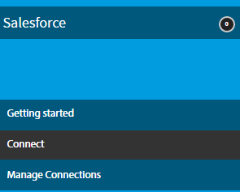

   *連接選項*

1. 會出現一個對話框，提示你輸入組織網址。 提供網址後點擊 **[!UICONTROL Connect]** 。
1. 成功連線後，會顯示總覽頁面。

### 地圖屬性 {#mapattributes}

連線成功建立後，你可以將 Salesforce 欄位映射到 Learning Manager 對應的屬性。 此步驟是強制步驟。

1. 在地圖頁面，左側可以看到學習管理員的欄位，右側則是 Salesforce 欄位。 選擇對應學習管理器欄位名稱的適當欄位名稱。

   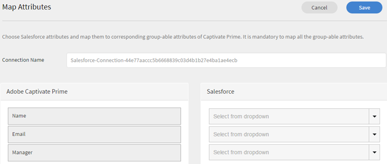
   *地圖屬性*

   >[!NOTE]
   >
   >學習管理員左側的欄位資料是從活動欄位擷取的。 **管理器**&#x200B;欄位必須映射到某欄位，電子郵件地址。在使用連接器之前，必須對所有柱子進行映射。

1. 完成地圖後點擊 **[!UICONTROL Save]** 。
1. 接頭現在已經準備好可以使用了。 已設定並在管理員應用程式中顯示為資料來源的帳號。 管理員可以排程匯入或按需同步。

## 使用 Salesforce 連接器 {#usingsalesforceconnector}

Salesforce 連接器會連接到 Salesforce.com，取得設定中的使用者並加入學習管理員。

### 從 Salesforce 聯絡人匯入使用者 {#import-salesforce-contacts}

Learning Manager 強化了 Salesforce 連接器，能自動擷取聯絡人及 Salesforce 使用者，並匯入 Learning Manager。

在 Salesforce 連接器頁面輸入 Salesforce 網址並完成認證。 認證完成後，你就可以繼續匯入使用者或聯絡人。 如果你選擇「聯絡人」選項，請指定要匯入的聯絡人子集。

選擇 Salesforce 欄位，並將其映射到對應的學習經理可分組屬性。 映射完成後，後續使用者匯入會使用相同的映射。

1. 登入 Salesforce。
1. 在連結頁面，點擊 **[!UICONTROL Import Internal Users]**。

   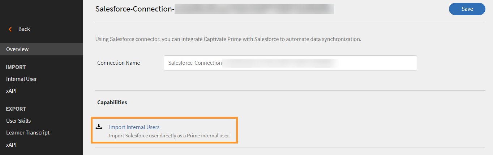
   *匯入內部使用者*

1. 在 **匯入使用者** 頁面，新增了一個選項「聯絡人」。 點擊單選按鈕 **「聯絡人** 」，您將看到以下選項。

   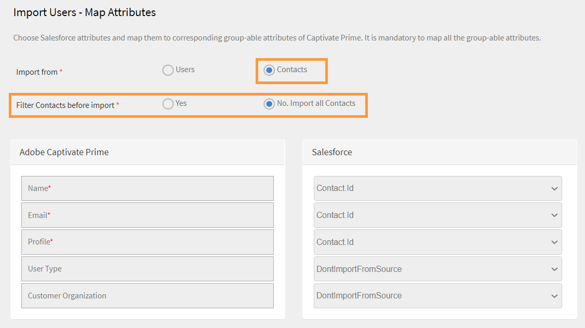
   *映射接觸屬性*

1. 如果你點擊 **[!UICONTROL Yes]**，可以執行以下操作：

   * **選擇聯絡人欄位：** 選擇你想匯入到 Learning Manager 的欄位。
   * **指定值：** 選擇代表所選欄位的值。

   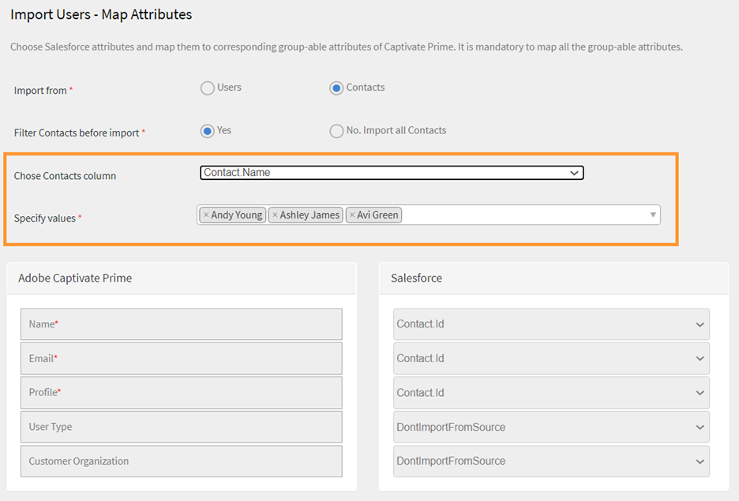
   *指定數值*

   * 將 Salesforce 欄位與 Learning Manager 的欄位對應。
   * 要開始匯入，請點擊 **[!UICONTROL Save]**。

1. 如果你點選 **[!UICONTROL No. Import all Contacts]**，可以直接映射欄位，無需篩選聯絡人。 在這裡，你會匯入所有 Salesforce 的聯絡人。
1. 要開始匯入，請點擊 **[!UICONTROL Save]**。

## 匯出學習紀錄 {#export-learning-records}

學習管理器提供匯出學習紀錄（如成績單、使用者報告、技能報告）至Salesforce的功能。 你可以判斷匯出的資料應該連結到 Salesforce 中的「使用者」資料表還是「聯絡人」資料表。

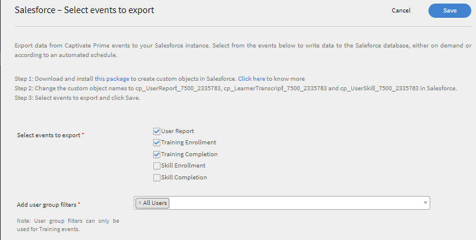
*匯出學習紀錄*

### Salesforce 中的自訂物件 {#custom-objects-in-salesforce}

在從 Learning Manager 匯出學習紀錄之前，您必須在 Salesforce 中建立自訂物件。 自訂物件是你用來儲存特定於你公司或產業的資訊的物件。 更多資訊請參閱 [Salesforce 自訂物件](https://trailhead.salesforce.com/en/content/learn/modules/data_modeling/objects_intro)。

以下是你將如何製作這些物件的方法：

1. 下載並安裝套件以建立自訂物件。

   * [套裝一](https://login.salesforce.com/packaging/installPackage.apexp?p0=04tDb000000LSlL)
   * [第二套](https://login.salesforce.com/packaging/installPackage.apexp?p0=04tDb000000FtK9)
   * [第三套](https://login.salesforce.com/packaging/installPackage.apexp?p0=04tDb000000FtKE)

1. 在 Salesforce 中重新命名自訂物件的名稱。
1. 選擇賽事並點擊 **[!UICONTROL Save]**。

>[!NOTE]
>
>請確保安裝套件後新增的所有活躍欄位都已獲得系統管理員權限。

**連結事件：** 選擇你想匯出的區塊——使用者或聯絡人。 如果你選擇聯絡物件，那些在學習管理員中存在但不在 Salesforce 中的使用者，會在 Salesforce 中建立。

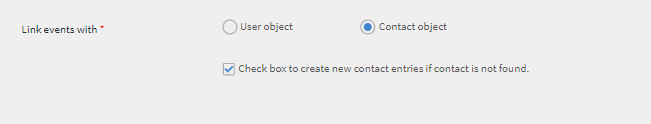
*連結事件選項*

>[!NOTE]
>
>你可以在同一個帳號裡建立多個連結。 在 Salesforce 中，單一連線最多可提供三個自訂物件。 如果你想為同一個 Salesforce 帳號建立多個連線，必須安裝這三個套件。 我們提供最多三種方案的支援。
>
>你想建立多少連結，就必須安裝盡可能多的套件。

>[!NOTE]
>
>在 Salesforce 的執行狀態頁面，處理的紀錄數量只能從 Salesforce 查看。 學習管理員會顯示狀態為已完成，即使所有已處理的紀錄有部分匯出或失敗。

## 安裝 Salesforce 套件 {#install-salesforce-package}

Learning Manager 提供 Salesforce 應用程式套件。 安裝並設定後，銷售人員可在SFDC入口網站內執行訓練活動。 此應用程式讓 SFDC 用戶能探索新培訓、查看推薦，並直接在 SFDC 入口網站內即時閱讀。 用戶也能直接在 SFDC 入口網站內，收到管理員以報頭形式發送的公告。

### 在 Learning Manager 應用程式中設定 {#setup-in-learning-manager-app}

1. 以整合管理員身份登入你的學習管理員管理員帳號。
1. 點擊 **[!UICONTROL Applications]** > **[!UICONTROL Featured Apps]**。
1. 點擊 **[!UICONTROL Salesforce]**。
1. 在 Salesforce 應用程式頁面，請注意應用程式 ID（也稱為客戶端 ID）以及描述中提到的客戶端秘密。
1. 點擊 **[!UICONTROL Approve]** 後，你的應用程式必須成功通過審核。
1. 點擊 **[!UICONTROL Developer Resources]** > **[!UICONTROL Access Tokens for Testing and Development]**。
1. 在取得 OAuth Code 區塊中，客戶端 ID 和範圍必須設為 - admin，admin:read:write。點擊 **[!UICONTROL Submit]**。
1. 在「取得刷新令牌」中，輸入客戶端 ID 和客戶端秘密。 點擊 **[!UICONTROL Submit]** 並記錄刷新標記。

### 在 Salesforce 應用程式中建立帳號 {#create-account-in-salesforce-app}

1. 在 Salesforce 註冊頁面建立帳號。 你必須在開發者版或企業版中建立 Salesforce 帳號。  [開發者註冊網址](https://developer.salesforce.com/signup)。 請確保你必須使用你在 Learning Manager 上使用的電子郵件 ID 來註冊 Salesforce。
1. 請透過驗證電子郵件驗證你的帳號。
1. 建立密碼並登入 Salesforce。
1. 登入後注意 Salesforce 網址（例如，site.lightning.force.com）

### 安裝學習管理器套件 {#install-learning-manager-package}

如果你想安裝這個套件，必須先在 Salesforce 中刪除現有的套件。 在卸載前，你必須啟用以下設定。 套用這些設定是必須的，否則你將無法安裝該套件。

>[!NOTE]
>
>Adobe Learning Manager 應用程式僅支援 Salesforce Lightning 檢視。

1. 啟動 [Learning Manager 套件的網址](https://login.salesforce.com/packaging/installPackage.apexp?p0=04t1k0000008WOQ)。
1. 在 **登入** 頁面，點擊 **[!UICONTROL Use Custom Domain]**。
1. 輸入套件網址並點擊 **[!UICONTROL Continue]**。 安裝頁面必須選擇「僅限管理員安裝」。 不要更改這個選項。
1. 點擊 **[!UICONTROL Install]**。 套件安裝完成後，點擊 **[!UICONTROL Done]**。 你會被導向已安裝套件頁面，並可以看到 Adobe Learning Manager 已安裝的套件。
1. 到應用程式啟動器（設定旁邊）搜尋 Adobe Learning Manager。
1. 要設定應用程式，請點擊 **[!UICONTROL Configure]**。
1. 點擊 **[!UICONTROL New]** 並補充以下細節：

   * **設定：** 輸入你選擇的名稱。
   * **ClientID**：輸入你從第一個區段取得的數值。
   * **ClientSecret：** 輸入你從第一部分取得的數值。
   * **RefreshToken：** 輸入你從第一節獲得的數值。
   * **LearningManagerBaseURL：** Learning Manager 所託管網站的網址。

### 新增遠端站點設定 {#add-remote-site-settings}

1. 在頁面右上角，點擊 **[!UICONTROL Setup]**。
1. 在 **[!UICONTROL Quick Find]**&#x200B;中搜尋遠端站點設定。
1. 點擊 **[!UICONTROL New Remote Site]**。
1. 請輸入細節：

   * **遠端站點名稱：** 輸入你選擇的名稱。
   * **遠端站點網址：** Learning Manager 所載站點的網址。

1. 啟動學習管理器。

### 啟用學習管理器應用程式的通知 {#enable-notifications-for-learning-manager-app}

1. 在右上角點擊 **[!UICONTROL Setup]**。
1. 搜尋自訂通知。
1. 點擊 **[!UICONTROL New]**。
1. 請輸入以下細節：

   1. **自訂通知名稱：** LearningManagerNotification
   1. **API 名稱：** LearningManagerNotification

1. 選擇&#x200B;**桌面版和**&#x200B;行動版&#x200B;**頻道**&#x200B;為支援頻道。

1. 點擊 **[!UICONTROL Save]**。
1. 要啟用行動裝置推播通知，請遵循以下步驟：

   1. 在手機安裝 Salesforce 行動應用程式。
   1. 用你的帳號登入應用程式。
   1. 請進入 **「設定** > **通知傳遞設定**」。
   1. 新增 iOS 和 Android 版的 Salesforce 吧。

### 從 Salesforce 卸載 Learning Manager

1. 在 Salesforce 應用程式中，點到已安裝套件。
1. 點擊 **[!UICONTROL Uninstall]**。

## 為 Salesforce 使用者設定學習管理員 {#configure-learning-manager-for-salesforce-users}

學習管理器應用程式也開放給任何 Salesforce 帳號中的使用者使用。 Salesforce 管理員可以根據設定檔新增使用者。 Salesforce 的設定檔和 Learning Manager 裡的設定類似。 例如管理員、整合管理員、講師等等。 Salesforce 管理員也可以建立自訂的個人檔案。

作為 Salesforce 管理員，你可以將設定檔指派給使用者，或建立自訂設定檔。

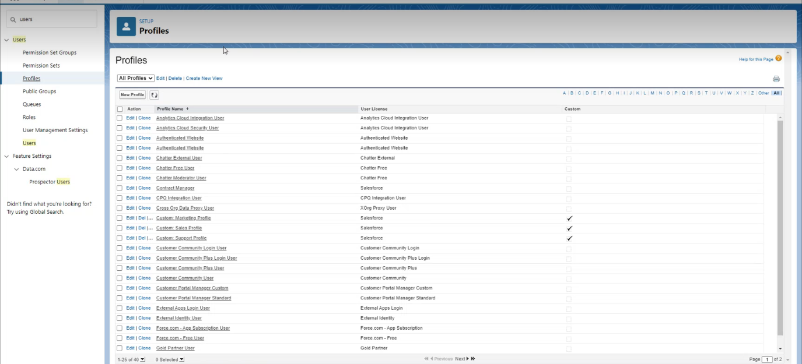

安裝套件時，你可以將 Salesforce 設定檔指派給學習者。

安裝套件後，您必須設定設定檔。

點擊 **[!UICONTROL Configure]** > **[!UICONTROL New]**，然後新增以下內容：

* 設定名稱
* ClientID
* 客戶秘密
* LearningManagerBaseURL
* 停用重定向

>[!NOTE]
>
>學習者要查看學習管理員應用程式，必須啟用該應用程式給所有學習者使用。

下一步是提供存取學習管理員應用程式的權限。

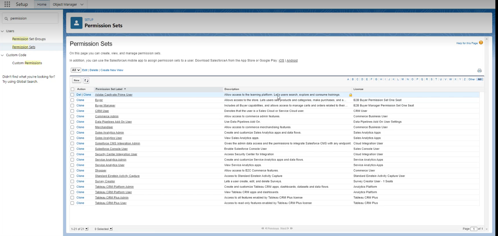

*設定存取學習管理器應用程式的權限*

選擇使用者並相應分配權限。 學習者現在可以使用學習管理員應用程式。

現在，選擇一個設定檔，例如「使用者的標準設定檔」，然後點擊該設定檔。 點選&#x200B;**[!UICONTROL Edit]**&#x200B;並在&#x200B;**自訂應用程式設定**&#x200B;區塊啟用 Adobe Learning Manager **的勾選框**。這讓應用程式對使用者來說更容易使用。

在 **自訂分頁設定** 區塊的 **學習者首頁** 下拉選單中，選擇 **「預設開啟**」選項。

你必須讓應用程式對所有個人檔案都顯示。

點擊 **[!UICONTROL Save]** 後，所有個人檔案的學習者即可存取學習管理員應用程式。

### 學習路徑相關變更 {#learning-path-changes}

#### 現有連接 {#existing-connections}

如果管理員帳號中關閉學習路徑選項，報告中不會新增任何列和欄位。

如果管理員帳號啟用學習路徑選項，若有學習者註冊，欄位「類型」會顯示學習路徑。

>[!NOTE]
>
>如果旗標已啟用且使用現有連線，可能會漏掉一些紀錄。

#### 新連接 {#new-connections}

若管理員帳號中關閉學習路徑選項，訓練報告將包含以下欄位，但不會包含任何資料。

* **嵌入路徑：** 顯示學習程式名稱
* **嵌入路徑 ID：** 顯示學習程式的 ID。
* **嵌入式課程 ID：** 顯示位於學習路徑內的課程 ID。

此外，對於啟用學習路徑的帳號新連線，三個新欄位會出現，所有資料也會隨之流動。

此外，報告中還會包含「學習路徑（高階）」欄位，適用於所有已註冊學習路徑的學習者。

在類型欄位中，學習計畫將改名為學習路徑。 現有連線則不會有變動。

## Learning Manager FTP 連接器 {#ftpconnector}

透過 FTP 連接器，你可以將學習管理員與任意外部系統整合，以自動化資料同步。 預期外部系統能以 CSV 格式匯出資料，並將其放入 Learning Manager FTP 帳號的適當資料夾中。 FTP 連接器的功能如下：

你也可以使用 Box 連接器進行資料遷移、使用者匯入和匯出資料。 更多資訊請參見盒子連接器。

### 資料匯入 {#data-import}

使用者匯入流程允許學習經理管理員從學習管理 FTP 服務取得員工資料，並自動匯入學習管理工具。 利用此功能，您可以將這些系統產生的 CSV 放入 FTP 帳戶的適當資料夾中，整合多個系統。 Learning Manager 會擷取 CSV 檔案，合併後依照排程匯入資料。 詳情請參閱排程功能。

**地圖屬性**

整合管理員可以選擇 CSV 的欄位，並將其映射到學習管理器可分組的屬性。 這種映射需要時間投入。 映射完成後，後續的使用者匯入也會使用相同的映射。 如果管理員想要不同的匯入使用者映射，也可以重新設定映射。

#### 匯出資料 {#export-data}

資料匯出功能允許使用者將使用者技能與學習者成績單匯出至FTP地點，以便整合至任何第三方系統。

#### 排程 {#scheduling}

管理員可依組織需求設定排程任務，學習管理軟體中的使用者也會依照排程保持最新狀態。 同樣地，整合管理員也能及時排程技能匯出，與外部系統整合。 同步可在學習管理軟體中每日執行。

### 配置學習管理員 FTP 連接器 {#configure-captivate-prime-ftp-connector}

要將 FTP 連接器與學習管理器整合，請學習流程。

#### 建立連結 {#Create-a-connection-1}

1. 在學習管理器首頁，將滑鼠移到FTP卡片/縮圖上。 選單出現了。 在選單中選擇「連接」項目。

   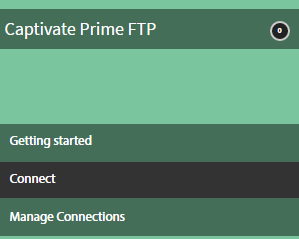

   *連接選項*

若要使用 FTP 用戶端連接任何 FTP 伺服器，您需要以下資訊：

* **FTP 網域**：這是你想連接的 FTP 伺服器的位址。 例如，ftp.example.com
* **埠口**：預設 FTP 埠口為 21，但部分伺服器可能因安全考量使用不同埠口。 針對 Adobe Learning Manager – Port 22
* **FTP 使用者名稱**：你需要用來存取 FTP 伺服器的使用者名稱。
* **FTP 密碼**：與使用者名稱相關的密碼。

**FileZilla（Windows、macOS 及 Linux）**

**步驟 1：下載並安裝 FileZilla**

如果你還沒安裝 FileZilla，請從官方網站 [下載：下載](https://filezilla-project.org/) 並安裝到你的電腦上。

**步驟二：開啟FileZilla**

安裝完成後，在你的電腦上啟動 FileZilla。

**步驟 3：收集 FTP 伺服器資訊**

**步驟 4：在 FileZilla 輸入 FTP 伺服器資訊**

在上方選單中，先選擇 **[!UICONTROL File]** ，然後選擇 **[!UICONTROL Site Manager]** （或使用快捷鍵 Ctrl+S）。

**步驟 5：新增 FTP 站點**

在網站管理員中，選擇 **新網站** 並輸入名稱（例如：我的 FTP 伺服器）。

**步驟 6：輸入 FTP 詳細資訊**

請輸入以下資訊：

* **主機**：輸入你的 FTP 伺服器地址。
* **埠號**：如果伺服器使用超過 21 的埠口，請輸入正確的埠號。
* **協議**：選擇 **[!UICONTROL SFTP – SSH File Transfer Protocol]**。
* **登入類型**：選擇 **[!UICONTROL Normal]**。
* **使用者：輸入**&#x200B;你的 FTP 使用者名稱。
* **密碼：輸入**&#x200B;你的 FTP 密碼。

**步驟 7：連接 FTP 伺服器**

在網站管理員中選擇按鈕 **[!UICONTROL Connect]** 。 如果所有資訊正確，FileZilla 會連接到 FTP 伺服器。

**步驟八：瀏覽與傳輸檔案**

連線後，你會看到遠端檔案在右側，本地檔案在左側。 你可以在目錄間拖放檔案，並在面板間移動檔案。

>[!CAUTION]
>
>傳輸檔案時，避免更改伺服器上的重要檔案。

<!--
1. A dialog appears prompting you to enter the email id. Provide the email id of the person responsible for managing the Learning Manager FTP account for the organization. Click **[!UICONTROL Connect]** after providing the email id. 
1. Learning Manager sends you an email prompting the user to reset the password before accessing the FTP for the first time. The user must reset the password and use it for accessing the Learning Manager FTP account.

   >[!NOTE]
   >
   >Only one Learning Manager FTP account can be created for a given Learning Manager account.

   In the overview page, you can specify the Connection Name for your integration. Choose what action you want to take  from  the following options:

   * Import Internal Users  
   * Import xAPI
   * Export User Skills - Configure a Schedule  
   * Export User Skills - OnDemand  
   * Export Learner Transcripts - Configure a Schedule
   * Export Learner Transcripts - OnDemand

   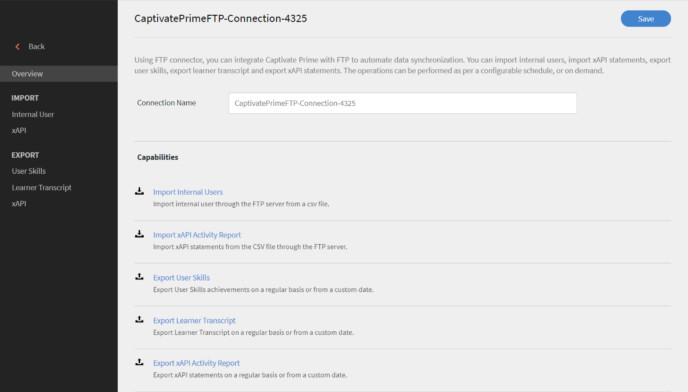
   *Export options*
-->

### 進口 {#import}

+++內部使用者

匯入內部使用者選項允許你將使用者從 csv 匯入 Learning Manager 的隨選或排程。

+++

+++地圖屬性

連線成功建立後，你可以映射 CSV 檔案的欄位。 它會被放在 Learning Manager 對應屬性的 FTP 資料夾中。 此步驟是強制步驟。

1. 在地圖屬性頁面，左側可以看到學習管理員預期的欄位，右側則可以看到 CSV 欄位名稱。 一開始，在右側你會看到一個空白的選擇框。 透過點選 **檔案**&#x200B;匯入任何範本 CSV。
1. 上述步驟會將所有 CSV 欄位名稱填滿右側的下拉選單。 選擇對應學習管理器欄位名稱的適當欄位名稱。

   >[!NOTE]
   >
   >管理者欄位必須映射到某欄位，電子郵件地址。 在使用連接器之前，必須對所有柱子進行映射。

1. 完成映射後選擇 **[!UICONTROL Save]** 。

   接頭現在已經準備好可以使用了。 設定好的帳號會以資料來源形式出現在管理員應用程式中，供管理員排程匯入或按需同步。

+++

+++使用 Learning Manager FTP 連接器

1. 來自外部系統的 CSV 檔案必須放置在以下路徑：

   `code $OPERATION$/$OBJECT_TYPE$/$SUB_OBJECT_TYPE$/data.csv`

   >[!NOTE]
   >
   >在 2016 年 7 月的版本中，僅允許匯入使用者。 因此，使用 FTP 連接器時，請確保 CSV 檔案放在以下資料夾中：

   `code Home/import/user/internal/*.csv`

1. FTP 連接器會從 CSV 檔案中取得所有資料列。 重要的是，在一個 CSV 中對應的使用者列，不能出現在其他任何 CSV 中。
1. 所有 CSV 必須包含映射中指定的欄位。
1. 在流程開始前，所有必要的 CSV 文件必須在資料夾中齊備。

>[!NOTE]
>
>在將使用者匯入 Learning Manager 時，管理員也必須了解使用者在 Learning Manager 中如何管理。 請參閱使用者管理說明[&#128279;](migration-manual.md#usermanagement)以獲取更多資訊。

+++

+++Import xAPI

匯入 xAPI 選項允許你按需排程將第三方服務的 xAPI 語句匯入 Learning Manager。

+++

+++匯入 xAPI 所需的設定

1. 在設定頁面中，選擇設定列表中可用的現有設定，從 CSV 匯入 xAPI 語句。 點擊編輯或 **新增組態** 連結，導覽至設定匯入來源頁面。

   **配置**

   * 在「設定匯入來源」頁面，填寫兩個欄位：名稱與原始碼檔案名稱。 來源檔名應該與 FTP 資料夾中提供的檔名相符。
   * 點擊 **[!UICONTROL Save]** 儲存您的更改。

   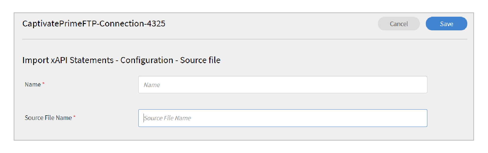
   *配置*

   **濾波器**

   * 從左側窗格點擊 **[!UICONTROL Filter]**。
   * 在設定匯入篩選頁面，填寫名稱與條件欄位以過濾掉紀錄。 點擊 **[!UICONTROL Add new Filter]** 新增另一個篩選器。 你可以在「動作」欄位點擊 **「儲存** 」或 **「刪除** 」選項來儲存或刪除篩選器。

   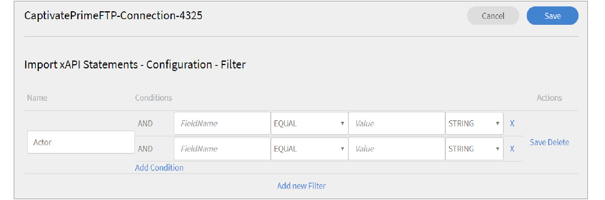
   *濾波器*

   **地圖繪製**

   * 從左側窗格點擊 **[!UICONTROL Mapping]**。
   * 在 Import xAPI Statements-Configuration-Mapping 頁面，左側可以看到需要與 CSV 欄位名稱對應的 xAPI JSON 欄位路徑名稱。
   * 預設情況下，三個需要映射到 CSV 欄位名稱的 JSON 路徑欄位名稱分別是 **actor.mbox**、 **verb.id** 和 **object.id**。 你可以點擊 **新增**&#x200B;映射來新增其他欄位來映射。

   * 選擇你要用 Json 欄位路徑名稱對應的欄位名稱類型（無論是字串、數字、布林值還是日期型別）。
   * 完成映射後點選儲存。 xAPI 匯入現在可以按時或按需匯入。

   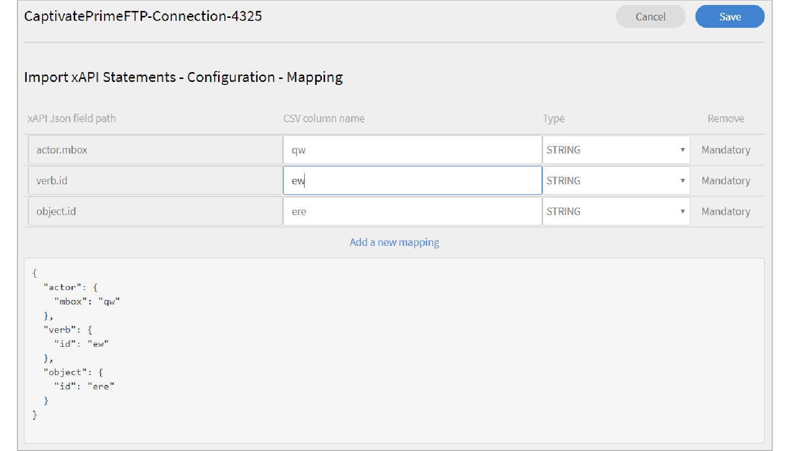
   *地圖繪製*

1. 從左側窗格點擊 **[!UICONTROL Configure Schedule]**。 點擊 **[!UICONTROL Enable Schedule]** 排程匯入 xAPI 語句。

   你可以輸入開始時間和日期，然後輸入 xAPI 匯入排程的頻率（以天為單位）。 例如，啟用每三天一次的 xAPI 匯入。

   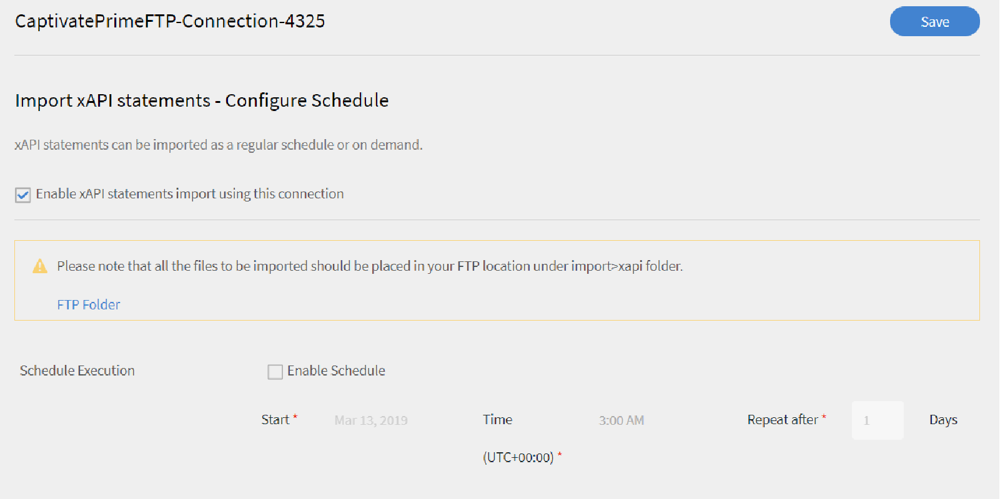
   *匯入 xAPI 語句 - 配置排程*

1. 從左側窗格點擊 **[!UICONTROL On Demand Execution]**。

   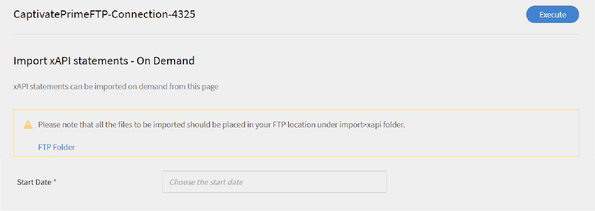
   *Import xAPI 陳述式 - 隨需*

1. 從左側窗格點擊 **[!UICONTROL Execution Status]** 可依時間順序查看該連接線所有運行的摘要。 你可以查看匯入 xAPI 的開始日期和所需時間、匯入類型（是按需還是排程），以及匯入狀態（xAPI 匯入是否正在進行中、已完成或失敗）。

   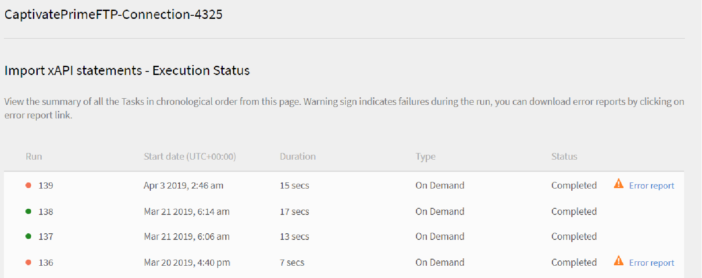
   *匯入 xAPI 語句 - 執行狀態*

+++

<!--
### Export

+++Skills

There are two options to export User skill reports.

**[!UICONTROL User Skills - On Demand]**: You can specify the  start date and export the report using the option. The report is extracted from the date entered until present.

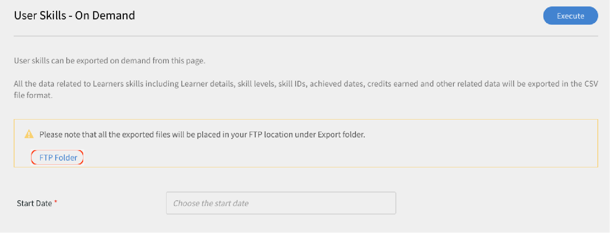
*On demand export option*

**[!UICONTROL User Skills - Configure]**: This option let's you schedule the extraction of the report. Select the Enable Schedule check box and specify the start date and time. You can also specify the interval at which you want the report to be generated and sent.

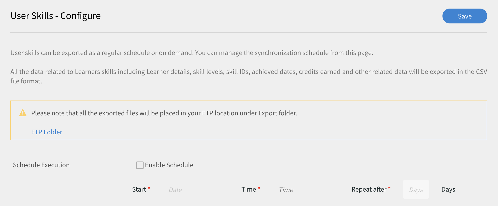
*Configure export of report*

+++

To open the Export folder where the exported files are placed, open the link to FTP Folder provided in the User Skills page as shown below.

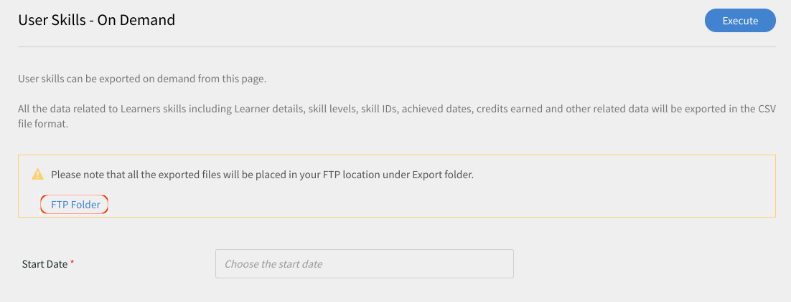
*FTP folder to view files*

The auto-exported files are present in the location **Home/export/&#42;FTP_location&#42;**

The auto-exported files are available with the title, **skill_achievements_&#42;date from&#42;_to_&#42;date to&#42;.csv**

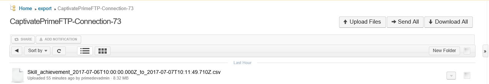
*Exported .csv file*

+++Learner Transcript

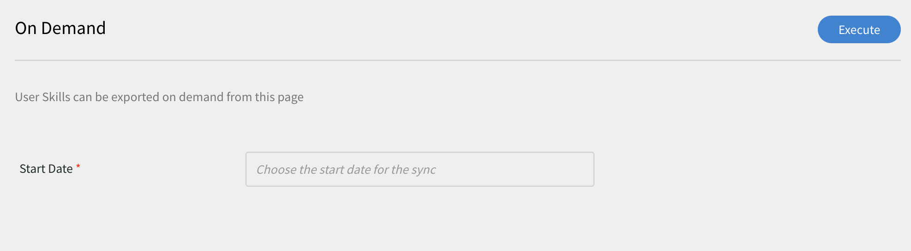

**Configure**: This option  let's  you schedule the extraction of the report. Select the Enable Schedule check box and specify the start date and time. You can also specify the interval at which you want the report to be generated and sent.

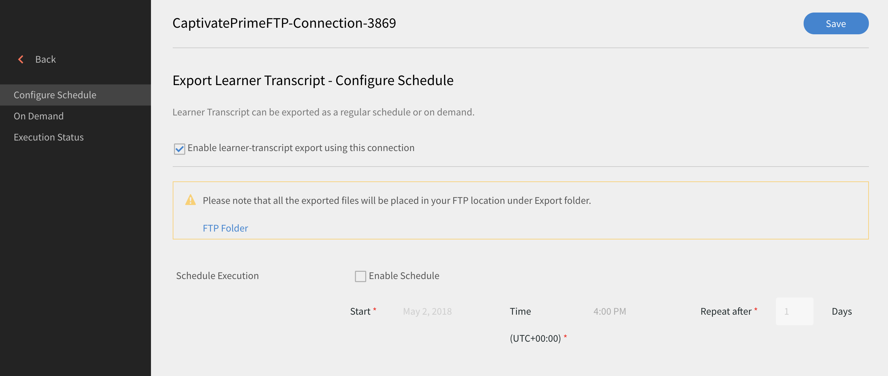

+++

To open the Export folder where the exported files are placed in your FTP location, open the link to FTP Folder provided on the Learner Transcript page as shown below

The auto-exported files are present in the location **Home/export/&#42;FTP_location&#42;**

The auto-exported files are available with the title, **learner_transcript_&#42;date from&#42;_to_&#42;date to&#42;.csv**
-->

### 支援手動 csv 欄位 {#support-for-manual-csv-fields}

在透過 FTP 匯入使用者資料時，管理員必須將系統中所有活躍欄位對應到 csv 中的對應欄位。

這是所有 csv 活躍欄位的強制性要求。 對於手動啟用欄位，整合管理員可以選擇「DontImportFromSource **」這個選項**。

選擇此選項後，手動的活動欄位值不會透過 csv 匯入來填充。 學習者提供的價值觀依然不變。

>[!NOTE]
>
>在映射過程中，如果 csv active 欄位選擇了 DontImportFromSource **選項**，該欄位將會從系統中刪除。

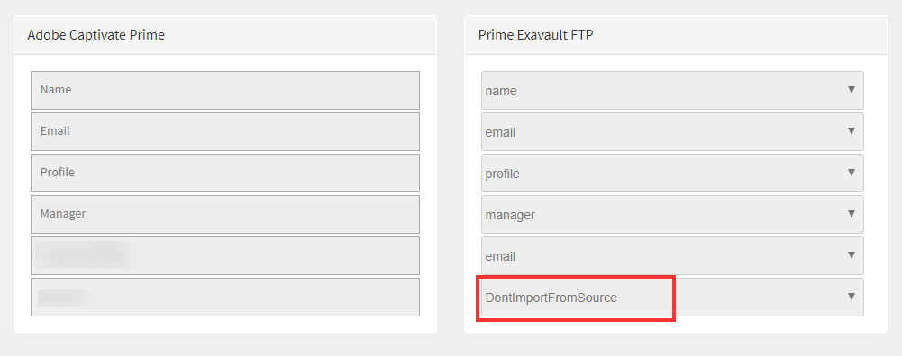
*用於主動場域的 FTP 連接器*

## Lynda 連接器 {#lynda-connector}

Lynda 連接器被企業客戶使用 Lynda.com，希望學習者能在 Learning Manager 中發現並學習 Lynda 課程。 連接器可以設定成定期用 API 金鑰從 Lynda.com 抓取課程。 課程在學習管理員中建立後，使用者可以搜尋並使用課程。 學習者的進度可以在學習管理員中追蹤。

### 配置 Lynda 連接器 {#configure-the-lynda-connector}

1. 在整合管理儀表板中，點選 Lynda。

   你會看到有三個選項的圖塊：開始、連接和管理連結。

1. 如果您是第一次設定 Lynda 連接器，請點擊「連接」。

   <!--Configure the Exavault FTP account before you configure this connector.-->

1. 在連接頁面，指定你的連接器名稱。 輸入 Appkey 和 Secret key，即可連接連線。

   >[!NOTE]
   >
   >聯絡你的供應商取得 Appkey 和 Secret key。

1. 點擊儲存。

   設定會被保存，並且你的帳號會新增 Lynda 連線。 你現在可以從首頁點選「管理連線」，隨時編輯你的設定。

1. 如果你已經建立了連線，請點選「管理連線」，查看所有連線。

   >[!NOTE]
   >
   >在設定這個連接器之前，必須先啟用您的帳號遷移功能。

1. 點擊你想編輯的連結。
1. 從左側窗格點擊 **[!UICONTROL Configure]**。 請做以下其中一項：

   * 在此視窗查看或編輯您的帳戶詳細資訊及同步排程。 如果你想啟用此帳號，請勾選啟用連線的勾選框。
   * 點擊編輯並編輯你的帳號。 要撤銷你對此欄位的更新，請點擊重置
   * 點擊啟用排程以排程同步。 你可以輸入開始時間和日期，然後輸入以天為單位的同步頻率。 例如，啟用每三天一次的同步。

   點擊 **[!UICONTROL Save]** 儲存您的更改。

   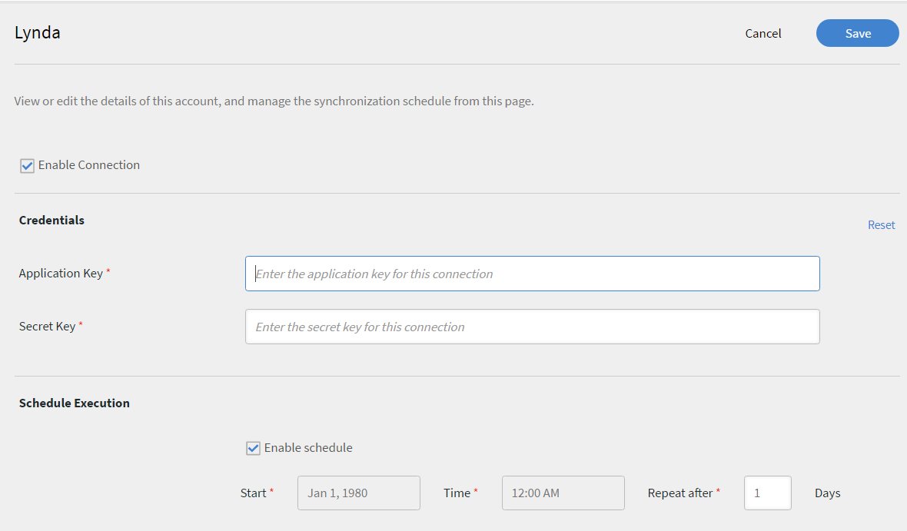

   *為學習管理器設定 Lynda 連接器*

1. 從左側窗格點選「隨選執行」。 此選項允許您匯入 Lynda 的用戶動態及其他相關資料。 輸入按需執行的開始日期，並點擊執行以執行同步。 從起始日期到現在的所有資料都會匯入。

   * 你可以在執行時點選「停用 Learning Manager 存取權」，因為應用程式在同步期間會停機。
   * 如果你在執行時點選「啟用學習管理員存取」，同步過程中服務不會中斷。

   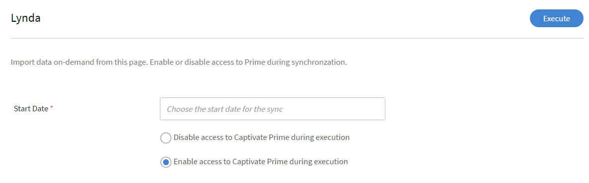

   *為 Lynda 連接器執行按需執行*

1. 你也可以隨時從左側面板點擊「執行狀態」，以時間順序查看此連接器所有運行的摘要。 您可以查看同步的開始日期與持續時間、同步類型（是否為按需同步）以及同步狀態（同步進行中或已完成）。

   >[!NOTE]
   >
   >當你刪除並重新建立連線時，之前針對該連接器的執行會重新出現。 你可以查看刪除連線前的所有跑動紀錄。

   你只能重播以取得最新的同步。

   

   *查看所有跑道的摘要，點擊執行狀態*

## getAbstract connector {#getabstractconnector}

getAbstract 連接器被企業客戶使用 getAbstract.com，他們希望學習者能發現並使用 getAbstract 摘要。 連接器可設定為定期擷取使用資料，根據學習管理員中建立的學習者完成紀錄。 繼續閱讀，了解如何在 Learning Manager 中設定這個連接器。

### 設定 getAbstract 連接器 {#configure-the-get-abstract-connector}

1. 從整合管理儀表板，點選 getAbstract。

   從圖塊中，你會看到三個選項：開始、連接和管理連線。

1. 如果你是第一次設定 getAbstract 連接器，請點擊 Connect。

   <!--
在設定這個連接器之前，先先設定 Exavault FTP 帳號。

請確保你將此 FTP 憑證分享給你的內容提供者，以便存取這些串流。
-->

1. 在「連線名稱」欄位輸入你的連線名稱。

   請在 Client ID 和 Client Secret 欄位輸入相應的金鑰。 聯絡你的供應商，取得該連接器所需的鑰匙。

   這些金鑰是取得客戶端所使用的課程元資料所必需的。

1. 如果你已經建立了連線，從首頁點選 getAbstract > 管理連線即可檢視並編輯你現有的設定。

   >[!NOTE]
   >
   >在設定這個連接器之前，必須先啟用您的帳號遷移功能。

1. 點擊你想查看或編輯設定的連線。

   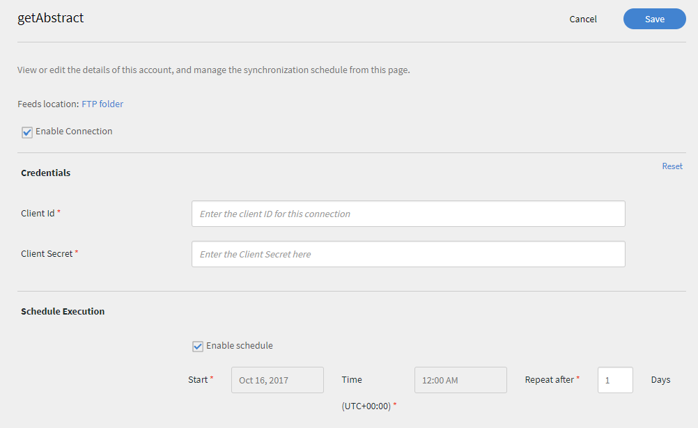

   *為 Learning Manager 設定 getAbstract 連接器*

1. 從左側窗格點選「設定」。 請做以下其中一項：

   * 在此視窗查看或編輯您的帳戶詳細資訊及同步排程。 如果你想啟用此帳號，請勾選啟用連線的勾選框。
   * 點擊編輯並編輯你的帳號。 要撤銷你對此欄位的更新，請點擊重置
   * 點擊啟用排程以排程同步。 你可以輸入開始時間和日期，然後輸入以天為單位的同步頻率。 例如，啟用每三天一次的同步。

1. 點擊 **[!UICONTROL Save]**。

   設定會被儲存，並新增你的帳號 getAbstract 連線。

1. 從左側窗格點選「隨選執行」。 這個選項允許你匯入 getAbstract 中的用戶訂閱和其他相關資料。 輸入按需執行的開始日期，並點擊執行以執行同步。 從起始日期到現在的所有資料都會匯入。

   * 你可以在執行時點選「停用 Learning Manager 存取權」，因為應用程式在同步期間會停機。
   * 如果你在執行時點選「啟用學習管理員存取」，同步過程中服務不會中斷。

1. 你也可以隨時從左側面板點擊「執行狀態」，以時間順序查看此連接器所有運行的摘要。 您可以查看同步的開始日期與持續時間、同步類型（是否為按需同步）以及同步狀態（同步進行中或已完成）。

   >[!NOTE]
   >
   >當你刪除並重新建立連線時，之前針對該連接器的執行會重新出現。 你可以查看刪除連線前的所有跑動紀錄。

   你只能重播以取得最新的同步。

   要讓任何類型的同步有效，請確保使用者訂閱源在 getAbstract FTP 資料夾中，且日期依照同步時指定的日期。

   請參考以下 Excel 表格，這是 getAbbtract 的範例用戶資料檔案。 檔名格式必須符合： **report_export_yyyy_MM_dd_HHmmss.xlsx** 或 **report_export_yyyy_MM_dd.xlsx**。
   [getAbstract 用戶訂閱範例 Excel 表格](assets/report-export-20170401175342.xlsx)

## 哈佛 ManageMentor 連接器 {#hmmconnector}

Harvard ManageMentor 連接器被企業用戶使用 Harvard ManageMentor，他們希望學習者能發現並使用哈佛 ManageMentor 課程。 該連接器有助於在 Learning Manager 內建立課程，並可設定為定期擷取學習者進度資料。 要配置此連接器，請執行以下程序：

### 設定 Harvard ManagerMentor 連接器 {#configure-the-harvard-managermentor-connector}

1. 從整合管理儀表板中，點選 Harvard ManageMentor。

   從圖塊中，你會看到三個選項：開始、連接和管理連線。

1. 如果您是第一次設定 Harvard ManageMentor 連接器，請點擊「連接」。

   <!--
在設定這個連接器之前，先先設定 Exavault FTP 帳號。

請確保你將此 FTP 憑證分享給你的內容提供者，以便存取這些串流。
-->

1. 在「連線名稱」欄位，輸入你的連線名稱。 點擊連接以儲存此連線。
1. 如果你已經建立了連結，請從首頁點擊 Harvard ManageMentor > 管理連結。 點擊你想要編輯現有設定的連線。

   >[!NOTE]
   >
   >在設定這個連接器之前，必須先啟用您的帳號遷移功能。

   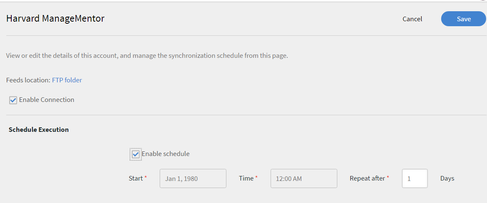

   *設定 HarvardManage Mentor 連接器以支援學習管理工具*

1. 從左側窗格點選「設定」。 請做以下其中一項：

   * 在此視窗查看或編輯您的帳戶詳細資訊及同步排程。 如果你想啟用此帳號，請勾選啟用連線的勾選框。
   * 點擊啟用排程以排程同步。 你可以輸入開始時間和日期，然後輸入以天為單位的同步頻率。 例如，啟用每三天一次的同步。

1. 從左側窗格點選「隨選執行」。 此選項允許您匯入 Harvard ManageMentor 的用戶訂閱及其他相關資料。 輸入按需執行的開始日期，並點擊執行以執行同步。 從起始日期到現在的所有資料都會匯入此連線。

   * 你可以在執行時點選「停用 Learning Manager 存取權」，因為應用程式在同步期間會停機。
   * 如果你在執行時點選「啟用學習管理員存取」，同步過程中服務不會中斷。

   如果你想每隔幾天自動同步一次，請在重複天數欄位中指定天數。 同步確保您的帳戶已更新至哈佛 ManageMentor 的摘要與摘要最新版本。

1. 你也可以隨時從左側面板點擊「執行狀態」，以時間順序查看此連接器所有運行的摘要。 您可以查看同步的開始日期與持續時間、同步類型（是否為按需同步）以及同步狀態（同步進行中或已完成）。

   >[!NOTE]
   >
   >當你刪除並重新建立連線時，之前針對該連接器的執行會重新出現。 你可以查看刪除連線前的所有跑動紀錄。

   你只能重播以取得最新的同步。

   為使同步成功，請確保 Harvard ManageMentor FTP 資料夾中至少有一個檔案存在：

   hmm12_metadata.csv：此檔案提供哈佛 ManageMentor 連接器的課程元資料。 上傳檔案時，請確保遵循命名規則。

   client_hmm12_20150125.csv：這是哈佛 ManageMentor 連接器的使用者訂閱源。 以下的檔案命名慣例是 **client_hmm12_yyyyMMdd.csv。**

   請參考以下兩個使用者動態與課程動態範例檔案：

   * [哈佛 ManageMentor 連接器的課程元資料檔案](assets/hmm12-metadata.csv)
   * [哈佛 ManageMentor 連接器的使用者訂閱](assets/client-hmm12-20170304.csv)

## Workday 連接器 {#workdayconnector}

透過 Workday 連接器，你可以將 Learning Manager 與 Workday 租戶整合，自動化資料同步。

### 進口 {#import-1}

#### 地圖屬性 {#map-attributes-1}

整合管理員可以選擇 Workday 欄位，並將其映射到對應的學習管理器可分組屬性。 映射完成後，後續使用者匯入會使用相同的映射。 如果管理員想要不同的匯入映射，也可以重新設定。

#### 自動使用者匯入 {#automated-user-import-1}

使用者匯入流程允許學習經理管理員自動從 Workday 取得員工資料並匯入學習管理員。

#### 篩選使用者 {#filtering-users}

Learning Manager 管理員可以在匯入使用者前對使用者套用篩選。 例如，學習管理員管理員可以選擇將階層中所有使用者匯入一個或多個特定管理員。

### 出口 {#export}

使用者技能匯出功能允許使用者自動匯出使用者技能到 Workday。

>[!NOTE]
>
>多個 Learning Manager 帳號的技能無法同時用同一個 Workday 帳號匯出。

#### 注意事項 {#points-to-note}

* 確保員工的UUID、電子郵件地址和姓名在多個Workday整合中都是唯一的。 數值錯誤會導致連線失敗。
* 透過 Workday 輸入的 UUID 欄位，任何面向 LMS 管理員的客戶端都無法刪除。 如果你想改變價值，請聯繫 Adobe Learning Manager 的入職或支援團隊。
* 使用者清除選項也可能無法運作，因為使用者清除每次只支援 50 名使用者被清除。 上傳用戶時務必格外小心。

### 排程 {#Scheduling-1}

管理員可依組織需求設定排程任務，且學習管理軟體中的使用者會依照排程保持最新狀態。 同樣地，整合管理員也能及時排程技能匯出，並與外部系統整合。 同步可在 Learning Manager 應用程式中每日執行。

### 配置 Workday 連接器 {#configure-workday-connector}

>[!PREREQUISITES]
>
>請請求貴組織的 Workday 管理員建立一個整合系統使用者（ISU），並依照ISU_Permissions文件中定義的權限。 請從下方連結下載副本。

[下載整合系統使用者（ISU）安全資料。](assets/isu-permissions-v1.pdf) 要將 Workday 連接器與學習管理器整合，請先了解流程。

1. 在學習管理員首頁，將滑鼠移到Workday圖塊上。 選單出現了。 在選單中點選 **[!UICONTROL Connect]** 項目。

   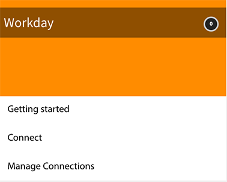

   *Workday 瓷磚*

1. 會出現一個對話框，提示你輸入新連線的憑證。 在建立連結前，請輸入以下欄位。

   * 連接名稱：依照您的偏好提供連接名稱。
   * 主機網址：整合管理員可以從對應的 Workday 管理員取得主機網址的詳細資訊。
   * 租戶：租戶是你公司內部的。 你的 Workday 管理員會提供租戶資料。
   * 使用者名稱與密碼：Workday 管理員建立一個具備必要安全權限的整合系統使用者（ISU），並與整合管理員共享。

>[!NOTE]
>
>   Learning Manager 使用 Workday API 40.1 版本。

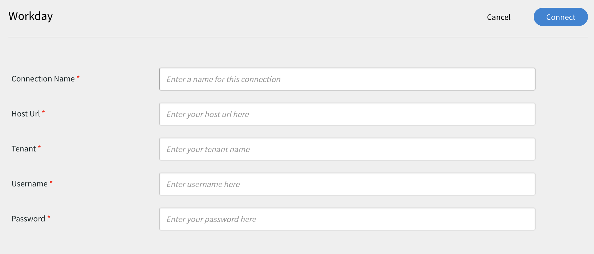
*配置 Workday 連接器*

1. 輸入所有相關欄位後，點擊「連結」。

   >[!NOTE]
   >
   >你也可以讓多個 Workday 連線同步到你的學習管理員帳號。

在概覽頁面，你可以指定整合的連線名稱。 從以下選項中選擇您想採取的行動：

* 匯入內部使用者
* 匯出使用者技能 - 設定排程
* 匯出使用者技能 - 隨選

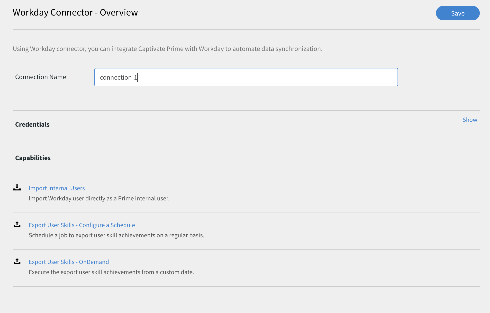
*Workday 概述*

### 進口 {#import-5}

#### 地圖屬性 {#map-attributes-4}

你可以使用 Workday 連接器整合 Learning Manager，並用 Workday 來自動化資料同步。 你可以將所有活躍使用者從 Workday 匯入到 Learning Manager。 使用者可從包括 FTP 和 Salesforce 在內的多種資料來源匯入。

在匯入使用者之前，必須先對應 Learning Manager 和 Workday 的使用者屬性。 在概覽頁面，使用匯入下的內部使用者選項提供地圖屬性。

在 Adobe Learning Manager 欄位輸入 Adobe Learning Manager 憑證。 請使用下拉選單選擇 Workday 欄位的正確憑證。

>[!NOTE]
>
>目前，Learning Manager 支援從 Workday 匯入 69 個使用者屬性。 使用學習管理員中的活動欄位新增更多屬性。

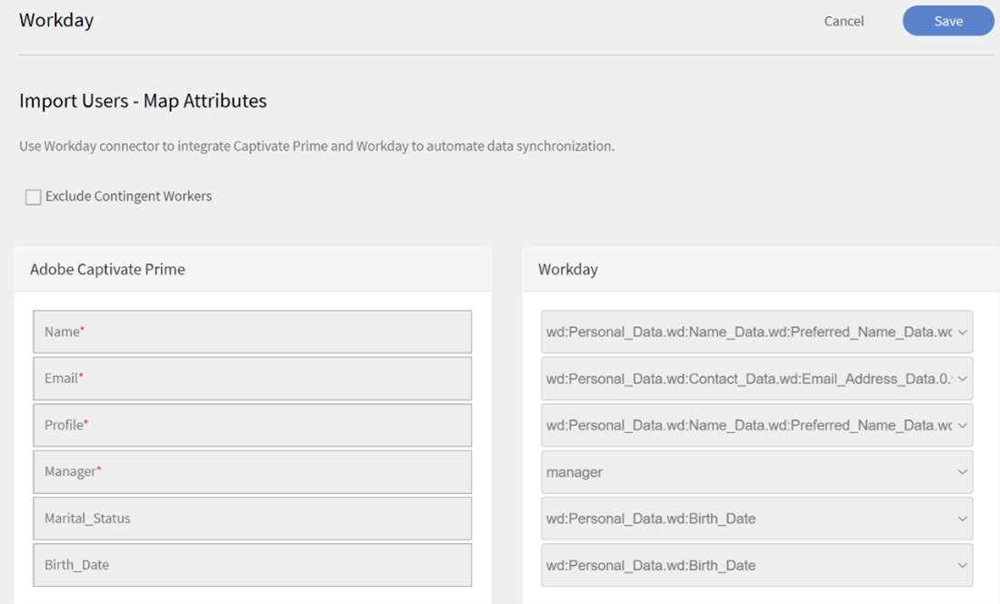
*地圖屬性*

選擇 **「排除臨時工作者** 」勾選框，以防止管理者可調派的臨時工作者被引進。

Workday 有四個層級的階層結構，而 Learning Manager 有兩個層級。 Workday 的四個等級分別是技能檔案類別、技能檔案、技能物品類別和技能物品。 你的技能名稱和學習管理器的等級會一起映射在 Workday 的技能項目下。

>[!NOTE]
>
>你可以新增額外的 Workday 屬性。 聯絡你的 CSAM 以取得屬性。

+++支援的 Workday 屬性列表

WD:User_IDWD:Worker_ID經理WDD:Personal_Data。WDD:Name_Data。WDD:Preferred_Name_Data。WD:Name_Detail_Data.@wd:Formatted_NameWDD:Personal_Data。WDD:Name_Data。WDD:Legal_Name_Data。WD:Name_Detail_Data.@wd:Formatted_NameWD.WD.WD.WD.WD.WD.WD:Personal_Data:Name_Data:Legal_Name_Data:Name_Detail_Data:Prefix_Data:Title_DescriptorWD.WD.WD.WD.WD.WD.WD:Personal_Data:Name_Data:Preferred_Name_Data:Name_Detail_Data:Prefix_Data:Title_DescriptorWD.WD.WD.WD.WD.WD:Personal_Data:Name_Data:Preferred_Name_Data:Name_Detail_Data:First_NameWD.WD.WD.WD.WD.WD:Personal_Data:Name_Data:Preferred_Name_Data:Name_Detail_Data:Last_NameWD.WD.WD.WD.WD.WD:Personal_Data:Name_Data:Legal_Name_Data:Name_Detail_Data:First_NameWD.WD.WD.WD.WD.WD:Personal_Data:Name_Data:Legal_Name_Data:Name_Detail_Data:Last_NameWDD:Personal_Data。WDD:Contact_Data。WD:Address_Data.0.@wd:Formatted_AddressWD.WD.WD.0.wd:Personal_Data:Contact_Data:Address_Data:Postal_CodeWD.WD.WD.0.wd:Personal_Data:Contact_Data:Email_Address_Data:Email_AddressWD.WD.WD.0.wd:Personal_Data:Contact_Data:Address_Data:Country_Region_DescriptorWDD:Personal_Data。WDD:Contact_Data。WD:Phone_Data.0.@wd:Formatted_PhoneWD.WD.WD.0.wd:Personal_Data:Contact_Data:Phone_Data:Country_ISO_CodeWD.WD.WD.0.wd:Personal_Data:Contact_Data:Phone_Data:International_Phone_CodeWD.WD.WD.0.wd:Personal_Data:Contact_Data:Phone_Data:Phone_NumberWD.WD.WD.1:Personal_Data:Primary_Nationality_Reference:ID.$WD.WD.WD.1:Personal_Data:Gender_Reference:ID.$WDD.WDD.0.WD.WDD:Personal_Data:Identification_Data:National_ID:National_ID_Data:IDWDD.WDD.0.WD.WDD:Personal_Data:Identification_Data:Custom_ID:Custom_ID_Data:IDWD.WD.WD.1:User_Account_Data:Default_Display_Language_Reference:ID.$WD.WDD.WD.0.wd.wd.1:Role_Data:Organization_Role_Reference:Organization_Role_Data:Organization_Role:ID.$WDD.WD.0.WD.WDD:Employment_Data:Worker_Job_Data:Position_Data:Position_TitleWDD.WD.0.WD.WDD:Employment_Data:Worker_Job_Data:Position_Data:Business_TitleWD.WD.0.wd.wd.wd.wd:Employment_Data:Worker_Job_Data:Position_Data:Business_Site_Summary_Data:NameWD.WD.0.wd.wd.wd.wd:Employment_Data:Address_Data:Worker_Job_Data:Position_Data:Business_Site_Summary_Data.@wd:Formatted_AddressWD.WD.0.wd.wd.0.wd.wd.1:Employment_Data:ID:Worker_Job_Data:Position_Data:Job_Classification_Summary_Data:Job_Classification_Reference.$WD.WD.0.wd.wd.0.wd.wd.1:Employment_Data:ID:Worker_Job_Data:Position_Data:Job_Classification_Summary_Data:Job_Group_Reference.$wd.wd.0.wd.wd.wd.1:Employment_Data:Work_Space__Reference:Worker_Job_Data:Position_Data:ID.$wd.wd.0.wd.wd.wd.0.wd.1:Employment_Data:ID:Worker_Job_Data:Position_Data:Job_Profile_Summary_Data:Job_Family_Reference.$WD.WD.0.wd.wd.wd.wd:Employment_Data:Worker_Job_Data:Position_Data:Job_Profile_Summary_Data:Job_Profile_Namewd.wd.0.wd.wd.wd.wd.wd.1:Employment_Data:ID:Worker_Job_Data:Position_Data:Job_Profile_Summary_Data:Job_Profile_Reference.$WD.WD.0.wd.wd.wd.0.wd.wd.2:Employment_Data:Address_Data:ID:Worker_Job_Data:Position_Data:Business_Site_Summary_Data:Country_Reference.$wd.wd.0.wd.wd.wd.1:Employment_Data:Worker_Type_Reference:Worker_Job_Data:Position_Data:ID.$WD.WD.0.wd.wd.wd.wd:Employment_Data:Address_Data:Worker_Job_Data:Position_Data:Business_Site_Summary_Data.0.@wd:Formatted_Addresswd.wd.0.wd.wd.wd.wd.wd.1:Employment_Data:ID:Worker_Job_Data:Position_Data:Job_Profile_Summary_Data:Management_Level_Reference.$WDD:Employment_Data。WDD:Worker_Status_Data。WDD:ActiveWDD:Employment_Data。WDD:Worker_Status_Data。WDD:Active_Status_DateWDD:Employment_Data。WDD:Worker_Status_Data。WDD:Hire_DateWDD:Employment_Data。WDD:Worker_Status_Data。WDD:Original_Hire_DateWDD:Employment_Data。WDD:Worker_Status_Data。WDD:RetiredWDD:Employment_Data。WDD:Worker_Status_Data。WDD:Retirement_DateWDD:Employment_Data。WDD:Worker_Status_Data。WDD:TerminatedWDD:Employment_Data。WDD:Worker_Status_Data。WDD:Termination_DateWDD:Employment_Data。WDD:Worker_Status_Data。WDD:Termination_Last_Day_of_WorkWDD.WD.0.WD.WDD:Organization_Data:Worker_Organization_Data:Organization_Data:Organization_CodeWDD.WD.0.WD.WDD:Organization_Data:Worker_Organization_Data:Organization_Data:Organization_Namewd.wd.0.wd.wd.wd.1:Organization_Data:Organization_Type_Reference:Worker_Organization_Data:Organization_Data:ID.$wd.wd.0.wd.wd.wd.1:Organization_Data:Organization_Subtype_Reference:Worker_Organization_Data:Organization_Data:ID.$WD.WD.0.WDD:Qualification_Data:Education:School_NameWDD.WD.0.WD.WDD:Qualification_Data:External_Job_History:Job_History_Data:Job_TitleWDD.WD.0.WD.WDD:Qualification_Data:External_Job_History:Job_History_Data:CompanyWDD.WDD.WD.0.WD:Management_Chain_Data:Management_Chain_Data:Worker_Supervisory_Management_Chain_Data:Manager。Employee_ID主要工作電子郵件WD:Organization_Type_Reference_Cost_Center_IDWD:Organization_Type_Reference_Cost_Center_NameWD:Organization_Type_Reference_CompanyWD:Organization_Subtype_Reference_DepartmentWD:Organization_Subtype_Reference_DivisionWD:Universal_IDWD.WD.0.WD.WD.WD.0.WDD:Employment_Data:Worker_Job_Data:Position_Data:Business_Site_Summary_Data:Address_Data:Country_Region_DescriptorWD.WD.0.wd.wd.wd.0.wd.wd.2:Employment_Data:Address_Data:ID:Worker_Job_Data:Position_Data:Business_Site_Summary_Data:Country_Region_Reference.$WD.WD.WD.0.wd:Personal_Data:Contact_Data:Address_Data:Municipality

+++

### 出口 {#export-1}

你可以將使用者從學習管理器中獲得的所有技能匯出到 Workday。 只有所有活躍的使用者技能會匯出，Learning Manager 不會匯出已退休的技能。 你也可以連接多個 Learning Manager\
帳號都指向同一個 Workday 連接器。 如果兩個學習管理帳戶的技能名稱相同，則在 Workday 中會對應到相同的技能。 在更新 Workday 技能之前，若兩個 Learning Manager 帳號共用同一 Workday 帳號，建議先更新所有 Learning Manager 帳號的技能名稱。

+++使用者技能 - 配置

這個選項讓你可以排程擷取報告。 請確認啟用「啟用使用此連線的使用者技能匯出」勾選框。 選擇啟用排程勾選框，並指定開始日期與時間。 你也可以指定想要產生和傳送報告的間隔。 選擇啟用排程勾選框，輸入開始日期、時間，並在 n 天後重複。 完成後，點擊儲存。

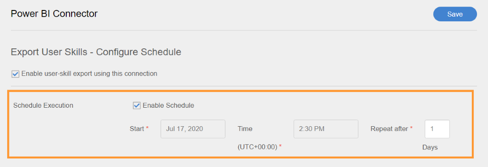
*設定使用者技能報告*

+++

+++使用者技能 - 隨選

你可以指定開始日期並用這個選項匯出報告。 報告內容從輸入日期擷取至現在。 輸入你想開始產生報告的日期，然後點選執行。

*隨選使用者技能報告*

+++

+++使用者技能 - 執行狀態

在這裡，您可以查看所有任務的摘要並取得狀態報告。 您可以點擊錯誤報告連結下載錯誤報告。

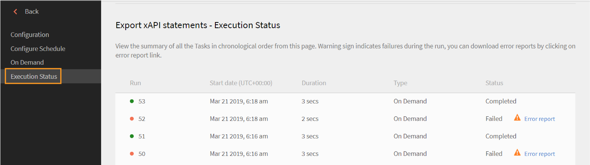
*使用者技能執行報告*

+++

## miniOrange 連接器 {#mini-orange-connector}

使用 miniOrange 連接器，你可以將 Learning Manager 與 miniOrange 租戶整合，以自動化資料同步。

### 進口 {#import-6}

#### 地圖屬性 {#map-attributes-5}

整合管理員可以選擇 miniOrange 屬性，並將其映射到對應的學習管理器可分組屬性。 映射完成後，後續使用者匯入會使用相同的映射。 如果管理員想要不同的匯入映射，也可以重新設定。

#### 自動使用者匯入 {#automated-user-import-3}

使用者匯入流程允許學習管理員自動從 miniOrange 取得員工資料並匯入學習管理員。

#### 篩選使用者 {#filtering-users-3}

Learning Manager 管理員可以在匯入使用者前對使用者套用篩選。 例如，學習管理員管理員可以選擇將階層中所有使用者匯入一個或多個特定管理員。

要設定 miniOrange 連接器，請聯絡學習經理 CSM 團隊。

### 設定 miniOrange 連接器 {#configure-mini-orange-connector}

1. 在 Learning Manager 首頁，將滑鼠移到 miniOrange 卡片/縮圖上。 選單出現了。 在選單中點選  **[!UICONTROL Connect]** 選項。

   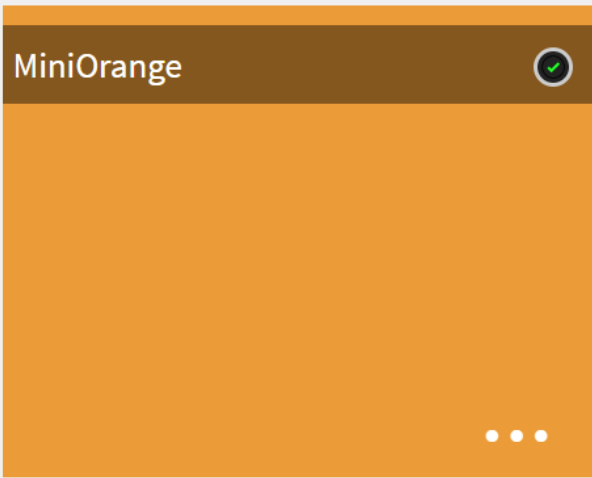

   *miniOrange 連接器磁磚*

1. 點擊 **[!UICONTROL Connect]** 建立新連線。 miniOrange 連接器頁面會出現。 輸入你想要對應的帳號細節。

   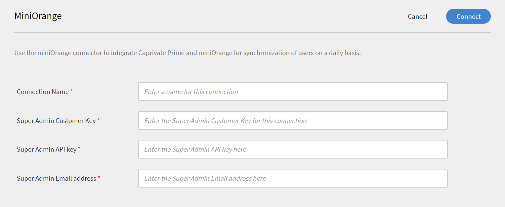

   *建立連結*

1. 如果你想直接匯入 miniOrange 使用者作為 Learning Manager 內部使用者，請使用這個 **[!UICONTROL Import Internal Users]** 選項。

   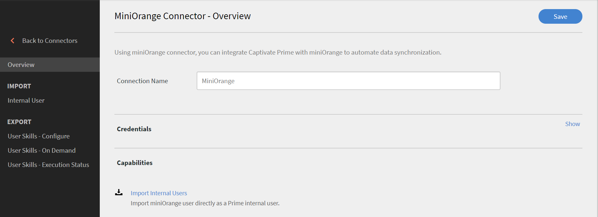

   *匯入內部使用者*

1. 在映射頁面左側可以看到學習管理器的欄位，右側則可以看到 miniOrnage 欄位。 選擇對應學習管理器欄位名稱的適當欄位名稱。

   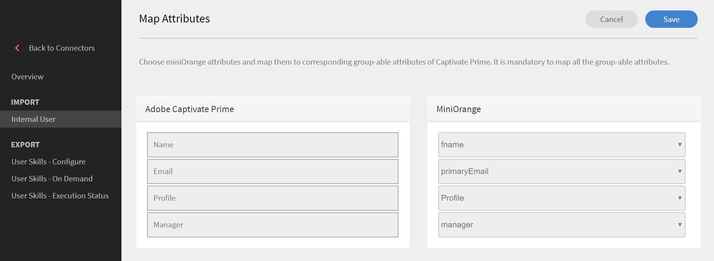

   *地圖屬性*

1. 作為管理員，若要查看和編輯資料來源，請點擊 **[!UICONTROL Settings > Data Source]**。

   已建立的 miniOrange 來源會被列出。 如果你需要編輯篩選，請點擊 **[!UICONTROL Edit]**。

   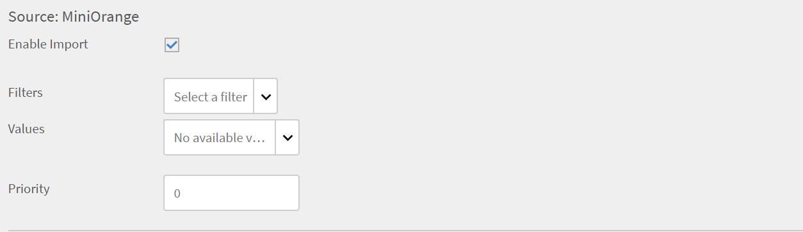

   *檢視並編輯資料來源*

1. 匯入完成後，您會收到通知。 要查看或編輯匯入日誌，請點擊 **[!UICONTROL Users > Import log.]**

<!--
 #### Delete a connection {#deleteaconnection}

To delete an established  miniOrange  connection, follow these steps. 
-->

## Zoom 連接器 {#zoom-connector}

你可以將 Learning Manager 與 Zoom 連接器整合，並用來主持課程。  這個連接器讓你能與學習者一起設置視訊會議或課程。

要設定並使用接頭，請依照以下步驟操作。

1. 在 Learning Manager 首頁，將滑鼠移到 Zoom 縮圖上。 選單出現了。 從選單點選  **[!UICONTROL Connect]** 選項。

   <!--
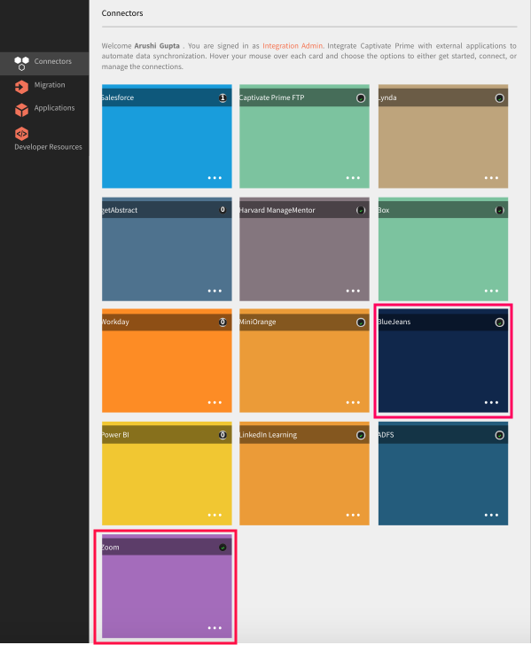

*Zoom 連接器磁磚*
-->

1. Zoom 連接器頁面打開。 請在相應欄位輸入帳號資訊，以整合並同步用戶動態。 你可以向你的連結帳號管理員取得詳細資訊。

   <!--
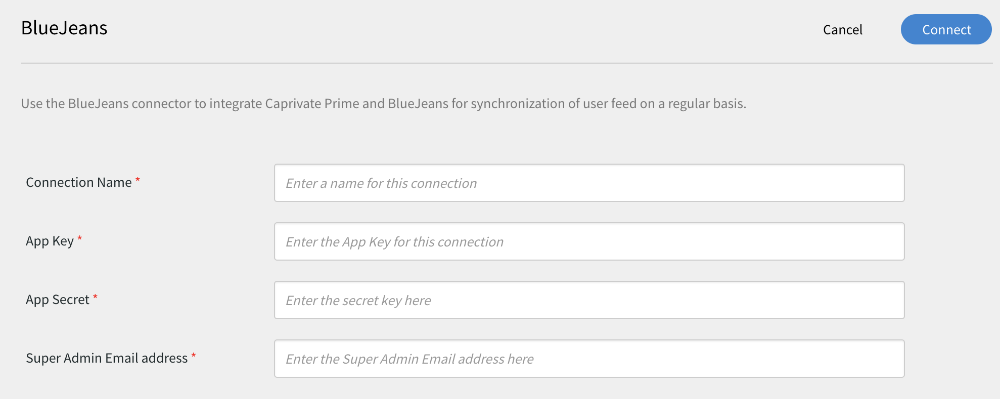
*連結 BlueJeans/Zoom*
-->

>[!NOTE]
>
>作為學習者，啟用連接器時，請使用與 Learning Manager 帳號相同的電子郵件 ID，讓使用者回饋回學習管理員。

1. 建立連結後，作為作者，建立一門以 Zoom 為會議系統的 VC 課程。

   <!--
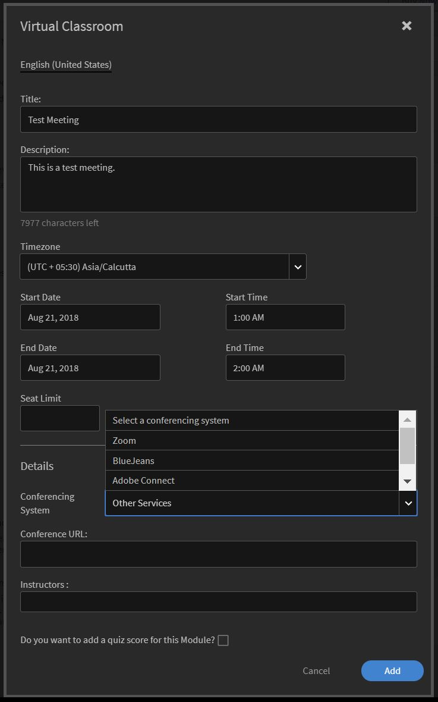

*創建一門VC課程*
-->

1. 管理者、經理與學員都可以為學員報名已建立的課程。 註冊後，學習者會收到一封電子郵件。 學習者可登入其學習經理帳號以查看課程詳情並參加課程。
1. 課程結束後，完成報告會寄送給學習管理員。 管理員可查看完成報告，以檢查學習者的出席情況與成績。

   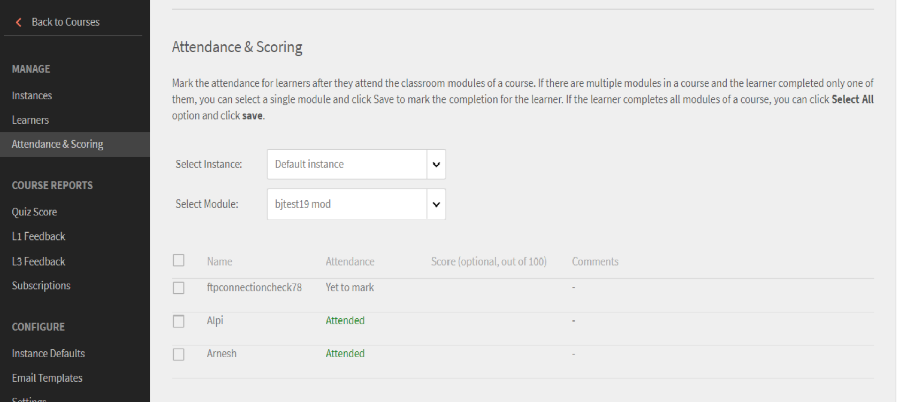
   *觀眾人數與得分報告*

### 建立一個 Zoom 伺服器對伺服器的 OAuth 應用程式 {#create-a-zoom-server-to-server-oauth-app}

當你建立 Zoom 伺服器對伺服器的 OAuth 應用程式以在 Adobe Learning Manager 中使用時，必須在建立連線時新增 Adobe Learning Manager 所需的範圍。

Adobe Learning Manager 需要以下範圍，且必須在 OAuth 應用程式中選擇這些範圍。

* 查看所有用戶會議 `/meeting:read:admin`
* 查看並管理所有使用者會議 `/meeting:write:admin`
* 查看報告資料 `/report:read:admin`
* 查看所有使用者資訊 `/user:read:admin`
* 查看使用者資訊並管理使用者 `/user:write:admin`
* 新增會議登記人 `/meeting:write:registrant:admin`
* 列出所有會議報名者  `/meeting:read:list_registrants:admin`
* 查看並管理子帳號的用戶會議 `/meeting:write:meeting:master`
* 查看報告資料 `/report:read:list_meeting_participants:admin`

## 盒式連接器 {#box_connector}

透過 Box 連接器，你可以將 Learning Manager 與任意的外部系統整合，以自動化資料同步。 預期外部系統能匯出 CSV 格式的資料，並將其放入學習管理盒帳戶的適當資料夾中。 盒子連接器的功能如下：

你也可以使用 FTP 連接器進行資料遷移、使用者匯入和匯出資料。 欲了解更多資訊，請參考 [Learning Manager FTP 連接器。](connectors.md#main-pars_header_1427405935)

### 資料匯入 {#data-import-1}

使用者匯入流程允許學習經理管理員從學習管理工具服務中取得員工資料，並自動匯入學習管理工具。 利用此功能，你可以將這些系統產生的 CSV 放入 Box 帳戶的適當資料夾，整合多個系統。 Learning Manager 會擷取 CSV 檔案，合併後依照排程匯入資料。 請參閱排程功能以獲得更多資訊。

**地圖屬性**

整合管理員可以選擇 CSV 的欄位，並將其映射到 Learning Manager 可分組的屬性。 這次地圖製作是一次性的努力。 映射完成後，後續的使用者匯入也會使用相同的映射。 如果管理員想要不同的匯入使用者映射，也可以重新設定映射。

## 資料匯出 {#data-export}

資料匯出功能允許用戶將使用者技能與學習者成績單匯出至某個 Box 位置，以便整合至任何第三方系統。

## 賽程報告 {#schedule-reports}

管理員可依組織需求設定排程任務，且學習管理軟體中的使用者會依照排程保持最新狀態。 同樣地，整合管理員也能及時排程技能匯出，並與外部系統整合。 同步可在 Learning Manager 應用程式中每日執行。

## 配置 Box 連接器 {#boxconnector}

要將 Box 連接器與學習管理器整合，請先了解流程。

1. 在 Learning Manager 首頁，將滑鼠移到盒子卡片/縮圖上。 選單出現了。 在選單中點擊「連接項目」。

   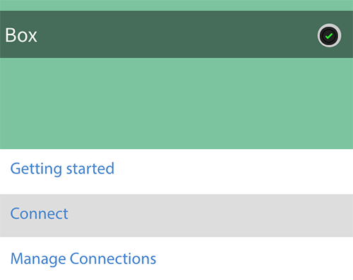

   *連接 Box*

1. 會跳出一個對話框，提示你輸入電子郵件 ID。 提供負責管理該組織學習管理箱帳號的人員的電子郵件碼。 輸入電子郵件後點選 Connect。
1. Learning Manager 會寄送電子郵件，提示使用者在首次存取 Box 前重置密碼。 使用者必須重設密碼，並用它來存取學習管理器盒子帳號。

   >[!NOTE]
   >
   >同一學習經理帳號只能建立一個 Learning Manager Box 帳號。

   在概覽頁面，你可以指定整合的連線名稱。 從以下選項中選擇您想採取的行動：

   * 匯入內部使用者
   * 匯入 xAPI 活動報告
   * 匯出使用者技能 - 設定排程
   * 匯出使用者技能 - 隨選
   * 匯出學習者成績單 - 設定排程
   * 匯出學習者逐字稿 - 隨選

## 進口 {#import-7}

+++內部使用者

匯入內部使用者選項允許你自動排程產生使用者匯入報告。 產生的報告會以 的形式傳送給你。CSV 檔案。

+++

+++地圖屬性

一旦連線成功建立，你可以將放在 Box 資料夾中的 CSV 檔案欄位對應到 Learning Manager 的相應屬性。 此步驟是強制步驟。

1. 在地圖屬性頁面，左側可以看到學習管理員預期的欄位，右側則可以看到 CSV 欄位名稱。 一開始，在右側你會看到一個空白的選擇框。 透過點選檔案匯入任何範本 CSV。
1. 上述步驟會將所有 CSV 欄位名稱填滿右側的下拉選單。 選擇對應學習管理器欄位名稱的適當欄位名稱。

   *管理器欄位必須對應到一個欄位，欄位為電子郵件地址。 在使用連接器之前，必須對所有柱子進行映射。*

1. 完成地圖後點擊儲存。

   接頭現在已經準備好可以使用了。 設定好的帳號會以資料來源形式出現在管理員應用程式中，供管理員排程匯入或按需同步。

+++

+++xAPI 活動報告

xAPI 的「報告活動」選項允許你從第三方服務產生 xAPI 語句的匯入。 檔案儲存為 。CSV 檔案，然後在匯入 Learning Manager 時轉換成 xAPI 語句。

+++

+++匯入 xAPI 所需的設定

1. 在設定頁面中，選擇設定列表中可用的現有設定，從 CSV 匯入 xAPI 語句。 點擊編輯或 A **dd a new Configuration** 連結，即可導向 Import xAPI Statements-Configuration-Source File 頁面。

   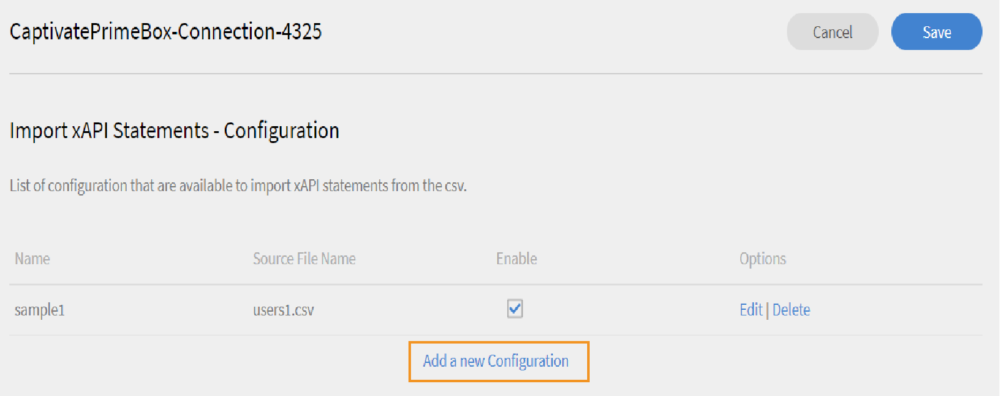

   *編輯或新增設定*

   **配置**

   * 在「設定匯入來源」頁面，填寫兩個欄位：名稱與原始碼檔案名稱。 來源檔名應該與 FTP 資料夾中提供的檔名相符。
   * 點擊 **[!UICONTROL Save]** 儲存您的更改。

   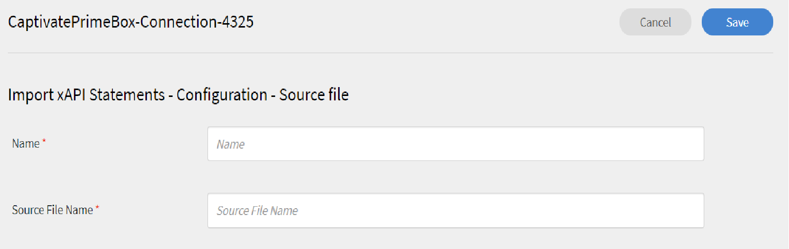

   *配置*

   **濾波器**

   * 從左側窗格點選「篩選」
   * 在設定匯入篩選頁面，填寫名稱與條件欄位以過濾掉紀錄。 點擊新增濾鏡即可新增另一個濾鏡。 你可以在「動作」欄位中點選儲存或刪除選項來儲存或刪除篩選器。

   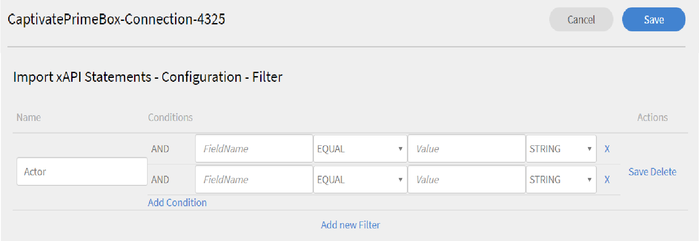

   *濾波器*

   **地圖繪製**

   * 從左側窗格點選「映射」。
   * 在「配置匯入映射」頁面左側，可以看到需要與 CSV 欄位名稱對應的 xAPI Json 欄位路徑名稱。
   * 預設情況下，三個需要與 CSV 欄位名稱對應的 Json 路徑欄位名稱分別是 **actor.mbox**、 **verb.id** 和 **object.id**。 你可以點擊新增映射來新增其他欄位來映射。
   * 選擇你要用 Json 欄位路徑名稱對應的欄位名稱類型（無論是字串、數字、布林值還是日期型別）。
   * 完成映射後點選儲存。 xAPI 匯入現在可以按時或按需匯入。

   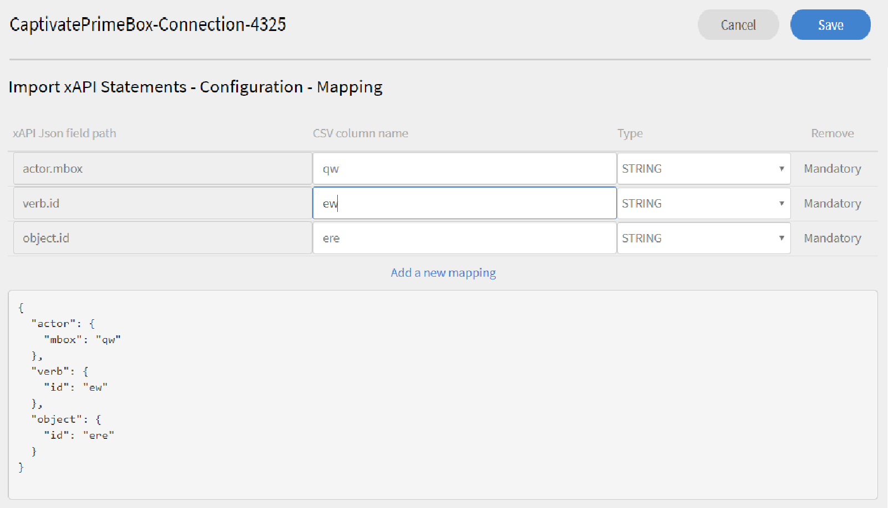
   *地圖繪製*

1. 從左側窗格點擊 **[!UICONTROL Configure Schedule]**。 點擊啟用排程以排程匯入 xAPI 語句。 你可以輸入開始時間和日期，然後輸入 xAPI 匯入排程的頻率（以天為單位）。 例如，啟用每三天一次的 xAPI 匯入。

   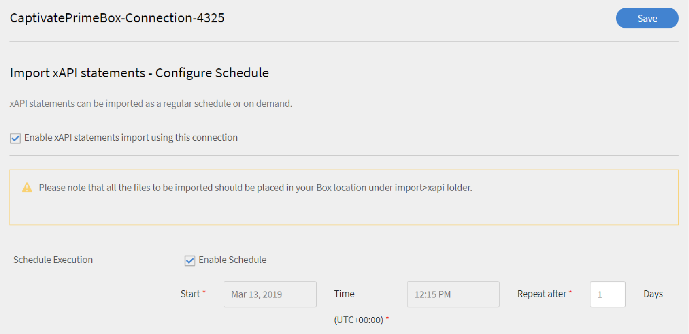
   *匯入 xAPI 語句 - 配置排程*

1. 從左側窗格點擊 **[!UICONTROL On Demand Execution]**。

   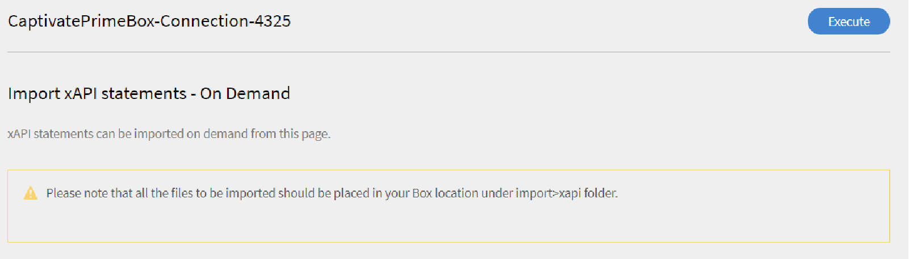
   *匯入 xAPI 語句 - 按需*

1. 從左側窗格點擊 **[!UICONTROL Execution Status]** 可依時間順序查看該連接線所有運行的摘要。 你可以查看匯入 xAPI 的開始日期和所需時間、匯入類型（是按需還是排程），以及匯入狀態（xAPI 匯入是否正在進行中、已完成或失敗）。

   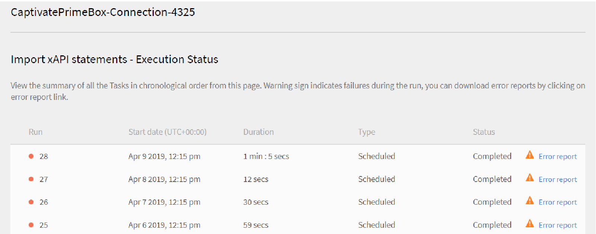
   *匯入 xAPI 語句 - 執行狀態*

+++

+++使用 Learning Manager Box 連接器

1. 來自外部系統的 CSV 檔案必須放置在以下路徑：

   `code $OPERATION$/$OBJECT_TYPE$/$SUB_OBJECT_TYPE$/data.csv`

   >[!NOTE]
   >
   >在 2016 年 7 月的版本中，僅允許匯入使用者。 因此，使用 Box 連接器時，請確保 CSV 檔案放在以下資料夾中：

   `code Home/import/user/internal/*.csv`

1. Box 連接器會從 CSV 檔案中取得所有列。 重要的是，在一個 CSV 中對應的使用者列，不能出現在其他任何 CSV 中。
1. 所有 CSV 必須包含映射中指定的欄位。
1. 在流程開始前，所有必要的 CSV 文件必須在資料夾中齊備。

在將使用者匯入學習管理員時，管理員也必須了解使用者在學習管理員中如何管理。 請參閱使用者管理說明[&#128279;](migration-manual.md#usermanagement)以獲取更多資訊。

+++

## 出口 {#export-2}

+++技能

有兩種匯出使用者技能報告的選項。

使用者技能 - 隨選：你可以指定開始日期並透過選項匯出報告。 報告從輸入日期擷取至今

**[!UICONTROL User Skills - Configure]**：此選項允許您排程擷取報告。 選擇啟用排程勾選框，並指定開始日期與時間。 你也可以指定想要產生和傳送報告的間隔。

+++

要打開匯出檔案放在 Box 位置的匯出資料夾，請如下方所示，打開使用者技能頁面中提供的 Box 資料夾連結。

自動匯出的檔案會出現 **在 Home/export/&#42;Box_location&#42;**

自動匯出的檔案標題為&#x200B;**skill_achievements_&#42;日期&#x200B;&#42;_從日期到_&#42;.csv&#42;**

>[!NOTE]
>
>客戶負責管理 Learning Manager 團隊共用的 Box 資料夾中的存取權限與內容。  而且資料夾裡的內容會實體存放在法蘭克福地區。

### 支援手動 csv 欄位 {#support-for-manual-csv-fields-1}

在透過 Box 匯入使用者資料時，管理員必須將系統中所有活躍欄位對應到 csv 中的對應欄位。

這是所有 csv 活躍欄位的強制性要求。 對於手動啟用欄位，整合管理員可以選擇「DontImportFromSource **」這個選項**。

選擇此選項後，手動的活動欄位值不會透過 csv 匯入來填充。 學習者提供的價值觀依然不變。

>[!NOTE]
>
>在映射過程中，如果 csv active 欄位選擇了 DontImportFromSource **選項**，該欄位將會從系統中刪除。

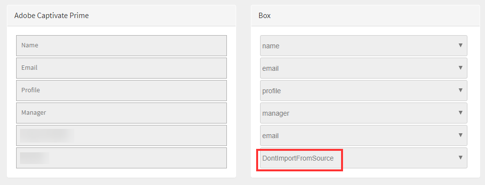
*主動場用盒接頭*

>[!NOTE]
>
>任何使用 FTP/Box 作為資料來源的連接器或遷移，所有處理中的 csv 檔案都會被刪除。
>
>內容連結（例如 LinkedIn）的 csv 將在七天後刪除，而匯入用戶的 csv 則會立即刪除。

## LinkedIn Learning 連接器 {#linkedinlearningconnector}

LinkedIn Learning 連接器被企業客戶使用 LinkedIn.com，希望學習者能在 Learning Manager 中發現並使用課程。 連接器可以設定成定期用 API 金鑰擷取課程。 課程在學習管理員中建立後，使用者可以搜尋並使用課程。 學習者的進度可以在學習管理員中追蹤。

>[!NOTE]
>
>你會獲得所有從 LinkedIn Learning 連接器匯入到 Adobe Learning Manager 課程的獨特 LO ID。

>[!NOTE]
>
>LinkedIn Learning 課程所花費的學習時間會透過 LinkedIn 內容/LinkedIn 平台傳達給學習經理學習平台。 如果 LinkedIn Learning 沒有傳送學習時間，我們的學習平台就無法記錄。 此時，學習管理器顯示的學習時間為零。

### 在 Linkedln Learning 入口網站設定設定 {#configure-settings-in-linkedln-learning-portal}

1. 以管理員身份登入 Linkedln Learning LMS。
1. 從上方的導航面板點擊 **[!UICONTROL admin]** 。
1. 點擊 **[!UICONTROL settings]** 下一視窗的分頁。
1. 從左側導覽面板選擇 **[!UICONTROL Playback Integration]** ，然後點選 **整合** 標籤。
1. 點擊 **[!UICONTROL LMS Content Launch Settings]** 展開設定。
1. 新增以下三個主機名稱： **learningmanager.adobe.com**、 **learningmanagerlrs.adobe.com**、 **cpcontents.adobe.com**
1. 選擇 **[!UICONTROL Enable AICC Integration]**。

   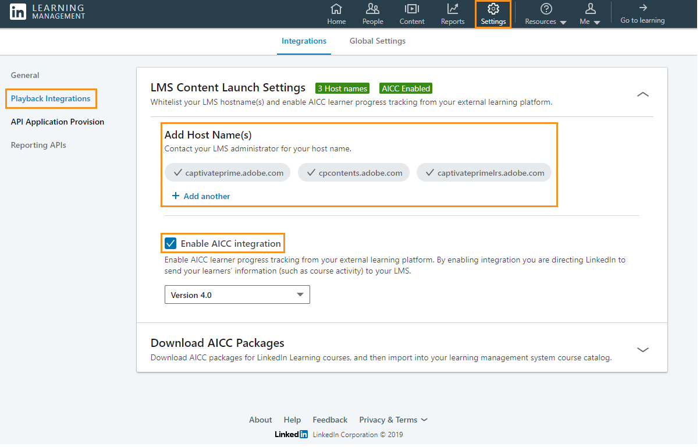

   *LinkedIn Learning 設定*

### 配置 LinkedIn Learning 連接器 {#configure-linkedin-learning-connector}

1. 從整合管理儀表板，點擊 [!UICONTROL LinkedIn Learning]。 會顯示「開始使用」、「連線」和「管理連線」選項。
1. 如果您是第一次設定 LinkedIn Learning 連接器，請點擊 [!UICONTROL Connect]。

   <!--
在設定這個連接器之前，先先設定 Exavault FTP 帳號。

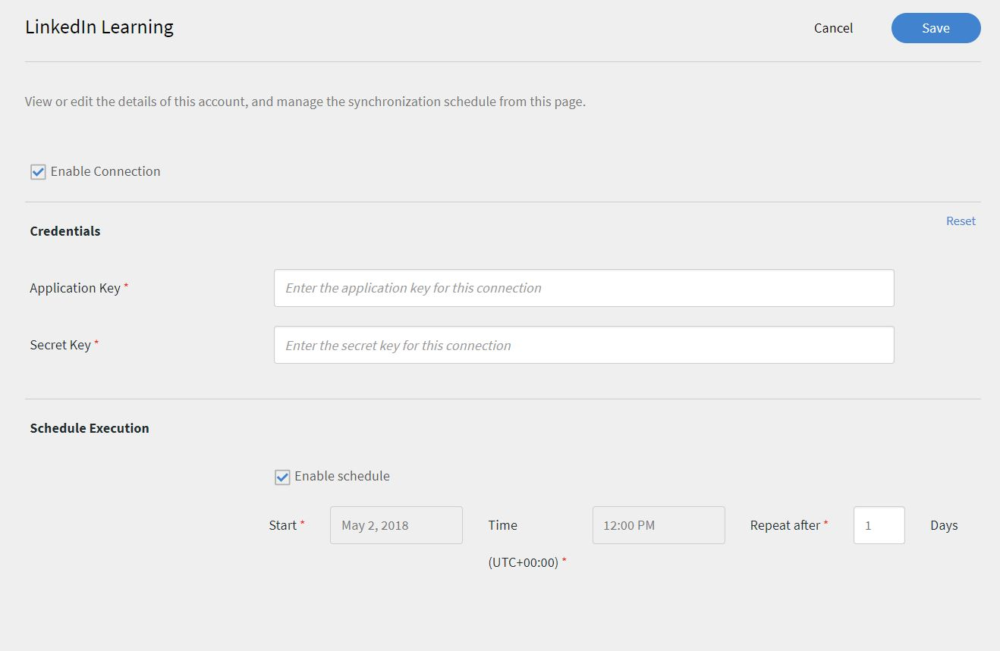
*配置連線*
-->

1. 在連接頁面，指定你的連接器名稱。 輸入 Appkey 和 Secret key，即可連接連線。

   >[!NOTE]
   >
   >企業管理員可以從 LinkedIn Learning 管理入口網站產生新的應用程式，以取得 Appkey 和 Secret key。

1. 點擊 **[!UICONTROL Save]**。

   設定會被保存，並且你的帳號會新增 LinkedIn Learning 連結。 你現在可以從首頁點擊 **[!UICONTROL Manage Connections]** ，隨時編輯你的設定。

1. 如果你已經建立了連線，請點擊 **[!UICONTROL Manage Connections]** 查看所有連線。

   >[!NOTE]
   >
   >在設定這個連接器之前，必須先啟用您的帳號遷移功能。

1. 點擊你想編輯的連結。
1. 從左側窗格點選「設定」。 請做以下其中一項：

   * 在此視窗查看或編輯您的帳戶詳細資訊及同步排程。 如果你想啟用此帳號，請勾選 **[!UICONTROL Enable Connection]** 勾選框。
   * 點擊 **[!UICONTROL Edit]** 並編輯您的憑證。 要撤銷你對此欄位的更新，請點擊重置。
   * 點擊 **[!UICONTROL Enable Schedule]** 預約同步。 你可以輸入開始時間和日期，然後輸入以天為單位的同步頻率。 例如，啟用每三天一次的同步。

   點擊 **[!UICONTROL Save]** 儲存您的更改。

1. 從左側窗格點擊 **[!UICONTROL On-Demand Execution]**。 這個選項允許你匯入 LinkedIn 的用戶動態和其他相關資料。 輸入按需執行的開始日期，並點擊執行以執行同步。 從起始日期到現在的所有資料都會匯入。

   * 你可以在執行時點選 **[!UICONTROL Disable access]** 學習管理器，該應用程式在同步期間會有停機時間。
   * 如果你在執行時點選 **[!UICONTROL Enable access]** 學習管理員，同步時服務不會中斷。

   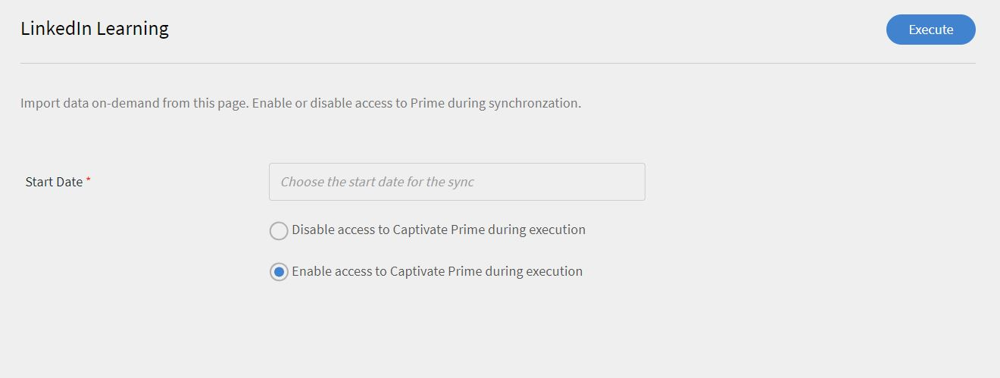

   *按需執行報告*

1. 你也可以隨時從左側面板點擊「執行狀態」，以時間順序查看此連接器所有運行的摘要。 您可以查看同步的開始日期與持續時間、同步類型（是否為按需同步）以及同步狀態（同步進行中或已完成）。

   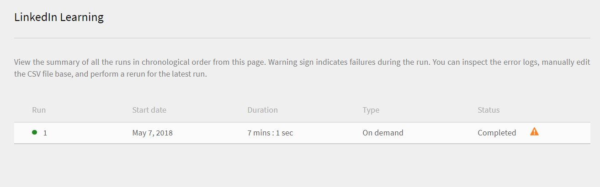

   *報告執行狀態*

   >[!NOTE]
   >
   >當你刪除並重新建立連線時，之前針對該連接器的執行會重新出現。 你可以查看刪除連線前的所有跑動紀錄。

   你只能重播以取得最新的同步。

### 篩選 LinkedIn Learning 內容 {#filter-linkedin}

LinkedIn 連接器中有篩選功能，可以根據 LinkedIn Learning Libraries 來區分內容。 此外，你也可以依語言和圖書館篩選內容，並只匯入必修語言的課程。 匯入後，內容會根據匯入設定被分隔到多個目錄。

以下是過濾器：

**使用篩選訓練：** 將部分課程從 LinkedIn 篩選到 Learning Manager。

* **根據語言**

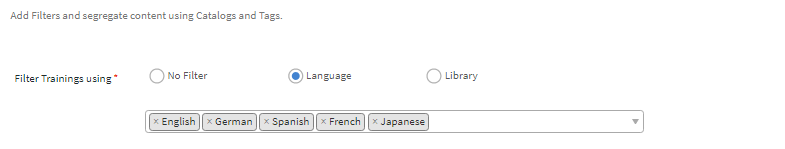

*語言篩選*

* **根據 LinkedIn Learning 的圖書館資料**

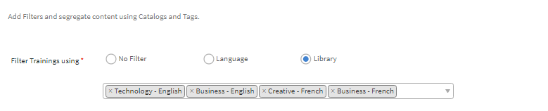

*以目錄篩選*

**引進訓練至**

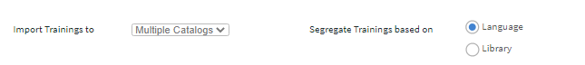
*目錄導引訓練*

**匯入標籤**

有一種標籤類型—— **自訂標籤**，你可以用它為你的 LinkedIn Learning 課程新增自訂標籤。 你可以加入任意多的標籤，並以逗號分隔。

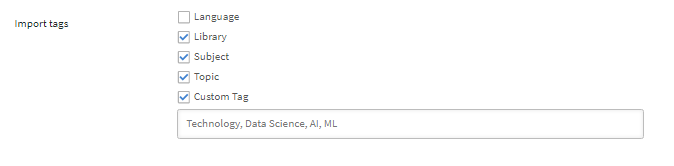

*新增自訂標籤*

內容只有遷移後才會被儲存。 內容將儲存在各自的目錄中。

## Power BI 連接器 {#powerbiconnector}

>[!NOTE]
>
>Learning Manager 支援僅與 Microsoft Power BI 商業授權整合。 它無法與政府雲端的 Microsoft Power BI 整合。

你可以利用這個連接器的整合，利用現有的 Power BI 帳戶，在 Power BI 中分析並視覺化來自 Learning Manager 的學習資料。 在設定時，整合管理員可以設定 Power BI 工作區，逐步填充兩組即時資料集——學習者逐字稿與使用者技能報告。 接著你可以利用 PowerBI 的所有功能與功能，依照他們在組織中的需求開發、部署及分發自訂儀表板。

### 連接器配置 {#configuring-the-connector}

要設定連接器，在頁面中 **[!UICONTROL Connectors]** 將滑鼠移到 **[!UICONTROL Power BI]** 圖塊上並點擊 **[!UICONTROL Connect]**。 Power BI 頁面打開。 要建立連線，你提供應用程式用戶端 ID、應用程式用戶端秘密、租戶名稱和工作區 ID（可選）。 要取得這些證照，請遵循以下步驟。

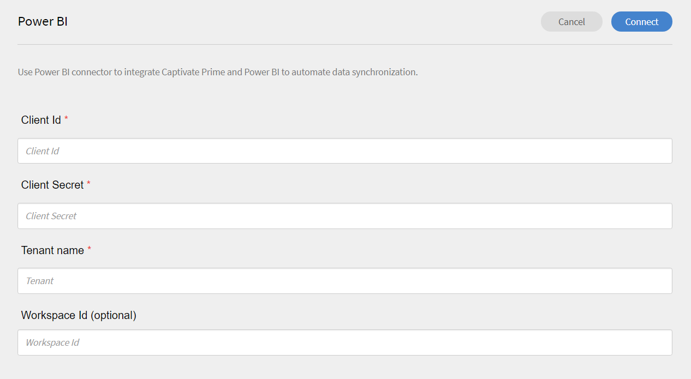

*設定 Power BI 連接器*

1. 發射 <https://app.powerbi.com/embedsetup>。
1. 點擊 **[!UICONTROL Embed for your organization]** 並登入您的 Microsoft 帳號。
1. 輸入應用程式名稱。
1. 在應用程式類型區塊，選擇「伺服器端網頁應用程式」這個選項。
1. 在該 **[!UICONTROL Redirect URL]** 區塊中，選擇「 **使用自訂網址** 」（如果你知道目標應用程式的網址，請選擇此網址）。 請輸入以下網址：

   `https://learningmanager.adobe.com/ctr/app/azure/_callback` （根據環境更新網域）

1. 在「首頁網址」欄位，輸入以下網址， `https://learningmanager.adobe.com/`
1. 在權限區塊中，選擇「Read All data set **」並**「**Read and Write all Data set**」。

   取得租戶：聯絡你的 Power BI 管理員提供租戶名稱。

   取得工作場所 ID：工作場所建立僅限 Power BI Pro 使用者使用。 你可以在 Power BI 裡建立工作場所，並從網址取得 ID。

1. 點擊 **[!UICONTROL Register app]** 並儲存 Client ID 和 Client Secret。

>[!NOTE]
>
>如果你想重新授權連線，必須建立另一個 Power App，並指定重新品牌的重定向網址。

你可以用同樣的方法匯出學習者成績單、使用者技能和 xAPI 活動報告。 從左側面板選擇學習者成績單/使用者技能。 匯出頁面開啟。

啟用 **[!UICONTROL Enable User-Skill/ Learner Transcript export using this connection check box]**。 儲存變更。

**匯出配置**：如果你想排程擷取報告。 勾選 **[!UICONTROL Enable Schedule]** 勾選方塊並指定開始日期與時間。 你也可以指定想要產生和傳送報告的間隔。

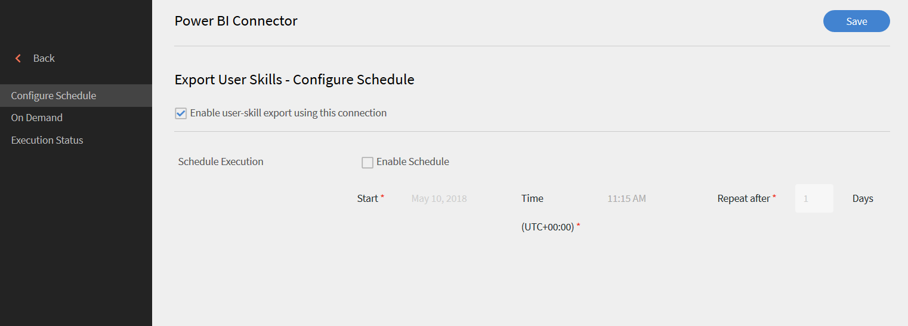

*匯出配置以排程報告*

**按需匯出：** 您可以指定開始日期並使用選項匯出報告。 報告內容從輸入日期擷取至現在。

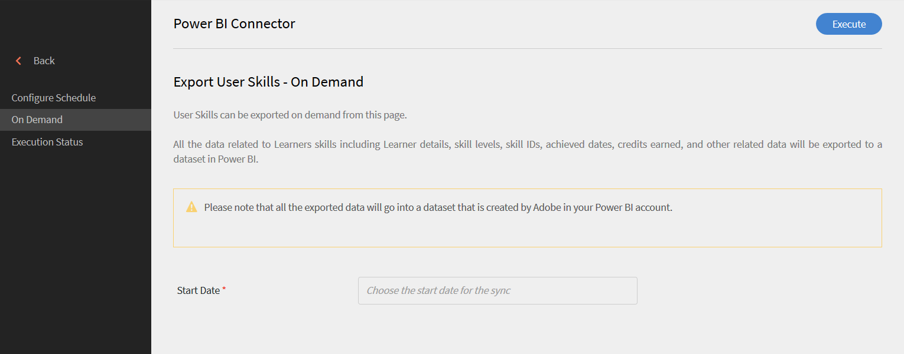

*按需出口*

匯出的資料可以透過登入你的 Power BI 帳號來查看。 匯出的資料會顯示在資料集選項中。

### 在學習管理員中匯出 xAPI 活動報告 {#export-xapi-activity-reports-in-captivate-prime}

從 PowerBI-xAPI 功能頁面，點選 **[!UICONTROL Export xAPI Activity Report]**。

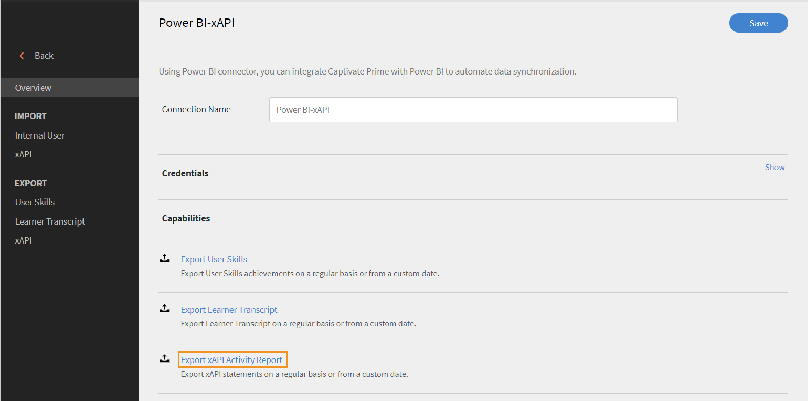
*PowerBI - 匯出 xAPI 活動報告*

從左側窗格選擇 **「設定** 」，並依照以下步驟操作：

* 填寫與欄位名稱和字串類型相符的 JSON 路徑欄位。
* 若要新增更多 JSON 路徑，請點擊 **[!UICONTROL Add]**。
* 你可以點擊 **[!UICONTROL Edit]**，編輯 JSON 路徑欄位中的項目。
* 點擊 **[!UICONTROL Save]** 儲存您的更改。

**設定排程**

從左側窗格點擊 **[!UICONTROL Configure Schedule]** 並執行以下操作：

* 點選啟用 xAPI 語句，使用此連線匯出。
* 點選 **[!UICONTROL Enable Schedule]** 勾選框並指定開始日期和時間。 你也可以指定想重複和傳送的天數間隔。
* 點擊 **[!UICONTROL Save]** 按鈕儲存 設定排程設定。

*xAPI 匯出 配置排程*

**隨選視訊**

從左側窗格點選 **[!UICONTROL On Demand]** 並指定「匯出 xAPi 帳單-按需」頁面的開始日期。

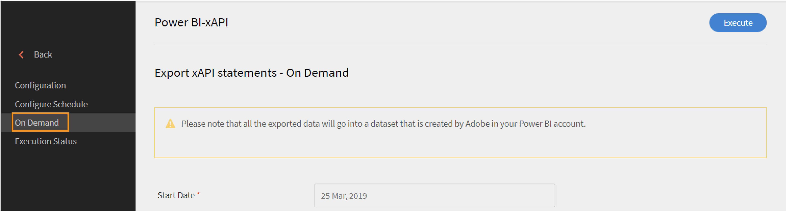
*xAPI 隨選匯出*

所有匯出的資料會匯入 Adobe 在你的 Power BI 帳號中建立的資料集。

如果 LRS 中少數 xAPI 語句沒有設定為匯出的 json 路徑，xAPI 匯出到 Power BI 就會失敗。 對於 xAPI 語句中沒有 json 路徑，應該加入 N/A 常數值，並在 Power BI 中顯示。

**執行狀態**

選擇 **執行狀態** 以依時間順序查看所有任務的摘要。 警告標誌表示行駛途中發生故障。 你可以點擊錯誤報告連結下載錯誤報告的 **CSV** 格式。

*xAPI 匯出執行狀態*

### 統一報告 {#unified-reports}

Learning Manager 提供一種將使用者資料、學習者逐字稿、遊戲化、回饋報告等報告組合匯出的方式，匯出成一個完整的 Power BI 資料集。

這讓 Power BI 使用者能將多個報告的資料合併，呈現更強大的分析與視覺化功能。

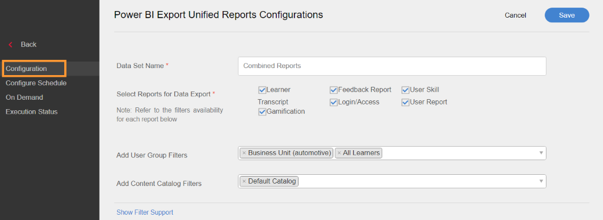
*統一 Power BI 報告*

**隨需出口**

指定開始日期和結束日期，並用選項匯出報告。 報告會依指定日期範圍擷取。

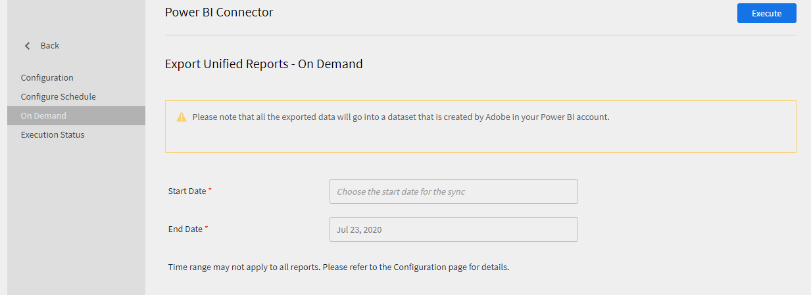
*按需出口*

**預定出口**

如果你想排程擷取報告。 選擇 **啟用排程** 勾選框，並指定開始日期與時間。 你也可以指定想要產生和傳送報告的間隔。

*設定排程*

你也可以把訓練報告匯出到 Power BI。

訓練報告可透過統一報告功能匯出至 Power BI。

訓練報告還有兩個額外欄位：

* 分享課程回饋的用戶數量
* 課程的平均星級評分

### 學習者成績單篩選狀態 {#lt-status}

在 Power BI 連線的統一報告區塊中，有選項可根據學習物件的狀態匯出學習者成績單。

* **全部選擇：** 匯出指定日期範圍內的所有紀錄或模組層級活動。
* **已完成：** 匯出所有在日期範圍內完成的紀錄。
* **進行中：** 匯出所有狀態為「進行中」的紀錄。
* **未開始：** 在產生報告時排除已登記但尚未開始的日期範圍內的紀錄。

* **未登記：** 包含所有日期範圍內未登記的紀錄。

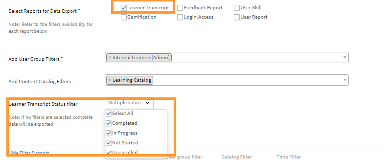
*學習成績單的篩選狀態*

你可以匯出所需清單，然後用 Power BI 來分析報告。

### 下載 Power BI 範本 {#template}

Learning Manager 也提供現成的 Power BI 範本。 這些範本為 Adobe Learning Manager 的帳戶管理員提供更佳的分析能力。

你可以下載範本，匯出相關報告，並輕鬆使用這些範本繪製報告。

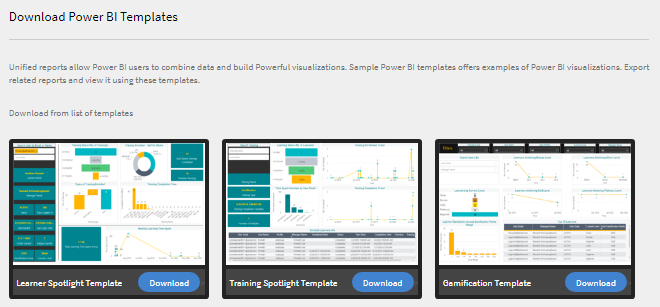
*下載 Power BI 範本*

這讓使用者能下載這些範本，並在 Power BI 應用程式中使用，進一步自訂，讓你的報告講述一個引人入勝的故事。

[**下載範本**](https://documentcloud.adobe.com/link/track?uri=urn:aaid:SCDS:US:842bb6a2-cd7d-4c3d-b968-da38bc1cc18a)

<!--
<table> 
 <tbody>
  <tr> 
   <td></td> 
   <td>
 
 
<a disablelinktracking="false" href="https://documentcloud.adobe.com/link/track?uri=urn:aaid:scds:US:842bb6a2-cd7d-4c3d-b968-da38bc1cc18a"><strong><em>Download the templates</em></strong></a>
</td> 
  </tr> 
 </tbody>
</table>
-->

你也可以透過上方連結手動下載範本。 使用範本並相應地自訂你的報告。

### 出口訓練報告 {#export-training-report}

訓練報告可匯出至 Power BI，作為統一報告功能的一部分。

訓練報告中還有以下額外欄位：

* 分享課程回饋的用戶數量
* 課程的平均星級評分

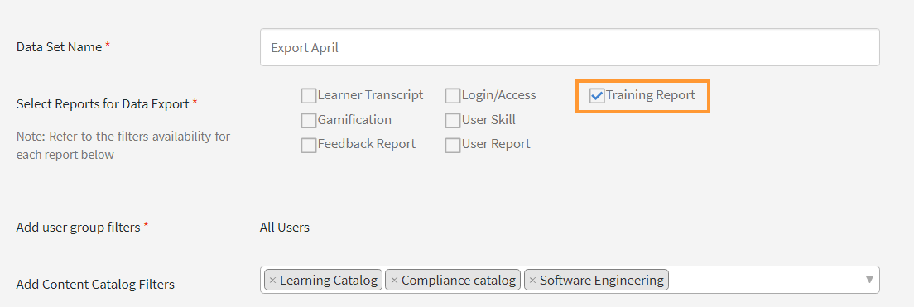
*出口培訓報告*

### 學習路徑相關變更 {#learning-path-related-changes}

#### 行政：學習成績單與統一報告 {#learning-transcripts-and-unified-reports}

**現有連接**

如果管理員帳號中關閉學習路徑選項，報告中不會新增任何列和欄位。

若管理員帳號啟用學習路徑選項，報告中將包含「學習路徑（高階）」欄位，涵蓋所有註冊於學習路徑的學習者。

**新連接**

若管理員帳號中關閉學習路徑選項，訓練報告將包含以下欄位：

* 嵌入路徑：顯示學習程式名稱
* 嵌入路徑 ID：顯示學習程式的 ID。
* 嵌入式課程 ID：顯示位於學習路徑內的課程 ID。

此外，報告中還會包含「學習路徑（高階）」欄位，適用於所有已註冊學習路徑的學習者。

在類型欄位中，學習計畫將改名為學習路徑。 現有連線則不會有變動。 但對於新連線，變更將在30天後反映。

#### 訓練報告：統一報告 {#training-report}

**現有連接**

如果管理員帳號中關閉學習路徑選項，報告中不會新增任何列和欄位。

如果管理員帳號啟用了學習路徑選項，報告中會出現「類型」欄位。 欄位包含新的值「學習路徑（高階），適用之處」。

**新連接**

若管理員帳號中關閉學習路徑選項，訓練報告將包含以下欄位：

* **嵌入路徑：** 顯示學習程式名稱
* **嵌入路徑 ID：** 顯示學習程式的 ID。
* **嵌入式課程 ID：** 顯示位於學習路徑內的課程 ID。

此外，報告中還會包含「學習路徑（高階）」欄位，適用於所有已註冊學習路徑的學習者。

在類型欄位中，學習計畫將改名為學習路徑。 現有連線則不會有變動。 但對於新連線，變更將在30天後反映。

## 自訂 FTP {#custom-ftp}

**先決條件**

>[!NOTE]
>
>要設定自訂 FTP，請聯絡你的客服經理。 CSM 將提供設置 FTP 所需的細節。
>
>設定 FTP 需要一段時間，且需要 IT 支援允許 IP 和埠口清單，並在你的 FTP 伺服器上建立特定權限的資料夾。

Learning Manager 提供連接您自訂 FTP 位置的功能。

您的 FTP 將支援以下內容：

### 資料匯入 {#data-import-2}

使用者匯入流程允許學習管理員管理員從學習管理員的 FTP 服務中取得員工資料，並自動匯入學習管理員。 利用此功能，您可以將這些系統產生的 CSV 放入 FTP 帳戶的適當資料夾中，整合多個系統。 Learning Manager 會擷取 CSV 檔案，合併後依照排程匯入資料。 請參閱排程功能以獲得更多資訊。

**地圖屬性**

整合管理員可以選擇 CSV 的欄位，並將其映射到 Learning Manager 可分組的屬性。 這次地圖製作是一次性的努力。 映射完成後，後續的使用者匯入也會使用相同的映射。 如果管理員想要不同的匯入使用者映射，也可以重新設定映射。

### 資料匯出 {#data-export-3}

資料匯出功能允許使用者將使用者技能與學習者成績單匯出至FTP地點，以便整合至任何第三方系統。

### 賽程報告 {#schedule-reports-2}

管理員可依組織需求設定排程任務，且學習管理軟體中的使用者會依照排程保持最新狀態。 同樣地，整合管理員也能及時排程技能匯出，並與外部系統整合。 同步可在 Learning Manager 應用程式中每日執行。

若要設定自己的 FTP，請以整合管理員身份登入，並點擊 **[!UICONTROL Custom FTP]** > **[!UICONTROL Connect]**。

認證有兩種類型：

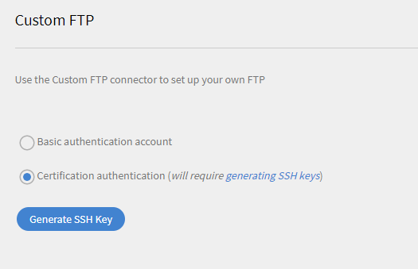
*自訂 FTP 認證選項*

* **基本：** 在基本認證中，你只需要提供 FTP 網域的網址、使用者名稱和密碼。 提供詳細資訊後，點擊「連結」。
* **認證：** 如果客戶 FTP 支援憑證認證，他們可以選擇此選項。 點擊「產生 SSH 金鑰」後，SSH 金鑰會被下載到你的本機電腦。 當你打開檔案時，金鑰看起來是，

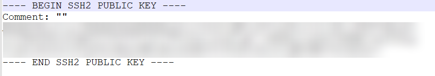
*SSH 公鑰*

您必須先將此公鑰放入您的 FTP 伺服器，才能加入以下細節。 當你將指定金鑰設為 FTP 的公鑰後，輸入 FTP 網域 URL 和使用者名稱，然後點擊 **Connect** 按鈕來設定連線。

連線設定完成後，FTP 位置會自動建立匯入和匯出資料夾。 之後匯入/匯出功能由自訂 FTP 提供。

>[!NOTE]
>
>客製化的 FTP 連接器可僅設定為 SFTP 伺服器。

## ADFS 連接器 {#adfsconnector}

建立 ADFS 連線的前提條件：

* 在註冊應用程式前，請先用此網址  [https://portal.azure.com/](https://portal.azure.com/) 登入你的 Azure 入口網站。
* Open Azure Active Directory.

## 申請登記步驟 {#steps-to-register-your-application}

* 點擊 Azure Active Directory。 點擊 **[!UICONTROL Add]** > **[!UICONTROL App registration]**。

  <!--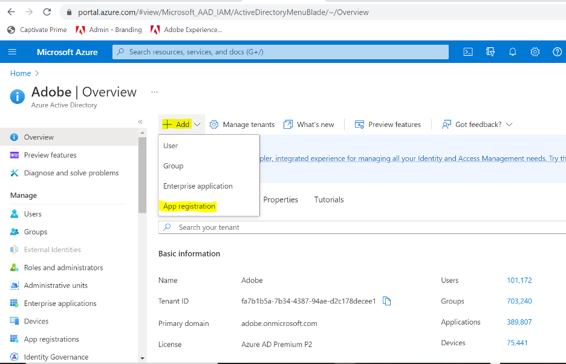-->
  <!-- *Add app registration*-->

* 輸入應用程式名稱。

  <!--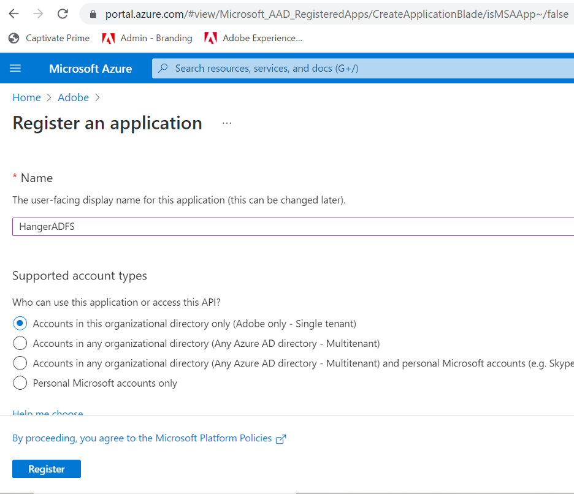-->
  <!--*Enter the name of the application*-->

  點擊 **[!UICONTROL Register]**。

* 在右側窗格，選擇 **[!UICONTROL Certificates and Secrets]**。

  <!--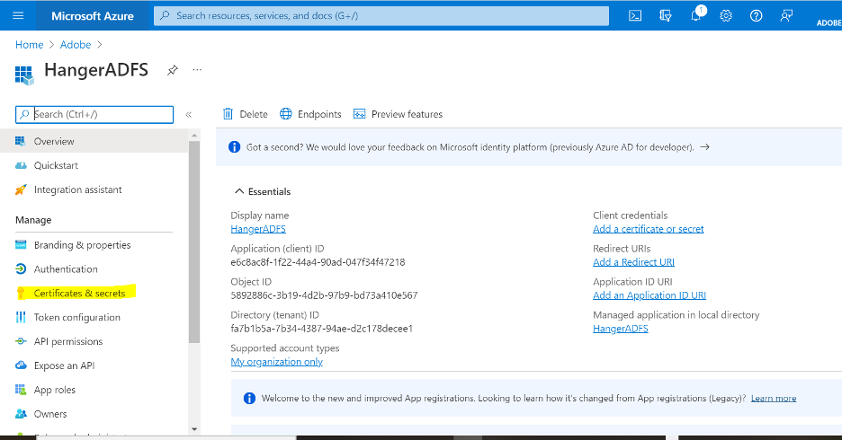-->

  <!--*Select Certificates and Secrets*-->

* 新增客戶端秘密。

  <!--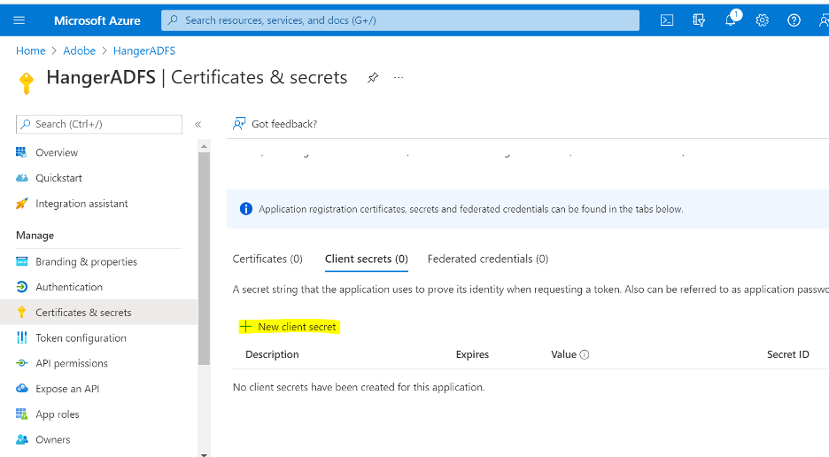-->

  <!--*Add a client secret*-->

* 在秘密中加入描述，並將有效期限設為24個月。

  <!-- 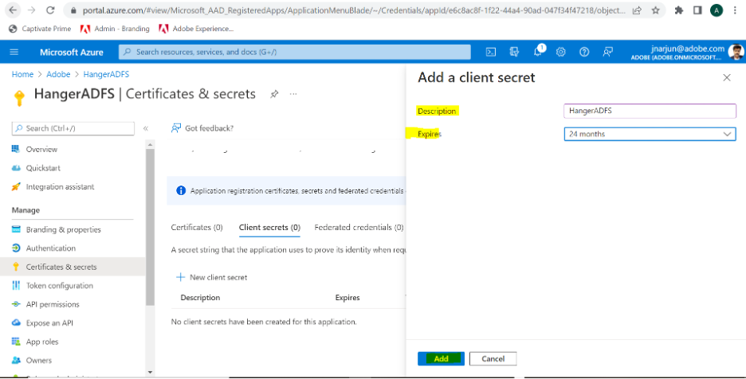-->

  <!--*Add description*-->

* 將數值和秘密複製到例如筆記本上。

  <!-- 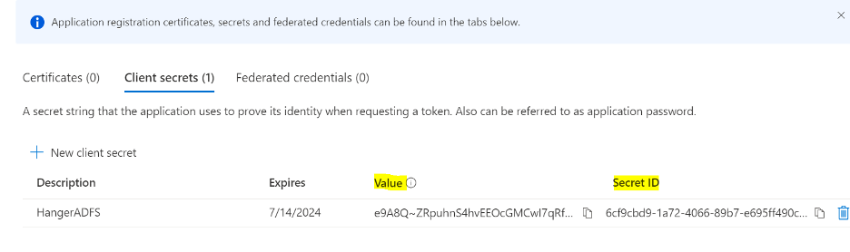-->

  <!--*Copy value and secret key*-->

* 選擇 **API 權限**。

  <!--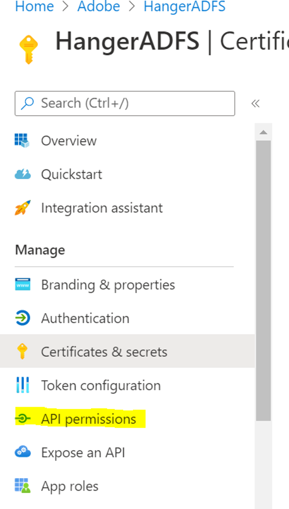-->

  <!-- *Left pane containing API Permissions*-->

* 選擇 **新增權限**。 另外，啟用「 **授予管理員同意**」這個選項。

  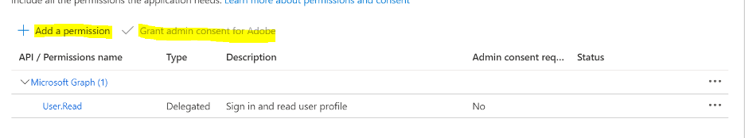

  *新增權限*

* 選擇 **Microsoft Graph**。

  <!--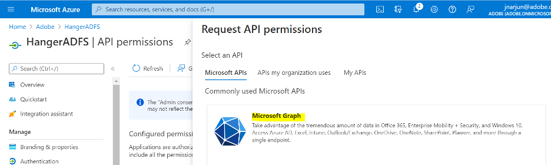-->

  <!--*Select Microsoft Graph*-->

* 選擇 **應用程式權限**。

  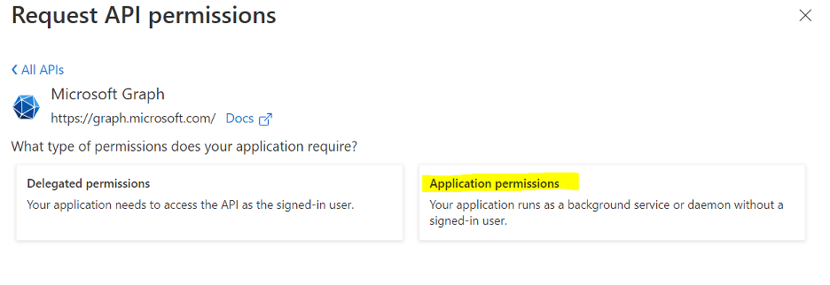

  *選擇應用程式權限*

* 搜尋目錄&#x200B;**&#x200B;並選擇&#x200B;**「讀取目錄資料**」。

  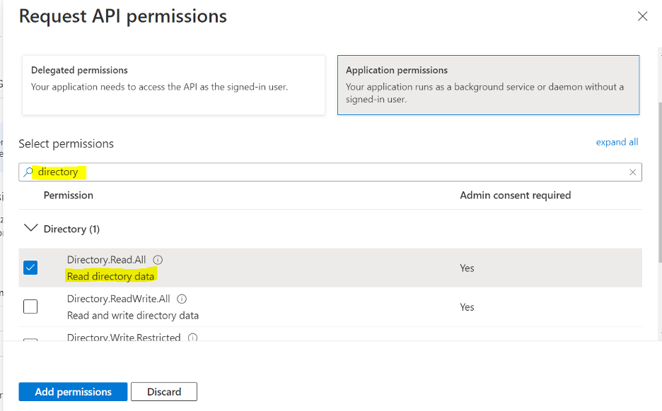

  *選擇讀取目錄資料*

* 輸入 *使用者* 作為搜尋詞。

  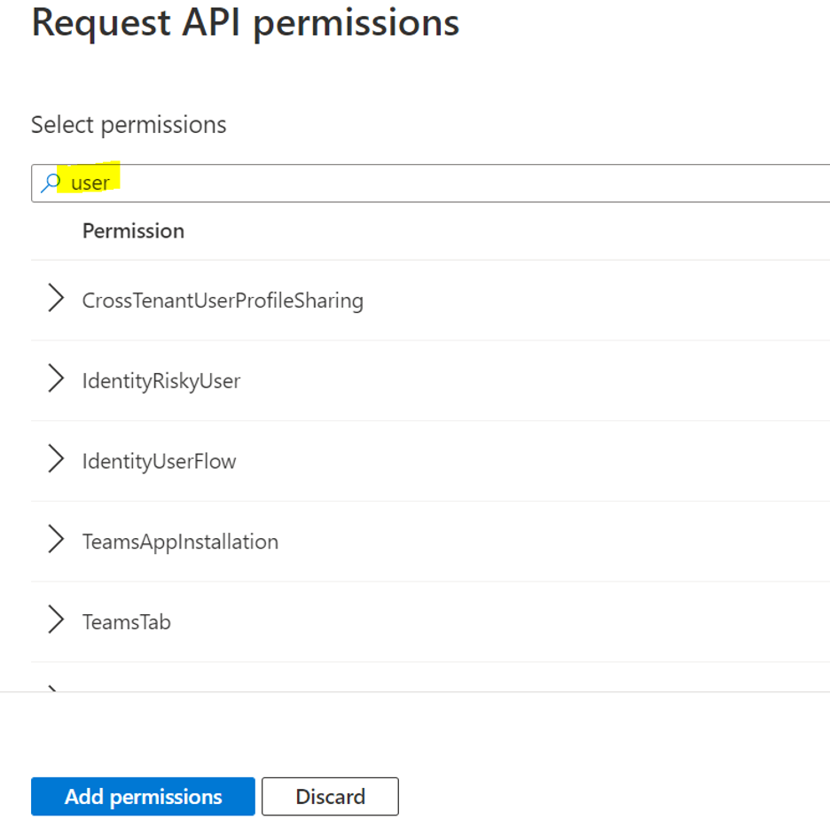

  *請輸入搜尋詞*

* 選擇 **「閱讀所有使用者的完整個人檔案**」。

  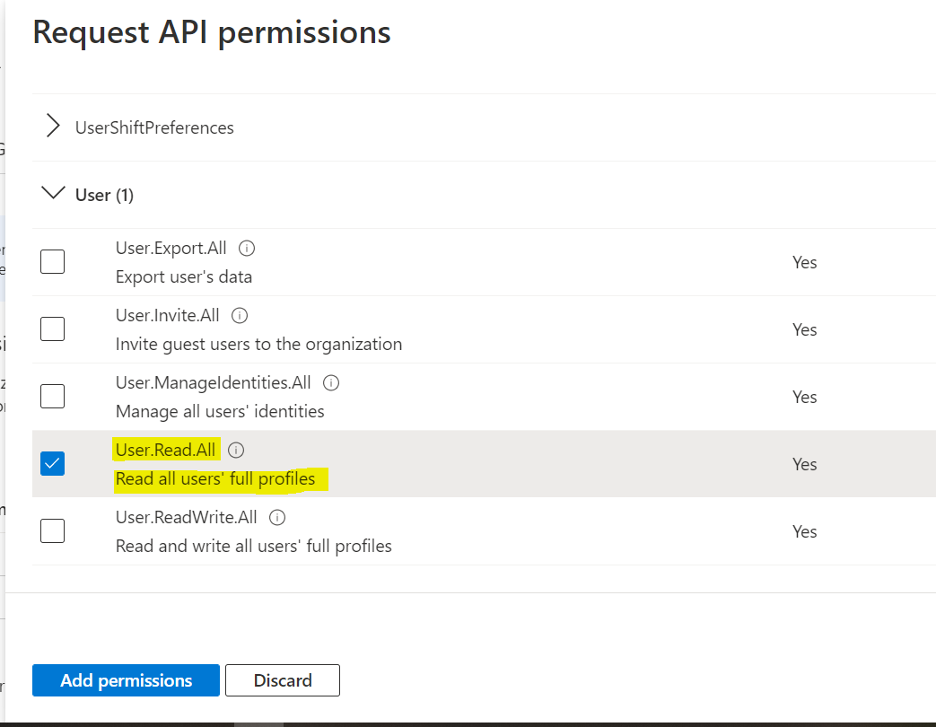

  *選擇「閱讀所有使用者的完整檔案」*

* 選擇 **新增權限**。

  <!--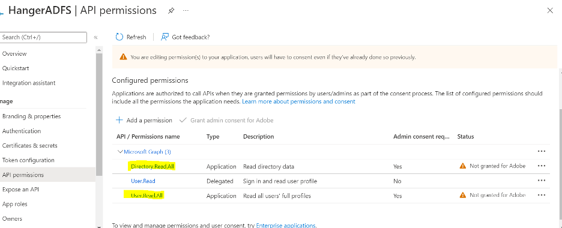-->

  <!-- *Select Add Permissions*-->

### ADFS 設定頁面 {#adfs-configuration-page}

1. 在 Adobe Learning Manager 的 ADFS 設定頁面，輸入你先前取得的客戶端 ID 和客戶端秘密。

   點擊 **[!UICONTROL Connect]**。

1. 登入 portal.azure.com **&#x200B;**。這些值會被填入租戶 ID 和主要網域欄位。

### 進口 {#import-8}

#### 地圖屬性 {#map-attributes-6}

整合管理員可以選擇 ADFS 屬性，並將其映射到對應的學習管理員可分組屬性。 映射完成後，後續使用者匯入會使用相同的映射。 如果管理員想要不同的匯入映射，也可以重新設定。

#### 自動使用者匯入 {#automated-user-import-4}

使用者匯入流程允許學習管理員從 ADFS 取得員工資料並自動匯入學習管理員。

#### 篩選使用者 {#filtering-users-4}

Learning Manager 管理員可以在匯入使用者前對使用者套用篩選。 例如，學習管理員管理員可以選擇將階層中所有使用者匯入一個或多個特定管理員。

若要設定 ADFS 連接器，請聯絡學習經理 CSM 團隊。

## 設定 ADFS 連接器 {#configure-adfs-connector}

1. 在學習管理員首頁，將滑鼠移到ADFS卡片/縮圖上。 選單出現了。 點選選單中的連接選項。

   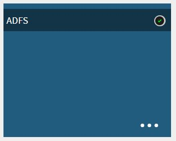

   *ADFS 縮圖*

1. 點擊連接以建立新的連線。 ADFS 連接器頁面會出現。 輸入你想要對應的帳號細節。

   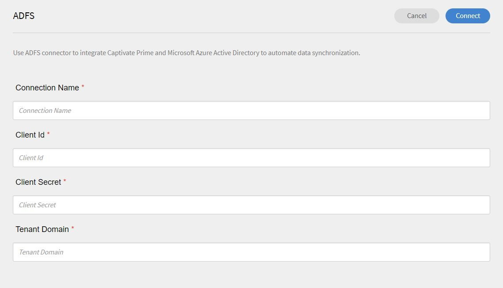

   *建立連結*

1. 如果你想直接匯入 ADFS 使用者作為學習管理員的內部使用者，請使用匯入內部使用者的選項。

   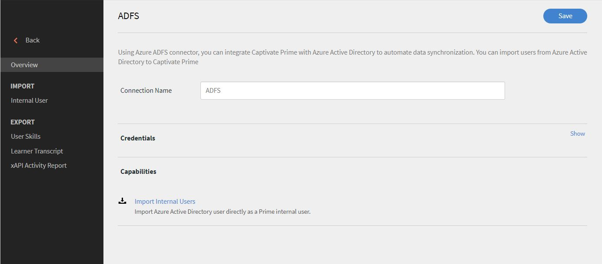

   *將使用者匯入至 Learning Manager*

1. 在地圖頁面左側可以看到學習管理員的欄位，右側則可以看到 ADFS 欄位。 選擇對應學習管理器欄位名稱的適當欄位名稱。

   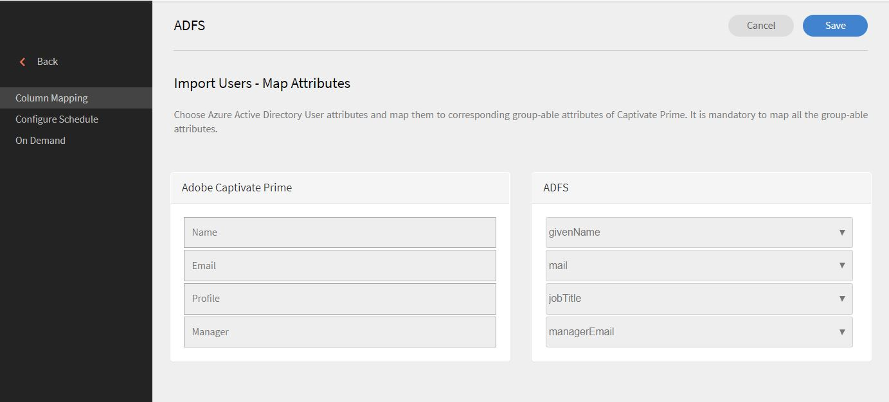

   *地圖屬性*

1. 作為管理員，若要查看和編輯資料來源，請點擊 **[!UICONTROL Settings]** > **[!UICONTROL Data Source]**。

   ADFS已建立的來源會被列出。 如果你需要編輯篩選，請點擊 **[!UICONTROL Edit]**。

   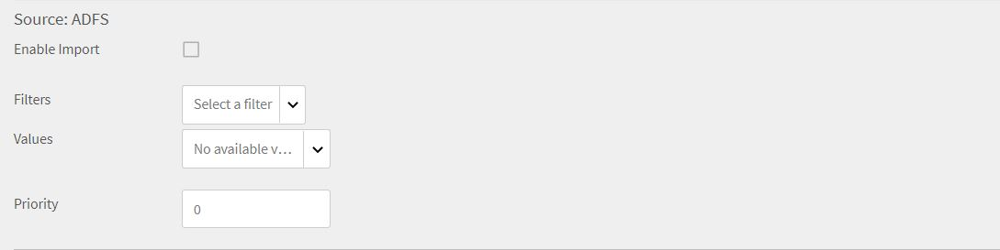
   *資料來源設定*

1. 匯入完成後，您會收到通知。 若要查看或編輯匯入日誌，請點擊 **[!UICONTROL Users]** > **[!UICONTROL Import log]**。

### 刪除連線 {#delete-a-connection-1}

要刪除已建立的 miniOrange 連線，請依照以下步驟操作。

## Adobe Connect {#connect}

1. 在 Adobe Connect 上，點擊卡片上的三個點，然後選擇 **「連接**」。
1. 點選 Adobe Connect 設定區塊中的 **「立即** 配置」連結。
1. 提供貴公司的 Adobe Connect 網域名稱及登入憑證。

   Adobe Connect 範例網址： ***mycompany.adobeconnect.com***

   您必須提供 Adobe Connect 帳號管理員的電子郵件 ID。

   >[!NOTE]
   >
   >Learning Manager 只支援 Adobe 主機的 Connect 帳號。 舉例來說;「.adobeconnect.com。」

1. 點擊 **[!UICONTROL Integrate]**。

   在驗證電子郵件 ID 後，Learning Manager 會顯示訊息，因為 Connect 已成功整合。 你可以開始使用 Adobe Connect 自動瀏覽虛擬教室課程。

   **Connect 帳號管理員驗證電子郵件 ID 後，請求會送交 Adobe Connect 後端團隊審核。 整合通常需要一兩天才能獲得批准和設定。**

   >[!NOTE]
   >
   >Adobe Connect 帳號管理員應同意使用 Adobe Connect 的條款與條件。 如果不接受，你的登入認證可能會失敗。 建立 Adobe Connect 帳號後，請登入一次。 首次登入時，會跳出條款與細則頁面。

### 新增虛擬教室課程資訊 {#add-virtual-classroom-session-information}

若虛擬教室課程的作者尚未提供課程資訊，管理員可包含課程細節。

在管理員登入時，點選VC課程名稱。 點擊左側窗格的實例和會話詳情。  點擊會話詳情頁面右上角的編輯圖示，即可新增會話資訊。

透過整合 Adobe Learning Manager 與 Adobe Connect 來建立虛擬教室模組或會議，您的 Connect 帳號應能支援有足夠數量會議室及同時使用者的會議室，以符合您的使用情境。 這些會議室用於承載學習管理員虛擬教室模組。 Learning Manager 會為 Learning Manager 內的每個虛擬教室模組或會議動態建立一個新的 Connect 會議室。

>[!NOTE]
>
>你必須另外購買 Adobe Connect，Adobe Learning Manager 除外。

### Adobe Connect 持久會議室 {#persistent}

在 Adobe Connect 中，客戶使用他們已在 Connect 中建立的現有會議室。 Connect 中的所有會議室皆為持久化，會議室範本也經過精心設計，以提供每個持久性會議室統一的體驗。

你可以利用 Adobe Connect 中已建立的教室之一建立虛擬教室。

學習管理員也允許學習者使用認證方式進入連線室進行虛擬會話。

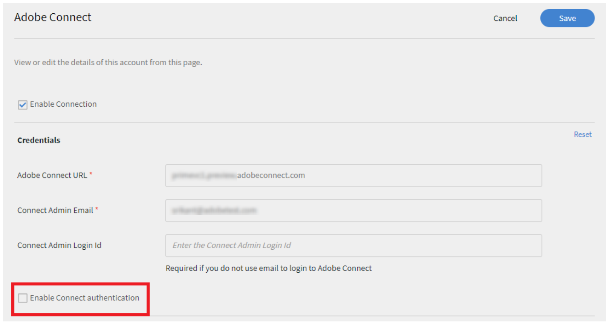
*Adobe Connect 認證*

使用 Adobe Connect 建立虛擬電腦模組時，可以選擇持久性房間。 若 **選擇 No** ，則會依舊建立動態會議室。

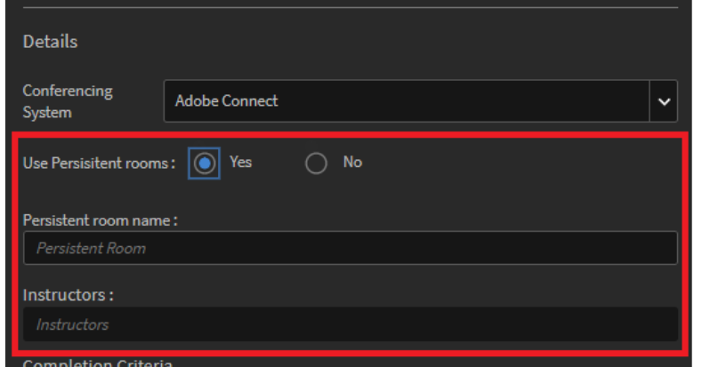
*持續房間選擇*

一旦學習者透過 Adobe Connect 完成課程，過一段時間後，課程錄影及密碼會顯示在 Learner 應用程式中。

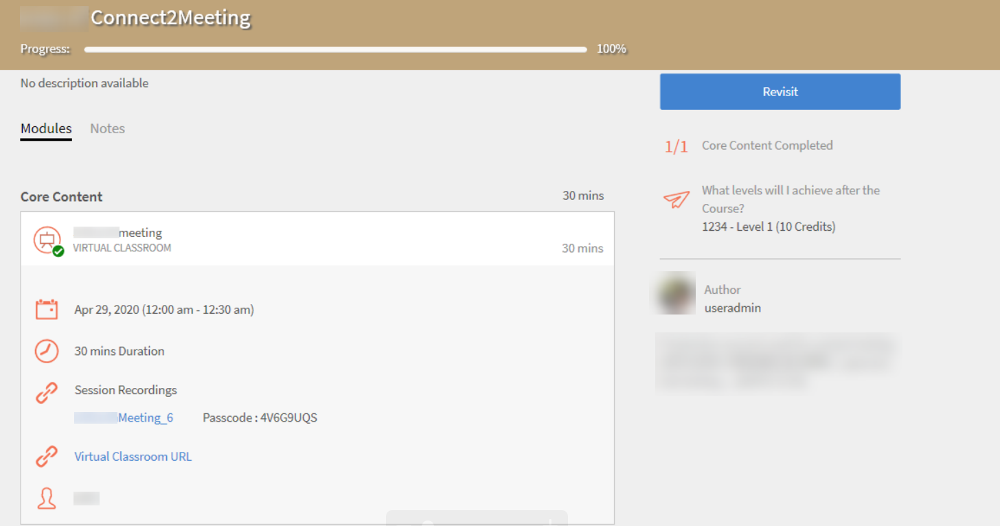
*Connect 錄音*

### 從 Adobe Connect 匯入測驗分數 {#quiz-adobe-connect}

將 Connect 測驗資料匯入 Learning Manager，並與現有的報告工作流程整合，讓 Learning Manager 使用者能從報告中取得測驗資料、使用者回應和分數，就像自學模組的測驗功能一樣。

在「連結」區塊中，若有學習者參加測驗課程或任何支持測驗報告的互動，所有學習者的互動都會被追蹤並完成。 課程必須是 Connect VC 培訓。

以下是該流程的簡要流程說明。

**Adobe Connect - 主機**

* Connect 的主機會建立課程並上傳包含測驗且互動的內容。
* 主持人會建立 **虛擬教室** 訓練，並儲存VC訓練內容。 主持人可選擇將上述課程連結至虛擬語音頻道，或在課程中使用 **Connect App 內的「分享課程** 」選項來分享課程。

**學習經理-作者**

* 作者在學習管理器中建立一門課程，模組類型為 **虛擬教室。**
* 從 **會議系統** 下拉選單中，選擇「連線」作為風險投資提供者。
* 選擇持續會議課程，並在 Connect 中選擇主機建立的虛擬客戶教室。 選擇教練。 儲存並發佈課程。

**學習經理 - 學習者**

* 課程發布後，學習者可報名參加該課程。
* 學習者會被導向到 Connect VC 會話，並由 Connect 主機允許他/她存取該 VC 會話。

**Adobe Connect - 主機**

* 在虛擬頻道的場次中，Connect 主持人會分享之前分享過的測驗。

**Adobe Connect - 學習器**

* 學習者完成測驗後結束測驗。

**學習經理 - 學習者**

* 學習者關閉會話，會話會自動同步。

**學習經理 - 行政**

* 當工作階段結束後，測驗匯入工作流程會在排程結束後啟動。
* 等排程啟動並完成處理後再說。 若要從整合管理端查看處理狀態，可以在 Adobe Connect 連接器中查看 **執行狀態** ，以觀察進度。 一旦執行成功，狀態會變成 **「完成**」。

* 管理員接著選擇先前建立的學習管理課程。 管理員會看到以下內容：

   * **出席與評分** - 顯示最終測驗分數及出席狀況。
   * **L2測驗成績**

      * **依使用者**&#x200B;分類 - 以積分&#x200B;**與**&#x200B;百分比&#x200B;**形式顯示最終測驗分數**。
      * **按題目** - 以報告表形式顯示測驗資訊。

## Marketo Engage 連接器 {#marketo}

Learning Manager 與 Marketo Engage 整合，這是一款協助執行行銷活動的行銷自動化軟體。

Marketo Engage 連接器設計用於在學習管理帳戶新增新用戶時，新增（或更新）Marketo Engage 資料庫中的潛在客戶。 它也會將使用者在 Learning Manager 中的學習行為（課程註冊、完成課程、技能指派及技能完成）作為自訂物件，與 Marketo Engage 中的相應潛在客戶關聯起來。 這讓行銷人員能利用這些資訊，根據從 Learning Manager 捕捉到的學習行為來鎖定受眾，並利用 Marketo Engage 的「智慧清單」等功能。

作為整合管理員，你可以將 Learning Manager 與 Marketo Engage 實例整合，以自動化資料同步。 你可以匯出內部使用者，匯出訓練註冊和技能完成活動。 這些操作可以依照排程執行，並可隨時設定。

為了讓學習管理員與你的 Marketo 帳號整合，你的 Marketo 帳號需要具備透過 API 建立結構的功能。

你可以從Marketo應用程式下載這三份報告：

* 使用者報告
* 學習成績單
* 使用者技能報告

當你建立 Marketo Engage 連結時，必須提供以下資訊：

* 連接名稱
* 客戶識別碼
* 客戶秘密
* Marketo Engage 網域

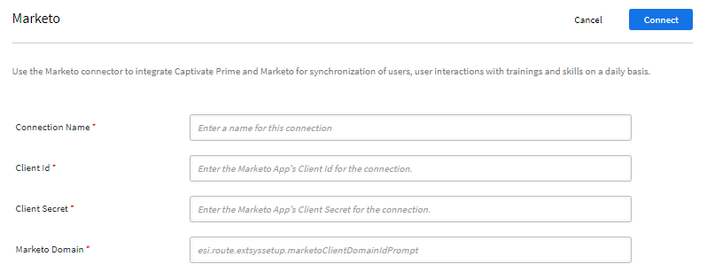

*輸入 Marketo 的憑證*

>[!NOTE]
>
>你可以從 Marketo Engage 應用程式取得客戶 ID 和秘密資料。 在 Marketo 應用程式中，你可以從 **LaunchPoint** 區塊取得客戶端 ID 和秘密，從 WebServices **區塊取得 Marketo 網域**。

在 **Learning Manager 應用程式中 Markeo Engage 連結的統一報告** 區塊，您可以根據以下條件建立廣告活動：

* 新增一個使用者到 Learning Manager
* 一位新使用者註冊了一門課程
* 一位新用戶已完成一門課程
* 學習者被註冊為一項技能
* 學習者已經掌握了一項技能

就像其他連接器一樣，你可以隨時排程並匯出資料。

### Marketo Engage 中的欄位映射 {#column-mapping-in-marketo-engage}

在 Marketo 中，有兩種類型的資料庫：

* 鉛資料庫
* 自訂物件資料庫

欄位映射用於建立潛在客戶資料庫。 潛在客戶是你從用戶報告匯出的使用者。

使用者報告中的欄位列於 Adobe Learning Manager 欄位下。 Marketo 欄位下方的欄位就是 Marketo 提供的欄位。 利用這兩個欄位，你可以將 Learning Manager 中的任何欄位對應到 Marketo 的欄位。 從學習管理器的欄位，你會加入 Marketo 的相關欄位。 在連結欄位後，會建立一個潛在客戶資料庫。

接著你可以在 Marketo 中查看所有匯出的使用者。

在 **Marketo 應用程式的自訂物件** 區塊中，你可以看到三個報告——學習者成績單、使用者技能和使用者報告——都齊全了。 這些報告前都會加上「cp_」**字串**。每一位被匯出到 Marketo 的新用戶都會被視為潛在客戶。

### 活動

將 Learning Manager 事件的資料匯出到 Marketo Engage 實例。 選擇要匯出到 Marketo Engage 資料庫的活動，可以按需或排程匯出。

* 新增使用者
* 更新使用者元資料
* 更新使用者活動
* 培訓招生
* 自我報名
* 技能完成

<!--
## BlueJeans Events {#bj-events}

BlueJeans Events connector connects Learning Manager and BlueJeans systems to automate data synchronization. Using this connector, you can:

* **Set up virtual sessions using BlueJeans Events:** Configure a new event in BlueJeans and setup a VC session in Learning Manager by selecting the appropriate BlueJeans event. Date and time details are picked automatically from the BlueJeans events.
* **Automated User Completion Syncing:** An Automated user completion syncing process allows the Learning Manager Administrator to fetch completion records for BlueJeans events automatically.

This new connector requires a separate set of credentials to configure the connector. The credentials of the existing BlueJeans Meetings connector will not work for BlueJeans Events connector.

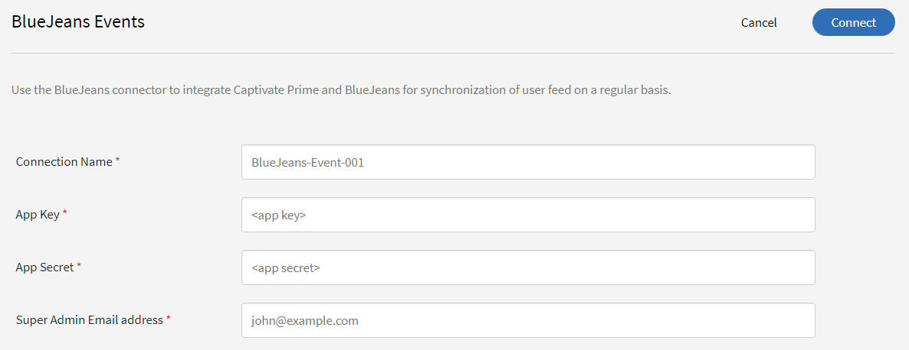 
*Credentials for BlueJeans Event Connector*

### Workflow {#workflow}

1. The BlueJeans Event moderator creates an event from within BlueJeans.
1. The author creates BlueJeans event course using the BlueJeans event url, which is created in future dates.
1. Since BlueJeans events have a similar title for multiple events, the author must append the event attendee url to the room name, so that he/she can choose the appropriate event.

   The format to enter event url: ***event name--event attendee url***

   For Dynamic rooms, the behavior is similar to that of Adobe Connect.

   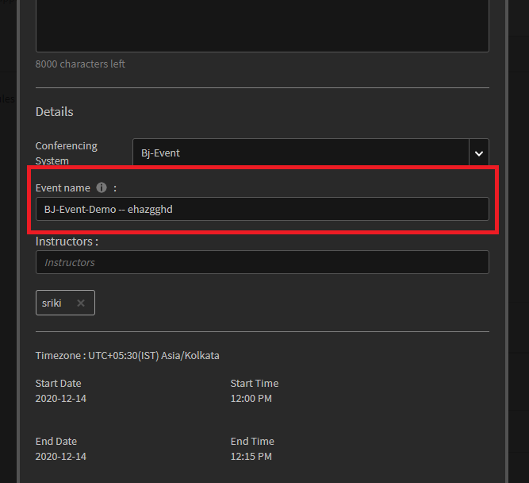
   *BlueJeans Events configuration*

1. Once the author enters the BlueJeans event url, the date and time will be auto populated.
1. Add an instructor to the event. The instructor will now have elevated privileges as a Presenter in a BlueJeans event.

Administrators, managers, and learners can enroll learners to the created course. Upon enrollment, the learner receives an email. The learner can sign in to their Learning Manager account to view the program details and take the course.

When the course is complete, the completion report gets triggered after a scheduled duration. The administrator can see the completion report to check the attendance and score of the learners.

If the BlueJeans Event moderator enables the recording during the session, after session ends, the recording is available in the learner app.

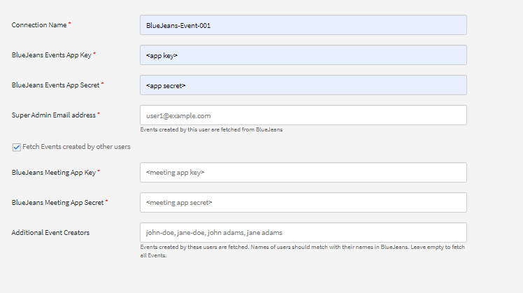
*BlueJeans Events configuration*

When you enable the check-box **Fetch Events created by the other users**, you can then add the list of BlueJeans event creators in the **Additional Event Creators** field. In the Author app, only events created by these users are searchable via the type-ahead field.

If the **Additional Event Creators** field is left blank, all events created in BlueJeans will be available for searching in the Author App.

The Author, in the Author app, then selects an event from the list of available events. In addition, the Author can add instructors to the event. These instructors in Learning Manager would become the presenters within BlueJeans events.

>[!NOTE]
>
>All users must belong to the same enterprise in BlueJeans Events App.

>[!NOTE]
>
>We've added a caching mechanism that improves the overall user experience. It is applicable when you select additional event creators. In this mode, the events are fetched the first time when an author searches for an event. The cache persists for 30 mins so that authors know how long they must wait to fetch the new events.
-->

## Microsoft Teams 連接器 {#microsoft-teams-connector}

Microsoft® Teams® 是一個持續性的聊天協作平台，支援文件分享、線上會議及其他商業溝通功能。

Adobe Learning Manager 使用虛擬教室連接器，可將 Microsoft Teams 會議整合進學習管理員。

Microsoft Teams 連接器連接學習管理器與 Microsoft Teams 系統，以啟用自動資料同步。 以下列表描述 Microsoft Teams 連接器的功能：

**使用 Microsoft Teams 設定虛擬會議**

這個連接器有助於將你的 Adobe Learning Manager 帳號與 Microsoft Teams 帳號整合。 整合後，該連接器使學習管理員的作者能使用 Microsoft Teams 作為 Learning Manager 中虛擬教室模組的技術服務提供者。

**允許 Microsoft Teams 在進入虛擬教室時驗證學習者**

會議組織者可以讓大廳限制進入會議，並控制 Microsoft Teams 提供的其他會議選項。

**使用自動使用者完成同步**

自動使用者完成同步流程允許學習管理員自動取得 Teams 會議的完成紀錄與錄音網址。

欲了解更多資訊，請參閱  [**在 Adobe Learning Manager**](install-microsoft-teams-connector.md) 安裝 Microsoft Teams 連接器。

## 訓練資料存取連接器 {#training-data-access}

>[!IMPORTANT]
>
>此特定功能僅在 Adobe Learning Manager 作為 Adobe Experience Manager 的附加元件銷售時使用。 課程資料24小時內就會過時。

>[!NOTE]
>
>本章節說明基礎架構運作方式，若想打造無頭或基於 AEM 的非登入體驗，請與我們聯繫。 我們會根據您的使用情境建議合適的方法。 此功能目前不提供自助服務。

這個 **[!UICONTROL Training Data Access]** 連接器讓你能打造無頭體驗。 此體驗可為獨立設計，或基於 AEM Sites 的自訂使用者介面。 它協助學生檢索並顯示訓練資訊，並支援搜尋與篩選功能。 啟用資料連接器後，將有一組公開 API 可用來建立介面，課程/學習路徑資訊將顯示給學習者。

### 設定連接器 {#configure-training-data-connector}

使用連接器 **[!UICONTROL Training Data Access]** 將您的 Adobe Learning Manager 帳號與資料儲存及搜尋系統整合。 這有助於你的 AEM Sites 介面取得訓練資料、顯示網頁，並為學習者提供更好的搜尋選項。

將 Adobe Learning Manager 的訓練元資料匯出至資料擷取與搜尋啟用服務，使用 API 進行。 你也可以建立排程來自動化這些匯出。

要配置訓練資料存取連接器，請依照以下步驟操作：

1. 在整合管理應用程式中，選擇 **[!UICONTROL Training Data Access]** > **[!UICONTROL Getting Started]**。
1. 在頁面&#x200B;**[!UICONTROL Getting Started]**&#x200B;上選擇&#x200B;**[!UICONTROL Next]**。
1. 輸入連線名稱和允許列出的網域。

   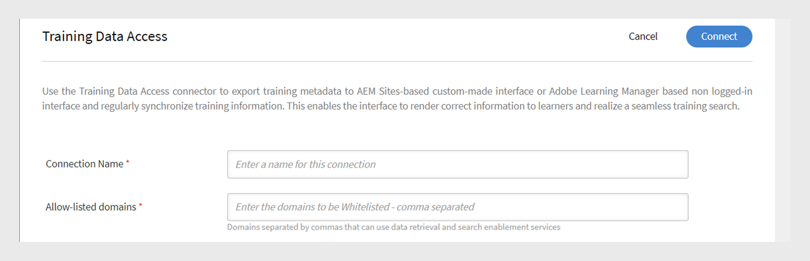類型為連線名稱與網域名稱

1. 從以下選項中選擇 **[!UICONTROL Type of interface]** ：

   * **[!UICONTROL Native Learning Manager]**：這是標準產品，僅提供原生介面。
   * **[!UICONTROL &#x200B; Headless interfaces]**：這是提供高品質服務，透過 API 來建立非登入體驗。

   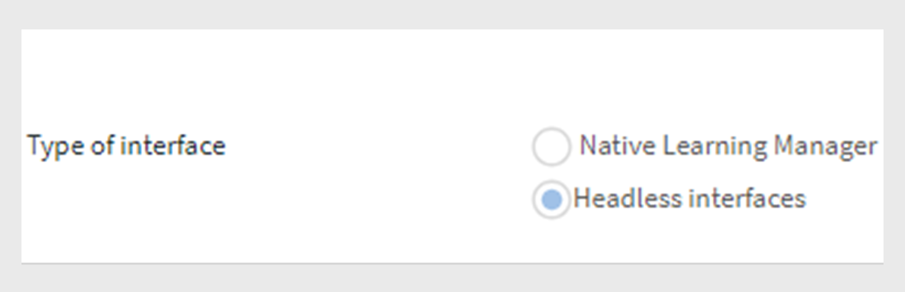介面類型

1. 選擇 **[!UICONTROL Connect]**。 基礎網址和 CDN 網址都會自動產生。
你可以利用這些網址透過 API 取得資料。

   >[!NOTE]
   >
   >使用高級服務的客戶會獲得與標準服務不同的網址。

1. 請在連接器頁面選擇 **[!UICONTROL Export Training Metadata]** 。
1. 選擇 **[!UICONTROL Enable training metadata export]** 使用此連線來匯出訓練資料。
1. 一旦啟用連線，所有課程映像檔、學習路徑和證書都會被遷移到 CDN。
1. 將課程、學習路徑及證書的元資料匯出至搜尋與檢索服務中。
1. 你可以選擇啟用排程選項來排程元資料匯出。 高階方案的排班會自動每三小時進行一次。
1. 對於按需報告，請前往 **[!UICONTROL On Demand]**，選擇 **[!UICONTROL Start date]**，然後 **[!UICONTROL click]** 執行。
你可以在頁面 **[!UICONTROL Execution Status]** 上查看報告執行狀態。

### 在 AEM 中建立網站 {#create-website-in-aem}

**前置條件：**&#x200B;從 GitHub 倉庫&#x200B;**[&#128279;](https://github.com/adobe/adobe-learning-manager-reference-site/releases/tag/1.0.0)安裝 AEM 套件**。

1. 使用基礎與擷取 URL、客戶端 ID、客戶端秘密和管理員刷新令牌，並在 AEM 中建立設定。
1. 使用 AEM 元件建立網站。
1. 發布網站。

欲了解更多資訊，請參閱此  [**文件**](../../adobe-learning-manager-integration-aem.md)。

### 學習者 {#learners}

已公布的網站會顯示所有已遷移的課程、證書及學習路徑清單，這些資料是從搜尋服務中取得的，供未登入學習者使用。

當學習者點擊課程、證書或學習路徑時，總覽頁面會啟動。 在頁面上，學習者報名後必須先登入，然後才能修讀課程。

### 未登入體驗 {#non-logged-in-experience}

未登入體驗讓你能為未登入用戶創造學習體驗。 例如，未登入體驗作為行銷活動的登陸頁，鼓勵用戶註冊。

Adobe Learning Manager 中的非登入體驗可以透過連接器 **[!UICONTROL Training Data Access]** 進行設定。 該連接器提供以下服務：

* 標準發行
* 高級服務

**標準發行**

標準方案是建置原生版本的 Adobe Learning Manager。 使用者可以建立僅示範、非登入的 headless 體驗。 示範 Headless 經驗無法擴展，且不應用於生產環境。

**高級服務**

此高級方案協助使用者建立無頭介面，介面由 **[!UICONTROL Training Data Access]** 連接器設定。 在混合式學習情境中，你還會看到即時的名額限制、已佔名額、候補名單限制和候補名單數量。 客戶可利用這些 API 建立搜尋與篩選功能，並為未登入學習者提供完整的課程摘要。

客戶可以購買高級方案，打造這種高度可擴展的非登入體驗。

>[!NOTE]
>
>請聯絡客服團隊或客服經理購買高級方案。

用戶購買方案後，CSM 團隊會為他們啟用高級方案。 透過訓練資料存取連接器，使用者可以設定未登入的體驗，並使用上述功能。

## Adobe Commerce 連接器 {#adobe-commerce-connector}

>[!NOTE]
>
>此特定功能僅在 Adobe Learning Manager 作為 Adobe Experience Manager 的附加元件銷售時使用。

>[!NOTE]
>
>此連接器也可用於試用帳號。

Adobe Learning Manager 現已整合至 Adobe Commerce，該平台旨在為 B2B 及 B2C 客戶打造電子商務體驗。

Adobe Commerce 是一款可擴展且可擴展的商務啟用解決方案，讓您能在單一平台上為 B2B 與 B2C 客戶打造多通路商務體驗。 使用 Adobe Commerce 連接器將您的 Adobe Learning Manager 帳戶與 Adobe Commerce 連結，實現學習平台上的電子商務功能。

啟用此連接器，並利用 Adobe Commerce 功能提供有償培訓。 請注意，你需要先另外購買 Adobe Commerce，才能用這個連接器與 Adobe Learning Manager 整合。

該連接器透過將訓練資料傳送至商務平台，讓學習者能夠付款並購買培訓，與 Adobe Commerce 整合。

除了啟動購買外，連接器還會從 Adobe Commerce 收集購買資訊，Adobe Learning Manager 用以驗證購買並解鎖培訓存取權限。

**先決條件**

1. 啟用  [RabbitMq](https://devdocs.magento.com/cloud/project/services-rabbit.html) 或其他任何訊息代理商。
1. 啟用  [CRON](https://devdocs.magento.com/cloud/env/variables-deploy.html#cron_consumers_runner)。
1. 步驟 1 和 2 時，請編輯以下檔案：

   1. .magento.app.yaml
   1. .magento/services.yaml
   1. .magento.env.yaml

1. 透過自訂模組限制覆蓋選項。 這是可選步驟，但對於大型資料集強烈建議這麼做。
1. 啟用頁面上的所有非同步 API。 由於資料量可能很大，匯出會以非同步方式進行。 Adobe Commerce 的 API 稱為請求有效載荷被傳送。 請求會將訊息推送到佇列，而佇列中有一個消費者，負責處理這些訊息並在商業端建立產品。 Adobe Commerce 預設不提供這種非同步處理。 這就是為什麼你必須啟用這個選項。
1. 在付款成功頁面新增返回 ALM 的連結。 此回郵網址必須在 Adobe Commerce 中設定。 連結所用的網址。 -  `https://learningmanager.adobe.com/app/learner#/postPayment`
1. 將索引從「儲存中」改為「排程中」。  欲了解更多資訊，請參閱此  [知識庫](https://support.magento.com/hc/en-us/articles/360040227191)。
1. 請施展以下補丁。 欲了解更多資訊，請參閱  [「套用補丁](https://devdocs.magento.com/cloud/project/project-patch.html)」。
1. 設定 Fastly。  Fastly 是雲端基礎架構上的 Adobe Commerce 所必需，並用於暫存與生產環境。 欲了解更多資訊，請參閱 [Set up Fastly](https://devdocs.magento.com/cloud/cdn/configure-fastly.html)。

### 設定連接器 {#configure-connector}

作為整合管理員，在 Adobe Commerce 連接器中點擊 **[!UICONTROL Connect]**。

在設定頁面輸入以下細節。 這些細節，也就是授權金鑰，可以在 Adobe Commerce 中取得。 一旦你在 Adobe Commerce 建立整合，憑證就會在那裡取得。

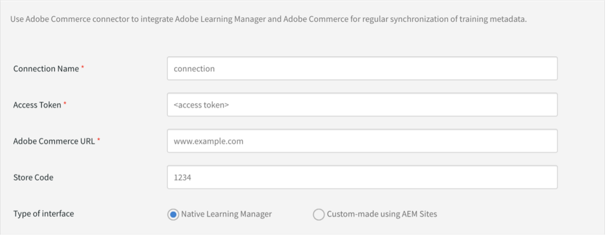
*配置 Adobe Commerce 連接器*

啟用 Adobe Commerce 連接器連線後，作者可設定課程、學習路徑或證書的價格。

課程、學習路徑或證書發布後，學習者可以透過學習者應用程式購買課程。

* **原生學習管理員：** 學習者可從學習管理員內購買課程、學習計畫或證書。 這僅適用於作者已加標價的情況。
* **利用 AEM 網站客製化：** 學習者可從 AEM 網站購買課程。

### 工作流程 {#workflow}

Adobe 商務管理員將學習管理員設定為整合系統。

作者將課程、學習路徑或證書標記為高級，並定價。 這個選項只有在帳號啟用電子商務時才會出現。 欲了解更多資訊，請參閱 [「建立課程](../../authors/feature-summary/courses.md)」。

課程或學習路徑在資料同步後，將無法購買。

### 匯出課程至 Adobe Commerce {#export-commerce}

在作者設定好各種課程、學習路徑或認證的價格後，作為整合管理員的你，將這些課程、學習路徑或認證匯出到 Adobe Commerce。

>[!NOTE]
>
>在 2024 年 3 月的 Adobe Learning Manager 版本中，我們引入了對 [Adobe Commerce 2.4.6](https://experienceleague.adobe.com/docs/commerce-operations/release/notes/adobe-commerce/2-4-6.html?lang=zh-Hant) 的支援。

1. 點擊 **[!UICONTROL Export Training Metadata]** > **[!UICONTROL On Demand]**。

1. 選擇日期。

1. 點擊 **[!UICONTROL Execute]**。 成功執行後，所有收費的課程或學習路徑將被移至 Adobe 商務。 學習者可從Learning Manager購買課程。

### Adobe Commerce 的原生學習管理器 {#learning-manager-with-commerce}

#### 學習者 {#learner}

作為學習者，您必須登入才能購買課程、證書或學習路徑。

要購買課程，請點擊「立即購買」。 您將被導向 Adobe Commerce 完成購買。 付款成功後，你會看到訊息提示返回學習管理員並開始課程。 你也必須另外登入 Adobe Commerce 才能完成購買。

當你從 ALM Native 或 AEM 購買課程、證書或學習路徑時，你會收到來自 ALM 和 Adobe Commerce 的電子郵件。

此外，你也可以啟用或停用 Adobe Commerce 的電子郵件。

### AEM 網站與 Adobe Commerce 合作 {#aem-sites-with-adobe-commerce}

啟用「使用 AEM 網站自訂」選項後，作為學習者，你可以從自訂的 AEM 網站購買課程。

AEM 網站會包含 Learning Manager 的所有元資料，方便透過 Adobe Commerce 進行搜尋。 課程是從 Adobe Commerce 取得的，且未登入案件。

無論是登入或未登入的體驗皆有可能。 未登入的使用者可搜尋並瀏覽課程目錄、學習計畫及證書。 不過，如果你想購買課程，必須登入 AEM 網站。

與原生 Learning Manager 相同，登入後，您可以將課程加入購物車，然後預覽或購買該課程。

### 設定 Adobe Commerce 連接器 {#setup-commerce-connector}

#### 先決條件 {#pre-requisites}

管理員在管理員應用程式的設定>一般&#x200B;**中啟用「啟用培訓**&#x200B;**定價」的勾選框**。若啟用此選項，作者可指定訓練費用。 當你新增 Adobe Commerce 連線時，這個勾選框會自動被選中並強制執行。

Adobe Learning Manager 支援電子商務買賣訓練。 在這裡，用戶可以販售培訓，促進產品的升級銷售與交叉銷售。

透過 Adobe Commerce 的整合，Adobe Learning Manager 支援培訓的買賣，提供更完整的客戶體驗，適用於客戶夥伴教育情境。

此整合的主要目標如下：

* 使用者可透過 Adobe Learning Manager 或 Headless 學習介面銷售課程來創造收入。
* 啟用 Adobe Commerce 與平台整合，使用 Learning Manager 的原生應用程式和 AEM 銷售課程。
* 允許學習經理的客戶以付費課程的形式提供正式學習。
* 讓學習者在決定購買培訓前能預覽課程。

#### Adobe Learning Manager 原生版 {#native-learning-manager}

**整合管理員**

1. 在整合管理員頁面，新增 Adobe Commerce 連接器。 從 Adobe Commerce 建立的應用程式取得認證。
1. 啟用 Adobe Commerce 後，電子商務也會在 Adobe Learning Manager 中啟用。 Learning Manager 與 Adobe Commerce 的資料會依照排程同步。 資料包含所有訓練（已付費）以及元資料（使用者、技能、作者姓名、價格等）。

>[!NOTE]
>
>Adobe Learning Manager 和 Adobe Commerce 有不同的登入方式。

### AEM {#aem}

在此模式下，學習者會從基於 AEM 的網站上完成課程，該網站由基於 AEM 的範本與元件建置而成。

在 AEM 網站上，學習者支援購物車、加入購物車按鈕、從購物車中刪除課程等功能。

若使用者未登入，仍可搜尋課程目錄並查看課程詳情，但無法購買課程。 作為學習者，若想購買課程，必須登入。

學習者購買課程後，會被導向註冊州的課程總覽頁面，並可參加已購買的培訓。

#### 無頭-未登入 {#headless-non-logged-in}

學習者可以：

* 從搜尋欄搜尋任何訓練。
* 請依照預算範圍篩選任何訓練。

學習者不能：

* 請從概覽頁面購買課程。
* 預覽付費內容。

#### 無頭者 - 已登入 {#headless-logged-in}

學習者可以：

* 探索、瀏覽、搜尋及篩選付費或免費的培訓課程。

* 將課程加入購物車，然後結帳購買。
* 在購物車中新增、更新或刪除培訓課程。
* 同時支付多門培訓課程費用。
* 在 Player 中預覽付費課程。
* 如果有付款錯誤，請查看訊息。

* 購買課程後，請在電子郵件中查看發票附件。

#### 隨選同步 {#on-demand-sync}

Learning Manager 與 Adobe Commerce 之間的同步每天會發生兩次。 管理員啟用電子商務帳號後， **啟用此連線** 選項的「啟用訓練中繼資料匯出」功能，會將課程映像檔、學習路徑及憑證儲存在公開的 CDN 中。

若資料未同步，學習者將無法看到價格資訊。

對於原生 Learning Manager，若啟用電子商務且 Learning Manager 與 Adobe Commerce 同步完成，學習者可瀏覽或搜尋免費或付費培訓。

AEM 沒有立即購買，只有 **加入購物** 車按鈕。 若未執行同步，此按鈕也會保持停用狀態。

#### 常見問題 {#faqs}

+++哪些課程無法購買？

課程如定期認證、內容市場訓練、已取得的培訓、連結者培訓、工作輔助工具及經理核准/提名課程，皆不可由學習者購買。
+++

+++學習者成績單與培訓報告有變動嗎？

這些報告顯示帳戶中所有已購買訓練的價格與購買日期。
+++

+++學員可以報名免費培訓嗎？

是的，學員可以報名免費培訓。 免費訓練時，在訓練概覽頁面顯示預覽與報名按鈕。
+++
