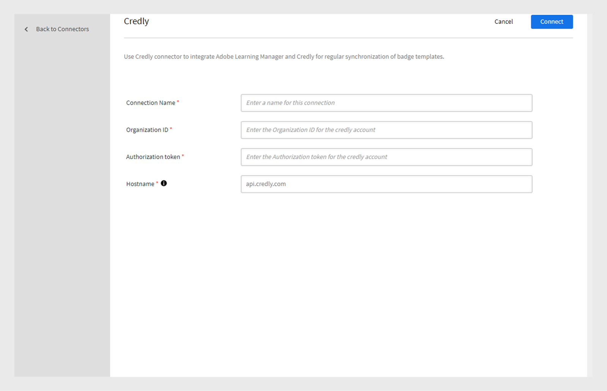

# Credly

[Credly](https://info.credly.com/) 是一個數位認證平台，讓學習者和組織能夠獲得、分享並驗證專業成就，例如徽章或證照。 學習者可以透過 Credly 個人檔案在社群媒體及其他平台管理並分享徽章。

## 先決條件

為您的組織設立一個 Credly 帳號。 在 Adobe Learning Manager 中使用學習者的電子郵件 ID 將學習者加入 Credly。 這將讓學習者能在 Credly 和 Adobe Learning Manager 上看到徽章。

## 將 Credly 連接器加入 Adobe Learning Manager

請依照以下步驟將 Credly Connector 加入 Adobe Learning Manager：

1. 登入為 **[!UICONTROL Integration Admin]**。
2. 選擇 **[!UICONTROL Credly]** > **連接** 以將連接器加入 **[!UICONTROL Credly]** Adobe Learning Manager。

   
   _新增 Credly 連接器_

3. 輸入 **[!UICONTROL Connection Name]**.。
4. 輸入 **[!UICONTROL Organization ID]** &amp; **[!UICONTROL Authorization token]**。

   >[!NOTE]
   >
   >Credly 中的每個徽章都附有一個組織識別碼和授權憑證。 從 Credly 複製這些數值。

5. 輸入 並 **[!UICONTROL Hostname]** 選擇 **[!UICONTROL Connect]**。

## 從 Credly 遷移徽章

Adobe Learning Manager 的badge.csv允許你從現有的 LMS 或外部系統遷移徽章。 badge.csv已更新，新增了兩個專欄：

* externalBadgeId
* externalBadgeProvider

外部徽章 ID 指的是 Credly 平台中的徽章範本 ID，而外部徽章提供者則是 Credly。 在badge.csv中加入這些數值，並依照遷移手冊[&#128279;](https://experienceleague.adobe.com/zh-hant/docs/learning-manager/using/integration/migration-manual#migrationprocedure)中提到的步驟遷移 csv。

## 創建一項技能 - 管理員

一旦徽章匯入 Adobe Learning Manager，管理員即可將此徽章建立為技能。 想了解如何創建技能，請參閱 [「創建與修改技能](https://experienceleague.adobe.com/zh-hant/docs/learning-manager/using/admin/skills-levels)」。

### 將技能/徽章分配給學習對象- 作者

作者/管理員可以將這些 Credly 匯入的 ALM 徽章分配到課程、學習路徑或認證（不僅限於技能），並利用這些學習物件後，徽章即被授予，並可在 Credly 及 ALM App 上查看。

學習者可以登入 Credly，查看 Credly 平台的徽章。 透過 Credly，他們可以在 LinkedIn 等外部平台及其他社群媒體分享徽章。
