# Adobe Learning Manager開發人員手冊

## 概觀

Adobe Learning Manager提供RESTful API，讓開發人員能夠有效地整合及自訂應用程式或工作流程。 開發人員手冊提供如何使用這些API的指引，涵蓋驗證、資料模型以及與其他應用程式整合等主題。 此外，本指南[API參考檔案](https://learningmanager.adobe.com/docs/primeapi/v2/)可協助開發人員建立與Adobe Learning Manager各種功能互動的外部應用程式或後端工作流程，包括課程建立、追蹤學習者進度、技能對應、認證、gamification和成績單。

本手冊涵蓋下列內容：

* OAuth2.0驗證
* API物件模型
* 包含、欄位和其他引數
* 真實使用案例

>[!IMPORTANT]
>
>本開發人員手冊僅涵蓋Adobe Learning Manager V2 API。 本指南中說明的所有範例、請求結構和驗證工作流程都特定於/primeapi/v2/端點。 如需舊版或已棄用API的詳細資訊，請參閱[API參考檔案](https://learningmanager.adobe.com/docs/primeapi/v2/)。

## API使用案例

開發人員可以使用Learning Manager API來增強或整合Learning Manager與其他企業應用程式。 您可以使用任何技術建立網頁、案頭或行動應用程式。 開發人員可以存取Learning Manager資料，但您可以控制應用程式的使用位置及使用方式。

## 使用OAuth 2.0進行驗證

若要安全地存取Adobe Learning Manager API，您必須使用Adobe Learning Manager的OAuth 2.0機制進行驗證。 此程式包括註冊您的應用程式、產生授權代碼、將其交換為重新整理權杖，最後使用重新整理權杖來取得存取權杖。

### 註冊應用程式

將Adobe Learning Manager與外部應用程式整合，以強化多功能性。 這些步驟涉及存取整合管理員介面、註冊應用程式，以及取得使用者端ID和密碼。 從Adobe Learning Manager產生OAuth 2.0驗證權杖，包括授權、重新整理和存取權杖。 使用OAuth 2.0流程以安全地驗證及授權您的應用程式。 存取權杖的有效期為七天。

1. 以整合管理員的身分登入Adobe Learning Manager。
2. 在左窗格中選取&#x200B;**[!UICONTROL Applications]**。

   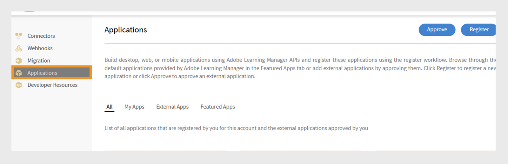

3. 選取&#x200B;**[!UICONTROL Register]**&#x200B;並新增下列資訊：

   * **[!UICONTROL Application Name]**：輸入應用程式的名稱（最多50個字元）。
   * **[!UICONTROL URL]**：您公司或應用程式的官方URL。 用於識別和參考。
   * **[!UICONTROL Redirect Domains]**：指定Adobe Learning Manager在授權後可重新導向的網域(例如[http://learningmanager.adobe.com](http://learningmanager.adobe.com))。  您可以指定多個有效的URL。
   * **[!UICONTROL Description]**：應用程式功能的簡短說明。
   * **[!UICONTROL Scopes]**：選取六個可用選項之一，以定義應用程式的範圍。 根據您在此處提及的選擇，您的應用程式可以存取Learning Manager API端點。 例如，如果您選擇學習者角色讀取存取權，則您的應用程式能以唯讀方式存取所有Learning Manager學習者API端點。

      * 管理員角色讀取/寫入存取權：允許應用程式以管理員身分存取或修改資料。
      * 學習者角色讀取/寫入存取權：允許應用程式存取或修改學習者的資料。
      * xAPI讀取/寫入存取權：讓應用程式可存取及傳送Experience API (xAPI)陳述式。

   * **[!UICONTROL For this account only?]**

      * **[!UICONTROL Yes]** — 如果您選擇[是]，則其他帳戶管理員看不到該應用程式。
      * **[!UICONTROL No]** — 如果您選擇[否]，其他帳戶管理員也可以存取此應用程式，但他們需要使用應用程式ID來存取此應用程式。 應用程式ID會以Learning Manager應用程式的編輯模式產生和顯示。

     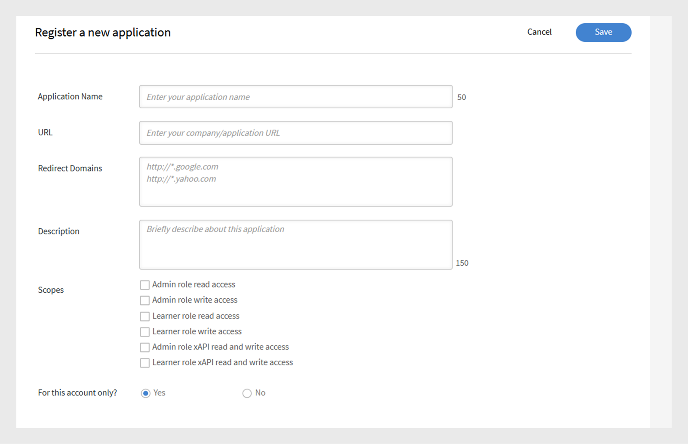

4. 選取&#x200B;**[!UICONTROL Save]**&#x200B;以註冊應用程式。

   * 註冊應用程式後，可在帳戶中建立的應用程式清單中找到該應用程式。 選取應用程式，除了先前輸入的欄位外，您將會看到下列內容：
   * 應用程式ID：這是使用者端識別碼。 此ID會通知Adobe Learning Manager要求存取的應用程式。 它包含在API要求中，用來識別應用程式。
   * 應用程式密碼：這可用來在權杖交換步驟期間（例如，要求重新整理權杖或存取權杖時）驗證您的應用程式並驗證其身分。

   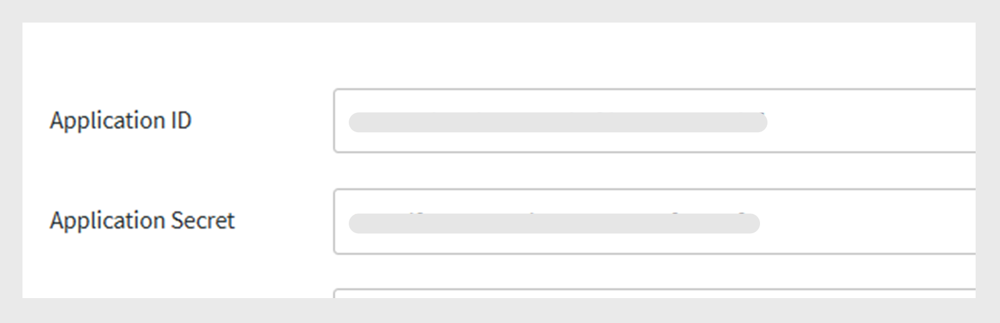

## 取得存取權杖

### 從重新導向取得授權代碼

取得使用者端ID和使用者端密碼後，請使用它們來要求用來驗證API呼叫的存取權杖。

若要開始授權代碼流程，請在瀏覽器中新增下列URL：

```
GET https://learningmanager.adobe.com/oauth/o/authorize?client_id=<Enter your clientId>&redirect_uri=<Enter a url to redirect to>&state=<Any String data>&scope=<one or more comma separated scopes>&response_type=CODE 
```

當使用者授權應用程式後，Adobe Learning Manager將重新導向至指定的redirect_uri，並附加查詢引數：

[https://yourapp.com/callback?code=abc123xyz](https://yourapp.com/callback?code=abc123xyz)

引數程式碼會與重新導向URI一起附加。

### 從程式碼取得重新整理Token

取得程式碼後，請使用任何API工具，並新增下列POST請求：

```https://learningmanager.adobe.com/oauth/token ```

**要求內文(x-www-form-urlencoded)**：

```
grant_type=authorization_code  
&code=abc123xyz  
&client_id=<your_client_id>  
&client_secret=<your_client_secret>  
&redirect_uri=<your_redirect_url> 
```

**回應**

```
{ 

  "access_token": "eyJhbGciOiJIUzI1...", 
  "refresh_token": "xTjlfz0jCk6gF1...", 
  "expires_in": 604800, 
  "token_type": "Bearer" 

} 
```

使用Authorization標頭中的access_token提出已驗證的API請求。

### 在API呼叫中使用存取權杖

使用下列專案驗證存取權杖：

```
GET https://learningmanager.adobe.com/oauth/token/check?access_token=<access_token> 
```

存取權杖的有效期為七天。 七天後，您必須使用重新整理權杖產生新的存取權杖。 如果您在現有存取權杖仍然有效的情況下，從重新整理權杖產生新的存取權杖，則會傳回現有的權杖。

### 取得用於測試和開發的存取權杖

使用Adobe Learning Manager API時，開發人員需要有效的OAuth 2.0存取權杖來驗證API請求。 透過標準OAuth流程產生此代號可能很複雜且耗時，尤其是快速測試、學習或開發時。 Adobe Learning Manager提供代號產生工具來簡化此程式。

此工具適用於以下期間：

* 概念證明(POC)組建

* 早期開發

* 疑難排解API整合問題

這些權杖僅供您在開發和偵錯階段個人使用。 請記住，測試權杖會授與您Adobe Learning Manager資料的存取權，因此安全地處理這些資料至關重要。 切勿與他人共用您的測試Token、在生產應用程式中使用它們，或將其納入公開程式碼存放庫。 將其視為密碼，以確保您的帳戶和資料的安全。

1. 以整合管理員身分登入Adobe Learning Manager。
2. 選取&#x200B;**[!UICONTROL Developer Resources]**，然後選取&#x200B;**[!UICONTROL select Access Tokens for Testing and Development]**。

   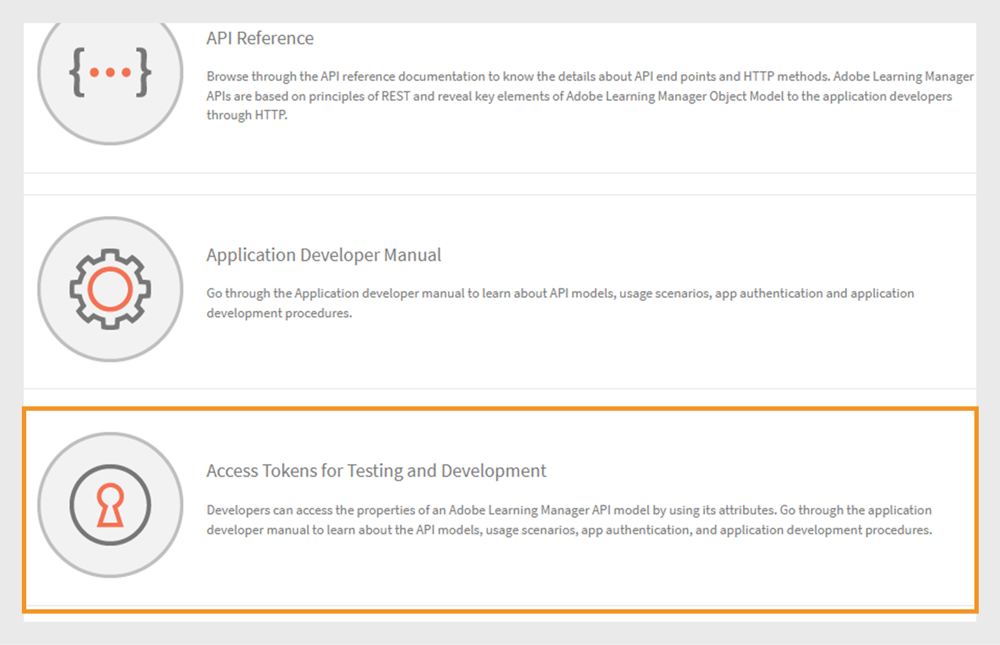

3. 輸入您在建立應用程式以取得OAuth程式碼之後取得的&#x200B;**[!UICONTROL Client ID]**。 然後選取&#x200B;**[!UICONTROL Submit]**。

   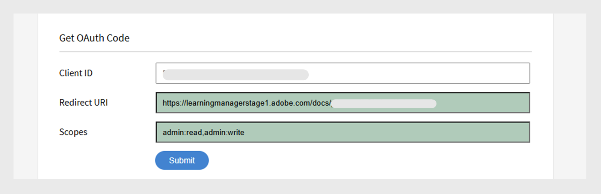

4. 新增&#x200B;**[!UICONTROL Client ID]**&#x200B;和&#x200B;**[!UICONTROL Client Secret]**&#x200B;以取得重新整理權杖。 然後選取&#x200B;**[!UICONTROL Submit]**。 OAuth是上一步驟中的預先填入。

   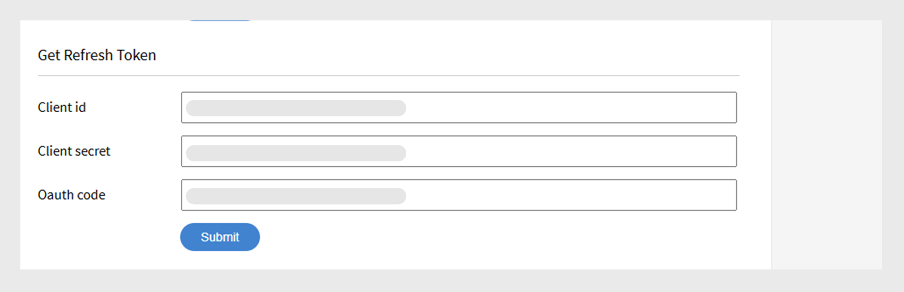

5. 新增使用者端ID和使用者端密碼以取得存取權杖。 然後選取&#x200B;**[!UICONTROL Submit]**。

   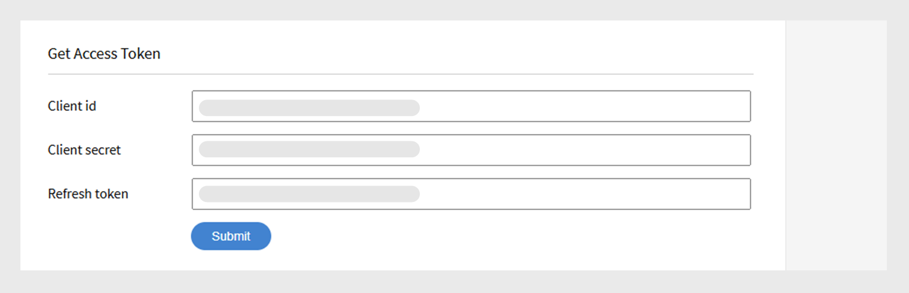

6. 新增存取權杖並選取「提交」以取得存取權杖詳細資料。

   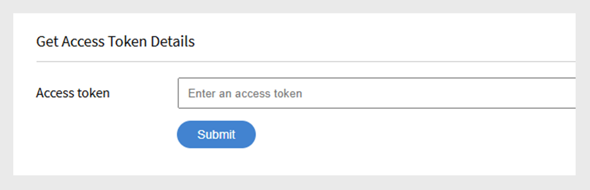

選取&#x200B;**[!UICONTROL Submit]**&#x200B;後，存取權杖即會驗證，而您將收到下列JSON物件：

```
{ 
  "access_token": "access token", 
  "refresh_token": "refresh token", 
  "user_role": "admin", 
  "account_id": "1234", 
  "user_id": "123456", 
  "expires_in": 604800 
} 
```

和之前一樣，測試的存取Token會在七天後過期。

### 使用API工具來測試端點

雖然您可以使用任何協力廠商API測試工具，但我們將使用Postman來測試端點。 本檔案中的範例使用Postman來測試端點。

1. 開啟Postman並建立新請求。
2. 選取「授權」標籤。
3. 將「驗證型別」設定為「持有人權杖」。

   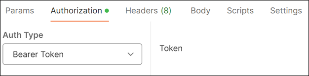
4. 將您從上一節取得的存取權杖貼到「權杖」欄位中。

   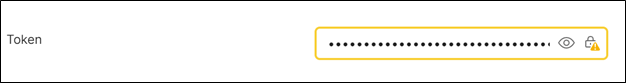

5. 在Headers索引標籤中新增以下內容。

   * 索引碼：Accept
   * 值： application/json
6. 在URL欄位中輸入您的API端點。 範例： [https://learningmanager.adobe.com/learningManager/api/v2/users](https://learningmanager.adobe.com/learningManager/api/v2/users)
檢視[Adobe Learning Manager API參考](https://learningmanager.adobe.com/docs/primeapi/v2/)以取得詳細資訊。
7. 選取「傳送」以提出API請求。

## API型別

### 管理API

Adobe Learning Manager的管理員API可讓管理員大規模自動化及管理學習作業。

使用管理API，開發人員可以：

>[!NOTE]
>
>此清單並非詳盡無遺。

* **管理使用者和群組**：建立、更新和刪除使用者，或將它們指派給群組。
* **註冊學習者**：自動註冊課程、學習路徑或認證。
* **追蹤學習者進度**：擷取課程/模組進度、測驗分數和完成狀態。
* **產生報表**：存取學習者活動、參與和績效的資料。
* **管理內容**：建立及組織課程和學習物件。

檢視[Adobe Learning Manager API參考](https://learningmanager.adobe.com/docs/primeapi/v2/)以取得詳細資訊。

### 學習者API

學習者API是專為已驗證身分的使用者（學習者）所設計，可讓您存取學習者特定資訊。 這些API允許完成如下的工作：

* 存取學習者的課程和進度
* 擷取已獲得的徽章或認證
* 更新學習者設定檔資訊
* 檢視與已完成課程相關的技能

**關鍵點：**

* 這些API需要經過驗證的使用者權杖，以確保資料安全性和隱私權。
* API適用於使用者已完整註冊及登入的情況，而非匿名或共用使用者。

檢視[Adobe Learning Manager API參考](https://learningmanager.adobe.com/docs/primeapi/v2/)以取得詳細資訊。

## API設計和常用引數

這些API可讓開發人員存取重要的Learning Manager資源，例如使用者、課程、技能、認證和學習計畫。 它遵循REST原則，使用HTTP方法(GET、POST、PUT、DELETE)進行資料作業。

| | |
|--|--|
| 方法 | GET， PUT， POST， DELETE |
| 格式 | application/vnd.api+json， application/json。 [深入瞭解](https://developer.mozilla.org/en-US/docs/Web/HTTP/Guides/MIME_types/Common_types)常見的MIME型別。 |
| 基礎URL | [https://learningmanager.adobe.com/primeapi/v2/](https://learningmanager.adobe.com/primeapi/v2/) |

### 通用引數

| 參數 | 用途 |
|--|--|
| 包含 | 透過一次呼叫取得相關資源。 |
| 欄位 | 選取特定屬性以減少裝載。 |
| 篩選 | 縮小結果（例如，依ID、名稱） |
| sort | 排序結果。 |
| 頁面[限制]，頁面[位移] | 分頁支援。 |

以下簡要說明各項：

### 包含

在建立自訂應用程式或Headless LMS時，可使用Adobe Learning Manager API來擷取有用的資訊。 此API端點可以進一步與其他「包含」引數一併包含，以擷取與預設所接收資料相關的其他資訊。 這些關係屬於資料模型關係，例如，呼叫以取得使用者詳細資料時，您將會收到使用者資訊，以及經理ID與Adobe Learning Manager帳戶ID的關係。 使用include引數，您可以詳細擷取其他詳細資訊以及使用者詳細資訊，例如其管理員詳細資訊和Adobe Learning Manager帳戶詳細資訊。
簡而言之，**include**&#x200B;引數用於API呼叫，以擷取單一回應中的相關（連結）資源以及主要資源。 如果您想要存取巢狀或相依資料（例如課程的模組或對應至學習者的技能），而不需進行個別的API呼叫，這個函式就十分實用。

主要優點：

* 減少多個API呼叫：避免手動要求每個相關資源。
* 提高效率：加快開發速度、減少伺服器負載，並加快資料轉譯速度。
* 確保資料一致性：擷取一致快照中的所有相關資料。

**如何使用包含引數**

將include引數附加至API URL，並指定要包含的相關實體。

**通用包含路徑**

| 包含值 | 說明 |
|---|---|
| 執行個體 | 傳回學習物件的所有執行個體 |
| 註冊 | 傳回使用者的註冊詳細資料 |
| instances.loResources.resources | 擷取執行個體內的模組和資源 |
| supplementaryResources | 傳回關聯的補充資源 |
| skills.skillLevel.badge | 擷取技能層級及其相關徽章 |
| prerequisitedlos | 包含必要的學習物件 |
| sublos | 擷取子學習物件（用於LP或認證） |
| subLOs.enrollment | 子學習物件註冊 |
| instances.badge | 已指派完成課程例項的徽章 |
| subLOs.subLOs.instances.loResources.resources | 子LO執行個體中的深度巢狀資源 |

**範例1**

在端點中使用userID引數擷取使用者的詳細資訊。

```
https://learningmanager.adobe.com/primeapi/v2/users/<userID>
```

```
GET https://learningmanager.adobe.com/primeapi/v2/users/<userID>
```

在回應中，您可以看到資料物件與帳戶和使用者的管理員有關係。

```
"relationships": {
            "account": {
                "data": {
                    "id": "1010",
                    "type": "account"
                }
            },
            "manager": {
                "data": {
                    "id": "3400476",
                    "type": "user"
                }
            }
        }
```

使用請求中的包含引數，您可以擷取有關管理員的詳細資訊，如下所示：

```
GET https://learningmanager.adobe.com/primeapi/v2/users/<userid>?include=manager
```

**範例2**

若要擷取課程詳細資訊，請使用端點呼叫中的include引數。 下列端點會取得課程資訊及其關係。

```
GET https://learningmanager.adobe.com/primeapi/v2/learningObjects/<courseID>
```

這些關係會顯示在回應中，如下所示：

* 執行個體
* 技能
* 作者

```
"relationships": {
            "authors": {
                "data": [
                    {
                        "id": "3400468",
                        "type": "user"
                    }
                ]
            },
            "instances": {
                "data": [
                    {
                        "id": "course:16444_31598",
                        "type": "learningObjectInstance"
                    }
                ]
            },
            "skills": {
                "data": [
                    {
                        "id": "course:16444_1796",
                        "type": "learningObjectSkill"
                    },
                    {
                        "id": "course:16444_3103",
                        "type": "learningObjectSkill"
                    }
                ]
            }
        }
```

其他關係可能包括（不存在於上述回應中）：

* prerequisitedlos
* supplementalLOs
* supplementaryResources

若要取得例項和技能的詳細資料，請在include引數中加入「例項，技能」。

```
GET https://learningmanager.adobe.com/primeapi/v2/learningObjects/<courseID>?include=instances,skills
```

例如，現在，如果您想要擷取更多與課程例項相關的資料，例如loResources （課程的模組資訊），請套用loResources作為巢狀包含。

```
GET https://learningmanager.adobe.com/primeapi/v2/learningObjects/<courseID>?include=instances.loResources
```

此外，將技能和執行個體與巢狀包含結合。

```
GET https://learningmanager.adobe.com/primeapi/v2/learningObjects/<courseID>?include=instances,instances.loResources,skills
```

**其他包含篩選器**

<table>
  <tbody>
  <tr>
   <td>
    <p style="text-align: left;"><b>學習計畫</b></p></td>
   <td>
    <p style="text-align: left;"><b>課程</b></p></td>
  </tr>
  <tr>
  <td><br>subLOs.prerequisiteLOs.enrollment</br><br>subLOs.subLOs.prerequisiteLOs.enrollment</br><br>subLOs.enrollment.loResourceGrades</br><br>subLOs.subLOs.enrollment.loResourceGrades</br><br>subLOs.subLOs.instances.loResources.resources.room</br><br>subLOs.instances.loResources.resources.room</br><br>subLOs.supplementaryResources</br><br>subLOs.enrollment</br><br>SubLOs.enrollment.loInstance.loResources.resources</br><br>subLOs.supplementaryLOs.instances.loResources.resources</br>
  </td>
  <td>
  <br>instances.enrollment.loResourceGrades</br><br>enrollment.loInstance.loResources.resources</br>prerequisiteLOs</br><br>作者</br><br>instances.loResources.resources</br><br>supplementalLOs.instances.loResources.resources</br><br>supplementalResources</br><br>instances.badge</br><br>skill.skillLevel.skill&lbrace;1Level.skill&lbrace;1Resources.instances.instances.roles.roles.roles.rocle{111111111110}例項.lo</br><br></br><br></br><br></br><br></br>
  </td>
  </tr>
  </table>

#### 欄位

API物件的屬性和關係稱為「欄位」。 使用欄位作為API呼叫中的引數，以從模型中擷取特定屬性。 如果沒有Fields引數，API呼叫會擷取所有可用的屬性。

例如，在下列API呼叫中，欄位[skill]=name會單獨擷取技能模型的name屬性。

```
GET https://learningmanager.adobe.com/primeapi/v2/users/3400490/userSkills/3400490_1796_1?include=skillLevel.skill&fields[skill]=name
```

#### 分頁

API分頁是一種在API中使用的技術，可將大型資料集分成較小、可管理的區塊（稱為頁面），而不是在單一回應中傳回整個資料。

分頁可減少使用者端與伺服器的負載、限制回應大小以避免伺服器瓶頸，或適用於在表格中顯示資料或一次列出一個頁面。

**Adobe Learning Manager API分頁如何運作**

Adobe Learning Manager API透過下列引數支援分頁：

* page[limit]：每頁的記錄數。
* page[offset]：要略過的記錄數。
* page[cursor]：下一組結果的指標。 游標式分頁不使用位移式分頁（會略過一些記錄），而是使用從API傳回的唯一標籤來擷取結果的下一頁。

以下說明如何在API中使用分頁：

**頁面[限制]**

雖然[https://learningmanager.adobe.com/primeapi/v2/users](https://learningmanager.adobe.com/primeapi/v2/users)在單一呼叫中傳回所有使用者和相關資訊，但使用page[limit]會將結果數限製為指定的值。

若要在單一呼叫中僅傳回5筆使用者記錄，請使用下列API：

```
GET https://learningmanager.adobe.com/primeapi/v2/users?page[limit]=5
```

**頁面[位移]**

使用此API呼叫傳回三個使用者記錄、略過前五個使用者，然後從第六個使用者開始。

```
GET https://learningmanager.adobe.com/primeapi/v2/users?page[limit]=3&page[offset]=5 
```

**page[cursor]**

1. 首先，請求第一頁，限製為5。

   ```
   GET https://learningmanager.adobe.com/primeapi/v2/users?page[limit]=5
   ```

2. 從連結複製游標值。下一個，並在下一個要求中使用：

   ```
   "links": {
       "self": "https://learningmanager.adobe.com/primeapi/v2/users?page[limit]=5",
       "next": "https://learningmanager.adobe.com/primeapi/v2/users?page[limit]=5&page[cursor]=3400482"
    }
   ```

3. 傳送下列請求：

   ```
   GET https://learningmanager.adobe.com/primeapi/v2/users?page[limit]=5&page[cursor]=3400482
   ```

這會傳回下一組10筆記錄，從上一頁的最後一個專案之後開始。

#### 篩選

篩選引數可讓您根據一或多個欄位值縮小API結果的範圍。

Adobe Learning Manager API提供篩選引數的不同變數，以縮小回應。

檢視[Adobe Learning Manager API參考](https://learningmanager.adobe.com/docs/primeapi/v2/)以取得詳細資訊。

此範例說明如何透過篩選引數使用端點，篩選學習者已註冊的工作協助：

```
GET https://learningmanager.adobe.com/primeapi/v2/users/3400480/enrollments?filter.loTypes=jobAid
```

#### sort

sort引數用來根據一或多個欄位，以遞增或遞減順序排序API結果。

Adobe Learning Manager提供各種排序選項，用於排序API回應。 檢視[Adobe Learning Manager API參考](https://learningmanager.adobe.com/docs/primeapi/v2/)以取得詳細資訊。

延伸上一個範例，您現在會依遞增順序註冊日期，將使用者的學習計畫註冊排序。

```
GET https://learningmanager.adobe.com/primeapi/v2/users/3400480/enrollments?filter.lotypes=learningProgram&sort=dateEnrolled
```

## API模型概觀

Adobe Learning Manager API可讓開發人員以RESTful資源的形式存取Learning Manager物件。 每個API端點代表資源，通常是Badge之類的物件例項或這類物件的集合。 開發人員接著會使用HTTP動詞(例如PUT、GET、POST和DELETE)對這些物件（集合）執行CRUD操作。

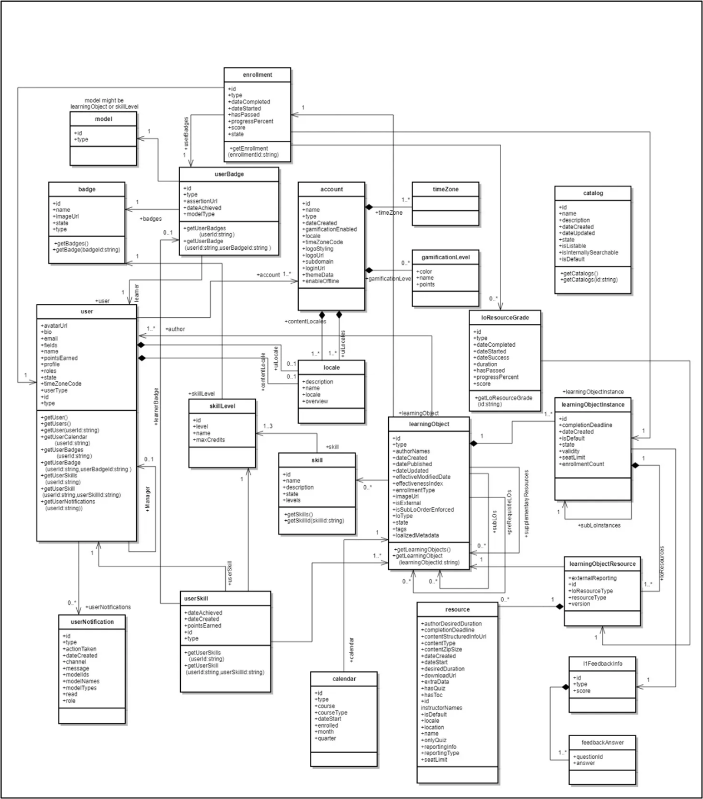

| Learning Manager物件 | 說明 |
|----|----|
| 帳戶 | 封裝Learning Manager客戶的詳細資料。 |
| 徽章 | 徽章是學習者在課程中完成特定里程碑時獲得的成就象徵。 |
| 目錄 | 目錄是學習物件的集合。 |
| 使用者 | 使用者是Learning Manager中的關鍵模型。 使用者通常是組織的內部或外部學習者，負責使用學習物件。 但是，他們可能會扮演其他角色，例如作者和經理以及學習者角色。 使用者ID、型別、電子郵件是一些內嵌屬性。 |
| resource | 這代表模組內的每個內容資源。 所有封裝在「學習資源」中的資源在學習目標方面是相同的，但在傳遞型別或內容地區設定方面則各有不同。 |
| userNotification | 此模型包含與學習者相關的通知資訊。 |
| userSkill | UserSkill指出單一使用者已習得多少單一技能等級。 |
| userBadge | UserBadge將單一徽章與單一使用者建立關聯。 它包含詳細的資訊，例如完成時間、assertionUrl等。 |
| 技能 | 技能模型包含層次與學分。 學習者可在完成相關課程後習得技能。 |
| skillLevel | 技能水準包含一或多個課程，要用於取得水準及其相關學分。 |
| 學習物件 | 學習物件是使用者可註冊及學習的各種物件的抽象概念。 Learning Manager目前提供四種型別的學習物件：課程、認證、學習計畫和工作輔助。 |
| learningObjectInstance | 學習物件的特定例項。 |
| learningObjectResource | 這等同於模組的概念。 課程由一個或多個模組組成。 在Learning Manager中，模組可以各種相同的方式提供。 因此，loResource基本上會封裝所有對等資源。 |
| loResourceGrade | 這會封裝使用者在其註冊的學習物件內容中使用特定資源的結果。 它包含使用者在資源中花費的持續時間、使用者進行的進度百分比、通過/失敗狀態以及使用者在任何相關測驗中獲得的分數等資訊。 |
| 行事曆 | 行事曆物件是使用者可註冊的近期教室或虛擬教室課程清單。 |
| l1FeedbackInfo | L1意見包含學習者針對學習物件相關意見問題所提供的回答。 如果設定為收集學習者的這類意見回饋，通常會在使用者完成學習物件後收集這類回饋。 |
| 註冊 | 此抽象概念會封裝與交易相關的詳細資訊，代表特定使用者對特定學習物件執行個體的指派。 |


## 學習者API和端點

以下是使用學習者資料的關鍵API端點。 這些API可指導開發人員與學習者資訊互動、追蹤進度、管理註冊及擷取課程內容。

### 擷取所有學習者的詳細資訊

擷取學習者詳細資訊（名稱、電子郵件、UUID、使用者設定檔等）。 使用API列出帳戶中的所有學習者。

```
GET https://learningmanager.adobe.com/primeapi/v2/users
```

### 擷取特定學習者的詳細資訊

如果您想要依ID檢視學習者的設定檔，請使用下列API進行呼叫。

```
GET https://learningmanager.adobe.com/primeapi/v2/users/<userID>
```

### 列出所有課程、學習計畫、工作輔助和認證

擷取學習者已註冊、已完成或已由管理員啟用的所有學習物件的詳細資訊。

```
GET https://learningmanager.adobe.com/primeapi/v2/learningObjects
```

### 取得特定學習物件的詳細資料

取得學習物件的詳細資訊。 其中包括建立日期、發佈日期、更新日期和其他資訊。

```
GET https://learningmanager.adobe.com/primeapi/v2/learningObjects/<LearningObjectID>
```

### 擷取連結至課程的技能清單

顯示指派給帳戶中所有學習者的技能。

```
GET https://learningmanager.adobe.com/primeapi/v2/skills
```

### 取得技能等級和徽章資訊

檢查學習者在技能型學習歷程中的進度。

```
GET https://learningmanager.adobe.com/primeapi/v2/skills/<skillID>?include=levels
```

### 為帳戶建立的所有徽章清單

呼叫以下端點，以擷取為組織內的帳戶建立的所有徽章清單。

```
GET https://learningmanager.adobe.com/primeapi/v2/badges
```

### 擷取徽章的資訊

取得有關徽章的詳細資訊，包括徽章名稱、徽章影像URL和徽章的狀態。

```
GET https://learningmanager.adobe.com/primeapi/v2/badges/<skillID>
```

這會產生以下回應：

```
{
    "links": {
        "self": "https://learningmanager.adobe.com/primeapi/v2/badges/499"
    },
    "data": {
        "id": "499",
        "type": "badge",
        "attributes": {
            "imageUrl": "https://cpcontentsdev.adobe.com/public/account/1010/accountassets/1010/badges/test_57a5ab00555a475a8fc6671562184dc9.png",
            "name": "penguins",
            "state": "Retired"
        }
    }
}
```

## 其他API使用範例

### 建立使用者

1. 使用端點：

   ```
   POST https://learningmanager.adobe.com/primeapi/v2/users
   ```

   處理來自API主體或JSON裝載的屬性以產生使用者，然後為使用者提供填入的個別使用者ID。

2. 使用以下裝載作為內文：

   ```
   { 
      "data": { 
        "type": "user", 
        "attributes": { 
         "email": "bob@example.com", 
          "name": "Bob", 
          "userType": "INTERNAL" 
        } 
      } 
    }
   ```

有三個必要的屬性：

* 電子郵件：使用者的電子郵件識別碼。 每個使用者的此值應該都是唯一的。
* name：使用者的名稱。
* userType：目前，僅能使用此端點新增內部使用者。 userType應為「INTERNAL」。

您將會收到下列JSON物件：

```
{
  "links": {
      "self": "https://learningmanager.adobe.com/primeapi/v2/users"
  },
  "data": {
      "id": "13386404",
      "type": "user",
      "attributes": {
          "avatarUrl": "https://cpcontents.adobe.com/public/images/default_user_avatar.svg",
          "email": "bob@example.com",
          "name": "Bob",
          "pointsEarned": 0,
          "pointsRedeemed": 0,
          "preferredResolution": "AUTO",
          "profile": "Employee",
          "roles": [
              "Learner"
          ],
          "state": "ACTIVE",
          "userType": "Internal",
          "userUniqueId": "bob@example.com"
      },
      "relationships": {
          "account": {
              "data": {
                  "id": "1010",
                  "type": "account"
              }
          },
          "manager": {
              "data": {
                  "id": "3400468",
                  "type": "user"
              }
          }
      }
  }
}
```

### 刪除使用者

1. 取得您要刪除之使用者的使用者ID。

   ```
   GET https://learningmanager.adobe.com/primeapi/v2/users/<userID>
   ```

2. 然後使用DELETE，進行下列呼叫：

   ```
   DELETE https://learningmanager.adobe.com/primeapi/v2/users/<userID>
   ```

204回應隨即出現。 204回應代碼表示成功，沒有任何可傳回的內容。 伺服器已成功處理請求，但沒有資料可提供給使用者端。

擷取使用者的詳細資料後，使用者的狀態現在是&#x200B;**[!UICONTROL DELETED]**。

### 更新使用者詳細資訊

1. 使用v2 API更新使用者的使用者詳細資訊。 學習者可以修改個人資料、uiLocale、contentLocale、時區。 對於大型帳戶，這些是非同步呼叫。 有許多其他使用者屬性可以使用此API端點進行更新。 使用/users/{id}端點，其中id是要更新其詳細資訊之使用者的使用者ID。

```
PATCH https://learningmanager.adobe.com/primeapi/v2/users/<userID>
```

在要求之裝載中新增下列內容，以更新上一節中識別碼為`<userID>`的使用者。

變更承載中的任何欄位。

```
{
    "data": {
        "id": "3400468",
        "type": "user",
        "attributes": {
            "avatarUrl": "https://cpcontents.adobe.com/public/images/default_user_avatar.svg",
            "binUserId": "3e6d571f-3956-44db-be69-8e458bde649f",
            "bio": "Manager",
            "contentLocale": "de-DE",
            "email": "user@example.com",
            "enrollOnClick": true,
            "fields": {
                "Web": "Web",
                "newfororder": "newvalue",
                "location": "New",
                "test1": "b"
            },
            "gamificationEnabled": true,
            "lastLoginDate": "2025-04-30T09:30:51.000Z",
            "metadata": {
                "level": "5",
                "expertise": "java",
                "sport": "tennis"
            },
            "name": "John Adams",
            "pointsEarned": 8600,
            "pointsRedeemed": 0,
            "preferredResolution": "AUTO",
            "profile": "Employee",
            "roles": [
                "Learner",
                "Admin",
                "Author",
                "Instructor",
                "Integration Admin",
                "Manager"
            ],
            "state": "ACTIVE",
            "timeZoneCode": "213",
            "uiLocale": "en-US",
            "userType": "Internal",
            "userUniqueId": "user@example.com"
        },
        "relationships": {
            "account": {
                "data": {
                    "id": "1010",
                    "type": "account"
                }
            }
        }
    }
}
```

進行呼叫後，會更新使用者的詳細資料。

### 建立外部設定檔

外部設定檔是指為外部學習者建立的使用者設定檔，通常是不屬於組織內部使用者群的個人。 這些學習者可能包括客戶、合作夥伴、廠商、加盟商或臨時承包商，他們需要存取組織提供的培訓或認證計畫。

1. 使用下列端點：

   ```
   POST https://learningmanager.adobe.com/primeapi/v2/externalProfiles
   ```

2. 使用以下裝載作為內文：

```
{
    "data": {
      "type": "externalProfile",
      "attributes": {
        "name": "Jonas Albertson",
        "expiry": "2027-12-31T18:29:59.000Z",
        "managerEmail": "jonas@acme.com",
        "seatLimit": 10
      }
    }
}
```

裝載有下列屬性：

* name：外部使用者的名稱。
* 有效期：使用者在Adobe Learning Manager中註冊的到期日（ISO-8601格式）。
* managerEmail：合作夥伴組織中使用者經理的電子郵件地址。
* seatLimit：合作夥伴組織允許的席位數。

進行呼叫後，您會收到下列回應：

```
{
    "links": {
        "self": "https://learningmanager.adobe.com/primeapi/v2/externalProfiles"
    },
    "data": {
        "id": "18805",
        "type": "externalProfile",
        "attributes": {
            "accessKey": "8gte2ne7f4r14",
            "enabled": true,
            "expiry": "2027-12-31T18:29:59.000Z",
            "managerEmail": "jonas@acme.com",
            "name": "Jonas Albertson",
            "seatLimit": 10,
            "url": "https://learningmanager.adobe.com/eplogin?groupid=18805&accesskey=8gte2ne7f4r14"
        }
    }
}
```

這表示外部使用者已成功新增至Adobe Learning Manager。 傳送回應使用者的URL，讓使用者可透過該URL在平台上註冊。

### 使用使用者ID和管理員詳細資料擷取使用者報告

使用者報告可以直接從管理員使用者介面(**[!UICONTROL Admin]** > **[!UICONTROL Users]** > **[!UICONTROL Internal]**)下載。 但是，報告不會傳回使用者ID和相關經理的詳細資訊。

使用工作API來下載報表。 工作API有助於產生報表、大量作業（註冊或徽章指派）、憑證完成或徽章產生。

以下為下載報表的方式：

1. 將下列裝載新增至作業API。

   ```
   {
       "data": {
           "type": "job",
           "attributes": {
               "description": "description of your choice",
               "jobType": "generateUsers",
               "payload":{
                   "expandMetadata":true
               }
           }
      }
   }
   ```

2. 使用以下端點。

   ```
   POST https://learningmanager.adobe.com/primeapi/v2/jobs
   ```

3. 從回應中復製作業ID。

   ```
   {
       "links": {
           "self": "https://learningmanager.adobe.com/primeapi/v2/jobs"
       },
       "data": {
           "id": "43118",
           "type": "job",
           "attributes": {
               "dateCreated": "2025-05-26T06:35:35.000Z",
               "description": "description of your choice",
               "jobType": "generateUsers",
               "payload": {
                   "expandMetadata": true
               },
             "status": {
                   "code": "Submitted"
               }
           }
       }
   }
   ```

   回應中會顯43118作業ID。
4. 複製ID後，請使用工作API中的ID來下載報表。

   ```
   GET https://learningmanager.adobe.com/primeapi/v2/jobs/43118
   ```

5. 從回應中複製S3 URL。
6. 在瀏覽器中貼上URL。 瀏覽器會提示您儲存或開啟CSV檔案。 將檔案儲存在電腦上。
下載的檔案包含下列各欄：

internalUserID、userEmail、customerDefinedUniqueUserId、名稱、managerEmail、userType、狀態、excludedFromGamification、pointsEarned、設定檔、角色、dateCreated、lastLoginDate、dateDeleted、uiLocale、contentLocale、timeZoneCode、userSource、群組、作用欄位、中繼資料，以及lastSocialActivityDate。

### 使用工作API產生徽章

1. 取得組織中使用者的徽章清單。 使用下列端點：

   ```
   GET https://learningmanager.adobe.com/primeapi/v2/users/3400476/userBadges
   ```

   其中3400476是使用者ID。
2. 從回應中複製徽章ID。 例如，3400476_759_COMPETENCY_1796_1是徽章識別碼。

   ```
   {
    "id": "3400476_759_COMPETENCY_1796_1",
    "type": "userBadge",
    "attributes": {
        "assertionUrl": "https://cpcontentsdev.adobe.com/public/accountassets/1010/badges/assertions/a99566b5aa8f4cfa92380581733c63a9_1626278856926.json",
        "dateAchieved": "2016-02-25T08:45:25.000Z",
        "modelType": "skillLevel"
    },
    "relationships": {
        "badge": {
            "data": {
                "id": "759",
                "type": "badge"
            }
        },
        "learner": {
            "data": {
                "id": "3400476",
                "type": "user"
            }
        },
        "model": {
            "data": {
                "id": "1796_1",
                "type": "skillLevel"
            }
        }
    }
   }
   ```

3. 建立有效負載並在有效負載中指定徽章ID。 裝載範例如下：

   ```
   {
    "data": {
        "type": "job",
        "attributes": {
            "description": "Acme Corp Badge",
            "jobType": "generateUserBadge",
            "payload": {
                "userBadgeId": "3400476_759_COMPETENCY_1796_1"
            }
        }
    }
   }  
   ```

   進行呼叫後，您會在回應中取得工作ID。
4. 從回應中取得作業ID，並使用下列端點中的作業ID進行呼叫。

   ```
   GET https://learningmanager.adobe.com/primeapi/v2/jobs/<jobsID>
   ```

5. 從回應中複製徽章URL，並在瀏覽器中開啟URL。 憑證將下載為PDF。

### 在Adobe Learning Manager中建立使用者

POST /users端點可協助您使用Headless模式建立使用者。 建立包含詳細資訊的使用者，例如Adobe Learning Manager原生使用者介面中的註冊程式。

例如，

```
POST https://learningmanager.adobe.com/primeapi/v2/users
```

將下列內文新增至請求中：

```
{   
   "data":  
     {  
       "type": "user",  
       "attributes": {  
         "bio": "",  
         "contentLocale": "fr-FR",  
         "email": "user@work.com",  
         "enrollOnClick": true,  
         "fields": {  
           "Learning Categories": [  
             "Business"  
           ],  
           "Categories": "IT"  
         },  
         "gamificationEnabled": true,  
         "name": "Test User",  
         "profile": "Engineer",  
         "userType": "INTERNAL",  
         "userUniqueId": "user@work.com"  
       },  
       "relationships": {  
         "account": {  
           "data": {  
             "id": "108079",  
             "type": "account"  
           }  
         }
         }  
       }  
    } 
```

進行呼叫後，會顯示下列回應：

```
{
    "links": {
        "self": "https://learningmanager.adobe.com/primeapi/v2/users"
    },
    "data": {
        "id": "13385627",
        "type": "user",
        "attributes": {
            "avatarUrl": "https://cpcontents.adobe.com/public/images/default_user_avatar.svg",
            "email": "user@work.com",
            "name": "Test User",
            "pointsEarned": 0,
            "pointsRedeemed": 0,
            "preferredResolution": "AUTO",
            "profile": "Engineer",
            "roles": [
                "Learner"
            ],
            "state": "ACTIVE",
            "userType": "Internal",
            "userUniqueId": "user@work.com"
        },
        "relationships": {
            "account": {
                "data": {
                    "id": "1010",
                    "type": "account"
                }
            },
            "manager": {
                "data": {
                    "id": "3400468",
                    "type": "user"
                }
            }
        }
    }
}
```

新使用者將新增至Adobe Learning Manager。

### 發佈L1意見回饋

1. 擷取學習者的課程、例項和註冊資料。 使用下列端點：

   ```
   GET /enrollments
   ```

2. 檢查是否針對課程例項啟用L1意見回饋。

   ```
   GET https://learningmanager.adobe.com/primeapi/v2/learningObjects/<loID>/instances/<loInstanceID>/l1Feedback
   ```

3. 提交L1意見回饋。

   ```
   POST /enrollments/{id}/l1Feedback
   ```

必要裝載範例：

```
{
    "data": {
      "id": "course:7454218_10333537_11257863",
      "type": "feedback",
      "attributes": {
        "questions": [
          {
            "answer": "8",
            "questionId": "1",
            "mandatory": true,
            "questionType": "scaleTen"
          }
        ],
        "score": 80
      }
    }
  }
```

### 擷取課程的模組層級資訊

1. 依ID擷取學習物件的詳細資料。

   ```
   GET https://learningmanager.adobe.com/primeapi/v2/learningObjects/<loID>
   ```

   ```
   {
    "links": {
        "self": "https://learningmanager.adobe.com/primeapi/v2/learningObjects/course:1171899"
    },
    "data": {
        "id": "course:1171899",
        "type": "learningObject",
        "attributes": {
            "authorNames": [
                "James Adams"
            ],
            "dateCreated": "2017-11-01T15:28:09.000Z",
            "datePublished": "2017-11-01T15:28:20.000Z",
            "dateUpdated": "2017-11-01T15:28:20.000Z",
            "duration": 60,
            "effectiveModifiedDate": "2017-11-01T15:28:20.000Z",
            "effectivenessIndex": 0,
            "enrollmentType": "Self Enroll",
            "hasOptionalLoResources": false,
            "hasPreview": false,
            "isExternal": false,
            "isMqaEnabled": false,
            "isPrerequisiteEnforced": false,
            "isSubLoOrderEnforced": false,
            "loFormat": "Self Paced",
            "loResourceCompletionCount": 3,
            "loType": "course",
            "moduleResetEnabled": false,
            "state": "Published",
            "unenrollmentAllowed": true,
            "catalogLabels": [
                {
                    "catalogLabelValueIds": [
                        {
                            "name": "Sales",
                            "id": "catalogLabel:13_31"
                        }
                    ],
                    "description": "",
                    "mandatory": false,
                    "name": "Department",
                    "values": [
                        "Sales"
                    ]
                }
            ],
            "localizedMetadata": [
                {
                    "locale": "en-US",
                    "name": " Test course 2"
                }
            ],
            "rating": {
                "averageRating": 0,
                "ratingsCount": 0
            }
        },
        "relationships": {
            "authors": {
                "data": [
                    {
                        "id": "3400468",
                        "type": "user"
                    }
                ]
            },
            "instances": {
                "data": [
                    {
                        "id": "course:1171899_2067352",
                        "type": "learningObjectInstance"
                    }
                ]
            },
            "skills": {
                "data": [
                    {
                        "id": "course:1171899_1797",
                        "type": "learningObjectSkill"
                    }
                ]
            }
        }
    }
   }
   ```

2. 使用include引數來擷取下列專案：

   a.列出學習物件的所有模組。

   ```
   GET https://learningmanager.adobe.com/primeapi/v2/learningObjects/course:1171899?include=instances.loResources
   ```

   b.列出模組中的所有內容。

   ```
   GET https://learningmanager.adobe.com/primeapi/v2/learningObjects/course:1171899?include=instances.loResources.resources
   ```

### 檢查模組進度

1. 使用課程ID從目錄中擷取學習物件。

   ```
   GET https://learningmanager.adobe.com/primeapi/v2/learningObjects?page[limit]=10&filter.loTypes=course&sort=name&filter.ignoreEnhancedLP=true&id=<courseID>
   ```

2. 使用註冊ID取得學習者的註冊詳細資料。

   ```
   GET https://learningmanager.adobe.com/primeapi/v2/enrollments/<enrollmentID>
   ```

   從回應中複製學習物件資源等級ID。
3. 在下列端點中使用ID。

   ```
   GET https://learningmanager.adobe.com/primeapi/v2/loResourceGrades/<courseResourceGradeID>
   ```

您會在回應中取得模組進度的相關資訊。

### 實施學習者模擬

使用Adobe Learning Manager作為後端實作Headless LMS時，組織可能需要支援人員來模擬學習者，以進行疑難排解或尋求協助。 API導向的模擬方法可確保安全存取，同時維護學習者憑證的機密性，並支援工作階段狀態的無縫轉換。

Adobe Learning Manager透過專用的API，促進在Headless LMS環境中的學習者模擬。 此功能可讓支援人員暫時接手學習者的身分，讓他們診斷問題、測試功能，或透過模擬學習者的體驗提供實作協助。 使用快取的管理存取權杖來啟用模擬，該權杖會用於以程式設計方式產生學習者存取權杖。 此程式可讓系統以學習者身分登入般運作。

>[!IMPORTANT]
>
>使用者必須請求特殊的API存取權才能使用此功能，而且系統必須處理工作階段切換、授權和其他指標，以確保模擬期間的透明度和責任制。

**API端點詳細資料**

```
POST /oauth/learnerToken
```

**完整URL範例**

```
https://learningmanager.adobe.com/oauth/o/learnerToken?learner_email=foo@acme.com&force=false
```

**查詢引數：**

* 學習者電子郵件： （字串）要模擬的學習者電子郵件。
* force： （布林值）如果新權杖存在，是否強制產生新權杖。

**要求內文：**

```
{
    "client_id": "your-client-id",
    "client_secret": "your-client-secret",
    "refresh_token": "your-admin-refresh-token"
}  
```

**範例回應：**

```
{
    "access_token": "generated-token",
    "refresh_token": "new-refresh-token",
    "user_role": "learner",
    "account_id": "123456",
    "user_id": "7891011",
    "expires_in": 604800
}  
```

**範例cURL：**

```
curl --location --request POST 'https://learningmanager.adobe.com/oauth/o/learnerToken?learner_email=foo@acme.com&force=false' \
--header 'Content-Type: application/json' \
--data-raw '{
  "client_id": "xxxx",
  "client_secret": "xxxx",
  "refresh_token": "xxxx"
}'
```


### 錯誤代碼

使用Adobe Learning Manager (Adobe Learning Manager) API時，開發人員在請求期間可能會遇到各種HTTP錯誤代碼。 這些錯誤會提供發生錯誤以及如何修正錯誤的重要回饋。 瞭解這些程式碼可協助開發人員快速疑難排解問題、改善API可靠性，並確保更順暢的整合。 下表為Adobe Learning Manager API傳回的常見HTTP錯誤碼指南，以及錯誤發生的解釋和典型案例。 本節內容對於任何建立、測試或偵錯連線至Adobe Learning Manager的應用程式都十分重要。

| HTTP狀態 | 含義 | 疑難排解 |
|---|---|---|
| 400 | 錯誤請求 | 檢查請求中是否有遺漏或格式錯誤的引數。 驗證必填欄位和正確的格式。 例如，篩選器、欄位或包含引數的語法無效。 |
| 401 | 未獲授權的無效或遺失權杖 | 確保您的存取權杖正確，並包含在授權標頭中。 確認權杖為使用中。 在請求權杖時，請使用正確的使用者端ID和使用者端密碼。 |
| 403 | 已禁止。 無存取權 | 您沒有存取資源的許可權。 確認您的Token具有正確的範圍（admin：read、learner：write等）。 |
| 404 | 找不到資源 | 端點或資源ID不正確或不存在。 確定資源存在於引數清單中。 |
| 406 | 不接受 — Accept標頭不正確 | 將此標頭新增至您的請求：接受： application/vnd.api+json <br>Adobe Learning Manager API需要此內容型別為必填。</br> |
| 500 | 內部伺服器錯誤 | 這是伺服器端的問題。 請稍後重試，如果問題仍然存在，請向Adobe Learning Manager支援團隊回報。 |


<!--# Application developer manual

>[!NOTE]
>
>Learning Manager V1 API is now deprecated. We recommend that you use V2 APIs to interact with Learning Manager.


## Overview {#overview}

[Adobe Learning Manager](http://www.adobe.com/in/products/learningmanager.html) is a cloud-hosted, learner-centric, and self-service learning management solution. Customers can access Learning Manager resources programmatically using the Learning Manager API to integrate it with other enterprise applications. The API can also be used by Adobe partners to enhance the value proposition of Learning Manager, by extending its functionality or by integrating it with other applications or services.

### Usage scenario {#usagescenario}

Using Learning Manager API, developers can build self-contained applications that extend the functionality of Learning Manager or integrate Learning Manager with other enterprise applications workflows. You can develop a web application, desktop client or a mobile app using any technology of your choice. As a developer you can access your application data from within Learning Manager. The deployment of the application that you develop is external to the Learning Manager platform and you have full control over the software development lifecycle as the application evolves. Typically, applications are developed by a customer organization for use with their Learning Manager account, and these applications are private to that specific customer organization. Also, Adobe partners can build generic applications with Learning Manager API, that can be used by a large set of Learning Manager customers.

## Learning Manager API {#apidescription}

The Learning Manager API is based on principles of REST, and exposes key elements of the Learning Manager Object Model to application developers through HTTP. Before knowing the details of the API endpoints and the HTTP methods, developers can become familiar with the various Learning Manager objects, their attributes and inter-relationships. Once the models are understood, it will be useful to get a basic understanding of the structure of API requests and responses, and a few common programming terms that we use generically across the API.

For details of the various API endpoints and methods, refer to the  [Learning Manager API documentation](https://learningmanager.adobe.com/docs/primeapi/v2/).

## Learner APIs

Adobe Learning Manager - Learner APIs allow you to create a custom learning experience for your users. The usage of these APIs need a valid user token and are to be used only for the purpose of workflows where there is a fully licensed/registered Learner.
 
>[!IMPORTANT]
>
>They are not to be used, as is, for any sort of data retrieval to support any non-logged in user/shared users or any other such cases.
 
The non-logged in use cases require special handling. 

**Reach out to the Solution Architecture team, in case you have any questions on the appropriate use of these APIs and ensure that a Solution Architect has vetted a solution before you deploy it**.

## API authentication {#apiauthentication}

When writing an application that makes API calls to Learning Manager, you have to register your application using the Integration Admin app. 

Learning Manager APIs use OAuth 2.0 framework to authenticate and authorize your client applications. 

**Procedure**

**1. Set up your application**

You can set up your application with client id and client secret to use the proper end points. Once you register your application, you can get the clientId and clientSecret. Get URL should be used in browser as it authenticates the Learning Manager users using their pre-configured accounts such as SSO, Adobe ID, and so on. 

```
GET https://learningmanager.adobe.com/oauth/o/authorize?client_id=<Enter your clientId>&redirect_uri=<Enter a url to redirect to>&state=<Any String data>&scope=<one or more comma separated scopes>&response_type=CODE.
```

After successful authentication, your browser redirects to the redirect_uri mentioned in the above URL. A parameter **code** is appended along with the redirect uri.

**2. Get refresh token from code**

`POST https://learningmanager.adobe.com/oauth/token Content-Type: application/x-www-form-urlencoded`

Body of the post request:

```
client_id: 
<enter your clientid>
 & 
 client_secret: 
 <enter your clientsecret>
  & 
  code: 
  <code from step 1></code>
 </enter>
</enter>
```

**3.** **Obtain an access token from refresh token**

URL to obtain access token: 

POST [https://learningmanager.adobe.com/oauth/token/refresh](https://learningmanager.adobe.com/oauth/token/refresh) Content-Type: application/x-www-form-urlencoded

Body of the post request:

```
client_id: 
<enter your clientid>
 & 
 client_secret: 
 <enter your clientsecret>
  & 
  refresh_token: 
  <refresh token>
   
  </refresh>
 </enter>
</enter>
```

**URL to verify access token details**

`GET https://learningmanager.adobe.com/oauth/token/check?access_token=<access_token>`

**Usage limitation**

An access token is valid for seven days. After a day, you have to generate a new access token using refresh token. If you generate a new access token from refresh token while an existing access token is still valid, the existing token is returned. 

Some of the frequently used terms in Learning Manager API are explained below for your reference. 

**Includes**

Developers can access a single API object model and also multiple models associated with that model. To access the subsequent related models, you need to understand the relationship of each model with other models. **Includes** parameter enables developers to access the dependant models. You can use comma separator to access multiple models. For sample usage and more details on **includes**, refer to sample API model section in this page. 

**API request**

The API requests can be made by making a HTTP Request. Depending upon the end point and method developer may have a choice of various HTTP verbs such as GET, PUT, POST, DELETE, PATCH, etc. For some requests query parameters can be passed. When making a request for a specific data model, the user can also request for related models as described in the JSON API specifications. The structure of a typical API Request is described in [sample model usage](/help/migrated/integration-admin/feature-summary/developer-manual.md#api-usage-illustration).

**API response**

When an API request is made by a client, a SON document is obtained according to the JSON API specification. The response also contains the HTTP Status code, which the developer can verify to perform the appropriate next steps in his application logic. The structure of a typical API Response is described in  [sample model usage](/help/migrated/integration-admin/feature-summary/developer-manual.md#api-usage-illustration).

**Errors**

When an API request fails, an Error response is obtained. The HTTP Status code returned in the response indicates the nature of error. Error codes are represented with numbers for each model in the API reference. 200, 204, 400 and 404 are some of the common errors represented in APIs indicating HTTP access issues.  

**Fields**

API object's attributes and its relationships are collectively called Fields. Refer to [JSON API for more information.](http://jsonapi.org/format/#document-resource-object-fields) You can use Fields as a parameter while making API calls to fetch one or more specific attributes from the model. In absence of the Fields parameter, the API call fetches all the available attributes from the model. For example, in the following API call, fields[skill]=name fetches you the name attribute of the skill model alone. 

`https://learningmanager.adobe.com/primeapi/v2/users/{userId}/userSkills/{id}?include=skillLevel.skill&fields[skill]=name `

**Pagination**

Sometimes, an API request results in a long list of objects to be returned in the response. In such cases, the pagination attribute enables the developer to fetch the results sequentially in terms of multiple pages, where each page contains a range of records. For example, pagination attribute in Learning Manager enables you to set the maximum number of records to be displayed in a page. Also, you can define the range value of records to be displayed on page. 

**Sorting**

Sorting is allowed in API models. Based on the model, choose the type of sorting to be applied for the results. Sorting can be applied in ascending or descending order. For example, if you specify `code sort=name`, then it is ascending sort by name. If you specify `code sort=-name`, it is descending sort by name. Refer to [JSON API spec for more information](http://jsonapi.org/format/#fetching-sorting). 

## API usage illustration {#samplemodel}

Let us consider a scenario where a developer wants to get skill name, max points assigned for skill level and points earned by the learner for that skill.

A userSkill model in Learning Manager APIs consists of id, type, dateAchieved, dateCreated, pointsEarned as default attributes. So, when a developer uses GET method to acquire details of userSkill model, the current data pertaining to the default attributes is shown in the response output. 

But, in this scenario, the developer wants to get the skill name, and points of skill level for the user. Learning Manager API enables you to access this related information using relationship fields and include parameter. The associated models for userSkill are obtained in relatioships tag. You can get the details of each associated models by calling these models along with the userSkill. To get this information, use **`code include`** parameter with dot (period) separated values for each of the associated models. You can use comma as separator to request another model like user include=skillLevel.skill,course

**API Call**

`https://learningmanagerqe1.adobe.com/primeapi/v1/users/%7buserId%7d/userSkills/%7bid%7d?include=skillLevel.skill&fields%5bskill%5d=name&fields%5bskillLevel%5d=maxCredits&fields%5buserSkill%5d=pointsEarned`

For example userId can be 746783 and the userSkills id: 746783_4426_1. 

**Response of API call**

```
\{ 
 "links": {"self": "https://learningmanager.adobe.com/primeapi/v2/users/746783/userSkills/746783_4426_1?include=skillLevel.skill&fields[userSkill]=pointsEarned&fields[skillLevel]=maxCredits&fields[skill]=name"}, 
 "data": { 
 "id": "746783_4426_1", 
 "type": "userSkill", 
 "attributes": {"pointsEarned": 5}, 
 "links": {"self": "https://learningmanager.adobe.com/primeapi/v2/users/746783/userSkills/746783_4426_1"} 
 }, 
 "included": [ 
 { 
 "id": "4426", 
 "type": "skill", 
 "attributes": {"name": "Java"}, 
 "links": {"self": "https://learningmanager.adobe.com/primeapi/v2/skills/4426"} 
 }, 
 { 
 "id": "4426_1", 
 "type": "skillLevel", 
 "attributes": {"maxCredits": 10} 
 } 
 ] 
} 

```

## Learning Manager models {#models}

The Learning Manager API allows developers to access Learning Manager objects as RESTful resources. Each API endpoint represents a resource, typically an object instance like Badge, or a collection of such objects. The developers then use the HTTP verbs such as PUT, GET, POST and DELETE to perform the CRUD operations on those objects (collections).

+++V1 API

The following diagram represents the various elements of the Learning Manager Object Model in V1 API.


The following table describes various elements of the Learning Manager V1 object model: 

<table border="1" cellspacing="0" cellpadding="0">
 <tbody>
  <tr>
   <td>
    <p><strong>Serial No</strong></p></td>
   <td>
    <p><strong>Learning Manager Object</strong></p></td>
   <td>
    <p><strong>Description</strong></p></td>
  </tr>
  <tr>
   <td>
    <p>1.      </p></td>
   <td>
    <p>user</p></td>
   <td>
    <p>User is the key model in Learning Manager. Users are typically the internal or external learners of an organization who consume learning objects. However they may play some other roles such as author and Manager along with learner role. User id, type, email are some of the inline attributes. </p></td>
  </tr>
  <tr>
   <td>
    <p>2.      </p></td>
   <td>
    <p>course</p></td>
   <td>
    <p>Course is one of the learning objects supported in Learning Manager, that consists of one or more modules. </p></td>
  </tr>
  <tr>
   <td>
    <p>3.      </p></td>
   <td>
    <p>module</p></td>
   <td>
    <p>Module is a building block to create learning objects in Learning Manager. Modules can be of four different types such as Class room, virtual class room, activity and self-paced. Use this module model to get the details of all modules in an account. </p></td>
  </tr>
  <tr>
   <td>
    <p>4.      </p></td>
   <td>
    <p>certification</p></td>
   <td>
    <p>Certification is awarded to learners based on successful completion of courses. Courses are required in the application before you use certifications. </p></td>
  </tr>
  <tr>
   <td>
    <p>5.      </p></td>
   <td>
    <p>learning program</p></td>
   <td>
    <p>Learning programs are uniquely designed courses meeting specific learning requirements of users. Typically, learning programs are used to drive learning goals spanning across individual courses. </p></td>
  </tr>
  <tr>
   <td>
    <p>6.      </p></td>
   <td>
    <p>badge</p></td>
   <td>
    <p>Badge is a token of accomplishment that learners get when they reach specific milestones as they progress within a course. </p></td>
  </tr>
  <tr>
   <td>
    <p>7.      </p></td>
   <td>
    <p>skill</p></td>
   <td>
    <p>Skills model consists of levels and credits. Skills can be acquired by learners after relevant course completion. </p></td>
  </tr>
  <tr>
   <td>
    <p>8.      </p></td>
   <td>
    <p>certificationEnrollment</p></td>
   <td>
    <p>This model provides details of an enrollment by a user to a single certification.</p></td>
  </tr>
  <tr>
   <td>
    <p>9.  </p></td>
   <td>
    <p>courseEnrollment</p></td>
   <td>
    <p>This model provides details of an enrollment by a user to a single course. </p></td>
  </tr>
  <tr>
   <td>
    <p>10.  </p></td>
   <td>
    <p>courseInstance</p></td>
   <td>
    <p>A course can have one or many instances associated with it. You can get Course instance </p></td>
  </tr>
  <tr>
   <td>
    <p>11.  </p></td>
   <td>
    <p>courseSkill</p></td>
   <td>
    <p>A courseSkill model specifies the progress of a single skill that is achieved by completing a course.</p></td>
  </tr>
  <tr>
   <td>
    <p>12.  </p></td>
   <td>
    <p>courseModule</p></td>
   <td>A courseModule model specifies how a module is included  in a course. For instance, whether the module is used for pretest or for content.</td>
  </tr>
  <tr>
   <td>
    <p>13.  </p></td>
   <td>learningProgramInstance</td>
   <td>
    <p>A learning program can consist of multiple instances imbibing similar properties of a learning program or customized instances. </p></td>
  </tr>
  <tr>
   <td>
    <p>14.  </p></td>
   <td>
    <p>job aid</p></td>
   <td>
    <p>Job aid is a learning content accessible to learners without any enrollment or completion criteria. You can fetch, updated date, state, id information along with its related models such as job aid version, authors and skill level. </p></td>
  </tr>
  <tr>
   <td>
    <p>15.  </p></td>
   <td>
    <p>jobAidVersion</p></td>
   <td>
    <p>Job aid can have one or many versions associated to it based on number revisions in content and number of uploads. This model provides details of a single job aid version. </p></td>
  </tr>
  <tr>
   <td>
    <p>16.  </p></td>
   <td>
    <p>learningProgramInstanceEnrollment</p></td>
   <td>
    <p>Learning program consists of one or many instances. Learners can enroll to a learning program instance by themselves or assigned by administrator. This model provides details of an enrollment by a user to a single learning program instance. </p></td>
  </tr>
  <tr>
   <td>
    <p>17.  </p></td>
   <td>
    <p>moduleVersion</p></td>
   <td>
    <p>A module can have one or many versions based on its revised content uploads. Use this model to obtain specific info about any single module version. </p></td>
  </tr>
  <tr>
   <td>
    <p>18.  </p></td>
   <td>
    <p>skillLevel</p></td>
   <td>
    <p>A skill level comprises of one or many courses to be consumed in order to acquire a level along with its associated credits. </p></td>
  </tr>
  <tr>
   <td>
    <p>19.  </p></td>
   <td>
    <p>userBadge</p></td>
   <td>
    <p>UserBadge relates a single badge with a single user. It contains details such as when was it achieved, assertionUrl and so on. </p></td>
  </tr>
  <tr>
   <td>
    <p>20.  </p></td>
   <td>
    <p>userSkill</p></td>
   <td>
    <p>UserSkill indicates how much of a single skill level is achieved by a single user.</p></td>
  </tr>
 </tbody>
</table>

+++

+++V2 API

Following are the various elements of the Learning Manager class diagram in V2 API.


<table>
 <tbody>
  <tr>
   <th><b>Learning Manager Object</b></th>
   <th><b>Description</b></th>
  </tr>
  <tr>
   <td>account</td>
   <td>Encapsulates the details of a Learning Manager customer.</td>
  </tr>
  <tr>
   <td><code>
     badge
    </code></td>
   <td>Badge is a token of accomplishment that learners get when they reach specific milestones as they progress within a course. <br></td>
  </tr>
  <tr>
   <td><code>
     catalog
    </code></td>
   <td>Catalog is a collection of learning objects.</td>
  </tr>
  <tr>
   <td><code>
     user
    </code></td>
   <td>User is the key model in Learning Manager. Users are typically the internal or external learners of an organization who consume learning objects. However, they may play some other roles such as author and Manager along with learner role. User id, type, email are some of the inline attributes. </td>
  </tr>
  <tr>
   <td>resource</td>
   <td>This is used to model each content resource that a module seeks to encapsulate. All resources encapsulated within <code>
     an
    </code> <code>
     loResource
    </code> are equivalent in terms of the learning objective, but they differ from each other in terms of delivery type or content locale.<br></td>
  </tr>
  <tr>
   <td>userNotification</td>
   <td>This model contains notification information pertaining to a learner.<br></td>
  </tr>
  <tr>
   <td>userSkill</td>
   <td>UserSkill indicates how much of a single skill level is achieved by a single user.<br></td>
  </tr>
  <tr>
   <td>userBadge</td>
   <td>UserBadge relates a single badge <code>
     with
    </code> a single user. It contains details such as when was it achieved, <code>
     assertionUrl
    </code> and so on. <br></td>
  </tr>
  <tr>
   <td>skill</td>
   <td>Skills model consists of levels and credits. Skills can be acquired by learners after relevant course completion. <br></td>
  </tr>
  <tr>
   <td>skillLevel</td>
   <td>A skill level comprises of one or many courses to be consumed in order to acquire a level along with its associated credits. <br></td>
  </tr>
  <tr>
   <td>learningObject</td>
   <td>A Learning Object is an abstraction for various kinds of objects which users can enroll into and learn from. Currently Learning Manager has the four types of Learning Objects – Course, Certification, Learning Program <code>
     and
    </code> Job Aid.<br></td>
  </tr>
  <tr>
   <td>learningObjectInstance<br></td>
   <td>A specific instance of a learning object.<br></td>
  </tr>
  <tr>
   <td>learningObjectResource</td>
   <td>This is equivalent to the concept of <code>
     module
    </code>. A course is composed of one <code>
     of
    </code> more modules. In Learning Manager, a module can be delivered in a variety of equivalent ways. Therefore the <code>
     loResource
    </code> essentially encapsulates all those equivalent resources.<br></td>
  </tr>
  <tr>
   <td>loResourceGrade<br></td>
   <td>This encapsulates the outcome of the user consuming a specific resource in the context of a learning object he is enrolled into. It has information such as the duration spent by <code>
     user
    </code> in the resource, percentage progress made by the user, pass/fail status and the score obtained by the user in any associated quiz.<br></td>
  </tr>
  <tr>
   <td>calendar<br></td>
   <td>A calendar object is a list of <code>
     upcoming classroom
    </code> or virtual classroom courses that the user can enroll into.<br></td>
  </tr>
  <tr>
   <td>l1FeedbackInfo<br></td>
   <td>L1 Feedback encapsulates the answers provided by a learner for the feedback questions associated with Learning Objects. Typically this is collected after the user completes a Learning Object if configured to collect such feedback from learners.<br></td>
  </tr>
  <tr>
   <td>enrollment<br></td>
   <td>This abstraction encapsulates the details pertaining to the transaction representing the assignment of a specific user to a specific learning object instance.<br></td>
  </tr>
 </tbody>
</table>

+++

List of object attributes and relationships.

+++account

**Attributes** 
dateCreated  
gamificationEnabled  
id  
locale  
loginUrl  
logoUrl  
name  
subdomain  
themeData  
timeZoneCode

**Relationships** 
contentLocales(localizationMetadata)  
gamificationLevels(gamificationLevel)  
timeZones(timeZone)  
uiLocales(localizationMetadata)

+++

+++badge

**Attributes** 
id  
imageUrl  
name  
state

+++

+++catalog

**Attributes** 
dateCreated  
dateUpdated  
description  
id  
isDefault  
isInternallySearchable  
isListable  
name  
state

+++

+++data

**Attributes** 
id  
names

+++

+++gamification

**Attributes** 
color  
name  
points

+++

+++learningObject

**Attributes** 
authorNames  
dateCreated  
datePublished  
dateUpdated  
effectivenessIndex  
enrollmentType  
id  
imageUrl  
isExternal  
isSubLoOrderEnforced  
loType  
state  
tags

**Relationships** 
authors(user)  
enrollment(learningObjectInstanceEnrollment)  
instances(learningObjectInstance)  
prerequisiteLOs(learningObject)  
skills(learningObjectSkill)  
subLOs(learningObject)  
supplementaryLOs(learningObject)  
supplementaryResources(resource)

+++

+++learningObjectInstance

**Attributes** 
completionDeadline  
dateCreated  
enrollmentCount  
id  
isDefault  
seatLimit  
state  
validity

**Relationships** 
badge(badge)  
l1FeedbackInfo(feedbackInfo)  
learningObject(learningObject)  
loResources(learningObjectResource)  
localizedMetadata(localizationMetadata)  
subLoInstances(learningObjectInstance)

+++

+++learningObjectInstanceEnrollment

**Attributes** 
dateCompleted  
dateEnrolled  
dateStarted  
hasPassed  
id  
progressPercent  
score  
state

**Relationships** 
learner(user)  
learnerBadge(userBadge)  
learningObject(learningObject)  
loInstance(learningObjectInstance)  
loResourceGrades(learningObjectResourceGrade)

+++

+++learningObjectResource

**Attributes** 
externalReporting  
id  
loResourceType  
resourceType  
version

**Relationships** 
learningObject(learningObject)  
loInstance(learningObjectInstance)  
localizedMetadata(localizationMetadata)  
resources(resource)

+++

+++learningObjectResourceGrade

**Attributes** 
dateCompleted  
dateStarted  
dateSuccess  
duration  
hasPassed  
id  
progressPercent  
score

**Relationships** 
loResource(learningObjectResource)

+++

+++learningObjectSkill

**Attributes** 
credits  
id  
**Relationships** 
learningObject(learningObject)  
skillLevel(skillLevel)

+++

+++recommendation

**Attributes** 
id  
reason

**Relationships** 
learningObject(learningObject)

+++

+++resource

**Attributes** 
authorDesiredDuration  
completionDeadline  
contentStructureInfoUrl  
contentType  
contentZipSize  
contentZipUrl  
dateCreated  
dateStart  
desiredDuration  
downloadUrl  
extraData  
hasQuiz  
hasToc  
id  
instructorNames  
isDefault  
locale  
location  
name  
onlyQuiz  
reportingInfo  
reportingType  
seatLimit

+++

+++skill

**Attributes** 
description  
id  
name  
state

**Relationships** 
levels(skillLevel)

+++

+++skillLevel

**Attributes** 
id  
level  
maxCredits  
name  
**Relationships** 
badge(badge)  
skill(skill)

+++

+++user

**Attributes** 
avatarUrl  
bio  
contentLocale  
email  
fields  
id  
name  
pointsEarned  
profile  
roles  
state  
timeZoneCode  
uiLocale

**Relationships** 
account(account)  
manager(user)

+++

+++userBadge

**Attributes** 
assertionUrl  
dateAchieved  
id  
modelType

**Relationships** 
badge(badge)  
learner(user)  
model(learningObject)

+++

+++userCalendar

**Attributes** 
course  
courseType  
dateStart  
enrolled  
id  
month  
quarter

**Relationships** 
containerLO(learningObject)  
course(learningObject)

+++

+++userNotification

**Attributes** 
actionTaken  
channel  
dateCreated  
id  
message  
modelIds  
modelNames  
modelTypes  
read  
role

+++

+++userSkill

**Attributes** 
dateAchieved  
dateCreated  
id  
pointsEarned

**Relationships** 
learnerBadge(userBadge)  
learningObject(learningObject)  
skillLevel(skillLevel)  
user(user)

+++

## Application development process {#registration}

## Pre-requisites {#prerequisites}

As a developer you have to create a trial account on Learning Manager, so that you can have full access to all the roles within that account. To be able to write an application, a developer has to create some users and courses and get the account to a reasonable state so that the application being developed can have access to some sample data.

## Create client id and secret {#createclientidandsecret}

1. In **Integration Admin** login, click **[!UICONTROL Applications]** on the left pane. 

   

   *Select Applications on Integration Admin*

1. Click **[!UICONTROL Register]** at the upper-right corner of the page to register your application details. Registration page appears. 

   

   *Register the application*

   It is mandatory to fill up all the fields in this page. 

   **Application Name**: Enter your application name. It is not mandatory to use the same application name, it can be any valid name. 

   **URL**: If you know the exact URL where the application is hosted, you can mention it. If you are not aware, then you can mention your company URL. Valid URL name is mandatory in this field. 

   **Redirect Domains**: Enter the domain name of the application where you want the Learning Manager application to redirect after OAuth authentication. You can mention multiple URLs here but you have to use the valid URLs such as `http://google.com`, `http://yahoo.com` and so on. 

   **Description:** Enter the brief description for your application. 

   **Scopes:** Choose one of the four available options to define the scope of your application. Based on your choice mentioned here, Learning Manager API endpoint are accessible for your application. For example, If you chose **Learner role read access**, then all the Learning Manager learner API end points are read-only accessible to your application. 

   **For this account only?**   
   **Yes** - if you choose Yes, then the application is not visible to other account administrators.  
   **No** - if you choose No, other account admins can also access this application but they need to use the application id to access this application. Application id is generated and displayed in Learning Manager application Edit mode. 

   If you choose **Admin role read and write access** as scope while registering the application and choose **Admin role read access** while authoring the APIs, you can still have write access for the application as the app registration scope supersedes the authorization workflow. 

1. Click **[!UICONTROL Register]** at the upper-right corner after filling up the details in the registration page.

## Application development and testing {#applicationdevelopmentandtesting}

The Learning Manager API can be used by developers to build any application. Developers have to ensure that their accounts consist of some valid users and courses. They can create a few dummy users and courses and simulate activity in the trial account, so that they can test functionality of the application.

## Application deployment {#applicationdeployment}

We recommend that the Learning Manager Administrator or an Integration Administrator for the production account, to take ownership of making the application available to users within their organization. Once the application has been tested and is considered ready for production, inform the administrator of the production account. Ideally, the administrators want to generate a new client-id and client-secret for the application in the production account, and perform the necessary steps to incorporate them inside the application in a secure manner. The actual procedure for deploying applications varies from enterprise to enterprise, and the Learning Manager Administrator of your organization has to take support from the IT/IS department within your organization to complete the deployment.

## External application approval {#externalapplicationapproval}

You can add external applications by clicking **Approve** at the upper-right corner of the **Applications** page. Provide the external application id and click **Save.**


*Add and approve an external application*

## Frequently Asked Questions

+++Does Learning Manager have an E-commerce integration?

Adobe Learning Manager does not have an E-commerce integration. However, we provide APIs so that you can create your own headless LMS and implement E-commerce features.
+++
-->