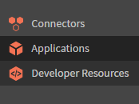
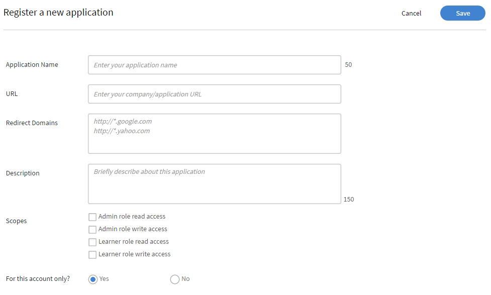
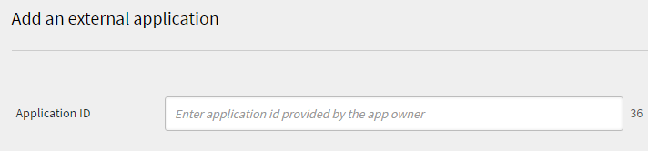

# 應用程式開發人員手冊

>[!NOTE]
>
>Learning Manager V1 API現已棄用。 建議您使用V2 API與Learning Manager互動。


## 概觀 {#overview}

[Adobe Learning Manager](http://www.adobe.com/in/products/learningmanager.html)是雲端託管、以學習者為中心的自助式學習管理解決方案。 客戶可以使用Learning Manager API以程式設計方式存取Learning Manager資源，以便將其與其他企業應用程式整合。 Adobe合作夥伴也可以使用此API來增強Learning Manager的價值主張，方法是擴充其功能或將其與其他應用程式或服務整合。

### 使用案例 {#usagescenario}

使用Learning Manager API，開發人員可以建置獨立的應用程式，以擴充Learning Manager的功能或將Learning Manager與其他企業應用程式工作流程整合。 您可以使用您選擇的任何技術來開發網頁應用程式、案頭使用者端或行動應用程式。 作為開發人員，您可以在Learning Manager中存取您的應用程式資料。 您開發的應用程式部署在Learning Manager平台的外部，而且您可以隨著應用程式的演化，完全控制軟體開發生命週期。 通常，應用程式是由客戶組織開發，以便與其Learning Manager帳戶搭配使用，而這些應用程式為該特定客戶組織專用。 此外，Adobe合作夥伴可以使用Learning Manager API建立通用應用程式，以供大量Learning Manager客戶使用。

## Learning Manager API {#apidescription}

Learning Manager API以REST原則為基礎，並透過HTTP向應用程式開發人員公開Learning Manager物件模型的關鍵元素。 在瞭解API端點和HTTP方法的詳細資訊之前，開發人員可以熟悉各種Learning Manager物件、其屬性和相互關係。 瞭解模型後，大致瞭解API要求和回應的結構，以及在API中普遍使用的幾個常用程式設計術語會很有用。

如需各種API端點和方法的詳細資訊，請參閱[Learning Manager API檔案](https://learningmanager.adobe.com/docs/primeapi/v2/)。

## 學習者API

Adobe Learning Manager — 學習者API可讓您為使用者建立自訂學習體驗。 這些API的使用需要有效的使用者權杖，且僅能用於具有完全授權/註冊學習者的工作流程中。

>[!IMPORTANT]
>
>不應依原樣將其用於任何型別的資料擷取，以支援任何非登入的使用者/共用使用者或任何其他此類情況。

非登入使用案例需要特殊處理。

**若您對這些API的適當使用有任何疑問，請洽詢解決方案架構團隊，並確定解決方案架構師已在您部署解決方案之前對其進行稽核**。

## API驗證 {#apiauthentication}

撰寫可對Learning Manager進行API呼叫的應用程式時，您必須使用整合管理應用程式註冊您的應用程式。

Learning Manager API使用OAuth 2.0架構來驗證及授權您的使用者端應用程式。

**程式**

**1. 設定您的應用程式**

您可以使用使用者端ID和使用者端密碼來設定您的應用程式，以使用適當的端點。 註冊應用程式後，您就可以取得clientId和clientSecret。 「取得URL」應該用於瀏覽器，因為它會使用Learning Manager預先設定的帳戶(例如SSO、Adobe ID等)來驗證Learning Manager使用者。

```
GET https://learningmanager.adobe.com/oauth/o/authorize?client_id=<Enter your clientId>&redirect_uri=<Enter a url to redirect to>&state=<Any String data>&scope=<one or more comma separated scopes>&response_type=CODE.
```

成功驗證後，瀏覽器會重新導向至上述URL中提及的redirect_uri。 引數&#x200B;**代碼**&#x200B;會與重新導向URI一起附加。

**2。 從程式碼**&#x200B;取得重新整理權杖

`POST https://learningmanager.adobe.com/oauth/token Content-Type: application/x-www-form-urlencoded`

post要求內文：

```
client_id: 
<enter your clientid>
 & 
 client_secret: 
 <enter your clientsecret>
  & 
  code: 
  <code from step 1></code>
 </enter>
</enter>
```

**3。** **從重新整理權杖取得存取權杖**

取得存取權杖的URL：

POST[https://learningmanager.adobe.com/oauth/token/refresh](https://learningmanager.adobe.com/oauth/token/refresh)內容型別： application/x-www-form-urlencoded

post要求內文：

```
client_id: 
<enter your clientid>
 & 
 client_secret: 
 <enter your clientsecret>
  & 
  refresh_token: 
  <refresh token>
   
  </refresh>
 </enter>
</enter>
```

**驗證存取權杖詳細資料的URL**

`GET https://learningmanager.adobe.com/oauth/token/check?access_token=<access_token>`

**使用量限制**

存取權杖的有效期為七天。 一天後，您必須使用重新整理權杖產生新的存取權杖。 如果您在現有存取權杖仍然有效的情況下，從重新整理權杖產生新的存取權杖，則會傳回現有的權杖。

以下說明Learning Manager API中的部分常用辭彙，以供您參考。

**包含**

開發人員可以存取單一API物件模型，也可以存取與該模型關聯的多個模型。 若要存取後續的相關模型，您需要瞭解每個模型與其他模型的關係。 **Include**&#x200B;引數可讓開發人員存取相依模型。 您可以使用逗號分隔符號來存取多個模型。 如需&#x200B;**包含**&#x200B;的範例使用方式與詳細資訊，請參閱此頁面的範例API模型區段。

**API要求**

API要求可透過發出HTTP要求來進行。 根據端點和方法，開發人員可以選擇各種HTTP動詞，例如GET、PUT、POST、DELETE、PATCH等。 對於某些請求，可傳遞查詢引數。 請求特定資料模型時，使用者也可請求相關模型，如JSON API規格所述。 典型API要求的結構在[範例模型用法](/help/migrated/integration-admin/feature-summary/developer-manual.md#api-usage-illustration)中說明。

**API回應**

當使用者端提出API請求時，會根據JSON API規格取得SON檔案。 回應也包含HTTP狀態代碼，開發人員可驗證此代碼，以便在其應用程式邏輯中執行適當的後續步驟。 典型API回應的結構在[範例模型用法](/help/migrated/integration-admin/feature-summary/developer-manual.md#api-usage-illustration)中說明。

**個錯誤**

當API要求失敗時，會取得錯誤回應。 回應中傳回的HTTP狀態代碼表示錯誤的性質。 在API參考中，每個模式的錯誤代碼都會以數字表示。 200、204、400和404是API中表示的一些常見錯誤，指出HTTP存取問題。

**欄位**

API物件的屬性及其關系統稱為「欄位」。 如需詳細資訊，請參閱[JSON API。](http://jsonapi.org/format/#document-resource-object-fields)您可在進行API呼叫以從模型中擷取一或多個特定屬性時，使用Fields作為引數。 在沒有Fields引數的情況下，API呼叫會從模型中擷取所有可用的屬性。 例如，在下列API呼叫中，欄位[skill]=name會單獨擷取技能模型的name屬性。

`https://learningmanager.adobe.com/primeapi/v2/users/{userId}/userSkills/{id}?include=skillLevel.skill&fields[skill]=name `

**分頁**

有時，API要求會導致回應中傳回一長串物件。 在這種情況下，分頁屬性可讓開發人員依序擷取多個頁面的結果，其中每個頁面都包含一系列記錄。 例如，Learning Manager中的分頁屬性可讓您設定要在頁面中顯示的最大記錄數。 您也可以定義要在頁面上顯示的記錄範圍值。

**排序**

API模型允許排序。 根據模型，選擇要套用至結果的排序型別。 排序可以遞增或遞減順序套用。 例如，如果您指定`code sort=name`，則會依名稱遞增排序。 如果您指定`code sort=-name`，則會依名稱降序排序。 如需詳細資訊，請參閱[JSON API規格](http://jsonapi.org/format/#fetching-sorting)。

## API使用圖例 {#samplemodel}

讓我們考慮一個案例，其中開發人員想要取得技能名稱、為技能層級指派的最大點數，以及學習者因該技能而獲得的點數。

Learning Manager API中的userSkill模型包含id、型別、dateAchieved、dateCreated、pointsEarned等預設屬性。 因此，當開發人員使用GET方法取得userSkill模型的詳細資訊時，與預設屬性相關的目前資料會顯示在回應輸出中。

但是，在此案例中，開發人員想要取得使用者的技能名稱和技能層級。 Learning Manager API可讓您使用關係欄位和包含引數來存取此相關資訊。 userSkill的相關模型可在關係標籤中取得。 您可以隨userSkill一起呼叫這些模型，以取得每個相關模型的詳細資訊。 若要取得此資訊，請為每個關聯的模型使用具有點（句點）分隔值的&#x200B;**`code include`**&#x200B;引數。 您可以使用逗號作為分隔符號來請求另一個模型，例如user include=skillLevel.skill，course

**API呼叫**

`https://learningmanagerqe1.adobe.com/primeapi/v1/users/%7buserId%7d/userSkills/%7bid%7d?include=skillLevel.skill&fields%5bskill%5d=name&fields%5bskillLevel%5d=maxCredits&fields%5buserSkill%5d=pointsEarned`

例如userId可以是746783，userSkills id可以是746783_4426_1。

**API呼叫的回應**

```
\{ 
 "links": {"self": "https://learningmanager.adobe.com/primeapi/v2/users/746783/userSkills/746783_4426_1?include=skillLevel.skill&fields[userSkill]=pointsEarned&fields[skillLevel]=maxCredits&fields[skill]=name"}, 
 "data": { 
 "id": "746783_4426_1", 
 "type": "userSkill", 
 "attributes": {"pointsEarned": 5}, 
 "links": {"self": "https://learningmanager.adobe.com/primeapi/v2/users/746783/userSkills/746783_4426_1"} 
 }, 
 "included": [ 
 { 
 "id": "4426", 
 "type": "skill", 
 "attributes": {"name": "Java"}, 
 "links": {"self": "https://learningmanager.adobe.com/primeapi/v2/skills/4426"} 
 }, 
 { 
 "id": "4426_1", 
 "type": "skillLevel", 
 "attributes": {"maxCredits": 10} 
 } 
 ] 
} 
```

## Learning Manager模型 {#models}

Learning Manager API可讓開發人員以RESTful資源的形式存取Learning Manager物件。 每個API端點代表資源，通常是Badge之類的物件例項或這類物件的集合。 開發人員接著會使用HTTP動詞(例如PUT、GET、POST和DELETE)對這些物件（集合）執行CRUD操作。

+++V1 API

下圖呈現V1 API中Learning Manager物件模型的各種元素。


下表說明Learning Manager V1物件模型的各種元素：

<table border="1" cellspacing="0" cellpadding="0">
 <tbody>
  <tr>
   <td>
    <p><strong>序號</strong></p></td>
   <td>
    <p><strong>學習管理器物件</strong></p></td>
   <td>
    <p><strong>說明</strong></p></td>
  </tr>
  <tr>
   <td>
    <p>1.      </p></td>
   <td>
    <p>使用者</p></td>
   <td>
    <p>使用者是Learning Manager中的關鍵模型。 使用者通常是組織的內部或外部學習者，負責使用學習物件。 不過，他們可能會扮演其他角色，例如作者和經理以及學習者角色。 使用者ID、型別、電子郵件是一些內嵌屬性。 </p></td>
  </tr>
  <tr>
   <td>
    <p>2.      </p></td>
   <td>
    <p>課程</p></td>
   <td>
    <p>課程是Learning Manager支援的學習物件之一，包含一或多個模組。 </p></td>
  </tr>
  <tr>
   <td>
    <p>3.      </p></td>
   <td>
    <p>模組</p></td>
   <td>
    <p>模組是在Learning Manager中建立學習物件的建置區塊。 模組可以包含四種不同的型別，例如教室房間、虛擬教室房間、活動和自定節奏。 使用此模組模型來取得帳戶中所有模組的詳細資訊。 </p></td>
  </tr>
  <tr>
   <td>
    <p>4.      </p></td>
   <td>
    <p>認證</p></td>
   <td>
    <p>認證的授予對象為成功完成課程的學習者。 使用認證前，必須先在應用程式中取得課程。 </p></td>
  </tr>
  <tr>
   <td>
    <p>5.      </p></td>
   <td>
    <p>學習計畫</p></td>
   <td>
    <p>學習計畫是專為滿足使用者特定學習需求而設計的課程。 學習計畫通常用於推動跨個別課程的學習目標。 </p></td>
  </tr>
  <tr>
   <td>
    <p>6.      </p></td>
   <td>
    <p>徽章</p></td>
   <td>
    <p>徽章是學習者達到特定里程碑並在課程中進展時獲得的成就象徵。 </p></td>
  </tr>
  <tr>
   <td>
    <p>7.      </p></td>
   <td>
    <p>技能</p></td>
   <td>
    <p>技能模型包含層次與學分。 學習者可在完成相關課程後習得技能。 </p></td>
  </tr>
  <tr>
   <td>
    <p>8.      </p></td>
   <td>
    <p>certificationEnrollment</p></td>
   <td>
    <p>此模型提供使用者註冊單一憑證的詳細資訊。</p></td>
  </tr>
  <tr>
   <td>
    <p>9.  </p></td>
   <td>
    <p>課程註冊</p></td>
   <td>
    <p>此模型提供使用者註冊單一課程的詳細資訊。 </p></td>
  </tr>
  <tr>
   <td>
    <p>10.  </p></td>
   <td>
    <p>課程例項</p></td>
   <td>
    <p>一個課程可以有一個或多個相關聯的例項。 您可以取得課程例項 </p></td>
  </tr>
  <tr>
   <td>
    <p>11.  </p></td>
   <td>
    <p>課程技能</p></td>
   <td>
    <p>courseSkill模型指定完成課程後所取得的單一技能進度。</p></td>
  </tr>
  <tr>
   <td>
    <p>12.  </p></td>
   <td>
    <p>課程模組</p></td>
   <td>courseModule模型指定如何將模組包含在課程中。 例如，模組是用於預先測試還是用於內容。</td>
  </tr>
  <tr>
   <td>
    <p>13.  </p></td>
   <td>learningProgramInstance</td>
   <td>
    <p>學習計畫可以由多個執行個體吸收學習計畫或自訂執行個體的類似屬性組成。 </p></td>
  </tr>
  <tr>
   <td>
    <p>14.  </p></td>
   <td>
    <p>工作輔助</p></td>
   <td>
    <p>工作輔助是學習者無需任何註冊或完成條件即可存取的學習內容。 您可以擷取、更新日期、狀態、ID資訊及其相關模型，例如工作輔助版本、作者和技能等級。 </p></td>
  </tr>
  <tr>
   <td>
    <p>15.  </p></td>
   <td>
    <p>jobAidVersion</p></td>
   <td>
    <p>工作輔助可以有一或多個相關的版本，以內容修訂數目和上傳數目為基礎。 此模型提供單一工作輔助版本的詳細資訊。 </p></td>
  </tr>
  <tr>
   <td>
    <p>16.  </p></td>
   <td>
    <p>learningProgramInstanceEnrollment</p></td>
   <td>
    <p>學習計畫包含一或多個例項。 學習者可以自行註冊學習計畫執行個體，或由管理員指派。 此模型提供使用者註冊單一學習計畫執行個體的詳細資訊。 </p></td>
  </tr>
  <tr>
   <td>
    <p>17.  </p></td>
   <td>
    <p>moduleversion</p></td>
   <td>
    <p>根據其修訂的內容上傳，模組可以有一或多個版本。 使用此模型可取得任何單一模組版本的特定資訊。 </p></td>
  </tr>
  <tr>
   <td>
    <p>18.  </p></td>
   <td>
    <p>skillLevel</p></td>
   <td>
    <p>技能等級包含一或多個要使用的課程，以便取得等級及其相關學分。 </p></td>
  </tr>
  <tr>
   <td>
    <p>19.  </p></td>
   <td>
    <p>userBadge</p></td>
   <td>
    <p>UserBadge將單一徽章與單一使用者建立關聯。 它包含詳細的資訊，例如何時完成、assertionUrl等。 </p></td>
  </tr>
  <tr>
   <td>
    <p>20.  </p></td>
   <td>
    <p>userSkill</p></td>
   <td>
    <p>UserSkill指出單一使用者已習得多少單一技能等級。</p></td>
  </tr>
 </tbody>
</table>

+++

+++V2 API

以下是V2 API中Learning Manager類別圖表的各種元素。


<table>
 <tbody>
  <tr>
   <th><b>學習管理器物件</b></th>
   <th><b>說明</b></th>
  </tr>
  <tr>
   <td>帳戶</td>
   <td>封裝Learning Manager客戶的詳細資料。</td>
  </tr>
  <tr>
   <td><code>
     badge
    </code></td>
   <td>徽章是學習者達到特定里程碑並在課程中進展時獲得的成就象徵。 <br></td>
  </tr>
  <tr>
   <td><code>
     catalog
    </code></td>
   <td>目錄是學習物件的集合。</td>
  </tr>
  <tr>
   <td><code>
     user
    </code></td>
   <td>使用者是Learning Manager中的關鍵模型。 使用者通常是組織的內部或外部學習者，負責使用學習物件。 但是，他們可能會扮演其他角色，例如作者和經理以及學習者角色。 使用者ID、型別、電子郵件是一些內嵌屬性。 </td>
  </tr>
  <tr>
   <td>resource</td>
   <td>這可用來模型化模組要封裝的每個內容資源。 所有封裝在<code>
     an
    </code> <code>
     loResource
    </code>中的資源在學習目標方面是同等的，但在傳遞型別或內容地區設定方面則各有不同。<br></td>
  </tr>
  <tr>
   <td>userNotification</td>
   <td>此模型包含與學習者相關的通知資訊。<br></td>
  </tr>
  <tr>
   <td>userSkill</td>
   <td>UserSkill指出單一使用者已習得多少單一技能等級。<br></td>
  </tr>
  <tr>
   <td>userBadge</td>
   <td>UserBadge將單一徽章<code>
     with
    </code>與單一使用者建立關聯。 它包含詳細資料，例如何時達成、<code>
     assertionUrl
    </code>等。 <br></td>
  </tr>
  <tr>
   <td>技能</td>
   <td>技能模型包含層次與學分。 學習者可在完成相關課程後習得技能。 <br></td>
  </tr>
  <tr>
   <td>skillLevel</td>
   <td>技能等級包含一或多個要使用的課程，以便取得等級及其相關學分。 <br></td>
  </tr>
  <tr>
   <td>學習物件</td>
   <td>學習物件是使用者可註冊和學習的各種物件的抽象概念。 目前Learning Manager有四種型別的學習物件 — 課程、認證、學習計畫<code>
     and
    </code>工作輔助。<br></td>
  </tr>
  <tr>
   <td>learningObjectInstance<br></td>
   <td>學習物件的特定例項。<br></td>
  </tr>
  <tr>
   <td>learningObjectResource</td>
   <td>這等同於<code>
     module
    </code>的概念。 課程由一個<code>
     of
    </code>以上的模組組成。 在Learning Manager中，模組可以多種相同的方式提供。 因此，<code>
     loResource
    </code>基本上會封裝所有這些對等資源。<br></td>
  </tr>
  <tr>
   <td>loResourceGrade<br></td>
   <td>這會封裝使用者在其註冊的學習物件內容中使用特定資源的結果。 它有資訊，例如<code>
     user
    </code>在資源中花費的持續時間、使用者進行的進度百分比、通過/失敗狀態以及使用者在任何相關測驗中取得的分數。<br></td>
  </tr>
  <tr>
   <td>行事曆<br></td>
   <td>行事曆物件是使用者可註冊的<code>
     upcoming classroom
    </code>或虛擬教室課程清單。<br></td>
  </tr>
  <tr>
   <td>l1FeedbackInfo<br></td>
   <td>L1意見包含學習者針對學習物件相關意見問題所提供的回答。 如果設定為收集學習者的這類意見回饋，通常會在使用者完成學習物件後收集這類回饋。<br></td>
  </tr>
  <tr>
   <td>註冊<br></td>
   <td>此抽象概念會封裝與交易相關的詳細資訊，代表特定使用者對特定學習物件執行個體的指派。<br></td>
  </tr>
 </tbody>
</table>

+++

物件屬性和關係的清單。

+++account

**屬性**
日期已建立\
gamificationenabled\
id\
地區設定\
loginUrl\
logoUrl\
名稱\
子網域\
themeData\
timeZoneCode

**關係**
contentLocales(localizationMetadata)\
gamificationLevels(gamificationLevel)\
時區（時區）\
uiLocales(localizationMetadata)

+++

+++badge

**屬性**
id\
imageUrl\
名稱\
state

+++

+++catalog

**屬性**
日期已建立\
日期已更新\
說明\
id\
isDefault\
isInternalsearchable\
isListable\
名稱\
state

+++

+++data

**屬性**
id\
名稱

+++

+++遊戲化

**屬性**
顏色\
名稱\
點

+++

+++學習物件

**屬性**
authorName\
日期已建立\
datePublished\
日期已更新\
effectivenessIndex\
enrollmentType\
id\
imageUrl\
isExternal\
isSubLoOrderEnforced\
loType\
state\
標籤

**關係**
作者(user)\
enrollment(learningObjectInstanceEnrollment)\
instances(learningObjectInstance)\
prerequisiteLOs(learningObject)\
skills(learningObjectSkill)\
subLOs(learningObject)\
supplementalLOs(learningObject)\
supplementaryResources(resource)

+++

+++learningObjectInstance

**屬性**
completionDeadline\
日期已建立\
enrollmentCount\
id\
isDefault\
seatlimit\
state\
有效性

**關係**
badge(badge)\
l1FeedbackInfo(feedbackInfo)\
learningObject(learningObject)\
loResources(learningObjectResource)\
localizedMetadata(localizationMetadata)\
subLoInstances(learningObjectInstance)

+++

+++learningObjectInstanceEnrollment

**屬性**
dateCompleted\
dateRegistered\
日期開始\
hasPassed\
id\
progressPercent\
分數\
state

**關係**
學習者(user)\
learnerBadge(userBadge)\
learningObject(learningObject)\
loInstance(learningObjectInstance)\
loResourceGrades(learningObjectResourceGrade)

+++

+++learningObjectResource

**屬性**
externalreporting\
id\
loResourceType\
resourceType\
版本

**關係**
learningObject(learningObject)\
loInstance(learningObjectInstance)\
localizedMetadata(localizationMetadata)\
resources(resource)

+++

+++learningObjectResourceGrade

**屬性**
dateCompleted\
日期開始\
日期成功\
期間\
hasPassed\
id\
progressPercent\
分數

**關係**
loResource(learningObjectResource)

+++

+++learningObjectSkill

**屬性**
積分\
id\
**關係**
learningObject(learningObject)\
skillLevel(skillLevel)

+++

+++建議

**屬性**
id\
原因

**關係**
learningObject(learningObject)

+++

+++resource

**屬性**
authorDesiredDuration\
completionDeadline\
contentStructureInfoUrl\
contenttype\
contentZipSize\
contentZipUrl\
日期已建立\
日期開始\
desiredDuration\
downloadUrl\
額外資料\
hasQuiz\
hasToc\
id\
講師名稱\
isDefault\
地區設定\
位置\
名稱\
onlyQuiz\
reportingInfo\
reportingType\
seatlimit

+++

+++skill

**屬性**
說明\
id\
名稱\
state

**關係**
levels(skillLevel)

+++

+++skillLevel

**屬性**
id\
level\
maxCredit\
名稱\
**關係**
badge(badge)\
技能(skill)

+++

+++user

**屬性**
avatarUrl\
簡歷\
contentLocale\
電子郵件\
欄位\
id\
名稱\
獲得點數\
設定檔\
角色\
state\
timeZoneCode\
uiLocale

**關係**
account(account)\
管理員(user)

+++

+++userBadge

**屬性**
assertionUrl\
dateAchieved\
id\
modelType

**關係**
badge(badge)\
學習者(user)\
model(learningObject)

+++

+++userCalendar

**屬性**
課程\
課程型別\
日期開始\
已註冊\
id\
月\
季度

**關係**
containerLO(learningObject)\
course(learningObject)

+++

+++userNotification

**屬性**
actionTaked\
頻道\
日期已建立\
id\
message\
modelIds\
modelName\
模型型別\
讀取\
角色

+++

+++userSkill

**屬性**
dateAchieved\
日期已建立\
id\
獲得點數

**關係**
learnerBadge(userBadge)\
learningObject(learningObject)\
skillLevel(skillLevel)\
user(user)

+++

## 應用程式開發流程 {#registration}

## 先決條件 {#prerequisites}

身為開發人員，您必須在Learning Manager上建立試用帳戶，才能完整存取該帳戶內的所有角色。 為了能夠編寫應用程式，開發人員必須建立一些使用者和課程，並將帳戶置於合理狀態，以便正在開發的應用程式可以存取一些範例資料。

## 建立使用者端ID和密碼 {#createclientidandsecret}

1. 在&#x200B;**整合管理員**&#x200B;登入中，按一下左窗格上的&#x200B;**[!UICONTROL Applications]**。

   

   *在整合管理員上選取應用程式*

1. 按一下頁面右上角的&#x200B;**[!UICONTROL Register]**&#x200B;以註冊您的應用程式詳細資料。 註冊頁面就會顯示。

   

   *註冊應用程式*

   填寫此頁面中的所有欄位。

   **應用程式名稱**：輸入您的應用程式名稱。 不強制使用相同的應用程式名稱，可以是任何有效的名稱。

   **URL**：如果您知道裝載應用程式的確切URL，可以提及它。 如果您不知道，則可以提及您的公司URL。 此欄位中必須輸入有效的URL名稱。

   **重新導向網域**：輸入您希望Learning Manager應用程式在OAuth驗證後重新導向的應用程式網域名稱。 您可以在此提及多個URL，但必須使用有效的URL，例如`http://google.com`、`http://yahoo.com`等。

   **描述：**&#x200B;為您的應用程式輸入簡短描述。

   **範圍：**&#x200B;請選擇四個可用選項之一，以定義應用程式的範圍。 根據您在此處提及的選擇，您的應用程式可存取Learning Manager API端點。 例如，如果您選擇&#x200B;**學習者角色讀取存取權**，則應用程式可唯讀存取所有Learning Manager學習者API端點。

   **僅針對此帳戶？**\
   **是** — 如果您選擇[是]，則其他帳戶管理員看不到該應用程式。\
   **否** — 如果您選擇[否]，其他帳戶管理員也可以存取此應用程式，但他們需要使用應用程式ID來存取此應用程式。 應用程式ID會產生，並以Learning Manager應用程式編輯模式顯示。

   如果您在註冊應用程式時選擇&#x200B;**管理員角色讀取和寫入存取權**&#x200B;作為範圍，並在編寫API時選擇&#x200B;**管理員角色讀取存取權**，則您仍然可以擁有應用程式的寫入存取權，因為應用程式註冊範圍會取代授權工作流程。

1. 填寫註冊頁面的詳細資料後，按一下右上角的&#x200B;**[!UICONTROL Register]**。

## 應用程式開發與測試 {#applicationdevelopmentandtesting}

開發人員可使用Learning Manager API來建置任何應用程式。 開發人員必須確保其帳戶包含某些有效的使用者和課程。 他們可以建立一些虛擬的使用者和課程，並在試用帳戶中模擬活動，以便測試應用程式的功能。

## 應用程式部署 {#applicationdeployment}

我們建議生產帳戶的Learning Manager管理員或整合管理員負責將應用程式提供給組織內的使用者。 一旦應用程式經過測試且視為已準備好生產，請通知生產帳戶的管理員。 理想情況下，管理員可以在生產帳戶中為應用程式產生新的使用者端ID和使用者端密碼，並執行必要步驟，以安全的方式將它們合併到應用程式中。 部署應用程式的實際程式因企業而異，組織的Learning Manager管理員必須從組織內的IT/IS部門取得支援，才能完成部署。

## 外部應用程式核准 {#externalapplicationapproval}

您可以在&#x200B;**應用程式**&#x200B;頁面的右上角按一下&#x200B;**核准**，以新增外部應用程式。 提供外部應用程式ID，然後按一下&#x200B;**儲存。**



*新增並核准外部應用程式*

## 常見問題

+++Learning Manager有電子商務整合嗎？

Adobe Learning Manager沒有電子商務整合。 不過，我們提供API，因此您可以建立自己的Headless LMS並實作電子商務功能。
+++
