# Adobe Learning Manager 開發者手冊

## 概觀

Adobe Learning Manager 提供 RESTful API，讓開發者能有效整合與客製化應用程式或工作流程。 開發者手冊提供了如何使用這些 API 的指引，涵蓋認證、資料模型及與其他應用程式整合等主題。 此外，本指南 [API 參考文件](https://learningmanager.adobe.com/docs/primeapi/v2/) 協助開發者建立與 Adobe Learning Manager 各種功能互動的外部應用程式或後端工作流程，包括課程建立、學習進度追蹤、技能映射、認證、遊戲化及成績單。

本手冊涵蓋以下內容：

* OAuth2.0 認證
* API 物件模型
* 包含、欄位及其他參數
* 實際應用案例

>[!IMPORTANT]
>
>本開發手冊專門涵蓋 Adobe Learning Manager 的 V2 API。 本指南中描述的所有範例、請求結構與認證工作流程皆針對 /primeapi/v2/ 端點而設。 關於舊版本或已棄用的 API 資訊，請參閱 [API 參考文件](https://learningmanager.adobe.com/docs/primeapi/v2/)。

## API 使用情境

開發者可利用 Learning Manager API 來增強或整合 Learning Manager 與其他企業應用程式。 你可以使用任何技術來建立網頁、桌面或行動應用程式。 開發者可以存取 Learning Manager 的資料，但你可以控制應用程式的使用地點與方式。

## 使用 OAuth 2.0 進行認證

若要安全存取 Adobe Learning Manager API，您必須使用 Adobe Learning Manager 的 OAuth 2.0 機制進行認證。 這個過程包括註冊你的應用程式、產生授權碼、將其換成刷新令牌，最後用刷新令牌取得存取權杖。

### 註冊應用程式

將 Adobe Learning Manager 與外部應用程式整合，提升彈性。 步驟包括存取整合管理員介面、註冊應用程式，以及取得客戶端 ID 與 Secret。 從 Adobe Learning Manager 產生 OAuth 2.0 認證權杖，包括授權、刷新及存取權杖。 使用 OAuth 2.0 流程來安全認證並授權你的應用程式。 存取憑證的有效期為七天。

1. 以整合管理員身份登入 Adobe Learning Manager。
2. 在左側窗格選擇 **[!UICONTROL Applications]** 。

   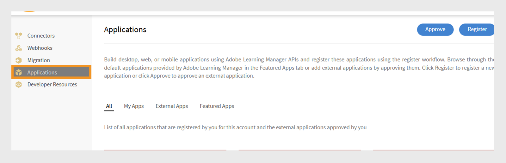

3. 請選擇 **[!UICONTROL Register]** 並新增以下資訊：

   * **[!UICONTROL Application Name]**： 請輸入您的申請名稱（最多 50 個字元）。
   * **[!UICONTROL URL]**：您公司或應用程式的官方網址。 用於識別與參考。
   * **[!UICONTROL Redirect Domains]**： 指定授權後 Adobe Learning Manager 可重定向的網域（例如 [http://learningmanager.adobe.com](http://learningmanager.adobe.com)）。  你可以指定多個有效的網址。
   * **[!UICONTROL Description]**：應用程式的功能簡要說明。
   * **[!UICONTROL Scopes]**：從六個可用選項中選擇一個來定義您的申請範圍。 根據你在這裡提到的選擇，Learning Manager API 端點對你的應用程式是可存取的。 例如，如果你選擇了學習者角色讀取權限，那麼所有學習管理工具的學習者 API 端點對你的應用程式來說都是唯讀存取。

      * 管理員角色讀寫存取權限：允許應用程式以管理員身份存取或修改資料。
      * 學習者角色讀寫存取權：允許應用程式存取或修改學習者的資料。
      * xAPI 讀寫存取：使應用程式能夠存取並傳送 Experience API（xAPI）語句。

   * **[!UICONTROL For this account only?]**

      * **[!UICONTROL Yes]** - 若選擇「是」，則該應用程式對其他帳號管理員不見。
      * **[!UICONTROL No]** - 如果你選擇「否」，其他帳號管理員也可以存取此應用程式，但他們必須使用應用程式 ID 才能存取此應用程式。 應用程式 ID 會在學習管理員應用程式編輯模式中產生並顯示。

     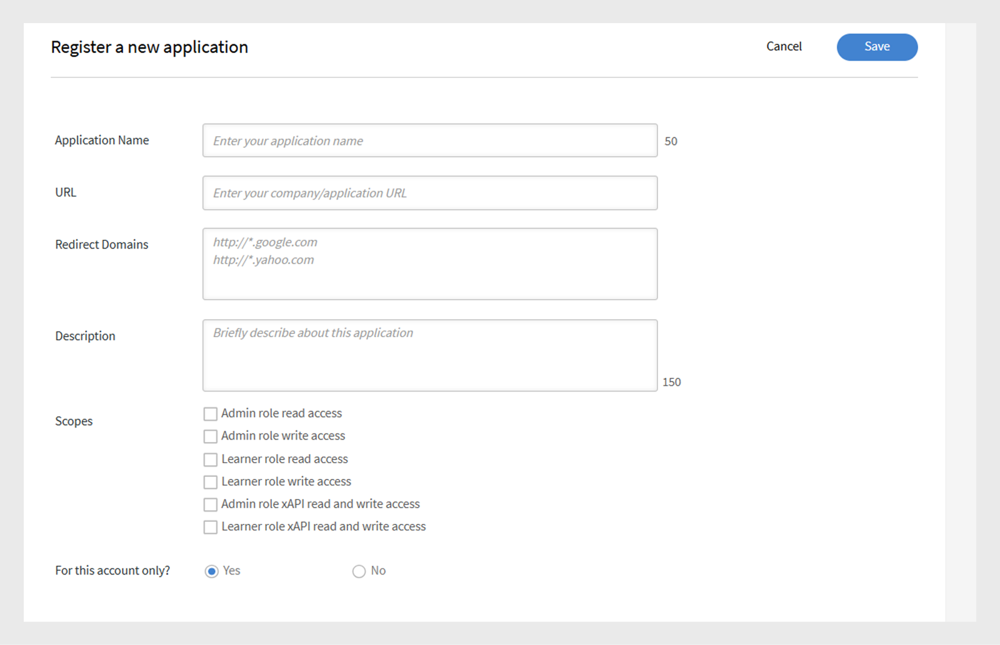

4. 選擇 **[!UICONTROL Save]** 註冊申請。

   * 註冊申請後，該申請會在帳號中建立的申請清單中顯示。 選擇申請表後，你會看到以下內容，除了先前輸入的欄位外：
   * 應用程式 ID：這是用戶端 ID。 這個 ID 告訴 Adobe Learning Manager 正在請求存取權限的應用程式。 它包含在 API 請求中用來識別應用程式。
   * 應用程式秘密：用於在令牌交換步驟中驗證應用程式的身份（例如請求刷新令牌或存取令牌時）。

   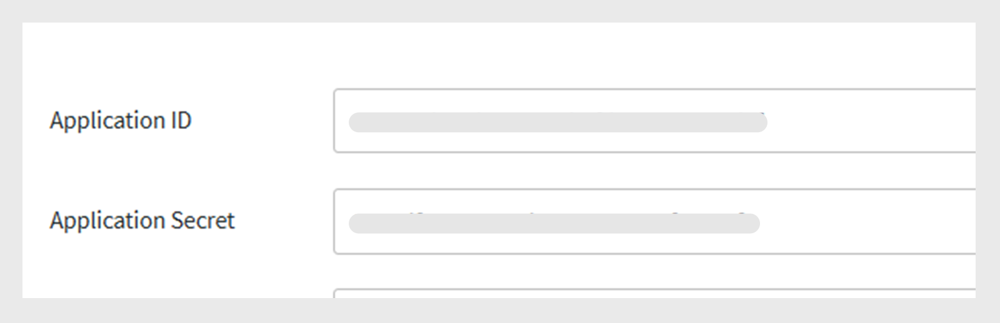

## 取得存取權杖

### 取得授權碼

取得 Client ID 和 Client Secret 後，利用它們請求存取權杖，用來驗證 API 呼叫。

要開始授權碼流程，請在瀏覽器中新增以下網址：

```
GET https://learningmanager.adobe.com/oauth/o/authorize?client_id=<Enter your clientId>&redirect_uri=<Enter a url to redirect to>&state=<Any String data>&scope=<one or more comma separated scopes>&response_type=CODE 
```

使用者授權應用程式後，Adobe Learning Manager 會以附加查詢參數重定向至指定的redirect_uri：

[https://yourapp.com/callback?code=abc123xyz](https://yourapp.com/callback?code=abc123xyz)

參數代碼會隨 redirect uri 一併附加。

### 從程式碼取得刷新權杖

取得程式碼後，使用任何 API 工具，並新增以下 POST 請求：

```https://learningmanager.adobe.com/oauth/token ```

**請求主體（x-www-form-urlencoded）：**

```
grant_type=authorization_code  
&code=abc123xyz  
&client_id=<your_client_id>  
&client_secret=<your_client_secret>  
&redirect_uri=<your_redirect_url> 
```

**回應**

```
{ 

  "access_token": "eyJhbGciOiJIUzI1...", 
  "refresh_token": "xTjlfz0jCk6gF1...", 
  "expires_in": 604800, 
  "token_type": "Bearer" 

} 
```

請使用授權標頭中的access_token來發送經過認證的 API 請求。

### 在 API 呼叫中使用存取權杖

請使用以下方法驗證存取權杖：

```
GET https://learningmanager.adobe.com/oauth/token/check?access_token=<access_token> 
```

存取憑證有效期為七天。 七天後，你必須使用刷新代幣產生新的存取權杖。 如果你在現有存取權杖仍然有效的情況下，從 refresh token 產生新的存取權杖，現有的權杖會被回傳。

### 取得存取權杖以進行測試與開發

在使用 Adobe Learning Manager API 時，開發者需要有效的 OAuth 2.0 存取權杖來驗證 API 請求。 透過標準 OAuth 流程產生此代幣可能複雜且耗時，尤其用於快速測試、學習或開發。 Adobe Learning Manager 提供一個代幣產生工具，以簡化此流程。

此工具的理想用途包括：

* 概念驗證（POC）建置

* 早期開發階段

* 故障排除 API 整合問題

這些代幣僅供您在開發與除錯階段個人使用。 請記得，測試憑證會授權存取你的 Adobe Learning Manager 資料，因此必須安全管理。 切勿將測試標記分享給他人，也不要在生產應用程式中使用，或將它們納入公開程式碼庫。 把它們當作密碼來對待，以確保你的帳號和資料安全。

1. 以整合管理員身份登入 Adobe Learning Manager。
2. 選擇， **[!UICONTROL Developer Resources]** 然後 **[!UICONTROL select Access Tokens for Testing and Development]**。

   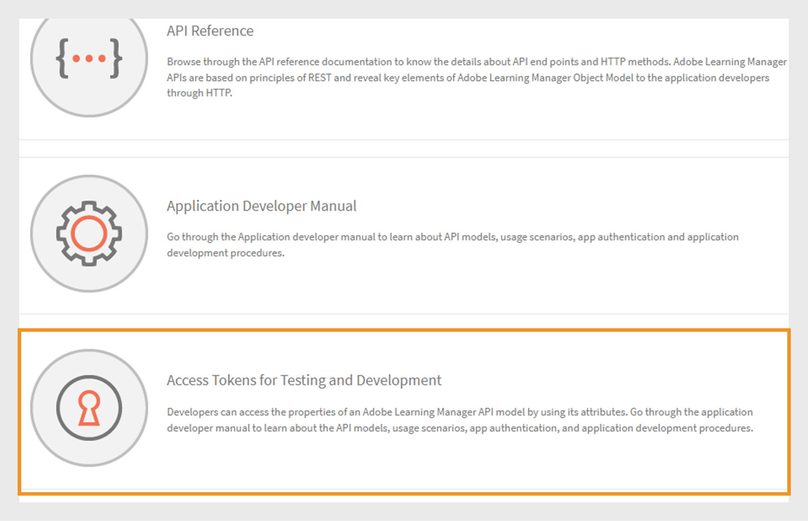

3. 輸入你建立應用程式後得到的 OAuth **[!UICONTROL Client ID]** 代碼。 然後選擇 **[!UICONTROL Submit]**。

   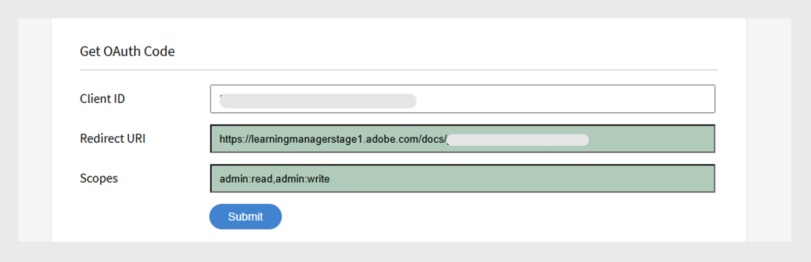

4. 加上 和 **[!UICONTROL Client ID]** **[!UICONTROL Client Secret]** 以取得刷新代幣。 然後選擇 **[!UICONTROL Submit]**。 OAuth 是從前一步預先填充的。

   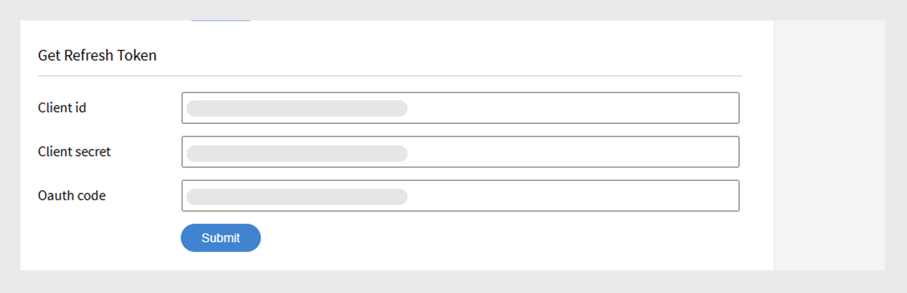

5. 新增 Client ID 和 Client Secret 即可取得存取權杖。 然後選擇 **[!UICONTROL Submit]**。

   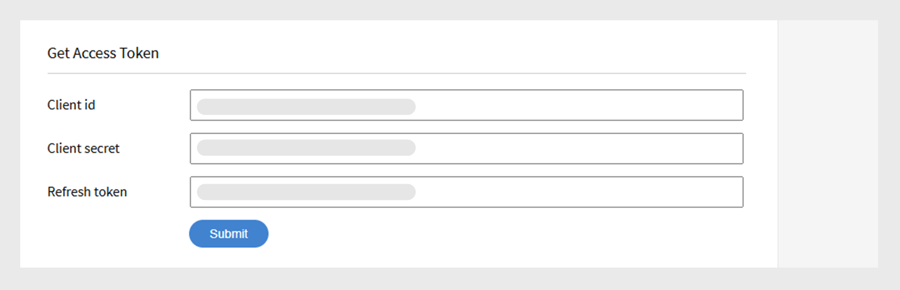

6. 新增存取權杖並選擇提交以取得存取權杖的詳細資訊。

   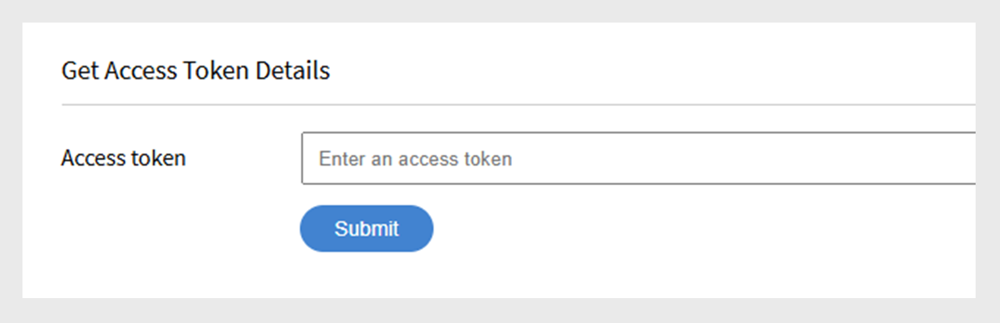

選擇 **[!UICONTROL Submit]**&#x200B;後，存取權杖會被驗證，您將收到以下 JSON 物件：

```
{ 
  "access_token": "access token", 
  "refresh_token": "refresh token", 
  "user_role": "admin", 
  "account_id": "1234", 
  "user_id": "123456", 
  "expires_in": 604800 
} 
```

如同以往，測試的存取權憑證將於七天後到期。

### 使用 API 工具來測試端點

雖然你可以使用任何第三方 API 測試工具，但我們會用 Postman 來測試端點。 本文件中的範例使用 Postman 來測試端點。

1. 打開 Postman 並建立新的請求。
2. 選擇授權標籤。
3. 把授權類型設為持有人憑證。

   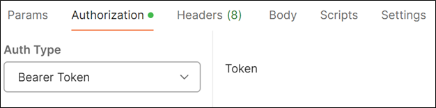
4. 將你從前一部分取得的存取權杖貼上到令牌欄位。

   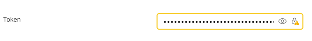

5. 請在頁頭標籤中加入以下內容。

   * 關鍵：接受
   * 值：application/json
6. 在 URL 欄位輸入你的 API 端點。 範例： [https://learningmanager.adobe.com/learningManager/api/v2/users](https://learningmanager.adobe.com/learningManager/api/v2/users)欲了解更多資訊，請參閱 [Adobe Learning Manager API 參考](https://learningmanager.adobe.com/docs/primeapi/v2/) 。
7. 選擇「發送」以發送 API 請求。

## API 類型

### 管理 API

Adobe Learning Manager 的管理 API 允許管理員自動化並大規模管理學習作業。

利用管理 API，開發者可以：

>[!NOTE]
>
>這份清單並非完整。

* **管理使用者與群組**：建立、更新及刪除使用者，或指派至群組。
* **招募學習者**：自動化註冊課程、學習路徑或認證。
* **追蹤學習者進度**：取得課程/模組進度、測驗分數及完成狀態。
* **產生報告：取得**&#x200B;學習者活動、參與度及表現的數據。
* **管理內容**：建立並組織課程與學習物件。

欲了解更多資訊，請參閱 [Adobe Learning Manager API 參考](https://learningmanager.adobe.com/docs/primeapi/v2/) 。

### 學習器 API

學習者 API 是為已認證的使用者（學習者）設計，讓你能存取學習者專屬資訊。 這些 API 允許執行以下任務：

* 存取學習者的課程與進度
* 取得徽章或取得的證照
* 更新學習者個人資料資訊
* 完成課程後的觀看技巧

**重點：**

* 這些 API 需要經過認證的使用者憑證，確保資料安全與隱私。
* 這些 API 是針對用戶完全註冊並登入的情境設計，而非匿名或共用使用者。

欲了解更多資訊，請參閱 [Adobe Learning Manager API 參考](https://learningmanager.adobe.com/docs/primeapi/v2/) 。

## API 設計與常見參數

這些 API 讓開發者能存取關鍵的學習管理資源，如使用者、課程、技能、證照及學習計畫。 它遵循 REST 原則，使用 HTTP 方法（GET、POST、PUT、DELETE）來進行資料操作。

| | |
|--|--|
| 方法 | 取得、發佈、發佈、刪除 |
| 格式 | application/vnd.api+json， application/json. [了解更多](https://developer.mozilla.org/en-US/docs/Web/HTTP/Guides/MIME_types/Common_types) 常見的MIME類型。 |
| 基礎網址 | [https://learningmanager.adobe.com/primeapi/v2/](https://learningmanager.adobe.com/primeapi/v2/) |

### 常見參數

| 參數 | 目的 |
|--|--|
| 包括 | 一通電話就能取得相關資源。 |
| 場 | 選擇特定屬性以降低有效載荷。 |
| 濾波器 | 窄義結果（例如依 ID、名稱） |
| 分類 | 訂購結果。 |
| 頁[數限制]，頁[數偏移] | 分頁支援。 |

以下是每個問題的簡要說明：

### 包括

Adobe Learning Manager API 可用於在建置自訂應用程式或無頭學習管理系統（LMS）時擷取有用資訊。 API 端點還可以加入額外的「include」參數，以擷取預設接收資料相關的額外資訊。 這些關係是資料模型關係，例如在撥打查詢使用者資料的通話時，你會收到使用者資訊以及管理者 ID 與 Adobe Learning Manager 帳號 ID 的關聯。 透過 include 參數，你可以詳細擷取使用者資料，例如他們的經理資料和 Adobe Learning Manager 的帳號資料。
簡言之， **include** 參數用於 API 呼叫中，在單一回應中擷取相關（連結）資源與主要資源。 當你想存取巢狀或相依資料，例如課程模組或映射給學習者的技能，而不必另行呼叫 API 時，它非常有用。

主要好處：

* 減少多次 API 呼叫：避免手動請求每個相關資源。
* 提升效率：更快的開發速度、降低伺服器負載及更快的資料渲染速度。
* 確保資料一致性：以一致快照檢索所有相關資料。

**如何使用 include 參數**

在你的 API URL 上加上 include 參數，並指定要包含的相關實體。

**常見的包括路徑**

| 包含價值 | 說明 |
|---|---|
| 實例 | 回傳所有學習物件的實例 |
| 招生人數 | 回傳使用者的註冊資料 |
| instances.loResources.resources | 在實例中擷取模組與資源 |
| 補充資源 | 相關補充資源回報 |
| 技能.技能等級.徽章 | 取物技能等級及其相關徽章 |
| 前置條件LOs | 包含先修學習物件 |
| 次次LO | 擷取子學習物件（用於 LP 或認證） |
| subLOs.註冊 | 子學習對象的註冊 |
| instances.badge | 完成課程實例後分配的徽章 |
| subLOs.subLOs.instances.loResources.resources | 深度巢狀的資源存在於子子 LO 實例中 |

**範例一**

利用端點中的 userID 參數取得使用者的詳細資料。

```
https://learningmanager.adobe.com/primeapi/v2/users/<userID>
```

```
GET https://learningmanager.adobe.com/primeapi/v2/users/<userID>
```

在回應中，你可以看到資料物件與帳號及使用者的管理者有關聯。

```
"relationships": {
            "account": {
                "data": {
                    "id": "1010",
                    "type": "account"
                }
            },
            "manager": {
                "data": {
                    "id": "3400476",
                    "type": "user"
                }
            }
        }
```

利用請求中的 include 參數，您可以取得以下所示的管理者詳細資訊：

```
GET https://learningmanager.adobe.com/primeapi/v2/users/<userid>?include=manager
```

**範例二**

要取得課程細節，請在端點呼叫中使用 include 參數。 以下端點會取得課程資訊及其關聯。

```
GET https://learningmanager.adobe.com/primeapi/v2/learningObjects/<courseID>
```

回應中顯示的關係如下：

* 實例
* 技能
* 作者

```
"relationships": {
            "authors": {
                "data": [
                    {
                        "id": "3400468",
                        "type": "user"
                    }
                ]
            },
            "instances": {
                "data": [
                    {
                        "id": "course:16444_31598",
                        "type": "learningObjectInstance"
                    }
                ]
            },
            "skills": {
                "data": [
                    {
                        "id": "course:16444_1796",
                        "type": "learningObjectSkill"
                    },
                    {
                        "id": "course:16444_3103",
                        "type": "learningObjectSkill"
                    }
                ]
            }
        }
```

其他關係可能包括（上述回應中未提及）：

* 前置條件LOs
* 補充LOs
* 補充資源

要獲得實例與技能的詳細資料，請在 include 參數中加入「實例，技能」。

```
GET https://learningmanager.adobe.com/primeapi/v2/learningObjects/<courseID>?include=instances,skills
```

舉例來說，如果你想取得更多與課程實例相關的資料，例如 loResources（課程的模組資訊），就將 loResources 作為巢狀的 include 套用。

```
GET https://learningmanager.adobe.com/primeapi/v2/learningObjects/<courseID>?include=instances.loResources
```

此外，將技能與實例與巢狀包含結合。

```
GET https://learningmanager.adobe.com/primeapi/v2/learningObjects/<courseID>?include=instances,instances.loResources,skills
```

**其他包括濾波器**

<table>
  <tbody>
  <tr>
   <td>
    <p style="text-align: left;"><b>學習計畫</b></p></td>
   <td>
    <p style="text-align: left;"><b>河道</b></p></td>
  </tr>
  <tr>
  <td><br>subLOs.prerequisiteLOs.enrollment</br><br>subLOs.subLOs.prerequisiteLOs.enrollment subLOs.enrollment.loResourceGrades</br><br>subLOs.subLOs.enrollment.loResourceGrades</br><br>subLOs.subLOs.subLOs.instances.loResources.resources.room</br><br></br><br>subLOs.loResources.room subLOs.enrollment.loInstance.loResources.resources</br><br></br><br>subLOs.補充LOs.註冊.loInstance.loResources.resources</br><br>subLOs.supplementaryLOs.instances.loResources.resources subLOs.supplementaryLOs.instances.loResources.resources</br><br></br>
  </td>
  <td>
  <br>instances.enrollment.loResourceGrades</br><br>enrollment.loInstance.loResources.resources prerequisiteLOs</br><br>authors，</br><br>instances.loResources.supplementaryLOs.instances.loResources.supplementaryResources</br><br></br><br></br><br>instances.badge</br><br>skills.skillLevel.badge</br><br>skills.skillLevel.skill.skills.room</br><br></br><br>， prerequisiteLOs.enrollment</br><br>enrollment.loResourceGrades</br></br>
  </td>
  </tr>
  </table>

#### 場

API 物件的屬性與關聯稱為欄位（Fields）。 在 API 呼叫中使用欄位作為參數，從模型中擷取特定屬性。 若沒有 Fields 參數，API 呼叫會取得所有可用的屬性。

例如，在以下 API 呼叫中，欄位[skill]=name 只取得技能模型的 name 屬性。

```
GET https://learningmanager.adobe.com/primeapi/v2/users/3400490/userSkills/3400490_1796_1?include=skillLevel.skill&fields[skill]=name
```

#### 頁碼

API 分頁是一種技術，用於將大量資料拆解成較小且易於管理的區塊，稱為頁面，而非一次性回傳完整資料。

分頁可降低用戶端與伺服器負載，限制回應大小以避免伺服器瓶頸，或用於逐頁顯示資料表或清單。

**Adobe Learning Manager API 中的分頁功能**

Adobe Learning Manager API 支援透過以下參數進行分頁：

* 頁數[限制]：每頁記錄數。
* 頁[數偏移]：可跳過的紀錄數量。
* 頁面[游標]：指向下一組結果。 游標分頁不是使用基於偏移量的分頁（跳過多筆紀錄），而是使用從 API 回傳的唯一標記來取得下一頁的結果。

以下是如何在 API 中使用分頁的方法：

**頁數[限制]**

雖然 [https://learningmanager.adobe.com/primeapi/v2/users](https://learningmanager.adobe.com/primeapi/v2/users) 會一次呼叫回傳所有使用者及相關資訊，但使用頁[數] 限制會限制結果數量為指定值。

若要在單一呼叫中只返回五筆使用者記錄，請使用以下 API：

```
GET https://learningmanager.adobe.com/primeapi/v2/users?page[limit]=5
```

**頁面[偏移]**

利用此 API 呼叫回傳三筆使用者記錄，跳過前五位，從第六位開始。

```
GET https://learningmanager.adobe.com/primeapi/v2/users?page[limit]=3&page[offset]=5 
```

**頁面[游標]**

1. 先從請求第一頁，限制為5頁。

   ```
   GET https://learningmanager.adobe.com/primeapi/v2/users?page[limit]=5
   ```

2. 複製 links.next 的游標值，並在下一個請求中使用：

   ```
   "links": {
       "self": "https://learningmanager.adobe.com/primeapi/v2/users?page[limit]=5",
       "next": "https://learningmanager.adobe.com/primeapi/v2/users?page[limit]=5&page[cursor]=3400482"
    }
   ```

3. 請發送以下請求：

   ```
   GET https://learningmanager.adobe.com/primeapi/v2/users?page[limit]=5&page[cursor]=3400482
   ```

此系統會回傳下一組 10 筆紀錄，從上一頁的最後一項開始。

#### 濾波器

篩選參數允許你根據一個或多個欄位值縮小 API 結果範圍。

Adobe Learning Manager 的 API 提供不同變體的篩選參數以縮小回應範圍。

欲了解更多資訊，請參閱 [Adobe Learning Manager API 參考](https://learningmanager.adobe.com/docs/primeapi/v2/) 。

此範例展示了如何利用帶有篩選參數的端點篩選學習者已註冊的工作輔助工具：

```
GET https://learningmanager.adobe.com/primeapi/v2/users/3400480/enrollments?filter.loTypes=jobAid
```

#### 分類

排序參數用於根據一個或多個欄位，將 API 結果排序為升序或降序。

Adobe Learning Manager 提供多種排序選項來排序 API 回應。 欲了解更多資訊，請參閱 [Adobe Learning Manager API 參考](https://learningmanager.adobe.com/docs/primeapi/v2/) 。

延續前一個範例，你現在會依註冊日期排序使用者的學習程式註冊。

```
GET https://learningmanager.adobe.com/primeapi/v2/users/3400480/enrollments?filter.lotypes=learningProgram&sort=dateEnrolled
```

## API 模型概述

Adobe Learning Manager API 允許開發者以 RESTful 資源存取 Learning Manager 物件。 每個 API 端點代表一個資源，通常是像 Badge 這樣的物件實例，或是這類物件的集合。 開發者接著使用 HTTP 動詞如 PUT、GET、POST 和 DELETE 來對這些物件（集合）執行 CRUD 操作。

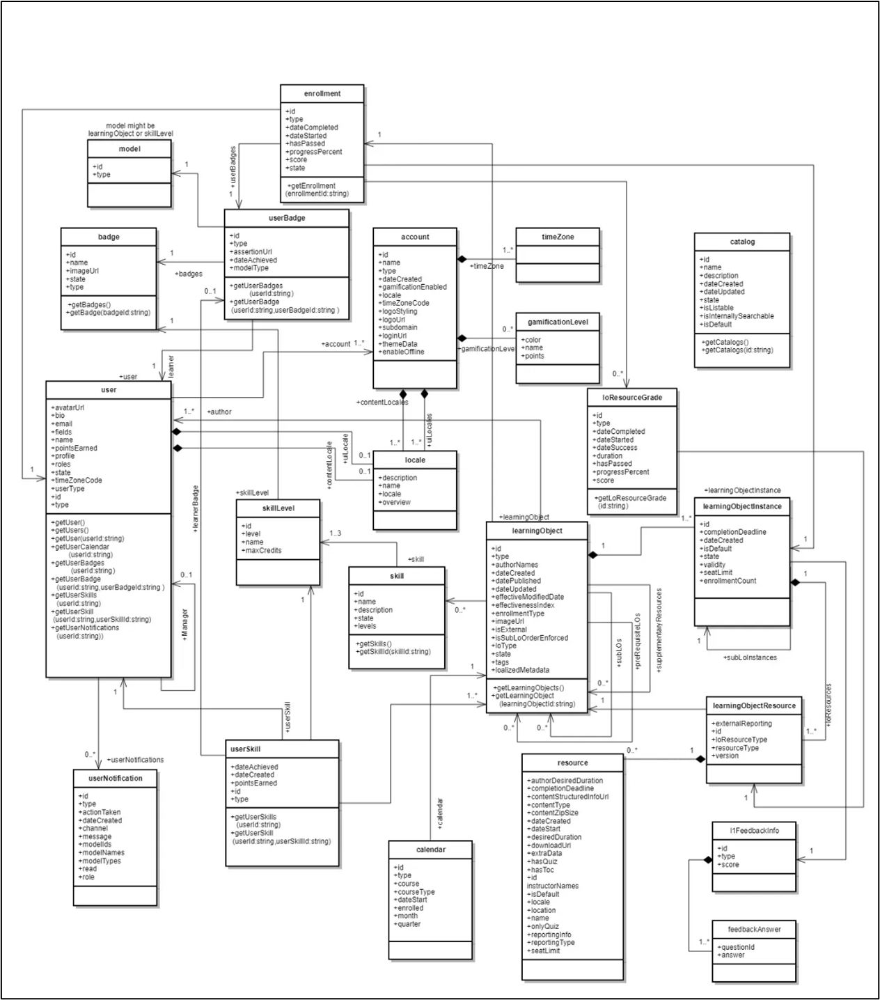

| 學習管理器物件 | 說明 |
|----|----|
| 帳號 | 涵蓋學習經理客戶的詳細資料。 |
| 徽章 | 徽章是學習者在課程進展中達成特定里程碑時所獲得的成就象徵。 |
| 目錄 | 目錄是一個學習物件的集合。 |
| 使用者 | 使用者是學習管理器中的關鍵模型。 使用者通常是組織內部或外部學習者，他們會使用學習物件。 然而，他們也可能扮演其他角色，如作者、管理者以及學習者的角色。 使用者ID、類型、電子郵件是內嵌屬性。 |
| 資源 | 這代表模組內的每個內容資源。 封裝在「loResource」內的所有資源在學習目標上是等價的，但在傳遞類型或內容地點上彼此不同。 |
| 用戶通知 | 此模型包含與學習者相關的通知資訊。 |
| 用戶技能 | UserSkill 表示單一使用者能達成多少單一技能等級。 |
| 使用者徽章 | UserBadge 將單一徽章與單一使用者連結起來。 它包含達成時間、assertionUrl 等細節。 |
| 技巧 | 技能模型包含等級與學分。 學習者在完成相關課程後，可以習得技能。 |
| 技能等級 | 技能等級包含一門或多門課程，需修習以取得該等級及其相關學分。 |
| learningObject | 學習物件是一種抽象的概念，涵蓋使用者可以註冊並學習的各種物件。 目前學習經理包含四種學習物件：課程、認證、學習計畫及工作輔助。 |
| learningObjectInstance | 一個特定的學習對象實例。 |
| learningObjectResource | 這等價於模的概念。 課程由多個模組組成。 在學習管理中，模組可以以多種等效方式呈現。 因此，loResource 基本上封裝了所有這些等效資源。 |
| loResourceGrade | 這涵蓋了使用者在所註冊學習對象中消費特定資源的結果。 它包含使用者在資源中花費的時間、進度百分比、通過/不及格狀態，以及使用者在任何相關測驗中獲得的分數等資訊。 |
| 賽程表 | 行事曆物件是即將開設的教室或虛擬教室課程清單，使用者可以報名。 |
| l1FeedbackInfo | 第一語言回饋（L1 Feedback）是學習者對與學習物件相關的回饋問題所提供的答案。 通常這些回饋會在使用者完成學習物件後收集，若設定為從學習者那裡收集此類回饋。 |
| 招生人數 | 此抽象封裝了與交易相關的細節，代表特定使用者被指派至特定學習物件實例。 |


## 學習者 API 與端點

以下是處理學習者資料的關鍵 API 端點。 這些 API 指導開發者如何與學習者資訊互動、追蹤進度、管理註冊及檢索課程內容。

### 取得所有學習者的詳細資料

取得學習者資料（姓名、電子郵件、UUID、使用者資料等）。 使用 API 列出帳號中的所有學習者。

```
GET https://learningmanager.adobe.com/primeapi/v2/users
```

### 檢索特定學習者的詳細資料

如果你想依 ID 查看學習者的個人資料，請使用以下 API 進行呼叫。

```
GET https://learningmanager.adobe.com/primeapi/v2/users/<userID>
```

### 列出所有課程、學習計畫、工作輔助工具與證照

取得學習者已註冊、已完成或由管理員啟用的所有學習物件的詳細資訊。

```
GET https://learningmanager.adobe.com/primeapi/v2/learningObjects
```

### 獲取特定學習對象的詳細資訊

獲取學習對象的詳細資訊。 內容包括創建日期、出版日期、更新日期及其他資訊。

```
GET https://learningmanager.adobe.com/primeapi/v2/learningObjects/<LearningObjectID>
```

### 檢索與課程相關的技能列表

顯示帳戶中分配給所有學習者的技能。

```
GET https://learningmanager.adobe.com/primeapi/v2/skills
```

### 取得技能等級和徽章資訊

檢視學習者在技能導向學習旅程中的進展。

```
GET https://learningmanager.adobe.com/primeapi/v2/skills/<skillID>?include=levels
```

### 為該帳號建立的所有徽章列表

呼叫以下端點，取得組織中該帳號所建立的所有徽章清單。

```
GET https://learningmanager.adobe.com/primeapi/v2/badges
```

### 取得徽章資訊

取得徽章詳細資訊，包括徽章名稱、徽章圖片網址及徽章狀態。

```
GET https://learningmanager.adobe.com/primeapi/v2/badges/<skillID>
```

這會產生以下回應：

```
{
    "links": {
        "self": "https://learningmanager.adobe.com/primeapi/v2/badges/499"
    },
    "data": {
        "id": "499",
        "type": "badge",
        "attributes": {
            "imageUrl": "https://cpcontentsdev.adobe.com/public/account/1010/accountassets/1010/badges/test_57a5ab00555a475a8fc6671562184dc9.png",
            "name": "penguins",
            "state": "Retired"
        }
    }
}
```

## 其他 API 使用範例

### 建立使用者

1. 使用端點：

   ```
   POST https://learningmanager.adobe.com/primeapi/v2/users
   ```

   處理來自 API 主體或 JSON 有效載荷的屬性以產生使用者，隨後提供已填寫相應使用者 ID 的使用者。

2. 以下有效載荷作為車身：

   ```
   { 
      "data": { 
        "type": "user", 
        "attributes": { 
         "email": "bob@example.com", 
          "name": "Bob", 
          "userType": "INTERNAL" 
        } 
      } 
    }
   ```

有三個必備屬性：

* 電子郵件：使用者的電子郵件 ID。 這個數值應該對每位使用者都是獨一無二的。
* 名稱：使用者的名字。
* userType：目前，僅能使用此端點新增內部使用者。 使用者類型應該是「內部」。

您將收到以下 JSON 物件：

```
{
  "links": {
      "self": "https://learningmanager.adobe.com/primeapi/v2/users"
  },
  "data": {
      "id": "13386404",
      "type": "user",
      "attributes": {
          "avatarUrl": "https://cpcontents.adobe.com/public/images/default_user_avatar.svg",
          "email": "bob@example.com",
          "name": "Bob",
          "pointsEarned": 0,
          "pointsRedeemed": 0,
          "preferredResolution": "AUTO",
          "profile": "Employee",
          "roles": [
              "Learner"
          ],
          "state": "ACTIVE",
          "userType": "Internal",
          "userUniqueId": "bob@example.com"
      },
      "relationships": {
          "account": {
              "data": {
                  "id": "1010",
                  "type": "account"
              }
          },
          "manager": {
              "data": {
                  "id": "3400468",
                  "type": "user"
              }
          }
      }
  }
}
```

### 刪除使用者

1. 取得你想刪除的使用者的使用者 ID。

   ```
   GET https://learningmanager.adobe.com/primeapi/v2/users/<userID>
   ```

2. 接著使用 DELETE 進行以下呼叫：

   ```
   DELETE https://learningmanager.adobe.com/primeapi/v2/users/<userID>
   ```

出現了204的回應。 204 回應代碼表示成功且無內容可回傳。 伺服器成功處理了請求，但沒有資料可以提供給用戶端。

使用者的狀態現在 **[!UICONTROL DELETED]** 會在你取得使用者資料後顯示。

### 更新使用者資料

1. 使用 v2 API 更新使用者資料。 學習者可以修改 bio、uiLocale、contentLocale、時區。 對於大型帳號，這些是非同步通話。 還有許多其他使用者屬性可以透過此 API 端點更新。 使用 /users/{id} 端點，其中 id 是要更新資料的使用者的使用者 ID。

```
PATCH https://learningmanager.adobe.com/primeapi/v2/users/<userID>
```

在請求更新使用者的 ID `<userID>`中加入以下內容，該請求來自上一節。

改變有效載荷中的任何欄位。

```
{
    "data": {
        "id": "3400468",
        "type": "user",
        "attributes": {
            "avatarUrl": "https://cpcontents.adobe.com/public/images/default_user_avatar.svg",
            "binUserId": "3e6d571f-3956-44db-be69-8e458bde649f",
            "bio": "Manager",
            "contentLocale": "de-DE",
            "email": "user@example.com",
            "enrollOnClick": true,
            "fields": {
                "Web": "Web",
                "newfororder": "newvalue",
                "location": "New",
                "test1": "b"
            },
            "gamificationEnabled": true,
            "lastLoginDate": "2025-04-30T09:30:51.000Z",
            "metadata": {
                "level": "5",
                "expertise": "java",
                "sport": "tennis"
            },
            "name": "John Adams",
            "pointsEarned": 8600,
            "pointsRedeemed": 0,
            "preferredResolution": "AUTO",
            "profile": "Employee",
            "roles": [
                "Learner",
                "Admin",
                "Author",
                "Instructor",
                "Integration Admin",
                "Manager"
            ],
            "state": "ACTIVE",
            "timeZoneCode": "213",
            "uiLocale": "en-US",
            "userType": "Internal",
            "userUniqueId": "user@example.com"
        },
        "relationships": {
            "account": {
                "data": {
                    "id": "1010",
                    "type": "account"
                }
            }
        }
    }
}
```

撥打電話後，使用者的資訊會被更新。

### 建立外部個人檔案

外部個人檔案是指為外部學習者建立的使用者個人檔案，通常是非組織內部使用者群的個人。 這些學習者可能包括客戶、合作夥伴、供應商、加盟商或臨時承包商，他們需要參加組織提供的培訓或認證課程。

1. 請使用以下端點：

   ```
   POST https://learningmanager.adobe.com/primeapi/v2/externalProfiles
   ```

2. 以下有效載荷作為車身：

```
{
    "data": {
      "type": "externalProfile",
      "attributes": {
        "name": "Jonas Albertson",
        "expiry": "2027-12-31T18:29:59.000Z",
        "managerEmail": "jonas@acme.com",
        "seatLimit": 10
      }
    }
}
```

有效載荷具備以下屬性：

* 名稱：外部使用者的名稱。
* 到期日：使用者在 Adobe Learning Manager 註冊的有效期限（以 ISO-8601 格式）。
* managerEmail：使用者所屬合作夥伴組織經理的電子郵件地址。
* 席數限制：合作組織允許的席次數。

您撥出電話後，會收到以下回覆：

```
{
    "links": {
        "self": "https://learningmanager.adobe.com/primeapi/v2/externalProfiles"
    },
    "data": {
        "id": "18805",
        "type": "externalProfile",
        "attributes": {
            "accessKey": "8gte2ne7f4r14",
            "enabled": true,
            "expiry": "2027-12-31T18:29:59.000Z",
            "managerEmail": "jonas@acme.com",
            "name": "Jonas Albertson",
            "seatLimit": 10,
            "url": "https://learningmanager.adobe.com/eplogin?groupid=18805&accesskey=8gte2ne7f4r14"
        }
    }
}
```

這表示外部使用者已成功加入 Adobe Learning Manager。 把回應裡的網址傳給使用者，讓他們能在平台上註冊。

### 擷取包含使用者 ID 與管理者資料的使用者報告

使用者報告可直接從管理員使用者介面下載（**[!UICONTROL Admin]** > **[!UICONTROL Users]** > **[!UICONTROL Internal]**）。 然而，報告並未回傳使用者 ID 及相關管理員的資訊。

請使用 Jobs API 下載報告。 職缺 API 協助產生報告、批量作業（註冊或徽章分配）、認證完成或徽章產生。

以下是您可以下載報告的方式：

1. 將以下有效載荷加入 Jobs API。

   ```
   {
       "data": {
           "type": "job",
           "attributes": {
               "description": "description of your choice",
               "jobType": "generateUsers",
               "payload":{
                   "expandMetadata":true
               }
           }
      }
   }
   ```

2. 請使用以下端點。

   ```
   POST https://learningmanager.adobe.com/primeapi/v2/jobs
   ```

3. 複製回覆中的職缺編號。

   ```
   {
       "links": {
           "self": "https://learningmanager.adobe.com/primeapi/v2/jobs"
       },
       "data": {
           "id": "43118",
           "type": "job",
           "attributes": {
               "dateCreated": "2025-05-26T06:35:35.000Z",
               "description": "description of your choice",
               "jobType": "generateUsers",
               "payload": {
                   "expandMetadata": true
               },
             "status": {
                   "code": "Submitted"
               }
           }
       }
   }
   ```

   回覆中，職缺ID是43118。
4. 複製 ID 後，使用工作 API 中的 ID 下載報告。

   ```
   GET https://learningmanager.adobe.com/primeapi/v2/jobs/43118
   ```

5. 複製回覆中的 S3 網址。
6. 把網址貼到瀏覽器裡。 瀏覽器會提示你儲存或開啟 CSV 檔案。 把檔案存到你的電腦裡。
下載的檔案包含以下欄位：

internalUserID、userEmail、customerDefinedUniqueUserId、name、managerEmail、userType、state、excludedFromGamification、pointsEarned、profile、roles、dateCreated、lastLoginDate、dateDeleted、uiLocale、contentLocale、timeZoneCode、userSource、群組、活動欄位、元資料，以及lastSocialActivityDate。

### 使用 Jobs API 產生徽章

1. 取得組織內某位使用者的徽章清單。 請使用以下端點：

   ```
   GET https://learningmanager.adobe.com/primeapi/v2/users/3400476/userBadges
   ```

   3400476 是使用者 ID。
2. 複製回覆中的徽章識別碼。 例如，3400476_759_COMPETENCY_1796_1 是徽章識別碼。

   ```
   {
    "id": "3400476_759_COMPETENCY_1796_1",
    "type": "userBadge",
    "attributes": {
        "assertionUrl": "https://cpcontentsdev.adobe.com/public/accountassets/1010/badges/assertions/a99566b5aa8f4cfa92380581733c63a9_1626278856926.json",
        "dateAchieved": "2016-02-25T08:45:25.000Z",
        "modelType": "skillLevel"
    },
    "relationships": {
        "badge": {
            "data": {
                "id": "759",
                "type": "badge"
            }
        },
        "learner": {
            "data": {
                "id": "3400476",
                "type": "user"
            }
        },
        "model": {
            "data": {
                "id": "1796_1",
                "type": "skillLevel"
            }
        }
    }
   }
   ```

3. 建立一個有效載荷，並在有效載荷中指定徽章 ID。 以下是一個有效載荷範例：

   ```
   {
    "data": {
        "type": "job",
        "attributes": {
            "description": "Acme Corp Badge",
            "jobType": "generateUserBadge",
            "payload": {
                "userBadgeId": "3400476_759_COMPETENCY_1796_1"
            }
        }
    }
   }  
   ```

   打完電話後，你會在回覆中看到職缺ID。
4. 從回應中取得工作 ID，並在下一個端點使用該工作 ID 來呼叫。

   ```
   GET https://learningmanager.adobe.com/primeapi/v2/jobs/<jobsID>
   ```

5. 從回覆中複製徽章網址，然後在瀏覽器中開啟該網址。 證書將以PDF格式下載。

### 在 Adobe Learning Manager 中建立使用者

POST /users 端點幫助你用無頭模式建立使用者。 建立包含詳細資訊的使用者，例如Adobe Learning Manager原生使用者介面中的註冊流程。

例如，

```
POST https://learningmanager.adobe.com/primeapi/v2/users
```

請新增以下內容：

```
{   
   "data":  
     {  
       "type": "user",  
       "attributes": {  
         "bio": "",  
         "contentLocale": "fr-FR",  
         "email": "user@work.com",  
         "enrollOnClick": true,  
         "fields": {  
           "Learning Categories": [  
             "Business"  
           ],  
           "Categories": "IT"  
         },  
         "gamificationEnabled": true,  
         "name": "Test User",  
         "profile": "Engineer",  
         "userType": "INTERNAL",  
         "userUniqueId": "user@work.com"  
       },  
       "relationships": {  
         "account": {  
           "data": {  
             "id": "108079",  
             "type": "account"  
           }  
         }
         }  
       }  
    } 
```

您撥出電話後，會出現以下回應：

```
{
    "links": {
        "self": "https://learningmanager.adobe.com/primeapi/v2/users"
    },
    "data": {
        "id": "13385627",
        "type": "user",
        "attributes": {
            "avatarUrl": "https://cpcontents.adobe.com/public/images/default_user_avatar.svg",
            "email": "user@work.com",
            "name": "Test User",
            "pointsEarned": 0,
            "pointsRedeemed": 0,
            "preferredResolution": "AUTO",
            "profile": "Engineer",
            "roles": [
                "Learner"
            ],
            "state": "ACTIVE",
            "userType": "Internal",
            "userUniqueId": "user@work.com"
        },
        "relationships": {
            "account": {
                "data": {
                    "id": "1010",
                    "type": "account"
                }
            },
            "manager": {
                "data": {
                    "id": "3400468",
                    "type": "user"
                }
            }
        }
    }
}
```

Adobe Learning Manager 將新增一位使用者。

### L1 後回饋

1. 取得學習者的課程、實例及註冊資料。 請使用以下說明：

   ```
   GET /enrollments
   ```

2. 檢查課程實例是否啟用了 L1 回饋。

   ```
   GET https://learningmanager.adobe.com/primeapi/v2/learningObjects/<loID>/instances/<loInstanceID>/l1Feedback
   ```

3. 提交L1回饋。

   ```
   POST /enrollments/{id}/l1Feedback
   ```

所需有效載荷範例：

```
{
    "data": {
      "id": "course:7454218_10333537_11257863",
      "type": "feedback",
      "attributes": {
        "questions": [
          {
            "answer": "8",
            "questionId": "1",
            "mandatory": true,
            "questionType": "scaleTen"
          }
        ],
        "score": 80
      }
    }
  }
```

### 取得課程的模組層級資訊

1. 透過 ID 取得學習物件的詳細資訊。

   ```
   GET https://learningmanager.adobe.com/primeapi/v2/learningObjects/<loID>
   ```

   ```
   {
    "links": {
        "self": "https://learningmanager.adobe.com/primeapi/v2/learningObjects/course:1171899"
    },
    "data": {
        "id": "course:1171899",
        "type": "learningObject",
        "attributes": {
            "authorNames": [
                "James Adams"
            ],
            "dateCreated": "2017-11-01T15:28:09.000Z",
            "datePublished": "2017-11-01T15:28:20.000Z",
            "dateUpdated": "2017-11-01T15:28:20.000Z",
            "duration": 60,
            "effectiveModifiedDate": "2017-11-01T15:28:20.000Z",
            "effectivenessIndex": 0,
            "enrollmentType": "Self Enroll",
            "hasOptionalLoResources": false,
            "hasPreview": false,
            "isExternal": false,
            "isMqaEnabled": false,
            "isPrerequisiteEnforced": false,
            "isSubLoOrderEnforced": false,
            "loFormat": "Self Paced",
            "loResourceCompletionCount": 3,
            "loType": "course",
            "moduleResetEnabled": false,
            "state": "Published",
            "unenrollmentAllowed": true,
            "catalogLabels": [
                {
                    "catalogLabelValueIds": [
                        {
                            "name": "Sales",
                            "id": "catalogLabel:13_31"
                        }
                    ],
                    "description": "",
                    "mandatory": false,
                    "name": "Department",
                    "values": [
                        "Sales"
                    ]
                }
            ],
            "localizedMetadata": [
                {
                    "locale": "en-US",
                    "name": " Test course 2"
                }
            ],
            "rating": {
                "averageRating": 0,
                "ratingsCount": 0
            }
        },
        "relationships": {
            "authors": {
                "data": [
                    {
                        "id": "3400468",
                        "type": "user"
                    }
                ]
            },
            "instances": {
                "data": [
                    {
                        "id": "course:1171899_2067352",
                        "type": "learningObjectInstance"
                    }
                ]
            },
            "skills": {
                "data": [
                    {
                        "id": "course:1171899_1797",
                        "type": "learningObjectSkill"
                    }
                ]
            }
        }
    }
   }
   ```

2. 使用 include 參數可取得以下資料：

   a. 列出學習物件的所有模組。

   ```
   GET https://learningmanager.adobe.com/primeapi/v2/learningObjects/course:1171899?include=instances.loResources
   ```

   b. 列出模組中的所有內容。

   ```
   GET https://learningmanager.adobe.com/primeapi/v2/learningObjects/course:1171899?include=instances.loResources.resources
   ```

### 檢查模組進度

1. 使用課程 ID 從目錄中擷取學習物件。

   ```
   GET https://learningmanager.adobe.com/primeapi/v2/learningObjects?page[limit]=10&filter.loTypes=course&sort=name&filter.ignoreEnhancedLP=true&id=<courseID>
   ```

2. 使用註冊 ID 取得學習者的註冊資料。

   ```
   GET https://learningmanager.adobe.com/primeapi/v2/enrollments/<enrollmentID>
   ```

   從回應中複製學習物件資源等級 ID。
3. 在以下端點中使用該 ID。

   ```
   GET https://learningmanager.adobe.com/primeapi/v2/loResourceGrades/<courseResourceGradeID>
   ```

你會在回覆中獲得模組進度的資訊。

### 實施學習者模仿

在導入以 Adobe Learning Manager 為後端的無頭學習管理系統時，組織可能需要支援人員冒充學習者以進行故障排除或協助。 API 驅動的模擬方法確保安全存取，同時維持學習者憑證的機密性，並支援會話狀態的無縫轉換。

Adobe Learning Manager 透過專用 API 促進無頭學習管理系統（headless LMS）環境中的學習者模仿。 此功能允許支援人員暫時扮演學習者身份，藉此診斷問題、測試功能，或透過模擬學習者的經驗提供實務協助。 模擬是透過快取的管理員存取權杖啟動，該權杖用來程式化地產生學習者權杖。 此過程讓系統能以學習者身份登入運作。

>[!IMPORTANT]
>
>使用者必須申請特殊 API 存取權限才能使用此功能，系統必須處理會話切換、授權及其他指標，以確保模擬過程中的透明度與問責性。

**API 端點細節**

```
POST /oauth/learnerToken
```

**完整網址範例**

```
https://learningmanager.adobe.com/oauth/o/learnerToken?learner_email=foo@acme.com&force=false
```

**查詢參數：**

* learner_email：（字串）學習者要冒充的電子郵件。
* force：（布林值）是否強制產生新代幣（若存在）。

**請求正文：**

```
{
    "client_id": "your-client-id",
    "client_secret": "your-client-secret",
    "refresh_token": "your-admin-refresh-token"
}  
```

**範例回應：**

```
{
    "access_token": "generated-token",
    "refresh_token": "new-refresh-token",
    "user_role": "learner",
    "account_id": "123456",
    "user_id": "7891011",
    "expires_in": 604800
}  
```

**cURL 範例：**

```
curl --location --request POST 'https://learningmanager.adobe.com/oauth/o/learnerToken?learner_email=foo@acme.com&force=false' \
--header 'Content-Type: application/json' \
--data-raw '{
  "client_id": "xxxx",
  "client_secret": "xxxx",
  "refresh_token": "xxxx"
}'
```


### 錯誤代碼

在使用 Adobe Learning Manager（Adobe Learning Manager）API 時，開發者可能會在請求時遇到各種 HTTP 錯誤代碼。 這些錯誤提供了關於錯誤所在及修正方法的重要回饋。 理解這些程式碼有助於開發者快速排查問題、提升 API 可靠性，並確保整合更順暢。 下表為 Adobe Learning Manager API 常見回傳的 HTTP 錯誤碼指南，並附有說明與常見發生情境。 本節對於任何建立、測試或除錯連接 Adobe Learning Manager 應用程式的人來說都非常重要。

| HTTP 狀態 | 意義 | 疑難排解 |
|---|---|---|
| 400 | 這個請求很糟糕 | 檢查請求中缺少或不合格的參數。 請確認必填欄位及正確格式。 例如，filter、fields 或 include 參數的語法無效。 |
| 401 | 未授權、無效或缺少令牌 | 請確保您的存取權杖正確且包含在授權標頭中。 確認該令牌是否有效。 請求代幣時也請使用正確的客戶端 ID 和客戶端秘密。 |
| 403 | 禁止。 禁止進入 | 你沒有權限存取該資源。 確認你的令牌有正確的範圍（管理員:read、學習者:write等）。 |
| 404 | 找不到資源 | 端點或資源 ID 錯誤或根本不存在。 確保該資源存在於參數清單中。 |
| 406 | 不可接受-錯誤的接受標頭 | 請在你的請求中加入這個標頭：Accept： application/vnd.api+json <br>Adobe Learning Manager API 嚴格要求此內容類型。</br> |
| 500 | 內部伺服器錯誤 | 這是伺服器端的問題。 過一段時間後再試一次，或是如果問題持續，請向 Adobe Learning Manager 客服團隊回報。 |


<!--
# Application developer manual

>[!NOTE]
>
>Learning Manager V1 API is now deprecated. We recommend that you use V2 APIs to interact with Learning Manager.


## Overview {#overview}

[Adobe Learning Manager](http://www.adobe.com/in/products/learningmanager.html) is a cloud-hosted, learner-centric, and self-service learning management solution. Customers can access Learning Manager resources programmatically using the Learning Manager API to integrate it with other enterprise applications. The API can also be used by Adobe partners to enhance the value proposition of Learning Manager, by extending its functionality or by integrating it with other applications or services.

### Usage scenario {#usagescenario}

Using Learning Manager API, developers can build self-contained applications that extend the functionality of Learning Manager or integrate Learning Manager with other enterprise applications workflows. You can develop a web application, desktop client or a mobile app using any technology of your choice. As a developer you can access your application data from within Learning Manager. The deployment of the application that you develop is external to the Learning Manager platform and you have full control over the software development lifecycle as the application evolves. Typically, applications are developed by a customer organization for use with their Learning Manager account, and these applications are private to that specific customer organization. Also, Adobe partners can build generic applications with Learning Manager API, that can be used by a large set of Learning Manager customers.

## Learning Manager API {#apidescription}

The Learning Manager API is based on principles of REST, and exposes key elements of the Learning Manager Object Model to application developers through HTTP. Before knowing the details of the API endpoints and the HTTP methods, developers can become familiar with the various Learning Manager objects, their attributes and inter-relationships. Once the models are understood, it will be useful to get a basic understanding of the structure of API requests and responses, and a few common programming terms that we use generically across the API.

For details of the various API endpoints and methods, refer to the  [Learning Manager API documentation](https://learningmanager.adobe.com/docs/primeapi/v2/).

## Learner APIs

Adobe Learning Manager - Learner APIs allow you to create a custom learning experience for your users. The usage of these APIs need a valid user token and are to be used only for the purpose of workflows where there is a fully licensed/registered Learner.
 
>[!IMPORTANT]
>
>They are not to be used, as is, for any sort of data retrieval to support any non-logged in user/shared users or any other such cases.
 
The non-logged in use cases require special handling. 

**Reach out to the Solution Architecture team, in case you have any questions on the appropriate use of these APIs and ensure that a Solution Architect has vetted a solution before you deploy it**.

## API authentication {#apiauthentication}

When writing an application that makes API calls to Learning Manager, you have to register your application using the Integration Admin app. 

Learning Manager APIs use OAuth 2.0 framework to authenticate and authorize your client applications. 

**Procedure**

**1. Set up your application**

You can set up your application with client id and client secret to use the proper end points. Once you register your application, you can get the clientId and clientSecret. Get URL should be used in browser as it authenticates the Learning Manager users using their pre-configured accounts such as SSO, Adobe ID, and so on. 

```
GET https://learningmanager.adobe.com/oauth/o/authorize?client_id=<Enter your clientId>&redirect_uri=<Enter a url to redirect to>&state=<Any String data>&scope=<one or more comma separated scopes>&response_type=CODE.
```

After successful authentication, your browser redirects to the redirect_uri mentioned in the above URL. A parameter **code** is appended along with the redirect uri.

**2. Get refresh token from code**

`POST https://learningmanager.adobe.com/oauth/token Content-Type: application/x-www-form-urlencoded`

Body of the post request:

```
client_id: 
<enter your clientid>
 & 
 client_secret: 
 <enter your clientsecret>
  & 
  code: 
  <code from step 1></code>
 </enter>
</enter>
```

**3.** **Obtain an access token from refresh token**

URL to obtain access token: 

POST [https://learningmanager.adobe.com/oauth/token/refresh](https://learningmanager.adobe.com/oauth/token/refresh) Content-Type: application/x-www-form-urlencoded

Body of the post request:

```
client_id: 
<enter your clientid>
 & 
 client_secret: 
 <enter your clientsecret>
  & 
  refresh_token: 
  <refresh token>
   
  </refresh>
 </enter>
</enter>
```

**URL to verify access token details**

`GET https://learningmanager.adobe.com/oauth/token/check?access_token=<access_token>`

**Usage limitation**

An access token is valid for seven days. After a day, you have to generate a new access token using refresh token. If you generate a new access token from refresh token while an existing access token is still valid, the existing token is returned. 

Some of the frequently used terms in Learning Manager API are explained below for your reference. 

**Includes**

Developers can access a single API object model and also multiple models associated with that model. To access the subsequent related models, you need to understand the relationship of each model with other models. **Includes** parameter enables developers to access the dependant models. You can use comma separator to access multiple models. For sample usage and more details on **includes**, refer to sample API model section in this page. 

**API request**

The API requests can be made by making a HTTP Request. Depending upon the end point and method developer may have a choice of various HTTP verbs such as GET, PUT, POST, DELETE, PATCH, etc. For some requests query parameters can be passed. When making a request for a specific data model, the user can also request for related models as described in the JSON API specifications. The structure of a typical API Request is described in [sample model usage](/help/migrated/integration-admin/feature-summary/developer-manual.md#api-usage-illustration).

**API response**

When an API request is made by a client, a SON document is obtained according to the JSON API specification. The response also contains the HTTP Status code, which the developer can verify to perform the appropriate next steps in his application logic. The structure of a typical API Response is described in  [sample model usage](/help/migrated/integration-admin/feature-summary/developer-manual.md#api-usage-illustration).

**Errors**

When an API request fails, an Error response is obtained. The HTTP Status code returned in the response indicates the nature of error. Error codes are represented with numbers for each model in the API reference. 200, 204, 400 and 404 are some of the common errors represented in APIs indicating HTTP access issues.  

**Fields**

API object's attributes and its relationships are collectively called Fields. Refer to [JSON API for more information.](http://jsonapi.org/format/#document-resource-object-fields) You can use Fields as a parameter while making API calls to fetch one or more specific attributes from the model. In absence of the Fields parameter, the API call fetches all the available attributes from the model. For example, in the following API call, fields[skill]=name fetches you the name attribute of the skill model alone. 

`https://learningmanager.adobe.com/primeapi/v2/users/{userId}/userSkills/{id}?include=skillLevel.skill&fields[skill]=name `

**Pagination**

Sometimes, an API request results in a long list of objects to be returned in the response. In such cases, the pagination attribute enables the developer to fetch the results sequentially in terms of multiple pages, where each page contains a range of records. For example, pagination attribute in Learning Manager enables you to set the maximum number of records to be displayed in a page. Also, you can define the range value of records to be displayed on page. 

**Sorting**

Sorting is allowed in API models. Based on the model, choose the type of sorting to be applied for the results. Sorting can be applied in ascending or descending order. For example, if you specify `code sort=name`, then it is ascending sort by name. If you specify `code sort=-name`, it is descending sort by name. Refer to [JSON API spec for more information](http://jsonapi.org/format/#fetching-sorting). 

## API usage illustration {#samplemodel}

Let us consider a scenario where a developer wants to get skill name, max points assigned for skill level and points earned by the learner for that skill.

A userSkill model in Learning Manager APIs consists of id, type, dateAchieved, dateCreated, pointsEarned as default attributes. So, when a developer uses GET method to acquire details of userSkill model, the current data pertaining to the default attributes is shown in the response output. 

But, in this scenario, the developer wants to get the skill name, and points of skill level for the user. Learning Manager API enables you to access this related information using relationship fields and include parameter. The associated models for userSkill are obtained in relatioships tag. You can get the details of each associated models by calling these models along with the userSkill. To get this information, use **`code include`** parameter with dot (period) separated values for each of the associated models. You can use comma as separator to request another model like user include=skillLevel.skill,course

**API Call**

`https://learningmanagerqe1.adobe.com/primeapi/v1/users/%7buserId%7d/userSkills/%7bid%7d?include=skillLevel.skill&fields%5bskill%5d=name&fields%5bskillLevel%5d=maxCredits&fields%5buserSkill%5d=pointsEarned`

For example userId can be 746783 and the userSkills id: 746783_4426_1. 

**Response of API call**

```
\{ 
 "links": {"self": "https://learningmanager.adobe.com/primeapi/v2/users/746783/userSkills/746783_4426_1?include=skillLevel.skill&fields[userSkill]=pointsEarned&fields[skillLevel]=maxCredits&fields[skill]=name"}, 
 "data": { 
 "id": "746783_4426_1", 
 "type": "userSkill", 
 "attributes": {"pointsEarned": 5}, 
 "links": {"self": "https://learningmanager.adobe.com/primeapi/v2/users/746783/userSkills/746783_4426_1"} 
 }, 
 "included": [ 
 { 
 "id": "4426", 
 "type": "skill", 
 "attributes": {"name": "Java"}, 
 "links": {"self": "https://learningmanager.adobe.com/primeapi/v2/skills/4426"} 
 }, 
 { 
 "id": "4426_1", 
 "type": "skillLevel", 
 "attributes": {"maxCredits": 10} 
 } 
 ] 
} 

```

## Learning Manager models {#models}

The Learning Manager API allows developers to access Learning Manager objects as RESTful resources. Each API endpoint represents a resource, typically an object instance like Badge, or a collection of such objects. The developers then use the HTTP verbs such as PUT, GET, POST and DELETE to perform the CRUD operations on those objects (collections).

+++V1 API

The following diagram represents the various elements of the Learning Manager Object Model in V1 API.

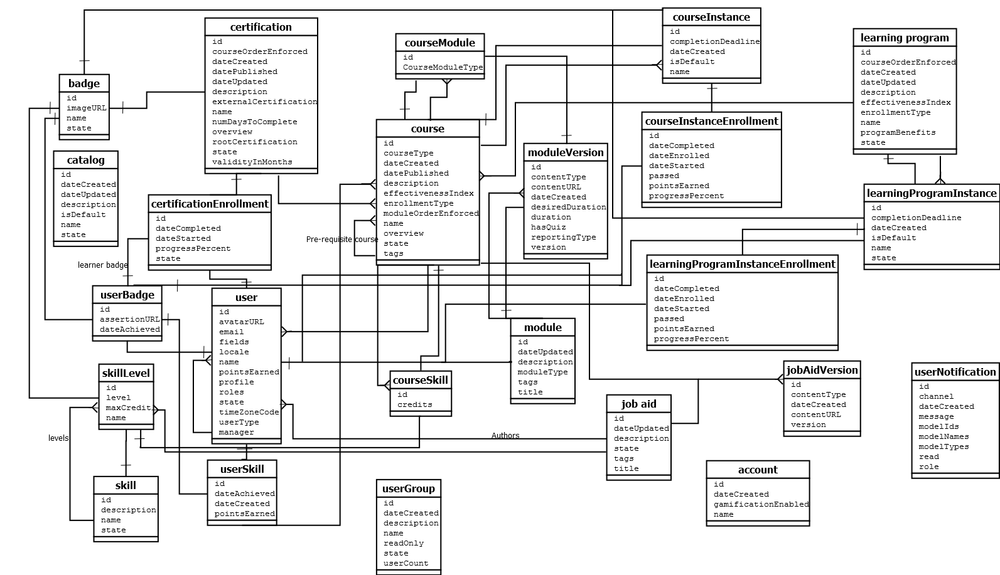

The following table describes various elements of the Learning Manager V1 object model: 

<table border="1" cellspacing="0" cellpadding="0">
 <tbody>
  <tr>
   <td>
    <p><strong>Serial No</strong></p></td>
   <td>
    <p><strong>Learning Manager Object</strong></p></td>
   <td>
    <p><strong>Description</strong></p></td>
  </tr>
  <tr>
   <td>
    <p>1.      </p></td>
   <td>
    <p>user</p></td>
   <td>
    <p>User is the key model in Learning Manager. Users are typically the internal or external learners of an organization who consume Learning Objects. However they may play some other roles such as author and Manager along with learner role. User id, type, email are some of the inline attributes. </p></td>
  </tr>
  <tr>
   <td>
    <p>2.      </p></td>
   <td>
    <p>course</p></td>
   <td>
    <p>Course is one of the Learning Objects supported in Learning Manager, that consists of one or more modules. </p></td>
  </tr>
  <tr>
   <td>
    <p>3.      </p></td>
   <td>
    <p>module</p></td>
   <td>
    <p>Module is a building block to create Learning Objects in Learning Manager. Modules can be of four different types such as Class room, virtual class room, activity and self-paced. Use this module model to get the details of all modules in an account. </p></td>
  </tr>
  <tr>
   <td>
    <p>4.      </p></td>
   <td>
    <p>certification</p></td>
   <td>
    <p>Certification is awarded to learners based on successful completion of courses. Courses are required in the application before you use certifications. </p></td>
  </tr>
  <tr>
   <td>
    <p>5.      </p></td>
   <td>
    <p>learning program</p></td>
   <td>
    <p>Learning programs are uniquely designed courses meeting specific learning requirements of users. Typically, learning programs are used to drive learning goals spanning across individual courses. </p></td>
  </tr>
  <tr>
   <td>
    <p>6.      </p></td>
   <td>
    <p>badge</p></td>
   <td>
    <p>Badge is a token of accomplishment that learners get when they reach specific milestones as they progress within a course. </p></td>
  </tr>
  <tr>
   <td>
    <p>7.      </p></td>
   <td>
    <p>skill</p></td>
   <td>
    <p>Skills model consists of levels and credits. Skills can be acquired by learners after relevant course completion. </p></td>
  </tr>
  <tr>
   <td>
    <p>8.      </p></td>
   <td>
    <p>certificationEnrollment</p></td>
   <td>
    <p>This model provides details of an enrollment by a user to a single certification.</p></td>
  </tr>
  <tr>
   <td>
    <p>9.  </p></td>
   <td>
    <p>courseEnrollment</p></td>
   <td>
    <p>This model provides details of an enrollment by a user to a single course. </p></td>
  </tr>
  <tr>
   <td>
    <p>10.  </p></td>
   <td>
    <p>courseInstance</p></td>
   <td>
    <p>A course can have one or many instances associated with it. You can get Course instance </p></td>
  </tr>
  <tr>
   <td>
    <p>11.  </p></td>
   <td>
    <p>courseSkill</p></td>
   <td>
    <p>A courseSkill model specifies the progress of a single skill that is achieved by completing a course.</p></td>
  </tr>
  <tr>
   <td>
    <p>12.  </p></td>
   <td>
    <p>courseModule</p></td>
   <td>A courseModule model specifies how a module is included  in a course. For instance, whether the module is used for pretest or for content.</td>
  </tr>
  <tr>
   <td>
    <p>13.  </p></td>
   <td>learningProgramInstance</td>
   <td>
    <p>A learning program can consist of multiple instances imbibing similar properties of a learning program or customized instances. </p></td>
  </tr>
  <tr>
   <td>
    <p>14.  </p></td>
   <td>
    <p>job aid</p></td>
   <td>
    <p>Job aid is a learning content accessible to learners without any enrollment or completion criteria. You can fetch, updated date, state, id information along with its related models such as job aid version, authors and skill level. </p></td>
  </tr>
  <tr>
   <td>
    <p>15.  </p></td>
   <td>
    <p>jobAidVersion</p></td>
   <td>
    <p>Job aid can have one or many versions associated to it based on number revisions in content and number of uploads. This model provides details of a single job aid version. </p></td>
  </tr>
  <tr>
   <td>
    <p>16.  </p></td>
   <td>
    <p>learningProgramInstanceEnrollment</p></td>
   <td>
    <p>Learning program consists of one or many instances. Learners can enroll to a learning program instance by themselves or assigned by administrator. This model provides details of an enrollment by a user to a single learning program instance. </p></td>
  </tr>
  <tr>
   <td>
    <p>17.  </p></td>
   <td>
    <p>moduleVersion</p></td>
   <td>
    <p>A module can have one or many versions based on its revised content uploads. Use this model to obtain specific info about any single module version. </p></td>
  </tr>
  <tr>
   <td>
    <p>18.  </p></td>
   <td>
    <p>skillLevel</p></td>
   <td>
    <p>A skill level comprises of one or many courses to be consumed in order to acquire a level along with its associated credits. </p></td>
  </tr>
  <tr>
   <td>
    <p>19.  </p></td>
   <td>
    <p>userBadge</p></td>
   <td>
    <p>UserBadge relates a single badge with a single user. It contains details such as when was it achieved, assertionUrl and so on. </p></td>
  </tr>
  <tr>
   <td>
    <p>20.  </p></td>
   <td>
    <p>userSkill</p></td>
   <td>
    <p>UserSkill indicates how much of a single skill level is achieved by a single user.</p></td>
  </tr>
 </tbody>
</table>

+++

+++V2 API

Following are the various elements of the Learning Manager class diagram in V2 API.

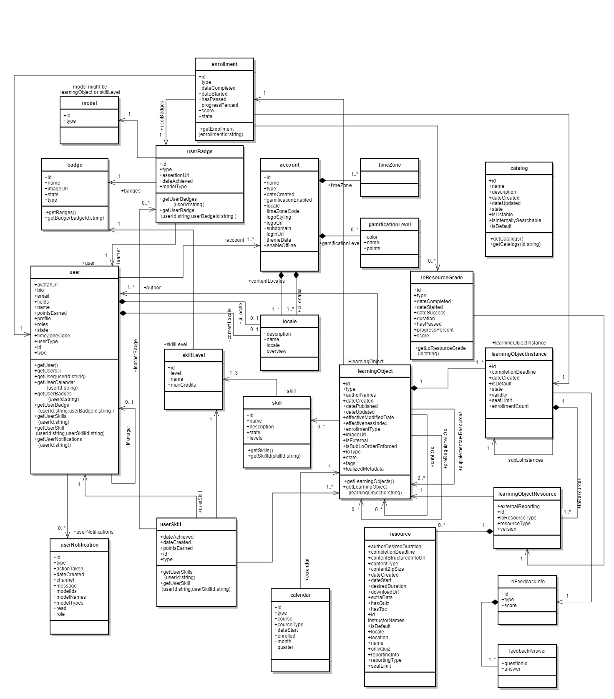

<table>
 <tbody>
  <tr>
   <th><b>Learning Manager Object</b></th>
   <th><b>Description</b></th>
  </tr>
  <tr>
   <td>account</td>
   <td>Encapsulates the details of a Learning Manager customer.</td>
  </tr>
  <tr>
   <td><code>
     badge
    </code></td>
   <td>Badge is a token of accomplishment that learners get when they reach specific milestones as they progress within a course. <br></td>
  </tr>
  <tr>
   <td><code>
     catalog
    </code></td>
   <td>Catalog is a collection of Learning Objects.</td>
  </tr>
  <tr>
   <td><code>
     user
    </code></td>
   <td>User is the key model in Learning Manager. Users are typically the internal or external learners of an organization who consume Learning Objects. However, they may play some other roles such as author and Manager along with learner role. User id, type, email are some of the inline attributes. </td>
  </tr>
  <tr>
   <td>resource</td>
   <td>This is used to model each content resource that a module seeks to encapsulate. All resources encapsulated within <code>
     an
    </code> <code>
     loResource
    </code> are equivalent in terms of the learning objective, but they differ from each other in terms of delivery type or content locale.<br></td>
  </tr>
  <tr>
   <td>userNotification</td>
   <td>This model contains notification information pertaining to a learner.<br></td>
  </tr>
  <tr>
   <td>userSkill</td>
   <td>UserSkill indicates how much of a single skill level is achieved by a single user.<br></td>
  </tr>
  <tr>
   <td>userBadge</td>
   <td>UserBadge relates a single badge <code>
     with
    </code> a single user. It contains details such as when was it achieved, <code>
     assertionUrl
    </code> and so on. <br></td>
  </tr>
  <tr>
   <td>skill</td>
   <td>Skills model consists of levels and credits. Skills can be acquired by learners after relevant course completion. <br></td>
  </tr>
  <tr>
   <td>skillLevel</td>
   <td>A skill level comprises of one or many courses to be consumed in order to acquire a level along with its associated credits. <br></td>
  </tr>
  <tr>
   <td>learningObject</td>
   <td>A Learning Object is an abstraction for various kinds of objects which users can enroll into and learn from. Currently Learning Manager has the four types of Learning Objects – Course, Certification, Learning Program <code>
     and
    </code> Job Aid.<br></td>
  </tr>
  <tr>
   <td>learningObjectInstance<br></td>
   <td>A specific instance of a learning object.<br></td>
  </tr>
  <tr>
   <td>learningObjectResource</td>
   <td>This is equivalent to the concept of <code>
     module
    </code>. A course is composed of one <code>
     of
    </code> more modules. In Learning Manager, a module can be delivered in a variety of equivalent ways. Therefore the <code>
     loResource
    </code> essentially encapsulates all those equivalent resources.<br></td>
  </tr>
  <tr>
   <td>loResourceGrade<br></td>
   <td>This encapsulates the outcome of the user consuming a specific resource in the context of a learning object he is enrolled into. It has information such as the duration spent by <code>
     user
    </code> in the resource, percentage progress made by the user, pass/fail status and the score obtained by the user in any associated quiz.<br></td>
  </tr>
  <tr>
   <td>calendar<br></td>
   <td>A calendar object is a list of <code>
     upcoming classroom
    </code> or virtual classroom courses that the user can enroll into.<br></td>
  </tr>
  <tr>
   <td>l1FeedbackInfo<br></td>
   <td>L1 Feedback encapsulates the answers provided by a learner for the feedback questions associated with Learning Objects. Typically this is collected after the user completes a Learning Object if configured to collect such feedback from learners.<br></td>
  </tr>
  <tr>
   <td>enrollment<br></td>
   <td>This abstraction encapsulates the details pertaining to the transaction representing the assignment of a specific user to a specific learning object instance.<br></td>
  </tr>
 </tbody>
</table>

+++

List of object attributes and relationships.

+++account

**Attributes** 
dateCreated  
gamificationEnabled  
id  
locale  
loginUrl  
logoUrl  
name  
subdomain  
themeData  
timeZoneCode

**Relationships** 
contentLocales(localizationMetadata)  
gamificationLevels(gamificationLevel)  
timeZones(timeZone)  
uiLocales(localizationMetadata)

+++

+++badge

**Attributes** 
id  
imageUrl  
name  
state

+++

+++catalog

**Attributes** 
dateCreated  
dateUpdated  
description  
id  
isDefault  
isInternallySearchable  
isListable  
name  
state

+++

+++data

**Attributes** 
id  
names

+++

+++gamification

**Attributes** 
color  
name  
points

+++

+++learningObject

**Attributes** 
authorNames  
dateCreated  
datePublished  
dateUpdated  
effectivenessIndex  
enrollmentType  
id  
imageUrl  
isExternal  
isSubLoOrderEnforced  
loType  
state  
tags

**Relationships** 
authors(user)  
enrollment(learningObjectInstanceEnrollment)  
instances(learningObjectInstance)  
prerequisiteLOs(learningObject)  
skills(learningObjectSkill)  
subLOs(learningObject)  
supplementaryLOs(learningObject)  
supplementaryResources(resource)

+++

+++learningObjectInstance

**Attributes** 
completionDeadline  
dateCreated  
enrollmentCount  
id  
isDefault  
seatLimit  
state  
validity

**Relationships** 
badge(badge)  
l1FeedbackInfo(feedbackInfo)  
learningObject(learningObject)  
loResources(learningObjectResource)  
localizedMetadata(localizationMetadata)  
subLoInstances(learningObjectInstance)

+++

+++learningObjectInstanceEnrollment

**Attributes** 
dateCompleted  
dateEnrolled  
dateStarted  
hasPassed  
id  
progressPercent  
score  
state

**Relationships** 
learner(user)  
learnerBadge(userBadge)  
learningObject(learningObject)  
loInstance(learningObjectInstance)  
loResourceGrades(learningObjectResourceGrade)

+++

+++learningObjectResource

**Attributes** 
externalReporting  
id  
loResourceType  
resourceType  
version

**Relationships** 
learningObject(learningObject)  
loInstance(learningObjectInstance)  
localizedMetadata(localizationMetadata)  
resources(resource)

+++

+++learningObjectResourceGrade

**Attributes** 
dateCompleted  
dateStarted  
dateSuccess  
duration  
hasPassed  
id  
progressPercent  
score

**Relationships** 
loResource(learningObjectResource)

+++

+++learningObjectSkill

**Attributes** 
credits  
id  
**Relationships** 
learningObject(learningObject)  
skillLevel(skillLevel)

+++

+++recommendation

**Attributes** 
id  
reason

**Relationships** 
learningObject(learningObject)

+++

+++resource

**Attributes** 
authorDesiredDuration  
completionDeadline  
contentStructureInfoUrl  
contentType  
contentZipSize  
contentZipUrl  
dateCreated  
dateStart  
desiredDuration  
downloadUrl  
extraData  
hasQuiz  
hasToc  
id  
instructorNames  
isDefault  
locale  
location  
name  
onlyQuiz  
reportingInfo  
reportingType  
seatLimit

+++

+++skill

**Attributes** 
description  
id  
name  
state

**Relationships** 
levels(skillLevel)

+++

+++skillLevel

**Attributes** 
id  
level  
maxCredits  
name  
**Relationships** 
badge(badge)  
skill(skill)

+++

+++user

**Attributes** 
avatarUrl  
bio  
contentLocale  
email  
fields  
id  
name  
pointsEarned  
profile  
roles  
state  
timeZoneCode  
uiLocale

**Relationships** 
account(account)  
manager(user)

+++

+++userBadge

**Attributes** 
assertionUrl  
dateAchieved  
id  
modelType

**Relationships** 
badge(badge)  
learner(user)  
model(learningObject)

+++

+++userCalendar

**Attributes** 
course  
courseType  
dateStart  
enrolled  
id  
month  
quarter

**Relationships** 
containerLO(learningObject)  
course(learningObject)

+++

+++userNotification

**Attributes** 
actionTaken  
channel  
dateCreated  
id  
message  
modelIds  
modelNames  
modelTypes  
read  
role

+++

+++userSkill

**Attributes** 
dateAchieved  
dateCreated  
id  
pointsEarned

**Relationships** 
learnerBadge(userBadge)  
learningObject(learningObject)  
skillLevel(skillLevel)  
user(user)

+++

## Application development process {#registration}

## Pre-requisites {#prerequisites}

As a developer you have to create a trial account on Learning Manager, so that you can have full access to all the roles within that account. To be able to write an application, a developer has to create some users and courses and get the account to a reasonable state so that the application being developed can have access to some sample data.

## Create client id and secret {#createclientidandsecret}

1. In **Integration Admin** login, click **[!UICONTROL Applications]** on the left pane. 

   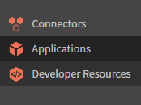

   *Select Applications on Integration Admin*

1. Click **[!UICONTROL Register]** at the upper-right corner of the page to register your application details. Registration page appears. 

   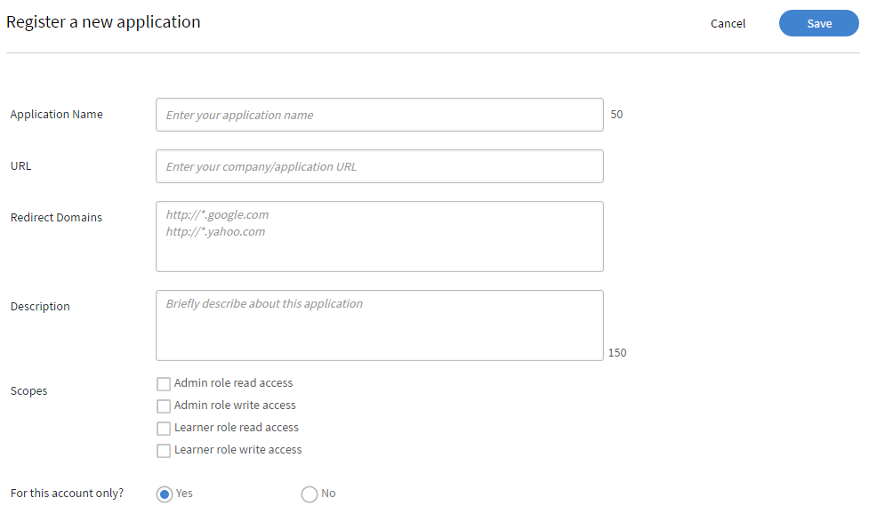

   *Register the application*

   It is mandatory to fill up all the fields in this page. 

   **Application Name**: Enter your application name. It is not mandatory to use the same application name, it can be any valid name. 

   **URL**: If you know the exact URL where the application is hosted, you can mention it. If you are not aware, then you can mention your company URL. Valid URL name is mandatory in this field. 

   **Redirect Domains**: Enter the domain name of the application where you want the Learning Manager application to redirect after OAuth authentication. You can mention multiple URLs here but you have to use the valid URLs such as `http://google.com`, `http://yahoo.com` and so on. 

   **Description:** Enter the brief description for your application. 

   **Scopes:** Choose one of the four available options to define the scope of your application. Based on your choice mentioned here, Learning Manager API endpoint are accessible for your application. For example, If you chose **Learner role read access**, then all the Learning Manager learner API end points are read-only accessible to your application. 

   **For this account only?**   
   **Yes** - if you choose Yes, then the application is not visible to other account administrators.  
   **No** - if you choose No, other account admins can also access this application but they need to use the application id to access this application. Application id is generated and displayed in Learning Manager application Edit mode. 

   If you choose **Admin role read and write access** as scope while registering the application and choose **Admin role read access** while authoring the APIs, you can still have write access for the application as the app registration scope supersedes the authorization workflow. 

1. Click **[!UICONTROL Register]** at the upper-right corner after filling up the details in the registration page.

## Application development and testing {#applicationdevelopmentandtesting}

The Learning Manager API can be used by developers to build any application. Developers have to ensure that their accounts consist of some valid users and courses. They can create a few dummy users and courses and simulate activity in the trial account, so that they can test functionality of the application.

## Application deployment {#applicationdeployment}

We recommend that the Learning Manager Administrator or an Integration Administrator for the production account, to take ownership of making the application available to users within their organization. Once the application has been tested and is considered ready for production, inform the administrator of the production account. Ideally, the administrators want to generate a new client-id and client-secret for the application in the production account, and perform the necessary steps to incorporate them inside the application in a secure manner. The actual procedure for deploying applications varies from enterprise to enterprise, and the Learning Manager Administrator of your organization has to take support from the IT/IS department within your organization to complete the deployment.

## External application approval {#externalapplicationapproval}

You can add external applications by clicking **Approve** at the upper-right corner of the **Applications** page. Provide the external application id and click **Save.**

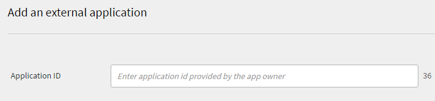

*Add and approve an external application*

## Frequently Asked Questions

+++Does Learning Manager have an E-commerce integration?

Adobe Learning Manager does not have an E-commerce integration. However, we provide APIs so that you can create your own headless LMS and implement E-commerce features.
+++
-->
