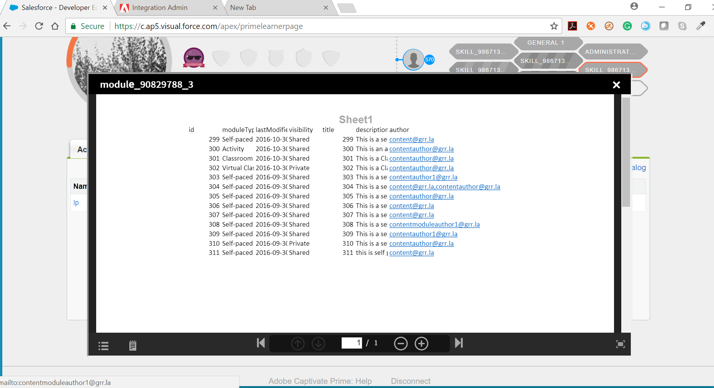

# 內嵌式流體播放器

閱讀本文章，瞭解如何將流體播放器內嵌在自訂應用程式中。

作為企業，您現在甚至可以在Learning Manager之外為學習者提供自訂體驗。 使用公用API，您可以擷取與學習物件、學習者註冊和學習進度相關的所有資訊，並在您的網站上顯示。 更重要的是，您甚至可以在網站中內嵌Learning Manager的流體播放器，讓學習者直接在您的網站中使用內容。 流體播放器可讓您播放Learning Manager支援的任何內容。 內嵌於您自己的網站時，其功能與Learning Manager中的完全相同。

**播放任何電子學習內容[&#128279;](../../learners/feature-summary/fluidic-player.md#main-pars_text_779047019)**

Fluidic播放器能以一致且直覺的方式播放幾乎任何型別的電子學習內容，無需使用任何外掛程式或下載。 學習者可以啟動內容，而且無論內容檔案型別為何，都會開始播放。

**筆記與書籤**

您可以記下筆記並將任何內容加入書籤，無論其檔案型別為何。 如果您想從長檔案或視訊中選取特定專案，您可以將找到所需相關資訊的那些點加入書籤。 附註和書籤可以電子郵件形式搜尋或傳送。 按一下註解可將您直接在視訊或檔案頁面所在的位置進入流體播放器。

如需流體播放器的詳細資訊，請參閱[流體播放器](../../learners/feature-summary/fluidic-player.md)。

以下是一些使用內嵌式流體播放器的範例。

* 您可以使用 **&#x200B; **&#x200B;網站中的內嵌式流體播放器來列出您員工的已註冊課程，並提供在相同頁面上啟動培訓的連結。 這表示您的學習者可在您的內部網路網站上參加培訓。

* 如果您從事培訓業務，可能會有客戶購買課程的網站。 您可以將內嵌式播放器整合到相同網站，讓客戶可以使用他們在網站內購買的內容。

## 將流體播放器內嵌到網站中的步驟 {#stepstoembedfluidicplayerinyourwebsite}

建置自訂應用程式以內嵌您的網站流體播放器需要三個基本步驟：

1. 在Learning Manager的整合管理應用程式中建立應用程式。
1. 擷取存取權杖。
1. 使用存取權杖，使用公用API從Learning Manager擷取資源。

### 1.在整合管理中建立應用程式 {#1createanapplicationinintegrationadmin}

此步驟需要建立應用程式/使用者端ID和應用程式/使用者端密碼，用於擷取重新整理權杖和存取權杖。 如需建立應用程式的詳細資訊，請參閱[應用程式開發程式。](developer-manual.md#main-pars_header_994876235)

1. 前往&#x200B;**[!UICONTROL IntegrationAdmin]**&#x200B;應用程式並開啟&#x200B;**[!UICONTROL Applications]**。

1. 從頁面的右上角選取&#x200B;**[!UICONTROL Register]**。
1. **[!UICONTROL Register a new application]**&#x200B;視窗隨即開啟。 填寫必填欄位。
1. 如果自訂應用程式需要跨多個帳戶共用，請在選項欄位&#x200B;**[!UICONTROL For this account only?]**&#x200B;中選取&#x200B;**[!UICONTROL No]**
1. 若要儲存應用程式並產生您的應用程式ID和密碼，請按一下&#x200B;**[!UICONTROL Save]**。

### 2.擷取存取權杖 {#2retrievingaccesstoken}

由於Learning Manager使用OAUTH2.0，因此需使用存取權杖才能使用公用API擷取資源。 存取權杖可使用重新整理權杖、使用者端ID或使用者端密碼來擷取。

**2.1重新整理Token**

* 擷取OAuth程式碼

需要OAuth程式碼才能擷取重新整理權杖。 使用以下URL登入時，Learning Manager會將使用者重新導向至具有OAuth程式碼的重新導向URL （範例應用程式的「oauthredirect.html」檔案中就範例說明了OAuth程式碼擷取）：

```
code https://learningmanager.adobe.com/oauth/o/authorize  
client_id= <application_id>  
&redirect_uri=<redirect_uri>  
&state=<dummy_data>  
&scope=learner:read,learner:write  
&response_type=CODE  
&account=<account_id>  
&email=<email_id>
```

在此，**[!UICONTROL client id]**&#x200B;是在步驟1中取得的應用程式ID。
**[!UICONTROL redirect_url]**&#x200B;是在步驟1中設定的redirect_url。
**[!UICONTROL state]**&#x200B;是任何虛擬資料，我們需要根據這些資料篩選重新導向URL以取得OAuth程式碼。 範圍是在步驟1中設定的學習者範圍。
**[!UICONTROL response_typ]**&#x200B;e一律為「代碼」。\
**[!UICONTROL account]**&#x200B;是選用欄位\
**[!UICONTROL email]**&#x200B;是選用欄位\
&#42;如果同時提供帳戶ID和電子郵件，上述URL將允許使用者登入相同的帳戶。 此端點範例在範例應用程式的「index.html」檔案中描述。

* 擷取重新整理Token

收到OAuth代碼後，即可使用從以下端點收到的OAuth代碼、使用者端ID和使用者端密碼來擷取重新整理權杖：

**https://learningmanager.adobe.com/oauth/token**

在回覆您的post要求時，您將會收到下列內容：

i. refresh_token\
二、 access_token\
三、 user_id\
iv. expires_in\
v. user_role\
vi. account_id

**2.2正在從重新整理權杖擷取存取權杖**

若要擷取您的存取Token，請使用您的refresh_token、client_id和client_secret將另一個要求作為貼文本文傳送至以下URL：

**https://learningmanager.adobe.com/oauth/token/refresh**

在回覆您的post要求時，您將會收到下列內容：\
i. refresh_token\
二、 access_token\
三、 user_id\
iv. expires_in\
v. user_role\
vi. account_id

### 3.使用公用api擷取資源 {#3retrieveresourcesusingpublicapi}

第三個步驟是使用存取權杖，使用公用api從Learning Manager中擷取資源。  發出任何公開api呼叫需要存取權杖，並需要新增到標頭中，如範例應用程式所示。

## 內嵌式播放器 {#embeddableplayer}

協力廠商應用程式可使用內嵌式播放器來播放學習物件的內容。

**在可內嵌的播放器中開啟課程**

1. 建立可內嵌的URL

   若要使用內嵌式播放器開啟課程，您需要建立可內嵌的URL，如下所示：

   `https://learningmanager.adobe.com/app/player?lo_id=<v2-api course id>&access_token=<access_token>`

   在這裡， lo_id必須符合V2 API課程ID格式。

   範例： `https://learningmanager.adobe.com/app/player?lo_id=course:123456&access_token=45b269b75ac65d6696d53617f512450f`

   認證、學習計畫和工作輔助也可在內嵌播放器中播放。

   範例： `https://learningmanager.adobe.com/app/player?lo_id=certification:12345&access_token=c1a4847dfbf4007826a027d481b93c1e`

   `https://learningmanager.adobe.com/app/player?lo_id=learningProgram:12345&access_token=c1a4847dfbf4007826a027d481b93c1e`

   `https://learningmanager.adobe.com/app/player?lo_id=jobAid:1234&access_token=c1a4847dfbf4007826a027d481b93c1e`

1. 在iframe的「src」屬性中設定此URL。

**正在關閉內嵌式播放器**

```
code window.addEventListener("message", function closePlayer(){  
   if(event.data === "status:close"){  
     //handle closing event  
   }  
});
```

## 範例應用程式教學課程 {#sampleapplicationtutorial}

附加的pdf檔案包含範例應用程式教學課程。
[內嵌流體播放器的範例教學課程和教學課程來源。](assets/sample-applicationtutorial.zip)個替代內容

如果您是管理員，您可以透過在流體播放器內為學習者提供替代內容的方式來設定課程材料。 例如，如果您的不同地理位置的學習者想使用多種語言，您可以用多種語言建立相同的內容。 流體播放器會向學習者提供設定語言，但學習者也可選擇從播放器內直接切換至替代語言。

視訊專用控制項

Learning Manager流體播放器使用的串流技術可為其學習者提供視訊播放體驗，在開始視訊時不會有任何延遲，並且任何裝置上的磁碟空間皆不需要。 流體播放器也提供智慧型控制功能，例如播放速度(1x、1.5x)和略過+-10秒，這些功能可讓學習者獲得與其學習速度相符所需的精確控制級別。

這項工作必須由您IT團隊的人員或外部顧問負責進行，他們可建立應用程式，然後託管在您的網站上。

1. 修改Learning Manager內嵌式播放器URL，使其包含指向需擷取的正確學習物件的引數。

   URL： [https://learningmanager.adobe.com/app/player](https://cpcontents.adobe.com/public/embedplayer/index22fa615ec2baa034a22090c8cd4289fa.html)

1. 使用下列任一引數啟動課程：

   * course_id ：這是要啟動的課程ID
   * learning_program_id ：這是要啟動的學習計畫ID
   * certification_id ：這是要啟動的認證識別碼
   * lo_id ：要播放的學習物件（課程/學習方案/認證/工作輔助）的識別碼


1. 使用存取權杖作為必要引數。

   * access_token ：這是安全性引數，請使用公開API oauth   存取權杖

   您可以在整合管理員中設定內嵌式流體播放器，取得您的Token。 您可以取得您的驗證Token，將其當作存取權杖使用。

   建立的URL範例； https://learningmanager.adobe.com/app/player?lo_id=&quot;+lo_id+&quot;&amp;access_token=&quot;+accToken

   在這裡， lo_id將是課程、學習計畫、認證和工作輔助的識別碼。

   lo_id範例 — 課程：21324，學習方案：2143，認證：23432，工作輔助：237

1. 發出Learning Manager API呼叫以擷取上述引數。

   這些API呼叫將由您的IT團隊/顧問所撰寫並在您的網站上託管的應用程式進行。

   如需有關使用API的詳細資訊，請參閱此處：

   Learning Manager V1 API - [https://learningmanager.adobe.com/docs/primeapi/v1/](https://learningmanager.adobe.com/docs/primeapi/v1/)


   Learning Manager V2 API - [https://learningmanager.adobe.com/docs/primeapi/v2/](https://learningmanager.adobe.com/docs/primeapi/v2/)

   物件的ID與V1和V2 API不同。 內嵌式播放器需要v2格式的ID。 在V2中使用ID對應API從V1 ID轉換為V2 ID。

   建構URL後，應用程式將其用於向學習者顯示的一種方式是將其放在iFrame中。 按一下此連結會啟動含有特定課程內容之流體播放器。

   

   若要檢查進度和完成報表，請登入Learning Manager。

   當學習者關閉播放器時，流體播放器會使用html5 postMessage傳送「關閉」訊息給上層元素。 載入控制器應處理此訊息並繼續。

修改Learning Manager內嵌式播放器URL，使其包含指向需擷取的正確學習物件的引數。

URL： [https://learningmanager.adobe.com/app/player](https://learningmanager.adobe.com/app/player)

下列任一引數都可用來啟動課程：

* course_id ：這是要啟動的課程ID
* learning_program_id ：這是要啟動的學習計畫ID
* certification_id ：這是要啟動的認證識別碼
* lo_id ：要播放的學習物件（課程/學習方案/認證/工作輔助）的識別碼

必要引數：

* access_token ：這是安全性引數，請使用公開API oauth   存取權杖

發出Learning Manager API呼叫以擷取上述引數。 這些API呼叫將由您的IT團隊/顧問所撰寫並在您的網站上託管的應用程式進行。

如需有關使用API的詳細資訊，請參閱此處：

Learning Manager V1 API - [https://learningmanager.adobe.com/docs/primeapi/v1/](https://learningmanager.adobe.com/docs/primeapi/v1/)


Learning Manager V2 API - [https://learningmanager.adobe.com/docs/primeapi/v2/](https://learningmanager.adobe.com/docs/primeapi/v2/)


